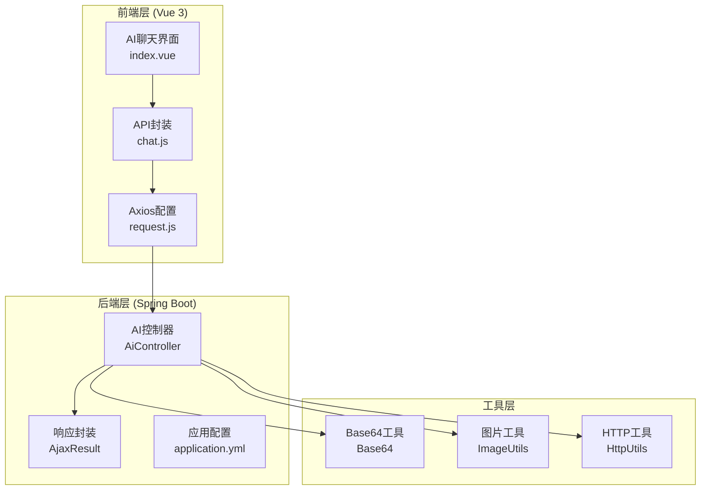
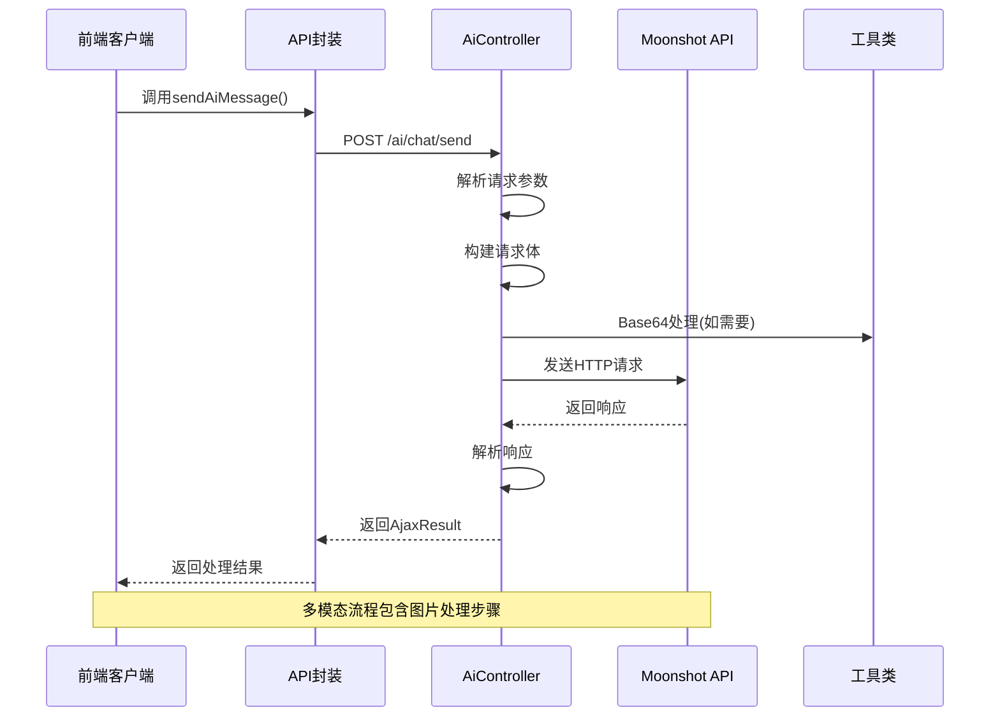
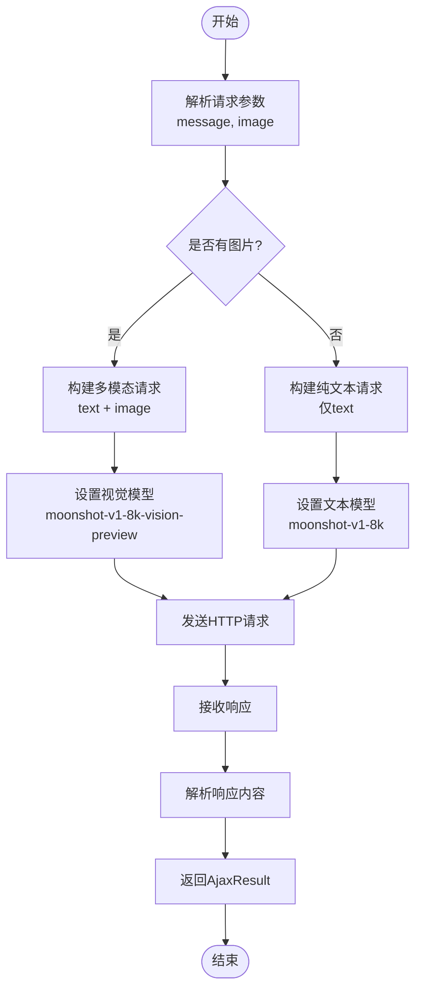
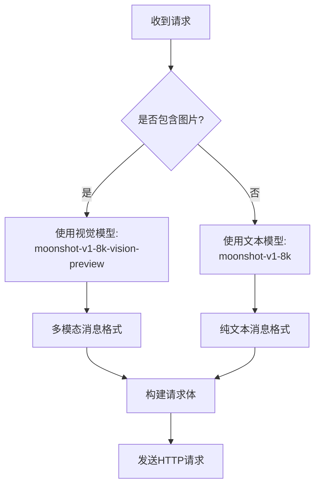
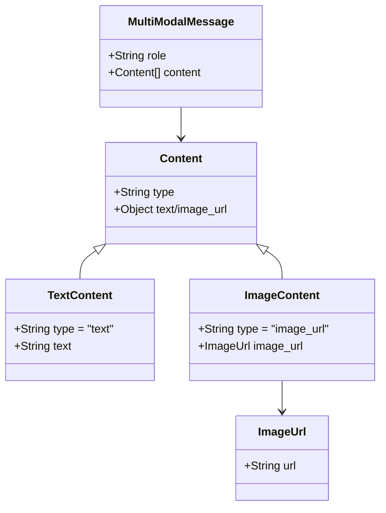
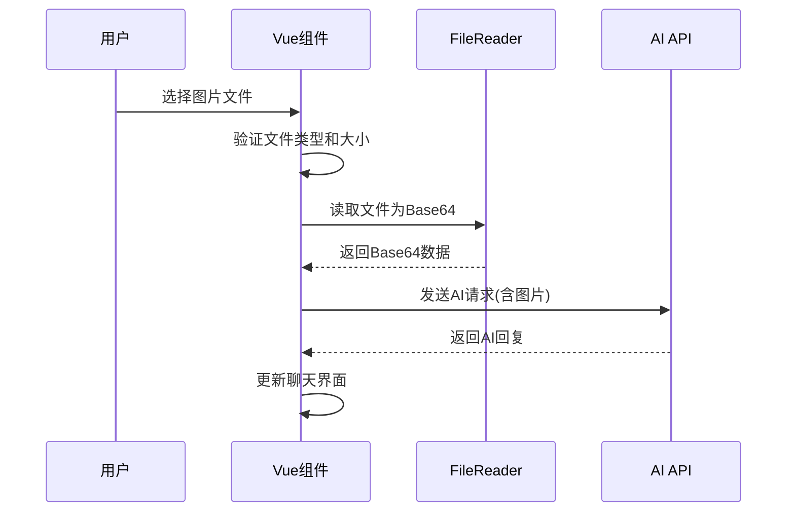
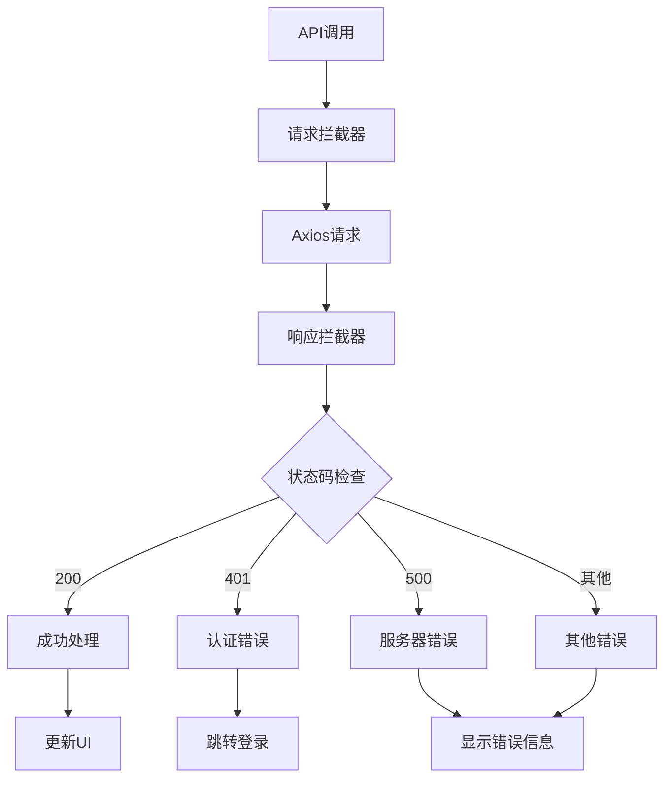
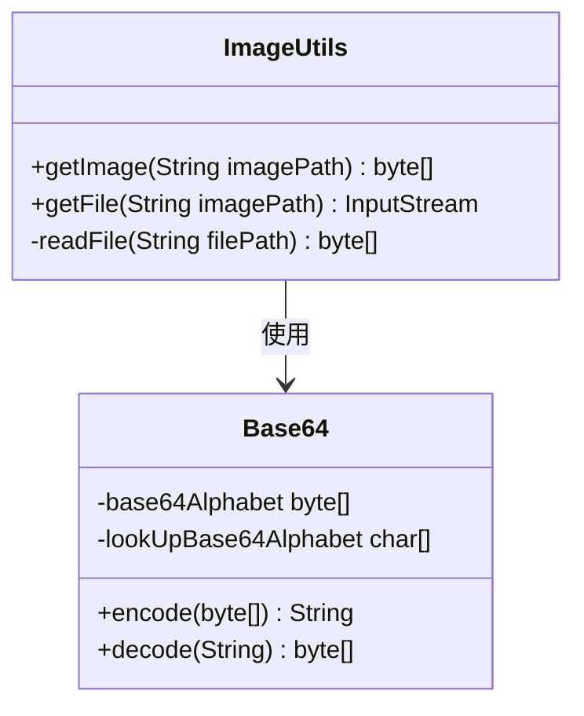
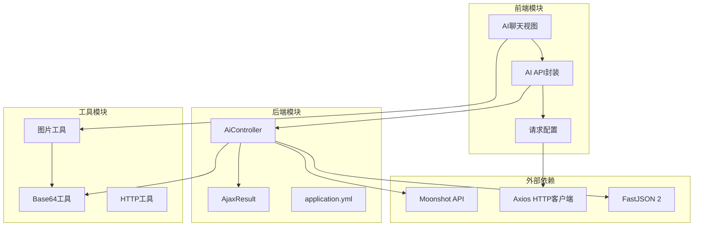
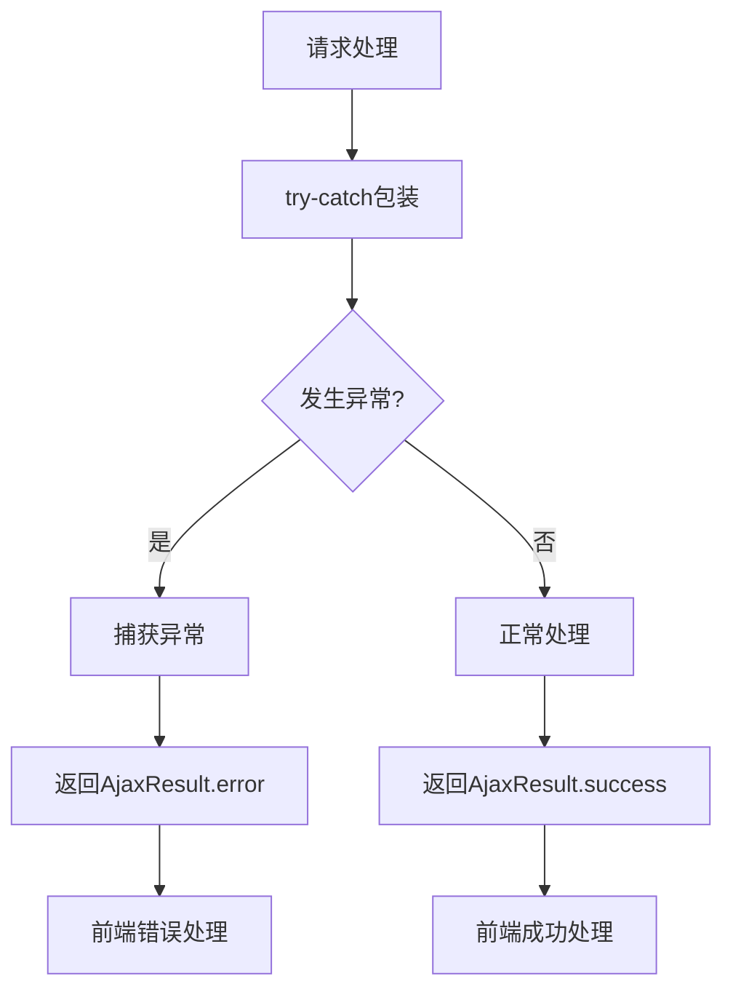

# AI API集成架构

<cite>
**本文档引用的文件**
- [AiController.java](file://XingChen-Vue/xingchen-admin/src/main/java/com/xingchen/web/controller/al/AiController.java)
- [index.vue](file://XingChen-Vue3/src/views/ai/chat/index.vue)
- [chat.js](file://XingChen-Vue3/src/api/ai/chat.js)
- [request.js](file://XingChen-Vue3/src/utils/request.js)
- [AjaxResult.java](file://XingChen-Vue/xingchen-common/src/main/java/com/xingchen/common/core/domain/AjaxResult.java)
- [application.yml](file://XingChen-Vue/xingchen-admin/src/main/resources/application.yml)
- [Base64.java](file://XingChen-Vue/xingchen-common/src/main/java/com/xingchen/common/utils/sign/Base64.java)
- [ImageUtils.java](file://XingChen-Vue/xingchen-common/src/main/java/com/xingchen/common/utils/file/ImageUtils.java)
- [HttpUtils.java](file://XingChen-Vue/xingchen-common/src/main/java/com/xingchen/common/utils/http/HttpUtils.java)
</cite>

## 目录
1. [简介](#简介)
2. [项目结构](#项目结构)
3. [核心组件](#核心组件)
4. [架构概览](#架构概览)
5. [详细组件分析](#详细组件分析)
6. [依赖关系分析](#依赖关系分析)
7. [性能考虑](#性能考虑)
8. [故障排除指南](#故障排除指南)
9. [结论](#结论)

## 简介

本项目实现了基于Kimi (Moonshot)大模型API的AI助手功能，提供了完整的多模态对话能力，包括纯文本对话和图像识别分析。系统采用前后端分离架构，后端使用Spring Boot提供RESTful API服务，前端使用Vue 3构建交互式聊天界面。

该AI集成架构支持：
- 纯文本对话模式
- 多模态图像识别模式
- Base64图片处理
- 动态模型选择策略
- 完善的错误处理机制
- 性能优化和安全防护

## 项目结构

项目采用典型的MVC架构模式，主要分为以下层次：

**图表来源**
- [AiController.java:1-165](file://XingChen-Vue/xingchen-admin/src/main/java/com/xingchen/web/controller/al/AiController.java#L1-L165)
- [index.vue:1-527](file://XingChen-Vue3/src/views/ai/chat/index.vue#L1-L527)

**章节来源**
- [AiController.java:1-165](file://XingChen-Vue/xingchen-admin/src/main/java/com/xingchen/web/controller/al/AiController.java#L1-L165)
- [index.vue:1-527](file://XingChen-Vue3/src/views/ai/chat/index.vue#L1-L527)

## 核心组件

### AI控制器 (AiController)

后端的核心控制器，负责处理AI相关的HTTP请求，实现与Kimi API的集成。

**关键特性：**
- 支持纯文本和多模态两种对话模式
- 动态模型选择策略
- 完整的请求参数验证
- 错误处理和响应封装

### 前端聊天界面 (index.vue)

提供用户友好的AI聊天体验，支持图片上传和实时对话。

**核心功能：**
- 图片Base64转换
- 实时消息展示
- 输入验证和限制
- 加载状态管理

### API封装 (chat.js)

前端API调用的统一入口，提供简洁的函数接口。

**主要方法：**
- `sendAiMessage(data)` - 发送AI消息
- 参数验证和错误处理

**章节来源**
- [AiController.java:37-93](file://XingChen-Vue/xingchen-admin/src/main/java/com/xingchen/web/controller/al/AiController.java#L37-L93)
- [index.vue:182-227](file://XingChen-Vue3/src/views/ai/chat/index.vue#L182-L227)

## 架构概览

系统采用分层架构设计，确保各层职责清晰，便于维护和扩展。

**图表来源**
- [AiController.java:37-134](file://XingChen-Vue/xingchen-admin/src/main/java/com/xingchen/web/controller/al/AiController.java#L37-L134)
- [chat.js:4-10](file://XingChen-Vue3/src/api/ai/chat.js#L4-L10)

## 详细组件分析

### 后端AiController实现详解

#### sendMessage方法工作流程

**图表来源**
- [AiController.java:38-93](file://XingChen-Vue/xingchen-admin/src/main/java/com/xingchen/web/controller/al/AiController.java#L38-L93)

#### 请求参数解析策略

| 参数名称 | 类型 | 必填 | 默认值 | 描述 |
|---------|------|------|--------|------|
| message | String | 否 | "你好" | 用户输入的文本内容 |
| image | String | 否 | null | Base64编码的图片数据 |

#### 模型选择策略

**图表来源**
- [AiController.java:50-74](file://XingChen-Vue/xingchen-admin/src/main/java/com/xingchen/web/controller/al/AiController.java#L50-L74)

#### 多模态消息格式设计

当检测到图片输入时，系统构建符合Moonshot API规范的多模态消息：

**图表来源**
- [AiController.java:53-69](file://XingChen-Vue/xingchen-admin/src/main/java/com/xingchen/web/controller/al/AiController.java#L53-L69)

**章节来源**
- [AiController.java:38-163](file://XingChen-Vue/xingchen-admin/src/main/java/com/xingchen/web/controller/al/AiController.java#L38-L163)

### 前端集成实现

#### 图片处理流程

**图表来源**
- [index.vue:146-165](file://XingChen-Vue3/src/views/ai/chat/index.vue#L146-L165)

#### 响应处理机制

前端通过统一的Axios拦截器处理所有API响应：

**图表来源**
- [request.js:75-124](file://XingChen-Vue3/src/utils/request.js#L75-L124)

**章节来源**
- [index.vue:182-227](file://XingChen-Vue3/src/views/ai/chat/index.vue#L182-L227)
- [request.js:14-21](file://XingChen-Vue3/src/utils/request.js#L14-L21)

### 工具类支持

#### Base64处理工具

系统提供了完整的Base64编解码工具，用于处理图片数据转换：

| 方法 | 功能 | 参数 | 返回值 |
|------|------|------|--------|
| `encode(byte[])` | 编码Base64 | 二进制数据 | Base64字符串 |
| `decode(String)` | 解码Base64 | Base64字符串 | 二进制数据 |
| `isData(char)` | 验证字符 | 字符 | 布尔值 |

#### 图片处理工具

**图表来源**
- [ImageUtils.java:21-53](file://XingChen-Vue/xingchen-common/src/main/java/com/xingchen/common/utils/file/ImageUtils.java#L21-L53)
- [Base64.java:83-154](file://XingChen-Vue/xingchen-common/src/main/java/com/xingchen/common/utils/sign/Base64.java#L83-L154)

**章节来源**
- [Base64.java:1-292](file://XingChen-Vue/xingchen-common/src/main/java/com/xingchen/common/utils/sign/Base64.java#L1-L292)
- [ImageUtils.java:1-53](file://XingChen-Vue/xingchen-common/src/main/java/com/xingchen/common/utils/file/ImageUtils.java#L1-L53)

## 依赖关系分析

系统采用模块化设计，各组件间依赖关系清晰：

**图表来源**
- [AiController.java:3-6](file://XingChen-Vue/xingchen-admin/src/main/java/com/xingchen/web/controller/al/AiController.java#L3-L6)
- [chat.js:1](file://XingChen-Vue3/src/api/ai/chat.js#L1)

**章节来源**
- [application.yml:1-148](file://XingChen-Vue/xingchen-admin/src/main/resources/application.yml#L1-L148)

## 性能考虑

### 前端性能优化

1. **图片大小限制**: 限制上传图片不超过5MB，避免内存溢出
2. **Base64转换**: 使用FileReader异步转换，不阻塞主线程
3. **虚拟滚动**: 长消息列表使用虚拟滚动提升渲染性能
4. **懒加载**: 图片预览采用懒加载策略

### 后端性能优化

1. **连接池配置**: Tomcat最大线程数800，连接数满后排队1000
2. **请求超时**: HTTP请求超时时间10秒
3. **内存管理**: 及时释放BufferedReader资源
4. **错误快速失败**: 异常情况立即返回，避免长时间占用

### 缓存策略

系统集成了Redis缓存配置，可用于存储：
- 用户会话信息
- API调用频率限制
- 常用配置参数

**章节来源**
- [application.yml:23-33](file://XingChen-Vue/xingchen-admin/src/main/resources/application.yml#L23-L33)
- [application.yml:72-94](file://XingChen-Vue/xingchen-admin/src/main/resources/application.yml#L72-L94)

## 故障排除指南

### 常见问题及解决方案

#### API密钥问题
- **症状**: "AI服务调用失败: 401 Unauthorized"
- **原因**: API密钥无效或过期
- **解决方案**: 检查API密钥配置，确保Bearer前缀正确

#### 图片上传问题
- **症状**: 图片无法上传或显示空白
- **原因**: 文件类型不支持或大小超限
- **解决方案**: 确认文件为图片格式且小于5MB

#### 网络连接问题
- **症状**: 请求超时或连接失败
- **原因**: 网络不稳定或API服务不可用
- **解决方案**: 检查网络连接，重试请求

### 错误处理机制

系统实现了多层次的错误处理：

**图表来源**
- [AiController.java:89-92](file://XingChen-Vue/xingchen-admin/src/main/java/com/xingchen/web/controller/al/AiController.java#L89-L92)

**章节来源**
- [AjaxResult.java:133-171](file://XingChen-Vue/xingchen-common/src/main/java/com/xingchen/common/core/domain/AjaxResult.java#L133-L171)

## 结论

本AI API集成架构实现了完整的多模态对话功能，具有以下特点：

**技术优势：**
- 清晰的分层架构设计
- 完善的错误处理机制
- 高效的性能优化策略
- 安全可靠的API集成方案

**扩展性考虑：**
- 模块化设计便于功能扩展
- 统一的错误处理便于维护
- 灵活的配置管理支持环境切换

**最佳实践建议：**
1. 生产环境中使用环境变量管理API密钥
2. 实施更严格的输入验证和过滤
3. 添加API调用监控和日志记录
4. 考虑实现请求限流和防刷机制

该架构为健康管理系统提供了强大的AI助手功能，能够满足用户多样化的健康咨询需求，为后续功能扩展奠定了坚实的技术基础。