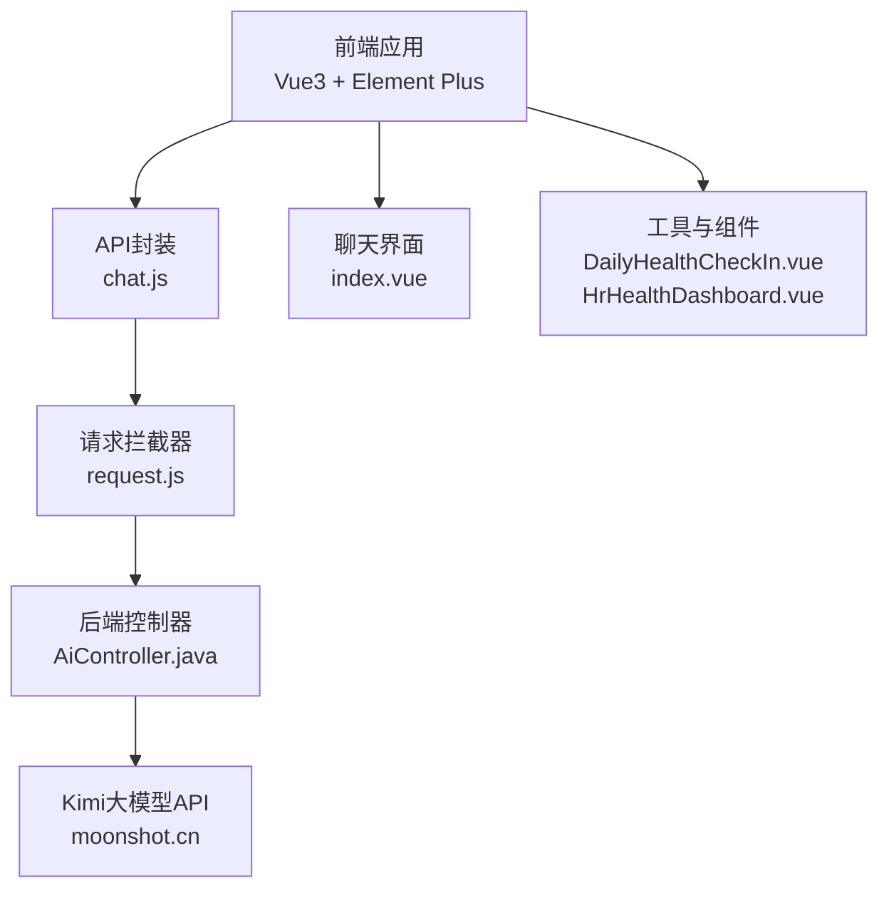
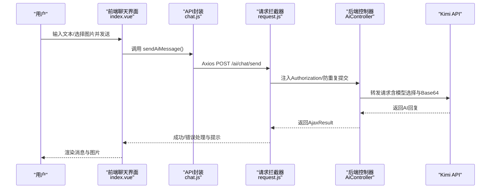
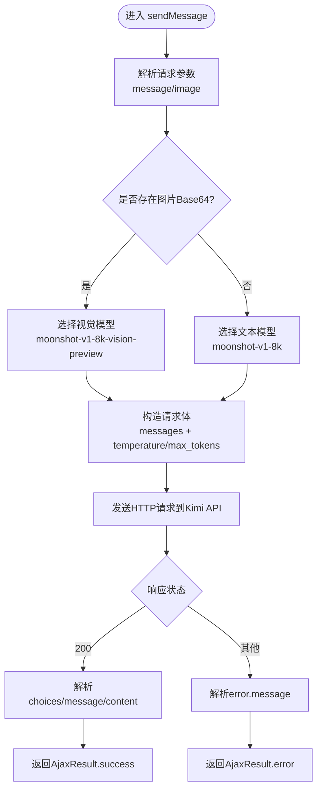
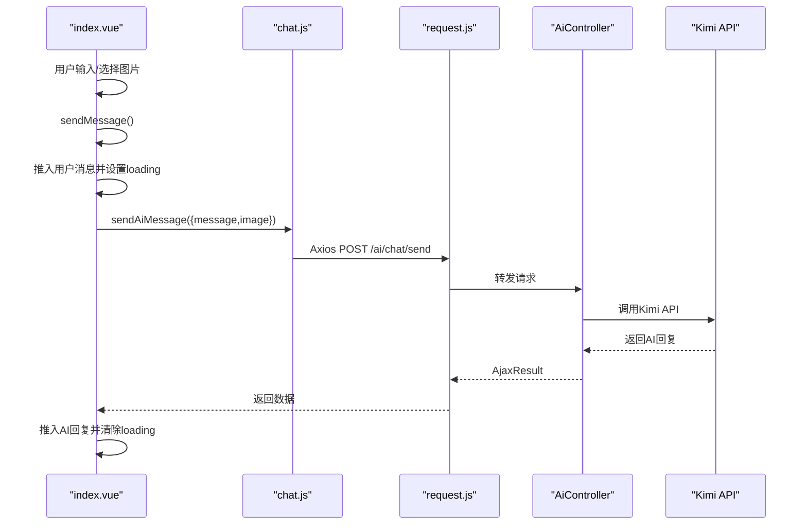
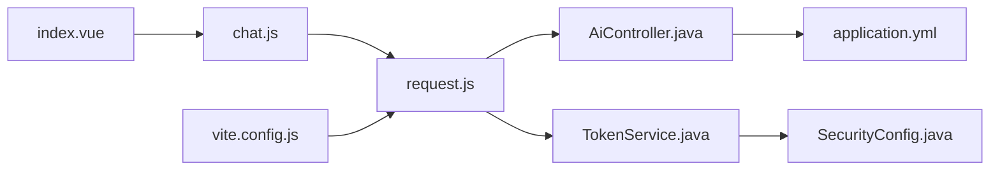

# AI健康助手

<cite>
**本文引用的文件**
- [AiController.java](file://XingChen-Vue\xingchen-admin\src\main\java\com\xingchen\web\controller\al\AiController.java)
- [index.vue](file://XingChen-Vue3\src\views\ai\chat\index.vue)
- [chat.js](file://XingChen-Vue3\src\api\ai\chat.js)
- [request.js](file://XingChen-Vue3\src\utils\request.js)
- [vite.config.js](file://XingChen-Vue3\vite.config.js)
- [application.yml](file://XingChen-Vue\xingchen-admin\src\main\resources\application.yml)
- [TokenService.java](file://XingChen-Vue\xingchen-framework\src\main\java\com\xingchen\framework\web\service\TokenService.java)
- [SecurityConfig.java](file://XingChen-Vue\xingchen-framework\src\main\java\com\xingchen\framework\config\SecurityConfig.java)
- [HrHealthDashboard.vue](file://XingChen-Vue3\src\views\hr\HrHealthDashboard.vue)
- [DailyHealthCheckIn.vue](file://XingChen-Vue3\src\components\DailyHealthCheckIn.vue)
</cite>

## 目录
1. [简介](#简介)
2. [项目结构](#项目结构)
3. [核心组件](#核心组件)
4. [架构总览](#架构总览)
5. [详细组件分析](#详细组件分析)
6. [依赖关系分析](#依赖关系分析)
7. [性能考虑](#性能考虑)
8. [故障排查指南](#故障排查指南)
9. [结论](#结论)
10. [附录](#附录)

## 简介
本项目为“AI健康助手”模块，提供多模态AI集成能力，支持文本对话与图片分析（Base64），基于Kimi大模型API实现智能问答与辅助诊断建议。后端AiController负责接收前端请求、构造Kimi请求体、转发至第三方API并解析响应；前端聊天界面提供消息渲染、图片上传与Base64转换、输入控制与加载态展示，并通过统一请求封装与拦截器实现鉴权、防重复提交与错误提示。

## 项目结构
- 前端（Vue3）位于 XingChen-Vue3，包含聊天界面、API封装、请求拦截器与构建配置。
- 后端（Spring Boot）位于 XingChen-Vue\xingchen-admin，包含AiController与框架配置。
- 健康看板与日常健康打卡组件作为系统其他功能模块存在，便于与AI助手联动展示。

**图表来源**
- [index.vue:1-527](file://XingChen-Vue3\src\views\ai\chat\index.vue#L1-L527)
- [chat.js:1-11](file://XingChen-Vue3\src\api\ai\chat.js#L1-L11)
- [request.js:1-154](file://XingChen-Vue3\src\utils\request.js#L1-L154)
- [AiController.java:1-165](file://XingChen-Vue\xingchen-admin\src\main\java\com\xingchen\web\controller\al\AiController.java#L1-L165)
- [DailyHealthCheckIn.vue:1-281](file://XingChen-Vue3\src\components\DailyHealthCheckIn.vue#L1-L281)
- [HrHealthDashboard.vue:1-208](file://XingChen-Vue3\src\views\hr\HrHealthDashboard.vue#L1-L208)

**章节来源**
- [index.vue:1-527](file://XingChen-Vue3\src\views\ai\chat\index.vue#L1-L527)
- [chat.js:1-11](file://XingChen-Vue3\src\api\ai\chat.js#L1-L11)
- [request.js:1-154](file://XingChen-Vue3\src\utils\request.js#L1-L154)
- [AiController.java:1-165](file://XingChen-Vue\xingchen-admin\src\main\java\com\xingchen\web\controller\al\AiController.java#L1-L165)
- [vite.config.js:1-80](file://XingChen-Vue3\vite.config.js#L1-L80)
- [application.yml:1-148](file://XingChen-Vue\xingchen-admin\src\main\resources\application.yml#L1-L148)

## 核心组件
- 后端控制器 AiController：接收消息与可选图片（Base64），根据是否含图片选择不同模型，构造请求体并调用Kimi API，解析响应返回给前端。
- 前端聊天界面 index.vue：负责用户输入、图片上传与Base64转换、消息渲染、滚动定位、加载态与错误提示。
- API封装 chat.js：统一暴露发送AI消息的函数，供组件调用。
- 请求拦截器 request.js：统一设置Authorization头、防重复提交、错误提示与登录失效处理。
- 构建与代理 vite.config.js：本地开发代理后端接口，统一基础路径别名。
- 安全与鉴权：TokenService与SecurityConfig提供JWT令牌创建、刷新与过滤链配置。
- 健康看板与打卡组件：为AI助手输出结果提供可视化展示与互动入口。

**章节来源**
- [AiController.java:37-93](file://XingChen-Vue\xingchen-admin\src\main\java\com\xingchen\web\controller\al\AiController.java#L37-L93)
- [index.vue:108-227](file://XingChen-Vue3\src\views\ai\chat\index.vue#L108-L227)
- [chat.js:1-11](file://XingChen-Vue3\src\api\ai\chat.js#L1-L11)
- [request.js:24-124](file://XingChen-Vue3\src\utils\request.js#L24-L124)
- [vite.config.js:44-61](file://XingChen-Vue3\vite.config.js#L44-L61)
- [TokenService.java:114-155](file://XingChen-Vue\xingchen-framework\src\main\java\com\xingchen\framework\web\service\TokenService.java#L114-L155)
- [SecurityConfig.java:112-128](file://XingChen-Vue\xingchen-framework\src\main\java\com\xingchen\framework\config\SecurityConfig.java#L112-L128)
- [HrHealthDashboard.vue:1-208](file://XingChen-Vue3\src\views\hr\HrHealthDashboard.vue#L1-L208)
- [DailyHealthCheckIn.vue:1-281](file://XingChen-Vue3\src\components\DailyHealthCheckIn.vue#L1-L281)

## 架构总览
AI健康助手采用前后端分离架构：前端通过Axios发起REST请求，经由统一拦截器注入认证信息与防重复提交策略；后端AiController对接Kimi大模型API，按需选择视觉模型以支持图片分析；最终将AI回复内容返回前端进行渲染。

**图表来源**
- [index.vue:182-227](file://XingChen-Vue3\src\views\ai\chat\index.vue#L182-L227)
- [chat.js:4-9](file://XingChen-Vue3\src\api\ai\chat.js#L4-L9)
- [request.js:24-124](file://XingChen-Vue3\src\utils\request.js#L24-L124)
- [AiController.java:37-93](file://XingChen-Vue\xingchen-admin\src\main\java\com\xingchen\web\controller\al\AiController.java#L37-L93)

## 详细组件分析

### 后端AiController请求处理流程
- 参数解析：从请求体提取message与image字段。
- 多模态判断：若image非空且非空字符串，则使用支持视觉的模型；否则使用纯文本模型。
- 请求体构造：构建messages数组与基础参数（temperature、max_tokens等）。
- HTTP转发：使用HttpURLConnection向Kimi API发送POST请求，设置Authorization头与JSON内容类型。
- 响应解析：解析choices与message.content，异常时返回error.message包装信息。
- 异常处理：捕获异常并返回统一错误信息。

**图表来源**
- [AiController.java:37-93](file://XingChen-Vue\xingchen-admin\src\main\java\com\xingchen\web\controller\al\AiController.java#L37-L93)
- [AiController.java:98-134](file://XingChen-Vue\xingchen-admin\src\main\java\com\xingchen\web\controller\al\AiController.java#L98-L134)
- [AiController.java:139-163](file://XingChen-Vue\xingchen-admin\src\main\java\com\xingchen\web\controller\al\AiController.java#L139-L163)

**章节来源**
- [AiController.java:37-93](file://XingChen-Vue\xingchen-admin\src\main\java\com\xingchen\web\controller\al\AiController.java#L37-L93)
- [AiController.java:98-134](file://XingChen-Vue\xingchen-admin\src\main\java\com\xingchen\web\controller\al\AiController.java#L98-L134)
- [AiController.java:139-163](file://XingChen-Vue\xingchen-admin\src\main\java\com\xingchen\web\controller\al\AiController.java#L139-L163)

### 前端聊天界面交互设计与消息状态管理
- 状态管理：messages数组保存消息历史；inputText与selectedImageBase64分别维护输入文本与选中图片的Base64；loading控制发送状态与加载态。
- 图片处理：handleImageChange校验文件类型与大小，使用FileReader读取为Base64；removeImage移除预览。
- 输入控制：handleEnter区分Enter与Shift+Enter，Enter触发发送；禁用条件为无输入且无图片或正在加载。
- 发送流程：sendMessage将用户消息推入messages，清空输入并设置loading；调用sendAiMessage异步等待响应；收到数据后追加AI回复；异常时推送错误提示并恢复loading。
- 渲染与滚动：watch监听messages与loading自动滚动到底部；formatContent将换行符转换为HTML换行；图片通过el-image预览。

**图表来源**
- [index.vue:182-227](file://XingChen-Vue3\src\views\ai\chat\index.vue#L182-L227)
- [chat.js:4-9](file://XingChen-Vue3\src\api\ai\chat.js#L4-L9)
- [request.js:24-124](file://XingChen-Vue3\src\utils\request.js#L24-L124)
- [AiController.java:37-93](file://XingChen-Vue\xingchen-admin\src\main\java\com\xingchen\web\controller\al\AiController.java#L37-L93)

**章节来源**
- [index.vue:108-227](file://XingChen-Vue3\src\views\ai\chat\index.vue#L108-L227)
- [chat.js:1-11](file://XingChen-Vue3\src\api\ai\chat.js#L1-L11)
- [request.js:24-124](file://XingChen-Vue3\src\utils\request.js#L24-L124)

### Base64图片处理与多模态请求
- 前端：handleImageChange限制图片类型与大小，使用FileReader.readAsDataURL读取为Base64，存储于selectedImageBase64并在界面预览。
- 后端：AiController根据image是否为空决定模型选择；当存在图片时，content数组包含text与image_url两部分，image_url包含url字段为Base64数据。
- 模型选择：纯文本使用moonshot-v1-8k；含图片使用moonshot-v1-8k-vision-preview。

**章节来源**
- [index.vue:145-165](file://XingChen-Vue3\src\views\ai\chat\index.vue#L145-L165)
- [AiController.java:50-74](file://XingChen-Vue\xingchen-admin\src\main\java\com\xingchen\web\controller\al\AiController.java#L50-L74)

### 实时通信与鉴权机制
- 鉴权：request.js在请求拦截器中读取本地Token并注入Authorization头；后端SecurityConfig配置JWT过滤器与CORS过滤器。
- 令牌刷新：TokenService提供创建与刷新令牌、设置用户代理信息、从令牌解析用户信息等功能。
- 登录失效：request.js在响应拦截器中识别401并弹窗引导重新登录。

**章节来源**
- [request.js:24-124](file://XingChen-Vue3\src\utils\request.js#L24-L124)
- [TokenService.java:114-155](file://XingChen-Vue\xingchen-framework\src\main\java\com\xingchen\framework\web\service\TokenService.java#L114-L155)
- [SecurityConfig.java:112-128](file://XingChen-Vue\xingchen-framework\src\main\java\com\xingchen\framework\config\SecurityConfig.java#L112-L128)

### API接口规范
- 路径：/ai/chat/send
- 方法：POST
- 请求体字段：
  - message: string（可选，文本内容）
  - image: string（可选，Base64图片）
- 响应：
  - 成功：AjaxResult.success(data: string)
  - 失败：AjaxResult.error(msg: string)

**章节来源**
- [AiController.java:37-93](file://XingChen-Vue\xingchen-admin\src\main\java\com\xingchen\web\controller\al\AiController.java#L37-L93)
- [chat.js:4-9](file://XingChen-Vue3\src\api\ai\chat.js#L4-L9)

### 健康看板与AI助手联动
- HrHealthDashboard.vue提供AI健康分析总结的演示与打字机效果，可与AI助手输出结果结合展示。
- DailyHealthCheckIn.vue提供健康打卡游戏化体验，可作为AI助手输出建议的落地场景之一。

**章节来源**
- [HrHealthDashboard.vue:1-208](file://XingChen-Vue3\src\views\hr\HrHealthDashboard.vue#L1-L208)
- [DailyHealthCheckIn.vue:1-281](file://XingChen-Vue3\src\components\DailyHealthCheckIn.vue#L1-L281)

## 依赖关系分析
- 前端依赖关系：index.vue依赖chat.js；chat.js依赖request.js；vite.config.js提供开发代理与路径别名。
- 后端依赖关系：AiController依赖Fastjson解析与HttpURLConnection；application.yml提供Redis、MyBatis、SpringDoc等配置。
- 安全依赖：TokenService与SecurityConfig共同保障JWT令牌生命周期与过滤链顺序。

**图表来源**
- [index.vue:108-112](file://XingChen-Vue3\src\views\ai\chat\index.vue#L108-L112)
- [chat.js:1-11](file://XingChen-Vue3\src\api\ai\chat.js#L1-L11)
- [request.js:1-154](file://XingChen-Vue3\src\utils\request.js#L1-L154)
- [AiController.java:1-165](file://XingChen-Vue\xingchen-admin\src\main\java\com\xingchen\web\controller\al\AiController.java#L1-L165)
- [application.yml:1-148](file://XingChen-Vue\xingchen-admin\src\main\resources\application.yml#L1-L148)
- [TokenService.java:114-155](file://XingChen-Vue\xingchen-framework\src\main\java\com\xingchen\framework\web\service\TokenService.java#L114-L155)
- [SecurityConfig.java:112-128](file://XingChen-Vue\xingchen-framework\src\main\java\com\xingchen\framework\config\SecurityConfig.java#L112-L128)
- [vite.config.js:1-80](file://XingChen-Vue3\vite.config.js#L1-L80)

**章节来源**
- [index.vue:108-112](file://XingChen-Vue3\src\views\ai\chat\index.vue#L108-L112)
- [chat.js:1-11](file://XingChen-Vue3\src\api\ai\chat.js#L1-L11)
- [request.js:1-154](file://XingChen-Vue3\src\utils\request.js#L1-L154)
- [AiController.java:1-165](file://XingChen-Vue\xingchen-admin\src\main\java\com\xingchen\web\controller\al\AiController.java#L1-L165)
- [application.yml:1-148](file://XingChen-Vue\xingchen-admin\src\main\resources\application.yml#L1-L148)
- [TokenService.java:114-155](file://XingChen-Vue\xingchen-framework\src\main\java\com\xingchen\framework\web\service\TokenService.java#L114-L155)
- [SecurityConfig.java:112-128](file://XingChen-Vue\xingchen-framework\src\main\java\com\xingchen\framework\config\SecurityConfig.java#L112-L128)
- [vite.config.js:1-80](file://XingChen-Vue3\vite.config.js#L1-L80)

## 性能考虑
- 前端性能
  - 图片上传限制：前端限制图片大小与类型，避免过大Base64导致内存与传输压力。
  - 渲染优化：使用虚拟滚动与懒加载（如el-image预览），减少DOM节点数量。
  - 防重复提交：request.js对相同请求在短时间内进行去重，降低后端压力。
- 后端性能
  - 模型选择：仅在需要视觉能力时启用视觉模型，减少Token消耗与延迟。
  - 连接与超时：合理设置HttpURLConnection超时与连接池参数（如使用连接池可进一步优化）。
  - 缓存与限流：可结合Redis与RateLimiter注解进行会话与请求频率控制。
- 网络与代理
  - vite代理：开发环境通过代理转发至后端，避免跨域与CORS复杂性。
  - 生产环境：确保反向代理正确透传Authorization头与请求体。

[本节为通用指导，无需特定文件引用]

## 故障排查指南
- 常见错误与处理
  - 登录失效（401）：request.js拦截器检测到401弹窗提示并引导重新登录。
  - 请求超时或网络异常：拦截器将timeout与Network Error归类为系统接口异常并提示。
  - AI服务异常：AiController解析Kimi返回的error.message并包装为统一错误信息。
  - 图片上传失败：前端校验不通过时提示“只能上传图片文件”或“图片大小不能超过5MB”。
- 排查步骤
  - 检查前端控制台与Element提示，确认是否为网络或鉴权问题。
  - 在后端日志中查看AiController请求转发与响应解析过程。
  - 确认Kimi API密钥与URL配置正确，以及模型选择与请求体格式符合要求。

**章节来源**
- [request.js:75-124](file://XingChen-Vue3\src\utils\request.js#L75-L124)
- [AiController.java:139-163](file://XingChen-Vue\xingchen-admin\src\main\java\com\xingchen\web\controller\al\AiController.java#L139-L163)
- [index.vue:145-165](file://XingChen-Vue3\src\views\ai\chat\index.vue#L145-L165)

## 结论
AI健康助手模块通过前后端清晰的职责划分与统一的请求拦截机制，实现了文本与图片的多模态AI交互。后端AiController对Kimi API的适配简洁可靠，前端聊天界面提供了良好的用户体验与错误提示。结合健康看板与打卡组件，可形成完整的健康数据闭环与可视化呈现。后续可在鉴权、限流、缓存与模型参数调优等方面持续优化。

[本节为总结性内容，无需特定文件引用]

## 附录

### 前端组件使用指南
- 聊天界面组件
  - 属性与事件：通过messages、inputText、selectedImageBase64与loading进行状态绑定；handleEnter与sendMessage为关键交互。
  - 图片上传：支持图片类型校验与大小限制，Base64预览与移除。
  - 消息渲染：支持文本换行与图片预览，自动滚动至底部。
- API封装
  - sendAiMessage(data)：data包含message与可选image字段。
- 请求拦截器
  - 自动注入Authorization头，处理401、500等状态码并提示。

**章节来源**
- [index.vue:108-227](file://XingChen-Vue3\src\views\ai\chat\index.vue#L108-L227)
- [chat.js:1-11](file://XingChen-Vue3\src\api\ai\chat.js#L1-L11)
- [request.js:24-124](file://XingChen-Vue3\src\utils\request.js#L24-L124)

### 后端扩展与自定义集成方案
- 模型替换
  - 更换AiController中的model字段与Kimi API URL即可接入其他兼容的模型。
- 响应增强
  - 在parseResponse中扩展对choices与message的解析，支持多轮对话与工具调用。
- 会话管理
  - 结合TokenService与SecurityConfig实现用户会话与权限控制，必要时引入Redis存储会话上下文。
- 配置中心
  - 将API密钥与URL迁移到配置中心或环境变量，避免硬编码。

**章节来源**
- [AiController.java:27-29](file://XingChen-Vue\xingchen-admin\src\main\java\com\xingchen\web\controller\al\AiController.java#L27-L29)
- [AiController.java:50-74](file://XingChen-Vue\xingchen-admin\src\main\java\com\xingchen\web\controller\al\AiController.java#L50-L74)
- [TokenService.java:114-155](file://XingChen-Vue\xingchen-framework\src\main\java\com\xingchen\framework\web\service\TokenService.java#L114-L155)
- [SecurityConfig.java:112-128](file://XingChen-Vue\xingchen-framework\src\main\java\com\xingchen\framework\config\SecurityConfig.java#L112-L128)
- [application.yml:95-102](file://XingChen-Vue\xingchen-admin\src\main\resources\application.yml#L95-L102)