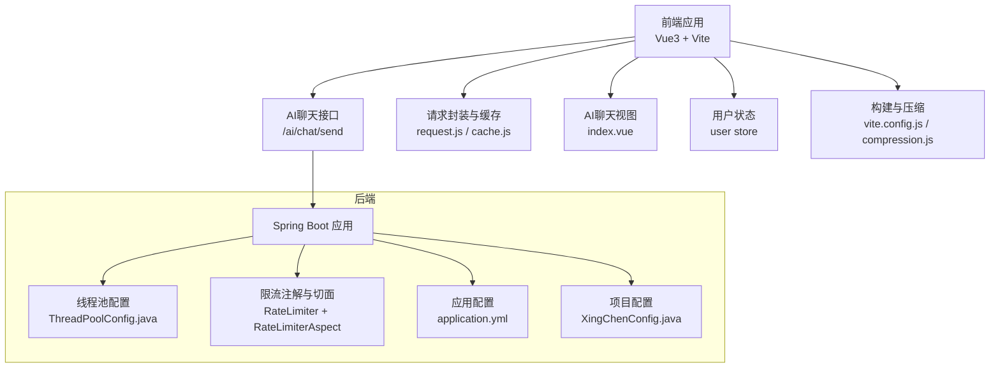
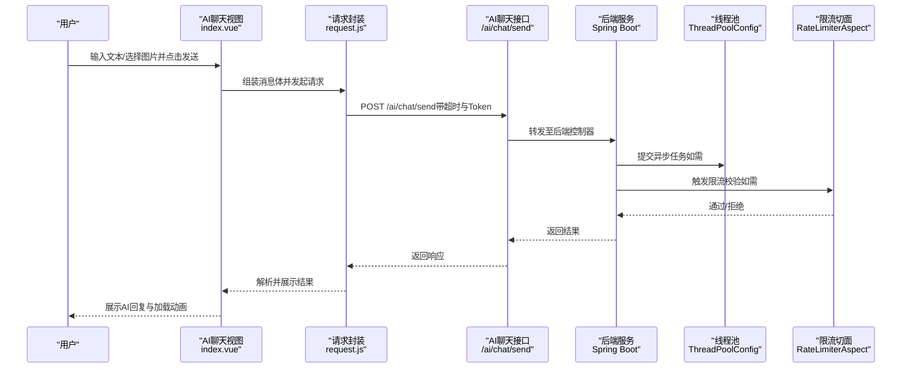
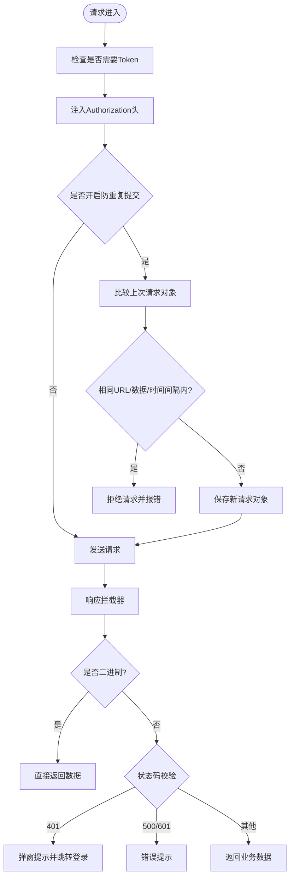
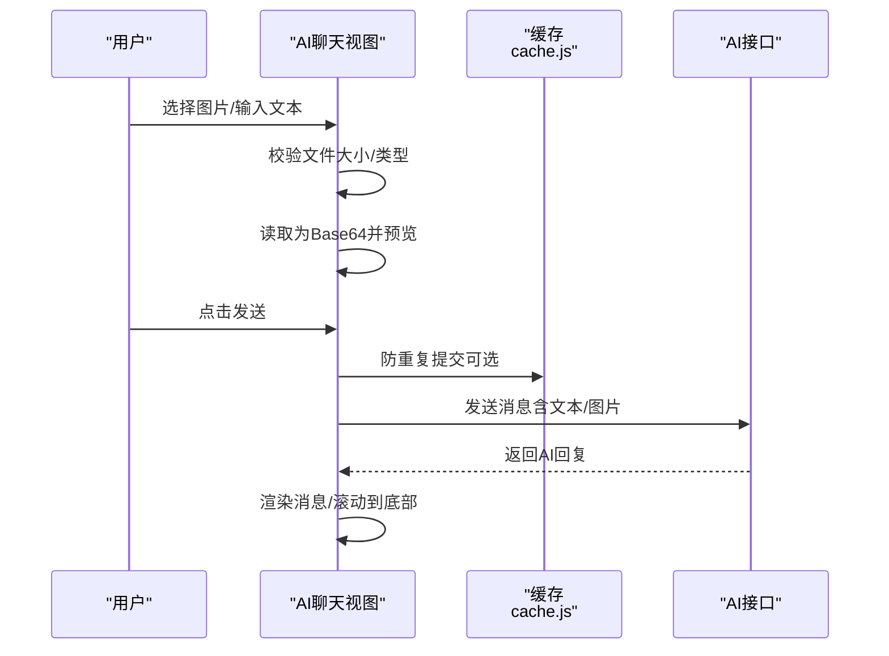
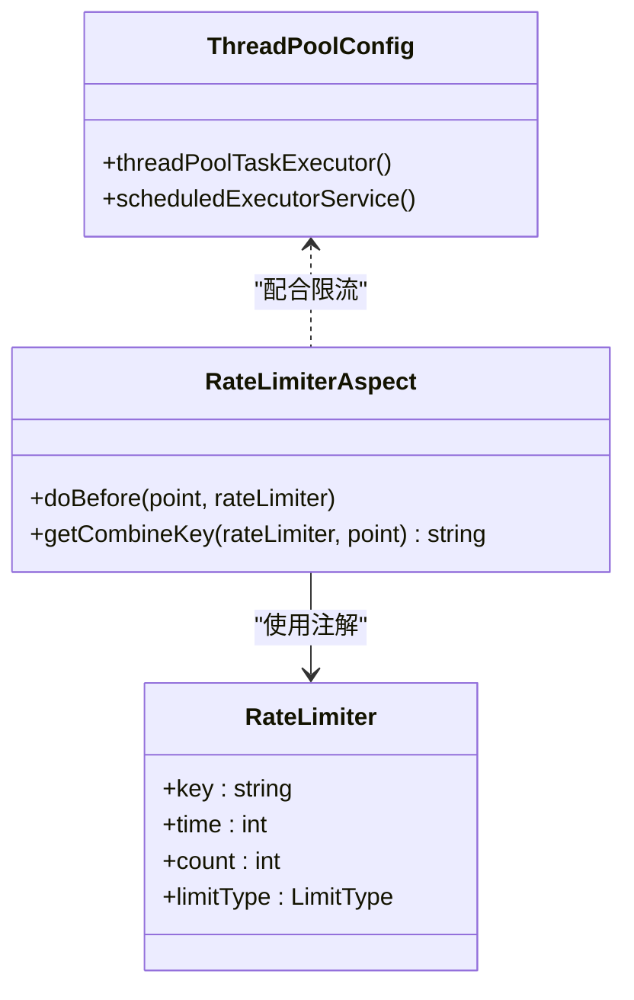
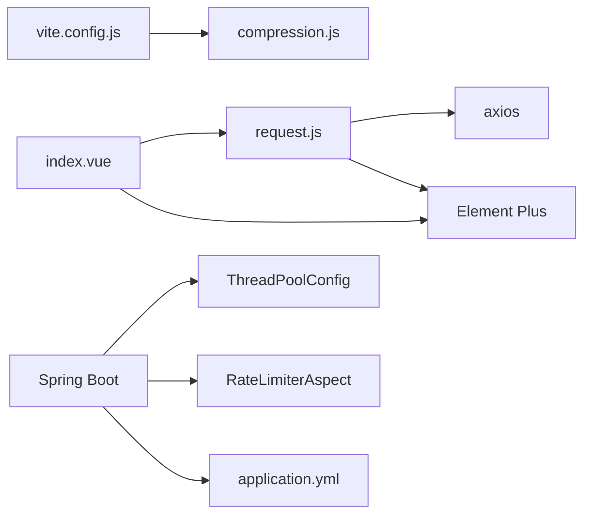

# 性能优化与扩展

<cite>
**本文引用的文件**   
- [XingChen-Vue3/src/api/ai/chat.js](file://XingChen-Vue3/src/api/ai/chat.js)
- [XingChen-Vue3/src/utils/request.js](file://XingChen-Vue3/src/utils/request.js)
- [XingChen-Vue3/src/views/ai/chat/index.vue](file://XingChen-Vue3/src/views/ai/chat/index.vue)
- [XingChen-Vue3/src/plugins/cache.js](file://XingChen-Vue3/src/plugins/cache.js)
- [XingChen-Vue3/vite.config.js](file://XingChen-Vue3/vite.config.js)
- [XingChen-Vue3/vite/plugins/compression.js](file://XingChen-Vue3/vite/plugins/compression.js)
- [XingChen-Vue3/src/store/modules/user.js](file://XingChen-Vue3/src/store/modules/user.js)
- [XingChen-Vue3/src/utils/index.js](file://XingChen-Vue3/src/utils/index.js)
- [XingChen-Vue/xingchen-admin/src/main/resources/application.yml](file://XingChen-Vue/xingchen-admin/src/main/resources/application.yml)
- [XingChen-Vue/xingchen-framework/src/main/java/com/xingchen/framework/config/ThreadPoolConfig.java](file://XingChen-Vue/xingchen-framework/src/main/java/com/xingchen/framework/config/ThreadPoolConfig.java)
- [XingChen-Vue/xingchen-common/src/main/java/com/xingchen/common/config/XingChenConfig.java](file://XingChen-Vue/xingchen-common/src/main/java/com/xingchen/common/config/XingChenConfig.java)
- [XingChen-Vue/xingchen-common/src/main/java/com/xingchen/common/annotation/RateLimiter.java](file://XingChen-Vue/xingchen-common/src/main/java/com/xingchen/common/annotation/RateLimiter.java)
- [XingChen-Vue/xingchen-framework/src/main/java/com/xingchen/framework/aspectj/RateLimiterAspect.java](file://XingChen-Vue/xingchen-framework/src/main/java/com/xingchen/framework/aspectj/RateLimiterAspect.java)
</cite>

## 目录
1. [简介](#简介)
2. [项目结构](#项目结构)
3. [核心组件](#核心组件)
4. [架构总览](#架构总览)
5. [详细组件分析](#详细组件分析)
6. [依赖分析](#依赖分析)
7. [性能考量](#性能考量)
8. [故障排查指南](#故障排查指南)
9. [结论](#结论)
10. [附录](#附录)

## 简介
本技术文档聚焦于“AI助手”在前端与后端的性能优化与扩展设计，围绕以下目标展开：
- 前端：请求缓存、并发控制、超时处理、错误重试与可视化反馈；图片上传与渲染优化；内存与资源加载策略。
- 后端：线程池与限流策略、Tomcat连接与线程配置、Redis限流脚本与缓存键设计。
- 可扩展性：多模型接入、自定义API集成、插件化与微服务化改造路径。

## 项目结构
本项目采用前后端分离架构，前端基于 Vue3 + Vite，后端基于 Spring Boot。AI助手聊天页面位于前端模块，通过统一请求封装与后端接口交互；后端提供线程池、限流与配置类支撑高并发场景。

图表来源
- [XingChen-Vue3/src/views/ai/chat/index.vue:108-228](file://XingChen-Vue3/src/views/ai/chat/index.vue#L108-L228)
- [XingChen-Vue3/src/api/ai/chat.js:1-11](file://XingChen-Vue3/src/api/ai/chat.js#L1-L11)
- [XingChen-Vue3/src/utils/request.js:1-154](file://XingChen-Vue3/src/utils/request.js#L1-L154)
- [XingChen-Vue3/src/plugins/cache.js:1-80](file://XingChen-Vue3/src/plugins/cache.js#L1-L80)
- [XingChen-Vue3/vite.config.js:1-80](file://XingChen-Vue3/vite.config.js#L1-L80)
- [XingChen-Vue3/vite/plugins/compression.js:1-29](file://XingChen-Vue3/vite/plugins/compression.js#L1-L29)
- [XingChen-Vue/xingchen-framework/src/main/java/com/xingchen/framework/config/ThreadPoolConfig.java:1-64](file://XingChen-Vue/xingchen-framework/src/main/java/com/xingchen/framework/config/ThreadPoolConfig.java#L1-L64)
- [XingChen-Vue/xingchen-common/src/main/java/com/xingchen/common/annotation/RateLimiter.java:1-41](file://XingChen-Vue/xingchen-common/src/main/java/com/xingchen/common/annotation/RateLimiter.java#L1-L41)
- [XingChen-Vue/xingchen-framework/src/main/java/com/xingchen/framework/aspectj/RateLimiterAspect.java:1-90](file://XingChen-Vue/xingchen-framework/src/main/java/com/xingchen/framework/aspectj/RateLimiterAspect.java#L1-L90)
- [XingChen-Vue/xingchen-admin/src/main/resources/application.yml:1-148](file://XingChen-Vue/xingchen-admin/src/main/resources/application.yml#L1-L148)
- [XingChen-Vue/xingchen-common/src/main/java/com/xingchen/common/config/XingChenConfig.java:1-123](file://XingChen-Vue/xingchen-common/src/main/java/com/xingchen/common/config/XingChenConfig.java#L1-L123)

章节来源
- [XingChen-Vue3/src/views/ai/chat/index.vue:1-527](file://XingChen-Vue3/src/views/ai/chat/index.vue#L1-L527)
- [XingChen-Vue3/src/api/ai/chat.js:1-11](file://XingChen-Vue3/src/api/ai/chat.js#L1-L11)
- [XingChen-Vue3/src/utils/request.js:1-154](file://XingChen-Vue3/src/utils/request.js#L1-L154)
- [XingChen-Vue3/src/plugins/cache.js:1-80](file://XingChen-Vue3/src/plugins/cache.js#L1-L80)
- [XingChen-Vue3/vite.config.js:1-80](file://XingChen-Vue3/vite.config.js#L1-L80)
- [XingChen-Vue3/vite/plugins/compression.js:1-29](file://XingChen-Vue3/vite/plugins/compression.js#L1-L29)
- [XingChen-Vue/xingchen-framework/src/main/java/com/xingchen/framework/config/ThreadPoolConfig.java:1-64](file://XingChen-Vue/xingchen-framework/src/main/java/com/xingchen/framework/config/ThreadPoolConfig.java#L1-L64)
- [XingChen-Vue/xingchen-common/src/main/java/com/xingchen/common/annotation/RateLimiter.java:1-41](file://XingChen-Vue/xingchen-common/src/main/java/com/xingchen/common/annotation/RateLimiter.java#L1-L41)
- [XingChen-Vue/xingchen-framework/src/main/java/com/xingchen/framework/aspectj/RateLimiterAspect.java:1-90](file://XingChen-Vue/xingchen-framework/src/main/java/com/xingchen/framework/aspectj/RateLimiterAspect.java#L1-L90)
- [XingChen-Vue/xingchen-admin/src/main/resources/application.yml:1-148](file://XingChen-Vue/xingchen-admin/src/main/resources/application.yml#L1-L148)
- [XingChen-Vue/xingchen-common/src/main/java/com/xingchen/common/config/XingChenConfig.java:1-123](file://XingChen-Vue/xingchen-common/src/main/java/com/xingchen/common/config/XingChenConfig.java#L1-L123)

## 核心组件
- 前端请求封装与拦截器：统一设置超时、Token、重复提交防护、响应错误处理与下载能力。
- 会话级缓存：基于 sessionStorage 的轻量缓存，用于防重复提交等场景。
- AI聊天视图：负责图片上传（Base64）、文本输入、消息渲染与滚动行为。
- 构建与压缩：Vite 构建配置与 gzip/brotli 压缩插件，降低传输体积。
- 后端线程池与限流：线程池容量与拒绝策略、基于 Redis 的限流切面与注解。
- 应用与项目配置：Tomcat 线程与队列、Redis 连接池、项目上传路径等。

章节来源
- [XingChen-Vue3/src/utils/request.js:1-154](file://XingChen-Vue3/src/utils/request.js#L1-L154)
- [XingChen-Vue3/src/plugins/cache.js:1-80](file://XingChen-Vue3/src/plugins/cache.js#L1-L80)
- [XingChen-Vue3/src/views/ai/chat/index.vue:108-228](file://XingChen-Vue3/src/views/ai/chat/index.vue#L108-L228)
- [XingChen-Vue3/vite/plugins/compression.js:1-29](file://XingChen-Vue3/vite/plugins/compression.js#L1-L29)
- [XingChen-Vue/xingchen-framework/src/main/java/com/xingchen/framework/config/ThreadPoolConfig.java:1-64](file://XingChen-Vue/xingchen-framework/src/main/java/com/xingchen/framework/config/ThreadPoolConfig.java#L1-L64)
- [XingChen-Vue/xingchen-common/src/main/java/com/xingchen/common/annotation/RateLimiter.java:1-41](file://XingChen-Vue/xingchen-common/src/main/java/com/xingchen/common/annotation/RateLimiter.java#L1-L41)
- [XingChen-Vue/xingchen-framework/src/main/java/com/xingchen/framework/aspectj/RateLimiterAspect.java:1-90](file://XingChen-Vue/xingchen-framework/src/main/java/com/xingchen/framework/aspectj/RateLimiterAspect.java#L1-L90)
- [XingChen-Vue/xingchen-admin/src/main/resources/application.yml:1-148](file://XingChen-Vue/xingchen-admin/src/main/resources/application.yml#L1-L148)
- [XingChen-Vue/xingchen-common/src/main/java/com/xingchen/common/config/XingChenConfig.java:1-123](file://XingChen-Vue/xingchen-common/src/main/java/com/xingchen/common/config/XingChenConfig.java#L1-L123)

## 架构总览
前端通过统一请求封装与后端交互，后端由线程池与限流保障稳定性，并通过配置文件调整运行参数。AI聊天页面支持图片与文本混合输入，前端负责渲染与滚动，后端负责业务处理与限流保护。

图表来源
- [XingChen-Vue3/src/views/ai/chat/index.vue:182-227](file://XingChen-Vue3/src/views/ai/chat/index.vue#L182-L227)
- [XingChen-Vue3/src/utils/request.js:16-73](file://XingChen-Vue3/src/utils/request.js#L16-L73)
- [XingChen-Vue3/src/api/ai/chat.js:4-10](file://XingChen-Vue3/src/api/ai/chat.js#L4-L10)
- [XingChen-Vue/xingchen-framework/src/main/java/com/xingchen/framework/config/ThreadPoolConfig.java:32-43](file://XingChen-Vue/xingchen-framework/src/main/java/com/xingchen/framework/config/ThreadPoolConfig.java#L32-L43)
- [XingChen-Vue/xingchen-framework/src/main/java/com/xingchen/framework/aspectj/RateLimiterAspect.java:49-74](file://XingChen-Vue/xingchen-framework/src/main/java/com/xingchen/framework/aspectj/RateLimiterAspect.java#L49-L74)

## 详细组件分析

### 前端请求封装与缓存
- 请求拦截器
  - 设置基础URL与超时（默认10秒），自动注入Token。
  - 防重复提交：基于会话缓存保存最近一次请求对象，若相同URL/数据且时间间隔小于阈值，则拒绝本次请求。
  - GET请求参数拼接到URL，避免冗余params。
- 响应拦截器
  - 对二进制数据直接透传，便于下载。
  - 统一错误码映射与提示，401触发重新登录流程。
  - 网络错误、超时、状态码异常统一处理。
- 通用下载方法
  - 支持Blob下载与错误提示，配合加载遮罩。
- 会话缓存
  - 提供session/local的set/get/JSON封装，用于存储防重复提交对象等。

图表来源
- [XingChen-Vue3/src/utils/request.js:24-124](file://XingChen-Vue3/src/utils/request.js#L24-L124)
- [XingChen-Vue3/src/plugins/cache.js:1-80](file://XingChen-Vue3/src/plugins/cache.js#L1-L80)

章节来源
- [XingChen-Vue3/src/utils/request.js:1-154](file://XingChen-Vue3/src/utils/request.js#L1-L154)
- [XingChen-Vue3/src/plugins/cache.js:1-80](file://XingChen-Vue3/src/plugins/cache.js#L1-L80)

### AI聊天视图与渲染优化
- 图片处理
  - 仅允许图片文件与5MB以内，读取为Base64预览，发送时随消息体一并上传。
  - 图片在消息气泡中以固定尺寸预览，支持悬停放大与移除。
- 文本输入
  - 支持多行文本与快捷键发送（Enter/Shift+Enter）。
- 渲染与滚动
  - 使用watch监听消息与加载状态，自动滚动到底部。
  - 文本内容使用换行渲染，图片与文本混合展示。
- 错误处理
  - 请求失败时插入一条提示消息，避免UI空白。

图表来源
- [XingChen-Vue3/src/views/ai/chat/index.vue:146-227](file://XingChen-Vue3/src/views/ai/chat/index.vue#L146-L227)
- [XingChen-Vue3/src/plugins/cache.js:1-80](file://XingChen-Vue3/src/plugins/cache.js#L1-L80)
- [XingChen-Vue3/src/api/ai/chat.js:4-10](file://XingChen-Vue3/src/api/ai/chat.js#L4-L10)

章节来源
- [XingChen-Vue3/src/views/ai/chat/index.vue:1-527](file://XingChen-Vue3/src/views/ai/chat/index.vue#L1-L527)

### 构建与资源加载策略
- Vite构建
  - 输出目录与命名规则，禁用生产环境内联SourceMap，提升加载速度。
  - 代理/dev-api与Swagger文档代理，便于开发调试。
- 压缩插件
  - 支持gzip与brotli两种压缩算法，按配置启用，减少传输体积。
- 代码分割与打包警告阈值
  - 控制单chunk体积，避免过大导致加载卡顿。

章节来源
- [XingChen-Vue3/vite.config.js:1-80](file://XingChen-Vue3/vite.config.js#L1-L80)
- [XingChen-Vue3/vite/plugins/compression.js:1-29](file://XingChen-Vue3/vite/plugins/compression.js#L1-L29)

### 后端线程池与限流
- 线程池配置
  - 核心线程、最大线程、队列容量与空闲存活时间，拒绝策略为调用方执行，保证高负载下不丢弃任务。
- 限流注解与切面
  - 注解定义限流key、时间窗口与次数；切面结合Redis Lua脚本原子计数，超过阈值抛出业务异常。
  - 支持IP维度与方法维度组合键，增强灵活性。
- 应用配置
  - Tomcat线程与队列、Redis连接池、文件上传大小等，直接影响并发与稳定性。

图表来源
- [XingChen-Vue/xingchen-common/src/main/java/com/xingchen/common/annotation/RateLimiter.java:1-41](file://XingChen-Vue/xingchen-common/src/main/java/com/xingchen/common/annotation/RateLimiter.java#L1-L41)
- [XingChen-Vue/xingchen-framework/src/main/java/com/xingchen/framework/aspectj/RateLimiterAspect.java:1-90](file://XingChen-Vue/xingchen-framework/src/main/java/com/xingchen/framework/aspectj/RateLimiterAspect.java#L1-L90)
- [XingChen-Vue/xingchen-framework/src/main/java/com/xingchen/framework/config/ThreadPoolConfig.java:1-64](file://XingChen-Vue/xingchen-framework/src/main/java/com/xingchen/framework/config/ThreadPoolConfig.java#L1-L64)

章节来源
- [XingChen-Vue/xingchen-common/src/main/java/com/xingchen/common/annotation/RateLimiter.java:1-41](file://XingChen-Vue/xingchen-common/src/main/java/com/xingchen/common/annotation/RateLimiter.java#L1-L41)
- [XingChen-Vue/xingchen-framework/src/main/java/com/xingchen/framework/aspectj/RateLimiterAspect.java:1-90](file://XingChen-Vue/xingchen-framework/src/main/java/com/xingchen/framework/aspectj/RateLimiterAspect.java#L1-L90)
- [XingChen-Vue/xingchen-framework/src/main/java/com/xingchen/framework/config/ThreadPoolConfig.java:1-64](file://XingChen-Vue/xingchen-framework/src/main/java/com/xingchen/framework/config/ThreadPoolConfig.java#L1-L64)
- [XingChen-Vue/xingchen-admin/src/main/resources/application.yml:1-148](file://XingChen-Vue/xingchen-admin/src/main/resources/application.yml#L1-L148)
- [XingChen-Vue/xingchen-common/src/main/java/com/xingchen/common/config/XingChenConfig.java:1-123](file://XingChen-Vue/xingchen-common/src/main/java/com/xingchen/common/config/XingChenConfig.java#L1-L123)

## 依赖分析
- 前端
  - axios作为HTTP客户端，统一拦截器与错误处理。
  - Element Plus用于UI与通知、加载遮罩。
  - Vite插件体系提供压缩与构建优化。
- 后端
  - Spring线程池与定时任务执行器，结合限流切面与Redis脚本。
  - 应用配置文件集中管理Tomcat、Redis、文件上传等参数。

图表来源
- [XingChen-Vue3/src/utils/request.js:1-154](file://XingChen-Vue3/src/utils/request.js#L1-L154)
- [XingChen-Vue3/src/views/ai/chat/index.vue:1-527](file://XingChen-Vue3/src/views/ai/chat/index.vue#L1-L527)
- [XingChen-Vue3/vite.config.js:1-80](file://XingChen-Vue3/vite.config.js#L1-L80)
- [XingChen-Vue3/vite/plugins/compression.js:1-29](file://XingChen-Vue3/vite/plugins/compression.js#L1-L29)
- [XingChen-Vue/xingchen-framework/src/main/java/com/xingchen/framework/config/ThreadPoolConfig.java:1-64](file://XingChen-Vue/xingchen-framework/src/main/java/com/xingchen/framework/config/ThreadPoolConfig.java#L1-L64)
- [XingChen-Vue/xingchen-framework/src/main/java/com/xingchen/framework/aspectj/RateLimiterAspect.java:1-90](file://XingChen-Vue/xingchen-framework/src/main/java/com/xingchen/framework/aspectj/RateLimiterAspect.java#L1-L90)
- [XingChen-Vue/xingchen-admin/src/main/resources/application.yml:1-148](file://XingChen-Vue/xingchen-admin/src/main/resources/application.yml#L1-L148)

章节来源
- [XingChen-Vue3/src/utils/request.js:1-154](file://XingChen-Vue3/src/utils/request.js#L1-L154)
- [XingChen-Vue3/src/views/ai/chat/index.vue:1-527](file://XingChen-Vue3/src/views/ai/chat/index.vue#L1-L527)
- [XingChen-Vue3/vite.config.js:1-80](file://XingChen-Vue3/vite.config.js#L1-L80)
- [XingChen-Vue3/vite/plugins/compression.js:1-29](file://XingChen-Vue3/vite/plugins/compression.js#L1-L29)
- [XingChen-Vue/xingchen-framework/src/main/java/com/xingchen/framework/config/ThreadPoolConfig.java:1-64](file://XingChen-Vue/xingchen-framework/src/main/java/com/xingchen/framework/config/ThreadPoolConfig.java#L1-L64)
- [XingChen-Vue/xingchen-framework/src/main/java/com/xingchen/framework/aspectj/RateLimiterAspect.java:1-90](file://XingChen-Vue/xingchen-framework/src/main/java/com/xingchen/framework/aspectj/RateLimiterAspect.java#L1-L90)
- [XingChen-Vue/xingchen-admin/src/main/resources/application.yml:1-148](file://XingChen-Vue/xingchen-admin/src/main/resources/application.yml#L1-L148)

## 性能考量
- 前端
  - 请求超时：默认10秒，可根据接口复杂度调整。
  - 防重复提交：通过会话缓存对比请求对象，避免重复请求。
  - 图片处理：前端Base64预览与上传，建议在后端做二次压缩与CDN分发。
  - 渲染优化：虚拟滚动（消息量大时可引入）与懒加载（图片）。
  - 构建优化：启用gzip/brotli压缩，合理拆分chunk，避免单文件过大。
- 后端
  - 线程池：核心/最大线程与队列容量需结合CPU与IO特性压测调优。
  - 限流：Redis脚本原子计数，支持IP/用户/接口多维限流。
  - Tomcat：适当提高最大线程与接受队列，缓解突发流量。
  - 缓存：结合Redis缓存热点数据，降低数据库压力。

## 故障排查指南
- 前端
  - 网络错误/超时：检查代理配置与后端连通性；确认超时时间设置。
  - 401未授权：确认Token是否过期，触发重新登录流程。
  - 防重复提交：若误判，清理会话缓存对应键值。
- 后端
  - 限流触发：查看限流键与时间窗口，评估阈值是否合理。
  - 线程池饱和：观察拒绝策略触发频率，必要时扩容或降载。
  - Tomcat连接：关注accept-count与线程池峰值，避免排队过长。

章节来源
- [XingChen-Vue3/src/utils/request.js:76-124](file://XingChen-Vue3/src/utils/request.js#L76-L124)
- [XingChen-Vue3/src/plugins/cache.js:1-80](file://XingChen-Vue3/src/plugins/cache.js#L1-L80)
- [XingChen-Vue/xingchen-framework/src/main/java/com/xingchen/framework/aspectj/RateLimiterAspect.java:49-74](file://XingChen-Vue/xingchen-framework/src/main/java/com/xingchen/framework/aspectj/RateLimiterAspect.java#L49-L74)
- [XingChen-Vue/xingchen-framework/src/main/java/com/xingchen/framework/config/ThreadPoolConfig.java:32-43](file://XingChen-Vue/xingchen-framework/src/main/java/com/xingchen/framework/config/ThreadPoolConfig.java#L32-L43)
- [XingChen-Vue/xingchen-admin/src/main/resources/application.yml:17-33](file://XingChen-Vue/xingchen-admin/src/main/resources/application.yml#L17-L33)

## 结论
本项目在前端实现了统一请求封装与防重复提交、响应错误处理与下载能力，在后端提供了线程池与Redis限流保障高并发稳定性。结合构建压缩与合理的Tomcat配置，可在多模型与多API接入场景下实现良好的性能与扩展性。后续可进一步引入虚拟滚动、图片CDN与更细粒度的监控指标，以支撑更大规模的AI助手服务。

## 附录
- 可扩展性设计建议
  - 多模型支持：在后端增加模型路由与权重调度，前端按需切换。
  - 自定义API集成：抽象统一适配层，支持不同厂商协议转换。
  - 插件化架构：将AI推理引擎与UI组件解耦，通过插件注册与动态加载。
  - 微服务化改造：将AI服务独立拆分，结合网关与熔断降级策略。