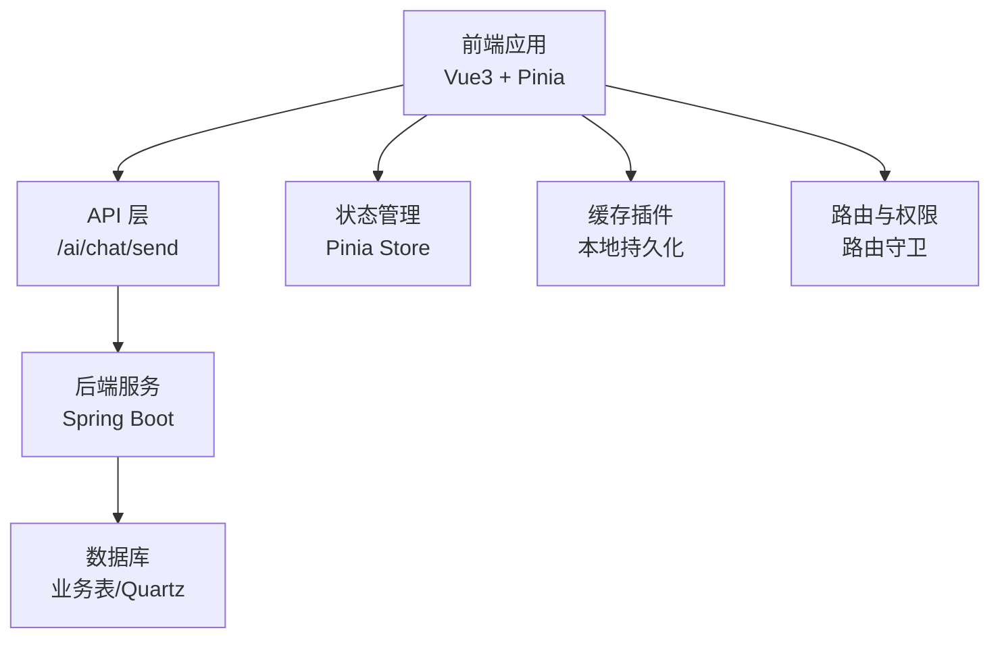
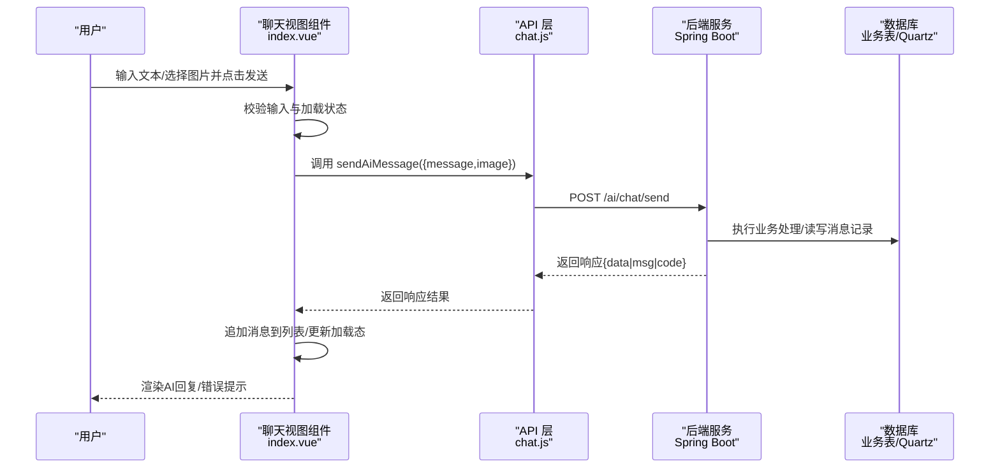
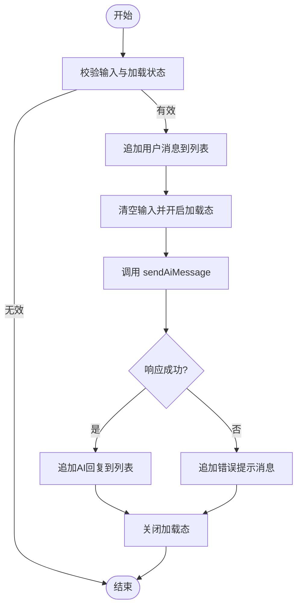
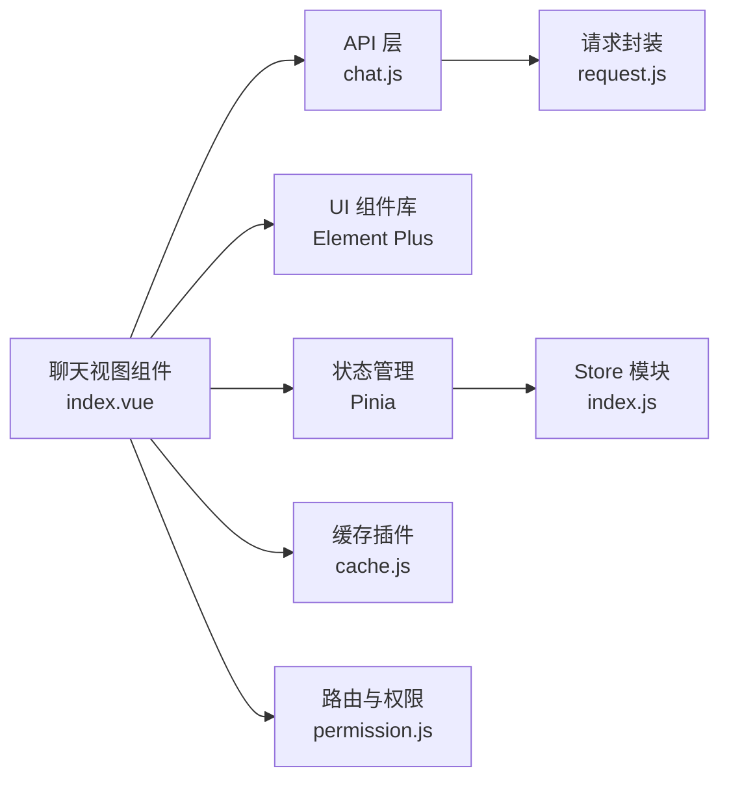

# 消息管理与存储

<cite>
**本文引用的文件**
- [chat.js](file://XingChen-Vue3/src/api/ai/chat.js)
- [index.vue](file://XingChen-Vue3/src/views/ai/chat/index.vue)
- [request.js](file://XingChen-Vue3/src/utils/request.js)
- [index.js](file://XingChen-Vue3/src/store/index.js)
- [tagsView.js](file://XingChen-Vue3/src/store/modules/tagsView.js)
- [cache.js](file://XingChen-Vue3/src/plugins/cache.js)
- [errorCode.js](file://XingChen-Vue3/src/utils/errorCode.js)
- [index.js](file://XingChen-Vue3/src/router/index.js)
- [permission.js](file://XingChen-Vue3/src/permission.js)
- [quartz.sql](file://XingChen-Vue/sql/quartz.sql)
</cite>

## 目录
1. [简介](#简介)
2. [项目结构](#项目结构)
3. [核心组件](#核心组件)
4. [架构总览](#架构总览)
5. [详细组件分析](#详细组件分析)
6. [依赖关系分析](#依赖关系分析)
7. [性能考虑](#性能考虑)
8. [故障排查指南](#故障排查指南)
9. [结论](#结论)
10. [附录](#附录)

## 简介
本文件聚焦于系统中“AI聊天消息”的生命周期管理，涵盖消息格式定义、历史记录存储、会话状态维护与数据持久化策略；同时说明消息去重机制、存储结构设计、查询优化与清理策略，并阐述前后端消息同步、状态管理（Pinia）、以及实时通信实现思路。文档面向不同技术背景读者，提供可视化图示与实践建议。

## 项目结构
本项目采用前后端分离架构，AI聊天功能主要由前端Vue3单页应用承载，后端Spring Boot提供REST接口。消息管理涉及以下关键模块：
- 前端：聊天视图组件负责消息渲染与交互；API层封装请求；Pinia状态管理；缓存插件用于本地持久化；路由与权限守卫保障访问控制。
- 后端：数据库脚本包含定时任务调度表（Quartz），可用于消息清理等异步任务的调度与持久化。

**图表来源**
- [chat.js:1-10](file://XingChen-Vue3/src/api/ai/chat.js#L1-L10)
- [index.vue:108-227](file://XingChen-Vue3/src/views/ai/chat/index.vue#L108-L227)
- [index.js:1-3](file://XingChen-Vue3/src/store/index.js#L1-L3)
- [cache.js](file://XingChen-Vue3/src/plugins/cache.js)

**章节来源**
- [chat.js:1-10](file://XingChen-Vue3/src/api/ai/chat.js#L1-L10)
- [index.vue:1-263](file://XingChen-Vue3/src/views/ai/chat/index.vue#L1-L263)
- [index.js:1-3](file://XingChen-Vue3/src/store/index.js#L1-L3)
- [cache.js](file://XingChen-Vue3/src/plugins/cache.js)

## 核心组件
- 前端聊天视图组件：负责消息列表渲染、输入处理、图片上传与Base64转换、发送流程与错误处理、自动滚动与加载态展示。
- API层：封装向后端发送消息的HTTP请求，统一路径与方法。
- 状态管理：基于Pinia的store，当前文件中初始化了Pinia实例，便于后续扩展消息状态。
- 缓存插件：提供本地缓存能力，可用于会话历史的短期持久化与恢复。
- 错误码工具：提供统一错误码映射，辅助前端进行错误提示与降级处理。
- 路由与权限：通过路由守卫与权限指令，确保消息页面访问安全。

**章节来源**
- [index.vue:108-227](file://XingChen-Vue3/src/views/ai/chat/index.vue#L108-L227)
- [chat.js:1-10](file://XingChen-Vue3/src/api/ai/chat.js#L1-L10)
- [index.js:1-3](file://XingChen-Vue3/src/store/index.js#L1-L3)
- [cache.js](file://XingChen-Vue3/src/plugins/cache.js)
- [errorCode.js](file://XingChen-Vue3/src/utils/errorCode.js)
- [permission.js](file://XingChen-Vue3/src/permission.js)

## 架构总览
下图展示了AI聊天消息从前端到后端的关键交互流程，包括消息格式、发送与响应处理、错误兜底与状态更新。

**图表来源**
- [index.vue:182-227](file://XingChen-Vue3/src/views/ai/chat/index.vue#L182-L227)
- [chat.js:4-9](file://XingChen-Vue3/src/api/ai/chat.js#L4-L9)

## 详细组件分析

### 前端消息格式与生命周期
- 消息格式
  - 用户消息：包含角色标识、文本内容、可选图片（Base64）。
  - AI回复：包含角色标识、文本内容、无图片字段。
  - 加载态：在请求期间显示加载动画，避免重复提交。
- 生命周期
  - 输入校验：禁止空输入且在加载中时禁用发送。
  - 发送阶段：将用户消息加入列表，清空输入并开启加载态。
  - 响应阶段：根据后端返回更新消息列表；异常时追加错误提示。
  - 视图更新：监听消息与加载状态，自动滚动至底部。

**图表来源**
- [index.vue:182-227](file://XingChen-Vue3/src/views/ai/chat/index.vue#L182-L227)

**章节来源**
- [index.vue:108-227](file://XingChen-Vue3/src/views/ai/chat/index.vue#L108-L227)

### API层与请求封装
- API函数封装了发送消息的HTTP请求，统一路径与方法，便于后续扩展与测试。
- 请求封装位于通用请求工具中，提供拦截器、错误处理与认证支持。

**章节来源**
- [chat.js:1-10](file://XingChen-Vue3/src/api/ai/chat.js#L1-L10)
- [request.js](file://XingChen-Vue3/src/utils/request.js)

### 状态管理（Pinia）
- 当前文件初始化了Pinia实例，便于后续在store中集中管理消息状态、会话上下文与用户偏好。
- 建议新增消息模块，包含消息列表、当前会话ID、分页参数、去重键集合等。

**章节来源**
- [index.js:1-3](file://XingChen-Vue3/src/store/index.js#L1-L3)

### 本地缓存与会话持久化
- 缓存插件提供本地存储能力，可用于短期保存聊天历史，提升首次加载体验。
- 标签页缓存模块展示了如何按需持久化非固定页签，可借鉴其模式对消息历史进行本地落盘。

**章节来源**
- [cache.js](file://XingChen-Vue3/src/plugins/cache.js)
- [tagsView.js:1-48](file://XingChen-Vue3/src/store/modules/tagsView.js#L1-L48)

### 错误处理与降级
- 前端在请求失败时追加错误提示消息，保证用户体验连续性。
- 错误码工具提供统一错误映射，便于国际化与统一提示。

**章节来源**
- [index.vue:214-224](file://XingChen-Vue3/src/views/ai/chat/index.vue#L214-L224)
- [errorCode.js](file://XingChen-Vue3/src/utils/errorCode.js)

### 路由与权限
- 路由守卫与权限指令确保只有授权用户可访问聊天页面，防止未登录或无权限用户进入。

**章节来源**
- [permission.js](file://XingChen-Vue3/src/permission.js)

### 后端存储与调度（Quartz）
- 数据库脚本包含Quartz调度表，可用于定时清理过期消息、批量归档或统计任务。
- 建议结合业务表设计消息历史表，配合索引与分区策略实现高效查询与清理。

**章节来源**
- [quartz.sql:1-156](file://XingChen-Vue/sql/quartz.sql#L1-L156)

## 依赖关系分析
- 组件耦合
  - 聊天视图组件依赖API层与Element Plus UI库；与状态管理解耦，便于替换实现。
  - API层依赖通用请求封装，保持一致的错误处理与拦截器。
- 外部依赖
  - Element Plus用于消息气泡、头像与加载动画。
  - Pinia用于状态集中管理，缓存插件用于本地持久化。
  - 路由与权限模块保障访问安全。

**图表来源**
- [index.vue:108-227](file://XingChen-Vue3/src/views/ai/chat/index.vue#L108-L227)
- [chat.js:1-10](file://XingChen-Vue3/src/api/ai/chat.js#L1-L10)
- [request.js](file://XingChen-Vue3/src/utils/request.js)
- [index.js:1-3](file://XingChen-Vue3/src/store/index.js#L1-L3)
- [cache.js](file://XingChen-Vue3/src/plugins/cache.js)
- [permission.js](file://XingChen-Vue3/src/permission.js)

**章节来源**
- [index.vue:108-227](file://XingChen-Vue3/src/views/ai/chat/index.vue#L108-L227)
- [chat.js:1-10](file://XingChen-Vue3/src/api/ai/chat.js#L1-L10)
- [index.js:1-3](file://XingChen-Vue3/src/store/index.js#L1-L3)
- [cache.js](file://XingChen-Vue3/src/plugins/cache.js)
- [permission.js](file://XingChen-Vue3/src/permission.js)

## 性能考虑
- 前端
  - 虚拟滚动：当消息量较大时，采用虚拟滚动减少DOM节点数量。
  - 图片优化：限制图片大小与格式，必要时压缩后再上传；Base64仅用于小图预览。
  - 防抖与去抖：输入防抖、发送去抖，避免频繁请求。
  - 分页加载：后端分页接口与前端懒加载结合，降低首屏压力。
- 后端
  - 索引优化：为消息表的用户ID、时间戳、会话ID建立复合索引。
  - 查询优化：避免N+1查询，批量获取消息与关联数据。
  - 清理策略：利用Quartz定时任务定期清理超期历史，释放存储空间。
- 缓存
  - 本地缓存：短期保存最近会话，提升切换与刷新体验。
  - 服务端缓存：热点会话与常用问答可引入Redis缓存。

[本节为通用性能建议，无需特定文件引用]

## 故障排查指南
- 常见问题
  - 发送按钮无响应：检查加载态逻辑与输入校验条件。
  - 图片无法上传：确认文件类型与大小限制，检查Base64转换流程。
  - 无响应或错误提示：查看API返回与错误码映射，定位后端异常。
- 定位步骤
  - 前端：打开浏览器开发者工具，观察Network面板与Console日志。
  - 后端：查看服务端日志与数据库事务状态，确认消息写入与清理任务执行情况。
- 降级策略
  - 前端：在网络异常时追加提示消息，允许用户重试或离线查看本地缓存。
  - 后端：启用限流与熔断，保护数据库与AI服务稳定性。

**章节来源**
- [index.vue:146-165](file://XingChen-Vue3/src/views/ai/chat/index.vue#L146-L165)
- [index.vue:214-224](file://XingChen-Vue3/src/views/ai/chat/index.vue#L214-L224)
- [errorCode.js](file://XingChen-Vue3/src/utils/errorCode.js)

## 结论
本系统在前端实现了完整的AI聊天消息生命周期管理：从消息格式定义、发送与渲染，到错误处理与本地缓存；在后端具备Quartz调度能力支撑消息清理与归档。建议后续完善后端消息表设计与索引、引入Pinia消息模块、增强实时通信与去重机制，并持续优化查询与清理策略以提升整体性能与可维护性。

[本节为总结性内容，无需特定文件引用]

## 附录

### 消息格式规范（建议）
- 字段定义
  - 角色：user/assistant/system
  - 内容：文本内容，支持换行与HTML转义
  - 图片：Base64字符串（可选）
  - 时间戳：毫秒级时间戳
  - 会话ID：唯一标识一次对话
  - 去重键：基于内容摘要生成，用于消息去重
- 示例结构
  - 用户消息：{role: "user", content: "...", image: "...", timestamp: "...", sessionId: "..."}
  - AI回复：{role: "assistant", content: "...", image: null, timestamp: "...", sessionId: "..."}

[本节为概念性规范，无需特定文件引用]

### 存储方案与清理策略（建议）
- 存储结构
  - 消息表：包含会话ID、角色、内容、图片URL、时间戳、去重键等字段。
  - 会话表：记录会话元信息（创建时间、最后活跃时间、状态等）。
- 查询优化
  - 为会话ID与时间戳建立复合索引，支持快速分页与范围查询。
  - 使用覆盖索引减少回表开销。
- 清理策略
  - 定时任务：基于Quartz清理超过保留期限的历史消息。
  - 空间回收：定期归档冷数据至离线存储，释放热数据空间。

**章节来源**
- [quartz.sql:1-156](file://XingChen-Vue/sql/quartz.sql#L1-L156)

### 去重机制（建议）
- 去重键生成：对消息内容进行哈希计算，作为去重键。
- 去重策略：发送前先检查去重键是否存在，若存在则合并或跳过。
- 并发场景：使用分布式锁或数据库唯一约束避免重复插入。

[本节为通用设计建议，无需特定文件引用]