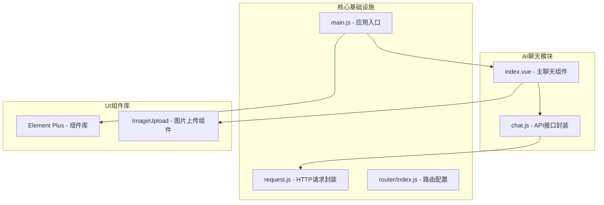
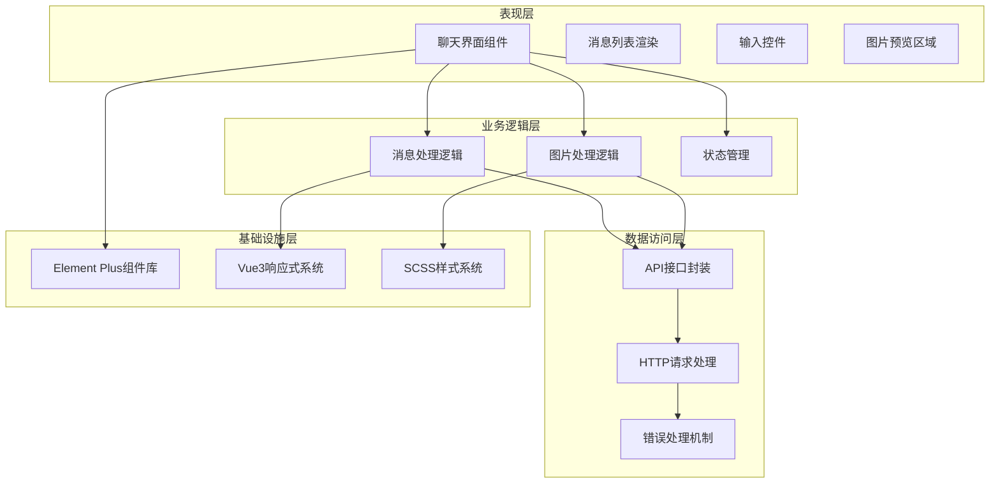
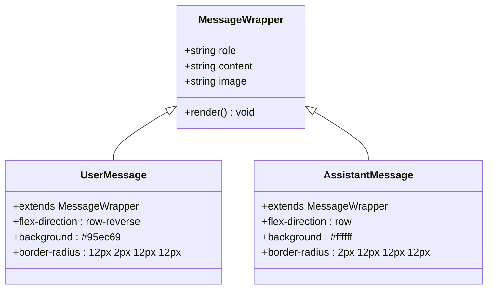
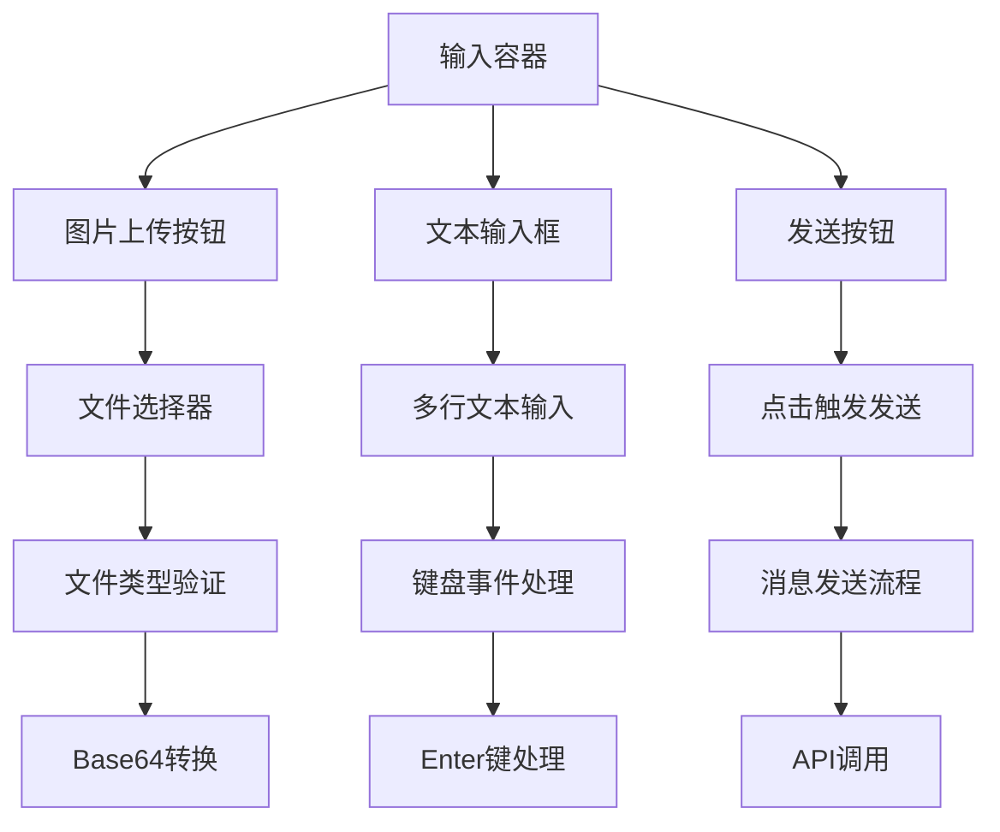
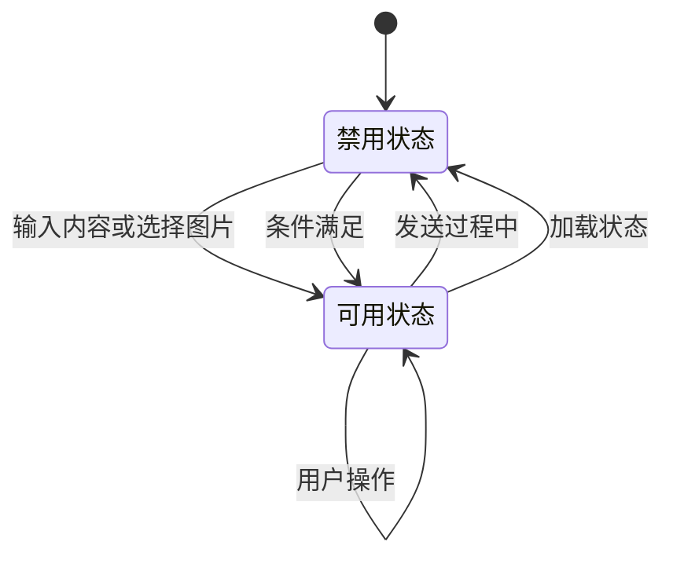
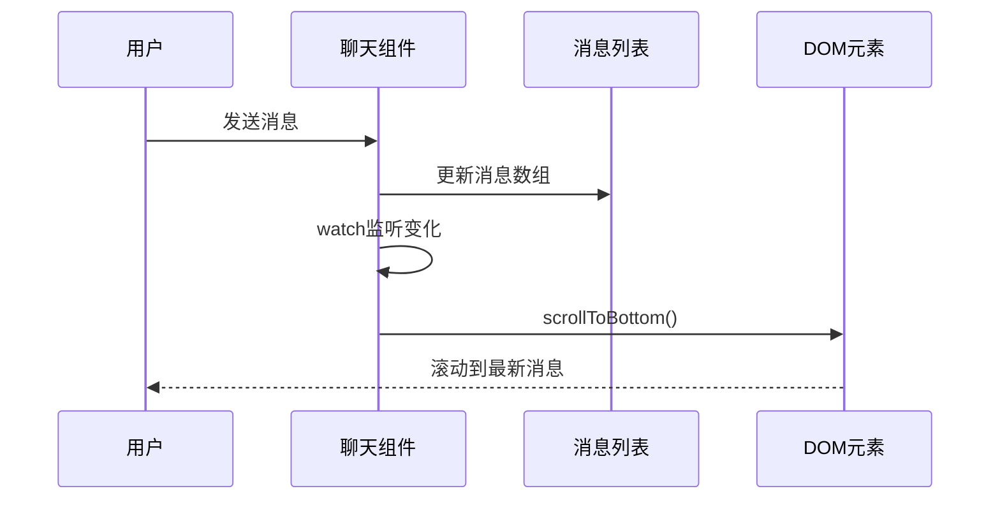
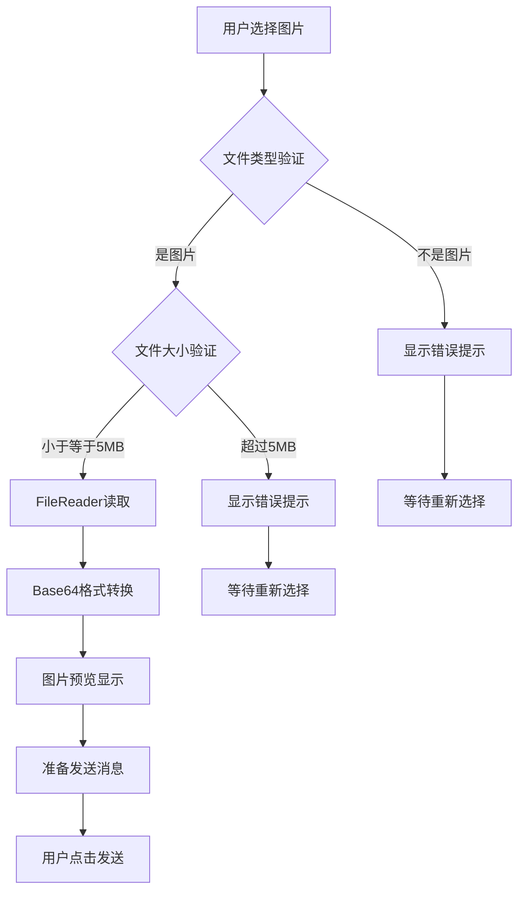
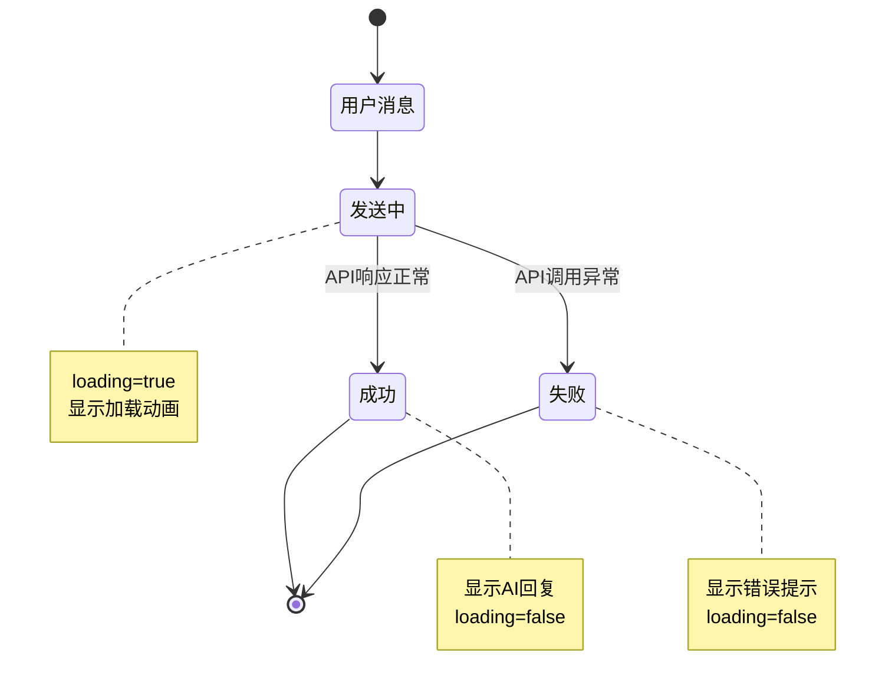
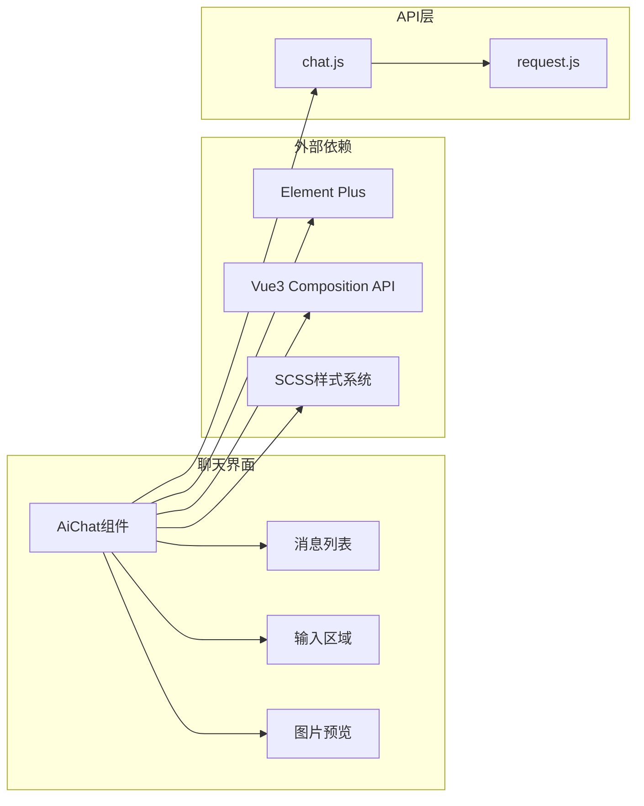

# 聊天界面交互

<cite>
**本文档引用的文件**
- [index.vue](file://XingChen-Vue3/src/views/ai/chat/index.vue)
- [chat.js](file://XingChen-Vue3/src/api/ai/chat.js)
- [request.js](file://XingChen-Vue3/src/utils/request.js)
- [index.js](file://XingChen-Vue3/src/router/index.js)
- [main.js](file://XingChen-Vue3/src/main.js)
- [index.vue](file://XingChen-Vue3/src/layout/index.vue)
- [index.scss](file://XingChen-Vue3/src/assets/styles/index.scss)
- [index.vue](file://XingChen-Vue3/src/components/ImageUpload/index.vue)
</cite>

## 目录
1. [简介](#简介)
2. [项目结构](#项目结构)
3. [核心组件](#核心组件)
4. [架构概览](#架构概览)
5. [详细组件分析](#详细组件分析)
6. [依赖关系分析](#依赖关系分析)
7. [性能考虑](#性能考虑)
8. [故障排除指南](#故障排除指南)
9. [结论](#结论)

## 简介

本文件详细介绍了基于Vue3的多模态AI聊天界面交互系统的设计与实现。该系统提供了完整的消息列表渲染、输入框处理、发送按钮交互和实时更新机制，支持Base64图片上传处理、消息状态管理以及用户体验优化。系统采用现代化的前端技术栈，结合Element Plus组件库和响应式设计原则，为用户提供流畅的聊天体验。

## 项目结构

聊天界面位于健康管理系统前端项目的AI模块中，采用模块化的组织方式：

**图表来源**
- [index.vue:1-527](file://XingChen-Vue3/src/views/ai/chat/index.vue#L1-L527)
- [chat.js:1-11](file://XingChen-Vue3/src/api/ai/chat.js#L1-L11)
- [request.js:1-154](file://XingChen-Vue3/src/utils/request.js#L1-L154)

**章节来源**
- [index.vue:1-527](file://XingChen-Vue3/src/views/ai/chat/index.vue#L1-L527)
- [main.js:1-85](file://XingChen-Vue3/src/main.js#L1-L85)

## 核心组件

### 主聊天组件 (AiChat)

主聊天组件是整个聊天系统的中枢，负责管理消息状态、处理用户交互和协调各个子组件的工作。

#### 数据状态管理

组件使用Vue3的Composition API进行状态管理：

| 状态变量 | 类型 | 描述 | 默认值 |
|---------|------|------|--------|
| messages | Ref<Array> | 消息历史记录数组 | [] |
| inputText | Ref<string> | 用户输入的文本内容 | '' |
| selectedImageBase64 | Ref<string|null> | 选中的图片Base64数据 | null |
| loading | Ref<boolean> | 加载状态标志 | false |
| chatHistoryRef | Ref<HTMLDivElement> | 聊天历史容器引用 | null |

#### 核心功能特性

1. **消息列表渲染**: 支持用户消息和AI助手消息的差异化显示
2. **实时滚动**: 自动滚动到最新消息
3. **图片上传**: 支持Base64格式的图片上传和预览
4. **键盘快捷键**: Enter发送，Shift+Enter换行
5. **状态反馈**: 加载动画和错误处理

**章节来源**
- [index.vue:114-137](file://XingChen-Vue3/src/views/ai/chat/index.vue#L114-L137)

## 架构概览

系统采用分层架构设计，确保各层职责清晰分离：

**图表来源**
- [index.vue:108-227](file://XingChen-Vue3/src/views/ai/chat/index.vue#L108-L227)
- [chat.js:4-10](file://XingChen-Vue3/src/api/ai/chat.js#L4-L10)

## 详细组件分析

### 消息列表渲染组件

消息列表是聊天界面的核心展示区域，采用响应式设计确保在不同设备上的良好体验。

#### 消息类型区分

系统通过CSS类名实现消息类型的视觉区分：

**图表来源**
- [index.vue:324-361](file://XingChen-Vue3/src/views/ai/chat/index.vue#L324-L361)

#### 消息内容处理

消息内容支持多种格式的渲染：

| 内容类型 | 处理方式 | 显示效果 |
|---------|----------|----------|
| 文本内容 | HTML转义 | 普通文本显示 |
| 换行符 | ` `标签 | 正确换行显示 |
| 图片内容 | Base64格式 | 图片预览显示 |
| 错误状态 | 特殊提示 | 错误状态标识 |

**章节来源**
- [index.vue:140-143](file://XingChen-Vue3/src/views/ai/chat/index.vue#L140-L143)

### 输入框处理组件

输入框组件提供了丰富的交互功能，支持文本输入和图片上传的组合操作。

#### 输入控件布局

**图表来源**
- [index.vue:71-102](file://XingChen-Vue3/src/views/ai/chat/index.vue#L71-L102)

#### 键盘快捷键处理

系统实现了智能的键盘事件处理机制：

| 快捷键组合 | 功能描述 | 行为表现 |
|-----------|----------|----------|
| Enter | 发送消息 | 触发消息发送 |
| Shift+Enter | 新建一行 | 文本换行 |
| Ctrl+Enter | 无特殊功能 | 默认行为 |
| Tab | 无特殊功能 | 默认行为 |

**章节来源**
- [index.vue:172-179](file://XingChen-Vue3/src/views/ai/chat/index.vue#L172-L179)

### 发送按钮交互组件

发送按钮是用户操作的核心入口，集成了状态管理和视觉反馈功能。

#### 按钮状态管理

按钮根据不同的条件启用或禁用：

**图表来源**
- [index.vue:93-101](file://XingChen-Vue3/src/views/ai/chat/index.vue#L93-L101)

#### 发送流程控制

发送按钮的交互流程如下：

1. **输入验证**: 检查文本内容和图片状态
2. **状态切换**: 设置加载状态
3. **消息推送**: 将用户消息添加到历史记录
4. **API调用**: 调用AI服务接口
5. **结果处理**: 处理响应结果或错误情况

**章节来源**
- [index.vue:182-227](file://XingChen-Vue3/src/views/ai/chat/index.vue#L182-L227)

### 实时更新机制

系统实现了完整的实时更新机制，确保用户能够及时看到最新的聊天内容。

#### 自动滚动功能

**图表来源**
- [index.vue:120-137](file://XingChen-Vue3/src/views/ai/chat/index.vue#L120-L137)

#### 加载状态管理

系统通过loading状态变量控制加载指示器的显示：

| 状态 | 触发条件 | 显示内容 |
|------|----------|----------|
| 隐藏 | 初始状态 | 不显示 |
| 显示 | 发送消息时 | 点击动画 |
| 隐藏 | 响应返回后 | 恢复正常 |

**章节来源**
- [index.vue:46-56](file://XingChen-Vue3/src/views/ai/chat/index.vue#L46-L56)

### Base64图片上传处理

系统支持Base64格式的图片上传，提供了完整的文件验证和转换流程。

#### 图片处理流程

**图表来源**
- [index.vue:145-169](file://XingChen-Vue3/src/views/ai/chat/index.vue#L145-L169)

#### 图片预览功能

图片预览区域提供了完整的图片管理功能：

| 功能 | 实现方式 | 用户体验 |
|------|----------|----------|
| 图片显示 | Base64数据渲染 | 即时预览 |
| 删除功能 | 关闭按钮点击 | 立即移除 |
| 缩放效果 | hover状态变换 | 交互反馈 |
| 边框美化 | CSS样式设计 | 视觉提升 |

**章节来源**
- [index.vue:61-68](file://XingChen-Vue3/src/views/ai/chat/index.vue#L61-L68)

### 消息状态管理

系统实现了完整的消息状态管理机制，包括发送中、成功、失败等状态的处理。

#### 状态转换流程

**图表来源**
- [index.vue:182-227](file://XingChen-Vue3/src/views/ai/chat/index.vue#L182-L227)

#### 错误处理机制

系统提供了多层次的错误处理：

1. **文件验证错误**: 格式或大小不符合要求
2. **网络请求错误**: API调用失败
3. **业务逻辑错误**: 服务器返回错误状态
4. **用户操作错误**: 重复提交检测

**章节来源**
- [index.vue:147-157](file://XingChen-Vue3/src/views/ai/chat/index.vue#L147-L157)

## 依赖关系分析

### 组件间通信

聊天界面与其他组件的依赖关系如下：

**图表来源**
- [index.vue:108-112](file://XingChen-Vue3/src/views/ai/chat/index.vue#L108-L112)
- [chat.js:1-1](file://XingChen-Vue3/src/api/ai/chat.js#L1-L1)

### 数据绑定策略

系统采用了双向数据绑定和单向数据流相结合的设计模式：

| 绑定类型 | 实现方式 | 使用场景 |
|----------|----------|----------|
| 双向绑定 | v-model | 文本输入框 |
| 单向绑定 | v-bind | 图片预览显示 |
| 事件绑定 | @click | 按钮交互 |
| 监听绑定 | watch | 自动滚动 |
| 引用绑定 | ref | DOM元素访问 |

**章节来源**
- [index.vue:84-118](file://XingChen-Vue3/src/views/ai/chat/index.vue#L84-L118)

## 性能考虑

### 渲染优化

系统在性能优化方面采用了多项措施：

1. **虚拟DOM优化**: 使用Vue3的Composition API减少不必要的重渲染
2. **懒加载策略**: 图片内容按需加载，避免一次性渲染大量图片
3. **内存管理**: 及时清理Base64数据，避免内存泄漏
4. **滚动优化**: 使用nextTick确保DOM更新完成后再执行滚动操作

### 网络性能

API调用层面的性能优化：

1. **请求节流**: 防止重复提交，提升用户体验
2. **超时控制**: 设置合理的请求超时时间
3. **错误缓存**: 对常见错误进行缓存处理
4. **资源压缩**: Base64格式的图片传输优化

## 故障排除指南

### 常见问题及解决方案

#### 图片上传失败

**问题现象**: 选择图片后无法上传或显示错误

**可能原因**:
1. 文件格式不支持
2. 文件大小超过限制
3. 网络连接异常

**解决步骤**:
1. 检查文件格式是否为图片类型
2. 确认文件大小不超过5MB
3. 验证网络连接状态
4. 重新尝试上传操作

#### 消息发送超时

**问题现象**: 点击发送按钮后长时间无响应

**可能原因**:
1. AI服务接口响应慢
2. 网络延迟过高
3. 服务器负载过大

**解决步骤**:
1. 检查网络连接质量
2. 稍后重试发送操作
3. 查看浏览器开发者工具的网络面板
4. 联系系统管理员

#### 页面显示异常

**问题现象**: 聊天界面布局错乱或样式异常

**可能原因**:
1. CSS样式冲突
2. 浏览器兼容性问题
3. 缓存问题

**解决步骤**:
1. 清除浏览器缓存
2. 刷新页面重新加载
3. 更换浏览器测试
4. 检查自定义样式覆盖

**章节来源**
- [index.vue:147-157](file://XingChen-Vue3/src/views/ai/chat/index.vue#L147-L157)
- [request.js:111-124](file://XingChen-Vue3/src/utils/request.js#L111-L124)

## 结论

本聊天界面交互系统展现了现代前端开发的最佳实践，通过Vue3的Composition API、Element Plus组件库和响应式设计原则，构建了一个功能完善、用户体验优秀的聊天平台。

### 主要优势

1. **技术架构先进**: 采用Vue3最新特性，提供更好的开发体验
2. **用户体验优秀**: 完善的交互反馈和视觉设计
3. **扩展性强**: 模块化设计便于功能扩展和维护
4. **性能优化**: 多层次的性能优化策略确保流畅体验

### 改进建议

1. **增加消息持久化**: 考虑本地存储用户聊天历史
2. **增强离线支持**: 实现基本的离线聊天功能
3. **优化移动端体验**: 针对移动设备进行专门优化
4. **增加消息状态同步**: 实现实时消息状态同步机制

该系统为健康管理系统提供了强大的AI聊天能力，为用户提供了便捷的健康咨询和信息获取渠道，是现代Web应用开发的优秀范例。