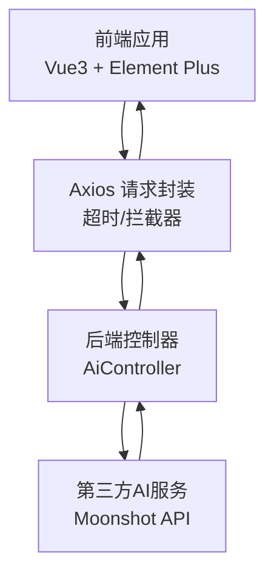
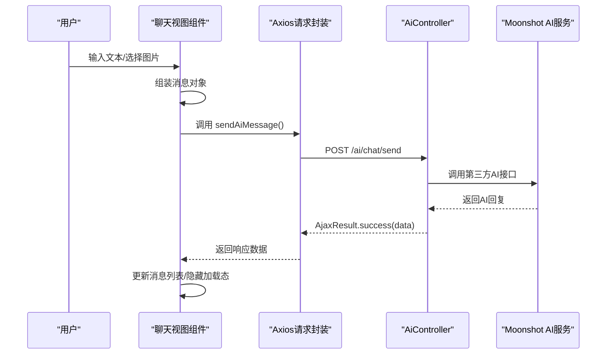
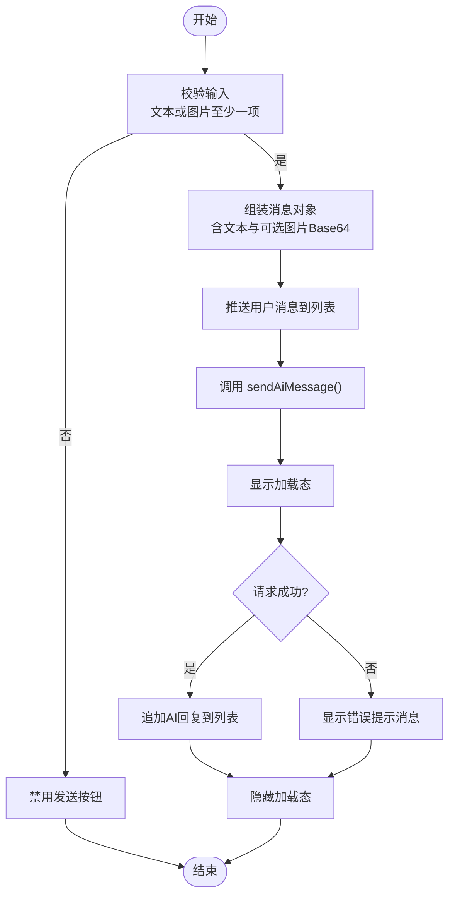
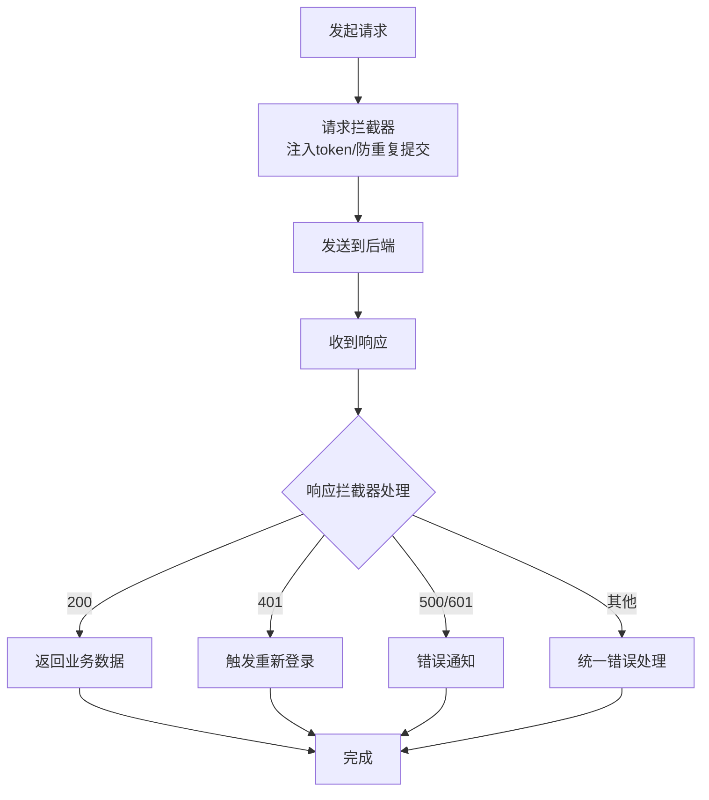
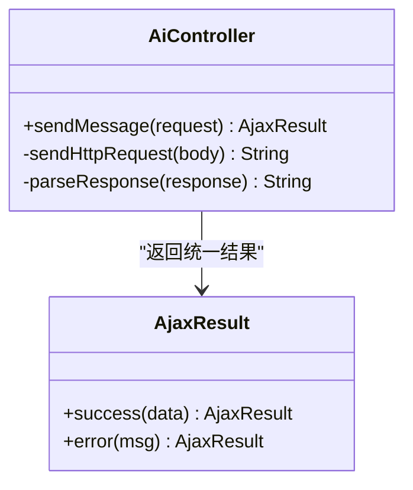
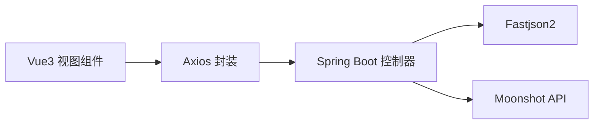

# AI助手接口

<cite>
**本文引用的文件**
- [XingChen-Vue3/src/api/ai/chat.js](file://XingChen-Vue3/src/api/ai/chat.js)
- [XingChen-Vue3/src/views/ai/chat/index.vue](file://XingChen-Vue3/src/views/ai/chat/index.vue)
- [XingChen-Vue3/src/utils/request.js](file://XingChen-Vue3/src/utils/request.js)
- [XingChen-Vue/xingchen-admin/src/main/java/com/xingchen/web/controller/al/AiController.java](file://XingChen-Vue/xingchen-admin/src/main/java/com/xingchen/web/controller/al/AiController.java)
- [XingChen-Vue/xingchen-admin/src/main/resources/application.yml](file://XingChen-Vue/xingchen-admin/src/main/resources/application.yml)
</cite>

## 目录
1. [简介](#简介)
2. [项目结构](#项目结构)
3. [核心组件](#核心组件)
4. [架构总览](#架构总览)
5. [详细组件分析](#详细组件分析)
6. [依赖分析](#依赖分析)
7. [性能考虑](#性能考虑)
8. [故障排查指南](#故障排查指南)
9. [结论](#结论)
10. [附录](#附录)

## 简介
本文件面向“AI健康助手”相关API接口，重点覆盖以下能力：
- AI聊天接口：/ai/chat/send，支持纯文本与多模态（文本+图片）输入
- 多模态输入处理：前端对图片进行Base64编码，后端对接第三方大模型API
- 对话上下文管理：当前实现为单轮请求，不持久化历史；如需历史管理，可在前端聚合或后端引入会话存储
- 响应格式：统一返回后端封装的AjaxResult结构
- 调用流程：前端通过Axios请求 -> 后端控制器 -> 第三方AI服务 -> 返回结果
- 超时处理、错误重试与结果缓存策略：当前未实现重试与缓存，建议在网关或前端增加

## 项目结构
本项目采用前后端分离架构：
- 前端（Vue3 + Element Plus）：负责UI交互、多模态输入处理、Axios请求封装与错误提示
- 后端（Spring Boot）：负责接收请求、拼装多模态消息、调用第三方AI服务、解析响应并返回

图表来源
- [XingChen-Vue3/src/views/ai/chat/index.vue:182-227](file://XingChen-Vue3/src/views/ai/chat/index.vue#L182-L227)
- [XingChen-Vue3/src/api/ai/chat.js:4-10](file://XingChen-Vue3/src/api/ai/chat.js#L4-L10)
- [XingChen-Vue3/src/utils/request.js:16-21](file://XingChen-Vue3/src/utils/request.js#L16-L21)
- [XingChen-Vue/xingchen-admin/src/main/java/com/xingchen/web/controller/al/AiController.java:37-93](file://XingChen-Vue/xingchen-admin/src/main/java/com/xingchen/web/controller/al/AiController.java#L37-L93)

章节来源
- [XingChen-Vue3/src/views/ai/chat/index.vue:1-527](file://XingChen-Vue3/src/views/ai/chat/index.vue#L1-L527)
- [XingChen-Vue3/src/api/ai/chat.js:1-11](file://XingChen-Vue3/src/api/ai/chat.js#L1-L11)
- [XingChen-Vue3/src/utils/request.js:1-154](file://XingChen-Vue3/src/utils/request.js#L1-L154)
- [XingChen-Vue/xingchen-admin/src/main/java/com/xingchen/web/controller/al/AiController.java:1-165](file://XingChen-Vue/xingchen-admin/src/main/java/com/xingchen/web/controller/al/AiController.java#L1-L165)
- [XingChen-Vue/xingchen-admin/src/main/resources/application.yml:1-148](file://XingChen-Vue/xingchen-admin/src/main/resources/application.yml#L1-L148)

## 核心组件
- 前端聊天视图组件：负责渲染消息、图片预览、输入控制、发送逻辑与错误提示
- Axios请求封装：统一设置基础URL、超时、拦截器、错误提示
- AI控制器：接收前端请求，构造多模态消息，调用第三方AI服务，解析并返回结果

章节来源
- [XingChen-Vue3/src/views/ai/chat/index.vue:108-227](file://XingChen-Vue3/src/views/ai/chat/index.vue#L108-L227)
- [XingChen-Vue3/src/utils/request.js:16-21](file://XingChen-Vue3/src/utils/request.js#L16-L21)
- [XingChen-Vue/xingchen-admin/src/main/java/com/xingchen/web/controller/al/AiController.java:37-93](file://XingChen-Vue/xingchen-admin/src/main/java/com/xingchen/web/controller/al/AiController.java#L37-L93)

## 架构总览
下图展示从用户输入到AI回复的关键交互流程：

图表来源
- [XingChen-Vue3/src/views/ai/chat/index.vue:182-227](file://XingChen-Vue3/src/views/ai/chat/index.vue#L182-L227)
- [XingChen-Vue3/src/api/ai/chat.js:4-10](file://XingChen-Vue3/src/api/ai/chat.js#L4-L10)
- [XingChen-Vue3/src/utils/request.js:16-21](file://XingChen-Vue3/src/utils/request.js#L16-L21)
- [XingChen-Vue/xingchen-admin/src/main/java/com/xingchen/web/controller/al/AiController.java:37-93](file://XingChen-Vue/xingchen-admin/src/main/java/com/xingchen/web/controller/al/AiController.java#L37-L93)

## 详细组件分析

### 前端聊天视图组件（多模态交互）
- 功能要点
  - 支持纯文本输入与图片上传（Base64预览），限制图片大小与类型
  - 回车发送（Shift+Enter换行），禁用重复提交
  - 自动滚动至最新消息，加载态指示
  - 错误兜底：网络或后端异常时提示用户
- 多模态输入
  - 当存在图片时，将图片转为Base64并随消息一并发送
  - 文本为空时，使用默认占位文本
- 响应处理
  - 成功：将AI回复内容加入消息列表
  - 失败：追加错误提示消息

图表来源
- [XingChen-Vue3/src/views/ai/chat/index.vue:182-227](file://XingChen-Vue3/src/views/ai/chat/index.vue#L182-L227)

章节来源
- [XingChen-Vue3/src/views/ai/chat/index.vue:145-227](file://XingChen-Vue3/src/views/ai/chat/index.vue#L145-L227)

### Axios请求封装与拦截器
- 基础配置
  - 基础URL来自环境变量，超时10秒
  - 自动注入Authorization头（若存在token）
- 请求拦截
  - 防重复提交：对post/put请求基于数据与时间窗口去重
  - GET请求参数序列化
- 响应拦截
  - 根据code处理401/500/601等场景，统一错误提示
  - 网络异常、超时、状态码异常的友好提示
- 下载辅助：支持二进制下载与错误处理

图表来源
- [XingChen-Vue3/src/utils/request.js:24-124](file://XingChen-Vue3/src/utils/request.js#L24-L124)

章节来源
- [XingChen-Vue3/src/utils/request.js:1-154](file://XingChen-Vue3/src/utils/request.js#L1-L154)

### AI控制器（后端）
- 接口定义
  - 路径：/ai/chat/send
  - 方法：POST
  - 参数：message（文本）、image（可选，Base64）
- 多模态处理
  - 若存在图片：使用支持视觉的模型，并将文本与图片组合为多模态内容
  - 若仅文本：使用标准模型
- 调用第三方AI服务
  - 使用Moonshot API，设置Authorization头与请求体
  - 解析响应：优先取choices[0].message.content
- 错误处理
  - 捕获异常并返回统一错误信息
  - 对第三方错误进行友好提示

图表来源
- [XingChen-Vue/xingchen-admin/src/main/java/com/xingchen/web/controller/al/AiController.java:37-93](file://XingChen-Vue/xingchen-admin/src/main/java/com/xingchen/web/controller/al/AiController.java#L37-L93)
- [XingChen-Vue/xingchen-admin/src/main/java/com/xingchen/web/controller/al/AiController.java:98-134](file://XingChen-Vue/xingchen-admin/src/main/java/com/xingchen/web/controller/al/AiController.java#L98-L134)
- [XingChen-Vue/xingchen-admin/src/main/java/com/xingchen/web/controller/al/AiController.java:139-163](file://XingChen-Vue/xingchen-admin/src/main/java/com/xingchen/web/controller/al/AiController.java#L139-L163)

章节来源
- [XingChen-Vue/xingchen-admin/src/main/java/com/xingchen/web/controller/al/AiController.java:1-165](file://XingChen-Vue/xingchen-admin/src/main/java/com/xingchen/web/controller/al/AiController.java#L1-L165)

### API定义与调用示例
- AI聊天接口
  - 方法：POST
  - 路径：/ai/chat/send
  - 请求体字段
    - message: string（必填：文本内容；为空时使用默认占位）
    - image: string（可选：Base64图片）
  - 响应体字段
    - code: number（业务状态码，200表示成功）
    - msg: string（提示信息）
    - data: string（AI回复内容）

章节来源
- [XingChen-Vue3/src/api/ai/chat.js:4-10](file://XingChen-Vue3/src/api/ai/chat.js#L4-L10)
- [XingChen-Vue3/src/views/ai/chat/index.vue:202-212](file://XingChen-Vue3/src/views/ai/chat/index.vue#L202-L212)
- [XingChen-Vue/xingchen-admin/src/main/java/com/xingchen/web/controller/al/AiController.java:37-93](file://XingChen-Vue/xingchen-admin/src/main/java/com/xingchen/web/controller/al/AiController.java#L37-L93)

## 依赖分析
- 前端依赖
  - Axios：HTTP客户端，统一拦截器与错误处理
  - Element Plus：UI组件库，用于消息气泡、上传、提示等
- 后端依赖
  - Spring Boot：Web框架与控制器
  - Fastjson2：JSON序列化与反序列化
  - Moonshot API：第三方大模型服务

图表来源
- [XingChen-Vue3/src/views/ai/chat/index.vue:108-112](file://XingChen-Vue3/src/views/ai/chat/index.vue#L108-L112)
- [XingChen-Vue3/src/utils/request.js:1-154](file://XingChen-Vue3/src/utils/request.js#L1-L154)
- [XingChen-Vue/xingchen-admin/src/main/java/com/xingchen/web/controller/al/AiController.java:3-16](file://XingChen-Vue/xingchen-admin/src/main/java/com/xingchen/web/controller/al/AiController.java#L3-L16)

章节来源
- [XingChen-Vue3/src/utils/request.js:1-154](file://XingChen-Vue3/src/utils/request.js#L1-L154)
- [XingChen-Vue/xingchen-admin/src/main/java/com/xingchen/web/controller/al/AiController.java:1-165](file://XingChen-Vue/xingchen-admin/src/main/java/com/xingchen/web/controller/al/AiController.java#L1-L165)

## 性能考虑
- 超时与并发
  - Axios默认超时10秒，可根据网络状况调整
  - 后端Tomcat线程池与连接数配置可按负载调优
- 多模态输入体积
  - 图片Base64会增大请求体，建议限制图片大小与分辨率
- 响应解析
  - 后端解析第三方响应时避免频繁字符串拼接，保持轻量
- 缓存与重试
  - 当前未实现缓存与重试，建议在网关或前端增加：
    - 结果缓存：对相同输入在短时间内命中缓存
    - 指数退避重试：对临时性错误进行有限次重试
- 上下文管理
  - 当前为单轮请求，若需历史上下文，建议：
    - 前端维护消息历史并在每次请求中携带
    - 后端引入会话存储（Redis）以提升一致性与扩展性

章节来源
- [XingChen-Vue3/src/utils/request.js:19-21](file://XingChen-Vue3/src/utils/request.js#L19-L21)
- [XingChen-Vue/xingchen-admin/src/main/resources/application.yml:26-32](file://XingChen-Vue/xingchen-admin/src/main/resources/application.yml#L26-L32)
- [XingChen-Vue/xingchen-admin/src/main/resources/application.yml:72-94](file://XingChen-Vue/xingchen-admin/src/main/resources/application.yml#L72-L94)

## 故障排查指南
- 常见问题
  - 网络超时：检查Axios超时设置与后端服务可用性
  - 401未授权：确认Authorization头是否正确注入
  - 图片过大：前端限制5MB，后端上传限制20MB，确保前端先压缩
  - 第三方服务异常：查看后端日志与Moonshot返回的错误信息
- 建议排查步骤
  - 前端：打开浏览器开发者工具，查看请求与响应
  - 后端：开启调试日志，定位异常堆栈
  - 网关/代理：确认跨域与转发规则

章节来源
- [XingChen-Vue3/src/utils/request.js:75-124](file://XingChen-Vue3/src/utils/request.js#L75-L124)
- [XingChen-Vue/xingchen-admin/src/main/java/com/xingchen/web/controller/al/AiController.java:89-92](file://XingChen-Vue/xingchen-admin/src/main/java/com/xingchen/web/controller/al/AiController.java#L89-L92)

## 结论
本项目实现了简洁高效的AI聊天接口，支持多模态输入与统一响应封装。当前版本聚焦于易用性与稳定性，未内置缓存与重试机制。建议后续在网关或前端层补充缓存与重试策略，并考虑引入会话存储以支持连续对话。

## 附录
- 环境变量与基础配置
  - Axios基础URL来自环境变量，确保与后端一致
  - 后端端口、Redis连接、分页与Swagger等配置位于application.yml

章节来源
- [XingChen-Vue3/src/utils/request.js:18-21](file://XingChen-Vue3/src/utils/request.js#L18-L21)
- [XingChen-Vue/xingchen-admin/src/main/resources/application.yml:1-148](file://XingChen-Vue/xingchen-admin/src/main/resources/application.yml#L1-L148)