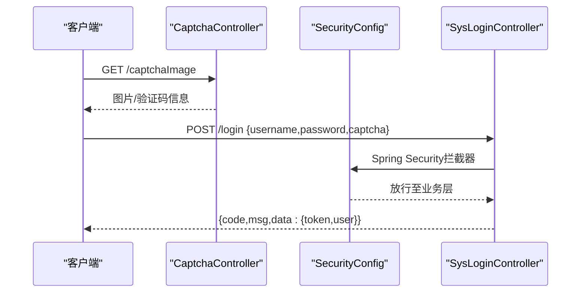
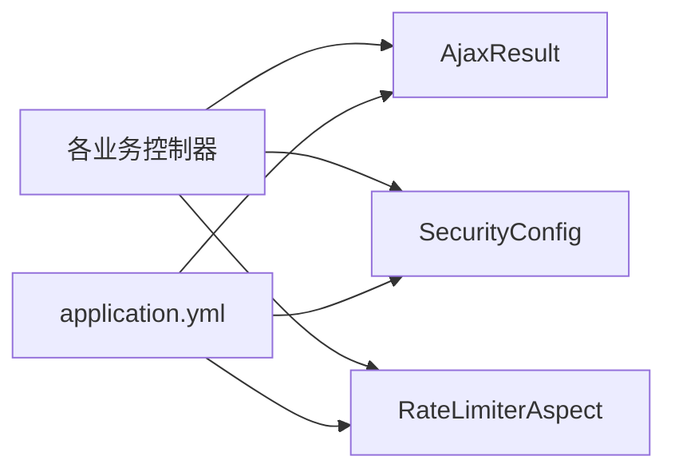

# API接口文档

<cite>
**本文引用的文件**
- [application.yml](file://XingChen-Vue/xingchen-admin/src/main/resources/application.yml)
- [AjaxResult.java](file://XingChen-Vue/xingchen-common/src/main/java/com/xingchen/common/core/domain/AjaxResult.java)
- [HttpStatus.java](file://XingChen-Vue/xingchen-common/src/main/java/com/xingchen/common/constant/HttpStatus.java)
- [SecurityConfig.java](file://XingChen-Vue/xingchen-framework/src/main/java/com/xingchen/framework/config/SecurityConfig.java)
- [RateLimiterAspect.java](file://XingChen-Vue/xingchen-framework/src/main/java/com/xingchen/framework/aspectj/RateLimiterAspect.java)
- [RateLimiter.java](file://XingChen-Vue/xingchen-common/src/main/java/com/xingchen/common/annotation/RateLimiter.java)
- [AiController.java](file://XingChen-Vue/xingchen-admin/src/main/java/com/xingchen/web/controller/al/AiController.java)
- [SysLoginController.java](file://XingChen-Vue/xingchen-admin/src/main/java/com/xingchen/web/controller/system/SysLoginController.java)
- [CaptchaController.java](file://XingChen-Vue/xingchen-admin/src/main/java/com/xingchen/web/controller/common/CaptchaController.java)
- [CommonController.java](file://XingChen-Vue/xingchen-admin/src/main/java/com/xingchen/web/controller/common/CommonController.java)
- [SysConfigController.java](file://XingChen-Vue/xingchen-admin/src/main/java/com/xingchen/web/controller/system/SysConfigController.java)
- [SysMenuController.java](file://XingChen-Vue/xingchen-admin/src/main/java/com/xingchen/web/controller/system/SysMenuController.java)
- [SysNoticeController.java](file://XingChen-Vue/xingchen-admin/src/main/java/com/xingchen/web/controller/system/SysNoticeController.java)
- [SysPostController.java](file://XingChen-Vue/xingchen-admin/src/main/java/com/xingchen/web/controller/system/SysPostController.java)
- [SysProfileController.java](file://XingChen-Vue/xingchen-admin/src/main/java/com/xingchen/web/controller/system/SysProfileController.java)
- [SysUserOnlineController.java](file://XingChen-Vue/xingchen-admin/src/main/java/com/xingchen/web/controller/monitor/SysUserOnlineController.java)
- [SysOperlogController.java](file://XingChen-Vue/xingchen-admin/src/main/java/com/xingchen/web/controller/monitor/SysOperlogController.java)
- [SysLogininforController.java](file://XingChen-Vue/xingchen-admin/src/main/java/com/xingchen/web/controller/monitor/SysLogininforController.java)
- [CacheController.java](file://XingChen-Vue/xingchen-admin/src/main/java/com/xingchen/web/controller/monitor/CacheController.java)
- [ServerController.java](file://XingChen-Vue/xingchen-admin/src/main/java/com/xingchen/web/controller/monitor/ServerController.java)
</cite>

## 目录
1. [简介](#简介)
2. [项目结构](#项目结构)
3. [核心组件](#核心组件)
4. [架构总览](#架构总览)
5. [详细组件分析](#详细组件分析)
6. [依赖分析](#依赖分析)
7. [性能考虑](#性能考虑)
8. [故障排查指南](#故障排查指南)
9. [结论](#结论)
10. [附录](#附录)

## 简介
本文件为“健康管理平台”的后端API接口规范文档，覆盖认证与授权、健康打卡、AI助手、系统管理等核心功能的RESTful接口。文档统一采用JSON响应格式，明确HTTP方法、URL模式、请求参数、响应字段与错误码，并给出认证机制、权限控制、数据校验与错误处理策略。同时提供API版本管理、限流策略与安全防护措施说明，并给出Postman集合与SDK使用建议。

## 项目结构
后端基于Spring Boot + Spring Security + JWT + MyBatis + Redis实现，API控制器按功能域划分在不同包中：
- 认证与用户：系统登录、验证码、个人资料等
- AI助手：聊天对话
- 系统管理：配置、菜单、公告、岗位、个人中心等
- 监控运维：在线用户、操作日志、登录日志、缓存、服务器监控

```mermaid
graph TB
subgraph "安全与配置"
SC["SecurityConfig<br/>安全过滤链"]
APP["application.yml<br/>配置中心"]
end
subgraph "通用层"
AR["AjaxResult<br/>统一响应"]
HS["HttpStatus<br/>状态码"]
RL["RateLimiterAspect<br/>限流切面"]
end
subgraph "业务控制器"
AC["AiController<br/>AI聊天"]
LC["SysLoginController<br/>登录/注册"]
CC["CaptchaController<br/>验证码"]
CMN["CommonController<br/>上传/下载"]
SYS_CFG["SysConfigController<br/>系统配置"]
SYS_MENU["SysMenuController<br/>菜单管理"]
SYS_NOTI["SysNoticeController<br/>公告管理"]
SYS_POST["SysPostController<br/>岗位管理"]
SYS_PROF["SysProfileController<br/>个人中心"]
MON_ONLINE["SysUserOnlineController<br/>在线用户"]
MON_OPER["SysOperlogController<br/>操作日志"]
MON_LOGIN["SysLogininforController<br/>登录日志"]
MON_CACHE["CacheController<br/>缓存监控"]
MON_SRV["ServerController<br/>服务器监控"]
end
APP --> SC
SC --> AC
SC --> LC
SC --> CC
SC --> CMN
SC --> SYS_CFG
SC --> SYS_MENU
SC --> SYS_NOTI
SC --> SYS_POST
SC --> SYS_PROF
SC --> MON_ONLINE
SC --> MON_OPER
SC --> MON_LOGIN
SC --> MON_CACHE
SC --> MON_SRV
AR --> AC
AR --> LC
AR --> CC
AR --> CMN
AR --> SYS_CFG
AR --> SYS_MENU
AR --> SYS_NOTI
AR --> SYS_POST
AR --> SYS_PROF
AR --> MON_ONLINE
AR --> MON_OPER
AR --> MON_LOGIN
AR --> MON_CACHE
AR --> MON_SRV
HS --> AR
RL --> AC
RL --> LC
RL --> CC
RL --> CMN
RL --> SYS_CFG
RL --> SYS_MENU
RL --> SYS_NOTI
RL --> SYS_POST
RL --> SYS_PROF
RL --> MON_ONLINE
RL --> MON_OPER
RL --> MON_LOGIN
RL --> MON_CACHE
RL --> MON_SRV
```

图表来源
- [SecurityConfig.java:85-118](file://XingChen-Vue/xingchen-framework/src/main/java/com/xingchen/framework/config/SecurityConfig.java#L85-L118)
- [application.yml:17-148](file://XingChen-Vue/xingchen-admin/src/main/resources/application.yml#L17-L148)
- [AjaxResult.java:13-217](file://XingChen-Vue/xingchen-common/src/main/java/com/xingchen/common/core/domain/AjaxResult.java#L13-L217)
- [HttpStatus.java:8-95](file://XingChen-Vue/xingchen-common/src/main/java/com/xingchen/common/constant/HttpStatus.java#L8-L95)
- [RateLimiterAspect.java:27-90](file://XingChen-Vue/xingchen-framework/src/main/java/com/xingchen/framework/aspectj/RateLimiterAspect.java#L27-L90)

章节来源
- [application.yml:1-148](file://XingChen-Vue/xingchen-admin/src/main/resources/application.yml#L1-L148)

## 核心组件
- 统一响应体：AjaxResult，包含code、msg、data三段式结构；状态码由HttpStatus提供常量定义。
- 安全框架：基于Spring Security + JWT，无状态会话，支持跨域与静态资源放行。
- 限流机制：基于Redis Lua脚本的滑动窗口限流，支持按IP或方法维度组合key。
- 配置中心：application.yml集中管理服务器、Redis、Token、MyBatis、Swagger等配置。

章节来源
- [AjaxResult.java:13-217](file://XingChen-Vue/xingchen-common/src/main/java/com/xingchen/common/core/domain/AjaxResult.java#L13-L217)
- [HttpStatus.java:8-95](file://XingChen-Vue/xingchen-common/src/main/java/com/xingchen/common/constant/HttpStatus.java#L8-L95)
- [SecurityConfig.java:85-118](file://XingChen-Vue/xingchen-framework/src/main/java/com/xingchen/framework/config/SecurityConfig.java#L85-L118)
- [RateLimiterAspect.java:27-90](file://XingChen-Vue/xingchen-framework/src/main/java/com/xingchen/framework/aspectj/RateLimiterAspect.java#L27-L90)
- [application.yml:48-148](file://XingChen-Vue/xingchen-admin/src/main/resources/application.yml#L48-L148)

## 架构总览
以下序列图展示一次典型登录流程：客户端请求验证码获取验证码图片，随后提交用户名、密码与验证码进行登录，服务端校验后发放JWT。

图表来源
- [CaptchaController.java:44-48](file://XingChen-Vue/xingchen-admin/src/main/java/com/xingchen/web/controller/common/CaptchaController.java#L44-L48)
- [SysLoginController.java:1-200](file://XingChen-Vue/xingchen-admin/src/main/java/com/xingchen/web/controller/system/SysLoginController.java#L1-L200)
- [SecurityConfig.java:85-118](file://XingChen-Vue/xingchen-framework/src/main/java/com/xingchen/framework/config/SecurityConfig.java#L85-L118)

## 详细组件分析

### 认证与用户接口
- 登录
  - 方法与路径：POST /login
  - 请求体参数：username、password、captcha
  - 响应：统一响应体，data包含token与用户信息
  - 权限：匿名访问
  - 限流：可结合限流注解对登录接口进行保护
- 注册
  - 方法与路径：POST /register
  - 请求体参数：用户名、密码、确认密码、手机号等（视具体字段）
  - 响应：统一响应体
  - 权限：匿名访问
- 验证码
  - 方法与路径：GET /captchaImage
  - 响应：验证码图片与标识
  - 权限：匿名访问
- 退出
  - 方法与路径：POST /logout
  - 响应：统一响应体
  - 权限：已认证用户
- 个人资料
  - 方法与路径：GET /system/profile
  - 响应：统一响应体，data为用户详情
  - 权限：已认证用户
- 修改密码
  - 方法与路径：PUT /system/profile/updatePwd
  - 请求体参数：旧密码、新密码、确认新密码
  - 响应：统一响应体
  - 权限：已认证用户

章节来源
- [SysLoginController.java:1-200](file://XingChen-Vue/xingchen-admin/src/main/java/com/xingchen/web/controller/system/SysLoginController.java#L1-L200)
- [CaptchaController.java:44-48](file://XingChen-Vue/xingchen-admin/src/main/java/com/xingchen/web/controller/common/CaptchaController.java#L44-L48)
- [SysProfileController.java:1-200](file://XingChen-Vue/xingchen-admin/src/main/java/com/xingchen/web/controller/system/SysProfileController.java#L1-L200)

### 健康打卡接口
- 健康打卡
  - 方法与路径：POST /system/profile/checkIn
  - 请求体参数：签到日期、签到状态、备注等（视具体字段）
  - 响应：统一响应体
  - 权限：已认证用户
- 打卡记录查询
  - 方法与路径：GET /system/profile/checkIn/list
  - 查询参数：日期范围、状态
  - 响应：统一响应体，data为分页列表
  - 权限：已认证用户

章节来源
- [SysProfileController.java:1-200](file://XingChen-Vue/xingchen-admin/src/main/java/com/xingchen/web/controller/system/SysProfileController.java#L1-L200)

### AI助手接口
- 发送消息
  - 方法与路径：POST /ai/chat/send
  - 请求体参数：消息内容、会话上下文（如需）
  - 响应：统一响应体，data为AI回复
  - 权限：已认证用户
  - 限流：可对发送接口添加限流注解，避免滥用

章节来源
- [AiController.java:22-40](file://XingChen-Vue/xingchen-admin/src/main/java/com/xingchen/web/controller/al/AiController.java#L22-L40)

### 系统管理接口
- 系统配置
  - 新增：POST /system/config
  - 修改：PUT /system/config
  - 删除：DELETE /system/config/{id}
  - 列表：GET /system/config/list
  - 详情：GET /system/config/{id}
  - 权限：已认证用户（受权限注解控制）
- 菜单管理
  - 新增/修改/删除/列表/树形/详情：对应REST路径
  - 权限：已认证用户
- 公告管理
  - 新增/修改/删除/列表/详情：对应REST路径
  - 权限：已认证用户
- 岗位管理
  - 新增/修改/删除/列表/详情：对应REST路径
  - 权限：已认证用户
- 在线用户
  - 列表：GET /monitor/online
  - 强退：POST /monitor/online/kickOut/{tokenId}
  - 权限：已认证用户
- 操作日志
  - 列表：GET /monitor/operlog/list
  - 导出：POST /monitor/operlog/export
  - 清理：POST /monitor/operlog/clean
  - 权限：已认证用户
- 登录日志
  - 列表：GET /monitor/logininfor/list
  - 导出：POST /monitor/logininfor/export
  - 解锁：GET /monitor/logininfor/unlock/{userName}
  - 权限：已认证用户
- 缓存监控
  - 列表键名：GET /monitor/cache/getNames
  - 列表键：GET /monitor/cache/getKeys/{cacheName}
  - 获取值：GET /monitor/cache/getValue/{cacheName}/{cacheKey}
  - 权限：已认证用户
- 服务器监控
  - 详情：GET /monitor/server
  - 权限：已认证用户

章节来源
- [SysConfigController.java:1-200](file://XingChen-Vue/xingchen-admin/src/main/java/com/xingchen/web/controller/system/SysConfigController.java#L1-L200)
- [SysMenuController.java:1-200](file://XingChen-Vue/xingchen-admin/src/main/java/com/xingchen/web/controller/system/SysMenuController.java#L1-L200)
- [SysNoticeController.java:1-200](file://XingChen-Vue/xingchen-admin/src/main/java/com/xingchen/web/controller/system/SysNoticeController.java#L1-L200)
- [SysPostController.java:1-200](file://XingChen-Vue/xingchen-admin/src/main/java/com/xingchen/web/controller/system/SysPostController.java#L1-L200)
- [SysUserOnlineController.java:1-200](file://XingChen-Vue/xingchen-admin/src/main/java/com/xingchen/web/controller/monitor/SysUserOnlineController.java#L1-L200)
- [SysOperlogController.java:1-200](file://XingChen-Vue/xingchen-admin/src/main/java/com/xingchen/web/controller/monitor/SysOperlogController.java#L1-L200)
- [SysLogininforController.java:1-200](file://XingChen-Vue/xingchen-admin/src/main/java/com/xingchen/web/controller/monitor/SysLogininforController.java#L1-L200)
- [CacheController.java:1-200](file://XingChen-Vue/xingchen-admin/src/main/java/com/xingchen/web/controller/monitor/CacheController.java#L1-L200)
- [ServerController.java:1-40](file://XingChen-Vue/xingchen-admin/src/main/java/com/xingchen/web/controller/monitor/ServerController.java#L1-L40)

### 通用接口
- 文件上传
  - 单文件：POST /common/upload
  - 多文件：POST /common/uploads
  - 响应：统一响应体，data为文件访问路径
- 文件下载
  - 下载：GET /common/download/{fileId}
  - 资源下载：GET /common/download/resource
  - 响应：二进制流或重定向

章节来源
- [CommonController.java:27-200](file://XingChen-Vue/xingchen-admin/src/main/java/com/xingchen/web/controller/common/CommonController.java#L27-L200)

## 依赖分析
- 控制器依赖统一响应体与状态码，确保一致性。
- 安全配置对匿名放行路径与鉴权路径进行声明，其余均需认证。
- 限流切面对标注了限流注解的方法进行拦截，基于Redis Lua脚本实现滑动窗口计数。
- 配置中心集中管理服务器、Redis、Token、MyBatis、Swagger等，便于运维与扩展。

图表来源
- [AjaxResult.java:13-217](file://XingChen-Vue/xingchen-common/src/main/java/com/xingchen/common/core/domain/AjaxResult.java#L13-L217)
- [SecurityConfig.java:85-118](file://XingChen-Vue/xingchen-framework/src/main/java/com/xingchen/framework/config/SecurityConfig.java#L85-L118)
- [RateLimiterAspect.java:27-90](file://XingChen-Vue/xingchen-framework/src/main/java/com/xingchen/framework/aspectj/RateLimiterAspect.java#L27-L90)
- [application.yml:48-148](file://XingChen-Vue/xingchen-admin/src/main/resources/application.yml#L48-L148)

## 性能考虑
- 无状态会话：基于JWT，降低服务端会话存储压力。
- Redis限流：滑动窗口算法，支持IP与方法维度组合key，避免热点接口被刷。
- 分页查询：日志与列表接口建议使用分页参数，避免一次性返回大量数据。
- 静态资源：通过安全配置放行，减少不必要的鉴权开销。
- Swagger：开启API文档与UI，便于联调与自动化测试。

## 故障排查指南
- 统一响应结构
  - 成功：code=200，msg为提示语，data为业务数据
  - 失败：code非200，msg为错误描述，必要时data携带额外信息
- 常见错误码
  - 400：请求参数错误
  - 401：未认证或Token无效
  - 403：权限不足
  - 404：资源不存在
  - 405：HTTP方法不允许
  - 409：资源冲突
  - 415：不支持的媒体类型
  - 500：系统内部错误
- 限流触发
  - 触发条件：超过设定的time与count阈值
  - 响应：服务端抛出业务异常，提示“访问过于频繁，请稍候再试”
- 安全相关
  - 未在Header中携带Authorization或Token无效：返回401
  - 路径未放行且未认证：返回401
  - 超出权限范围：返回403

章节来源
- [AjaxResult.java:67-171](file://XingChen-Vue/xingchen-common/src/main/java/com/xingchen/common/core/domain/AjaxResult.java#L67-L171)
- [HttpStatus.java:10-95](file://XingChen-Vue/xingchen-common/src/main/java/com/xingchen/common/constant/HttpStatus.java#L10-L95)
- [RateLimiterAspect.java:49-74](file://XingChen-Vue/xingchen-framework/src/main/java/com/xingchen/framework/aspectj/RateLimiterAspect.java#L49-L74)
- [SecurityConfig.java:85-118](file://XingChen-Vue/xingchen-framework/src/main/java/com/xingchen/framework/config/SecurityConfig.java#L85-L118)

## 结论
本API文档提供了从认证、健康打卡、AI助手到系统管理与监控运维的完整接口规范。通过统一响应体、JWT认证、Redis限流与集中配置，系统具备良好的一致性、安全性与可维护性。建议在生产环境中结合WAF、CDN与数据库读写分离进一步加固。

## 附录

### API版本管理
- 当前服务端版本：3.9.2（来自配置项）
- 文档版本：v1.0
- 建议：后续以语义化版本管理API，保持向后兼容或在Header中声明版本

章节来源
- [application.yml:2-10](file://XingChen-Vue/xingchen-admin/src/main/resources/application.yml#L2-L10)

### 认证与权限
- 认证方式：Bearer Token（Header中名为Authorization）
- 有效载荷：用户标识、角色、权限等（由后端生成）
- 权限控制：基于注解与URL白名单，其余接口需认证

章节来源
- [application.yml:95-103](file://XingChen-Vue/xingchen-admin/src/main/resources/application.yml#L95-L103)
- [SecurityConfig.java:85-118](file://XingChen-Vue/xingchen-framework/src/main/java/com/xingchen/framework/config/SecurityConfig.java#L85-L118)

### 限流策略
- 实现：Redis + Lua脚本（滑动窗口）
- 维度：方法签名 + IP（可选） + 自定义key
- 默认：每60秒最多100次（可通过注解调整）

章节来源
- [RateLimiter.java:19-40](file://XingChen-Vue/xingchen-common/src/main/java/com/xingchen/common/annotation/RateLimiter.java#L19-L40)
- [RateLimiterAspect.java:49-88](file://XingChen-Vue/xingchen-framework/src/main/java/com/xingchen/framework/aspectj/RateLimiterAspect.java#L49-L88)

### 安全防护
- XSS防护：启用XSS过滤，排除特定路径
- 防盗链：可配置允许域名列表
- CORS：通过过滤器支持跨域
- CSRF：禁用（无状态）

章节来源
- [application.yml:133-148](file://XingChen-Vue/xingchen-admin/src/main/resources/application.yml#L133-L148)
- [SecurityConfig.java:85-118](file://XingChen-Vue/xingchen-framework/src/main/java/com/xingchen/framework/config/SecurityConfig.java#L85-L118)

### Postman集合与SDK使用建议
- Postman集合
  - 建议按模块分组：认证、健康打卡、AI助手、系统管理、监控运维
  - 变量：server.url（如http://localhost:8080）、Authorization（Bearer token）
  - 预请求脚本：登录后保存token到环境变量
  - 测试脚本：断言code=200与必填字段存在
- SDK使用
  - 建议封装AjaxResult解析器与统一异常处理
  - 提供Token中间件自动注入Authorization头
  - 提供分页工具与文件上传/下载工具

[本节为通用实践建议，无需特定文件引用]