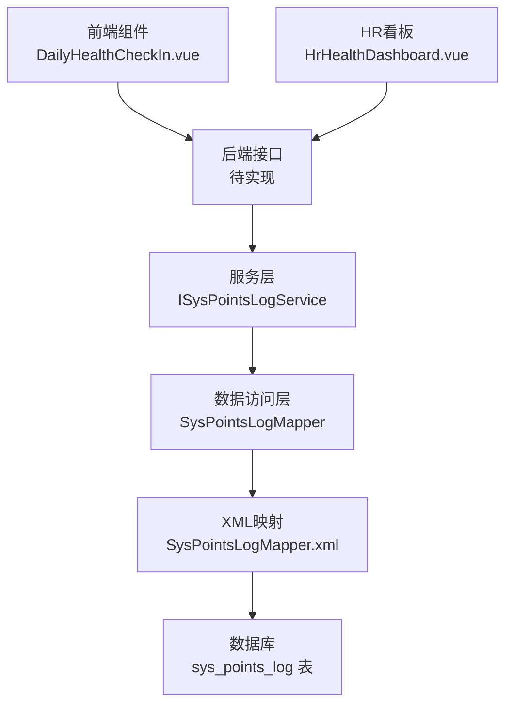
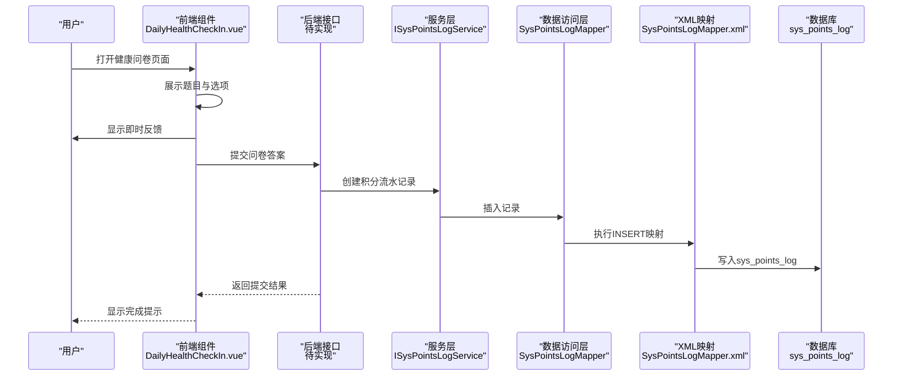
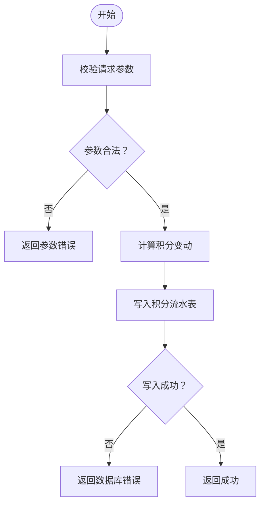
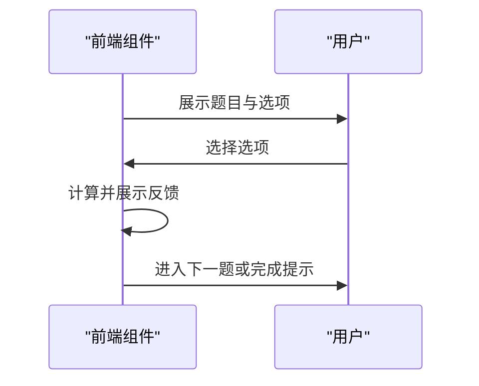
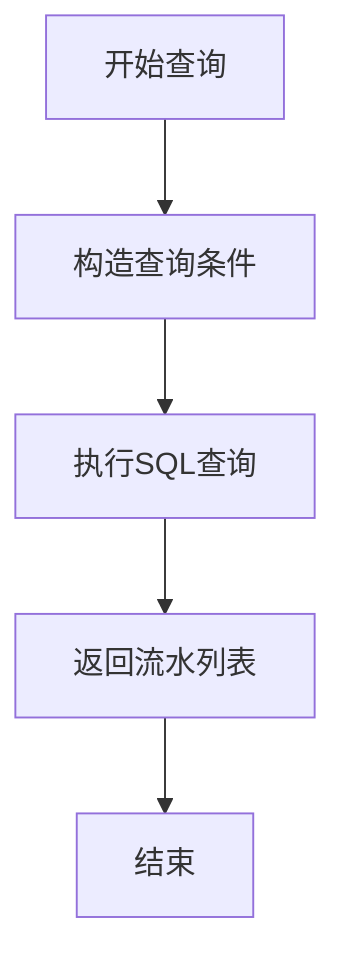
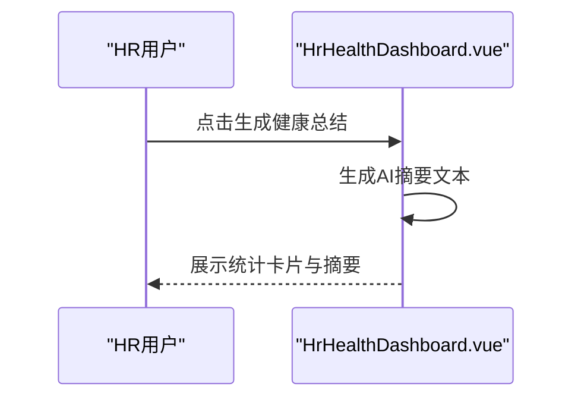
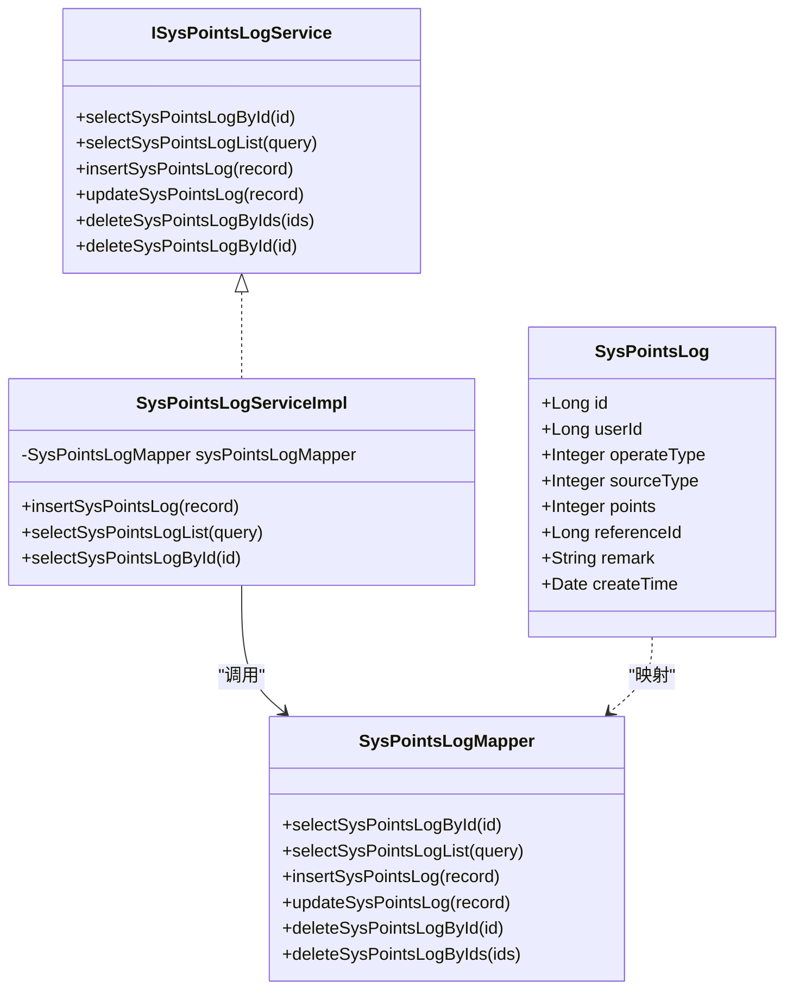

# 健康服务接口

<cite>
**本文档引用的文件**
- [DailyHealthCheckIn.vue](file://XingChen-Vue3/src/components/DailyHealthCheckIn.vue)
- [SysPointsLog.java](file://XingChen-Vue/xingchen-system/src/main/java/com/xingchen/system/domain/SysPointsLog.java)
- [SysPointsLogMapper.java](file://XingChen-Vue/xingchen-system/src/main/java/com/xingchen/system/mapper/SysPointsLogMapper.java)
- [SysPointsLogMapper.xml](file://XingChen-Vue/xingchen-system/src/main/resources/mapper/system/SysPointsLogMapper.xml)
- [ISysPointsLogService.java](file://XingChen-Vue/xingchen-system/src/main/java/com/xingchen/system/service/ISysPointsLogService.java)
- [SysPointsLogServiceImpl.java](file://XingChen-Vue/xingchen-system/src/main/java/com/xingchen/system/service/impl/SysPointsLogServiceImpl.java)
- [points_log.sql](file://XingChen-Vue/sql/points_log.sql)
- [ry_20260321.sql](file://XingChen-Vue/sql/ry_20260321.sql)
- [HrHealthDashboard.vue](file://XingChen-Vue3/src/views/hr/HrHealthDashboard.vue)
</cite>

## 目录
1. [简介](#简介)
2. [项目结构](#项目结构)
3. [核心组件](#核心组件)
4. [架构总览](#架构总览)
5. [详细组件分析](#详细组件分析)
6. [依赖关系分析](#依赖关系分析)
7. [性能考虑](#性能考虑)
8. [故障排除指南](#故障排除指南)
9. [结论](#结论)

## 简介
本文件面向健康服务相关API接口的完整文档，覆盖以下能力：
- 健康打卡接口：提供每日健康问卷答题与结果提交，支持游戏化体验与即时反馈。
- 健康问卷接口：基于前端组件的交互式问答流程，支持多题型与反馈提示。
- 积分查询接口：查询用户积分流水，支持按时间范围、操作类型、来源类型筛选。
- 健康数据统计接口：HR端看板的健康数据概览与AI分析摘要（演示功能）。

文档详细记录每个接口的请求参数、响应数据结构、业务逻辑与使用场景，并说明健康数据的存储格式、积分计算规则、数据验证与异常处理机制，同时提供调用示例与错误处理方案。

## 项目结构
健康服务涉及前后端协作：
- 前端组件负责健康问卷交互与数据收集，后端提供积分流水查询与HR看板数据支撑。
- 后端采用Spring Boot + MyBatis，积分流水通过Mapper/XML映射持久化至MySQL。

图表来源
- [DailyHealthCheckIn.vue:1-94](file://XingChen-Vue3/src/components/DailyHealthCheckIn.vue#L1-L94)
- [SysPointsLogMapper.java:1-60](file://XingChen-Vue/xingchen-system/src/main/java/com/xingchen/system/mapper/SysPointsLogMapper.java#L1-L60)
- [SysPointsLogMapper.xml:22-46](file://XingChen-Vue/xingchen-system/src/main/resources/mapper/system/SysPointsLogMapper.xml#L22-L46)
- [SysPointsLog.java:43-104](file://XingChen-Vue/xingchen-system/src/main/java/com/xingchen/system/domain/SysPointsLog.java#L43-L104)
- [HrHealthDashboard.vue:1-154](file://XingChen-Vue3/src/views/hr/HrHealthDashboard.vue#L1-L154)

章节来源
- [DailyHealthCheckIn.vue:1-94](file://XingChen-Vue3/src/components/DailyHealthCheckIn.vue#L1-L94)
- [SysPointsLogMapper.java:1-60](file://XingChen-Vue/xingchen-system/src/main/java/com/xingchen/system/mapper/SysPointsLogMapper.java#L1-L60)
- [SysPointsLogMapper.xml:22-46](file://XingChen-Vue/xingchen-system/src/main/resources/mapper/system/SysPointsLogMapper.xml#L22-L46)
- [SysPointsLog.java:43-104](file://XingChen-Vue/xingchen-system/src/main/java/com/xingchen/system/domain/SysPointsLog.java#L43-L104)
- [HrHealthDashboard.vue:1-154](file://XingChen-Vue3/src/views/hr/HrHealthDashboard.vue#L1-L154)

## 核心组件
- 健康问卷组件（前端）：提供三道健康问答题，支持选项选择与即时反馈，最终完成打卡。
- 积分流水模型与持久化：SysPointsLog实体、Mapper接口与XML映射，支持按条件查询与新增。
- HR健康看板（演示）：展示AI健康分析摘要与异常预警动态。

章节来源
- [DailyHealthCheckIn.vue:1-94](file://XingChen-Vue3/src/components/DailyHealthCheckIn.vue#L1-L94)
- [SysPointsLog.java:43-104](file://XingChen-Vue/xingchen-system/src/main/java/com/xingchen/system/domain/SysPointsLog.java#L43-L104)
- [SysPointsLogMapper.java:1-60](file://XingChen-Vue/xingchen-system/src/main/java/com/xingchen/system/mapper/SysPointsLogMapper.java#L1-L60)
- [SysPointsLogMapper.xml:22-46](file://XingChen-Vue/xingchen-system/src/main/resources/mapper/system/SysPointsLogMapper.xml#L22-L46)
- [HrHealthDashboard.vue:1-154](file://XingChen-Vue3/src/views/hr/HrHealthDashboard.vue#L1-L154)

## 架构总览
健康服务的典型调用链路如下：

图表来源
- [DailyHealthCheckIn.vue:1-94](file://XingChen-Vue3/src/components/DailyHealthCheckIn.vue#L1-L94)
- [ISysPointsLogService.java:1-60](file://XingChen-Vue/xingchen-system/src/main/java/com/xingchen/system/service/ISysPointsLogService.java#L1-L60)
- [SysPointsLogMapper.java:1-60](file://XingChen-Vue/xingchen-system/src/main/java/com/xingchen/system/mapper/SysPointsLogMapper.java#L1-L60)
- [SysPointsLogMapper.xml:45-46](file://XingChen-Vue/xingchen-system/src/main/resources/mapper/system/SysPointsLogMapper.xml#L45-L46)
- [SysPointsLog.java:43-104](file://XingChen-Vue/xingchen-system/src/main/java/com/xingchen/system/domain/SysPointsLog.java#L43-L104)

## 详细组件分析

### 健康打卡接口
- 接口用途：接收用户提交的健康问卷答案，触发积分流水记录。
- 请求参数（示例，字段名以实际接口为准）：
  - userId：用户ID（必填）
  - answers：题目答案数组（每题选择的选项值）
  - referenceId：业务关联ID（可选，如本次打卡记录ID）
- 响应数据结构：
  - code：状态码（0表示成功）
  - msg：消息
  - data：提交结果或流水ID
- 业务逻辑：
  - 校验用户与答案完整性
  - 计算本次积分变动（由业务规则决定）
  - 写入sys_points_log，operate_type=收入，source_type=每日打卡
- 使用场景：每日健康问卷提交，完成后获得相应积分奖励。
- 数据验证与异常处理：
  - 必填字段校验
  - 答案合法性校验
  - 数据库写入异常捕获与统一返回

图表来源
- [SysPointsLogMapper.xml:45-46](file://XingChen-Vue/xingchen-system/src/main/resources/mapper/system/SysPointsLogMapper.xml#L45-L46)
- [SysPointsLog.java:43-104](file://XingChen-Vue/xingchen-system/src/main/java/com/xingchen/system/domain/SysPointsLog.java#L43-L104)

章节来源
- [DailyHealthCheckIn.vue:1-94](file://XingChen-Vue3/src/components/DailyHealthCheckIn.vue#L1-L94)
- [SysPointsLogMapper.xml:45-46](file://XingChen-Vue/xingchen-system/src/main/resources/mapper/system/SysPointsLogMapper.xml#L45-L46)
- [SysPointsLog.java:43-104](file://XingChen-Vue/xingchen-system/src/main/java/com/xingchen/system/domain/SysPointsLog.java#L43-L104)

### 健康问卷接口
- 接口用途：提供健康问卷题目与选项，支持用户逐题作答并即时反馈。
- 请求参数（示例）：
  - currentStep：当前题目序号
  - selectedOption：用户选择的选项值
- 响应数据结构：
  - question：当前题目
  - feedback：针对选项的即时反馈文案
  - finished：是否完成所有题目
- 业务逻辑：
  - 前端维护题目列表与进度
  - 选项点击后展示对应反馈
  - 全部完成后提示完成打卡
- 使用场景：日常健康自检，提升用户参与度与健康意识。

图表来源
- [DailyHealthCheckIn.vue:1-94](file://XingChen-Vue3/src/components/DailyHealthCheckIn.vue#L1-L94)

章节来源
- [DailyHealthCheckIn.vue:1-94](file://XingChen-Vue3/src/components/DailyHealthCheckIn.vue#L1-L94)

### 积分查询接口
- 接口用途：查询用户的积分流水，支持按用户、时间范围、操作类型、来源类型筛选。
- 请求参数：
  - userId：用户ID（可选）
  - operateType：操作类型（1=收入，2=支出，可选）
  - sourceType：来源类型（1=每日打卡，2=连续打卡奖励，3=兑换商品消耗，4=HR手动退还，可选）
  - beginCreateTime：开始时间（可选）
  - endCreateTime：结束时间（可选）
- 响应数据结构：
  - code：状态码
  - msg：消息
  - data：积分流水列表（按时间倒序）
- 业务逻辑：
  - 构造查询条件（动态SQL）
  - 按create_time降序返回
- 使用场景：用户查看积分明细，HR审计积分变动。

图表来源
- [SysPointsLogMapper.xml:22-38](file://XingChen-Vue/xingchen-system/src/main/resources/mapper/system/SysPointsLogMapper.xml#L22-L38)
- [ISysPointsLogService.java:21-27](file://XingChen-Vue/xingchen-system/src/main/java/com/xingchen/system/service/ISysPointsLogService.java#L21-L27)

章节来源
- [SysPointsLogMapper.xml:22-38](file://XingChen-Vue/xingchen-system/src/main/resources/mapper/system/SysPointsLogMapper.xml#L22-L38)
- [ISysPointsLogService.java:21-27](file://XingChen-Vue/xingchen-system/src/main/java/com/xingchen/system/service/ISysPointsLogService.java#L21-L27)

### 健康数据统计接口（HR看板）
- 接口用途：HR端健康看板的数据支撑（演示功能），包括AI健康分析摘要与异常预警动态。
- 请求参数：无（演示数据）
- 响应数据结构：
  - summaryText：AI生成的健康分析摘要
  - alertDepts：异常预警部门数
  - highPressureUsers：高压用户数
  - checkInUsers：当日打卡人数
- 业务逻辑：
  - 展示模拟统计数据与AI摘要
  - 支持重新生成摘要
- 使用场景：HR宏观掌握员工健康状况，识别风险部门与个体。

图表来源
- [HrHealthDashboard.vue:1-154](file://XingChen-Vue3/src/views/hr/HrHealthDashboard.vue#L1-L154)

章节来源
- [HrHealthDashboard.vue:1-154](file://XingChen-Vue3/src/views/hr/HrHealthDashboard.vue#L1-L154)

## 依赖关系分析
- 前端组件依赖：Vue生态、Element Plus、ECharts（看板）
- 后端依赖：Spring Boot、MyBatis、MySQL
- 数据模型：SysPointsLog实体与sys_points_log表结构一致

图表来源
- [SysPointsLog.java:43-104](file://XingChen-Vue/xingchen-system/src/main/java/com/xingchen/system/domain/SysPointsLog.java#L43-L104)
- [ISysPointsLogService.java:1-60](file://XingChen-Vue/xingchen-system/src/main/java/com/xingchen/system/service/ISysPointsLogService.java#L1-L60)
- [SysPointsLogServiceImpl.java:1-57](file://XingChen-Vue/xingchen-system/src/main/java/com/xingchen/system/service/impl/SysPointsLogServiceImpl.java#L1-L57)
- [SysPointsLogMapper.java:1-60](file://XingChen-Vue/xingchen-system/src/main/java/com/xingchen/system/mapper/SysPointsLogMapper.java#L1-L60)

章节来源
- [SysPointsLog.java:43-104](file://XingChen-Vue/xingchen-system/src/main/java/com/xingchen/system/domain/SysPointsLog.java#L43-L104)
- [ISysPointsLogService.java:1-60](file://XingChen-Vue/xingchen-system/src/main/java/com/xingchen/system/service/ISysPointsLogService.java#L1-L60)
- [SysPointsLogServiceImpl.java:1-57](file://XingChen-Vue/xingchen-system/src/main/java/com/xingchen/system/service/impl/SysPointsLogServiceImpl.java#L1-L57)
- [SysPointsLogMapper.java:1-60](file://XingChen-Vue/xingchen-system/src/main/java/com/xingchen/system/mapper/SysPointsLogMapper.java#L1-L60)

## 性能考虑
- 数据库索引：sys_points_log表对user_id与reference_id建立索引，有利于按用户与业务ID查询。
- 分页与排序：查询接口按create_time倒序，建议结合分页参数避免一次性返回大量数据。
- 缓存策略：高频查询可引入Redis缓存（如用户积分余额），减少数据库压力。
- SQL优化：动态条件查询使用MyBatis条件标签，避免全表扫描。

## 故障排除指南
- 参数校验失败：检查请求体字段是否完整，确保必填项非空。
- 数据库写入异常：检查数据库连接、表结构与字段类型是否匹配。
- 查询无结果：确认筛选条件（时间范围、用户ID、类型）是否正确。
- 前端交互异常：检查组件状态管理与事件绑定，确保选项选择与反馈展示正常。

章节来源
- [SysPointsLogMapper.xml:22-38](file://XingChen-Vue/xingchen-system/src/main/resources/mapper/system/SysPointsLogMapper.xml#L22-L38)
- [SysPointsLog.java:43-104](file://XingChen-Vue/xingchen-system/src/main/java/com/xingchen/system/domain/SysPointsLog.java#L43-L104)

## 结论
本健康服务接口文档梳理了健康打卡、问卷交互、积分查询与HR看板的关键能力与实现要点。通过SysPointsLog模型与MyBatis映射，实现了积分流水的可靠持久化；前端组件提供了良好的用户体验与即时反馈。后续可在接口层面完善健康打卡提交与HR看板数据对接，确保前后端协同顺畅。