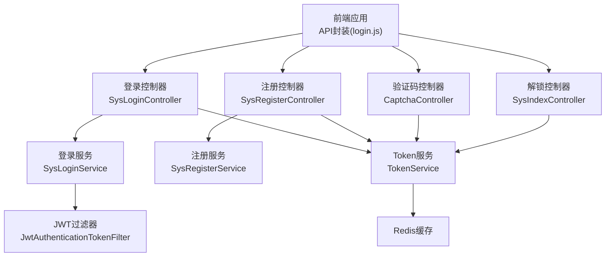
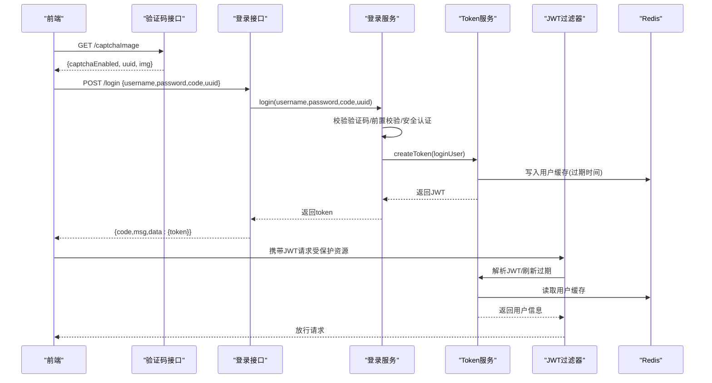
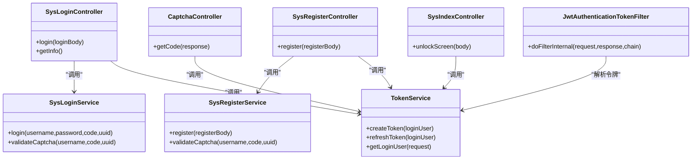

# 用户认证接口

<cite>
**本文引用的文件**
- [SysLoginController.java](file://XingChen-Vue/xingchen-admin/src/main/java/com/xingchen/web/controller/system/SysLoginController.java)
- [SysRegisterController.java](file://XingChen-Vue/xingchen-admin/src/main/java/com/xingchen/web/controller/system/SysRegisterController.java)
- [SysIndexController.java](file://XingChen-Vue/xingchen-admin/src/main/java/com/xingchen/web/controller/system/SysIndexController.java)
- [CaptchaController.java](file://XingChen-Vue/xingchen-admin/src/main/java/com/xingchen/web/controller/common/CaptchaController.java)
- [TokenService.java](file://XingChen-Vue/xingchen-framework/src/main/java/com/xingchen/framework/web/service/TokenService.java)
- [SysLoginService.java](file://XingChen-Vue/xingchen-framework/src/main/java/com/xingchen/framework/web/service/SysLoginService.java)
- [SysRegisterService.java](file://XingChen-Vue/xingchen-framework/src/main/java/com/xingchen/framework/web/service/SysRegisterService.java)
- [JwtAuthenticationTokenFilter.java](file://XingChen-Vue/xingchen-framework/src/main/java/com/xingchen/framework/security/filter/JwtAuthenticationTokenFilter.java)
- [LogoutSuccessHandlerImpl.java](file://XingChen-Vue/xingchen-framework/src/main/java/com/xingchen/framework/security/handle/LogoutSuccessHandlerImpl.java)
- [login.js](file://XingChen-Vue3/src/api/login.js)
- [lock.vue](file://XingChen-Vue3/src/views/lock.vue)
</cite>

## 目录
1. [简介](#简介)
2. [项目结构](#项目结构)
3. [核心组件](#核心组件)
4. [架构总览](#架构总览)
5. [详细组件分析](#详细组件分析)
6. [依赖关系分析](#依赖关系分析)
7. [性能考虑](#性能考虑)
8. [故障排查指南](#故障排查指南)
9. [结论](#结论)

## 简介
本文件面向前后端开发者与测试人员，系统化梳理健康管理系统中的用户认证相关API接口，覆盖登录、注册、获取用户信息、验证码、退出登录、解锁屏幕等接口。文档同时解释JWT Token认证机制、验证码生成与验证流程、用户状态管理与会话处理策略，帮助读者快速理解并正确集成这些接口。

## 项目结构
后端采用Spring Boot + Spring Security + JWT + Redis的认证体系，前端通过统一的API封装发起请求。认证相关的关键模块如下：
- 控制器层：提供REST接口（登录、注册、获取信息、验证码、解锁）
- 业务服务层：负责登录校验、注册校验、Token签发与刷新
- 安全过滤层：拦截请求解析JWT、注入认证上下文
- 前端API封装：统一请求路径与参数格式

图表来源
- [SysLoginController.java:56-65](file://XingChen-Vue/xingchen-admin/src/main/java/com/xingchen/web/controller/system/SysLoginController.java#L56-L65)
- [SysRegisterController.java:28-37](file://XingChen-Vue/xingchen-admin/src/main/java/com/xingchen/web/controller/system/SysRegisterController.java#L28-L37)
- [CaptchaController.java:45-93](file://XingChen-Vue/xingchen-admin/src/main/java/com/xingchen/web/controller/common/CaptchaController.java#L45-L93)
- [SysIndexController.java:43-63](file://XingChen-Vue/xingchen-admin/src/main/java/com/xingchen/web/controller/system/SysIndexController.java#L43-L63)
- [SysLoginService.java:63-100](file://XingChen-Vue/xingchen-framework/src/main/java/com/xingchen/framework/web/service/SysLoginService.java#L63-L100)
- [SysRegisterService.java:42-93](file://XingChen-Vue/xingchen-framework/src/main/java/com/xingchen/framework/web/service/SysRegisterService.java#L42-L93)
- [TokenService.java:114-155](file://XingChen-Vue/xingchen-framework/src/main/java/com/xingchen/framework/web/service/TokenService.java#L114-L155)
- [JwtAuthenticationTokenFilter.java:30-43](file://XingChen-Vue/xingchen-framework/src/main/java/com/xingchen/framework/security/filter/JwtAuthenticationTokenFilter.java#L30-L43)

章节来源
- [SysLoginController.java:56-93](file://XingChen-Vue/xingchen-admin/src/main/java/com/xingchen/web/controller/system/SysLoginController.java#L56-L93)
- [SysRegisterController.java:28-37](file://XingChen-Vue/xingchen-admin/src/main/java/com/xingchen/web/controller/system/SysRegisterController.java#L28-L37)
- [CaptchaController.java:45-93](file://XingChen-Vue/xingchen-admin/src/main/java/com/xingchen/web/controller/common/CaptchaController.java#L45-L93)
- [SysIndexController.java:43-63](file://XingChen-Vue/xingchen-admin/src/main/java/com/xingchen/web/controller/system/SysIndexController.java#L43-L63)

## 核心组件
- 登录控制器：接收用户名/密码/验证码/唯一标识，返回JWT令牌
- 注册控制器：接收注册信息，返回注册结果
- 验证码控制器：按配置生成图片验证码，返回uuid与图片内容
- 解锁控制器：校验用户密码，允许解锁屏幕
- 登录服务：完成验证码校验、前置校验、安全认证、登录日志记录
- 注册服务：完成验证码校验、参数校验、密码加密与入库
- Token服务：签发/刷新JWT，解析请求头中的令牌，读写Redis缓存
- JWT过滤器：从请求头提取令牌，解析并注入认证上下文
- 退出处理器：清理Redis中的用户缓存，记录登出日志

章节来源
- [SysLoginController.java:56-93](file://XingChen-Vue/xingchen-admin/src/main/java/com/xingchen/web/controller/system/SysLoginController.java#L56-L93)
- [SysRegisterController.java:28-37](file://XingChen-Vue/xingchen-admin/src/main/java/com/xingchen/web/controller/system/SysRegisterController.java#L28-L37)
- [CaptchaController.java:45-93](file://XingChen-Vue/xingchen-admin/src/main/java/com/xingchen/web/controller/common/CaptchaController.java#L45-L93)
- [SysIndexController.java:43-63](file://XingChen-Vue/xingchen-admin/src/main/java/com/xingchen/web/controller/system/SysIndexController.java#L43-L63)
- [SysLoginService.java:63-100](file://XingChen-Vue/xingchen-framework/src/main/java/com/xingchen/framework/web/service/SysLoginService.java#L63-L100)
- [SysRegisterService.java:42-93](file://XingChen-Vue/xingchen-framework/src/main/java/com/xingchen/framework/web/service/SysRegisterService.java#L42-L93)
- [TokenService.java:114-155](file://XingChen-Vue/xingchen-framework/src/main/java/com/xingchen/framework/web/service/TokenService.java#L114-L155)
- [JwtAuthenticationTokenFilter.java:30-43](file://XingChen-Vue/xingchen-framework/src/main/java/com/xingchen/framework/security/filter/JwtAuthenticationTokenFilter.java#L30-L43)
- [LogoutSuccessHandlerImpl.java:38-52](file://XingChen-Vue/xingchen-framework/src/main/java/com/xingchen/framework/security/handle/LogoutSuccessHandlerImpl.java#L38-L52)

## 架构总览
下图展示一次完整登录流程：前端请求验证码获取uuid，提交登录时附带uuid与验证码；后端校验验证码与账号密码，签发JWT并写入Redis；后续请求由JWT过滤器解析令牌注入认证上下文。

图表来源
- [CaptchaController.java:45-93](file://XingChen-Vue/xingchen-admin/src/main/java/com/xingchen/web/controller/common/CaptchaController.java#L45-L93)
- [SysLoginController.java:56-65](file://XingChen-Vue/xingchen-admin/src/main/java/com/xingchen/web/controller/system/SysLoginController.java#L56-L65)
- [SysLoginService.java:63-100](file://XingChen-Vue/xingchen-framework/src/main/java/com/xingchen/framework/web/service/SysLoginService.java#L63-L100)
- [TokenService.java:114-155](file://XingChen-Vue/xingchen-framework/src/main/java/com/xingchen/framework/web/service/TokenService.java#L114-L155)
- [JwtAuthenticationTokenFilter.java:30-43](file://XingChen-Vue/xingchen-framework/src/main/java/com/xingchen/framework/security/filter/JwtAuthenticationTokenFilter.java#L30-L43)

## 详细组件分析

### 登录接口 /login
- 方法与路径：POST /login
- 请求体字段
  - username：用户名
  - password：密码
  - code：验证码
  - uuid：验证码唯一标识
- 成功响应
  - data.token：JWT字符串
- 失败响应
  - 常见错误：验证码错误/过期、用户名或密码为空、密码长度不合法、账号不存在、黑名单IP、认证失败等
- 使用示例
  - 先调用验证码接口获取uuid与图片，用户输入验证码后提交登录请求
- 关键实现要点
  - 登录服务先校验验证码与前置条件，再进行安全认证，最后生成JWT并写入Redis
  - 控制器将token放入data返回

章节来源
- [SysLoginController.java:56-65](file://XingChen-Vue/xingchen-admin/src/main/java/com/xingchen/web/controller/system/SysLoginController.java#L56-L65)
- [SysLoginService.java:63-100](file://XingChen-Vue/xingchen-framework/src/main/java/com/xingchen/framework/web/service/SysLoginService.java#L63-L100)
- [TokenService.java:114-155](file://XingChen-Vue/xingchen-framework/src/main/java/com/xingchen/framework/web/service/TokenService.java#L114-L155)

### 注册接口 /register
- 方法与路径：POST /register
- 请求体字段
  - username：用户名
  - password：密码
  - code：验证码（可选，取决于系统配置）
  - uuid：验证码唯一标识（可选）
- 成功响应
  - data为空表示注册成功
- 失败响应
  - 当前未开启注册功能、用户名重复、参数非法、验证码错误/过期、注册失败等
- 使用示例
  - 若系统开启注册，则先获取验证码，填写注册表单后提交
- 关键实现要点
  - 注册服务根据配置决定是否校验验证码，随后进行参数与唯一性校验，加密密码并入库

章节来源
- [SysRegisterController.java:28-37](file://XingChen-Vue/xingchen-admin/src/main/java/com/xingchen/web/controller/system/SysRegisterController.java#L28-L37)
- [SysRegisterService.java:42-93](file://XingChen-Vue/xingchen-framework/src/main/java/com/xingchen/framework/web/service/SysRegisterService.java#L42-L93)

### 获取用户信息接口 /getInfo
- 方法与路径：GET /getInfo
- 请求头
  - Authorization：携带JWT
- 成功响应字段
  - data.user：当前用户对象
  - data.roles：角色集合
  - data.permissions：权限集合
  - data.isDefaultModifyPwd：初始密码是否需要修改
  - data.isPasswordExpired：密码是否过期
- 失败响应
  - 未携带有效令牌、令牌解析失败、用户不存在等
- 使用示例
  - 登录成功后，携带token请求此接口获取用户详情与权限

章节来源
- [SysLoginController.java:72-93](file://XingChen-Vue/xingchen-admin/src/main/java/com/xingchen/web/controller/system/SysLoginController.java#L72-L93)
- [TokenService.java:62-83](file://XingChen-Vue/xingchen-framework/src/main/java/com/xingchen/framework/web/service/TokenService.java#L62-L83)

### 验证码接口 /captchaImage
- 方法与路径：GET /captchaImage
- 响应字段
  - data.captchaEnabled：验证码开关
  - data.uuid：本次验证码的唯一标识
  - data.img：Base64编码的图片字节流
- 使用示例
  - 前端显示图片，用户输入验证码；提交登录/注册时附带uuid与code
- 关键实现要点
  - 根据配置生成字母或算术验证码，写入Redis并设置过期时间，返回uuid与图片

章节来源
- [CaptchaController.java:45-93](file://XingChen-Vue/xingchen-admin/src/main/java/com/xingchen/web/controller/common/CaptchaController.java#L45-L93)

### 退出登录接口 /logout
- 方法与路径：POST /logout
- 请求头
  - Authorization：携带JWT
- 成功响应
  - 返回“登出成功”消息
- 关键实现要点
  - 退出处理器解析当前用户，删除Redis中的用户缓存，记录登出日志并返回成功

章节来源
- [LogoutSuccessHandlerImpl.java:38-52](file://XingChen-Vue/xingchen-framework/src/main/java/com/xingchen/framework/security/handle/LogoutSuccessHandlerImpl.java#L38-L52)
- [TokenService.java:99-106](file://XingChen-Vue/xingchen-framework/src/main/java/com/xingchen/framework/web/service/TokenService.java#L99-L106)

### 解锁屏幕接口 /unlockscreen
- 方法与路径：POST /unlockscreen
- 请求体字段
  - password：用户密码
- 成功响应
  - 返回“解锁成功”
- 失败响应
  - 密码为空、服务器超时需重新登录、密码错误
- 使用示例
  - 屏幕锁定状态下，输入密码解锁

章节来源
- [SysIndexController.java:43-63](file://XingChen-Vue/xingchen-admin/src/main/java/com/xingchen/web/controller/system/SysIndexController.java#L43-L63)

### 前端API封装与调用
- 前端通过统一API封装发起请求，包含登录、注册、获取用户信息、验证码、退出登录、解锁屏幕等
- 登录与验证码接口禁用token头，注册接口禁用token头
- 解锁屏幕接口在前端视图中被调用，成功后恢复之前访问的页面

章节来源
- [login.js:4-69](file://XingChen-Vue3/src/api/login.js#L4-L69)
- [lock.vue:76-96](file://XingChen-Vue3/src/views/lock.vue#L76-L96)

## 依赖关系分析
- 控制器依赖服务层与Token服务
- 登录服务依赖认证管理器、Redis缓存、用户服务与配置服务
- Token服务依赖Redis与JWT库
- JWT过滤器依赖Token服务解析请求头中的令牌
- 退出处理器依赖Token服务与异步日志

图表来源
- [SysLoginController.java:56-93](file://XingChen-Vue/xingchen-admin/src/main/java/com/xingchen/web/controller/system/SysLoginController.java#L56-L93)
- [SysRegisterController.java:28-37](file://XingChen-Vue/xingchen-admin/src/main/java/com/xingchen/web/controller/system/SysRegisterController.java#L28-L37)
- [CaptchaController.java:45-93](file://XingChen-Vue/xingchen-admin/src/main/java/com/xingchen/web/controller/common/CaptchaController.java#L45-L93)
- [SysIndexController.java:43-63](file://XingChen-Vue/xingchen-admin/src/main/java/com/xingchen/web/controller/system/SysIndexController.java#L43-L63)
- [SysLoginService.java:63-100](file://XingChen-Vue/xingchen-framework/src/main/java/com/xingchen/framework/web/service/SysLoginService.java#L63-L100)
- [SysRegisterService.java:42-93](file://XingChen-Vue/xingchen-framework/src/main/java/com/xingchen/framework/web/service/SysRegisterService.java#L42-L93)
- [TokenService.java:114-155](file://XingChen-Vue/xingchen-framework/src/main/java/com/xingchen/framework/web/service/TokenService.java#L114-L155)
- [JwtAuthenticationTokenFilter.java:30-43](file://XingChen-Vue/xingchen-framework/src/main/java/com/xingchen/framework/security/filter/JwtAuthenticationTokenFilter.java#L30-L43)

## 性能考虑
- Token有效期与自动刷新
  - Token服务在距离过期时间不足20分钟时自动刷新，减少频繁登录带来的用户体验问题
- Redis缓存命中
  - 登录态与用户信息存储于Redis，避免数据库压力；验证码与用户缓存均设置合理过期时间
- 过滤器开销
  - JWT过滤器仅在每次请求时解析令牌并注入上下文，逻辑轻量，对性能影响较小
- 建议
  - 合理设置token过期时间与刷新阈值
  - 对高并发场景建议启用Redis集群与连接池优化

章节来源
- [TokenService.java:133-141](file://XingChen-Vue/xingchen-framework/src/main/java/com/xingchen/framework/web/service/TokenService.java#L133-L141)
- [JwtAuthenticationTokenFilter.java:30-43](file://XingChen-Vue/xingchen-framework/src/main/java/com/xingchen/framework/security/filter/JwtAuthenticationTokenFilter.java#L30-L43)

## 故障排查指南
- 验证码相关
  - 验证码未开启：验证码接口返回captchaEnabled=false
  - 验证码过期：登录/注册时抛出验证码过期异常
  - 验证码错误：登录/注册时抛出验证码错误异常
- 登录相关
  - 用户名或密码为空：触发用户不存在异常
  - 密码长度不合法：触发密码不匹配异常
  - 黑名单IP：触发黑名单异常
  - 认证失败：触发凭证错误异常
- 注册相关
  - 未开启注册：返回“当前系统没有开启注册功能”
  - 用户名重复：返回“注册账号已存在”
  - 注册失败：返回“注册失败,请联系系统管理人员”
- 会话与退出
  - 退出成功：清理Redis缓存并记录登出日志
  - 解锁失败：密码为空、服务器超时或密码错误
- 前端调用
  - 登录与验证码接口需禁用token头；注册接口禁用token头
  - 解锁屏幕接口在前端视图中调用，注意捕获错误并重置输入框

章节来源
- [CaptchaController.java:45-93](file://XingChen-Vue/xingchen-admin/src/main/java/com/xingchen/web/controller/common/CaptchaController.java#L45-L93)
- [SysLoginService.java:110-129](file://XingChen-Vue/xingchen-framework/src/main/java/com/xingchen/framework/web/service/SysLoginService.java#L110-L129)
- [SysRegisterService.java:103-116](file://XingChen-Vue/xingchen-framework/src/main/java/com/xingchen/framework/web/service/SysRegisterService.java#L103-L116)
- [SysRegisterController.java:28-37](file://XingChen-Vue/xingchen-admin/src/main/java/com/xingchen/web/controller/system/SysRegisterController.java#L28-L37)
- [LogoutSuccessHandlerImpl.java:38-52](file://XingChen-Vue/xingchen-framework/src/main/java/com/xingchen/framework/security/handle/LogoutSuccessHandlerImpl.java#L38-L52)
- [SysIndexController.java:43-63](file://XingChen-Vue/xingchen-admin/src/main/java/com/xingchen/web/controller/system/SysIndexController.java#L43-L63)
- [login.js:4-69](file://XingChen-Vue3/src/api/login.js#L4-L69)

## 结论
本认证体系以JWT为核心，结合Redis缓存与Spring Security过滤器，实现了安全、可扩展的用户认证能力。验证码机制增强了安全性，Token自动刷新提升了用户体验。通过清晰的接口定义与完善的错误处理，便于前后端协作与问题定位。建议在生产环境中进一步完善监控与告警，确保高可用与高性能。