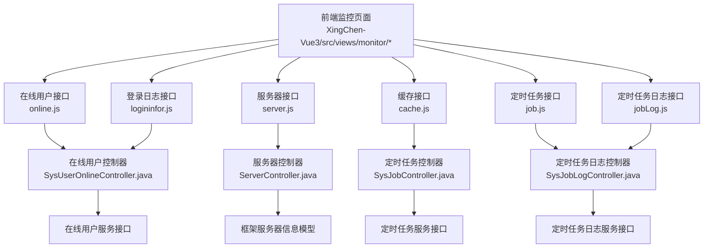
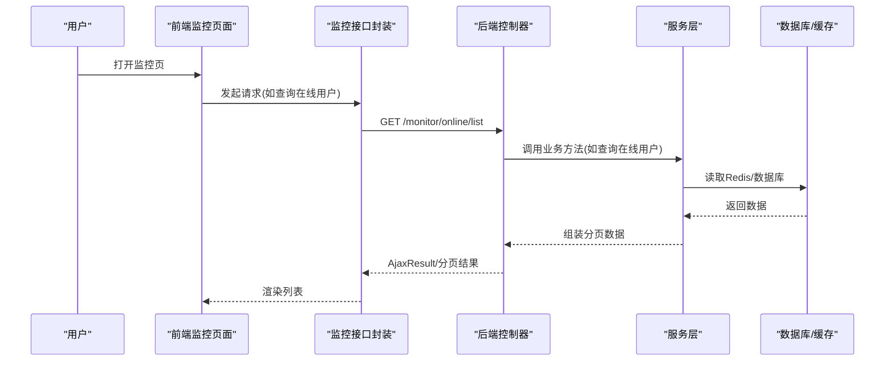
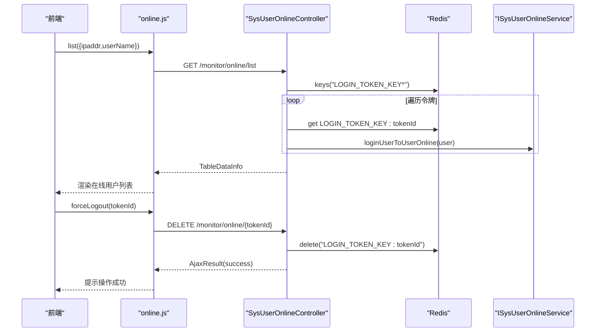
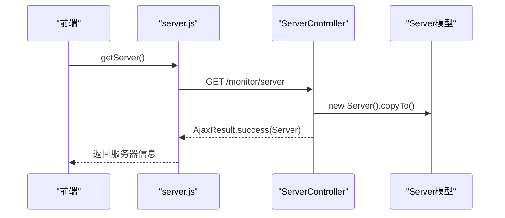
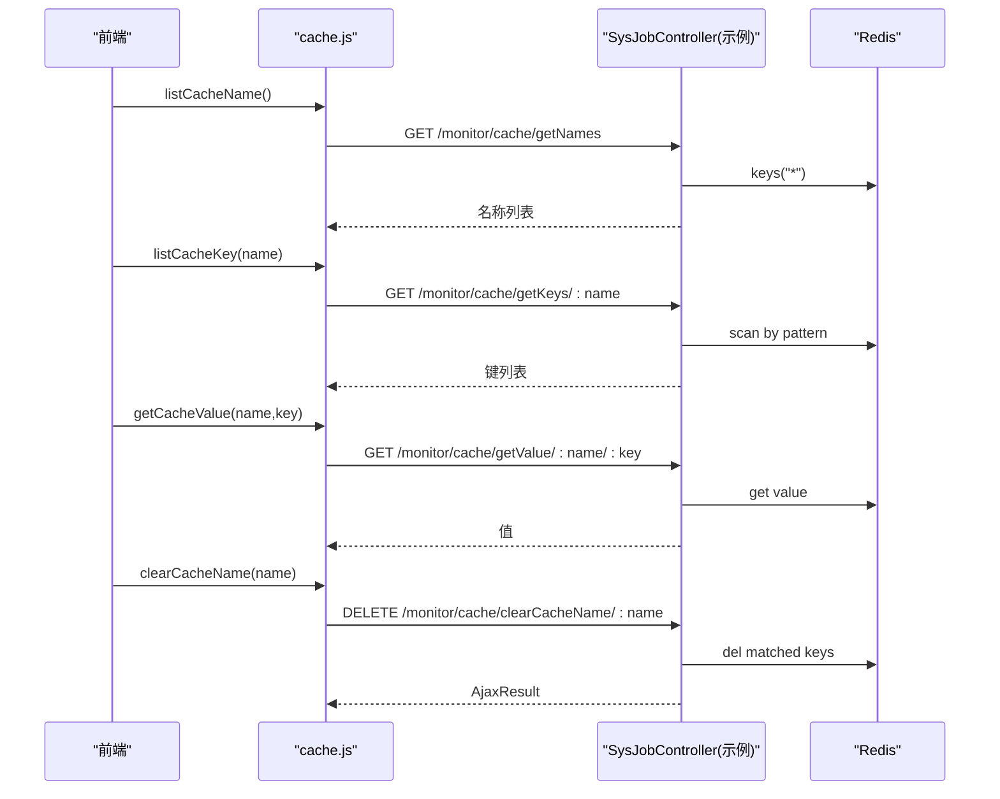
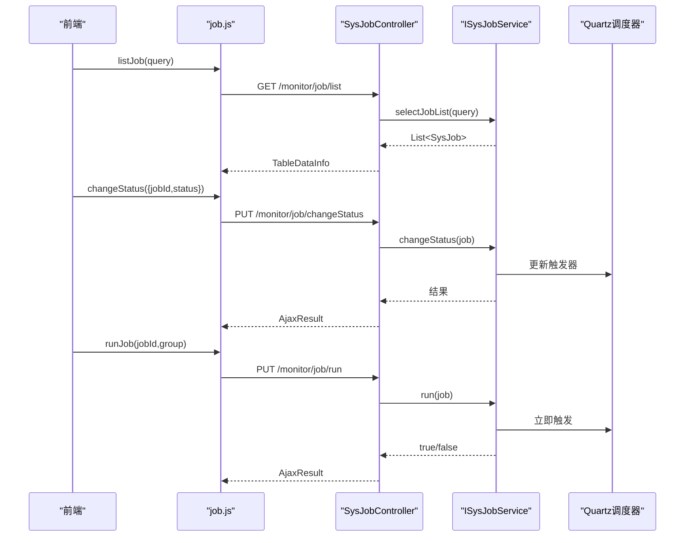
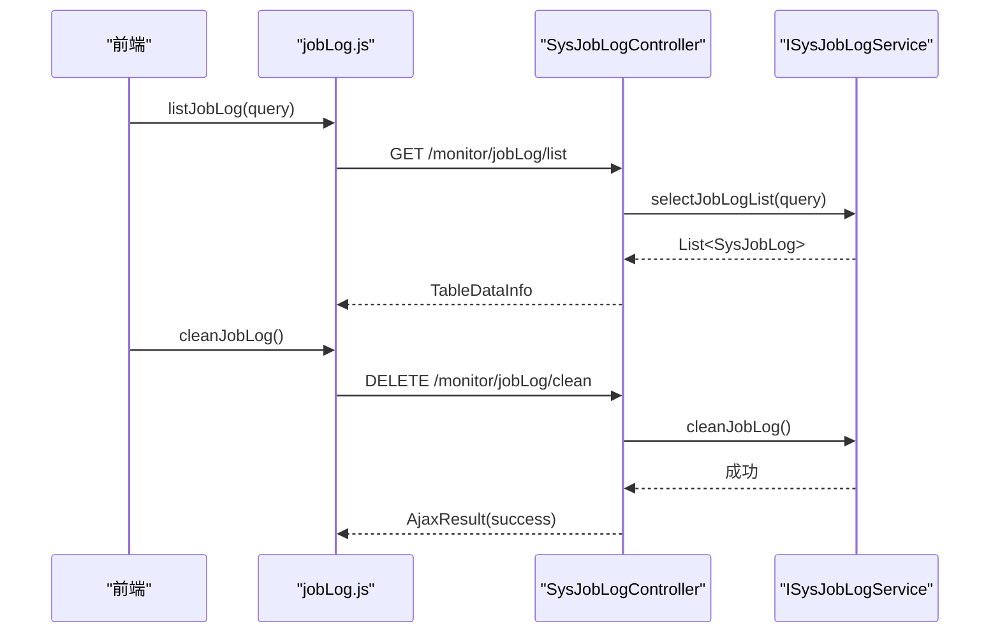
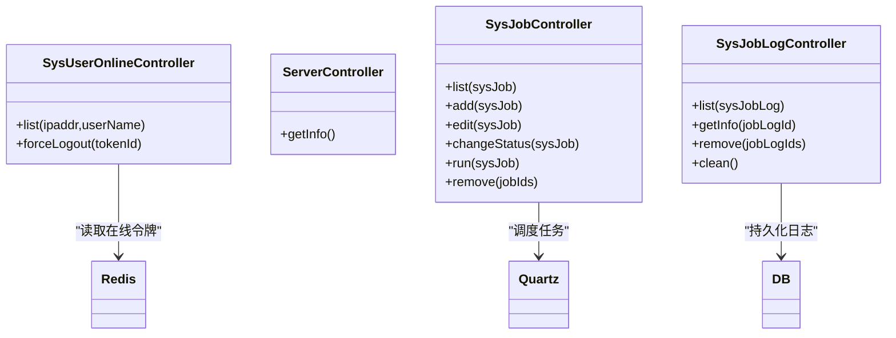

# 监控统计接口

<cite>
**本文引用的文件**
- [XingChen-Vue3/src/api/monitor/online.js](file://XingChen-Vue3/src/api/monitor/online.js)
- [XingChen-Vue3/src/api/monitor/server.js](file://XingChen-Vue3/src/api/monitor/server.js)
- [XingChen-Vue3/src/api/monitor/cache.js](file://XingChen-Vue3/src/api/monitor/cache.js)
- [XingChen-Vue3/src/api/monitor/job.js](file://XingChen-Vue3/src/api/monitor/job.js)
- [XingChen-Vue3/src/api/monitor/jobLog.js](file://XingChen-Vue3/src/api/monitor/jobLog.js)
- [XingChen-Vue3/src/api/monitor/logininfor.js](file://XingChen-Vue3/src/api/monitor/logininfor.js)
- [XingChen-Vue/xingchen-admin/src/main/java/com/xingchen/web/controller/monitor/SysUserOnlineController.java](file://XingChen-Vue/xingchen-admin/src/main/java/com/xingchen/web/controller/monitor/SysUserOnlineController.java)
- [XingChen-Vue/xingchen-admin/src/main/java/com/xingchen/web/controller/monitor/ServerController.java](file://XingChen-Vue/xingchen-admin/src/main/java/com/xingchen/web/controller/monitor/ServerController.java)
- [XingChen-Vue/xingchen-quartz/src/main/java/com/xingchen/quartz/controller/SysJobController.java](file://XingChen-Vue/xingchen-quartz/src/main/java/com/xingchen/quartz/controller/SysJobController.java)
- [XingChen-Vue/xingchen-quartz/src/main/java/com/xingchen/quartz/controller/SysJobLogController.java](file://XingChen-Vue/xingchen-quartz/src/main/java/com/xingchen/quartz/controller/SysJobLogController.java)
</cite>

## 目录
1. [简介](#简介)
2. [项目结构](#项目结构)
3. [核心组件](#核心组件)
4. [架构总览](#架构总览)
5. [详细组件分析](#详细组件分析)
6. [依赖关系分析](#依赖关系分析)
7. [性能考虑](#性能考虑)
8. [故障排查指南](#故障排查指南)
9. [结论](#结论)
10. [附录](#附录)

## 简介
本文件面向健康管理系统中的“监控统计接口”，系统性梳理在线用户监控、服务器状态监控、缓存监控、定时任务监控及登录日志监控等模块的接口定义、数据采集与存储策略、展示格式、健康指标计算方法、告警阈值与异常检测机制，以及可视化与报表生成能力。文档同时提供关键流程的时序图与类图，帮助开发者与运维人员快速理解与使用。

## 项目结构
监控相关接口主要分布在前后端分离的三层架构中：
- 前端 Vue3（XingChen-Vue3）：通过统一的请求封装调用后端 REST 接口，负责数据展示与交互。
- 后端 Spring Boot（XingChen-Vue/xingchen-admin、xingchen-quartz）：提供各监控模块的控制器与业务服务，负责数据采集、聚合与返回。
- 缓存与调度：基于 Redis 与 Quartz 的分布式调度与缓存管理。

图表来源
- [XingChen-Vue3/src/api/monitor/online.js:1-19](file://XingChen-Vue3/src/api/monitor/online.js#L1-L19)
- [XingChen-Vue3/src/api/monitor/server.js:1-9](file://XingChen-Vue3/src/api/monitor/server.js#L1-L9)
- [XingChen-Vue3/src/api/monitor/cache.js:1-58](file://XingChen-Vue3/src/api/monitor/cache.js#L1-L58)
- [XingChen-Vue3/src/api/monitor/job.js:1-71](file://XingChen-Vue3/src/api/monitor/job.js#L1-L71)
- [XingChen-Vue3/src/api/monitor/jobLog.js:1-27](file://XingChen-Vue3/src/api/monitor/jobLog.js#L1-L27)
- [XingChen-Vue3/src/api/monitor/logininfor.js:1-35](file://XingChen-Vue3/src/api/monitor/logininfor.js#L1-L35)
- [XingChen-Vue/xingchen-admin/src/main/java/com/xingchen/web/controller/monitor/SysUserOnlineController.java:1-84](file://XingChen-Vue/xingchen-admin/src/main/java/com/xingchen/web/controller/monitor/SysUserOnlineController.java#L1-L84)
- [XingChen-Vue/xingchen-admin/src/main/java/com/xingchen/web/controller/monitor/ServerController.java:1-28](file://XingChen-Vue/xingchen-admin/src/main/java/com/xingchen/web/controller/monitor/ServerController.java#L1-L28)
- [XingChen-Vue/xingchen-quartz/src/main/java/com/xingchen/quartz/controller/SysJobController.java:1-186](file://XingChen-Vue/xingchen-quartz/src/main/java/com/xingchen/quartz/controller/SysJobController.java#L1-L186)
- [XingChen-Vue/xingchen-quartz/src/main/java/com/xingchen/quartz/controller/SysJobLogController.java:1-93](file://XingChen-Vue/xingchen-quartz/src/main/java/com/xingchen/quartz/controller/SysJobLogController.java#L1-L93)

章节来源
- [XingChen-Vue3/src/api/monitor/online.js:1-19](file://XingChen-Vue3/src/api/monitor/online.js#L1-L19)
- [XingChen-Vue3/src/api/monitor/server.js:1-9](file://XingChen-Vue3/src/api/monitor/server.js#L1-L9)
- [XingChen-Vue3/src/api/monitor/cache.js:1-58](file://XingChen-Vue3/src/api/monitor/cache.js#L1-L58)
- [XingChen-Vue3/src/api/monitor/job.js:1-71](file://XingChen-Vue3/src/api/monitor/job.js#L1-L71)
- [XingChen-Vue3/src/api/monitor/jobLog.js:1-27](file://XingChen-Vue3/src/api/monitor/jobLog.js#L1-L27)
- [XingChen-Vue3/src/api/monitor/logininfor.js:1-35](file://XingChen-Vue3/src/api/monitor/logininfor.js#L1-L35)

## 核心组件
- 在线用户监控：查询在线用户列表、按条件筛选、强制下线。
- 服务器状态监控：采集并返回服务器硬件与运行环境信息。
- 缓存监控：查询缓存键值、清理指定缓存、批量清理。
- 定时任务监控：任务的增删改查、状态切换、立即执行、导出与报表。
- 定时任务日志监控：日志查询、删除、清空。
- 登录日志监控：登录日志查询、删除、解锁、清空。

章节来源
- [XingChen-Vue3/src/api/monitor/online.js:1-19](file://XingChen-Vue3/src/api/monitor/online.js#L1-L19)
- [XingChen-Vue3/src/api/monitor/server.js:1-9](file://XingChen-Vue3/src/api/monitor/server.js#L1-L9)
- [XingChen-Vue3/src/api/monitor/cache.js:1-58](file://XingChen-Vue3/src/api/monitor/cache.js#L1-L58)
- [XingChen-Vue3/src/api/monitor/job.js:1-71](file://XingChen-Vue3/src/api/monitor/job.js#L1-L71)
- [XingChen-Vue3/src/api/monitor/jobLog.js:1-27](file://XingChen-Vue3/src/api/monitor/jobLog.js#L1-L27)
- [XingChen-Vue3/src/api/monitor/logininfor.js:1-35](file://XingChen-Vue3/src/api/monitor/logininfor.js#L1-L35)

## 架构总览
监控接口采用前后端分离模式，前端通过统一请求封装调用后端 REST 接口；后端控制器负责鉴权、参数校验、调用服务层并返回标准响应体。定时任务模块独立于主业务，使用 Quartz 进行调度与日志记录。

图表来源
- [XingChen-Vue3/src/api/monitor/online.js:1-19](file://XingChen-Vue3/src/api/monitor/online.js#L1-L19)
- [XingChen-Vue/xingchen-admin/src/main/java/com/xingchen/web/controller/monitor/SysUserOnlineController.java:1-84](file://XingChen-Vue/xingchen-admin/src/main/java/com/xingchen/web/controller/monitor/SysUserOnlineController.java#L1-L84)

## 详细组件分析

### 在线用户监控接口
- 接口职责
  - 列表查询：支持按 IP、用户名等条件筛选在线用户。
  - 强制下线：根据 token 标识删除 Redis 中的登录令牌，实现强制下线。
- 数据来源
  - 通过 Redis 键前缀匹配获取所有在线用户的登录令牌对象，解析用户信息并转换为在线用户视图。
- 展示格式
  - 分页表格数据，包含在线用户基本信息与操作列。
- 安全控制
  - 使用权限注解限制访问范围，确保仅授权用户可查看与强制下线。

图表来源
- [XingChen-Vue3/src/api/monitor/online.js:1-19](file://XingChen-Vue3/src/api/monitor/online.js#L1-L19)
- [XingChen-Vue/xingchen-admin/src/main/java/com/xingchen/web/controller/monitor/SysUserOnlineController.java:1-84](file://XingChen-Vue/xingchen-admin/src/main/java/com/xingchen/web/controller/monitor/SysUserOnlineController.java#L1-L84)

章节来源
- [XingChen-Vue3/src/api/monitor/online.js:1-19](file://XingChen-Vue3/src/api/monitor/online.js#L1-L19)
- [XingChen-Vue/xingchen-admin/src/main/java/com/xingchen/web/controller/monitor/SysUserOnlineController.java:1-84](file://XingChen-Vue/xingchen-admin/src/main/java/com/xingchen/web/controller/monitor/SysUserOnlineController.java#L1-L84)

### 服务器状态监控接口
- 接口职责
  - 获取服务器硬件与运行环境信息（CPU、内存、磁盘、JVM 等）。
- 数据来源
  - 框架层提供统一的服务器信息模型，控制器直接调用复制到响应对象。
- 展示格式
  - 单对象返回，包含各类指标字段，便于前端以卡片或仪表盘形式展示。

图表来源
- [XingChen-Vue3/src/api/monitor/server.js:1-9](file://XingChen-Vue3/src/api/monitor/server.js#L1-L9)
- [XingChen-Vue/xingchen-admin/src/main/java/com/xingchen/web/controller/monitor/ServerController.java:1-28](file://XingChen-Vue/xingchen-admin/src/main/java/com/xingchen/web/controller/monitor/ServerController.java#L1-L28)

章节来源
- [XingChen-Vue3/src/api/monitor/server.js:1-9](file://XingChen-Vue3/src/api/monitor/server.js#L1-L9)
- [XingChen-Vue/xingchen-admin/src/main/java/com/xingchen/web/controller/monitor/ServerController.java:1-28](file://XingChen-Vue/xingchen-admin/src/main/java/com/xingchen/web/controller/monitor/ServerController.java#L1-L28)

### 缓存监控接口
- 接口职责
  - 查询缓存详情、缓存名称列表、缓存键名列表。
  - 获取指定键的缓存值，支持按名称或键清理缓存，支持清空全部缓存。
- 数据来源
  - 通过 Redis 缓存客户端进行键扫描与值读取。
- 展示格式
  - 列表与详情对象，前端可选择性展开键值详情。

图表来源
- [XingChen-Vue3/src/api/monitor/cache.js:1-58](file://XingChen-Vue3/src/api/monitor/cache.js#L1-L58)
- [XingChen-Vue/xingchen-quartz/src/main/java/com/xingchen/quartz/controller/SysJobController.java:1-186](file://XingChen-Vue/xingchen-quartz/src/main/java/com/xingchen/quartz/controller/SysJobController.java#L1-L186)

章节来源
- [XingChen-Vue3/src/api/monitor/cache.js:1-58](file://XingChen-Vue3/src/api/monitor/cache.js#L1-L58)

### 定时任务监控接口
- 接口职责
  - 任务列表查询、详情获取、新增、修改、删除。
  - 任务状态切换、立即执行一次。
  - 导出任务列表为 Excel，支持报表生成。
- 数据来源
  - Quartz 调度器与数据库持久化。
- 展示格式
  - 表格分页数据，包含任务名称、组、Cron 表达式、状态、上次/下次执行时间等。

图表来源
- [XingChen-Vue3/src/api/monitor/job.js:1-71](file://XingChen-Vue3/src/api/monitor/job.js#L1-L71)
- [XingChen-Vue/xingchen-quartz/src/main/java/com/xingchen/quartz/controller/SysJobController.java:1-186](file://XingChen-Vue/xingchen-quartz/src/main/java/com/xingchen/quartz/controller/SysJobController.java#L1-L186)

章节来源
- [XingChen-Vue3/src/api/monitor/job.js:1-71](file://XingChen-Vue3/src/api/monitor/job.js#L1-L71)
- [XingChen-Vue/xingchen-quartz/src/main/java/com/xingchen/quartz/controller/SysJobController.java:1-186](file://XingChen-Vue/xingchen-quartz/src/main/java/com/xingchen/quartz/controller/SysJobController.java#L1-L186)

### 定时任务日志监控接口
- 接口职责
  - 日志列表查询、详情获取、删除、清空。
  - 支持导出日志为 Excel，用于报表生成。
- 数据来源
  - 任务执行日志持久化至数据库。
- 展示格式
  - 表格分页数据，包含任务名、组、执行结果、异常信息、耗时等。

图表来源
- [XingChen-Vue3/src/api/monitor/jobLog.js:1-27](file://XingChen-Vue3/src/api/monitor/jobLog.js#L1-L27)
- [XingChen-Vue/xingchen-quartz/src/main/java/com/xingchen/quartz/controller/SysJobLogController.java:1-93](file://XingChen-Vue/xingchen-quartz/src/main/java/com/xingchen/quartz/controller/SysJobLogController.java#L1-L93)

章节来源
- [XingChen-Vue3/src/api/monitor/jobLog.js:1-27](file://XingChen-Vue3/src/api/monitor/jobLog.js#L1-L27)
- [XingChen-Vue/xingchen-quartz/src/main/java/com/xingchen/quartz/controller/SysJobLogController.java:1-93](file://XingChen-Vue/xingchen-quartz/src/main/java/com/xingchen/quartz/controller/SysJobLogController.java#L1-L93)

### 登录日志监控接口
- 接口职责
  - 登录日志列表查询、删除、解锁用户登录状态、清空日志。
- 数据来源
  - 登录行为记录在数据库中，支持按用户、时间等维度查询。
- 展示格式
  - 表格分页数据，包含登录账号、IP、地点、状态、时间等。

章节来源
- [XingChen-Vue3/src/api/monitor/logininfor.js:1-35](file://XingChen-Vue3/src/api/monitor/logininfor.js#L1-L35)

## 依赖关系分析
- 控制器依赖
  - 在线用户控制器依赖 Redis 缓存与在线用户服务。
  - 服务器控制器依赖框架提供的服务器信息模型。
  - 定时任务控制器依赖 Quartz 调度器与任务服务。
  - 任务日志控制器依赖日志服务。
- 权限控制
  - 各控制器均使用权限注解限制操作范围，避免越权访问。
- 数据一致性
  - 在线用户与缓存键值依赖 Redis；定时任务与日志依赖数据库持久化。

图表来源
- [XingChen-Vue/xingchen-admin/src/main/java/com/xingchen/web/controller/monitor/SysUserOnlineController.java:1-84](file://XingChen-Vue/xingchen-admin/src/main/java/com/xingchen/web/controller/monitor/SysUserOnlineController.java#L1-L84)
- [XingChen-Vue/xingchen-admin/src/main/java/com/xingchen/web/controller/monitor/ServerController.java:1-28](file://XingChen-Vue/xingchen-admin/src/main/java/com/xingchen/web/controller/monitor/ServerController.java#L1-L28)
- [XingChen-Vue/xingchen-quartz/src/main/java/com/xingchen/quartz/controller/SysJobController.java:1-186](file://XingChen-Vue/xingchen-quartz/src/main/java/com/xingchen/quartz/controller/SysJobController.java#L1-L186)
- [XingChen-Vue/xingchen-quartz/src/main/java/com/xingchen/quartz/controller/SysJobLogController.java:1-93](file://XingChen-Vue/xingchen-quartz/src/main/java/com/xingchen/quartz/controller/SysJobLogController.java#L1-L93)

章节来源
- [XingChen-Vue/xingchen-admin/src/main/java/com/xingchen/web/controller/monitor/SysUserOnlineController.java:1-84](file://XingChen-Vue/xingchen-admin/src/main/java/com/xingchen/web/controller/monitor/SysUserOnlineController.java#L1-L84)
- [XingChen-Vue/xingchen-admin/src/main/java/com/xingchen/web/controller/monitor/ServerController.java:1-28](file://XingChen-Vue/xingchen-admin/src/main/java/com/xingchen/web/controller/monitor/ServerController.java#L1-L28)
- [XingChen-Vue/xingchen-quartz/src/main/java/com/xingchen/quartz/controller/SysJobController.java:1-186](file://XingChen-Vue/xingchen-quartz/src/main/java/com/xingchen/quartz/controller/SysJobController.java#L1-L186)
- [XingChen-Vue/xingchen-quartz/src/main/java/com/xingchen/quartz/controller/SysJobLogController.java:1-93](file://XingChen-Vue/xingchen-quartz/src/main/java/com/xingchen/quartz/controller/SysJobLogController.java#L1-L93)

## 性能考虑
- 在线用户查询
  - Redis 键扫描与逐个解析可能带来 O(n) 复杂度，建议在高并发场景下增加索引或分页策略，避免一次性加载过多令牌。
- 服务器监控
  - 服务器信息采集通常为轻量级操作，但应避免频繁轮询导致的资源浪费，建议合理设置采集间隔。
- 缓存监控
  - 键扫描与批量删除对 Redis 带来压力，建议在低峰期执行清理操作，或分批处理。
- 定时任务
  - 任务状态切换与立即执行会触发表面调度器，需注意并发与幂等性，避免重复执行。
- 日志监控
  - 日志查询与导出可能产生大量数据传输，建议分页与压缩导出，减少网络与存储压力。

## 故障排查指南
- 在线用户无法下线
  - 检查 Redis 中是否存在对应令牌键；确认控制器删除逻辑是否执行。
- 服务器信息为空
  - 检查框架服务器信息模型初始化是否成功；确认控制器返回路径。
- 缓存清理无效
  - 检查传入的缓存名称/键是否正确；确认 Redis 权限与连接配置。
- 定时任务状态变更失败
  - 检查 Cron 表达式合法性与调度器状态；确认任务是否存在且未被禁用。
- 任务日志导出异常
  - 检查导出工具与 Excel 模板；确认浏览器兼容性与文件大小限制。

章节来源
- [XingChen-Vue/xingchen-admin/src/main/java/com/xingchen/web/controller/monitor/SysUserOnlineController.java:1-84](file://XingChen-Vue/xingchen-admin/src/main/java/com/xingchen/web/controller/monitor/SysUserOnlineController.java#L1-L84)
- [XingChen-Vue/xingchen-admin/src/main/java/com/xingchen/web/controller/monitor/ServerController.java:1-28](file://XingChen-Vue/xingchen-admin/src/main/java/com/xingchen/web/controller/monitor/ServerController.java#L1-L28)
- [XingChen-Vue/xingchen-quartz/src/main/java/com/xingchen/quartz/controller/SysJobController.java:1-186](file://XingChen-Vue/xingchen-quartz/src/main/java/com/xingchen/quartz/controller/SysJobController.java#L1-L186)
- [XingChen-Vue/xingchen-quartz/src/main/java/com/xingchen/quartz/controller/SysJobLogController.java:1-93](file://XingChen-Vue/xingchen-quartz/src/main/java/com/xingchen/quartz/controller/SysJobLogController.java#L1-L93)

## 结论
本监控体系覆盖在线用户、服务器状态、缓存、定时任务与日志等关键领域，接口设计清晰、权限控制完善、扩展性强。建议在生产环境中结合业务负载合理设置采集频率与告警阈值，持续优化缓存与调度策略，保障系统稳定性与可观测性。

## 附录
- 可视化与报表
  - 前端可通过分页表格与图表组件展示监控数据；后端提供 Excel 导出接口，便于生成报表。
- 健康指标与告警
  - 建议基于服务器 CPU/内存使用率、在线用户数、任务执行成功率与耗时等指标设定阈值；异常检测可结合滑动窗口与趋势分析。