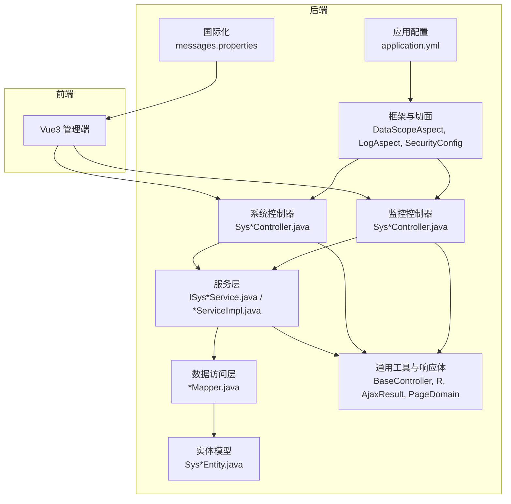
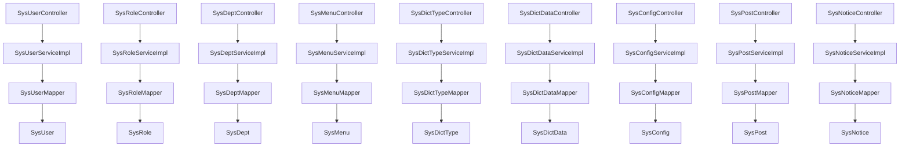
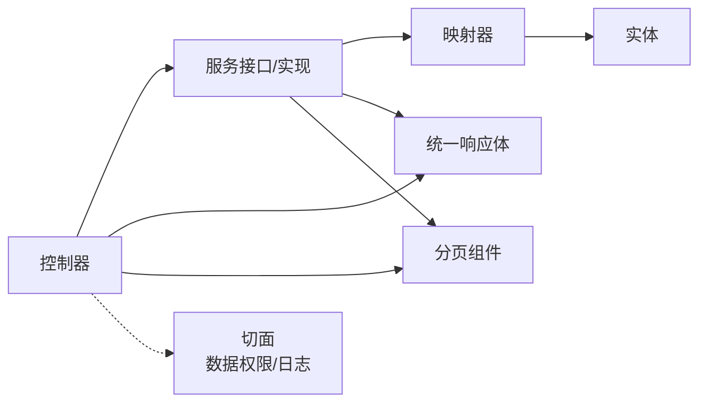
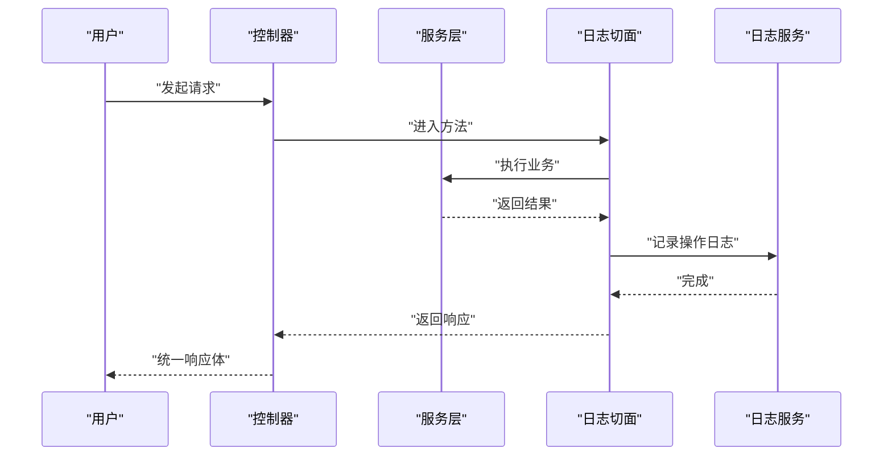

# 系统管理接口

<cite>
**本文引用的文件**
- [SysUser.java](file://XingChen-Vue/xingchen-common/src/main/java/com/xingchen/common/core/domain/entity/SysUser.java)
- [SysRole.java](file://XingChen-Vue/xingchen-common/src/main/java/com/xingchen/common/core/domain/entity/SysRole.java)
- [SysDept.java](file://XingChen-Vue/xingchen-common/src/main/java/com/xingchen/common/core/domain/entity/SysDept.java)
- [SysMenu.java](file://XingChen-Vue/xingchen-common/src/main/java/com/xingchen/common/core/domain/entity/SysMenu.java)
- [SysDictType.java](file://XingChen-Vue/xingchen-common/src/main/java/com/xingchen/common/core/domain/entity/SysDictType.java)
- [SysDictData.java](file://XingChen-Vue/xingchen-common/src/main/java/com/xingchen/common/core/domain/entity/SysDictData.java)
- [SysConfig.java](file://XingChen-Vue/xingchen-common/src/main/java/com/xingchen/common/core/domain/entity/SysConfig.java)
- [SysPost.java](file://XingChen-Vue/xingchen-common/src/main/java/com/xingchen/common/core/domain/entity/SysPost.java)
- [SysNotice.java](file://XingChen-Vue/xingchen-common/src/main/java/com/xingchen/common/core/domain/entity/SysNotice.java)
- [SysOperLog.java](file://XingChen-Vue/xingchen-common/src/main/java/com/xingchen/common/core/domain/entity/SysOperLog.java)
- [SysLogininfor.java](file://XingChen-Vue/xingchen-common/src/main/java/com/xingchen/common/core/domain/entity/SysLogininfor.java)
- [SysUserRole.java](file://XingChen-Vue/xingchen-common/src/main/java/com/xingchen/common/core/domain/entity/SysUserRole.java)
- [SysRoleDept.java](file://XingChen-Vue/xingchen-common/src/main/java/com/xingchen/common/core/domain/entity/SysRoleDept.java)
- [SysRoleMenu.java](file://XingChen-Vue/xingchen-common/src/main/java/com/xingchen/common/core/domain/entity/SysRoleMenu.java)
- [SysUserPost.java](file://XingChen-Vue/xingchen-common/src/main/java/com/xingchen/common/core/domain/entity/SysUserPost.java)
- [SysUserOnline.java](file://XingChen-Vue/xingchen-common/src/main/java/com/xingchen/common/core/domain/entity/SysUserOnline.java)
- [SysPointsLog.java](file://XingChen-Vue/xingchen-common/src/main/java/com/xingchen/common/core/domain/entity/SysPointsLog.java)
- [SysNoticeRead.java](file://XingChen-Vue/xingchen-common/src/main/java/com/xingchen/common/core/domain/entity/SysNoticeRead.java)
- [SysCache.java](file://XingChen-Vue/xingchen-common/src/main/java/com/xingchen/common/core/domain/entity/SysCache.java)
- [BaseController.java](file://XingChen-Vue/xingchen-common/src/main/java/com/xingchen/common/core/controller/BaseController.java)
- [R.java](file://XingChen-Vue/xingchen-common/src/main/java/com/xingchen/common/core/domain/R.java)
- [AjaxResult.java](file://XingChen-Vue/xingchen-common/src/main/java/com/xingchen/common/core/domain/AjaxResult.java)
- [PageDomain.java](file://XingChen-Vue/xingchen-common/src/main/java/com/xingchen/common/core/page/PageDomain.java)
- [TableDataInfo.java](file://XingChen-Vue/xingchen-common/src/main/java/com/xingchen/common/core/page/TableDataInfo.java)
- [TableSupport.java](file://XingChen-Vue/xingchen-common/src/main/java/com/xingchen/common/core/page/TableSupport.java)
- [DataScope.java](file://XingChen-Vue/xingchen-common/src/main/java/com/xingchen/common/annotation/DataScope.java)
- [Log.java](file://XingChen-Vue/xingchen-common/src/main/java/com/xingchen/common/annotation/Log.java)
- [DataScopeAspect.java](file://XingChen-Vue/xingchen-framework/src/main/java/com/xingchen/framework/aspectj/DataScopeAspect.java)
- [LogAspect.java](file://XingChen-Vue/xingchen-framework/src/main/java/com/xingchen/framework/aspectj/LogAspect.java)
- [SysUserServiceImpl.java](file://XingChen-Vue/xingchen-system/src/main/java/com/xingchen/system/service/impl/SysUserServiceImpl.java)
- [SysRoleServiceImpl.java](file://XingChen-Vue/xingchen-system/src/main/java/com/xingchen/system/service/impl/SysRoleServiceImpl.java)
- [SysDeptServiceImpl.java](file://XingChen-Vue/xingchen-system/src/main/java/com/xingchen/system/service/impl/SysDeptServiceImpl.java)
- [SysMenuServiceImpl.java](file://XingChen-Vue/xingchen-system/src/main/java/com/xingchen/system/service/impl/SysMenuServiceImpl.java)
- [SysDictTypeServiceImpl.java](file://XingChen-Vue/xingchen-system/src/main/java/com/xingchen/system/service/impl/SysDictTypeServiceImpl.java)
- [SysDictDataServiceImpl.java](file://XingChen-Vue/xingchen-system/src/main/java/com/xingchen/system/service/impl/SysDictDataServiceImpl.java)
- [SysConfigServiceImpl.java](file://XingChen-Vue/xingchen-system/src/main/java/com/xingchen/system/service/impl/SysConfigServiceImpl.java)
- [SysPostServiceImpl.java](file://XingChen-Vue/xingchen-system/src/main/java/com/xingchen/system/service/impl/SysPostServiceImpl.java)
- [SysNoticeServiceImpl.java](file://XingChen-Vue/xingchen-system/src/main/java/com/xingchen/system/service/impl/SysNoticeServiceImpl.java)
- [SysOperLogServiceImpl.java](file://XingChen-Vue/xingchen-system/src/main/java/com/xingchen/system/service/impl/SysOperLogServiceImpl.java)
- [SysLogininforServiceImpl.java](file://XingChen-Vue/xingchen-system/src/main/java/com/xingchen/system/service/impl/SysLogininforServiceImpl.java)
- [SysUserOnlineServiceImpl.java](file://XingChen-Vue/xingchen-system/src/main/java/com/xingchen/system/service/impl/SysUserOnlineServiceImpl.java)
- [SysPointsLogServiceImpl.java](file://XingChen-Vue/xingchen-system/src/main/java/com/xingchen/system/service/impl/SysPointsLogServiceImpl.java)
- [SysNoticeReadServiceImpl.java](file://XingChen-Vue/xingchen-system/src/main/java/com/xingchen/system/service/impl/SysNoticeReadServiceImpl.java)
- [SysUserMapper.java](file://XingChen-Vue/xingchen-system/src/main/java/com/xingchen/system/mapper/SysUserMapper.java)
- [SysRoleMapper.java](file://XingChen-Vue/xingchen-system/src/main/java/com/xingchen/system/mapper/SysRoleMapper.java)
- [SysDeptMapper.java](file://XingChen-Vue/xingchen-system/src/main/java/com/xingchen/system/mapper/SysDeptMapper.java)
- [SysMenuMapper.java](file://XingChen-Vue/xingchen-system/src/main/java/com/xingchen/system/mapper/SysMenuMapper.java)
- [SysDictTypeMapper.java](file://XingChen-Vue/xingchen-system/src/main/java/com/xingchen/system/mapper/SysDictTypeMapper.java)
- [SysDictDataMapper.java](file://XingChen-Vue/xingchen-system/src/main/java/com/xingchen/system/mapper/SysDictDataMapper.java)
- [SysConfigMapper.java](file://XingChen-Vue/xingchen-system/src/main/java/com/xingchen/system/mapper/SysConfigMapper.java)
- [SysPostMapper.java](file://XingChen-Vue/xingchen-system/src/main/java/com/xingchen/system/mapper/SysPostMapper.java)
- [SysNoticeMapper.java](file://XingChen-Vue/xingchen-system/src/main/java/com/xingchen/system/mapper/SysNoticeMapper.java)
- [SysOperLogMapper.java](file://XingChen-Vue/xingchen-system/src/main/java/com/xingchen/system/mapper/SysOperLogMapper.java)
- [SysLogininforMapper.java](file://XingChen-Vue/xingchen-system/src/main/java/com/xingchen/system/mapper/SysLogininforMapper.java)
- [SysUserOnlineMapper.java](file://XingChen-Vue/xingchen-system/src/main/java/com/xingchen/system/mapper/SysUserOnlineMapper.java)
- [SysPointsLogMapper.java](file://XingChen-Vue/xingchen-system/src/main/java/com/xingchen/system/mapper/SysPointsLogMapper.java)
- [SysNoticeReadMapper.java](file://XingChen-Vue/xingchen-system/src/main/java/com/xingchen/system/mapper/SysNoticeReadMapper.java)
- [SysUserRoleMapper.java](file://XingChen-Vue/xingchen-system/src/main/java/com/xingchen/system/mapper/SysUserRoleMapper.java)
- [SysRoleDeptMapper.java](file://XingChen-Vue/xingchen-system/src/main/java/com/xingchen/system/mapper/SysRoleDeptMapper.java)
- [SysRoleMenuMapper.java](file://XingChen-Vue/xingchen-system/src/main/java/com/xingchen/system/mapper/SysRoleMenuMapper.java)
- [SysUserPostMapper.java](file://XingChen-Vue/xingchen-system/src/main/java/com/xingchen/system/mapper/SysUserPostMapper.java)
- [SysUserOnlineController.java](file://XingChen-Vue/xingchen-admin/src/main/java/com/xingchen/web/controller/monitor/SysUserOnlineController.java)
- [SysOperlogController.java](file://XingChen-Vue/xingchen-admin/src/main/java/com/xingchen/web/controller/monitor/SysOperlogController.java)
- [SysLogininforController.java](file://XingChen-Vue/xingchen-admin/src/main/java/com/xingchen/web/controller/monitor/SysLogininforController.java)
- [SysConfigController.java](file://XingChen-Vue/xingchen-admin/src/main/java/com/xingchen/web/controller/system/SysConfigController.java)
- [SysDeptController.java](file://XingChen-Vue/xingchen-admin/src/main/java/com/xingchen/web/controller/system/SysDeptController.java)
- [SysDictTypeController.java](file://XingChen-Vue/xingchen-admin/src/main/java/com/xingchen/web/controller/system/SysDictTypeController.java)
- [SysDictDataController.java](file://XingChen-Vue/xingchen-admin/src/main/java/com/xingchen/web/controller/system/SysDictDataController.java)
- [SysMenuController.java](file://XingChen-Vue/xingchen-admin/src/main/java/com/xingchen/web/controller/system/SysMenuController.java)
- [SysNoticeController.java](file://XingChen-Vue/xingchen-admin/src/main/java/com/xingchen/web/controller/system/SysNoticeController.java)
- [SysPostController.java](file://XingChen-Vue/xingchen-admin/src/main/java/com/xingchen/web/controller/system/SysPostController.java)
- [SysRoleController.java](file://XingChen-Vue/xingchen-admin/src/main/java/com/xingchen/web/controller/system/SysRoleController.java)
- [SysUserController.java](file://XingChen-Vue/xingchen-admin/src/main/java/com/xingchen/web/controller/system/SysUserController.java)
- [SecurityUtils.java](file://XingChen-Vue/xingchen-common/src/main/java/com/xingchen/common/utils/SecurityUtils.java)
- [StringUtils.java](file://XingChen-Vue/xingchen-common/src/main/java/com/xingchen/common/utils/StringUtils.java)
- [DateUtils.java](file://XingChen-Vue/xingchen-common/src/main/java/com/xingchen/common/utils/DateUtils.java)
- [DictUtils.java](file://XingChen-Vue/xingchen-common/src/main/java/com/xingchen/common/utils/DictUtils.java)
- [LogUtils.java](file://XingChen-Vue/xingchen-common/src/main/java/com/xingchen/common/utils/LogUtils.java)
- [MessageUtils.java](file://XingChen-Vue/xingchen-common/src/main/java/com/xingchen/common/utils/MessageUtils.java)
- [PageUtils.java](file://XingChen-Vue/xingchen-common/src/main/java/com/xingchen/common/utils/PageUtils.java)
- [ServletUtils.java](file://XingChen-Vue/xingchen-common/src/main/java/com/xingchen/common/utils/ServletUtils.java)
- [RedisCache.java](file://XingChen-Vue/xingchen-common/src/main/java/com/xingchen/common/core/redis/RedisCache.java)
- [CacheConstants.java](file://XingChen-Vue/xingchen-common/src/main/java/com/xingchen/common/constant/CacheConstants.java)
- [GlobalExceptionHandler.java](file://XingChen-Vue/xingchen-framework/src/main/java/com/xingchen/framework/web/exception/GlobalExceptionHandler.java)
- [PermissionService.java](file://XingChen-Vue/xingchen-framework/src/main/java/com/xingchen/framework/web/service/PermissionService.java)
- [SysPermissionService.java](file://XingChen-Vue/xingchen-framework/src/main/java/com/xingchen/framework/web/service/SysPermissionService.java)
- [TokenService.java](file://XingChen-Vue/xingchen-framework/src/main/java/com/xingchen/framework/web/service/TokenService.java)
- [UserDetailsServiceImpl.java](file://XingChen-Vue/xingchen-framework/src/main/java/com/xingchen/framework/web/service/UserDetailsServiceImpl.java)
- [AuthenticationEntryPointImpl.java](file://XingChen-Vue/xingchen-framework/src/main/java/com/xingchen/framework/web/service/Auth/AuthEntryPointImpl.java)
- [LogoutSuccessHandlerImpl.java](file://XingChen-Vue/xingchen-framework/src/main/java/com/xingchen/framework/web/service/Auth/LogoutSuccessHandlerImpl.java)
- [JwtAuthenticationTokenFilter.java](file://XingChen-Vue/xingchen-framework/src/main/java/com/xingchen/framework/web/service/Auth/JwtAuthenticationTokenFilter.java)
- [AsyncManager.java](file://XingChen-Vue/xingchen-framework/src/main/java/com/xingchen/framework/manager/AsyncManager.java)
- [AsyncFactory.java](file://XingChen-Vue/xingchen-framework/src/main/java/com/xingchen/framework/manager/factory/AsyncFactory.java)
- [SameUrlDataInterceptor.java](file://XingChen-Vue/xingchen-framework/src/main/java/com/xingchen/framework/interceptor/impl/SameUrlDataInterceptor.java)
- [RepeatSubmitInterceptor.java](file://XingChen-Vue/xingchen-framework/src/main/java/com/xingchen/framework/interceptor/RepeatSubmitInterceptor.java)
- [application.yml](file://XingChen-Vue/xingchen-admin/src/main/resources/application.yml)
- [messages.properties](file://XingChen-Vue/xingchen-admin/src/main/resources/i18n/messages.properties)
</cite>

## 目录
1. [简介](#简介)
2. [项目结构](#项目结构)
3. [核心组件](#核心组件)
4. [架构总览](#架构总览)
5. [详细组件分析](#详细组件分析)
6. [依赖关系分析](#依赖关系分析)
7. [性能考量](#性能考量)
8. [故障排查指南](#故障排查指南)
9. [结论](#结论)
10. [附录](#附录)

## 简介
本文件面向系统管理员与后端开发者，系统性梳理健康管理系统中“系统管理”相关的RBAC权限模型接口，覆盖用户管理、部门管理、角色管理、菜单管理、字典管理、配置管理、公告管理、岗位管理以及监控类（登录日志、操作日志、在线用户、积分日志）等模块。文档重点说明：
- RBAC权限模型下的接口能力与数据权限控制
- 操作日志记录机制
- 批量操作支持
- 常用接口调用示例与最佳实践

## 项目结构
系统采用前后端分离架构，后端基于Spring Boot + MyBatis Plus，统一通过控制器层暴露REST接口；通用能力封装在xingchen-common模块，安全与切面在xingchen-framework模块，业务模块集中在xingchen-system模块。



图表来源
- [application.yml](file://XingChen-Vue/xingchen-admin/src/main/resources/application.yml)
- [SysUserController.java](file://XingChen-Vue/xingchen-admin/src/main/java/com/xingchen/web/controller/system/SysUserController.java)
- [SysRoleController.java](file://XingChen-Vue/xingchen-admin/src/main/java/com/xingchen/web/controller/system/SysRoleController.java)
- [SysDeptController.java](file://XingChen-Vue/xingchen-admin/src/main/java/com/xingchen/web/controller/system/SysDeptController.java)
- [SysMenuController.java](file://XingChen-Vue/xingchen-admin/src/main/java/com/xingchen/web/controller/system/SysMenuController.java)
- [SysDictTypeController.java](file://XingChen-Vue/xingchen-admin/src/main/java/com/xingchen/web/controller/system/SysDictTypeController.java)
- [SysDictDataController.java](file://XingChen-Vue/xingchen-admin/src/main/java/com/xingchen/web/controller/system/SysDictDataController.java)
- [SysConfigController.java](file://XingChen-Vue/xingchen-admin/src/main/java/com/xingchen/web/controller/system/SysConfigController.java)
- [SysPostController.java](file://XingChen-Vue/xingchen-admin/src/main/java/com/xingchen/web/controller/system/SysPostController.java)
- [SysNoticeController.java](file://XingChen-Vue/xingchen-admin/src/main/java/com/xingchen/web/controller/system/SysNoticeController.java)
- [SysOperlogController.java](file://XingChen-Vue/xingchen-admin/src/main/java/com/xingchen/web/controller/monitor/SysOperlogController.java)
- [SysLogininforController.java](file://XingChen-Vue/xingchen-admin/src/main/java/com/xingchen/web/controller/monitor/SysLogininforController.java)
- [SysUserOnlineController.java](file://XingChen-Vue/xingchen-admin/src/main/java/com/xingchen/web/controller/monitor/SysUserOnlineController.java)
- [SysUserServiceImpl.java](file://XingChen-Vue/xingchen-system/src/main/java/com/xingchen/system/service/impl/SysUserServiceImpl.java)
- [SysRoleServiceImpl.java](file://XingChen-Vue/xingchen-system/src/main/java/com/xingchen/system/service/impl/SysRoleServiceImpl.java)
- [SysDeptServiceImpl.java](file://XingChen-Vue/xingchen-system/src/main/java/com/xingchen/system/service/impl/SysDeptServiceImpl.java)
- [SysMenuServiceImpl.java](file://XingChen-Vue/xingchen-system/src/main/java/com/xingchen/system/service/impl/SysMenuServiceImpl.java)
- [SysDictTypeServiceImpl.java](file://XingChen-Vue/xingchen-system/src/main/java/com/xingchen/system/service/impl/SysDictTypeServiceImpl.java)
- [SysDictDataServiceImpl.java](file://XingChen-Vue/xingchen-system/src/main/java/com/xingchen/system/service/impl/SysDictDataServiceImpl.java)
- [SysConfigServiceImpl.java](file://XingChen-Vue/xingchen-system/src/main/java/com/xingchen/system/service/impl/SysConfigServiceImpl.java)
- [SysPostServiceImpl.java](file://XingChen-Vue/xingchen-system/src/main/java/com/xingchen/system/service/impl/SysPostServiceImpl.java)
- [SysNoticeServiceImpl.java](file://XingChen-Vue/xingchen-system/src/main/java/com/xingchen/system/service/impl/SysNoticeServiceImpl.java)
- [SysOperLogServiceImpl.java](file://XingChen-Vue/xingchen-system/src/main/java/com/xingchen/system/service/impl/SysOperLogServiceImpl.java)
- [SysLogininforServiceImpl.java](file://XingChen-Vue/xingchen-system/src/main/java/com/xingchen/system/service/impl/SysLogininforServiceImpl.java)
- [SysUserOnlineServiceImpl.java](file://XingChen-Vue/xingchen-system/src/main/java/com/xingchen/system/service/impl/SysUserOnlineServiceImpl.java)
- [SysPointsLogServiceImpl.java](file://XingChen-Vue/xingchen-system/src/main/java/com/xingchen/system/service/impl/SysPointsLogServiceImpl.java)
- [SysNoticeReadServiceImpl.java](file://XingChen-Vue/xingchen-system/src/main/java/com/xingchen/system/service/impl/SysNoticeReadServiceImpl.java)
- [DataScopeAspect.java](file://XingChen-Vue/xingchen-framework/src/main/java/com/xingchen/framework/aspectj/DataScopeAspect.java)
- [LogAspect.java](file://XingChen-Vue/xingchen-framework/src/main/java/com/xingchen/framework/aspectj/LogAspect.java)
- [BaseController.java](file://XingChen-Vue/xingchen-common/src/main/java/com/xingchen/common/core/controller/BaseController.java)
- [R.java](file://XingChen-Vue/xingchen-common/src/main/java/com/xingchen/common/core/domain/R.java)
- [AjaxResult.java](file://XingChen-Vue/xingchen-common/src/main/java/com/xingchen/common/core/domain/AjaxResult.java)
- [PageDomain.java](file://XingChen-Vue/xingchen-common/src/main/java/com/xingchen/common/core/page/PageDomain.java)
- [TableDataInfo.java](file://XingChen-Vue/xingchen-common/src/main/java/com/xingchen/common/core/page/TableDataInfo.java)
- [TableSupport.java](file://XingChen-Vue/xingchen-common/src/main/java/com/xingchen/common/core/page/TableSupport.java)

章节来源
- [application.yml](file://XingChen-Vue/xingchen-admin/src/main/resources/application.yml)
- [messages.properties](file://XingChen-Vue/xingchen-admin/src/main/resources/i18n/messages.properties)

## 核心组件
- 控制器层：各模块控制器负责接收HTTP请求、参数校验、调用服务层并返回统一响应体。
- 服务层：封装业务逻辑，处理RBAC权限、数据权限、日志与异步任务。
- 数据访问层：MyBatis映射器负责数据库交互。
- 实体模型：SysUser、SysRole、SysDept、SysMenu、SysDictType、SysDictData、SysConfig、SysPost、SysNotice、SysOperLog、SysLogininfor、SysUserOnline、SysPointsLog、SysNoticeRead等。
- 通用组件：BaseController、R、AjaxResult、PageDomain、TableDataInfo、TableSupport等。
- 安全与切面：DataScopeAspect（数据权限）、LogAspect（操作日志）、SecurityConfig、Jwt过滤器、权限服务等。

章节来源
- [BaseController.java](file://XingChen-Vue/xingchen-common/src/main/java/com/xingchen/common/core/controller/BaseController.java)
- [R.java](file://XingChen-Vue/xingchen-common/src/main/java/com/xingchen/common/core/domain/R.java)
- [AjaxResult.java](file://XingChen-Vue/xingchen-common/src/main/java/com/xingchen/common/core/domain/AjaxResult.java)
- [PageDomain.java](file://XingChen-Vue/xingchen-common/src/main/java/com/xingchen/common/core/page/PageDomain.java)
- [TableDataInfo.java](file://XingChen-Vue/xingchen-common/src/main/java/com/xingchen/common/core/page/TableDataInfo.java)
- [TableSupport.java](file://XingChen-Vue/xingchen-common/src/main/java/com/xingchen/common/core/page/TableSupport.java)
- [DataScopeAspect.java](file://XingChen-Vue/xingchen-framework/src/main/java/com/xingchen/framework/aspectj/DataScopeAspect.java)
- [LogAspect.java](file://XingChen-Vue/xingchen-framework/src/main/java/com/xingchen/framework/aspectj/LogAspect.java)

## 架构总览
系统管理接口遵循“控制器-服务-数据访问-实体”的分层架构，配合切面实现数据权限与操作日志的横切关注点。



图表来源
- [SysUserController.java](file://XingChen-Vue/xingchen-admin/src/main/java/com/xingchen/web/controller/system/SysUserController.java)
- [SysRoleController.java](file://XingChen-Vue/xingchen-admin/src/main/java/com/xingchen/web/controller/system/SysRoleController.java)
- [SysDeptController.java](file://XingChen-Vue/xingchen-admin/src/main/java/com/xingchen/web/controller/system/SysDeptController.java)
- [SysMenuController.java](file://XingChen-Vue/xingchen-admin/src/main/java/com/xingchen/web/controller/system/SysMenuController.java)
- [SysDictTypeController.java](file://XingChen-Vue/xingchen-admin/src/main/java/com/xingchen/web/controller/system/SysDictTypeController.java)
- [SysDictDataController.java](file://XingChen-Vue/xingchen-admin/src/main/java/com/xingchen/web/controller/system/SysDictDataController.java)
- [SysConfigController.java](file://XingChen-Vue/xingchen-admin/src/main/java/com/xingchen/web/controller/system/SysConfigController.java)
- [SysPostController.java](file://XingChen-Vue/xingchen-admin/src/main/java/com/xingchen/web/controller/system/SysPostController.java)
- [SysNoticeController.java](file://XingChen-Vue/xingchen-admin/src/main/java/com/xingchen/web/controller/system/SysNoticeController.java)
- [SysUserServiceImpl.java](file://XingChen-Vue/xingchen-system/src/main/java/com/xingchen/system/service/impl/SysUserServiceImpl.java)
- [SysRoleServiceImpl.java](file://XingChen-Vue/xingchen-system/src/main/java/com/xingchen/system/service/impl/SysRoleServiceImpl.java)
- [SysDeptServiceImpl.java](file://XingChen-Vue/xingchen-system/src/main/java/com/xingchen/system/service/impl/SysDeptServiceImpl.java)
- [SysMenuServiceImpl.java](file://XingChen-Vue/xingchen-system/src/main/java/com/xingchen/system/service/impl/SysMenuServiceImpl.java)
- [SysDictTypeServiceImpl.java](file://XingChen-Vue/xingchen-system/src/main/java/com/xingchen/system/service/impl/SysDictTypeServiceImpl.java)
- [SysDictDataServiceImpl.java](file://XingChen-Vue/xingchen-system/src/main/java/com/xingchen/system/service/impl/SysDictDataServiceImpl.java)
- [SysConfigServiceImpl.java](file://XingChen-Vue/xingchen-system/src/main/java/com/xingchen/system/service/impl/SysConfigServiceImpl.java)
- [SysPostServiceImpl.java](file://XingChen-Vue/xingchen-system/src/main/java/com/xingchen/system/service/impl/SysPostServiceImpl.java)
- [SysNoticeServiceImpl.java](file://XingChen-Vue/xingchen-system/src/main/java/com/xingchen/system/service/impl/SysNoticeServiceImpl.java)

## 详细组件分析

### 用户管理接口
- 功能范围：用户增删改查、重置密码、分配角色、岗位、状态管理、导出导入、批量操作。
- 关键实体：SysUser、SysUserRole、SysUserPost。
- 数据权限：通过注解与切面限制查询范围。
- 日志记录：@Log注解自动记录操作日志。
- 统一响应：R或AjaxResult。

```mermaid
classDiagram
class SysUser {
+id
+username
+status
+deptId
}
class SysUserRole {
+userId
+roleId
}
class SysUserPost {
+userId
+postId
}
SysUser ||--o{ SysUserRole : "多对多"
SysUser ||--o{ SysUserPost : "多对多"
```

图表来源
- [SysUser.java](file://XingChen-Vue/xingchen-common/src/main/java/com/xingchen/common/core/domain/entity/SysUser.java)
- [SysUserRole.java](file://XingChen-Vue/xingchen-common/src/main/java/com/xingchen/common/core/domain/entity/SysUserRole.java)
- [SysUserPost.java](file://XingChen-Vue/xingchen-common/src/main/java/com/xingchen/common/core/domain/entity/SysUserPost.java)

章节来源
- [SysUserController.java](file://XingChen-Vue/xingchen-admin/src/main/java/com/xingchen/web/controller/system/SysUserController.java)
- [SysUserServiceImpl.java](file://XingChen-Vue/xingchen-system/src/main/java/com/xingchen/system/service/impl/SysUserServiceImpl.java)
- [SysUserMapper.java](file://XingChen-Vue/xingchen-system/src/main/java/com/xingchen/system/mapper/SysUserMapper.java)
- [SysUserRoleMapper.java](file://XingChen-Vue/xingchen-system/src/main/java/com/xingchen/system/mapper/SysUserRoleMapper.java)
- [SysUserPostMapper.java](file://XingChen-Vue/xingchen-system/src/main/java/com/xingchen/system/mapper/SysUserPostMapper.java)
- [DataScope.java](file://XingChen-Vue/xingchen-common/src/main/java/com/xingchen/common/annotation/DataScope.java)
- [DataScopeAspect.java](file://XingChen-Vue/xingchen-framework/src/main/java/com/xingchen/framework/aspectj/DataScopeAspect.java)
- [LogAspect.java](file://XingChen-Vue/xingchen-framework/src/main/java/com/xingchen/framework/aspectj/LogAspect.java)

### 部门管理接口
- 功能范围：部门树形结构查询、新增、修改、删除、状态维护。
- 关键实体：SysDept。
- 数据权限：支持按部门范围查询。

章节来源
- [SysDeptController.java](file://XingChen-Vue/xingchen-admin/src/main/java/com/xingchen/web/controller/system/SysDeptController.java)
- [SysDeptServiceImpl.java](file://XingChen-Vue/xingchen-system/src/main/java/com/xingchen/system/service/impl/SysDeptServiceImpl.java)
- [SysDeptMapper.java](file://XingChen-Vue/xingchen-system/src/main/java/com/xingchen/system/mapper/SysDeptMapper.java)
- [SysDept.java](file://XingChen-Vue/xingchen-common/src/main/java/com/xingchen/common/core/domain/entity/SysDept.java)

### 角色管理接口
- 功能范围：角色增删改查、菜单授权、数据权限配置、状态管理。
- 关键实体：SysRole、SysRoleMenu、SysRoleDept。
- 数据权限：可绑定数据范围规则。

章节来源
- [SysRoleController.java](file://XingChen-Vue/xingchen-admin/src/main/java/com/xingchen/web/controller/system/SysRoleController.java)
- [SysRoleServiceImpl.java](file://XingChen-Vue/xingchen-system/src/main/java/com/xingchen/system/service/impl/SysRoleServiceImpl.java)
- [SysRoleMapper.java](file://XingChen-Vue/xingchen-system/src/main/java/com/xingchen/system/mapper/SysRoleMapper.java)
- [SysRoleMenuMapper.java](file://XingChen-Vue/xingchen-system/src/main/java/com/xingchen/system/mapper/SysRoleMenuMapper.java)
- [SysRoleDeptMapper.java](file://XingChen-Vue/xingchen-system/src/main/java/com/xingchen/system/mapper/SysRoleDeptMapper.java)
- [SysRole.java](file://XingChen-Vue/xingchen-common/src/main/java/com/xingchen/common/core/domain/entity/SysRole.java)
- [SysRoleMenu.java](file://XingChen-Vue/xingchen-common/src/main/java/com/xingchen/common/core/domain/entity/SysRoleMenu.java)
- [SysRoleDept.java](file://XingChen-Vue/xingchen-common/src/main/java/com/xingchen/common/core/domain/entity/SysRoleDept.java)

### 菜单管理接口
- 功能范围：菜单树形结构、按钮权限、路由生成、状态维护。
- 关键实体：SysMenu。

章节来源
- [SysMenuController.java](file://XingChen-Vue/xingchen-admin/src/main/java/com/xingchen/web/controller/system/SysMenuController.java)
- [SysMenuServiceImpl.java](file://XingChen-Vue/xingchen-system/src/main/java/com/xingchen/system/service/impl/SysMenuServiceImpl.java)
- [SysMenuMapper.java](file://XingChen-Vue/xingchen-system/src/main/java/com/xingchen/system/mapper/SysMenuMapper.java)
- [SysMenu.java](file://XingChen-Vue/xingchen-common/src/main/java/com/xingchen/common/core/domain/entity/SysMenu.java)

### 字典管理接口
- 功能范围：字典类型与字典数据的增删改查、状态维护、导出导入。
- 关键实体：SysDictType、SysDictData。

章节来源
- [SysDictTypeController.java](file://XingChen-Vue/xingchen-admin/src/main/java/com/xingchen/web/controller/system/SysDictTypeController.java)
- [SysDictDataController.java](file://XingChen-Vue/xingchen-admin/src/main/java/com/xingchen/web/controller/system/SysDictDataController.java)
- [SysDictTypeServiceImpl.java](file://XingChen-Vue/xingchen-system/src/main/java/com/xingchen/system/service/impl/SysDictTypeServiceImpl.java)
- [SysDictDataServiceImpl.java](file://XingChen-Vue/xingchen-system/src/main/java/com/xingchen/system/service/impl/SysDictDataServiceImpl.java)
- [SysDictTypeMapper.java](file://XingChen-Vue/xingchen-system/src/main/java/com/xingchen/system/mapper/SysDictTypeMapper.java)
- [SysDictDataMapper.java](file://XingChen-Vue/xingchen-system/src/main/java/com/xingchen/system/mapper/SysDictDataMapper.java)
- [SysDictType.java](file://XingChen-Vue/xingchen-common/src/main/java/com/xingchen/common/core/domain/entity/SysDictType.java)
- [SysDictData.java](file://XingChen-Vue/xingchen-common/src/main/java/com/xingchen/common/core/domain/entity/SysDictData.java)

### 配置管理接口
- 功能范围：参数配置增删改查、启用/停用、导出导入。
- 关键实体：SysConfig。

章节来源
- [SysConfigController.java](file://XingChen-Vue/xingchen-admin/src/main/java/com/xingchen/web/controller/system/SysConfigController.java)
- [SysConfigServiceImpl.java](file://XingChen-Vue/xingchen-system/src/main/java/com/xingchen/system/service/impl/SysConfigServiceImpl.java)
- [SysConfigMapper.java](file://XingChen-Vue/xingchen-system/src/main/java/com/xingchen/system/mapper/SysConfigMapper.java)
- [SysConfig.java](file://XingChen-Vue/xingchen-common/src/main/java/com/xingchen/common/core/domain/entity/SysConfig.java)

### 岗位管理接口
- 功能范围：岗位增删改查、状态维护。
- 关键实体：SysPost。

章节来源
- [SysPostController.java](file://XingChen-Vue/xingchen-admin/src/main/java/com/xingchen/web/controller/system/SysPostController.java)
- [SysPostServiceImpl.java](file://XingChen-Vue/xingchen-system/src/main/java/com/xingchen/system/service/impl/SysPostServiceImpl.java)
- [SysPostMapper.java](file://XingChen-Vue/xingchen-system/src/main/java/com/xingchen/system/mapper/SysPostMapper.java)
- [SysPost.java](file://XingChen-Vue/xingchen-common/src/main/java/com/xingchen/common/core/domain/entity/SysPost.java)

### 公告管理接口
- 功能范围：公告增删改查、发布/撤销、已读状态统计。
- 关键实体：SysNotice、SysNoticeRead。

章节来源
- [SysNoticeController.java](file://XingChen-Vue/xingchen-admin/src/main/java/com/xingchen/web/controller/system/SysNoticeController.java)
- [SysNoticeServiceImpl.java](file://XingChen-Vue/xingchen-system/src/main/java/com/xingchen/system/service/impl/SysNoticeServiceImpl.java)
- [SysNoticeReadServiceImpl.java](file://XingChen-Vue/xingchen-system/src/main/java/com/xingchen/system/service/impl/SysNoticeReadServiceImpl.java)
- [SysNoticeMapper.java](file://XingChen-Vue/xingchen-system/src/main/java/com/xingchen/system/mapper/SysNoticeMapper.java)
- [SysNoticeReadMapper.java](file://XingChen-Vue/xingchen-system/src/main/java/com/xingchen/system/mapper/SysNoticeReadMapper.java)
- [SysNotice.java](file://XingChen-Vue/xingchen-common/src/main/java/com/xingchen/common/core/domain/entity/SysNotice.java)
- [SysNoticeRead.java](file://XingChen-Vue/xingchen-common/src/main/java/com/xingchen/common/core/domain/entity/SysNoticeRead.java)

### 在线用户监控接口
- 功能范围：强制退出、踢下线、列表查询。
- 关键实体：SysUserOnline。

章节来源
- [SysUserOnlineController.java](file://XingChen-Vue/xingchen-admin/src/main/java/com/xingchen/web/controller/monitor/SysUserOnlineController.java)
- [SysUserOnlineServiceImpl.java](file://XingChen-Vue/xingchen-system/src/main/java/com/xingchen/system/service/impl/SysUserOnlineServiceImpl.java)
- [SysUserOnlineMapper.java](file://XingChen-Vue/xingchen-system/src/main/java/com/xingchen/system/mapper/SysUserOnlineMapper.java)
- [SysUserOnline.java](file://XingChen-Vue/xingchen-common/src/main/java/com/xingchen/common/core/domain/entity/SysUserOnline.java)

### 登录日志监控接口
- 功能范围：登录日志查询、清空、导出。
- 关键实体：SysLogininfor。

章节来源
- [SysLogininforController.java](file://XingChen-Vue/xingchen-admin/src/main/java/com/xingchen/web/controller/monitor/SysLogininforController.java)
- [SysLogininforServiceImpl.java](file://XingChen-Vue/xingchen-system/src/main/java/com/xingchen/system/service/impl/SysLogininforServiceImpl.java)
- [SysLogininforMapper.java](file://XingChen-Vue/xingchen-system/src/main/java/com/xingchen/system/mapper/SysLogininforMapper.java)
- [SysLogininfor.java](file://XingChen-Vue/xingchen-common/src/main/java/com/xingchen/common/core/domain/entity/SysLogininfor.java)

### 操作日志监控接口
- 功能范围：操作日志查询、清空、导出。
- 关键实体：SysOperLog。

章节来源
- [SysOperlogController.java](file://XingChen-Vue/xingchen-admin/src/main/java/com/xingchen/web/controller/monitor/SysOperlogController.java)
- [SysOperLogServiceImpl.java](file://XingChen-Vue/xingchen-system/src/main/java/com/xingchen/system/service/impl/SysOperLogServiceImpl.java)
- [SysOperLogMapper.java](file://XingChen-Vue/xingchen-system/src/main/java/com/xingchen/system/mapper/SysOperLogMapper.java)
- [SysOperLog.java](file://XingChen-Vue/xingchen-common/src/main/java/com/xingchen/common/core/domain/entity/SysOperLog.java)

### 积分日志接口
- 功能范围：积分明细查询、导出。
- 关键实体：SysPointsLog。

章节来源
- [SysPointsLogServiceImpl.java](file://XingChen-Vue/xingchen-system/src/main/java/com/xingchen/system/service/impl/SysPointsLogServiceImpl.java)
- [SysPointsLogMapper.java](file://XingChen-Vue/xingchen-system/src/main/java/com/xingchen/system/mapper/SysPointsLogMapper.java)
- [SysPointsLog.java](file://XingChen-Vue/xingchen-common/src/main/java/com/xingchen/common/core/domain/entity/SysPointsLog.java)

## 依赖关系分析
- 控制器依赖服务层接口，服务层依赖映射器与实体。
- 切面层通过注解驱动数据权限与日志记录。
- 统一响应体与分页组件贯穿各层。



图表来源
- [SysUserController.java](file://XingChen-Vue/xingchen-admin/src/main/java/com/xingchen/web/controller/system/SysUserController.java)
- [SysUserServiceImpl.java](file://XingChen-Vue/xingchen-system/src/main/java/com/xingchen/system/service/impl/SysUserServiceImpl.java)
- [SysUserMapper.java](file://XingChen-Vue/xingchen-system/src/main/java/com/xingchen/system/mapper/SysUserMapper.java)
- [R.java](file://XingChen-Vue/xingchen-common/src/main/java/com/xingchen/common/core/domain/R.java)
- [PageDomain.java](file://XingChen-Vue/xingchen-common/src/main/java/com/xingchen/common/core/page/PageDomain.java)
- [DataScopeAspect.java](file://XingChen-Vue/xingchen-framework/src/main/java/com/xingchen/framework/aspectj/DataScopeAspect.java)
- [LogAspect.java](file://XingChen-Vue/xingchen-framework/src/main/java/com/xingchen/framework/aspectj/LogAspect.java)

## 性能考量
- 分页查询：使用TableSupport与PageDomain进行分页，避免一次性加载大量数据。
- 缓存：RedisCache用于热点数据缓存，CacheConstants定义缓存键前缀。
- 异步：AsyncManager与AsyncFactory用于异步任务，降低接口延迟。
- 导出：建议分批导出，避免大表内存溢出。
- 并发：重复提交拦截SameUrlDataInterceptor与RepeatSubmitInterceptor保障幂等。

章节来源
- [TableSupport.java](file://XingChen-Vue/xingchen-common/src/main/java/com/xingchen/common/core/page/TableSupport.java)
- [PageDomain.java](file://XingChen-Vue/xingchen-common/src/main/java/com/xingchen/common/core/page/PageDomain.java)
- [RedisCache.java](file://XingChen-Vue/xingchen-common/src/main/java/com/xingchen/common/core/redis/RedisCache.java)
- [CacheConstants.java](file://XingChen-Vue/xingchen-common/src/main/java/com/xingchen/common/constant/CacheConstants.java)
- [AsyncManager.java](file://XingChen-Vue/xingchen-framework/src/main/java/com/xingchen/framework/manager/AsyncManager.java)
- [AsyncFactory.java](file://XingChen-Vue/xingchen-framework/src/main/java/com/xingchen/framework/manager/factory/AsyncFactory.java)
- [SameUrlDataInterceptor.java](file://XingChen-Vue/xingchen-framework/src/main/java/com/xingchen/framework/interceptor/impl/SameUrlDataInterceptor.java)
- [RepeatSubmitInterceptor.java](file://XingChen-Vue/xingchen-framework/src/main/java/com/xingchen/framework/interceptor/RepeatSubmitInterceptor.java)

## 故障排查指南
- 统一异常处理：GlobalExceptionHandler集中处理业务异常与全局异常，便于定位问题。
- 参数校验：BaseController提供参数校验与国际化提示。
- 日志定位：操作日志与登录日志可用于审计与问题回溯。
- 权限问题：检查角色菜单授权与数据权限范围配置。

章节来源
- [GlobalExceptionHandler.java](file://XingChen-Vue/xingchen-framework/src/main/java/com/xingchen/framework/web/exception/GlobalExceptionHandler.java)
- [BaseController.java](file://XingChen-Vue/xingchen-common/src/main/java/com/xingchen/common/core/controller/BaseController.java)
- [LogAspect.java](file://XingChen-Vue/xingchen-framework/src/main/java/com/xingchen/framework/aspectj/LogAspect.java)
- [SysOperLog.java](file://XingChen-Vue/xingchen-common/src/main/java/com/xingchen/common/core/domain/entity/SysOperLog.java)
- [SysLogininfor.java](file://XingChen-Vue/xingchen-common/src/main/java/com/xingchen/common/core/domain/entity/SysLogininfor.java)

## 结论
本系统以RBAC为核心，结合数据权限切面与操作日志切面，形成完善的权限控制与审计体系。通过统一响应体与分页组件，保证接口的一致性与可扩展性。建议在生产环境中：
- 明确角色的数据范围策略
- 合理设置日志保留周期
- 对高频接口开启缓存
- 使用批量操作时注意事务与幂等

## 附录

### RBAC权限模型与数据权限控制
- 角色拥有菜单与数据范围，菜单关联操作权限，用户通过角色获得权限集合。
- 数据权限通过注解与切面在查询阶段注入过滤条件，确保用户只能看到授权范围内的数据。

章节来源
- [DataScope.java](file://XingChen-Vue/xingchen-common/src/main/java/com/xingchen/common/annotation/DataScope.java)
- [DataScopeAspect.java](file://XingChen-Vue/xingchen-framework/src/main/java/com/xingchen/framework/aspectj/DataScopeAspect.java)
- [SysRole.java](file://XingChen-Vue/xingchen-common/src/main/java/com/xingchen/common/core/domain/entity/SysRole.java)
- [SysRoleMenu.java](file://XingChen-Vue/xingchen-common/src/main/java/com/xingchen/common/core/domain/entity/SysRoleMenu.java)
- [SysRoleDept.java](file://XingChen-Vue/xingchen-common/src/main/java/com/xingchen/common/core/domain/entity/SysRoleDept.java)

### 操作日志记录流程


图表来源
- [LogAspect.java](file://XingChen-Vue/xingchen-framework/src/main/java/com/xingchen/framework/aspectj/LogAspect.java)
- [SysOperLogServiceImpl.java](file://XingChen-Vue/xingchen-system/src/main/java/com/xingchen/system/service/impl/SysOperLogServiceImpl.java)
- [SysOperLog.java](file://XingChen-Vue/xingchen-common/src/main/java/com/xingchen/common/core/domain/entity/SysOperLog.java)

### 批量操作支持
- 批量删除：传入主键数组，服务层循环处理并记录日志。
- 批量更新：传入更新对象数组，逐条校验与持久化。
- 批量导入：通过Excel工具解析并批量写入，异步处理提升性能。

章节来源
- [SysUserServiceImpl.java](file://XingChen-Vue/xingchen-system/src/main/java/com/xingchen/system/service/impl/SysUserServiceImpl.java)
- [SysRoleServiceImpl.java](file://XingChen-Vue/xingchen-system/src/main/java/com/xingchen/system/service/impl/SysRoleServiceImpl.java)
- [SysDeptServiceImpl.java](file://XingChen-Vue/xingchen-system/src/main/java/com/xingchen/system/service/impl/SysDeptServiceImpl.java)
- [SysMenuServiceImpl.java](file://XingChen-Vue/xingchen-system/src/main/java/com/xingchen/system/service/impl/SysMenuServiceImpl.java)
- [SysDictTypeServiceImpl.java](file://XingChen-Vue/xingchen-system/src/main/java/com/xingchen/system/service/impl/SysDictTypeServiceImpl.java)
- [SysDictDataServiceImpl.java](file://XingChen-Vue/xingchen-system/src/main/java/com/xingchen/system/service/impl/SysDictDataServiceImpl.java)
- [SysConfigServiceImpl.java](file://XingChen-Vue/xingchen-system/src/main/java/com/xingchen/system/service/impl/SysConfigServiceImpl.java)
- [SysPostServiceImpl.java](file://XingChen-Vue/xingchen-system/src/main/java/com/xingchen/system/service/impl/SysPostServiceImpl.java)
- [SysNoticeServiceImpl.java](file://XingChen-Vue/xingchen-system/src/main/java/com/xingchen/system/service/impl/SysNoticeServiceImpl.java)

### 常用接口调用示例与最佳实践
- 用户管理
  - 新增用户：POST /system/user，Body包含用户信息与角色ID数组
  - 批量删除：DELETE /system/user，Body为ID数组
  - 重置密码：PUT /system/user/resetPwd，Body包含用户ID与新密码
  - 导出：GET /system/user/export
- 部门管理
  - 查询树形结构：GET /system/dept/treeselect
  - 新增/修改/删除：同REST约定
- 角色管理
  - 授权菜单：PUT /system/role/menu，Body包含角色ID与菜单ID数组
  - 设置数据权限：PUT /system/role/dataScope
- 菜单管理
  - 获取路由：GET /system/menu/routers
- 字典管理
  - 类型列表：GET /system/dict/type/list
  - 数据列表：GET /system/dict/data/list
- 配置管理
  - 修改参数：PUT /system/config
- 岗位管理
  - 列表查询：GET /system/post/list
- 公告管理
  - 已读状态：POST /system/notice/read，Body包含公告ID与用户ID
- 在线用户
  - 强制下线：DELETE /monitor/online/{tokenId}
- 登录日志/操作日志
  - 清空：DELETE /monitor/logininfor 或 DELETE /monitor/operlog
  - 导出：GET /monitor/logininfor/export 或 GET /monitor/operlog/export

最佳实践
- 使用分页查询大数据集
- 批量操作时开启事务并记录操作日志
- 严格控制角色的数据范围，避免越权
- 对敏感操作（如重置密码、强制下线）增加二次确认与审计