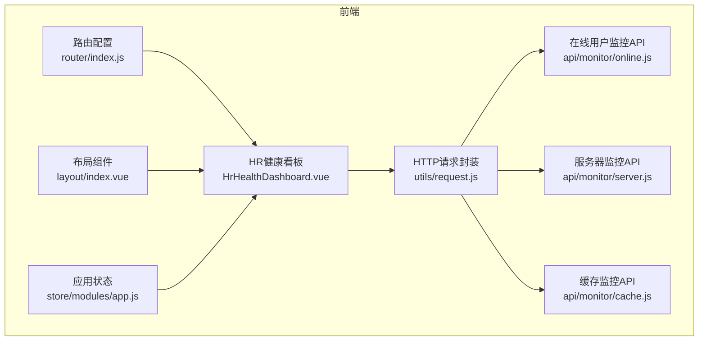
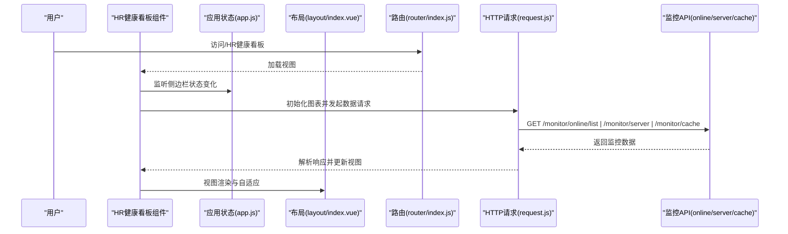
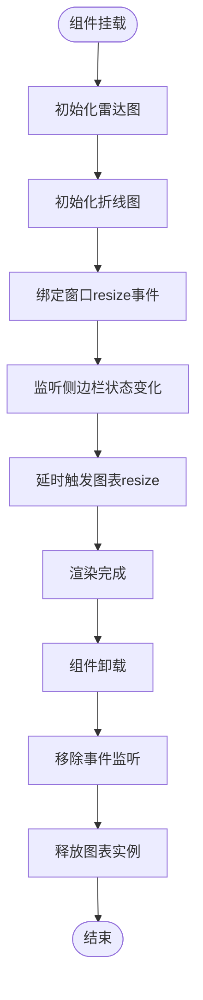
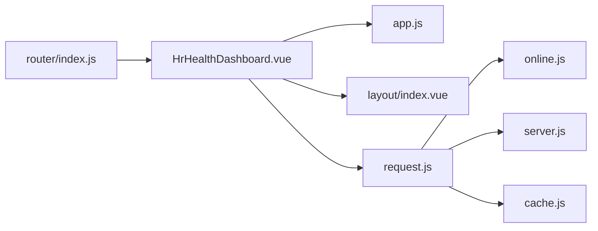

# HR健康监控

<cite>
**本文引用的文件**
- [HrHealthDashboard.vue](file://XingChen-Vue3/src/views/hr/HrHealthDashboard.vue)
- [dashboard.vue](file://XingChen-Vue3/src/views/hr/dashboard.vue)
- [index.js（路由）](file://XingChen-Vue3/src/router/index.js)
- [app.js（应用状态）](file://XingChen-Vue3/src/store/modules/app.js)
- [index.vue（布局）](file://XingChen-Vue3/src/layout/index.vue)
- [request.js（HTTP请求封装）](file://XingChen-Vue3/src/utils/request.js)
- [online.js（在线用户监控API）](file://XingChen-Vue3/src/api/monitor/online.js)
- [server.js（服务器监控API）](file://XingChen-Vue3/src/api/monitor/server.js)
- [cache.js（缓存监控API）](file://XingChen-Vue3/src/api/monitor/cache.js)
</cite>

## 目录
1. [简介](#简介)
2. [项目结构](#项目结构)
3. [核心组件](#核心组件)
4. [架构总览](#架构总览)
5. [详细组件分析](#详细组件分析)
6. [依赖关系分析](#依赖关系分析)
7. [性能考量](#性能考量)
8. [故障排查指南](#故障排查指南)
9. [结论](#结论)
10. [附录](#附录)

## 简介
本技术文档聚焦于HR健康监控模块，涵盖健康数据分析展示、实时监控、预警系统设计与可视化图表实现。文档解释了HR看板的数据聚合逻辑、员工健康状态统计、异常预警机制与趋势分析算法，并提供在线用户监控、服务器性能指标、缓存使用情况与系统负载分析的技术实现要点。同时给出数据可视化组件使用指南、监控指标配置与告警规则设置建议，以及HR管理的业务流程与决策支持功能说明。

## 项目结构
HR健康监控模块位于前端工程 XingChen-Vue3 中，采用 Vue3 + Element Plus + ECharts 技术栈构建。核心入口为 HR 看板组件，通过路由挂载至系统侧边栏“人力资源”菜单下；监控数据通过统一的 HTTP 请求封装与后端 API 对接；侧边栏状态与窗口尺寸变化驱动图表自适应重绘。

**图表来源**
- [HrHealthDashboard.vue:1-481](file://XingChen-Vue3/src/views/hr/HrHealthDashboard.vue#L1-L481)
- [index.js（路由）:1-197](file://XingChen-Vue3/src/router/index.js#L1-L197)
- [app.js（应用状态）:1-47](file://XingChen-Vue3/src/store/modules/app.js#L1-L47)
- [index.vue（布局）:1-116](file://XingChen-Vue3/src/layout/index.vue#L1-L116)
- [request.js（HTTP请求封装）:1-154](file://XingChen-Vue3/src/utils/request.js#L1-L154)
- [online.js（在线用户监控API）:1-19](file://XingChen-Vue3/src/api/monitor/online.js#L1-L19)
- [server.js（服务器监控API）:1-9](file://XingChen-Vue3/src/api/monitor/server.js#L1-L9)
- [cache.js（缓存监控API）:1-58](file://XingChen-Vue3/src/api/monitor/cache.js#L1-L58)

**章节来源**
- [HrHealthDashboard.vue:1-481](file://XingChen-Vue3/src/views/hr/HrHealthDashboard.vue#L1-L481)
- [index.js（路由）:27-109](file://XingChen-Vue3/src/router/index.js#L27-L109)
- [index.vue（布局）:16-63](file://XingChen-Vue3/src/layout/index.vue#L16-L63)
- [app.js（应用状态）:1-47](file://XingChen-Vue3/src/store/modules/app.js#L1-L47)
- [request.js（HTTP请求封装）:14-21](file://XingChen-Vue3/src/utils/request.js#L14-L21)

## 核心组件
- HR健康看板组件：负责渲染核心指标卡片、雷达图、折线图与预警时间线，内置AI健康分析总结的模拟交互与图表自适应。
- 应用状态管理：提供侧边栏开关状态监听，用于在侧边栏切换后触发图表重绘。
- 路由与布局：HR看板通过路由挂载，布局组件控制固定头部、标签页与侧边栏交互。
- HTTP请求封装：统一拦截器、超时控制、重复提交防护与错误处理，作为所有监控API调用的基础。

**章节来源**
- [HrHealthDashboard.vue:132-365](file://XingChen-Vue3/src/views/hr/HrHealthDashboard.vue#L132-L365)
- [app.js（应用状态）:15-43](file://XingChen-Vue3/src/store/modules/app.js#L15-L43)
- [index.js（路由）:95-108](file://XingChen-Vue3/src/router/index.js#L95-L108)
- [index.vue（布局）:16-63](file://XingChen-Vue3/src/layout/index.vue#L16-L63)
- [request.js（HTTP请求封装）:23-124](file://XingChen-Vue3/src/utils/request.js#L23-L124)

## 架构总览
HR健康监控模块采用“视图层 + 状态层 + 路由层 + 请求层”的分层架构。视图层负责数据展示与交互；状态层提供侧边栏与设备状态；路由层承载菜单与页面跳转；请求层统一封装网络通信与错误处理。监控数据通过API模块对接后端，当前看板以模拟数据为主，便于演示与后续对接真实接口。

**图表来源**
- [HrHealthDashboard.vue:354-364](file://XingChen-Vue3/src/views/hr/HrHealthDashboard.vue#L354-L364)
- [app.js（应用状态）:348-352](file://XingChen-Vue3/src/views/hr/HrHealthDashboard.vue#L348-L352)
- [index.js（路由）:95-108](file://XingChen-Vue3/src/router/index.js#L95-L108)
- [request.js（HTTP请求封装）:23-124](file://XingChen-Vue3/src/utils/request.js#L23-L124)
- [online.js（在线用户监控API）:3-10](file://XingChen-Vue3/src/api/monitor/online.js#L3-L10)
- [server.js（服务器监控API）:3-9](file://XingChen-Vue3/src/api/monitor/server.js#L3-L9)
- [cache.js（缓存监控API）:3-9](file://XingChen-Vue3/src/api/monitor/cache.js#L3-L9)

## 详细组件分析

### HR健康看板组件（HrHealthDashboard.vue）
- 数据概览区：包含AI健康分析总结卡片、异常预警部门数、高压预警人数、打卡人数等核心指标。
- 图表区：左侧雷达图展示核心部门健康画像，右侧折线图展示全公司压力指数周趋势。
- 实时预警区：时间线展示系统警报与健康异常预警动态。
- 交互与生命周期：
  - 初始化：挂载时初始化雷达图与折线图，绑定窗口resize事件。
  - 自适应：侧边栏状态变化后延时触发图表resize，确保图表正确渲染。
  - 销毁：组件卸载时移除事件监听并释放图表实例。
- AI健康分析总结：提供按钮触发模拟生成与打字机效果，便于演示AI辅助分析能力。

**图表来源**
- [HrHealthDashboard.vue:354-364](file://XingChen-Vue3/src/views/hr/HrHealthDashboard.vue#L354-L364)
- [HrHealthDashboard.vue:342-352](file://XingChen-Vue3/src/views/hr/HrHealthDashboard.vue#L342-L352)

**章节来源**
- [HrHealthDashboard.vue:8-129](file://XingChen-Vue3/src/views/hr/HrHealthDashboard.vue#L8-L129)
- [HrHealthDashboard.vue:210-337](file://XingChen-Vue3/src/views/hr/HrHealthDashboard.vue#L210-L337)
- [HrHealthDashboard.vue:156-185](file://XingChen-Vue3/src/views/hr/HrHealthDashboard.vue#L156-L185)

### 在线用户监控（online.js）
- 接口职责：查询在线用户列表与强制下线操作。
- 使用方式：通过HTTP请求封装统一发起GET/DELETE请求，参数与返回体遵循后端约定。

**章节来源**
- [online.js（在线用户监控API）:3-18](file://XingChen-Vue3/src/api/monitor/online.js#L3-L18)
- [request.js（HTTP请求封装）:23-124](file://XingChen-Vue3/src/utils/request.js#L23-L124)

### 服务器监控（server.js）
- 接口职责：获取服务器运行信息（CPU、内存、磁盘、JVM等指标）。
- 使用方式：通过HTTP请求封装发起GET请求，解析后端返回的服务器状态数据。

**章节来源**
- [server.js（服务器监控API）:3-9](file://XingChen-Vue3/src/api/monitor/server.js#L3-L9)
- [request.js（HTTP请求封装）:23-124](file://XingChen-Vue3/src/utils/request.js#L23-L124)

### 缓存监控（cache.js）
- 接口职责：查询缓存详情、缓存名称列表、缓存键名列表、缓存内容、清理指定名称/键名/全部缓存。
- 使用方式：通过HTTP请求封装发起GET/DELETE请求，支持按名称与键名维度进行缓存治理。

**章节来源**
- [cache.js（缓存监控API）:3-57](file://XingChen-Vue3/src/api/monitor/cache.js#L3-L57)
- [request.js（HTTP请求封装）:23-124](file://XingChen-Vue3/src/utils/request.js#L23-L124)

### 应用状态与布局联动（app.js、layout/index.vue）
- 应用状态：提供侧边栏开关状态、设备类型与尺寸等全局状态，供组件监听与响应。
- 布局联动：布局组件根据侧边栏状态与窗口尺寸动态计算固定头部宽度与容器类名，保障看板在不同设备下的显示一致性。

**章节来源**
- [app.js（应用状态）:15-43](file://XingChen-Vue3/src/store/modules/app.js#L15-L43)
- [index.vue（布局）:30-63](file://XingChen-Vue3/src/layout/index.vue#L30-L63)

## 依赖关系分析
- 组件耦合：HR健康看板组件与应用状态、布局组件存在松耦合的观察者关系（侧边栏状态变化触发图表重绘），与图表库（ECharts）形成外部依赖。
- 数据流：组件通过API模块调用HTTP请求封装，统一处理鉴权、重复提交防护与错误提示，最终将后端数据渲染到视图。
- 路由集成：HR看板通过路由配置挂载至“人力资源”菜单，保证菜单导航与页面访问的一致性。

**图表来源**
- [HrHealthDashboard.vue:132-365](file://XingChen-Vue3/src/views/hr/HrHealthDashboard.vue#L132-L365)
- [app.js（应用状态）:1-47](file://XingChen-Vue3/src/store/modules/app.js#L1-L47)
- [index.vue（布局）:16-63](file://XingChen-Vue3/src/layout/index.vue#L16-L63)
- [request.js（HTTP请求封装）:1-154](file://XingChen-Vue3/src/utils/request.js#L1-L154)
- [online.js（在线用户监控API）:1-19](file://XingChen-Vue3/src/api/monitor/online.js#L1-L19)
- [server.js（服务器监控API）:1-9](file://XingChen-Vue3/src/api/monitor/server.js#L1-L9)
- [cache.js（缓存监控API）:1-58](file://XingChen-Vue3/src/api/monitor/cache.js#L1-L58)
- [index.js（路由）:95-108](file://XingChen-Vue3/src/router/index.js#L95-L108)

**章节来源**
- [index.js（路由）:95-108](file://XingChen-Vue3/src/router/index.js#L95-L108)
- [HrHealthDashboard.vue:348-352](file://XingChen-Vue3/src/views/hr/HrHealthDashboard.vue#L348-L352)

## 性能考量
- 图表自适应：在侧边栏切换与窗口resize时延迟触发图表resize，避免频繁重排导致的性能抖动。
- 请求防抖：HTTP请求拦截器对POST/PUT请求进行重复提交检测，降低无效请求带来的系统压力。
- 超时与错误处理：统一的超时与错误提示策略，有助于快速定位问题并减少长时间阻塞。
- 缓存治理：通过缓存监控API可按需清理指定键名或名称的缓存，缓解热点数据堆积引发的性能问题。

**章节来源**
- [HrHealthDashboard.vue:342-352](file://XingChen-Vue3/src/views/hr/HrHealthDashboard.vue#L342-L352)
- [request.js（HTTP请求封装）:41-68](file://XingChen-Vue3/src/utils/request.js#L41-L68)
- [request.js（HTTP请求封装）:19-21](file://XingChen-Vue3/src/utils/request.js#L19-L21)
- [cache.js（缓存监控API）:35-57](file://XingChen-Vue3/src/api/monitor/cache.js#L35-L57)

## 故障排查指南
- 登录态失效：当后端返回401时，统一弹窗提示并引导重新登录，避免组件继续执行请求。
- 服务器异常：当后端返回500时，统一错误提示并中断流程，便于快速定位后端问题。
- 接口超时/网络异常：对超时与网络错误进行统一提示，建议检查网络连通性与代理配置。
- 重复提交：若短时间内重复提交相同请求，拦截器将阻止请求并提示“数据正在处理”，避免并发问题。
- 图表不显示：确认DOM节点存在且未被销毁，检查resize事件是否正确绑定与解绑。

**章节来源**
- [request.js（HTTP请求封装）:85-124](file://XingChen-Vue3/src/utils/request.js#L85-L124)
- [request.js（HTTP请求封装）:41-68](file://XingChen-Vue3/src/utils/request.js#L41-L68)
- [HrHealthDashboard.vue:360-364](file://XingChen-Vue3/src/views/hr/HrHealthDashboard.vue#L360-L364)

## 结论
HR健康监控模块以清晰的分层架构与完善的监控API为基础，结合可视化图表与实时预警，为HR管理提供了直观的数据支撑。当前看板以模拟数据为主，便于快速落地与迭代；后续可无缝对接真实后端接口，实现从“数据采集—聚合—分析—预警—可视化”的完整闭环。通过合理的性能优化与故障排查策略，可进一步提升系统的稳定性与用户体验。

## 附录
- 数据可视化组件使用建议
  - 雷达图：适用于多维度健康指标对比，建议每类指标设定统一阈值，便于跨部门横向评估。
  - 折线图：适用于趋势分析，建议按自然周/月聚合，叠加预警阈值线以突出异常波动。
  - 时间线：用于实时预警与事件追踪，建议按严重程度区分颜色与图标，增强可读性。
- 监控指标配置与告警规则设置建议
  - 在线用户：设置活跃度阈值与异常登录检测，结合强制下线能力进行安全处置。
  - 服务器：关注CPU使用率、内存占用、磁盘空间与JVM堆栈，设置分级告警阈值。
  - 缓存：监控命中率、容量与键数量，定期清理过期键，避免缓存雪崩。
  - 健康看板：压力指数、久坐时长、颈椎风险等指标建议设置动态阈值，结合趋势分析触发预警。
- HR业务流程与决策支持
  - 周报/月报：基于趋势分析与部门画像生成健康报告，辅助HR制定干预措施。
  - 干预策略：针对高压预警人数与部门异常预警，联动工间操、工位调整与心理辅导等资源。
  - 决策支持：将AI健康分析总结与历史趋势结合，形成可量化的HR决策依据。