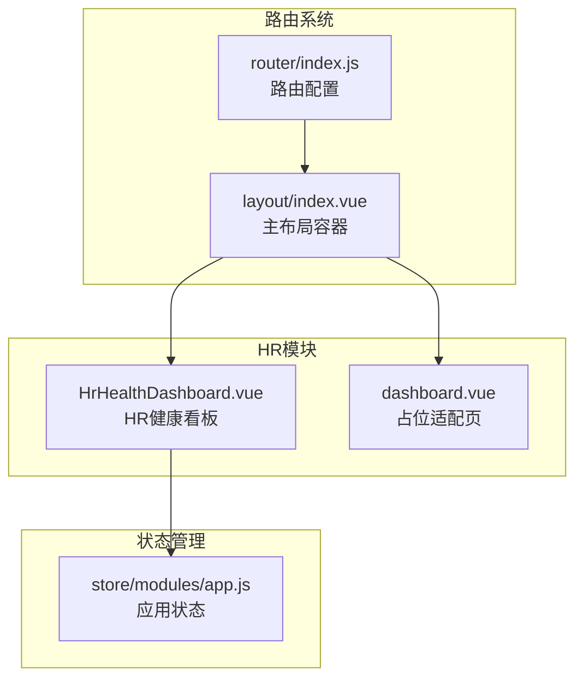
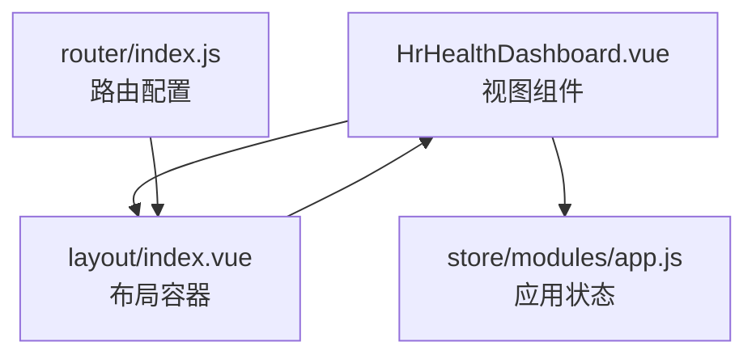
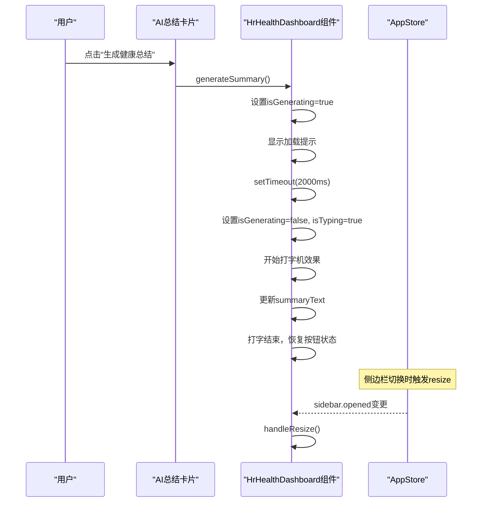
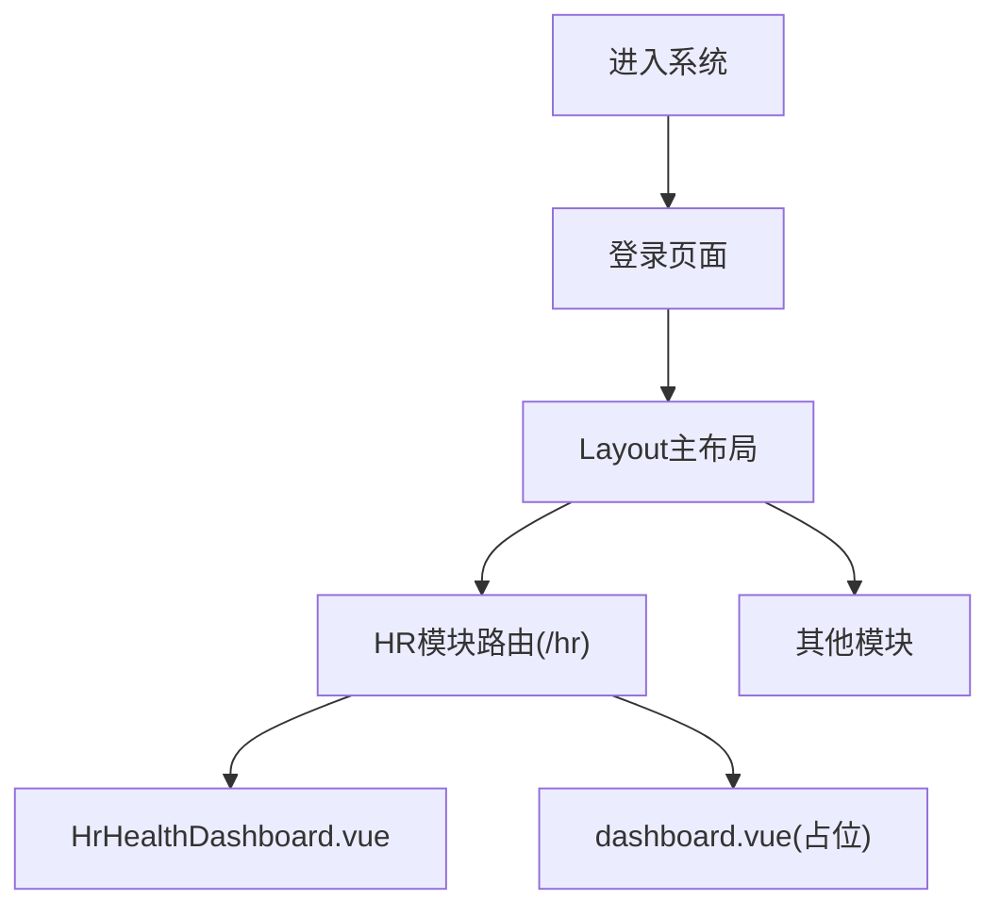
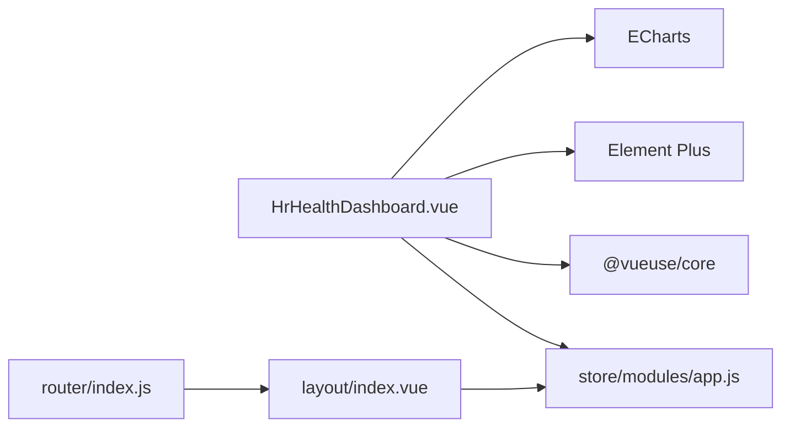

# HR看板概览

<cite>
**本文档引用的文件**
- [HrHealthDashboard.vue](file://XingChen-Vue3/src/views/hr/HrHealthDashboard.vue)
- [dashboard.vue](file://XingChen-Vue3/src/views/hr/dashboard.vue)
- [index.js](file://XingChen-Vue3/src/router/index.js)
- [app.js](file://XingChen-Vue3/src/store/modules/app.js)
- [index.vue](file://XingChen-Vue3/src/layout/index.vue)
</cite>

## 目录
1. [简介](#简介)
2. [项目结构](#项目结构)
3. [核心组件](#核心组件)
4. [架构总览](#架构总览)
5. [详细组件分析](#详细组件分析)
6. [依赖关系分析](#依赖关系分析)
7. [性能考虑](#性能考虑)
8. [故障排除指南](#故障排除指南)
9. [结论](#结论)

## 简介
本技术文档聚焦于HR看板概览页面的设计与实现，涵盖整体布局、核心数据面板、响应式布局、组件架构、导航结构、数据卡片设计、图标使用规范、样式定制方案、生命周期管理、事件处理机制、状态管理策略，以及与HR功能模块的集成与数据流转。

## 项目结构
HR看板位于前端Vue3工程的HR模块下，采用按功能域划分的组织方式：
- 视图层：HR相关页面集中于 views/hr 目录
- 路由层：通过路由配置将HR模块挂载至主布局
- 状态层：应用级状态通过Pinia store管理
- 布局层：统一布局组件负责头部、侧边栏、标签页等

**图表来源**
- [HrHealthDashboard.vue:1-481](file://XingChen-Vue3/src/views/hr/HrHealthDashboard.vue#L1-L481)
- [dashboard.vue:1-20](file://XingChen-Vue3/src/views/hr/dashboard.vue#L1-L20)
- [index.js:1-197](file://XingChen-Vue3/src/router/index.js#L1-L197)
- [index.vue:1-116](file://XingChen-Vue3/src/layout/index.vue#L1-L116)
- [app.js:1-47](file://XingChen-Vue3/src/store/modules/app.js#L1-L47)

**章节来源**
- [index.js:95-108](file://XingChen-Vue3/src/router/index.js#L95-L108)
- [index.vue:1-116](file://XingChen-Vue3/src/layout/index.vue#L1-L116)

## 核心组件
- HrHealthDashboard.vue：HR健康看板主组件，包含核心数据面板、图表与实时预警动态
- dashboard.vue：占位适配页，用于路由调试与提示
- layout/index.vue：主布局容器，承载侧边栏、固定头部、标签页与设置面板
- store/modules/app.js：应用状态管理，提供侧边栏开关、设备类型、尺寸等全局状态

**章节来源**
- [HrHealthDashboard.vue:1-481](file://XingChen-Vue3/src/views/hr/HrHealthDashboard.vue#L1-L481)
- [dashboard.vue:1-20](file://XingChen-Vue3/src/views/hr/dashboard.vue#L1-L20)
- [index.vue:1-116](file://XingChen-Vue3/src/layout/index.vue#L1-L116)
- [app.js:1-47](file://XingChen-Vue3/src/store/modules/app.js#L1-L47)

## 架构总览
HR看板采用“视图组件 + 布局容器 + 路由配置 + 状态管理”的分层架构：
- 视图组件负责UI渲染与交互逻辑
- 布局容器负责响应式布局与设备适配
- 路由系统负责模块化导航与权限控制
- 状态管理负责跨组件共享的状态与行为

**图表来源**
- [HrHealthDashboard.vue:132-365](file://XingChen-Vue3/src/views/hr/HrHealthDashboard.vue#L132-L365)
- [index.vue:16-63](file://XingChen-Vue3/src/layout/index.vue#L16-L63)
- [index.js:185-196](file://XingChen-Vue3/src/router/index.js#L185-L196)
- [app.js:3-44](file://XingChen-Vue3/src/store/modules/app.js#L3-L44)

## 详细组件分析

### HrHealthDashboard.vue 组件分析
- 整体布局
  - 使用 Element Plus 的栅格系统进行响应式布局，支持移动端与桌面端自适应
  - 顶部核心数据概览区包含AI健康分析总结卡片与关键指标卡片
  - 中部图表分析区包含雷达图与折线图
  - 底部实时预警动态区使用时间轴展示健康异常信息
- 数据卡片设计
  - 关键指标卡片采用左右布局，左侧图标区使用颜色语义区分风险等级
  - 卡片标题与数值采用清晰的层级与字号，确保可读性
- 图标使用规范
  - 使用 @element-plus/icons-vue 提供的图标组件，统一风格与尺寸
  - 不同风险等级使用不同颜色背景与图标色值
- 样式定制方案
  - 使用 SCSS 作用域样式，避免全局污染
  - 通过 :deep 选择器对 Element Plus 内部组件进行样式穿透
  - 定义统一的颜色变量与间距变量，便于主题切换
- 生命周期管理
  - onMounted：初始化雷达图与折线图，绑定窗口 resize 事件
  - onBeforeUnmount：移除事件监听与释放图表资源
- 事件处理机制
  - 侧边栏状态变化通过 watch 监听 appStore.sidebar.opened，在动画结束后触发图表 resize
  - 窗口大小变化时自动触发图表 resize，保证图表自适应
- 状态管理策略
  - 通过 useAppStore 获取侧边栏状态，实现与布局的联动
  - 使用本地 Cookie 存储侧边栏状态，实现刷新后状态保持

**图表来源**
- [HrHealthDashboard.vue:159-185](file://XingChen-Vue3/src/views/hr/HrHealthDashboard.vue#L159-L185)
- [HrHealthDashboard.vue:342-352](file://XingChen-Vue3/src/views/hr/HrHealthDashboard.vue#L342-L352)
- [app.js:15-27](file://XingChen-Vue3/src/store/modules/app.js#L15-L27)

**章节来源**
- [HrHealthDashboard.vue:1-481](file://XingChen-Vue3/src/views/hr/HrHealthDashboard.vue#L1-L481)
- [app.js:1-47](file://XingChen-Vue3/src/store/modules/app.js#L1-L47)

### dashboard.vue 组件分析
- 用途：作为占位适配页，用于验证路由匹配是否正确
- 特点：简单结构，仅用于提示用户当前访问的页面路径

**章节来源**
- [dashboard.vue:1-20](file://XingChen-Vue3/src/views/hr/dashboard.vue#L1-L20)

### 路由与导航结构
- HR模块路由配置
  - 路径：/hr
  - 标题：人力资源
  - 图标：peoples
  - 子路由：积分兑换审核
- 主布局集成
  - 通过 Layout 组件包裹，实现统一的头部、侧边栏、标签页与设置面板
  - 支持固定头部与标签页显示控制

**图表来源**
- [index.js:28-109](file://XingChen-Vue3/src/router/index.js#L28-L109)
- [index.vue:1-116](file://XingChen-Vue3/src/layout/index.vue#L1-L116)

**章节来源**
- [index.js:95-108](file://XingChen-Vue3/src/router/index.js#L95-L108)

### 响应式布局实现
- 设备检测
  - 基于窗口宽度判断设备类型（desktop/mobile）
  - 移动端自动关闭侧边栏，避免遮挡内容
- 布局适配
  - 固定头部宽度根据侧边栏状态动态计算
  - 侧边栏隐藏时，头部宽度自适应为100%
- 图表自适应
  - 窗口resize事件触发图表resize
  - 侧边栏动画结束后延时触发resize，确保布局稳定

**章节来源**
- [index.vue:40-53](file://XingChen-Vue3/src/layout/index.vue#L40-L53)
- [HrHealthDashboard.vue:342-352](file://XingChen-Vue3/src/views/hr/HrHealthDashboard.vue#L342-L352)

## 依赖关系分析
- 组件耦合
  - HrHealthDashboard.vue 与 layout/index.vue 通过路由解耦
  - 与 store/modules/app.js 通过 Pinia 状态管理解耦
- 外部依赖
  - Element Plus：栅格、卡片、图标、时间轴等UI组件
  - ECharts：雷达图与折线图可视化
  - VueUse：窗口尺寸监听
  - JS-Cookie：侧边栏状态持久化

**图表来源**
- [HrHealthDashboard.vue:134-136](file://XingChen-Vue3/src/views/hr/HrHealthDashboard.vue#L134-L136)
- [index.vue:17-21](file://XingChen-Vue3/src/layout/index.vue#L17-L21)
- [index.js:1-25](file://XingChen-Vue3/src/router/index.js#L1-L25)

**章节来源**
- [HrHealthDashboard.vue:132-136](file://XingChen-Vue3/src/views/hr/HrHealthDashboard.vue#L132-L136)
- [index.vue:16-21](file://XingChen-Vue3/src/layout/index.vue#L16-L21)
- [app.js:1-1](file://XingChen-Vue3/src/store/modules/app.js#L1-L1)

## 性能考虑
- 图表性能
  - 图表实例在组件卸载时及时释放，避免内存泄漏
  - resize操作添加节流，减少频繁重绘
- 状态管理
  - 侧边栏状态使用 Cookie 持久化，减少重复计算
  - 设备类型检测基于窗口监听，避免不必要的重渲染
- 资源优化
  - 图标组件按需引入，减少打包体积
  - SCSS 作用域样式避免全局污染，提升样式解析效率

## 故障排除指南
- 图表不显示或显示异常
  - 检查图表容器DOM是否存在
  - 确认init函数调用顺序与DOM渲染时机
  - 验证resize事件绑定与移除
- 侧边栏切换导致图表变形
  - 确认watch对sidebar.opened的监听生效
  - 检查setTimeout延时是否足够等待动画完成
- 响应式布局异常
  - 检查设备类型判断逻辑与窗口宽度阈值
  - 确认固定头部宽度计算公式

**章节来源**
- [HrHealthDashboard.vue:342-364](file://XingChen-Vue3/src/views/hr/HrHealthDashboard.vue#L342-L364)
- [index.vue:40-53](file://XingChen-Vue3/src/layout/index.vue#L40-L53)

## 结论
HR看板概览页面通过清晰的组件分层、完善的响应式布局与状态管理，实现了健康数据的可视化展示与交互体验。组件间低耦合、高内聚的设计便于后续扩展与维护。建议在实际业务中接入真实数据接口，完善图表数据源与预警规则，以提升系统的实用性与价值。