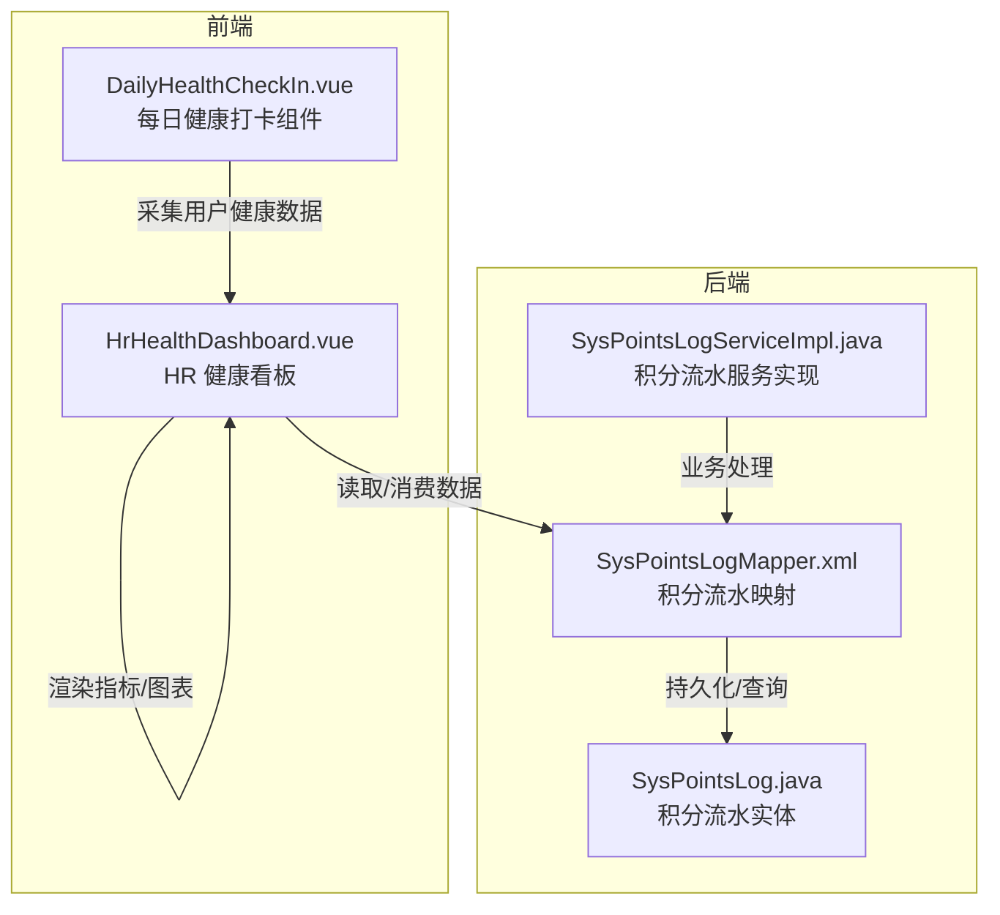
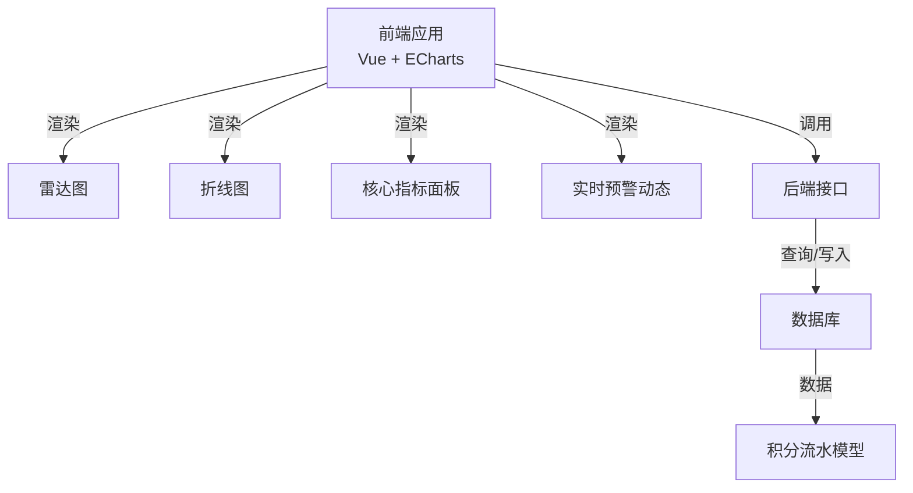
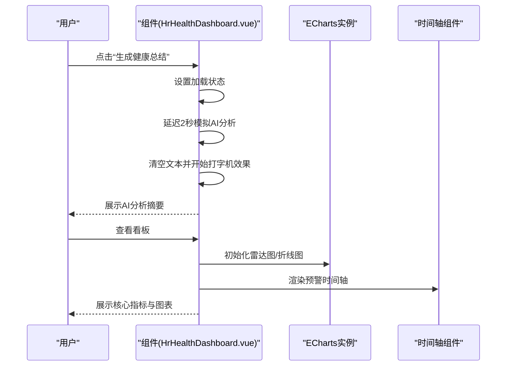
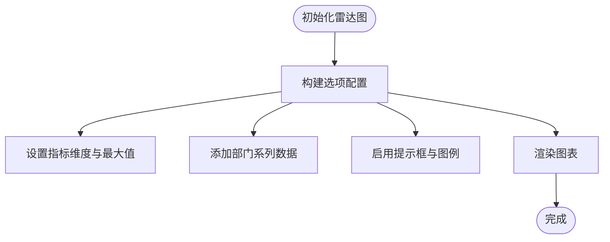
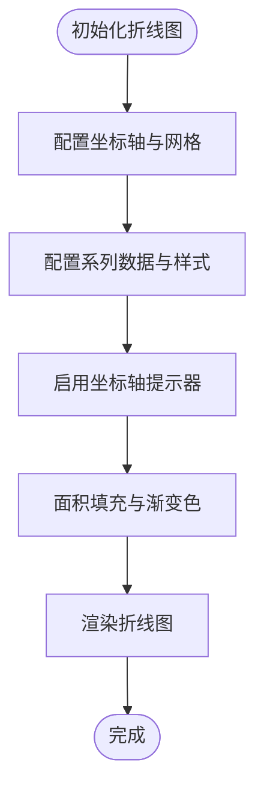
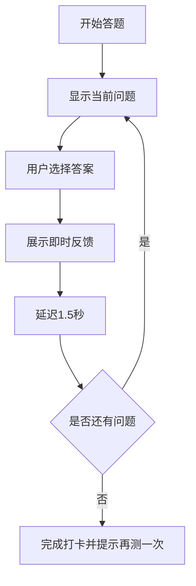
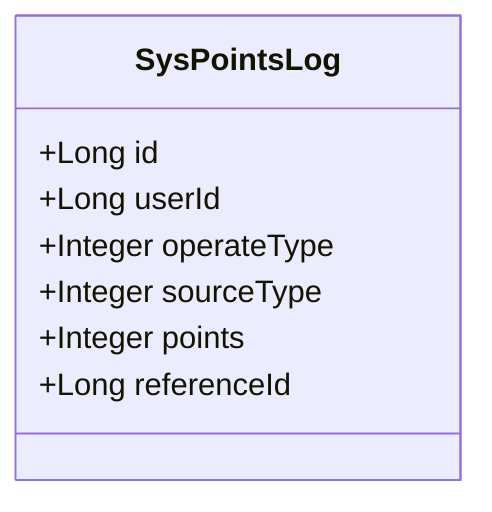
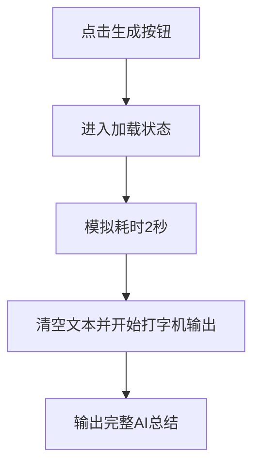
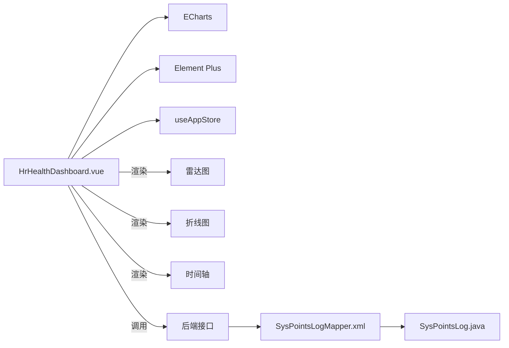

# 健康数据分析

<cite>
**本文引用的文件**
- [HrHealthDashboard.vue](file://XingChen-Vue3/src/views/hr/HrHealthDashboard.vue)
- [DailyHealthCheckIn.vue](file://XingChen-Vue3/src/components/DailyHealthCheckIn.vue)
- [SysPointsLog.java](file://XingChen-Vue/xingchen-system/src/main/java/com/xingchen/system/domain/SysPointsLog.java)
- [SysPointsLogMapper.xml](file://XingChen-Vue/xingchen-system/src/main/resources/mapper/system/SysPointsLogMapper.xml)
- [SysPointsLogServiceImpl.java](file://XingChen-Vue/xingchen-system/src/main/java/com/xingchen/system/service/impl/SysPointsLogServiceImpl.java)
- [dashboard.vue](file://XingChen-Vue3/src/views/hr/dashboard.vue)
</cite>

## 目录
1. [引言](#引言)
2. [项目结构](#项目结构)
3. [核心组件](#核心组件)
4. [架构总览](#架构总览)
5. [详细组件分析](#详细组件分析)
6. [依赖分析](#依赖分析)
7. [性能考量](#性能考量)
8. [故障排查指南](#故障排查指南)
9. [结论](#结论)
10. [附录](#附录)

## 引言
本技术文档聚焦于健康数据分析模块，围绕以下目标展开：健康评分计算算法、部门健康画像生成、趋势分析方法与统计指标计算；雷达图数据结构、折线图时间序列处理、数据聚合逻辑与异常检测机制；Mock 数据生成策略、AI 分析集成方案以及数据可视化实现；最后阐述数据分析的业务逻辑、算法优化与性能考虑。本文以现有代码为依据，结合可扩展性建议，帮助读者快速理解并迭代该模块。

## 项目结构
健康数据分析相关代码主要分布在前端看板与后端积分流水模型中：
- 前端看板：HR 健康看板负责展示核心指标、雷达图、折线图与实时预警动态。
- 前端组件：每日健康打卡组件提供用户侧健康数据采集入口。
- 后端模型：积分流水模型承载与健康相关的业务数据（如打卡、兑换等），可用于后续健康评分与趋势分析的数据来源。

**图表来源**
- [HrHealthDashboard.vue:1-481](file://XingChen-Vue3/src/views/hr/HrHealthDashboard.vue#L1-L481)
- [DailyHealthCheckIn.vue:1-281](file://XingChen-Vue3/src/components/DailyHealthCheckIn.vue#L1-L281)
- [SysPointsLog.java:1-105](file://XingChen-Vue/xingchen-system/src/main/java/com/xingchen/system/domain/SysPointsLog.java#L1-L105)
- [SysPointsLogMapper.xml:22-46](file://XingChen-Vue/xingchen-system/src/main/resources/mapper/system/SysPointsLogMapper.xml#L22-L46)
- [SysPointsLogServiceImpl.java:1-57](file://XingChen-Vue/xingchen-system/src/main/java/com/xingchen/system/service/impl/SysPointsLogServiceImpl.java#L1-L57)

**章节来源**
- [HrHealthDashboard.vue:1-481](file://XingChen-Vue3/src/views/hr/HrHealthDashboard.vue#L1-L481)
- [DailyHealthCheckIn.vue:1-281](file://XingChen-Vue3/src/components/DailyHealthCheckIn.vue#L1-L281)
- [SysPointsLog.java:1-105](file://XingChen-Vue/xingchen-system/src/main/java/com/xingchen/system/domain/SysPointsLog.java#L1-L105)
- [SysPointsLogMapper.xml:22-46](file://XingChen-Vue/xingchen-system/src/main/resources/mapper/system/SysPointsLogMapper.xml#L22-L46)
- [SysPointsLogServiceImpl.java:1-57](file://XingChen-Vue/xingchen-system/src/main/java/com/xingchen/system/service/impl/SysPointsLogServiceImpl.java#L1-L57)

## 核心组件
- HR 健康看板：负责展示核心健康指标、雷达图（部门健康画像）、折线图（压力趋势）、AI 总结与实时预警动态。
- 每日健康打卡组件：提供渐进式问答与即时反馈，作为健康数据采集入口。
- 积分流水模型：承载与健康相关的业务数据（如打卡、兑换等），为健康评分与趋势分析提供数据基础。

**章节来源**
- [HrHealthDashboard.vue:1-481](file://XingChen-Vue3/src/views/hr/HrHealthDashboard.vue#L1-L481)
- [DailyHealthCheckIn.vue:1-281](file://XingChen-Vue3/src/components/DailyHealthCheckIn.vue#L1-L281)
- [SysPointsLog.java:1-105](file://XingChen-Vue/xingchen-system/src/main/java/com/xingchen/system/domain/SysPointsLog.java#L1-L105)

## 架构总览
前端通过 ECharts 渲染图表，使用 Vue 组件管理状态与生命周期；后端通过 MyBatis 映射访问数据库，服务层封装业务逻辑。健康看板目前以 Mock 数据为主，但具备对接真实数据源的能力。

**图表来源**
- [HrHealthDashboard.vue:210-364](file://XingChen-Vue3/src/views/hr/HrHealthDashboard.vue#L210-L364)
- [SysPointsLogMapper.xml:22-46](file://XingChen-Vue/xingchen-system/src/main/resources/mapper/system/SysPointsLogMapper.xml#L22-L46)

## 详细组件分析

### HR 健康看板（HrHealthDashboard.vue）
- 视图结构：顶部核心指标卡片、雷达图、折线图、实时预警动态。
- 图表初始化：雷达图与折线图分别在挂载时初始化，并在窗口大小变化时自适应重绘。
- Mock 数据：健康评分、异常预警部门数、高压预警人数、打卡人数均为静态模拟值。
- AI 总结：提供按钮触发“生成健康总结”，采用打字机效果模拟 AI 输出。
- 实时预警：基于预设活动列表渲染时间轴，支持不同状态的颜色与样式。

**图表来源**
- [HrHealthDashboard.vue:156-185](file://XingChen-Vue3/src/views/hr/HrHealthDashboard.vue#L156-L185)
- [HrHealthDashboard.vue:217-337](file://XingChen-Vue3/src/views/hr/HrHealthDashboard.vue#L217-L337)
- [HrHealthDashboard.vue:187-208](file://XingChen-Vue3/src/views/hr/HrHealthDashboard.vue#L187-L208)

**章节来源**
- [HrHealthDashboard.vue:1-481](file://XingChen-Vue3/src/views/hr/HrHealthDashboard.vue#L1-L481)

### 雷达图数据结构与配置
- 指标维度：颈椎风险、眼部疲劳、压力指数、久坐时长、借款异常。
- 多系列对比：支持多部门在同一雷达图中进行健康画像对比。
- 样式与交互：启用提示框、图例与面积填充，提升可读性。

**图表来源**
- [HrHealthDashboard.vue:223-265](file://XingChen-Vue3/src/views/hr/HrHealthDashboard.vue#L223-L265)

**章节来源**
- [HrHealthDashboard.vue:217-266](file://XingChen-Vue3/src/views/hr/HrHealthDashboard.vue#L217-L266)

### 折线图时间序列处理
- 时间轴：按周内工作日（周一至周五）组织横轴。
- 指标：压力指数，支持平滑曲线与面积填充。
- 样式：交叉指示器、网格布局与虚线分割线增强阅读体验。

**图表来源**
- [HrHealthDashboard.vue:274-336](file://XingChen-Vue3/src/views/hr/HrHealthDashboard.vue#L274-L336)

**章节来源**
- [HrHealthDashboard.vue:268-337](file://XingChen-Vue3/src/views/hr/HrHealthDashboard.vue#L268-L337)

### 每日健康打卡组件（数据采集入口）
- 渐进式问答：包含睡眠质量、颈椎感受、水分摄入等健康问题。
- 即时反馈：根据选择给出正向/警示/危险反馈文案。
- 动画与交互：进度条、淡入淡出与上浮动画提升体验。

**图表来源**
- [DailyHealthCheckIn.vue:109-129](file://XingChen-Vue3/src/components/DailyHealthCheckIn.vue#L109-L129)

**章节来源**
- [DailyHealthCheckIn.vue:1-281](file://XingChen-Vue3/src/components/DailyHealthCheckIn.vue#L1-L281)

### 积分流水模型与数据聚合
- 实体字段：流水ID、用户ID、操作类型（收入/支出）、来源类型（打卡/奖励/兑换/退还）、波动分值、业务关联ID。
- 查询条件：支持按用户、操作类型、来源类型、分值、时间范围等过滤。
- 业务意义：可作为健康行为（如每日打卡、连续打卡奖励）与健康评分的量化依据，便于后续聚合与趋势分析。

**图表来源**
- [SysPointsLog.java:11-91](file://XingChen-Vue/xingchen-system/src/main/java/com/xingchen/system/domain/SysPointsLog.java#L11-L91)

**章节来源**
- [SysPointsLog.java:1-105](file://XingChen-Vue/xingchen-system/src/main/java/com/xingchen/system/domain/SysPointsLog.java#L1-L105)
- [SysPointsLogMapper.xml:22-46](file://XingChen-Vue/xingchen-system/src/main/resources/mapper/system/SysPointsLogMapper.xml#L22-L46)
- [SysPointsLogServiceImpl.java:1-57](file://XingChen-Vue/xingchen-system/src/main/java/com/xingchen/system/service/impl/SysPointsLogServiceImpl.java#L1-L57)

### Mock 数据生成策略
- AI 总结：按钮触发后，先显示加载提示，随后以打字机效果输出预设文本，模拟 AI 分析过程。
- 预警动态：预设三条不同类型的活动项（危险/警告/成功），用于演示时间轴渲染。
- 图表数据：雷达图与折线图均采用静态数值，便于快速验证可视化效果。

**图表来源**
- [HrHealthDashboard.vue:159-184](file://XingChen-Vue3/src/views/hr/HrHealthDashboard.vue#L159-L184)

**章节来源**
- [HrHealthDashboard.vue:156-185](file://XingChen-Vue3/src/views/hr/HrHealthDashboard.vue#L156-L185)
- [HrHealthDashboard.vue:187-208](file://XingChen-Vue3/src/views/hr/HrHealthDashboard.vue#L187-L208)

### AI 分析集成方案（概念性）
- 输入：用户健康打卡数据、部门健康画像、历史趋势。
- 处理：对输入进行归一化与特征提取，计算健康评分与风险指标。
- 输出：生成可读性报告与可视化摘要，支持导出与推送。
- 注意：当前看板为 Mock 实现，实际集成需后端提供接口与模型服务。

（本节为概念性说明，不直接对应具体源码）

### 数据可视化实现
- 雷达图：多系列对比，面积填充与透明度控制，增强视觉层次。
- 折线图：平滑曲线、面积填充与渐变背景，突出趋势变化。
- 时间轴：按时间戳排序，不同类型使用不同颜色与样式，便于快速识别风险等级。

**章节来源**
- [HrHealthDashboard.vue:217-337](file://XingChen-Vue3/src/views/hr/HrHealthDashboard.vue#L217-L337)

## 依赖分析
- 前端依赖：Vue 组件、ECharts 图表库、Element Plus 图标与 UI 组件。
- 后端依赖：MyBatis 映射、Spring 服务层、数据库访问层。
- 组件耦合：看板组件与 ECharts 实例强耦合，需在卸载时释放资源；与应用状态（侧边栏开关）联动以响应布局变化。

**图表来源**
- [HrHealthDashboard.vue:132-136](file://XingChen-Vue3/src/views/hr/HrHealthDashboard.vue#L132-L136)
- [HrHealthDashboard.vue:347-352](file://XingChen-Vue3/src/views/hr/HrHealthDashboard.vue#L347-L352)
- [SysPointsLogMapper.xml:22-46](file://XingChen-Vue/xingchen-system/src/main/resources/mapper/system/SysPointsLogMapper.xml#L22-L46)

**章节来源**
- [HrHealthDashboard.vue:132-136](file://XingChen-Vue3/src/views/hr/HrHealthDashboard.vue#L132-L136)
- [SysPointsLogMapper.xml:22-46](file://XingChen-Vue/xingchen-system/src/main/resources/mapper/system/SysPointsLogMapper.xml#L22-L46)

## 性能考量
- 图表渲染：避免在高频事件（如滚动、缩放）中重复初始化图表，应复用实例并在窗口尺寸变化时统一 resize。
- 数据更新：对大数据量的时间序列，采用分页或采样策略，减少一次性渲染压力。
- 资源释放：组件卸载时及时 dispose 图表实例，防止内存泄漏。
- 交互优化：打字机效果与异步加载需合理设置节流/防抖，避免频繁重绘。

（本节为通用性能建议，不直接对应具体源码）

## 故障排查指南
- 图表不显示或空白：确认 DOM 引用是否存在、初始化顺序是否正确、容器尺寸是否有效。
- 图表未自适应：检查窗口 resize 监听与图表实例 resize 调用。
- 数据不更新：确认数据源是否正确传入 setOption，或是否需要重新 setOption。
- 内存泄漏：确保在 onBeforeUnmount 中移除事件监听并 dispose 图表实例。
- 后端接口异常：检查 Mapper XML 的查询条件与参数绑定，确认服务层方法调用链路。

**章节来源**
- [HrHealthDashboard.vue:342-364](file://XingChen-Vue3/src/views/hr/HrHealthDashboard.vue#L342-L364)

## 结论
健康数据分析模块以 HR 健康看板为核心载体，结合雷达图与折线图实现多维健康画像与趋势分析；通过 Mock 的 AI 总结与预警动态，验证了数据可视化与交互流程。后端积分流水模型为后续健康评分与聚合分析提供了数据基础。建议在后续版本中接入真实数据源、完善异常检测与评分算法，并持续优化前端性能与交互体验。

## 附录
- 路由入口适配：存在 dashboard.vue 适配文件，确保路由正确加载主看板。
- 组件入口：HrHealthDashboard.vue 作为主入口，dashboard.vue 仅用于路由校验。

**章节来源**
- [dashboard.vue:1-20](file://XingChen-Vue3/src/views/hr/dashboard.vue#L1-L20)