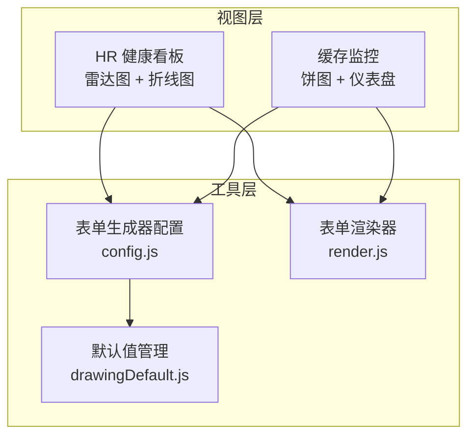
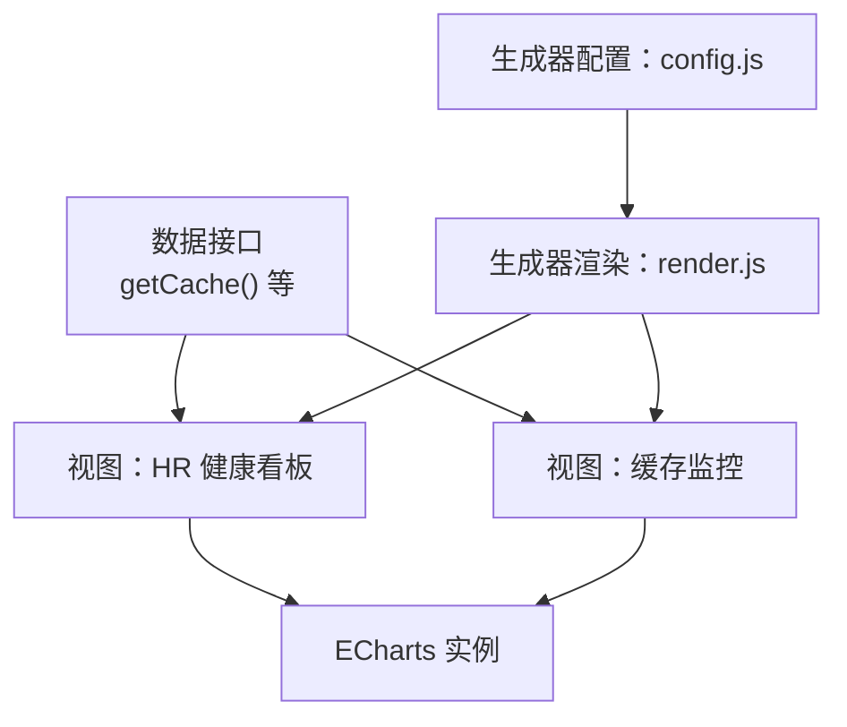
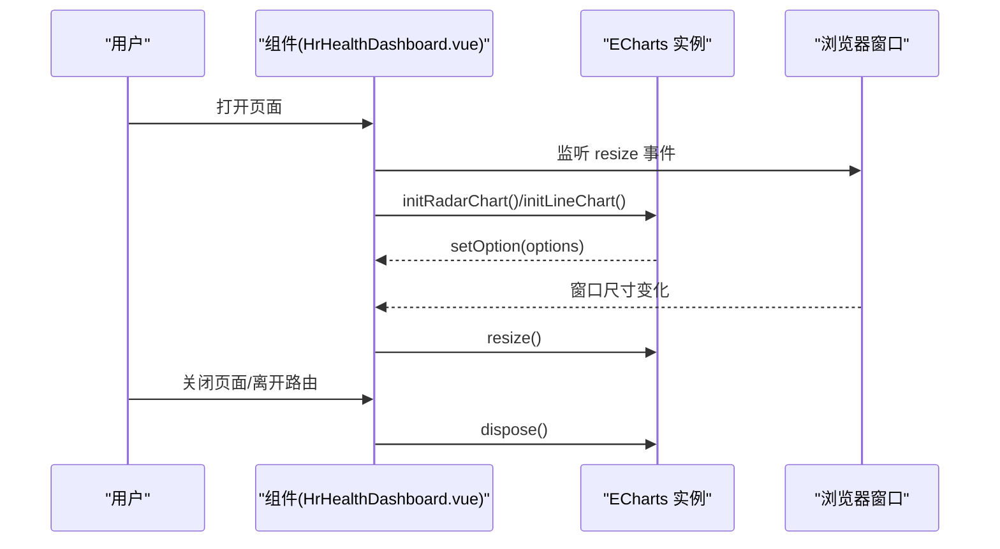
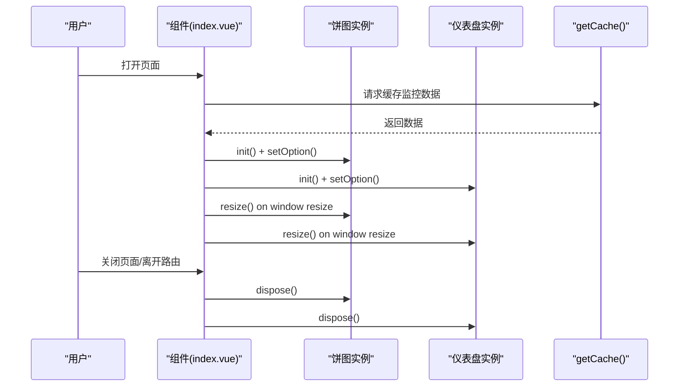
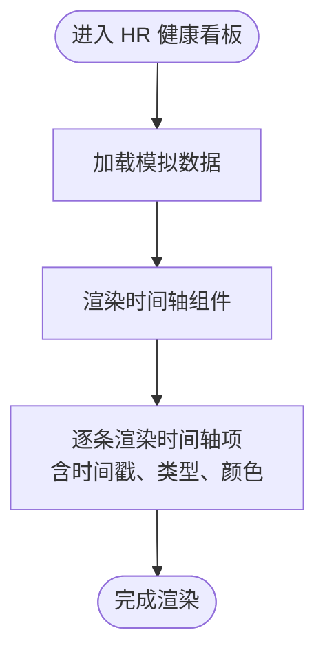
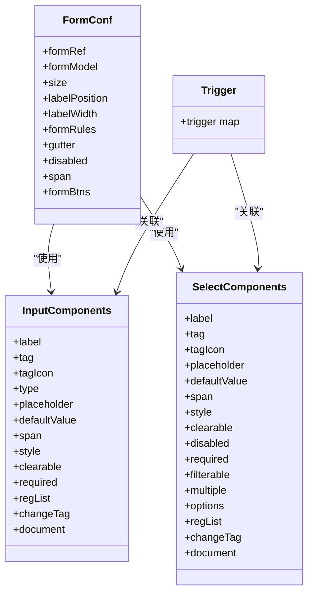
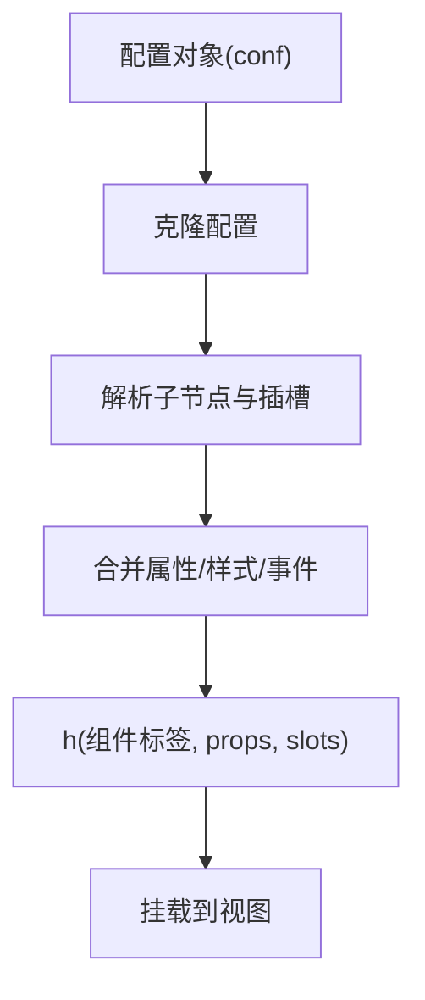
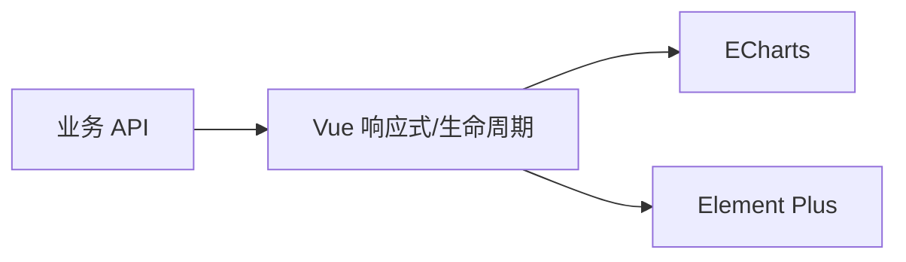

# 可视化图表

<cite>
**本文引用的文件**
- [HrHealthDashboard.vue](file://XingChen-Vue3/src/views/hr/HrHealthDashboard.vue)
- [index.vue（缓存监控）](file://XingChen-Vue3/src/views/monitor/cache/index.vue)
- [config.js（表单生成器配置）](file://XingChen-Vue3/src/utils/generator/config.js)
- [render.js（表单渲染器）](file://XingChen-Vue3/src/utils/generator/render.js)
- [drawingDefault.js（表单默认值）](file://XingChen-Vue3/src/utils/generator/drawingDefault.js)
</cite>

## 目录
1. [引言](#引言)
2. [项目结构](#项目结构)
3. [核心组件](#核心组件)
4. [架构总览](#架构总览)
5. [详细组件分析](#详细组件分析)
6. [依赖分析](#依赖分析)
7. [性能考虑](#性能考虑)
8. [故障排查指南](#故障排查指南)
9. [结论](#结论)
10. [附录](#附录)

## 引言
本技术文档聚焦于健康管理系统中的可视化图表模块，围绕 ECharts 图表配置、雷达图绘制、折线图趋势分析以及时间轴组件的使用展开。文档同时覆盖图表数据格式、样式定制、交互实现、响应式适配、性能优化、内存管理与销毁机制，并阐述图表组件的复用性、可配置性与数据层解耦设计。

## 项目结构
可视化图表模块主要分布在以下位置：
- 视图层：HR 健康看板（雷达图 + 折线图）、缓存监控（饼图 + 仪表盘）
- 工具层：表单生成器配置与渲染器（用于构建可配置的图表参数）

**图表来源**
- [HrHealthDashboard.vue:1-481](file://XingChen-Vue3/src/views/hr/HrHealthDashboard.vue#L1-L481)
- [index.vue（缓存监控）:1-133](file://XingChen-Vue3/src/views/monitor/cache/index.vue#L1-L133)
- [config.js:1-453](file://XingChen-Vue3/src/utils/generator/config.js#L1-L453)
- [render.js:1-156](file://XingChen-Vue3/src/utils/generator/render.js#L1-L156)
- [drawingDefault.js:1-38](file://XingChen-Vue3/src/utils/generator/drawingDefault.js#L1-L38)

**章节来源**
- [HrHealthDashboard.vue:1-481](file://XingChen-Vue3/src/views/hr/HrHealthDashboard.vue#L1-L481)
- [index.vue（缓存监控）:1-133](file://XingChen-Vue3/src/views/monitor/cache/index.vue#L1-L133)
- [config.js:1-453](file://XingChen-Vue3/src/utils/generator/config.js#L1-L453)
- [render.js:1-156](file://XingChen-Vue3/src/utils/generator/render.js#L1-L156)
- [drawingDefault.js:1-38](file://XingChen-Vue3/src/utils/generator/drawingDefault.js#L1-L38)

## 核心组件
- HR 健康看板视图：负责初始化雷达图与折线图，设置 ECharts 配置项，处理窗口尺寸变化与图表销毁。
- 缓存监控视图：负责初始化饼图与仪表盘，设置 ECharts 配置项，处理窗口尺寸变化与图表销毁。
- 表单生成器配置：提供组件元数据、校验规则与触发方式，支撑图表参数的可配置化。
- 表单渲染器：基于配置动态渲染组件树，支持插槽与属性映射，为图表参数注入提供基础能力。
- 默认值管理：维护表单默认值集合，便于快速初始化与清理。

**章节来源**
- [HrHealthDashboard.vue:210-364](file://XingChen-Vue3/src/views/hr/HrHealthDashboard.vue#L210-L364)
- [index.vue（缓存监控）:67-132](file://XingChen-Vue3/src/views/monitor/cache/index.vue#L67-L132)
- [config.js:1-453](file://XingChen-Vue3/src/utils/generator/config.js#L1-L453)
- [render.js:1-156](file://XingChen-Vue3/src/utils/generator/render.js#L1-L156)
- [drawingDefault.js:1-38](file://XingChen-Vue3/src/utils/generator/drawingDefault.js#L1-L38)

## 架构总览
图表模块采用“视图层 + 工具层”的分层设计：
- 视图层通过 ECharts 初始化图表实例，设置配置项并绑定事件。
- 工具层提供可配置的组件元数据与渲染逻辑，支撑图表参数的灵活组合。
- 数据层通过 API 获取实时数据，视图层在生命周期内完成初始化、更新与销毁。

**图表来源**
- [HrHealthDashboard.vue:354-364](file://XingChen-Vue3/src/views/hr/HrHealthDashboard.vue#L354-L364)
- [index.vue（缓存监控）:76-132](file://XingChen-Vue3/src/views/monitor/cache/index.vue#L76-L132)
- [config.js:1-453](file://XingChen-Vue3/src/utils/generator/config.js#L1-L453)
- [render.js:1-156](file://XingChen-Vue3/src/utils/generator/render.js#L1-L156)

## 详细组件分析

### HR 健康看板（雷达图 + 折线图）
该视图包含两个核心图表：
- 雷达图：展示不同部门的健康画像指标对比。
- 折线图：展示全公司压力指数的周趋势。

**图表来源**
- [HrHealthDashboard.vue:210-364](file://XingChen-Vue3/src/views/hr/HrHealthDashboard.vue#L210-L364)

关键实现要点：
- 初始化：通过 ECharts 初始化函数创建实例，并调用 setOption 设置配置。
- 配置项：雷达图与折线图分别定义了颜色、提示框、坐标轴、网格、渐变填充等。
- 交互：折线图启用十字准星提示；雷达图启用项提示。
- 响应式：监听窗口 resize 并调用实例 resize；侧边栏切换后延时触发 resize。
- 销毁：组件卸载时移除事件监听并释放实例资源。

**章节来源**
- [HrHealthDashboard.vue:210-364](file://XingChen-Vue3/src/views/hr/HrHealthDashboard.vue#L210-L364)

### 缓存监控（饼图 + 仪表盘）
该视图包含两个图表：
- 饼图：展示 Redis 命令统计的玫瑰图。
- 仪表盘：展示内存使用情况的仪表盘。

**图表来源**
- [index.vue（缓存监控）:67-132](file://XingChen-Vue3/src/views/monitor/cache/index.vue#L67-L132)

关键实现要点：
- 初始化：使用主题初始化实例，并设置提示框与系列配置。
- 饼图：采用玫瑰图半径模式，支持百分比格式化。
- 仪表盘：使用 Gauge 类型，动态显示内存使用量。
- 响应式：统一监听窗口 resize 并调用实例 resize。
- 销毁：组件卸载时释放实例资源。

**章节来源**
- [index.vue（缓存监控）:67-132](file://XingChen-Vue3/src/views/monitor/cache/index.vue#L67-L132)

### 时间轴组件使用
HR 健康看板中使用 Element Plus 的时间轴组件展示系统警报动态，体现时间顺序与状态类型。

**图表来源**
- [HrHealthDashboard.vue:100-128](file://XingChen-Vue3/src/views/hr/HrHealthDashboard.vue#L100-L128)

**章节来源**
- [HrHealthDashboard.vue:100-128](file://XingChen-Vue3/src/views/hr/HrHealthDashboard.vue#L100-L128)

### 表单生成器与图表参数可配置化
表单生成器提供组件元数据与渲染逻辑，支撑图表参数的可配置化与复用。

**图表来源**
- [config.js:1-453](file://XingChen-Vue3/src/utils/generator/config.js#L1-L453)

渲染器基于配置动态生成组件树，支持插槽与属性映射，为图表参数注入提供基础能力。

**图表来源**
- [render.js:94-156](file://XingChen-Vue3/src/utils/generator/render.js#L94-L156)

**章节来源**
- [config.js:1-453](file://XingChen-Vue3/src/utils/generator/config.js#L1-L453)
- [render.js:1-156](file://XingChen-Vue3/src/utils/generator/render.js#L1-L156)
- [drawingDefault.js:1-38](file://XingChen-Vue3/src/utils/generator/drawingDefault.js#L1-L38)

## 依赖分析
- 视图层对 ECharts 的直接依赖：初始化、配置、resize、dispose。
- 视图层对 Element Plus 的依赖：卡片、图标、时间轴组件。
- 工具层对 Vue 的依赖：响应式、生命周期钩子、模板引用。
- 数据层对 API 的依赖：异步获取监控数据。

**图表来源**
- [HrHealthDashboard.vue:132-136](file://XingChen-Vue3/src/views/hr/HrHealthDashboard.vue#L132-L136)
- [index.vue（缓存监控）:67-74](file://XingChen-Vue3/src/views/monitor/cache/index.vue#L67-L74)

**章节来源**
- [HrHealthDashboard.vue:132-136](file://XingChen-Vue3/src/views/hr/HrHealthDashboard.vue#L132-L136)
- [index.vue（缓存监控）:67-74](file://XingChen-Vue3/src/views/monitor/cache/index.vue#L67-L74)

## 性能考虑
- 实例复用与销毁：在组件卸载阶段统一释放 ECharts 实例，避免内存泄漏。
- 响应式适配：统一监听窗口 resize 并延迟触发，减少频繁重绘。
- 渐变与阴影：合理使用渐变与阴影，避免过度复杂样式导致渲染开销增大。
- 数据更新策略：按需更新图表数据，避免不必要的 setOption 调用。
- 组件懒加载：对于大型图表或复杂场景，可结合路由懒加载与组件异步加载降低首屏压力。

[本节为通用性能指导，无需特定文件引用]

## 故障排查指南
- 图表不显示或空白
  - 检查 DOM 引用是否存在，确保在 mounted 后再初始化实例。
  - 确认容器高度与宽度有效，避免 0 尺寸导致渲染失败。
- 图表未随窗口自适应
  - 确认已注册 resize 事件并在回调中调用实例 resize。
  - 注意侧边栏切换后的延时触发，避免动画期间尺寸异常。
- 内存泄漏
  - 在组件卸载时调用实例 dispose，移除事件监听。
- 数据未更新
  - 确认数据获取流程与 setOption 调用时机，避免重复初始化实例。
- 主题与样式异常
  - 检查主题名称与颜色配置，确认渐变与透明度设置正确。

**章节来源**
- [HrHealthDashboard.vue:342-364](file://XingChen-Vue3/src/views/hr/HrHealthDashboard.vue#L342-L364)
- [index.vue（缓存监控）:124-128](file://XingChen-Vue3/src/views/monitor/cache/index.vue#L124-L128)

## 结论
本模块以 ECharts 为核心，结合 Element Plus 组件与表单生成器工具，实现了雷达图、折线图、饼图与仪表盘的可配置化与复用化。通过生命周期管理与响应式适配，确保图表在不同场景下的稳定性与性能表现。未来可在数据层抽象、主题体系与交互扩展方面进一步增强模块化与可维护性。

[本节为总结性内容，无需特定文件引用]

## 附录

### 图表数据格式与样式定制要点
- 雷达图：指标数组与最大值、系列数据数组、区域样式与透明度。
- 折线图：坐标轴类型、边界留白、平滑曲线、面积填充与渐变色。
- 饼图：玫瑰图半径模式、百分比格式化、动画缓动与持续时间。
- 仪表盘：最小/最大值、详情格式化、数据点与刻度样式。

**章节来源**
- [HrHealthDashboard.vue:223-266](file://XingChen-Vue3/src/views/hr/HrHealthDashboard.vue#L223-L266)
- [HrHealthDashboard.vue:274-337](file://XingChen-Vue3/src/views/hr/HrHealthDashboard.vue#L274-L337)
- [index.vue（缓存监控）:82-123](file://XingChen-Vue3/src/views/monitor/cache/index.vue#L82-L123)

### 交互功能与响应式适配
- 提示框：启用项/坐标轴触发，十字准星与背景样式。
- 坐标轴：线宽、颜色与分隔线样式，网格布局与标签对齐。
- 时间轴：时间戳、类型与颜色，内容样式与状态分类。

**章节来源**
- [HrHealthDashboard.vue:225-227](file://XingChen-Vue3/src/views/hr/HrHealthDashboard.vue#L225-L227)
- [HrHealthDashboard.vue:276-283](file://XingChen-Vue3/src/views/hr/HrHealthDashboard.vue#L276-L283)
- [HrHealthDashboard.vue:109-127](file://XingChen-Vue3/src/views/hr/HrHealthDashboard.vue#L109-L127)

### 性能优化与内存管理
- 实例销毁：在 beforeUnmount 中移除事件监听并调用 dispose。
- 响应式：统一 resize 回调，避免频繁重绘。
- 渲染优化：减少不必要的 setOption 调用，按需更新数据。

**章节来源**
- [HrHealthDashboard.vue:360-364](file://XingChen-Vue3/src/views/hr/HrHealthDashboard.vue#L360-L364)
- [index.vue（缓存监控）:124-128](file://XingChen-Vue3/src/views/monitor/cache/index.vue#L124-L128)