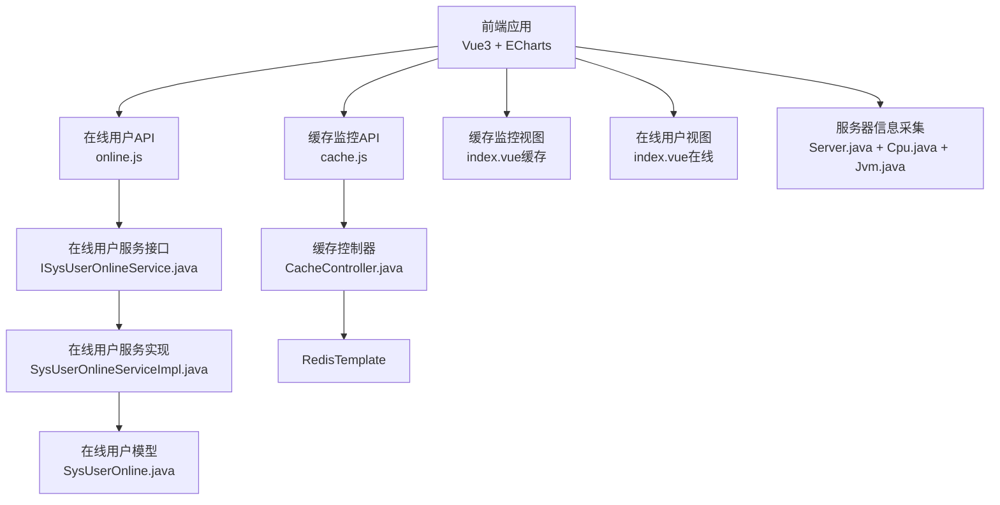
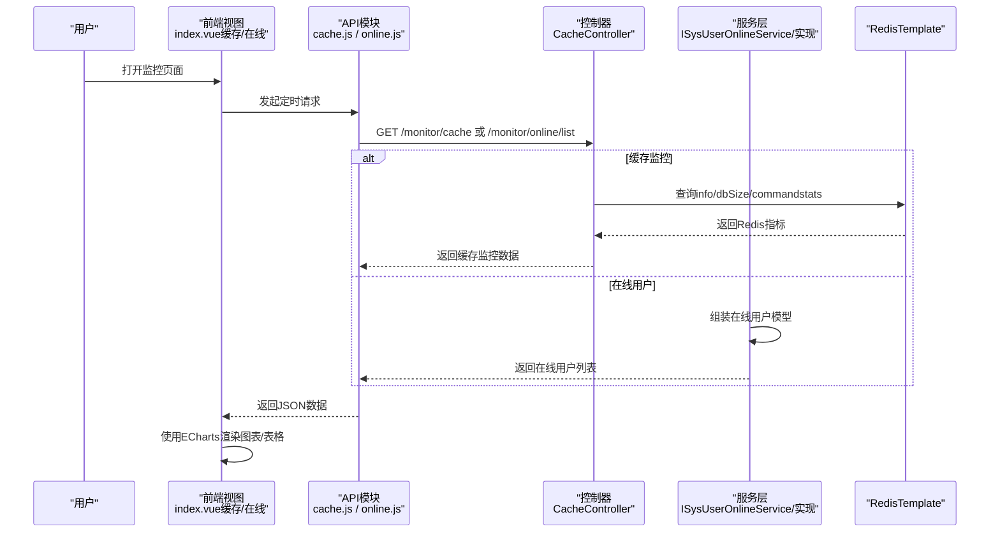
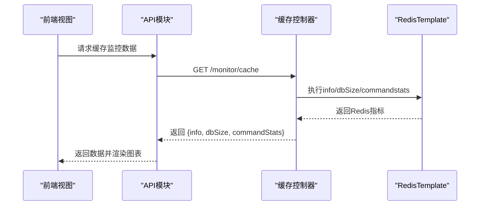
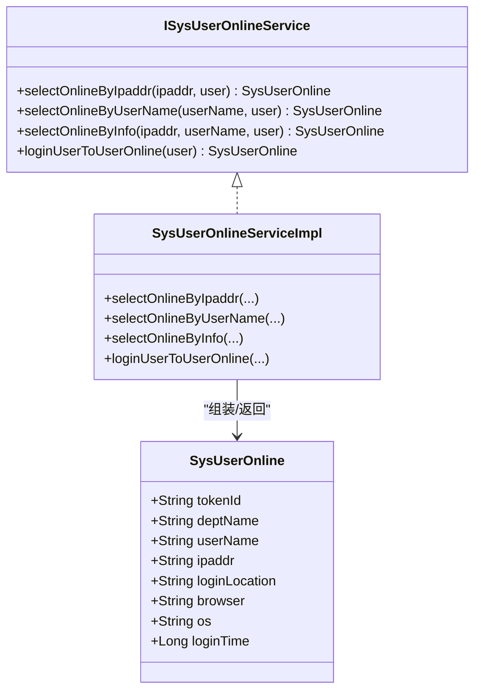
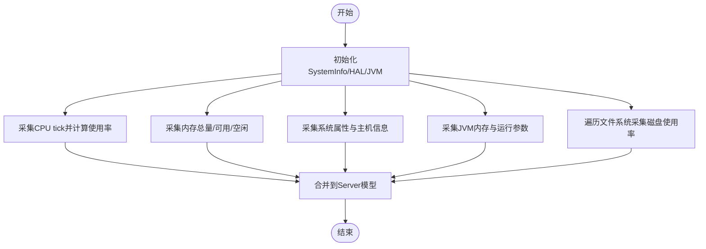
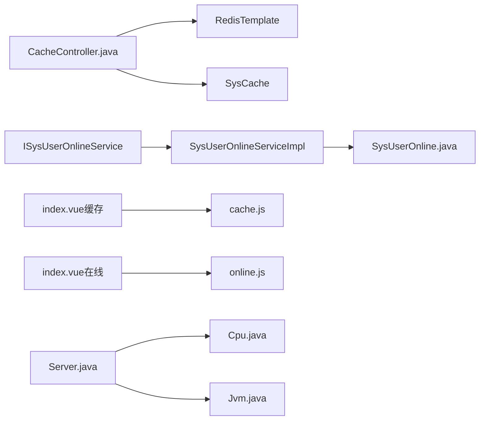

# 实时监控

<cite>
**本文引用的文件**
- [CacheController.java](file://XingChen-Vue/xingchen-admin/src/main/java/com/xingchen/web/controller/monitor/CacheController.java)
- [cache.js](file://XingChen-Vue3/src/api/monitor/cache.js)
- [index.vue（缓存监控）](file://XingChen-Vue3/src/views/monitor/cache/index.vue)
- [online.js](file://XingChen-Vue3/src/api/monitor/online.js)
- [index.vue（在线用户）](file://XingChen-Vue3/src/views/monitor/online/index.vue)
- [ISysUserOnlineService.java](file://XingChen-Vue/xingchen-system/src/main/java/com/xingchen/system/service/ISysUserOnlineService.java)
- [SysUserOnlineServiceImpl.java](file://XingChen-Vue/xingchen-system/src/main/java/com/xingchen/system/service/impl/SysUserOnlineServiceImpl.java)
- [SysUserOnline.java](file://XingChen-Vue/xingchen-system/src/main/java/com/xingchen/system/domain/SysUserOnline.java)
- [Server.java](file://XingChen-Vue/xingchen-framework/src/main/java/com/xingchen/framework/web/domain/Server.java)
- [Cpu.java](file://XingChen-Vue/xingchen-framework/src/main/java/com/xingchen/framework/web/domain/server/Cpu.java)
- [Jvm.java](file://XingChen-Vue/xingchen-framework/src/main/java/com/xingchen/framework/web/domain/server/Jvm.java)
</cite>

## 目录
1. [简介](#简介)
2. [项目结构](#项目结构)
3. [核心组件](#核心组件)
4. [架构总览](#架构总览)
5. [详细组件分析](#详细组件分析)
6. [依赖分析](#依赖分析)
7. [性能考虑](#性能考虑)
8. [故障排查指南](#故障排查指南)
9. [结论](#结论)
10. [附录](#附录)

## 简介
本技术文档围绕健康管理系统中的“实时监控”能力展开，重点覆盖以下方面：
- 在线用户监控：查询在线用户列表、按条件筛选、强制下线。
- 缓存使用情况监控：Redis基础信息、命令统计、Key数量、内存使用等可视化展示，并支持清理缓存。
- 服务器性能指标采集：基于硬件与JVM信息的CPU、内存、磁盘、系统信息采集。
- 系统负载实时跟踪：通过定时轮询获取最新指标，结合前端图表进行动态展示。
- 数据采集频率、存储策略、更新机制与展示方式：统一采用REST API拉取，前端定时刷新，ECharts渲染。
- 监控API接口设计、数据同步机制、异常处理与性能优化策略。
- 架构设计、扩展性与维护策略。

## 项目结构
监控相关模块在后端以Spring MVC控制器形式提供REST接口，在前端通过Axios封装的API模块调用，并在Vue视图中使用ECharts进行可视化展示。

**图示来源**
- [CacheController.java:1-123](file://XingChen-Vue/xingchen-admin/src/main/java/com/xingchen/web/controller/monitor/CacheController.java#L1-L123)
- [cache.js:1-58](file://XingChen-Vue3/src/api/monitor/cache.js#L1-L58)
- [online.js:1-19](file://XingChen-Vue3/src/api/monitor/online.js#L1-L19)
- [ISysUserOnlineService.java:1-49](file://XingChen-Vue/xingchen-system/src/main/java/com/xingchen/system/service/ISysUserOnlineService.java#L1-L49)
- [SysUserOnlineServiceImpl.java:1-97](file://XingChen-Vue/xingchen-system/src/main/java/com/xingchen/system/service/impl/SysUserOnlineServiceImpl.java#L1-L97)
- [SysUserOnline.java:1-114](file://XingChen-Vue/xingchen-system/src/main/java/com/xingchen/system/domain/SysUserOnline.java#L1-L114)
- [index.vue（缓存监控）:1-133](file://XingChen-Vue3/src/views/monitor/cache/index.vue#L1-L133)
- [index.vue（在线用户）:1-110](file://XingChen-Vue3/src/views/monitor/online/index.vue#L1-L110)
- [Server.java:1-241](file://XingChen-Vue/xingchen-framework/src/main/java/com/xingchen/framework/web/domain/Server.java#L1-L241)
- [Cpu.java:1-102](file://XingChen-Vue/xingchen-framework/src/main/java/com/xingchen/framework/web/domain/server/Cpu.java#L1-L102)
- [Jvm.java:1-131](file://XingChen-Vue/xingchen-framework/src/main/java/com/xingchen/framework/web/domain/server/Jvm.java#L1-L131)

**章节来源**
- [CacheController.java:1-123](file://XingChen-Vue/xingchen-admin/src/main/java/com/xingchen/web/controller/monitor/CacheController.java#L1-L123)
- [cache.js:1-58](file://XingChen-Vue3/src/api/monitor/cache.js#L1-L58)
- [online.js:1-19](file://XingChen-Vue3/src/api/monitor/online.js#L1-L19)
- [index.vue（缓存监控）:1-133](file://XingChen-Vue3/src/views/monitor/cache/index.vue#L1-L133)
- [index.vue（在线用户）:1-110](file://XingChen-Vue3/src/views/monitor/online/index.vue#L1-L110)
- [ISysUserOnlineService.java:1-49](file://XingChen-Vue/xingchen-system/src/main/java/com/xingchen/system/service/ISysUserOnlineService.java#L1-L49)
- [SysUserOnlineServiceImpl.java:1-97](file://XingChen-Vue/xingchen-system/src/main/java/com/xingchen/system/service/impl/SysUserOnlineServiceImpl.java#L1-L97)
- [SysUserOnline.java:1-114](file://XingChen-Vue/xingchen-system/src/main/java/com/xingchen/system/domain/SysUserOnline.java#L1-L114)
- [Server.java:1-241](file://XingChen-Vue/xingchen-framework/src/main/java/com/xingchen/framework/web/domain/Server.java#L1-L241)
- [Cpu.java:1-102](file://XingChen-Vue/xingchen-framework/src/main/java/com/xingchen/framework/web/domain/server/Cpu.java#L1-L102)
- [Jvm.java:1-131](file://XingChen-Vue/xingchen-framework/src/main/java/com/xingchen/framework/web/domain/server/Jvm.java#L1-L131)

## 核心组件
- 缓存监控控制器：提供Redis基础信息、命令统计、Key枚举、值读取与清理等接口。
- 在线用户服务：根据登录用户上下文生成在线用户模型，支持按条件查询与强制下线。
- 服务器信息采集：通过OSHI库与JVM运行时信息采集CPU、内存、磁盘与系统信息。
- 前端API与视图：封装REST调用，定时拉取数据并使用ECharts渲染图表。

**章节来源**
- [CacheController.java:1-123](file://XingChen-Vue/xingchen-admin/src/main/java/com/xingchen/web/controller/monitor/CacheController.java#L1-L123)
- [ISysUserOnlineService.java:1-49](file://XingChen-Vue/xingchen-system/src/main/java/com/xingchen/system/service/ISysUserOnlineService.java#L1-L49)
- [SysUserOnlineServiceImpl.java:1-97](file://XingChen-Vue/xingchen-system/src/main/java/com/xingchen/system/service/impl/SysUserOnlineServiceImpl.java#L1-L97)
- [Server.java:1-241](file://XingChen-Vue/xingchen-framework/src/main/java/com/xingchen/framework/web/domain/Server.java#L1-L241)

## 架构总览
监控系统采用前后端分离架构，后端通过Spring MVC暴露REST接口，前端通过Axios发起请求，定时刷新并渲染图表。服务器指标由Server类统一采集，缓存指标由RedisTemplate直接查询。

**图示来源**
- [cache.js:1-58](file://XingChen-Vue3/src/api/monitor/cache.js#L1-L58)
- [online.js:1-19](file://XingChen-Vue3/src/api/monitor/online.js#L1-L19)
- [CacheController.java:1-123](file://XingChen-Vue/xingchen-admin/src/main/java/com/xingchen/web/controller/monitor/CacheController.java#L1-L123)
- [ISysUserOnlineService.java:1-49](file://XingChen-Vue/xingchen-system/src/main/java/com/xingchen/system/service/ISysUserOnlineService.java#L1-L49)
- [SysUserOnlineServiceImpl.java:1-97](file://XingChen-Vue/xingchen-system/src/main/java/com/xingchen/system/service/impl/SysUserOnlineServiceImpl.java#L1-L97)

## 详细组件分析

### 缓存监控组件
- 接口职责
  - 获取Redis基础信息、数据库大小、命令统计。
  - 列出预定义缓存命名空间、枚举对应Key、读取指定Key值。
  - 支持按命名空间、Key或全量清理缓存。
- 数据采集与更新
  - 后端通过RedisTemplate执行info、dbSize与keys命令，返回给前端。
  - 前端定时轮询，使用ECharts绘制命令统计饼图与内存使用仪表盘。
- 展示方式
  - 基础信息表格展示Redis版本、运行模式、端口、客户端数、运行时长、内存、CPU、Key数量、网络流量等。
  - 图表区域展示命令统计与内存使用趋势。

**图示来源**
- [cache.js:1-58](file://XingChen-Vue3/src/api/monitor/cache.js#L1-L58)
- [CacheController.java:1-123](file://XingChen-Vue/xingchen-admin/src/main/java/com/xingchen/web/controller/monitor/CacheController.java#L1-L123)

**章节来源**
- [CacheController.java:1-123](file://XingChen-Vue/xingchen-admin/src/main/java/com/xingchen/web/controller/monitor/CacheController.java#L1-L123)
- [cache.js:1-58](file://XingChen-Vue3/src/api/monitor/cache.js#L1-L58)
- [index.vue（缓存监控）:1-133](file://XingChen-Vue3/src/views/monitor/cache/index.vue#L1-L133)

### 在线用户监控组件
- 接口职责
  - 分页查询在线用户列表，支持按登录地址与用户名称筛选。
  - 强制下线指定会话。
- 数据模型
  - SysUserOnline封装tokenId、deptName、userName、ipaddr、loginLocation、browser、os、loginTime等字段。
- 服务逻辑
  - 从登录用户上下文中提取信息，组装为在线用户模型；支持按IP、用户名或二者组合匹配。

**图示来源**
- [ISysUserOnlineService.java:1-49](file://XingChen-Vue/xingchen-system/src/main/java/com/xingchen/system/service/ISysUserOnlineService.java#L1-L49)
- [SysUserOnlineServiceImpl.java:1-97](file://XingChen-Vue/xingchen-system/src/main/java/com/xingchen/system/service/impl/SysUserOnlineServiceImpl.java#L1-L97)
- [SysUserOnline.java:1-114](file://XingChen-Vue/xingchen-system/src/main/java/com/xingchen/system/domain/SysUserOnline.java#L1-L114)

**章节来源**
- [online.js:1-19](file://XingChen-Vue3/src/api/monitor/online.js#L1-L19)
- [index.vue（在线用户）:1-110](file://XingChen-Vue3/src/views/monitor/online/index.vue#L1-L110)
- [ISysUserOnlineService.java:1-49](file://XingChen-Vue/xingchen-system/src/main/java/com/xingchen/system/service/ISysUserOnlineService.java#L1-L49)
- [SysUserOnlineServiceImpl.java:1-97](file://XingChen-Vue/xingchen-system/src/main/java/com/xingchen/system/service/impl/SysUserOnlineServiceImpl.java#L1-L97)
- [SysUserOnline.java:1-114](file://XingChen-Vue/xingchen-system/src/main/java/com/xingchen/system/domain/SysUserOnline.java#L1-L114)

### 服务器性能指标采集组件
- 采集维度
  - CPU：核心数、总使用率、系统/用户/等待/空闲占比。
  - 内存：总量、已用、空闲、使用率。
  - JVM：总内存、最大可用、空闲、版本、启动/运行时间、输入参数。
  - 磁盘：挂载点、类型、总量/可用/已用、使用率。
  - 系统：主机名、IP、操作系统、架构、工作目录。
- 采集方式
  - CPU与内存：通过OSHI硬件抽象层与GlobalMemory采集。
  - JVM：通过Runtime与ManagementFactory获取。
  - 磁盘：通过OperatingSystem与FileSystem遍历文件系统。
  - 系统：通过System.getProperties与IP工具类获取。

**图示来源**
- [Server.java:1-241](file://XingChen-Vue/xingchen-framework/src/main/java/com/xingchen/framework/web/domain/Server.java#L1-L241)
- [Cpu.java:1-102](file://XingChen-Vue/xingchen-framework/src/main/java/com/xingchen/framework/web/domain/server/Cpu.java#L1-L102)
- [Jvm.java:1-131](file://XingChen-Vue/xingchen-framework/src/main/java/com/xingchen/framework/web/domain/server/Jvm.java#L1-L131)

**章节来源**
- [Server.java:1-241](file://XingChen-Vue/xingchen-framework/src/main/java/com/xingchen/framework/web/domain/Server.java#L1-L241)
- [Cpu.java:1-102](file://XingChen-Vue/xingchen-framework/src/main/java/com/xingchen/framework/web/domain/server/Cpu.java#L1-L102)
- [Jvm.java:1-131](file://XingChen-Vue/xingchen-framework/src/main/java/com/xingchen/framework/web/domain/server/Jvm.java#L1-L131)

## 依赖分析
- 控制器与服务层解耦：缓存监控控制器仅依赖RedisTemplate；在线用户控制器依赖服务接口，服务实现依赖登录用户上下文模型。
- 前后端解耦：前端通过API模块统一调用后端接口，视图负责展示与交互。
- 第三方库：服务器指标采集依赖OSHI库，前端图表依赖ECharts。

**图示来源**
- [CacheController.java:1-123](file://XingChen-Vue/xingchen-admin/src/main/java/com/xingchen/web/controller/monitor/CacheController.java#L1-L123)
- [ISysUserOnlineService.java:1-49](file://XingChen-Vue/xingchen-system/src/main/java/com/xingchen/system/service/ISysUserOnlineService.java#L1-L49)
- [SysUserOnlineServiceImpl.java:1-97](file://XingChen-Vue/xingchen-system/src/main/java/com/xingchen/system/service/impl/SysUserOnlineServiceImpl.java#L1-L97)
- [SysUserOnline.java:1-114](file://XingChen-Vue/xingchen-system/src/main/java/com/xingchen/system/domain/SysUserOnline.java#L1-L114)
- [index.vue（缓存监控）:1-133](file://XingChen-Vue3/src/views/monitor/cache/index.vue#L1-L133)
- [index.vue（在线用户）:1-110](file://XingChen-Vue3/src/views/monitor/online/index.vue#L1-L110)
- [Server.java:1-241](file://XingChen-Vue/xingchen-framework/src/main/java/com/xingchen/framework/web/domain/Server.java#L1-L241)
- [Cpu.java:1-102](file://XingChen-Vue/xingchen-framework/src/main/java/com/xingchen/framework/web/domain/server/Cpu.java#L1-L102)
- [Jvm.java:1-131](file://XingChen-Vue/xingchen-framework/src/main/java/com/xingchen/framework/web/domain/server/Jvm.java#L1-L131)

**章节来源**
- [CacheController.java:1-123](file://XingChen-Vue/xingchen-admin/src/main/java/com/xingchen/web/controller/monitor/CacheController.java#L1-L123)
- [ISysUserOnlineService.java:1-49](file://XingChen-Vue/xingchen-system/src/main/java/com/xingchen/system/service/ISysUserOnlineService.java#L1-L49)
- [SysUserOnlineServiceImpl.java:1-97](file://XingChen-Vue/xingchen-system/src/main/java/com/xingchen/system/service/impl/SysUserOnlineServiceImpl.java#L1-L97)
- [SysUserOnline.java:1-114](file://XingChen-Vue/xingchen-system/src/main/java/com/xingchen/system/domain/SysUserOnline.java#L1-L114)
- [index.vue（缓存监控）:1-133](file://XingChen-Vue3/src/views/monitor/cache/index.vue#L1-L133)
- [index.vue（在线用户）:1-110](file://XingChen-Vue3/src/views/monitor/online/index.vue#L1-L110)
- [Server.java:1-241](file://XingChen-Vue/xingchen-framework/src/main/java/com/xingchen/framework/web/domain/Server.java#L1-L241)
- [Cpu.java:1-102](file://XingChen-Vue/xingchen-framework/src/main/java/com/xingchen/framework/web/domain/server/Cpu.java#L1-L102)
- [Jvm.java:1-131](file://XingChen-Vue/xingchen-framework/src/main/java/com/xingchen/framework/web/domain/server/Jvm.java#L1-L131)

## 性能考虑
- 采集频率
  - 建议缓存监控与在线用户列表每10–30秒轮询一次，避免频繁访问Redis与数据库造成压力。
- 存储策略
  - 在线用户列表建议在后端分页查询，避免一次性返回大量数据；缓存监控数据为轻量级指标，可直接返回。
- 更新机制
  - 前端使用定时器定期请求，收到新数据后替换旧数据并重新渲染图表。
- 异常处理
  - 前端对请求失败进行提示与重试控制；后端对Redis连接异常与权限校验失败返回明确错误。
- 性能优化
  - 缓存监控接口尽量减少复杂计算，避免在接口内做深度解析；ECharts渲染在视图层进行，避免阻塞主线程。
  - 在线用户查询应配合索引与分页，避免全表扫描。

[本节为通用指导，不直接分析具体文件，故不附加“章节来源”]

## 故障排查指南
- 缓存监控无数据
  - 检查Redis服务连通性与权限；确认后端RedisTemplate配置正确。
  - 查看接口返回状态与错误信息，定位info/dbSize/keys命令执行是否异常。
- 在线用户列表为空
  - 检查登录用户上下文是否正确注入；确认服务层是否成功组装SysUserOnline。
  - 核对筛选条件（IP/用户名）是否与实际数据匹配。
- 图表不显示或渲染异常
  - 检查ECharts实例初始化与容器尺寸；确认窗口resize事件绑定是否生效。
- 权限不足
  - 确认调用接口所需的权限注解与角色授权配置是否正确。

**章节来源**
- [CacheController.java:1-123](file://XingChen-Vue/xingchen-admin/src/main/java/com/xingchen/web/controller/monitor/CacheController.java#L1-L123)
- [index.vue（缓存监控）:1-133](file://XingChen-Vue3/src/views/monitor/cache/index.vue#L1-L133)
- [index.vue（在线用户）:1-110](file://XingChen-Vue3/src/views/monitor/online/index.vue#L1-L110)

## 结论
该监控体系通过清晰的前后端分工与标准化的REST接口，实现了对在线用户、Redis缓存与服务器性能的可视化监控。通过定时轮询与ECharts渲染，满足了实时性与可读性的需求。后续可在采集频率、缓存命中率与告警联动等方面进一步增强。

[本节为总结性内容，不直接分析具体文件，故不附加“章节来源”]

## 附录

### 监控API接口清单
- 缓存监控
  - GET /monitor/cache：获取Redis基础信息、数据库大小、命令统计
  - GET /monitor/cache/getNames：获取缓存命名空间列表
  - GET /monitor/cache/getKeys/{cacheName}：按命名空间枚举Key
  - GET /monitor/cache/getValue/{cacheName}/{cacheKey}：读取指定Key值
  - DELETE /monitor/cache/clearCacheName/{cacheName}：按命名空间清理
  - DELETE /monitor/cache/clearCacheKey/{cacheKey}：按Key清理
  - DELETE /monitor/cache/clearCacheAll：清理全部缓存
- 在线用户
  - GET /monitor/online/list：分页查询在线用户列表（支持筛选）
  - DELETE /monitor/online/{tokenId}：强制下线指定会话

**章节来源**
- [cache.js:1-58](file://XingChen-Vue3/src/api/monitor/cache.js#L1-L58)
- [online.js:1-19](file://XingChen-Vue3/src/api/monitor/online.js#L1-L19)
- [CacheController.java:1-123](file://XingChen-Vue/xingchen-admin/src/main/java/com/xingchen/web/controller/monitor/CacheController.java#L1-L123)