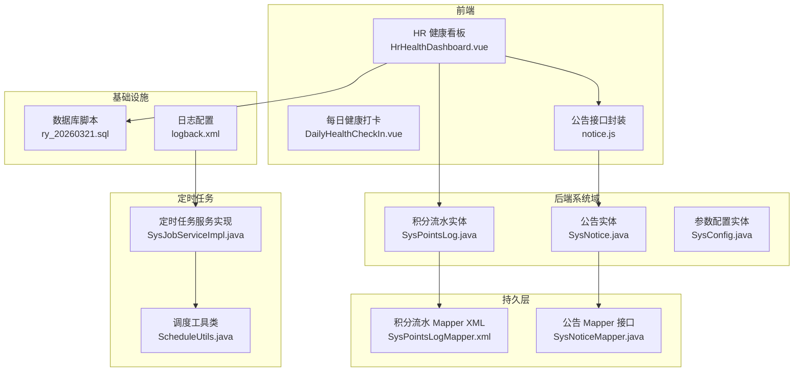
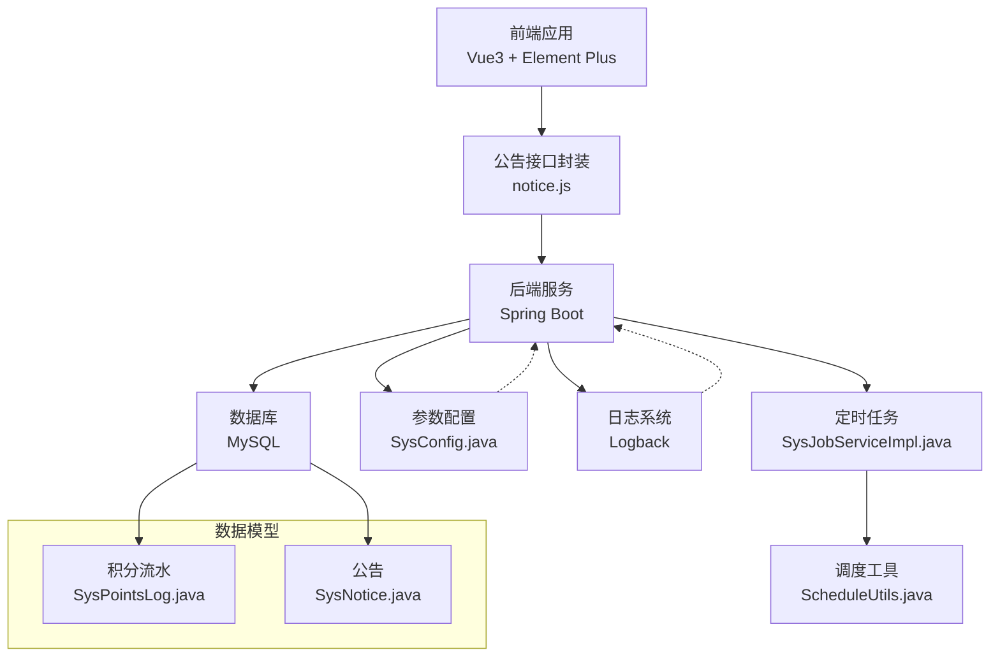
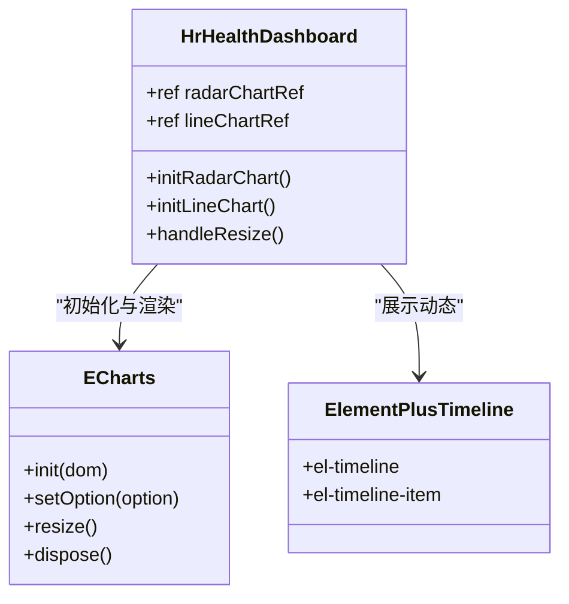
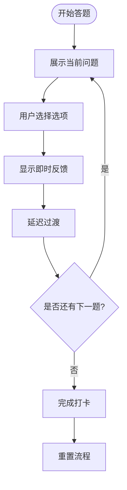
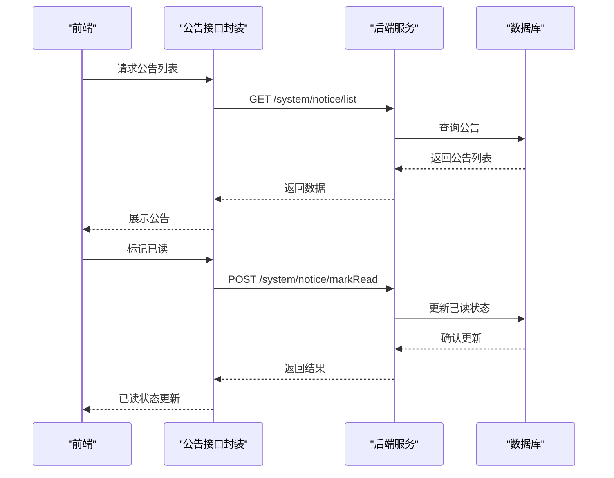
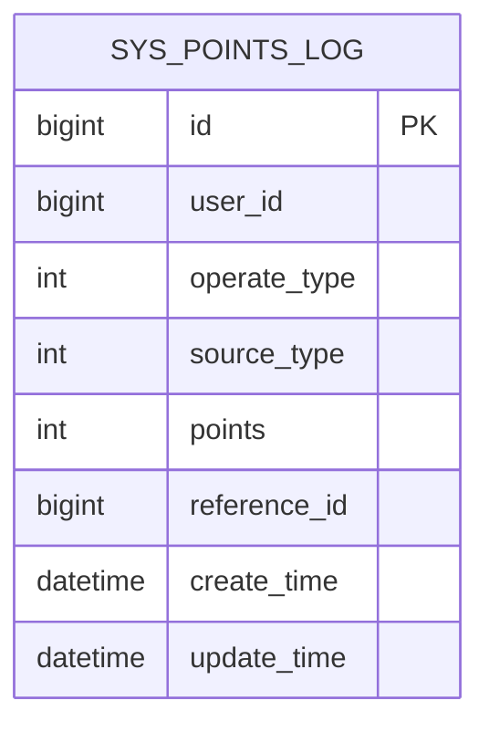
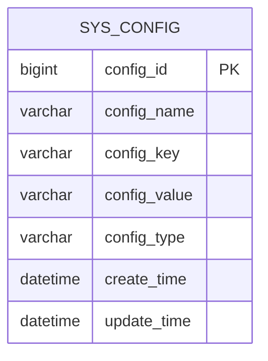
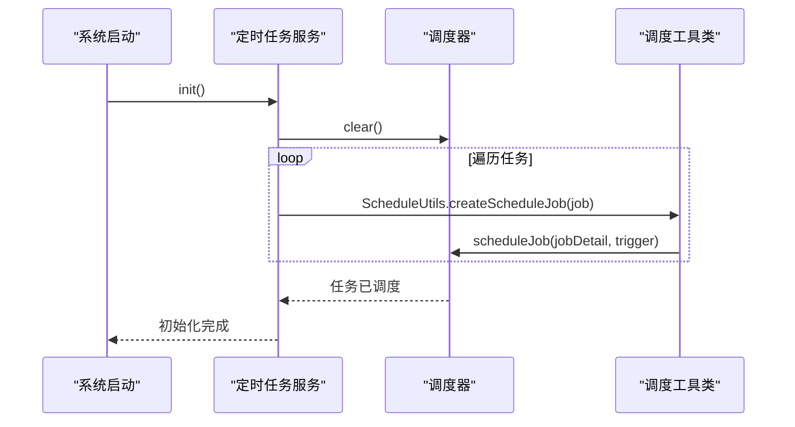
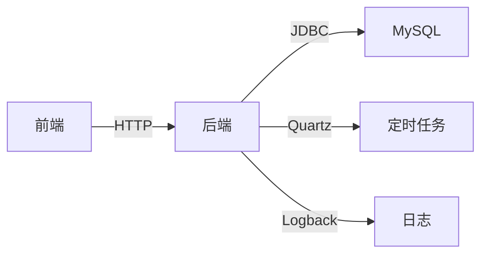

# 预警系统

<cite>
**本文引用的文件**
- [HrHealthDashboard.vue](file://XingChen-Vue3/src/views/hr/HrHealthDashboard.vue)
- [DailyHealthCheckIn.vue](file://XingChen-Vue3/src/components/DailyHealthCheckIn.vue)
- [SysPointsLog.java](file://XingChen-Vue/xingchen-system/src/main/java/com/xingchen/system/domain/SysPointsLog.java)
- [SysPointsLogMapper.xml](file://XingChen-Vue/xingchen-system/src/main/resources/mapper/system/SysPointsLogMapper.xml)
- [SysNotice.java](file://XingChen-Vue/xingchen-system/src/main/java/com/xingchen/system/domain/SysNotice.java)
- [SysNoticeMapper.java](file://XingChen-Vue/xingchen-system/src/main/java/com/xingchen/system/mapper/SysNoticeMapper.java)
- [notice.js](file://XingChen-Vue3/src/api/system/notice.js)
- [SysConfig.java](file://XingChen-Vue/xingchen-system/src/main/java/com/xingchen/system/domain/SysConfig.java)
- [SysJobServiceImpl.java](file://XingChen-Vue/xingchen-quartz/src/main/java/com/xingchen/quartz/service/impl/SysJobServiceImpl.java)
- [ScheduleUtils.java](file://XingChen-Vue/xingchen-quartz/src/main/java/com/xingchen/quartz/util/ScheduleUtils.java)
- [ry_20260321.sql](file://XingChen-Vue/sql/ry_20260321.sql)
- [logback.xml](file://XingChen-Vue/xingchen-admin/src/main/resources/logback.xml)
</cite>

## 目录
1. [简介](#简介)
2. [项目结构](#项目结构)
3. [核心组件](#核心组件)
4. [架构总览](#架构总览)
5. [详细组件分析](#详细组件分析)
6. [依赖分析](#依赖分析)
7. [性能考虑](#性能考虑)
8. [故障排查指南](#故障排查指南)
9. [结论](#结论)
10. [附录](#附录)

## 简介
本技术文档围绕健康管理系统中的预警系统展开，重点覆盖以下方面：
- 预警规则配置：参数化配置与阈值设定
- 异常检测算法：基于指标阈值与趋势的简单规则引擎
- 预警级别分类：危险、警告、成功等分级展示
- 通知机制实现：公告与系统动态联动
- 数据来源与处理流程：健康打卡、积分流水、部门健康画像
- 存储策略与展示方式：数据库表结构与前端可视化
- 历史记录管理：时间线与日志归档
- 可配置性、扩展性与业务流程集成：参数配置、定时任务与前端组件

## 项目结构
预警系统相关代码主要分布在前端视图与组件、系统领域模型与持久层、以及定时任务模块中。下图展示了关键文件之间的关系：

**图表来源**
- [HrHealthDashboard.vue:1-481](file://XingChen-Vue3/src/views/hr/HrHealthDashboard.vue#L1-L481)
- [DailyHealthCheckIn.vue:1-281](file://XingChen-Vue3/src/components/DailyHealthCheckIn.vue#L1-L281)
- [notice.js:1-70](file://XingChen-Vue3/src/api/system/notice.js#L1-L70)
- [SysPointsLog.java:1-105](file://XingChen-Vue/xingchen-system/src/main/java/com/xingchen/system/domain/SysPointsLog.java#L1-L105)
- [SysPointsLogMapper.xml:22-46](file://XingChen-Vue/xingchen-system/src/main/resources/mapper/system/SysPointsLogMapper.xml#L22-L46)
- [SysNotice.java:1-118](file://XingChen-Vue/xingchen-system/src/main/java/com/xingchen/system/domain/SysNotice.java#L1-L118)
- [SysNoticeMapper.java](file://XingChen-Vue/xingchen-system/src/main/java/com/xingchen/system/mapper/SysNoticeMapper.java)
- [SysConfig.java:1-112](file://XingChen-Vue/xingchen-system/src/main/java/com/xingchen/system/domain/SysConfig.java#L1-L112)
- [SysJobServiceImpl.java:1-40](file://XingChen-Vue/xingchen-quartz/src/main/java/com/xingchen/quartz/service/impl/SysJobServiceImpl.java#L1-L40)
- [ScheduleUtils.java:74-111](file://XingChen-Vue/xingchen-quartz/src/main/java/com/xingchen/quartz/util/ScheduleUtils.java#L74-L111)
- [ry_20260321.sql:626-645](file://XingChen-Vue/sql/ry_20260321.sql#L626-L645)
- [logback.xml:33-64](file://XingChen-Vue/xingchen-admin/src/main/resources/logback.xml#L33-L64)

**章节来源**
- [HrHealthDashboard.vue:1-481](file://XingChen-Vue3/src/views/hr/HrHealthDashboard.vue#L1-L481)
- [SysPointsLog.java:1-105](file://XingChen-Vue/xingchen-system/src/main/java/com/xingchen/system/domain/SysPointsLog.java#L1-L105)
- [SysNotice.java:1-118](file://XingChen-Vue/xingchen-system/src/main/java/com/xingchen/system/domain/SysNotice.java#L1-L118)
- [SysConfig.java:1-112](file://XingChen-Vue/xingchen-system/src/main/java/com/xingchen/system/domain/SysConfig.java#L1-L112)
- [SysJobServiceImpl.java:1-40](file://XingChen-Vue/xingchen-quartz/src/main/java/com/xingchen/quartz/service/impl/SysJobServiceImpl.java#L1-L40)
- [ScheduleUtils.java:74-111](file://XingChen-Vue/xingchen-quartz/src/main/java/com/xingchen/quartz/util/ScheduleUtils.java#L74-L111)
- [ry_20260321.sql:626-645](file://XingChen-Vue/sql/ry_20260321.sql#L626-L645)
- [logback.xml:33-64](file://XingChen-Vue/xingchen-admin/src/main/resources/logback.xml#L33-L64)

## 核心组件
- 前端预警看板：HR 健康看板负责展示异常预警部门数、高压预警人数、打卡人数等指标，并以时间线形式展示系统动态与健康异常预警。
- 健康打卡组件：每日健康打卡用于收集用户健康反馈，作为异常检测的数据输入之一。
- 公告与通知：公告实体与接口封装提供通知下发能力；前端通过接口获取公告列表与标记已读。
- 积分流水：积分流水实体记录健康行为带来的积分波动，可用于异常检测的辅助指标。
- 参数配置：系统参数配置支持阈值与规则的参数化管理。
- 定时任务：定时任务服务与调度工具类负责周期性任务的创建、暂停与执行。

**章节来源**
- [HrHealthDashboard.vue:1-481](file://XingChen-Vue3/src/views/hr/HrHealthDashboard.vue#L1-L481)
- [DailyHealthCheckIn.vue:1-281](file://XingChen-Vue3/src/components/DailyHealthCheckIn.vue#L1-L281)
- [notice.js:1-70](file://XingChen-Vue3/src/api/system/notice.js#L1-L70)
- [SysPointsLog.java:1-105](file://XingChen-Vue/xingchen-system/src/main/java/com/xingchen/system/domain/SysPointsLog.java#L1-L105)
- [SysNotice.java:1-118](file://XingChen-Vue/xingchen-system/src/main/java/com/xingchen/system/domain/SysNotice.java#L1-L118)
- [SysConfig.java:1-112](file://XingChen-Vue/xingchen-system/src/main/java/com/xingchen/system/domain/SysConfig.java#L1-L112)
- [SysJobServiceImpl.java:1-40](file://XingChen-Vue/xingchen-quartz/src/main/java/com/xingchen/quartz/service/impl/SysJobServiceImpl.java#L1-L40)
- [ScheduleUtils.java:74-111](file://XingChen-Vue/xingchen-quartz/src/main/java/com/xingchen/quartz/util/ScheduleUtils.java#L74-L111)

## 架构总览
预警系统采用前后端分离架构，前端通过接口调用后端服务，后端以实体与映射文件进行数据持久化，定时任务模块负责周期性任务的调度与执行。

**图表来源**
- [notice.js:1-70](file://XingChen-Vue3/src/api/system/notice.js#L1-L70)
- [SysConfig.java:1-112](file://XingChen-Vue/xingchen-system/src/main/java/com/xingchen/system/domain/SysConfig.java#L1-L112)
- [logback.xml:33-64](file://XingChen-Vue/xingchen-admin/src/main/resources/logback.xml#L33-L64)
- [SysJobServiceImpl.java:1-40](file://XingChen-Vue/xingchen-quartz/src/main/java/com/xingchen/quartz/service/impl/SysJobServiceImpl.java#L1-L40)
- [ScheduleUtils.java:74-111](file://XingChen-Vue/xingchen-quartz/src/main/java/com/xingchen/quartz/util/ScheduleUtils.java#L74-L111)
- [SysPointsLog.java:1-105](file://XingChen-Vue/xingchen-system/src/main/java/com/xingchen/system/domain/SysPointsLog.java#L1-L105)
- [SysNotice.java:1-118](file://XingChen-Vue/xingchen-system/src/main/java/com/xingchen/system/domain/SysNotice.java#L1-L118)

## 详细组件分析

### 前端预警看板组件分析
该组件负责展示健康预警的核心指标与实时动态，使用 ECharts 进行图表渲染，使用 Element Plus 的时间线组件展示系统动态。

**图表来源**
- [HrHealthDashboard.vue:210-365](file://XingChen-Vue3/src/views/hr/HrHealthDashboard.vue#L210-L365)

**章节来源**
- [HrHealthDashboard.vue:1-481](file://XingChen-Vue3/src/views/hr/HrHealthDashboard.vue#L1-L481)

### 健康打卡组件分析
健康打卡组件提供渐进式问答体验，收集用户的健康反馈，作为异常检测的数据输入。组件包含进度条、问题展示、选项选择与即时反馈。

**图表来源**
- [DailyHealthCheckIn.vue:106-137](file://XingChen-Vue3/src/components/DailyHealthCheckIn.vue#L106-L137)

**章节来源**
- [DailyHealthCheckIn.vue:1-281](file://XingChen-Vue3/src/components/DailyHealthCheckIn.vue#L1-L281)

### 公告与通知机制
公告实体与接口封装提供通知的增删改查与标记已读功能，前端通过接口获取首页顶部公告列表与标记已读。

**图表来源**
- [notice.js:1-70](file://XingChen-Vue3/src/api/system/notice.js#L1-L70)
- [SysNotice.java:1-118](file://XingChen-Vue/xingchen-system/src/main/java/com/xingchen/system/domain/SysNotice.java#L1-L118)

**章节来源**
- [notice.js:1-70](file://XingChen-Vue3/src/api/system/notice.js#L1-L70)
- [SysNotice.java:1-118](file://XingChen-Vue/xingchen-system/src/main/java/com/xingchen/system/domain/SysNotice.java#L1-L118)

### 积分流水与异常检测
积分流水实体记录用户健康行为带来的积分波动，可用于异常检测的辅助指标。前端看板中的“打卡人数”等指标可与积分流水关联。

**图表来源**
- [SysPointsLog.java:1-105](file://XingChen-Vue/xingchen-system/src/main/java/com/xingchen/system/domain/SysPointsLog.java#L1-L105)
- [SysPointsLogMapper.xml:22-46](file://XingChen-Vue/xingchen-system/src/main/resources/mapper/system/SysPointsLogMapper.xml#L22-L46)

**章节来源**
- [SysPointsLog.java:1-105](file://XingChen-Vue/xingchen-system/src/main/java/com/xingchen/system/domain/SysPointsLog.java#L1-L105)
- [SysPointsLogMapper.xml:22-46](file://XingChen-Vue/xingchen-system/src/main/resources/mapper/system/SysPointsLogMapper.xml#L22-L46)

### 参数配置与阈值管理
系统参数配置实体支持阈值与规则的参数化管理，便于在不修改代码的情况下调整预警阈值。

**图表来源**
- [SysConfig.java:1-112](file://XingChen-Vue/xingchen-system/src/main/java/com/xingchen/system/domain/SysConfig.java#L1-L112)

**章节来源**
- [SysConfig.java:1-112](file://XingChen-Vue/xingchen-system/src/main/java/com/xingchen/system/domain/SysConfig.java#L1-L112)

### 定时任务与调度
定时任务服务在系统启动时清理并重建定时器，调度工具类根据 Cron 表达式创建触发器，并处理误点策略。

**图表来源**
- [SysJobServiceImpl.java:34-40](file://XingChen-Vue/xingchen-quartz/src/main/java/com/xingchen/quartz/service/impl/SysJobServiceImpl.java#L34-L40)
- [ScheduleUtils.java:74-111](file://XingChen-Vue/xingchen-quartz/src/main/java/com/xingchen/quartz/util/ScheduleUtils.java#L74-L111)

**章节来源**
- [SysJobServiceImpl.java:1-40](file://XingChen-Vue/xingchen-quartz/src/main/java/com/xingchen/quartz/service/impl/SysJobServiceImpl.java#L1-L40)
- [ScheduleUtils.java:74-111](file://XingChen-Vue/xingchen-quartz/src/main/java/com/xingchen/quartz/util/ScheduleUtils.java#L74-L111)

## 依赖分析
- 前端依赖：Vue3、Element Plus、ECharts、Axios（通过封装的 notice.js 使用）。
- 后端依赖：Spring Boot、MyBatis、Quartz、Logback。
- 数据库：MySQL，包含公告与积分流水等表结构。

**图表来源**
- [notice.js:1-70](file://XingChen-Vue3/src/api/system/notice.js#L1-L70)
- [SysPointsLogMapper.xml:22-46](file://XingChen-Vue/xingchen-system/src/main/resources/mapper/system/SysPointsLogMapper.xml#L22-L46)
- [logback.xml:33-64](file://XingChen-Vue/xingchen-admin/src/main/resources/logback.xml#L33-L64)

**章节来源**
- [notice.js:1-70](file://XingChen-Vue3/src/api/system/notice.js#L1-L70)
- [SysPointsLogMapper.xml:22-46](file://XingChen-Vue/xingchen-system/src/main/resources/mapper/system/SysPointsLogMapper.xml#L22-L46)
- [logback.xml:33-64](file://XingChen-Vue/xingchen-admin/src/main/resources/logback.xml#L33-L64)

## 性能考虑
- 前端图表渲染：合理设置 ECharts 的 resize 回调，避免频繁重绘导致的性能损耗。
- 接口调用：对公告列表与标记已读等接口进行必要的缓存与节流，减少不必要的请求。
- 数据库查询：积分流水与公告查询应结合时间范围与分页，避免全表扫描。
- 日志落盘：按天滚动的日志策略有助于控制单文件大小，提升写入性能。
- 定时任务：Cron 表达式的合理性与误点策略的选择直接影响任务执行效率与准确性。

## 故障排查指南
- 公告无法显示或标记已读失败
  - 检查公告接口封装与后端控制器的连通性与返回值。
  - 核对公告实体字段与数据库表结构一致性。
- 积分流水查询异常
  - 检查查询条件与时间范围参数，确认 SQL 片段正确。
- 前端图表不显示或尺寸异常
  - 确认 ECharts 初始化与容器尺寸，监听窗口 resize 并及时调用 resize。
- 日志文件过大或未按天滚动
  - 检查 Logback 配置中的滚动策略与文件路径。
- 定时任务未执行或重复执行
  - 检查 Cron 表达式与误点策略配置，确认调度器状态。

**章节来源**
- [notice.js:1-70](file://XingChen-Vue3/src/api/system/notice.js#L1-L70)
- [SysPointsLogMapper.xml:22-46](file://XingChen-Vue/xingchen-system/src/main/resources/mapper/system/SysPointsLogMapper.xml#L22-L46)
- [HrHealthDashboard.vue:342-365](file://XingChen-Vue3/src/views/hr/HrHealthDashboard.vue#L342-L365)
- [logback.xml:33-64](file://XingChen-Vue/xingchen-admin/src/main/resources/logback.xml#L33-L64)
- [ScheduleUtils.java:74-111](file://XingChen-Vue/xingchen-quartz/src/main/java/com/xingchen/quartz/util/ScheduleUtils.java#L74-L111)

## 结论
本预警系统通过参数化配置与前端可视化相结合的方式，实现了健康异常的监控与通知。系统具备良好的可配置性与扩展性，能够通过参数调整阈值、通过组件扩展检测维度，并通过定时任务实现周期性处理。后续可在现有基础上引入更复杂的异常检测算法与多维指标分析，进一步提升预警的准确性与智能化水平。

## 附录
- 数据库表结构参考
  - 公告表：包含公告标题、类型、内容、状态等字段。
  - 积分流水表：包含用户 ID、操作类型、来源类型、波动分值、业务关联 ID 等字段。

**章节来源**
- [ry_20260321.sql:626-645](file://XingChen-Vue/sql/ry_20260321.sql#L626-L645)
- [SysPointsLog.java:1-105](file://XingChen-Vue/xingchen-system/src/main/java/com/xingchen/system/domain/SysPointsLog.java#L1-L105)
- [SysNotice.java:1-118](file://XingChen-Vue/xingchen-system/src/main/java/com/xingchen/system/domain/SysNotice.java#L1-L118)