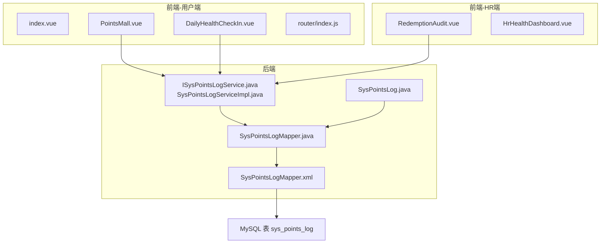
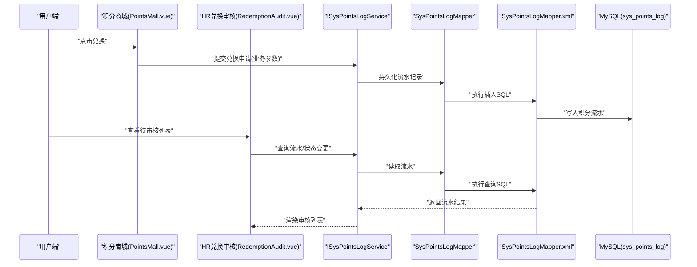
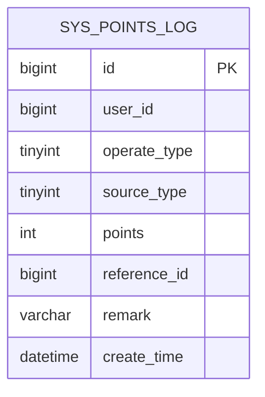
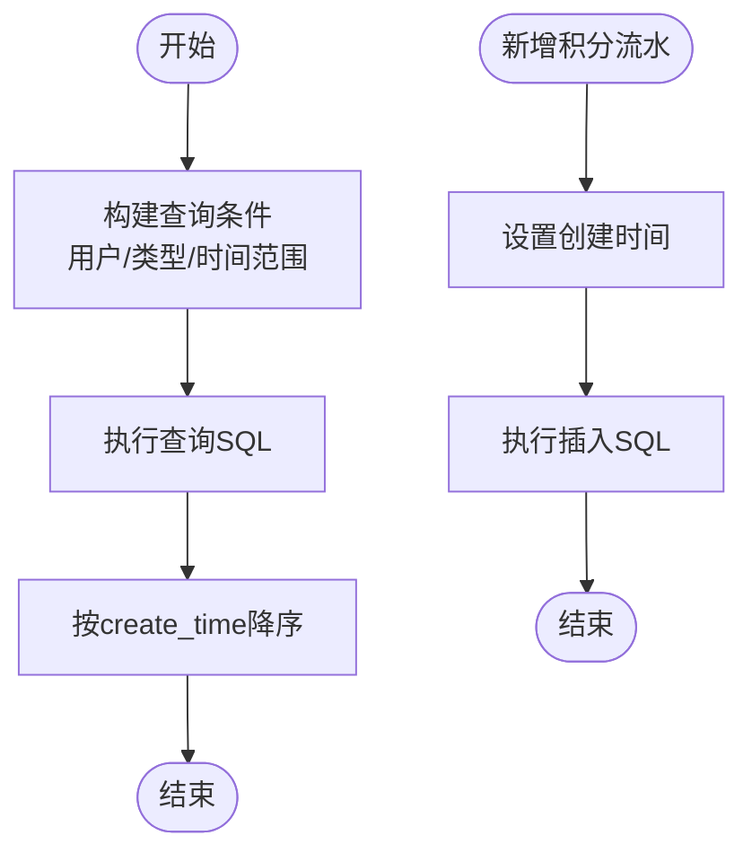
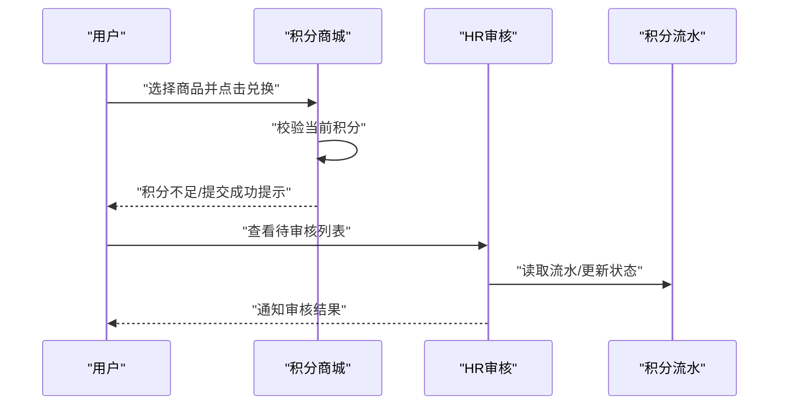
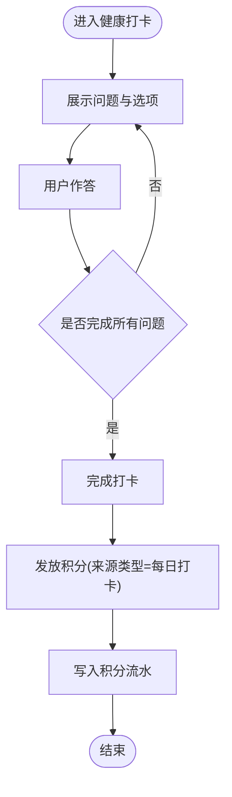
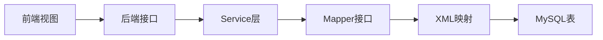

# 健康积分系统

<cite>
**本文引用的文件**
- [SysPointsLog.java](file://XingChen-Vue/xingchen-system/src/main/java/com/xingchen/system/domain/SysPointsLog.java)
- [SysPointsLogMapper.java](file://XingChen-Vue/xingchen-system/src/main/java/com/xingchen/system/mapper/SysPointsLogMapper.java)
- [SysPointsLogMapper.xml](file://XingChen-Vue/xingchen-system/src/main/resources/mapper/system/SysPointsLogMapper.xml)
- [ISysPointsLogService.java](file://XingChen-Vue/xingchen-system/src/main/java/com/xingchen/system/service/ISysPointsLogService.java)
- [SysPointsLogServiceImpl.java](file://XingChen-Vue/xingchen-system/src/main/java/com/xingchen/system/service/impl/SysPointsLogServiceImpl.java)
- [points_log.sql](file://XingChen-Vue/sql/points_log.sql)
- [PointsMall.vue](file://XingChen-Vue/xingchen-ui-user/src/views/PointsMall.vue)
- [DailyHealthCheckIn.vue](file://XingChen-Vue/xingchen-ui-user/src/components/DailyHealthCheckIn.vue)
- [index.vue](file://XingChen-Vue/xingchen-ui-user/src/views/index.vue)
- [RedemptionAudit.vue](file://XingChen-Vue3/src/views/hr/RedemptionAudit.vue)
- [HrHealthDashboard.vue](file://XingChen-Vue3/src/views/hr/HrHealthDashboard.vue)
- [index.js](file://XingChen-Vue/xingchen-ui-user/src/router/index.js)
</cite>

## 目录
1. [简介](#简介)
2. [项目结构](#项目结构)
3. [核心组件](#核心组件)
4. [架构总览](#架构总览)
5. [详细组件分析](#详细组件分析)
6. [依赖分析](#依赖分析)
7. [性能考虑](#性能考虑)
8. [故障排查指南](#故障排查指南)
9. [结论](#结论)
10. [附录](#附录)

## 简介
本文件面向“健康积分系统”的完整技术文档，覆盖积分规则设计、积分流水管理、兑换机制实现、数据库表结构设计、API接口设计、事务处理与并发控制、数据一致性保障、统计报表与预警机制，以及业务场景示例与扩展开发指导。系统采用前后端分离架构，后端基于Spring Boot与MyBatis，前端使用Vue生态，积分流水以“sys_points_log”为核心数据实体，支持按场景来源与操作类型进行严格追踪。

## 项目结构
系统主要由以下模块构成：
- 后端工程：xingchen-system（领域模型、Mapper、Service、XML映射）
- 前端工程（用户端）：xingchen-ui-user（路由、视图、组件）
- 前端工程（管理端）：XingChen-Vue3（HR相关视图与组件）
- 数据库脚本：sql目录下的points_log.sql

图表来源
- [SysPointsLog.java:1-105](file://XingChen-Vue/xingchen-system/src/main/java/com/xingchen/system/domain/SysPointsLog.java#L1-L105)
- [SysPointsLogMapper.java:1-61](file://XingChen-Vue/xingchen-system/src/main/java/com/xingchen/system/mapper/SysPointsLogMapper.java#L1-L61)
- [SysPointsLogMapper.xml:1-92](file://XingChen-Vue/xingchen-system/src/main/resources/mapper/system/SysPointsLogMapper.xml#L1-L92)
- [ISysPointsLogService.java:1-61](file://XingChen-Vue/xingchen-system/src/main/java/com/xingchen/system/service/ISysPointsLogService.java#L1-L61)
- [SysPointsLogServiceImpl.java:1-95](file://XingChen-Vue/xingchen-system/src/main/java/com/xingchen/system/service/impl/SysPointsLogServiceImpl.java#L1-L95)
- [points_log.sql:1-18](file://XingChen-Vue/sql/points_log.sql#L1-L18)
- [PointsMall.vue:1-378](file://XingChen-Vue/xingchen-ui-user/src/views/PointsMall.vue#L1-L378)
- [DailyHealthCheckIn.vue:1-81](file://XingChen-Vue/xingchen-ui-user/src/components/DailyHealthCheckIn.vue#L1-L81)
- [index.vue:32-66](file://XingChen-Vue/xingchen-ui-user/src/views/index.vue#L32-L66)
- [RedemptionAudit.vue:1-146](file://XingChen-Vue3/src/views/hr/RedemptionAudit.vue#L1-L146)
- [HrHealthDashboard.vue:138-154](file://XingChen-Vue3/src/views/hr/HrHealthDashboard.vue#L138-L154)
- [index.js:1-48](file://XingChen-Vue/xingchen-ui-user/src/router/index.js#L1-L48)

章节来源
- [SysPointsLog.java:1-105](file://XingChen-Vue/xingchen-system/src/main/java/com/xingchen/system/domain/SysPointsLog.java#L1-L105)
- [SysPointsLogMapper.java:1-61](file://XingChen-Vue/xingchen-system/src/main/java/com/xingchen/system/mapper/SysPointsLogMapper.java#L1-L61)
- [SysPointsLogMapper.xml:1-92](file://XingChen-Vue/xingchen-system/src/main/resources/mapper/system/SysPointsLogMapper.xml#L1-L92)
- [ISysPointsLogService.java:1-61](file://XingChen-Vue/xingchen-system/src/main/java/com/xingchen/system/service/ISysPointsLogService.java#L1-L61)
- [SysPointsLogServiceImpl.java:1-95](file://XingChen-Vue/xingchen-system/src/main/java/com/xingchen/system/service/impl/SysPointsLogServiceImpl.java#L1-L95)
- [points_log.sql:1-18](file://XingChen-Vue/sql/points_log.sql#L1-L18)
- [PointsMall.vue:1-378](file://XingChen-Vue/xingchen-ui-user/src/views/PointsMall.vue#L1-L378)
- [DailyHealthCheckIn.vue:1-81](file://XingChen-Vue/xingchen-ui-user/src/components/DailyHealthCheckIn.vue#L1-L81)
- [index.vue:32-66](file://XingChen-Vue/xingchen-ui-user/src/views/index.vue#L32-L66)
- [RedemptionAudit.vue:1-146](file://XingChen-Vue3/src/views/hr/RedemptionAudit.vue#L1-L146)
- [HrHealthDashboard.vue:138-154](file://XingChen-Vue3/src/views/hr/HrHealthDashboard.vue#L138-L154)
- [index.js:1-48](file://XingChen-Vue/xingchen-ui-user/src/router/index.js#L1-L48)

## 核心组件
- 数据模型：SysPointsLog（积分流水实体），包含用户ID、操作类型（收入/支出）、来源类型（打卡/连续奖励/兑换/HR退还）、波动分值、业务关联ID等字段。
- 数据访问：SysPointsLogMapper接口与SysPointsLogMapper.xml映射文件，提供查询、新增、更新、删除能力，并内置按时间范围、用户、来源、操作类型等条件的动态SQL。
- 服务层：ISysPointsLogService接口与SysPointsLogServiceImpl实现类，负责业务编排与时间戳设置。
- 前端视图：
  - 用户端：积分商城（PointsMall.vue）、健康打卡组件（DailyHealthCheckIn.vue）、首页（index.vue）。
  - HR端：兑换审核（RedemptionAudit.vue）、健康仪表盘（HrHealthDashboard.vue）。
- 路由：用户端路由配置（router/index.js）确保受保护页面的鉴权跳转。

章节来源
- [SysPointsLog.java:1-105](file://XingChen-Vue/xingchen-system/src/main/java/com/xingchen/system/domain/SysPointsLog.java#L1-L105)
- [SysPointsLogMapper.java:1-61](file://XingChen-Vue/xingchen-system/src/main/java/com/xingchen/system/mapper/SysPointsLogMapper.java#L1-L61)
- [SysPointsLogMapper.xml:1-92](file://XingChen-Vue/xingchen-system/src/main/resources/mapper/system/SysPointsLogMapper.xml#L1-L92)
- [ISysPointsLogService.java:1-61](file://XingChen-Vue/xingchen-system/src/main/java/com/xingchen/system/service/ISysPointsLogService.java#L1-L61)
- [SysPointsLogServiceImpl.java:1-95](file://XingChen-Vue/xingchen-system/src/main/java/com/xingchen/system/service/impl/SysPointsLogServiceImpl.java#L1-L95)
- [PointsMall.vue:1-378](file://XingChen-Vue/xingchen-ui-user/src/views/PointsMall.vue#L1-L378)
- [DailyHealthCheckIn.vue:1-81](file://XingChen-Vue/xingchen-ui-user/src/components/DailyHealthCheckIn.vue#L1-L81)
- [index.vue:32-66](file://XingChen-Vue/xingchen-ui-user/src/views/index.vue#L32-L66)
- [RedemptionAudit.vue:1-146](file://XingChen-Vue3/src/views/hr/RedemptionAudit.vue#L1-L146)
- [HrHealthDashboard.vue:138-154](file://XingChen-Vue3/src/views/hr/HrHealthDashboard.vue#L138-L154)
- [index.js:1-48](file://XingChen-Vue/xingchen-ui-user/src/router/index.js#L1-L48)

## 架构总览
系统采用经典的三层架构：表现层（Vue前端）、业务层（Spring Service）、数据访问层（MyBatis Mapper/XML）。积分流水作为核心实体贯穿所有流程，从用户行为触发（如每日打卡、兑换申请）到HR审核，再到流水落库，形成闭环。

图表来源
- [PointsMall.vue:138-165](file://XingChen-Vue/xingchen-ui-user/src/views/PointsMall.vue#L138-L165)
- [RedemptionAudit.vue:89-146](file://XingChen-Vue3/src/views/hr/RedemptionAudit.vue#L89-L146)
- [ISysPointsLogService.java:1-61](file://XingChen-Vue/xingchen-system/src/main/java/com/xingchen/system/service/ISysPointsLogService.java#L1-L61)
- [SysPointsLogMapper.java:1-61](file://XingChen-Vue/xingchen-system/src/main/java/com/xingchen/system/mapper/SysPointsLogMapper.java#L1-L61)
- [SysPointsLogMapper.xml:45-80](file://XingChen-Vue/xingchen-system/src/main/resources/mapper/system/SysPointsLogMapper.xml#L45-L80)
- [points_log.sql:4-17](file://XingChen-Vue/sql/points_log.sql#L4-L17)

## 详细组件分析

### 数据模型与表结构
- 实体字段：id、user_id、operate_type、source_type、points、reference_id、remark、create_time。
- 字段语义：
  - operate_type：1=收入（加分），2=支出（扣分）
  - source_type：1=每日打卡，2=连续打卡奖励，3=兑换商品消耗，4=HR手动退还积分
- 索引设计：对user_id与reference_id建立索引，提升查询效率。
- 时间维度：create_time默认当前时间，支持按日期格式化过滤。

图表来源
- [points_log.sql:4-17](file://XingChen-Vue/sql/points_log.sql#L4-L17)
- [SysPointsLog.java:15-36](file://XingChen-Vue/xingchen-system/src/main/java/com/xingchen/system/domain/SysPointsLog.java#L15-L36)

章节来源
- [points_log.sql:1-18](file://XingChen-Vue/sql/points_log.sql#L1-L18)
- [SysPointsLog.java:1-105](file://XingChen-Vue/xingchen-system/src/main/java/com/xingchen/system/domain/SysPointsLog.java#L1-L105)

### 积分流水管理（查询与新增）
- 查询：支持按用户ID、操作类型、来源类型、分值、业务关联ID及时间范围过滤；默认按创建时间倒序。
- 新增：服务层统一设置创建时间，Mapper执行插入，返回自增主键。

图表来源
- [SysPointsLogMapper.xml:22-38](file://XingChen-Vue/xingchen-system/src/main/resources/mapper/system/SysPointsLogMapper.xml#L22-L38)
- [SysPointsLogServiceImpl.java:52-57](file://XingChen-Vue/xingchen-system/src/main/java/com/xingchen/system/service/impl/SysPointsLogServiceImpl.java#L52-L57)

章节来源
- [SysPointsLogMapper.xml:18-38](file://XingChen-Vue/xingchen-system/src/main/resources/mapper/system/SysPointsLogMapper.xml#L18-L38)
- [SysPointsLogServiceImpl.java:1-95](file://XingChen-Vue/xingchen-system/src/main/java/com/xingchen/system/service/impl/SysPointsLogServiceImpl.java#L1-L95)

### 兑换机制实现
- 用户端：积分商城页面展示商品、价格与兑换按钮；点击后弹出确认框，校验当前积分是否足够，若足够则提示等待HR审核。
- HR端：兑换审核页面展示待审核列表，支持按状态筛选，提供通过/驳回操作。
- 流程要点：前端仅提交兑换申请，实际扣减与状态流转由HR审核流程驱动，系统通过流水记录体现变化。

图表来源
- [PointsMall.vue:138-165](file://XingChen-Vue/xingchen-ui-user/src/views/PointsMall.vue#L138-L165)
- [RedemptionAudit.vue:89-146](file://XingChen-Vue3/src/views/hr/RedemptionAudit.vue#L89-L146)

章节来源
- [PointsMall.vue:1-378](file://XingChen-Vue/xingchen-ui-user/src/views/PointsMall.vue#L1-L378)
- [RedemptionAudit.vue:1-146](file://XingChen-Vue3/src/views/hr/RedemptionAudit.vue#L1-L146)

### 健康打卡与积分获取
- 健康打卡组件提供渐进式问答体验，完成后展示“完成打卡”结果。
- 规则说明：每日完成健康打卡可获得固定积分（例如10分），具体数值可在业务规则中定义并在流水来源类型中体现。

图表来源
- [DailyHealthCheckIn.vue:1-81](file://XingChen-Vue/xingchen-ui-user/src/components/DailyHealthCheckIn.vue#L1-L81)
- [SysPointsLog.java:26-28](file://XingChen-Vue/xingchen-system/src/main/java/com/xingchen/system/domain/SysPointsLog.java#L26-L28)

章节来源
- [DailyHealthCheckIn.vue:1-81](file://XingChen-Vue/xingchen-ui-user/src/components/DailyHealthCheckIn.vue#L1-L81)
- [index.vue:32-66](file://XingChen-Vue/xingchen-ui-user/src/views/index.vue#L32-L66)

### API接口设计（后端）
- 接口职责：围绕SysPointsLog提供标准CRUD能力，供前端调用。
- 关键接口：
  - 新增：insertSysPointsLog（自动设置创建时间）
  - 查询：selectSysPointsLogList（支持多条件过滤）
  - 更新/删除：updateSysPointsLog、deleteSysPointsLogById(s)
- 参数与返回：遵循Spring MVC与MyBatis约定，返回影响行数或实体集合。

章节来源
- [ISysPointsLogService.java:11-60](file://XingChen-Vue/xingchen-system/src/main/java/com/xingchen/system/service/ISysPointsLogService.java#L11-L60)
- [SysPointsLogMapper.java:11-60](file://XingChen-Vue/xingchen-system/src/main/java/com/xingchen/system/mapper/SysPointsLogMapper.java#L11-L60)
- [SysPointsLogMapper.xml:22-91](file://XingChen-Vue/xingchen-system/src/main/resources/mapper/system/SysPointsLogMapper.xml#L22-L91)

### 事务处理机制与并发控制
- 事务：建议在业务方法（如兑换审核）上使用@Transactional，确保流水写入与状态更新原子性。
- 并发控制：
  - 使用数据库唯一索引（如业务关联ID）避免重复兑付。
  - 对关键写入操作加锁（如悲观锁SELECT ... FOR UPDATE或乐观锁版本号）。
  - 前端幂等：提交按钮禁用、重复提交拦截。
- 数据一致性：
  - 通过流水表记录所有积分波动，保证可追溯。
  - 业务关联ID（reference_id）用于跨表关联与审计。

章节来源
- [SysPointsLogMapper.xml:14-16](file://XingChen-Vue/xingchen-system/src/main/resources/mapper/system/SysPointsLogMapper.xml#L14-L16)
- [SysPointsLog.java:34-36](file://XingChen-Vue/xingchen-system/src/main/java/com/xingchen/system/domain/SysPointsLog.java#L34-L36)

### 统计报表与预警机制
- 统计维度：按部门、人员、来源类型、时间区间统计积分流入流出、兑换数量与金额。
- 前端展示：HR健康仪表盘可展示平均健康评分、高风险部门与用户数量等指标。
- 预警规则：当某部门/用户连续未打卡或积分异常波动时触发告警（可在HR审核与报表中体现）。

章节来源
- [HrHealthDashboard.vue:138-154](file://XingChen-Vue3/src/views/hr/HrHealthDashboard.vue#L138-L154)
- [RedemptionAudit.vue:89-146](file://XingChen-Vue3/src/views/hr/RedemptionAudit.vue#L89-L146)

### 业务场景示例
- 场景一：每日健康打卡
  - 来源类型：每日打卡
  - 操作类型：收入（加分）
  - 分值：固定数值（如10分）
  - 记录：写入流水，reference_id可指向打卡记录ID
- 场景二：连续打卡奖励
  - 来源类型：连续打卡奖励
  - 操作类型：收入（加分）
  - 分值：阶梯奖励（如7天连续+50分）
- 场景三：积分兑换
  - 来源类型：兑换商品消耗
  - 操作类型：支出（扣分）
  - 分值：商品所需积分
  - 流程：用户提交→HR审核→通过后扣分→记录流水
- 场景四：HR手动退还
  - 来源类型：HR手动退还积分
  - 操作类型：收入（加分）
  - 说明：remark记录退还原因

章节来源
- [SysPointsLog.java:22-28](file://XingChen-Vue/xingchen-system/src/main/java/com/xingchen/system/domain/SysPointsLog.java#L22-L28)
- [PointsMall.vue:138-165](file://XingChen-Vue/xingchen-ui-user/src/views/PointsMall.vue#L138-L165)
- [RedemptionAudit.vue:89-146](file://XingChen-Vue3/src/views/hr/RedemptionAudit.vue#L89-L146)

### 扩展开发指导
- 新增来源类型：在枚举或常量中扩展source_type，前端与后端同步更新。
- 新增业务关联：为reference_id设计对应业务表，确保可审计与可追踪。
- 报表与分析：基于流水表按月/周聚合，结合HR端仪表盘展示。
- 安全与权限：路由守卫与后端权限注解双重保障，防止未授权访问。

## 依赖分析
- 组件耦合：
  - Service依赖Mapper，Mapper依赖XML与数据库。
  - 前端视图通过HTTP请求与后端交互，路由控制访问权限。
- 外部依赖：
  - MySQL：存储积分流水与索引优化。
  - Vue生态：Element Plus、路由与状态管理。
- 潜在风险：
  - 前端仅做申请，扣减与状态变更需在HR流程中实现，避免数据不一致。
  - 高并发下需加强锁与幂等设计。

图表来源
- [SysPointsLogMapper.xml:1-92](file://XingChen-Vue/xingchen-system/src/main/resources/mapper/system/SysPointsLogMapper.xml#L1-L92)
- [SysPointsLogMapper.java:1-61](file://XingChen-Vue/xingchen-system/src/main/java/com/xingchen/system/mapper/SysPointsLogMapper.java#L1-L61)
- [ISysPointsLogService.java:1-61](file://XingChen-Vue/xingchen-system/src/main/java/com/xingchen/system/service/ISysPointsLogService.java#L1-L61)

章节来源
- [index.js:1-48](file://XingChen-Vue/xingchen-ui-user/src/router/index.js#L1-L48)

## 性能考虑
- 索引优化：user_id与reference_id索引有助于高频查询；按日期范围查询使用date_format函数，建议在大数据量时考虑分区或冗余日期列。
- SQL优化：动态WHERE条件已支持多字段过滤，建议结合慢查询日志与执行计划持续优化。
- 缓存策略：对热门报表数据可引入Redis缓存，设置合理TTL。
- 并发优化：兑换审核等关键路径使用分布式锁或数据库锁，避免超卖与重复兑付。

## 故障排查指南
- 常见问题
  - 兑换失败：检查用户积分余额与商品所需积分；确认HR审核状态。
  - 查询不到流水：核对查询条件（用户ID、时间范围、来源类型）。
  - 重复兑付：检查业务关联ID是否唯一，必要时添加唯一约束。
- 日志与监控
  - 后端：开启SQL日志与慢查询日志，定位性能瓶颈。
  - 前端：捕获网络错误与异常消息，提示用户重试或联系管理员。
- 回滚与修复
  - 对于误操作，可通过反向流水（来源类型=HR手动退还）进行修正。

章节来源
- [SysPointsLogMapper.xml:22-38](file://XingChen-Vue/xingchen-system/src/main/resources/mapper/system/SysPointsLogMapper.xml#L22-L38)
- [RedemptionAudit.vue:89-146](file://XingChen-Vue3/src/views/hr/RedemptionAudit.vue#L89-L146)

## 结论
健康积分系统以“sys_points_log”为核心，实现了从健康打卡到积分兑换的完整闭环。通过清晰的来源类型与操作类型设计、完善的流水记录与查询能力、以及HR审核流程，系统在保证数据一致性的同时，提供了良好的用户体验与可扩展性。后续可在报表分析、风控预警与性能优化方面持续增强。

## 附录
- 快速参考
  - 表结构：points_log.sql
  - 实体模型：SysPointsLog.java
  - 数据访问：SysPointsLogMapper.java、SysPointsLogMapper.xml
  - 服务接口：ISysPointsLogService.java、SysPointsLogServiceImpl.java
  - 前端视图：PointsMall.vue、DailyHealthCheckIn.vue、RedemptionAudit.vue、HrHealthDashboard.vue、index.vue
  - 路由配置：router/index.js