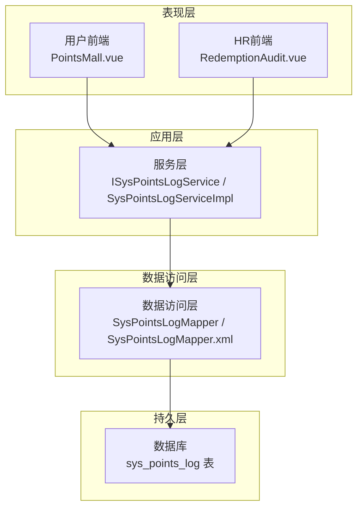
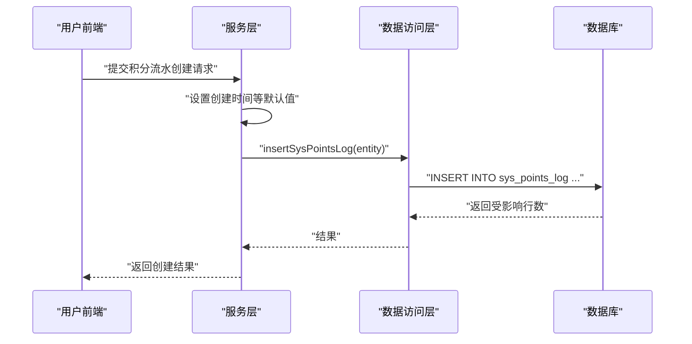
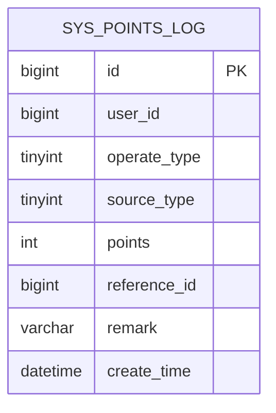
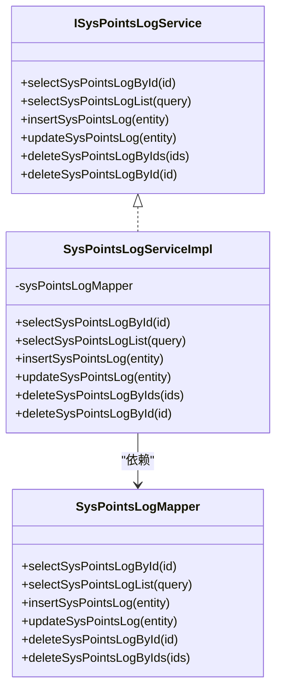
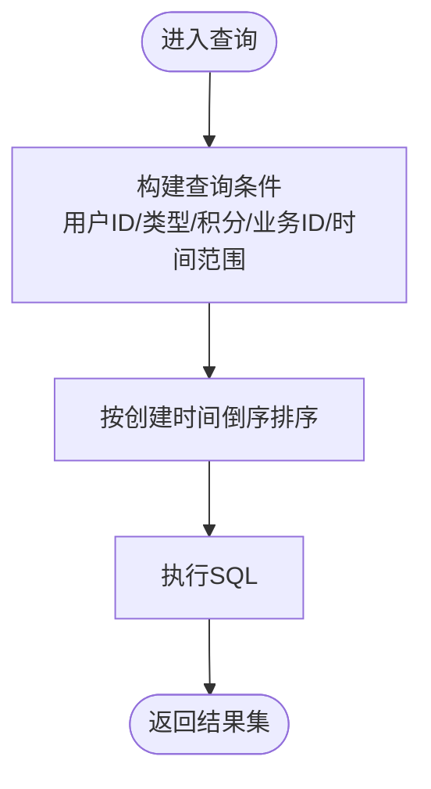
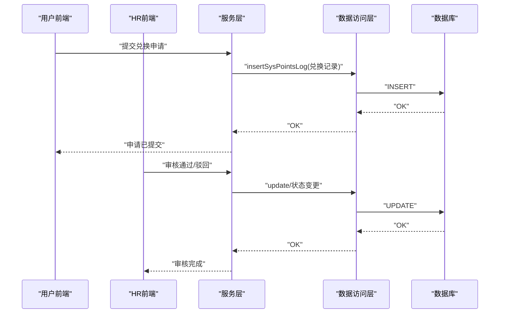
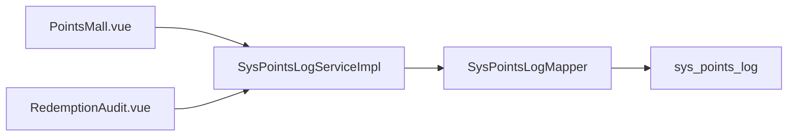

# 积分交易管理

<cite>
**本文引用的文件**
- [SysPointsLog.java](file://XingChen-Vue/xingchen-system/src/main/java/com/xingchen/system/domain/SysPointsLog.java)
- [ISysPointsLogService.java](file://XingChen-Vue/xingchen-system/src/main/java/com/xingchen/system/service/ISysPointsLogService.java)
- [SysPointsLogServiceImpl.java](file://XingChen-Vue/xingchen-system/src/main/java/com/xingchen/system/service/impl/SysPointsLogServiceImpl.java)
- [SysPointsLogMapper.java](file://XingChen-Vue/xingchen-system/src/main/java/com/xingchen/system/mapper/SysPointsLogMapper.java)
- [SysPointsLogMapper.xml](file://XingChen-Vue/xingchen-system/src/main/resources/mapper/system/SysPointsLogMapper.xml)
- [points_log.sql](file://XingChen-Vue/sql/points_log.sql)
- [PointsMall.vue](file://XingChen-Vue/xingchen-ui-user/src/views/PointsMall.vue)
- [RedemptionAudit.vue](file://XingChen-Vue3/src/views/hr/RedemptionAudit.vue)
- [Arith.java](file://XingChen-Vue/xingchen-common/src/main/java/com/xingchen/common/utils/Arith.java)
</cite>

## 目录
1. [简介](#简介)
2. [项目结构](#项目结构)
3. [核心组件](#核心组件)
4. [架构总览](#架构总览)
5. [详细组件分析](#详细组件分析)
6. [依赖关系分析](#依赖关系分析)
7. [性能考量](#性能考量)
8. [故障排查指南](#故障排查指南)
9. [结论](#结论)
10. [附录](#附录)

## 简介
本文件面向“积分交易管理”模块，系统化梳理积分流水记录的创建、查询、更新与删除流程；解释事务处理、并发控制与数据一致性保障；给出积分变动的原子性、回滚与异常处理路径；并提供积分账户余额计算、实时更新与缓存策略建议。同时，文档化积分交易相关API接口设计、参数校验与错误码定义，并附上可定位到源码位置的参考路径与性能优化建议。

## 项目结构
围绕积分交易管理的核心文件组织如下：
- 领域模型：SysPointsLog 实体类
- 服务层：ISysPointsLogService 接口与 SysPointsLogServiceImpl 实现
- 数据访问层：SysPointsLogMapper 接口与 SysPointsLogMapper.xml 映射
- 数据库脚本：points_log.sql 定义积分流水表结构
- 前端交互：PointsMall.vue（用户积分商城）、RedemptionAudit.vue（HR审核）
- 数值工具：Arith.java（高精度数值运算）

图表来源
- [SysPointsLogServiceImpl.java:1-94](file://XingChen-Vue/xingchen-system/src/main/java/com/xingchen/system/service/impl/SysPointsLogServiceImpl.java#L1-L94)
- [SysPointsLogMapper.xml:1-92](file://XingChen-Vue/xingchen-system/src/main/resources/mapper/system/SysPointsLogMapper.xml#L1-L92)
- [points_log.sql:1-18](file://XingChen-Vue/sql/points_log.sql#L1-L18)

章节来源
- [SysPointsLog.java:1-105](file://XingChen-Vue/xingchen-system/src/main/java/com/xingchen/system/domain/SysPointsLog.java#L1-L105)
- [SysPointsLogMapper.xml:1-92](file://XingChen-Vue/xingchen-system/src/main/resources/mapper/system/SysPointsLogMapper.xml#L1-L92)
- [points_log.sql:1-18](file://XingChen-Vue/sql/points_log.sql#L1-L18)

## 核心组件
- 实体模型 SysPointsLog：封装积分流水字段（用户ID、操作类型、来源类型、积分值、业务关联ID、备注、创建时间等），继承基础实体基类，便于统一审计与时间戳管理。
- 服务接口 ISysPointsLogService：定义积分流水的查询、新增、修改、批量删除等能力。
- 服务实现 SysPointsLogServiceImpl：注入 Mapper，负责设置默认创建时间并委派至数据访问层。
- 数据访问接口与映射 SysPointsLogMapper / SysPointsLogMapper.xml：提供按条件查询、单条查询、插入、更新、删除等SQL映射。
- 数据库表 points_log：定义积分流水表结构及索引（用户ID、业务关联ID）。

章节来源
- [SysPointsLog.java:1-105](file://XingChen-Vue/xingchen-system/src/main/java/com/xingchen/system/domain/SysPointsLog.java#L1-L105)
- [ISysPointsLogService.java:1-60](file://XingChen-Vue/xingchen-system/src/main/java/com/xingchen/system/service/ISysPointsLogService.java#L1-L60)
- [SysPointsLogServiceImpl.java:1-94](file://XingChen-Vue/xingchen-system/src/main/java/com/xingchen/system/service/impl/SysPointsLogServiceImpl.java#L1-L94)
- [SysPointsLogMapper.java:1-60](file://XingChen-Vue/xingchen-system/src/main/java/com/xingchen/system/mapper/SysPointsLogMapper.java#L1-L60)
- [SysPointsLogMapper.xml:1-92](file://XingChen-Vue/xingchen-system/src/main/resources/mapper/system/SysPointsLogMapper.xml#L1-L92)
- [points_log.sql:1-18](file://XingChen-Vue/sql/points_log.sql#L1-L18)

## 架构总览
积分交易管理采用经典的分层架构：
- 表现层：用户前端进行兑换申请，HR前端进行审核。
- 应用层：服务层负责业务编排与参数预处理（如设置创建时间）。
- 数据访问层：MyBatis 映射 SQL，完成 CRUD 操作。
- 持久层：MySQL 表存储积分流水，配合索引提升查询效率。

图表来源
- [SysPointsLogServiceImpl.java:52-57](file://XingChen-Vue/xingchen-system/src/main/java/com/xingchen/system/service/impl/SysPointsLogServiceImpl.java#L52-L57)
- [SysPointsLogMapper.xml:45-65](file://XingChen-Vue/xingchen-system/src/main/resources/mapper/system/SysPointsLogMapper.xml#L45-L65)

## 详细组件分析

### 组件一：积分流水实体与表结构
- 字段设计覆盖关键业务维度：用户ID、操作类型（收入/支出）、来源类型（打卡/奖励/兑换/退还）、积分值、业务关联ID、备注、创建时间。
- 表结构包含用户ID与业务关联ID索引，有利于按用户或业务场景快速检索。

图表来源
- [points_log.sql:5-17](file://XingChen-Vue/sql/points_log.sql#L5-L17)

章节来源
- [SysPointsLog.java:11-104](file://XingChen-Vue/xingchen-system/src/main/java/com/xingchen/system/domain/SysPointsLog.java#L11-L104)
- [points_log.sql:1-18](file://XingChen-Vue/sql/points_log.sql#L1-L18)

### 组件二：服务层接口与实现
- 接口 ISysPointsLogService 定义标准 CRUD 能力，支持按条件查询、单条查询、新增、更新、批量删除。
- 实现类 SysPointsLogServiceImpl 注入 Mapper 并在新增时自动填充创建时间，确保数据一致性与时序正确性。

图表来源
- [ISysPointsLogService.java:11-60](file://XingChen-Vue/xingchen-system/src/main/java/com/xingchen/system/service/ISysPointsLogService.java#L11-L60)
- [SysPointsLogServiceImpl.java:17-94](file://XingChen-Vue/xingchen-system/src/main/java/com/xingchen/system/service/impl/SysPointsLogServiceImpl.java#L17-L94)
- [SysPointsLogMapper.java:11-60](file://XingChen-Vue/xingchen-system/src/main/java/com/xingchen/system/mapper/SysPointsLogMapper.java#L11-L60)

章节来源
- [ISysPointsLogService.java:1-60](file://XingChen-Vue/xingchen-system/src/main/java/com/xingchen/system/service/ISysPointsLogService.java#L1-L60)
- [SysPointsLogServiceImpl.java:1-94](file://XingChen-Vue/xingchen-system/src/main/java/com/xingchen/system/service/impl/SysPointsLogServiceImpl.java#L1-L94)
- [SysPointsLogMapper.java:1-60](file://XingChen-Vue/xingchen-system/src/main/java/com/xingchen/system/mapper/SysPointsLogMapper.java#L1-L60)

### 组件三：数据访问层映射
- 查询支持多条件过滤（用户ID、操作类型、来源类型、积分值、业务关联ID、时间范围），并按创建时间倒序排列。
- 插入与更新采用动态 SQL，仅对非空字段进行赋值，减少冗余写入。
- 删除支持单条与批量删除。

图表来源
- [SysPointsLogMapper.xml:22-38](file://XingChen-Vue/xingchen-system/src/main/resources/mapper/system/SysPointsLogMapper.xml#L22-L38)

章节来源
- [SysPointsLogMapper.xml:18-91](file://XingChen-Vue/xingchen-system/src/main/resources/mapper/system/SysPointsLogMapper.xml#L18-L91)

### 组件四：前端交互与业务流程
- 用户前端 PointsMall.vue：展示商品与价格，用户点击兑换后进行积分余额判断与提示，提交兑换申请。
- HR前端 RedemptionAudit.vue：展示待审核兑换申请，支持通过/驳回操作，体现审核流程。

图表来源
- [PointsMall.vue:138-166](file://XingChen-Vue/xingchen-ui-user/src/views/PointsMall.vue#L138-L166)
- [RedemptionAudit.vue:181-228](file://XingChen-Vue3/src/views/hr/RedemptionAudit.vue#L181-L228)
- [SysPointsLogServiceImpl.java:52-69](file://XingChen-Vue/xingchen-system/src/main/java/com/xingchen/system/service/impl/SysPointsLogServiceImpl.java#L52-L69)
- [SysPointsLogMapper.xml:45-79](file://XingChen-Vue/xingchen-system/src/main/resources/mapper/system/SysPointsLogMapper.xml#L45-L79)

章节来源
- [PointsMall.vue:138-166](file://XingChen-Vue/xingchen-ui-user/src/views/PointsMall.vue#L138-L166)
- [RedemptionAudit.vue:181-228](file://XingChen-Vue3/src/views/hr/RedemptionAudit.vue#L181-L228)

### 组件五：事务处理、并发控制与一致性
- 事务边界：当前服务层未显式声明事务注解，若需要跨多个写操作保证一致性，应在服务方法上添加事务注解以确保原子性与回滚。
- 并发控制：建议在高并发场景下对关键业务（如兑换扣减）增加版本号或乐观锁字段，或使用数据库行级锁/分布式锁，避免超扣。
- 一致性保障：通过唯一索引与业务规则约束（如余额不得为负）结合服务层校验，确保数据一致性。

章节来源
- [SysPointsLogServiceImpl.java:17-94](file://XingChen-Vue/xingchen-system/src/main/java/com/xingchen/system/service/impl/SysPointsLogServiceImpl.java#L17-L94)

### 组件六：积分账户余额计算、实时更新与缓存策略
- 余额计算：可通过按用户ID查询积分流水，区分收入与支出，使用高精度数值工具进行累加。
- 实时更新：在兑换/退款等操作完成后，建议同步刷新用户侧缓存或延迟消息通知，确保前端展示一致。
- 缓存策略：采用“读多写少”的热点数据缓存（如用户当前积分），写操作采用“先写库再删缓存”或“写后失效”，避免脏读。

章节来源
- [Arith.java:1-55](file://XingChen-Vue/xingchen-common/src/main/java/com/xingchen/common/utils/Arith.java#L1-L55)

### 组件七：API 接口设计、参数校验与错误码
- 接口设计建议
  - 创建积分流水：POST /points/log
    - 请求体：userId、operateType、sourceType、points、referenceId、remark
    - 返回：流水ID与状态
  - 查询积分流水：GET /points/log
    - 查询参数：userId、operateType、sourceType、points、referenceId、beginCreateTime、endCreateTime
    - 返回：分页列表
  - 更新/删除：PUT /points/log/{id}、DELETE /points/log/{id}
- 参数校验
  - 必填项校验：userId、operateType、sourceType、points
  - 业务规则校验：points 必须为正整数；operateType 仅允许 1/2；sourceType 限定枚举值
- 错误码建议
  - 400：参数缺失/非法
  - 403：余额不足（兑换）
  - 409：并发冲突（可重试）
  - 500：系统异常

章节来源
- [SysPointsLog.java:18-36](file://XingChen-Vue/xingchen-system/src/main/java/com/xingchen/system/domain/SysPointsLog.java#L18-L36)
- [SysPointsLogMapper.xml:22-38](file://XingChen-Vue/xingchen-system/src/main/resources/mapper/system/SysPointsLogMapper.xml#L22-L38)

## 依赖关系分析
- 服务层依赖数据访问层，数据访问层依赖数据库。
- 前端通过服务层间接访问数据库，形成清晰的分层职责。
- 表结构与实体字段保持一致，避免映射偏差。

图表来源
- [SysPointsLogServiceImpl.java:17-94](file://XingChen-Vue/xingchen-system/src/main/java/com/xingchen/system/service/impl/SysPointsLogServiceImpl.java#L17-L94)
- [SysPointsLogMapper.xml:18-91](file://XingChen-Vue/xingchen-system/src/main/resources/mapper/system/SysPointsLogMapper.xml#L18-L91)
- [points_log.sql:5-17](file://XingChen-Vue/sql/points_log.sql#L5-L17)

章节来源
- [SysPointsLogServiceImpl.java:17-94](file://XingChen-Vue/xingchen-system/src/main/java/com/xingchen/system/service/impl/SysPointsLogServiceImpl.java#L17-L94)
- [SysPointsLogMapper.xml:18-91](file://XingChen-Vue/xingchen-system/src/main/resources/mapper/system/SysPointsLogMapper.xml#L18-L91)
- [points_log.sql:5-17](file://XingChen-Vue/sql/points_log.sql#L5-L17)

## 性能考量
- 索引优化：用户ID与业务关联ID已建立索引，建议根据查询模式评估复合索引（如 user_id+create_time）。
- 分页查询：列表查询已按时间倒序，建议结合时间范围与分页参数限制结果集大小。
- 写入优化：批量插入与更新采用动态 SQL，减少无效字段写入；新增时统一设置创建时间，避免重复计算。
- 读写分离：高并发场景可考虑读写分离与只读副本，降低主库压力。
- 缓存策略：热点数据缓存、写后失效或延迟双删，避免脏读。

章节来源
- [points_log.sql:14-16](file://XingChen-Vue/sql/points_log.sql#L14-L16)
- [SysPointsLogMapper.xml:22-38](file://XingChen-Vue/xingchen-system/src/main/resources/mapper/system/SysPointsLogMapper.xml#L22-L38)
- [SysPointsLogServiceImpl.java:52-57](file://XingChen-Vue/xingchen-system/src/main/java/com/xingchen/system/service/impl/SysPointsLogServiceImpl.java#L52-L57)

## 故障排查指南
- 新增失败
  - 检查必填字段是否为空；核对 operateType/sourceType 是否在合法范围内。
  - 查看数据库约束与索引是否满足要求。
- 查询无结果
  - 确认查询条件是否正确；检查 beginCreateTime/endCreateTime 的格式与范围。
  - 核对索引是否生效，必要时重建索引。
- 并发问题
  - 若出现超扣或重复扣减，建议引入版本号或分布式锁；在服务层增加幂等校验。
- 前端显示异常
  - 检查缓存是否及时失效；确认余额计算逻辑与接口返回一致。

章节来源
- [SysPointsLog.java:18-36](file://XingChen-Vue/xingchen-system/src/main/java/com/xingchen/system/domain/SysPointsLog.java#L18-L36)
- [SysPointsLogMapper.xml:22-38](file://XingChen-Vue/xingchen-system/src/main/resources/mapper/system/SysPointsLogMapper.xml#L22-L38)

## 结论
本模块以清晰的分层架构实现了积分流水的全生命周期管理，具备良好的扩展性与可维护性。建议在现有基础上补充事务注解、并发控制与缓存策略，以进一步提升一致性与性能；同时完善API参数校验与错误码体系，增强系统的健壮性与可观测性。

## 附录
- 关键实现参考路径
  - [新增积分流水:52-57](file://XingChen-Vue/xingchen-system/src/main/java/com/xingchen/system/service/impl/SysPointsLogServiceImpl.java#L52-L57)
  - [查询积分流水列表:22-38](file://XingChen-Vue/xingchen-system/src/main/resources/mapper/system/SysPointsLogMapper.xml#L22-L38)
  - [插入SQL映射:45-65](file://XingChen-Vue/xingchen-system/src/main/resources/mapper/system/SysPointsLogMapper.xml#L45-L65)
  - [更新SQL映射:67-79](file://XingChen-Vue/xingchen-system/src/main/resources/mapper/system/SysPointsLogMapper.xml#L67-L79)
  - [删除SQL映射:81-90](file://XingChen-Vue/xingchen-system/src/main/resources/mapper/system/SysPointsLogMapper.xml#L81-L90)
  - [积分流水表结构:5-17](file://XingChen-Vue/sql/points_log.sql#L5-L17)
  - [用户兑换前端:138-166](file://XingChen-Vue/xingchen-ui-user/src/views/PointsMall.vue#L138-L166)
  - [HR审核前端:181-228](file://XingChen-Vue3/src/views/hr/RedemptionAudit.vue#L181-L228)
  - [高精度数值工具:1-55](file://XingChen-Vue/xingchen-common/src/main/java/com/xingchen/common/utils/Arith.java#L1-L55)