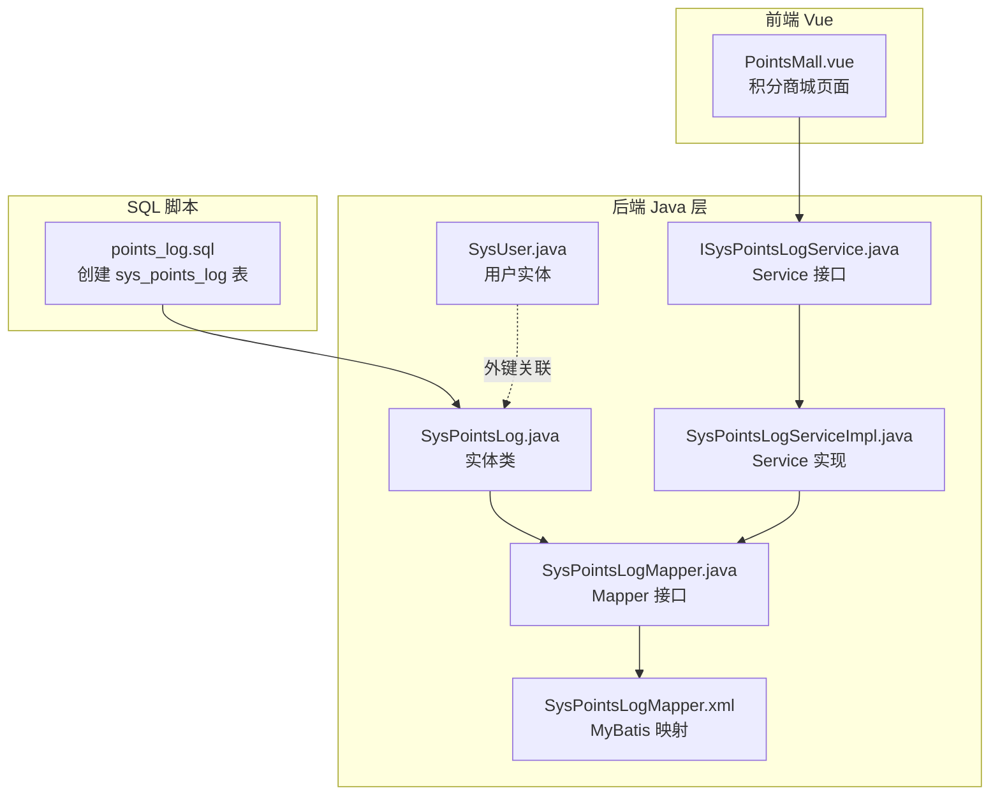
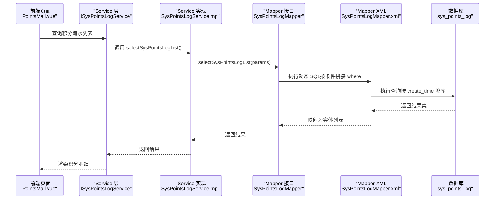
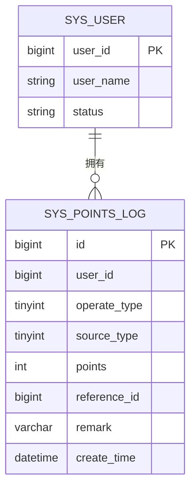
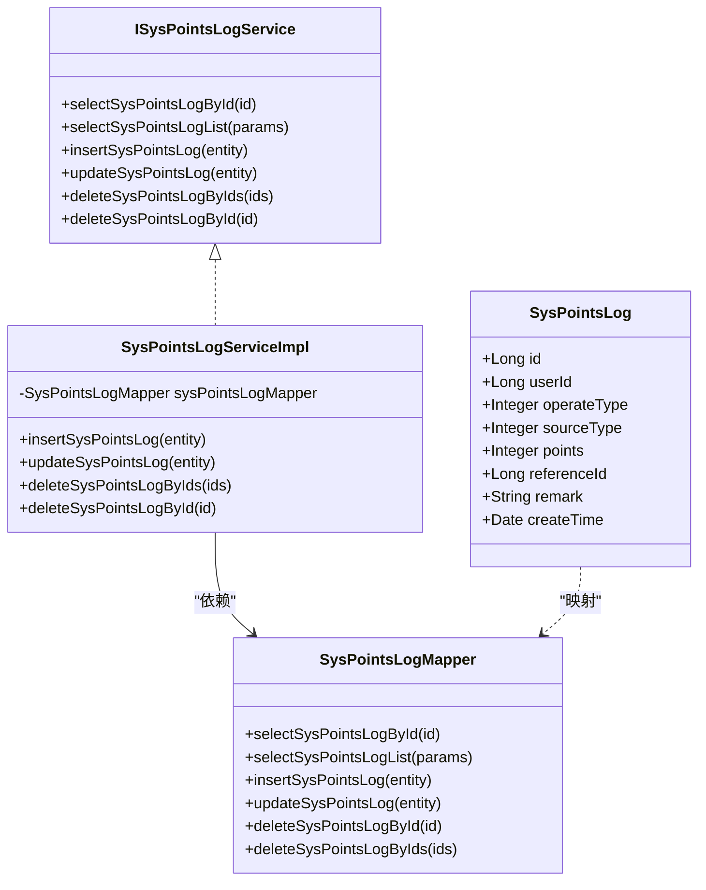

# 积分数据库设计

<cite>
**本文档引用的文件**
- [points_log.sql](file://XingChen-Vue/sql/points_log.sql)
- [SysPointsLog.java](file://XingChen-Vue/xingchen-system/src/main/java/com/xingchen/system/domain/SysPointsLog.java)
- [SysPointsLogMapper.java](file://XingChen-Vue/xingchen-system/src/main/java/com/xingchen/system/mapper/SysPointsLogMapper.java)
- [SysPointsLogMapper.xml](file://XingChen-Vue/xingchen-system/src/main/resources/mapper/system/SysPointsLogMapper.xml)
- [ISysPointsLogService.java](file://XingChen-Vue/xingchen-system/src/main/java/com/xingchen/system/service/ISysPointsLogService.java)
- [SysPointsLogServiceImpl.java](file://XingChen-Vue/xingchen-system/src/main/java/com/xingchen/system/service/impl/SysPointsLogServiceImpl.java)
- [SysUser.java](file://XingChen-Vue/xingchen-common/src/main/java/com/xingchen/common/core/domain/entity/SysUser.java)
- [PointsMall.vue](file://XingChen-Vue/xingchen-ui-user/src/views/PointsMall.vue)
</cite>

## 目录
1. [简介](#简介)
2. [项目结构](#项目结构)
3. [核心组件](#核心组件)
4. [架构总览](#架构总览)
5. [详细组件分析](#详细组件分析)
6. [依赖关系分析](#依赖关系分析)
7. [性能考虑](#性能考虑)
8. [故障排查指南](#故障排查指南)
9. [结论](#结论)
10. [附录](#附录)

## 简介
本文件围绕健康管理系统中的积分流水表 sys_points_log 的数据库设计进行系统性梳理，覆盖字段定义、数据类型与约束、主键与索引策略、查询优化、外键关系与数据完整性、触发器机制现状与建议、表结构演进与版本管理、迁移脚本实践、数据字典、ER 关系图、性能调优建议，并提供 SQL 示例、存储过程与视图定义思路及前端使用场景。

## 项目结构
积分系统涉及的核心文件分布于后端 Java 层与 SQL 脚本中，前端 Vue 页面用于展示积分余额与兑换流程。下图展示了与积分流水表相关的文件组织关系：

**图表来源**
- [points_log.sql:1-18](file://XingChen-Vue/sql/points_log.sql#L1-L18)
- [SysPointsLog.java:1-105](file://XingChen-Vue/xingchen-system/src/main/java/com/xingchen/system/domain/SysPointsLog.java#L1-L105)
- [SysPointsLogMapper.java:1-61](file://XingChen-Vue/xingchen-system/src/main/java/com/xingchen/system/mapper/SysPointsLogMapper.java#L1-L61)
- [SysPointsLogMapper.xml:1-92](file://XingChen-Vue/xingchen-system/src/main/resources/mapper/system/SysPointsLogMapper.xml#L1-L92)
- [ISysPointsLogService.java:1-61](file://XingChen-Vue/xingchen-system/src/main/java/com/xingchen/system/service/ISysPointsLogService.java#L1-L61)
- [SysPointsLogServiceImpl.java:1-95](file://XingChen-Vue/xingchen-system/src/main/java/com/xingchen/system/service/impl/SysPointsLogServiceImpl.java#L1-L95)
- [SysUser.java:1-337](file://XingChen-Vue/xingchen-common/src/main/java/com/xingchen/common/core/domain/entity/SysUser.java#L1-L337)
- [PointsMall.vue:1-344](file://XingChen-Vue/xingchen-ui-user/src/views/PointsMall.vue#L1-L344)

**章节来源**
- [points_log.sql:1-18](file://XingChen-Vue/sql/points_log.sql#L1-L18)
- [SysPointsLog.java:1-105](file://XingChen-Vue/xingchen-system/src/main/java/com/xingchen/system/domain/SysPointsLog.java#L1-L105)
- [SysPointsLogMapper.java:1-61](file://XingChen-Vue/xingchen-system/src/main/java/com/xingchen/system/mapper/SysPointsLogMapper.java#L1-L61)
- [SysPointsLogMapper.xml:1-92](file://XingChen-Vue/xingchen-system/src/main/resources/mapper/system/SysPointsLogMapper.xml#L1-L92)
- [ISysPointsLogService.java:1-61](file://XingChen-Vue/xingchen-system/src/main/java/com/xingchen/system/service/ISysPointsLogService.java#L1-L61)
- [SysPointsLogServiceImpl.java:1-95](file://XingChen-Vue/xingchen-system/src/main/java/com/xingchen/system/service/impl/SysPointsLogServiceImpl.java#L1-L95)
- [SysUser.java:1-337](file://XingChen-Vue/xingchen-common/src/main/java/com/xingchen/common/core/domain/entity/SysUser.java#L1-L337)
- [PointsMall.vue:1-344](file://XingChen-Vue/xingchen-ui-user/src/views/PointsMall.vue#L1-L344)

## 核心组件
- 数据库表：sys_points_log（积分流水表）
- 实体类：SysPointsLog（对应表结构的 Java 对象）
- Mapper 接口与 XML：负责 CRUD 与条件查询映射
- Service 接口与实现：封装业务逻辑，设置默认创建时间等
- 用户实体：SysUser（与积分流水存在潜在外键关联）

**章节来源**
- [SysPointsLog.java:11-105](file://XingChen-Vue/xingchen-system/src/main/java/com/xingchen/system/domain/SysPointsLog.java#L11-L105)
- [SysPointsLogMapper.java:11-61](file://XingChen-Vue/xingchen-system/src/main/java/com/xingchen/system/mapper/SysPointsLogMapper.java#L11-L61)
- [SysPointsLogMapper.xml:7-16](file://XingChen-Vue/xingchen-system/src/main/resources/mapper/system/SysPointsLogMapper.xml#L7-L16)
- [ISysPointsLogService.java:11-61](file://XingChen-Vue/xingchen-system/src/main/java/com/xingchen/system/service/ISysPointsLogService.java#L11-L61)
- [SysPointsLogServiceImpl.java:17-57](file://XingChen-Vue/xingchen-system/src/main/java/com/xingchen/system/service/impl/SysPointsLogServiceImpl.java#L17-L57)
- [SysUser.java:22-105](file://XingChen-Vue/xingchen-common/src/main/java/com/xingchen/common/core/domain/entity/SysUser.java#L22-L105)

## 架构总览
下图展示了从前端到数据库的调用链路与数据流向：

**图表来源**
- [PointsMall.vue:1-344](file://XingChen-Vue/xingchen-ui-user/src/views/PointsMall.vue#L1-L344)
- [ISysPointsLogService.java:21-27](file://XingChen-Vue/xingchen-system/src/main/java/com/xingchen/system/service/ISysPointsLogService.java#L21-L27)
- [SysPointsLogServiceImpl.java:41-43](file://XingChen-Vue/xingchen-system/src/main/java/com/xingchen/system/service/impl/SysPointsLogServiceImpl.java#L41-L43)
- [SysPointsLogMapper.java:21-27](file://XingChen-Vue/xingchen-system/src/main/java/com/xingchen/system/mapper/SysPointsLogMapper.java#L21-L27)
- [SysPointsLogMapper.xml:22-38](file://XingChen-Vue/xingchen-system/src/main/resources/mapper/system/SysPointsLogMapper.xml#L22-L38)

## 详细组件分析

### 表结构与字段定义
- 表名：sys_points_log（积分流水表）
- 字段概览（字段名、类型、是否可空、默认值、注释）：
  - id：bigint(20)，NOT NULL，自增，主键，注释“流水唯一标识”
  - user_id：bigint(20)，NOT NULL，注释“发生积分变动的员工ID”
  - operate_type：tinyint(4)，NOT NULL，注释“操作类型：1=收入（加分），2=支出（扣分）”
  - source_type：tinyint(4)，NOT NULL，注释“参与场景：1=每日打卡，2=连续打卡奖励，3=兑换商品消耗，4=HR手动退还积分”
  - points：int(11)，NOT NULL，注释“本次波动的分值（绝对值）”
  - reference_id：bigint(20)，可空，默认 NULL，注释“业务关联ID（如打卡记录ID、兑换订单ID）”
  - remark：varchar(255)，可空，默认 NULL，注释“波动说明”
  - create_time：datetime，可空，默认 CURRENT_TIMESTAMP，注释“发生时间”

- 主键：PRIMARY KEY (id)
- 索引：
  - idx_user_id(user_id)
  - idx_reference_id(reference_id)

- 存储引擎：InnoDB
- 字符集：utf8mb4

**章节来源**
- [points_log.sql:4-17](file://XingChen-Vue/sql/points_log.sql#L4-L17)

### 实体类与映射
- 实体类：SysPointsLog
  - 字段与注解：包含 userId、operateType、sourceType、points、referenceId 等，均标注 Excel 导出注解便于导出
  - 继承 BaseEntity：具备通用的审计字段能力（如创建时间等）
- Mapper 接口：定义查询、新增、修改、删除方法
- Mapper XML：
  - resultMap 完整映射表字段
  - selectSysPointsLogList 支持多条件过滤（user_id、operate_type、source_type、points、reference_id）与日期范围过滤（按天比较）
  - 插入与更新支持选择性字段写入

**章节来源**
- [SysPointsLog.java:11-105](file://XingChen-Vue/xingchen-system/src/main/java/com/xingchen/system/domain/SysPointsLog.java#L11-L105)
- [SysPointsLogMapper.java:11-61](file://XingChen-Vue/xingchen-system/src/main/java/com/xingchen/system/mapper/SysPointsLogMapper.java#L11-L61)
- [SysPointsLogMapper.xml:7-16](file://XingChen-Vue/xingchen-system/src/main/resources/mapper/system/SysPointsLogMapper.xml#L7-L16)
- [SysPointsLogMapper.xml:22-38](file://XingChen-Vue/xingchen-system/src/main/resources/mapper/system/SysPointsLogMapper.xml#L22-L38)
- [SysPointsLogMapper.xml:45-65](file://XingChen-Vue/xingchen-system/src/main/resources/mapper/system/SysPointsLogMapper.xml#L45-L65)

### Service 层与默认值
- Service 实现：
  - 新增时自动设置 create_time 为当前时间
  - 其余 CRUD 方法直接委托给 Mapper

**章节来源**
- [SysPointsLogServiceImpl.java:53-56](file://XingChen-Vue/xingchen-system/src/main/java/com/xingchen/system/service/impl/SysPointsLogServiceImpl.java#L53-L56)
- [SysPointsLogServiceImpl.java:65-69](file://XingChen-Vue/xingchen-system/src/main/java/com/xingchen/system/service/impl/SysPointsLogServiceImpl.java#L65-L69)

### 外键关系与数据完整性
- 当前表结构未定义外键约束；但实体类与用户实体存在关联关系，建议在数据库层面添加外键以保证 referential integrity：
  - user_id → sys_user.user_id（若存在）
- 建议：
  - 添加外键约束并设置合适的 ON DELETE 行为（如 RESTRICT 或 SET NULL，依据业务需求）
  - 对 reference_id 建议与业务表建立外键（如打卡记录表、兑换订单表），确保业务一致性

**章节来源**
- [SysPointsLog.java:18-20](file://XingChen-Vue/xingchen-system/src/main/java/com/xingchen/system/domain/SysPointsLog.java#L18-L20)
- [SysUser.java:107-115](file://XingChen-Vue/xingchen-common/src/main/java/com/xingchen/common/core/domain/entity/SysUser.java#L107-L115)

### 触发器机制
- 当前未发现针对 sys_points_log 的触发器定义。
- 若需要在积分变动时同步更新用户总积分或生成对账记录，可在数据库层面增加触发器或在应用层通过事务统一提交。

**章节来源**
- [points_log.sql:4-17](file://XingChen-Vue/sql/points_log.sql#L4-L17)

### 查询优化与索引策略
- 已有索引：
  - idx_user_id：适合按用户维度查询
  - idx_reference_id：适合按业务关联 ID 查询
- 建议补充：
  - idx_create_time(create_time)：配合时间范围查询提升性能
  - 复合索引：(user_id, create_time)、(source_type, create_time) 等，根据实际查询模式调整
- 查询优化要点：
  - 使用 selectSysPointsLogList 的日期范围过滤时，建议将 create_time 转换为日期后再比较，避免函数作用导致索引失效
  - 分页查询时优先使用主键 id 进行游标分页，减少回表成本

**章节来源**
- [SysPointsLogMapper.xml:30-35](file://XingChen-Vue/xingchen-system/src/main/resources/mapper/system/SysPointsLogMapper.xml#L30-L35)

### ER 关系图

**图表来源**
- [SysUser.java:22-105](file://XingChen-Vue/xingchen-common/src/main/java/com/xingchen/common/core/domain/entity/SysUser.java#L22-L105)
- [points_log.sql:4-17](file://XingChen-Vue/sql/points_log.sql#L4-L17)

### 数据字典
- sys_points_log
  - id：bigint，主键，自增
  - user_id：bigint，NOT NULL，外键（建议）
  - operate_type：tinyint，NOT NULL，枚举：1=收入，2=支出
  - source_type：tinyint，NOT NULL，枚举：1=每日打卡，2=连续打卡奖励，3=兑换商品消耗，4=HR手动退还积分
  - points：int，NOT NULL，绝对值
  - reference_id：bigint，可空，业务关联 ID
  - remark：varchar(255)，可空
  - create_time：datetime，可空，默认 CURRENT_TIMESTAMP

**章节来源**
- [points_log.sql:4-17](file://XingChen-Vue/sql/points_log.sql#L4-L17)

### 表结构演进与版本管理
- 版本管理建议：
  - 将每次 DDL 变更记录在独立 SQL 文件中，命名规则如 points_log_v1_xxx.sql、points_log_v2_xxx.sql
  - 在变更前备份目标表结构与数据
  - 使用迁移工具（如 Flyway/Liquibase）或自建迁移脚本，确保多环境一致
- 当前脚本仅包含建表语句，未见版本号或迁移历史记录。

**章节来源**
- [points_log.sql:1-3](file://XingChen-Vue/sql/points_log.sql#L1-L3)

### 迁移脚本实践
- 建议的迁移步骤：
  - 创建新版本脚本：points_log_v2_add_fk.sql
  - 添加外键约束与索引优化
  - 执行迁移并验证数据一致性
- 保持幂等性：先检查约束是否存在，再执行添加

**章节来源**
- [points_log.sql:4-17](file://XingChen-Vue/sql/points_log.sql#L4-L17)

### SQL 示例与最佳实践
- 新增积分流水（插入示例路径）
  - [SysPointsLogMapper.xml:45-65](file://XingChen-Vue/xingchen-system/src/main/resources/mapper/system/SysPointsLogMapper.xml#L45-L65)
- 条件查询（按用户、类型、时间范围）
  - [SysPointsLogMapper.xml:22-38](file://XingChen-Vue/xingchen-system/src/main/resources/mapper/system/SysPointsLogMapper.xml#L22-L38)
- 更新与删除
  - [SysPointsLogMapper.xml:67-79](file://XingChen-Vue/xingchen-system/src/main/resources/mapper/system/SysPointsLogMapper.xml#L67-L79)
  - [SysPointsLogMapper.xml:81-90](file://XingChen-Vue/xingchen-system/src/main/resources/mapper/system/SysPointsLogMapper.xml#L81-L90)

**章节来源**
- [SysPointsLogMapper.xml:22-38](file://XingChen-Vue/xingchen-system/src/main/resources/mapper/system/SysPointsLogMapper.xml#L22-L38)
- [SysPointsLogMapper.xml:45-65](file://XingChen-Vue/xingchen-system/src/main/resources/mapper/system/SysPointsLogMapper.xml#L45-L65)
- [SysPointsLogMapper.xml:67-79](file://XingChen-Vue/xingchen-system/src/main/resources/mapper/system/SysPointsLogMapper.xml#L67-L79)
- [SysPointsLogMapper.xml:81-90](file://XingChen-Vue/xingchen-system/src/main/resources/mapper/system/SysPointsLogMapper.xml#L81-L90)

### 存储过程与视图定义（建议）
- 存储过程（示例思路）：
  - proc_points_summary_by_user：按用户统计收入/支出与结余
  - proc_points_export_daily：按日导出积分流水报表
- 视图（示例思路）：
  - view_points_daily_summary：按日期聚合的积分汇总视图
  - view_points_user_monthly：用户月度积分变化视图
- 注意：以上为设计建议，需结合业务与性能评估后实施。

**章节来源**
- [SysPointsLogMapper.xml:18-20](file://XingChen-Vue/xingchen-system/src/main/resources/mapper/system/SysPointsLogMapper.xml#L18-L20)

## 依赖关系分析
- 类关系图（代码级）

**图表来源**
- [SysPointsLog.java:11-105](file://XingChen-Vue/xingchen-system/src/main/java/com/xingchen/system/domain/SysPointsLog.java#L11-L105)
- [ISysPointsLogService.java:11-61](file://XingChen-Vue/xingchen-system/src/main/java/com/xingchen/system/service/ISysPointsLogService.java#L11-L61)
- [SysPointsLogServiceImpl.java:17-95](file://XingChen-Vue/xingchen-system/src/main/java/com/xingchen/system/service/impl/SysPointsLogServiceImpl.java#L17-L95)
- [SysPointsLogMapper.java:11-61](file://XingChen-Vue/xingchen-system/src/main/java/com/xingchen/system/mapper/SysPointsLogMapper.java#L11-L61)

**章节来源**
- [SysPointsLog.java:11-105](file://XingChen-Vue/xingchen-system/src/main/java/com/xingchen/system/domain/SysPointsLog.java#L11-L105)
- [ISysPointsLogService.java:11-61](file://XingChen-Vue/xingchen-system/src/main/java/com/xingchen/system/service/ISysPointsLogService.java#L11-L61)
- [SysPointsLogServiceImpl.java:17-95](file://XingChen-Vue/xingchen-system/src/main/java/com/xingchen/system/service/impl/SysPointsLogServiceImpl.java#L17-L95)
- [SysPointsLogMapper.java:11-61](file://XingChen-Vue/xingchen-system/src/main/java/com/xingchen/system/mapper/SysPointsLogMapper.java#L11-L61)

## 性能考虑
- 索引优化：
  - 为高频查询字段建立合适索引（user_id、source_type、create_time）
  - 避免在 WHERE 子句中对列使用函数，防止索引失效
- 查询优化：
  - 使用 selectSysPointsLogList 的日期范围过滤时，建议将 create_time 转换为日期后再比较
  - 分页采用基于主键的游标分页，减少 offset 大时的扫描成本
- 写入优化：
  - 批量插入时合并 SQL，减少往返开销
- 事务与锁：
  - 在高并发场景下，合理控制事务粒度，避免长事务持有排他锁

**章节来源**
- [SysPointsLogMapper.xml:30-35](file://XingChen-Vue/xingchen-system/src/main/resources/mapper/system/SysPointsLogMapper.xml#L30-L35)
- [SysPointsLogMapper.xml:22-38](file://XingChen-Vue/xingchen-system/src/main/resources/mapper/system/SysPointsLogMapper.xml#L22-L38)

## 故障排查指南
- 常见问题与定位：
  - 查询性能差：检查是否命中索引，确认日期范围过滤方式
  - 数据不一致：核对外键约束与业务外键 reference_id 的一致性
  - 插入失败：检查必填字段与数据类型是否匹配
- 日志与监控：
  - 记录慢查询 SQL 与执行计划
  - 监控索引使用率与缓存命中率

**章节来源**
- [SysPointsLogMapper.xml:22-38](file://XingChen-Vue/xingchen-system/src/main/resources/mapper/system/SysPointsLogMapper.xml#L22-L38)
- [SysPointsLogMapper.xml:45-65](file://XingChen-Vue/xingchen-system/src/main/resources/mapper/system/SysPointsLogMapper.xml#L45-L65)

## 结论
sys_points_log 表结构简洁明确，满足积分流水记录的基本需求。建议在现有基础上完善外键约束、补充关键索引、引入版本化迁移脚本与性能优化策略，并在需要时扩展存储过程与视图以支撑更复杂的报表与对账场景。通过前后端协同与严格的变更管理，可确保系统的稳定性与可维护性。

## 附录
- 前端使用场景：积分商城页面展示用户可用积分与兑换流程，Service 层负责数据查询与展示支撑。

**章节来源**
- [PointsMall.vue:23-34](file://XingChen-Vue/xingchen-ui-user/src/views/PointsMall.vue#L23-L34)