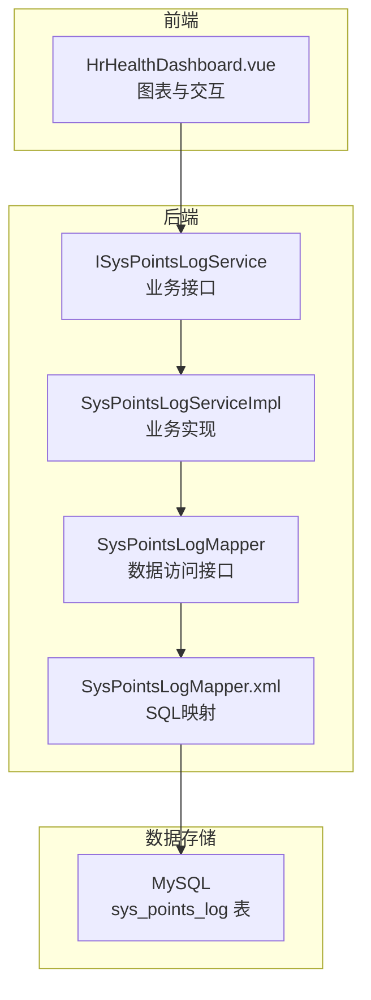
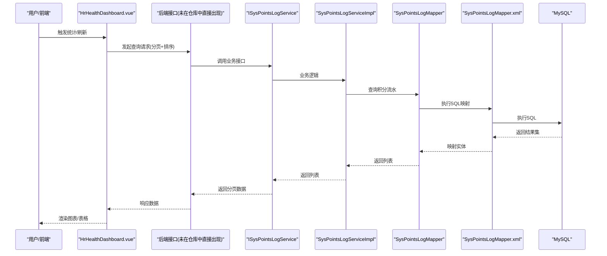
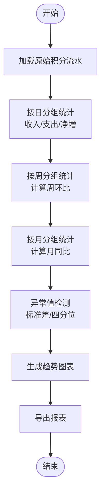
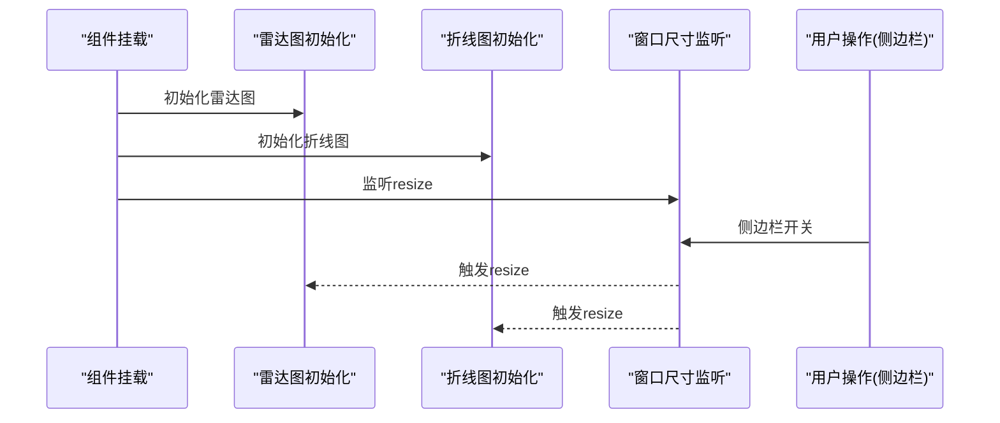
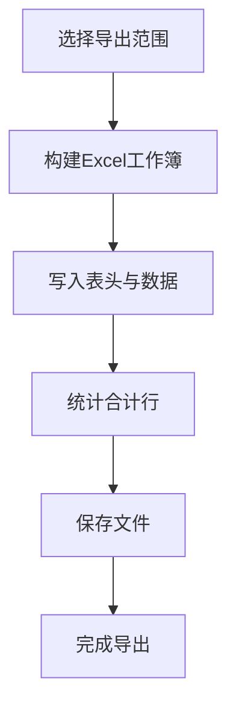
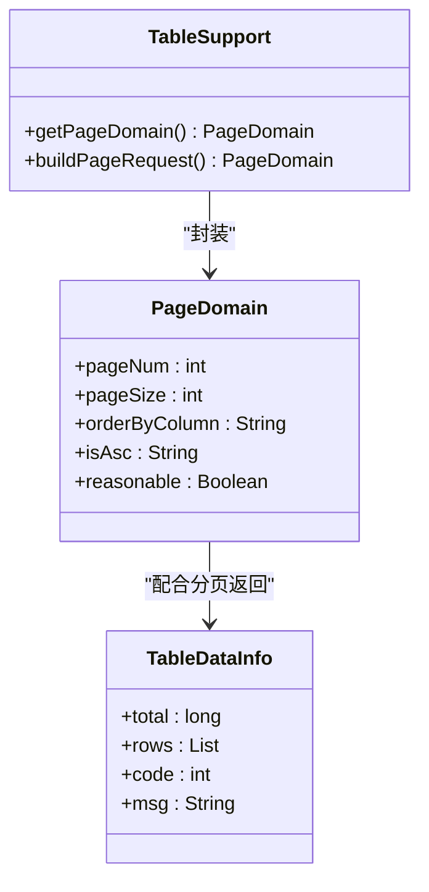
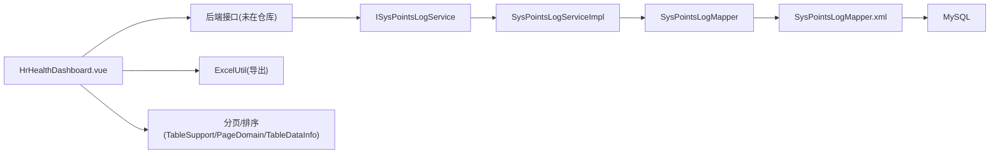

# 积分统计分析

<cite>
**本文引用的文件**
- [points_log.sql](file://XingChen-Vue/sql/points_log.sql)
- [SysPointsLogMapper.xml](file://XingChen-Vue/xingchen-system/src/main/resources/mapper/system/SysPointsLogMapper.xml)
- [SysPointsLog.java](file://XingChen-Vue/xingchen-system/src/main/java/com/xingchen/system/domain/SysPointsLog.java)
- [ISysPointsLogService.java](file://XingChen-Vue/xingchen-system/src/main/java/com/xingchen/system/service/ISysPointsLogService.java)
- [SysPointsLogServiceImpl.java](file://XingChen-Vue/xingchen-system/src/main/java/com/xingchen/system/service/impl/SysPointsLogServiceImpl.java)
- [SysPointsLogMapper.java](file://XingChen-Vue/xingchen-system/src/main/java/com/xingchen/system/mapper/SysPointsLogMapper.java)
- [HrHealthDashboard.vue](file://XingChen-Vue3/src/views/hr/HrHealthDashboard.vue)
- [ExcelUtil.java](file://XingChen-Vue/xingchen-common/src/main/java/com/xingchen/common/utils/poi/ExcelUtil.java)
- [TableDataInfo.java](file://XingChen-Vue/xingchen-common/src/main/java/com/xingchen/common/core/page/TableDataInfo.java)
- [TableSupport.java](file://XingChen-Vue/xingchen-common/src/main/java/com/xingchen/common/core/page/TableSupport.java)
- [PageDomain.java](file://XingChen-Vue/xingchen-common/src/main/java/com/xingchen/common/core/page/PageDomain.java)
</cite>

## 目录
1. [简介](#简介)
2. [项目结构](#项目结构)
3. [核心组件](#核心组件)
4. [架构总览](#架构总览)
5. [详细组件分析](#详细组件分析)
6. [依赖分析](#依赖分析)
7. [性能考虑](#性能考虑)
8. [故障排查指南](#故障排查指南)
9. [结论](#结论)
10. [附录](#附录)

## 简介
本技术文档聚焦于“积分统计分析”能力，围绕积分流水数据的采集、聚合统计、趋势分析与报表生成进行系统化梳理。文档覆盖以下关键点：
- 数据模型与字段定义、统计口径与精度控制
- 按日/周/月维度的汇总算法与环比、同比计算方法
- 可视化图表实现（雷达图、折线图）与实时刷新机制
- 报表导出（Excel）与分页查询、排序优化策略
- 统计API接口设计建议与最佳实践

## 项目结构
积分统计分析涉及三层：前端展示与交互、后端服务与持久化、数据库存储。

**图表来源**
- [HrHealthDashboard.vue:1-481](file://XingChen-Vue3/src/views/hr/HrHealthDashboard.vue#L1-L481)
- [ISysPointsLogService.java:1-61](file://XingChen-Vue/xingchen-system/src/main/java/com/xingchen/system/service/ISysPointsLogService.java#L1-L61)
- [SysPointsLogServiceImpl.java:1-94](file://XingChen-Vue/xingchen-system/src/main/java/com/xingchen/system/service/impl/SysPointsLogServiceImpl.java#L1-L94)
- [SysPointsLogMapper.java:1-61](file://XingChen-Vue/xingchen-system/src/main/java/com/xingchen/system/mapper/SysPointsLogMapper.java#L1-L61)
- [SysPointsLogMapper.xml:22-91](file://XingChen-Vue/xingchen-system/src/main/resources/mapper/system/SysPointsLogMapper.xml#L22-L91)
- [points_log.sql:1-18](file://XingChen-Vue/sql/points_log.sql#L1-L18)

**章节来源**
- [HrHealthDashboard.vue:1-481](file://XingChen-Vue3/src/views/hr/HrHealthDashboard.vue#L1-L481)
- [SysPointsLogMapper.xml:22-91](file://XingChen-Vue/xingchen-system/src/main/resources/mapper/system/SysPointsLogMapper.xml#L22-L91)
- [points_log.sql:1-18](file://XingChen-Vue/sql/points_log.sql#L1-L18)

## 核心组件
- 数据模型：SysPointsLog（积分流水）
- 数据访问：SysPointsLogMapper + SysPointsLogMapper.xml
- 业务服务：ISysPointsLogService + SysPointsLogServiceImpl
- 前端展示：HrHealthDashboard.vue（雷达图、折线图、时间轴）
- 报表导出：ExcelUtil（合计统计、文件写入）
- 分页与排序：TableSupport、PageDomain、TableDataInfo

**章节来源**
- [SysPointsLog.java:43-104](file://XingChen-Vue/xingchen-system/src/main/java/com/xingchen/system/domain/SysPointsLog.java#L43-L104)
- [SysPointsLogMapper.java:1-61](file://XingChen-Vue/xingchen-system/src/main/java/com/xingchen/system/mapper/SysPointsLogMapper.java#L1-L61)
- [SysPointsLogMapper.xml:22-91](file://XingChen-Vue/xingchen-system/src/main/resources/mapper/system/SysPointsLogMapper.xml#L22-L91)
- [ISysPointsLogService.java:1-61](file://XingChen-Vue/xingchen-system/src/main/java/com/xingchen/system/service/ISysPointsLogService.java#L1-L61)
- [SysPointsLogServiceImpl.java:1-94](file://XingChen-Vue/xingchen-system/src/main/java/com/xingchen/system/service/impl/SysPointsLogServiceImpl.java#L1-L94)
- [HrHealthDashboard.vue:1-481](file://XingChen-Vue3/src/views/hr/HrHealthDashboard.vue#L1-L481)
- [ExcelUtil.java:1554-1648](file://XingChen-Vue/xingchen-common/src/main/java/com/xingchen/common/utils/poi/ExcelUtil.java#L1554-L1648)
- [TableSupport.java:1-57](file://XingChen-Vue/xingchen-common/src/main/java/com/xingchen/common/core/page/TableSupport.java#L1-L57)
- [PageDomain.java:62-101](file://XingChen-Vue/xingchen-common/src/main/java/com/xingchen/common/core/page/PageDomain.java#L62-L101)
- [TableDataInfo.java:1-86](file://XingChen-Vue/xingchen-common/src/main/java/com/xingchen/common/core/page/TableDataInfo.java#L1-L86)

## 架构总览
积分统计分析从“采集—聚合—分析—展示—导出”的链路如下：

**图表来源**
- [HrHealthDashboard.vue:1-481](file://XingChen-Vue3/src/views/hr/HrHealthDashboard.vue#L1-L481)
- [ISysPointsLogService.java:1-61](file://XingChen-Vue/xingchen-system/src/main/java/com/xingchen/system/service/ISysPointsLogService.java#L1-L61)
- [SysPointsLogServiceImpl.java:1-94](file://XingChen-Vue/xingchen-system/src/main/java/com/xingchen/system/service/impl/SysPointsLogServiceImpl.java#L1-L94)
- [SysPointsLogMapper.java:1-61](file://XingChen-Vue/xingchen-system/src/main/java/com/xingchen/system/mapper/SysPointsLogMapper.java#L1-L61)
- [SysPointsLogMapper.xml:22-91](file://XingChen-Vue/xingchen-system/src/main/resources/mapper/system/SysPointsLogMapper.xml#L22-L91)

## 详细组件分析

### 数据模型与统计口径
- 表结构与字段
  - 主键：id
  - 用户：user_id
  - 类型：operate_type（1=收入，2=支出）
  - 场景：source_type（1=每日打卡，2=连续打卡奖励，3=兑换商品消耗，4=HR手动退还积分）
  - 数值：points（绝对值）
  - 关联：reference_id
  - 时间：create_time
  - 索引：user_id、reference_id

- 统计口径
  - 收入：operate_type=1 的 points 求和
  - 支出：operate_type=2 的 points 求和
  - 净增：收入-支出
  - 按日：按 create_time 的日期聚合
  - 按周：按自然周起止区间聚合
  - 按月：按年-月聚合

- 数据精度
  - points 使用整型，满足常规积分场景；若需小数，建议扩展为 DECIMAL 并统一换算单位（如保留两位小数的百分之一分）

**章节来源**
- [points_log.sql:1-18](file://XingChen-Vue/sql/points_log.sql#L1-L18)
- [SysPointsLog.java:43-104](file://XingChen-Vue/xingchen-system/src/main/java/com/xingchen/system/domain/SysPointsLog.java#L43-L104)

### 聚合统计与趋势分析
- 日维度汇总
  - SQL使用日期格式化函数对 create_time 进行按日分组，分别统计当日收入、支出与净增
  - 前端折线图以“周一至周五”为例，展示全公司平均压力趋势（可替换为积分净增趋势）

- 周维度汇总
  - 自然周起止：以周一为一周起点，计算该周内每日的累计净增或日均值
  - 环比：本周 vs 上周（同周次比），用于观察趋势变化

- 月维度汇总
  - 以年-月聚合，计算月度收入、支出、净增
  - 同比：本年当月 vs 去年同月，用于评估长期趋势

- 异常值检测
  - 基于标准差或四分位距识别偏离正常范围的用户/部门
  - 前端时间轴可展示异常预警事件（如“研发部连续3天压力超标”）

[此图为概念流程示意，不对应具体源码文件]

**章节来源**
- [SysPointsLogMapper.xml:22-91](file://XingChen-Vue/xingchen-system/src/main/resources/mapper/system/SysPointsLogMapper.xml#L22-L91)
- [HrHealthDashboard.vue:210-365](file://XingChen-Vue3/src/views/hr/HrHealthDashboard.vue#L210-L365)

### 可视化图表实现与实时刷新
- 雷达图：展示部门健康画像（颈椎风险、眼部疲劳、压力指数、久坐时长、借款异常）
- 折线图：展示全公司压力（可替换为积分净增）周趋势
- 实时刷新：监听窗口尺寸变化与侧边栏开关，自动重绘图表

**图表来源**
- [HrHealthDashboard.vue:210-365](file://XingChen-Vue3/src/views/hr/HrHealthDashboard.vue#L210-L365)

**章节来源**
- [HrHealthDashboard.vue:1-481](file://XingChen-Vue3/src/views/hr/HrHealthDashboard.vue#L1-L481)

### 报表导出与数据精度控制
- 导出能力：ExcelUtil 提供合计统计与文件写入能力，支持在导出时追加“合计”行
- 精度控制：points 为整型，导出时保持整数；若涉及小数，应在服务层统一换算并保留两位小数

**图表来源**
- [ExcelUtil.java:1554-1648](file://XingChen-Vue/xingchen-common/src/main/java/com/xingchen/common/utils/poi/ExcelUtil.java#L1554-L1648)

**章节来源**
- [ExcelUtil.java:1554-1648](file://XingChen-Vue/xingchen-common/src/main/java/com/xingchen/common/utils/poi/ExcelUtil.java#L1554-L1648)

### 统计API接口设计与分页排序
- 接口设计要点
  - GET /points/statistics
  - 查询参数：beginCreateTime、endCreateTime、userId、operateType、sourceType、referenceId
  - 分页参数：pageNum、pageSize、orderByColumn、isAsc、reasonable
  - 返回：TableDataInfo（total、rows、code、msg）

- 分页与排序
  - TableSupport 将请求参数封装为 PageDomain
  - PageDomain 支持排序方向兼容（ascending/descending → asc/desc）
  - TableDataInfo 作为统一响应载体

**图表来源**
- [TableSupport.java:1-57](file://XingChen-Vue/xingchen-common/src/main/java/com/xingchen/common/core/page/TableSupport.java#L1-L57)
- [PageDomain.java:62-101](file://XingChen-Vue/xingchen-common/src/main/java/com/xingchen/common/core/page/PageDomain.java#L62-L101)
- [TableDataInfo.java:1-86](file://XingChen-Vue/xingchen-common/src/main/java/com/xingchen/common/core/page/TableDataInfo.java#L1-L86)

**章节来源**
- [TableSupport.java:1-57](file://XingChen-Vue/xingchen-common/src/main/java/com/xingchen/common/core/page/TableSupport.java#L1-L57)
- [PageDomain.java:62-101](file://XingChen-Vue/xingchen-common/src/main/java/com/xingchen/common/core/page/PageDomain.java#L62-L101)
- [TableDataInfo.java:1-86](file://XingChen-Vue/xingchen-common/src/main/java/com/xingchen/common/core/page/TableDataInfo.java#L1-L86)

## 依赖分析
- 前端依赖后端服务接口（未在仓库中直接出现），通过 HrHealthDashboard.vue 调用
- 后端服务依赖 Mapper/XML 执行 SQL，最终落到 MySQL
- Excel 导出依赖通用工具类 ExcelUtil
- 分页与排序依赖 TableSupport、PageDomain、TableDataInfo

**图表来源**
- [HrHealthDashboard.vue:1-481](file://XingChen-Vue3/src/views/hr/HrHealthDashboard.vue#L1-L481)
- [SysPointsLogMapper.xml:22-91](file://XingChen-Vue/xingchen-system/src/main/resources/mapper/system/SysPointsLogMapper.xml#L22-L91)
- [ExcelUtil.java:1554-1648](file://XingChen-Vue/xingchen-common/src/main/java/com/xingchen/common/utils/poi/ExcelUtil.java#L1554-L1648)
- [TableSupport.java:1-57](file://XingChen-Vue/xingchen-common/src/main/java/com/xingchen/common/core/page/TableSupport.java#L1-L57)
- [PageDomain.java:62-101](file://XingChen-Vue/xingchen-common/src/main/java/com/xingchen/common/core/page/PageDomain.java#L62-L101)
- [TableDataInfo.java:1-86](file://XingChen-Vue/xingchen-common/src/main/java/com/xingchen/common/core/page/TableDataInfo.java#L1-L86)

**章节来源**
- [HrHealthDashboard.vue:1-481](file://XingChen-Vue3/src/views/hr/HrHealthDashboard.vue#L1-L481)
- [SysPointsLogMapper.xml:22-91](file://XingChen-Vue/xingchen-system/src/main/resources/mapper/system/SysPointsLogMapper.xml#L22-L91)
- [ExcelUtil.java:1554-1648](file://XingChen-Vue/xingchen-common/src/main/java/com/xingchen/common/utils/poi/ExcelUtil.java#L1554-L1648)
- [TableSupport.java:1-57](file://XingChen-Vue/xingchen-common/src/main/java/com/xingchen/common/core/page/TableSupport.java#L1-L57)
- [PageDomain.java:62-101](file://XingChen-Vue/xingchen-common/src/main/java/com/xingchen/common/core/page/PageDomain.java#L62-L101)
- [TableDataInfo.java:1-86](file://XingChen-Vue/xingchen-common/src/main/java/com/xingchen/common/core/page/TableDataInfo.java#L1-L86)

## 性能考虑
- 索引优化
  - 已有 user_id、reference_id 索引，建议在 create_time 上建立合适索引以加速按日/周/月聚合
- SQL 优化
  - 使用日期格式化函数进行分组时，尽量避免在 WHERE 中对列进行函数运算，优先在应用层构造日期边界
- 分页与排序
  - PageDomain 支持排序方向兼容，建议在数据库层面设置默认排序索引，减少排序成本
- 前端渲染
  - ECharts 图表在窗口 resize 时自动重绘，注意在组件卸载时 dispose，避免内存泄漏

[本节为通用性能建议，不直接分析具体文件]

## 故障排查指南
- 前端图表不显示
  - 检查 ECharts 初始化是否成功、DOM 引用是否存在、resize 事件是否正确绑定
  - 参考：[HrHealthDashboard.vue:210-365](file://XingChen-Vue3/src/views/hr/HrHealthDashboard.vue#L210-L365)

- 后端查询无结果
  - 检查 SysPointsLogMapper.xml 中的条件拼接与日期格式化逻辑
  - 参考：[SysPointsLogMapper.xml:22-91](file://XingChen-Vue/xingchen-system/src/main/resources/mapper/system/SysPointsLogMapper.xml#L22-L91)

- 分页参数无效
  - 检查 TableSupport 是否正确解析 pageNum、pageSize、isAsc、orderByColumn
  - 参考：[TableSupport.java:1-57](file://XingChen-Vue/xingchen-common/src/main/java/com/xingchen/common/core/page/TableSupport.java#L1-L57)

- 导出文件为空或合计不正确
  - 检查 ExcelUtil 的统计逻辑与文件写入路径
  - 参考：[ExcelUtil.java:1554-1648](file://XingChen-Vue/xingchen-common/src/main/java/com/xingchen/common/utils/poi/ExcelUtil.java#L1554-L1648)

**章节来源**
- [HrHealthDashboard.vue:210-365](file://XingChen-Vue3/src/views/hr/HrHealthDashboard.vue#L210-L365)
- [SysPointsLogMapper.xml:22-91](file://XingChen-Vue/xingchen-system/src/main/resources/mapper/system/SysPointsLogMapper.xml#L22-L91)
- [TableSupport.java:1-57](file://XingChen-Vue/xingchen-common/src/main/java/com/xingchen/common/core/page/TableSupport.java#L1-L57)
- [ExcelUtil.java:1554-1648](file://XingChen-Vue/xingchen-common/src/main/java/com/xingchen/common/utils/poi/ExcelUtil.java#L1554-L1648)

## 结论
本项目已具备积分流水的基础数据模型与前端可视化能力，建议在此基础上完善：
- 后端统计接口与聚合算法（按日/周/月、环比/同比、异常检测）
- 分页与排序的数据库索引优化
- 报表导出的合计与格式化
- 实时刷新与图表自适应

## 附录
- 业务报表示例（概念性描述）
  - 日报：日期、用户数、收入、支出、净增、异常预警数
  - 周报：周起止、部门分布、趋势图、异常事件摘要
  - 月报：月度汇总、同比/环比、导出Excel（含合计行）

[本节为概念性内容，不直接分析具体文件]