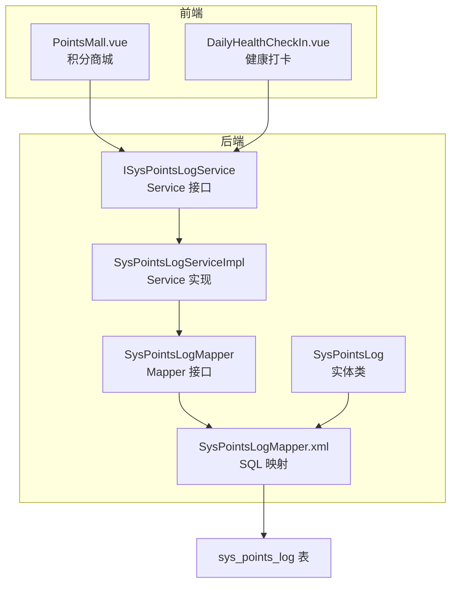
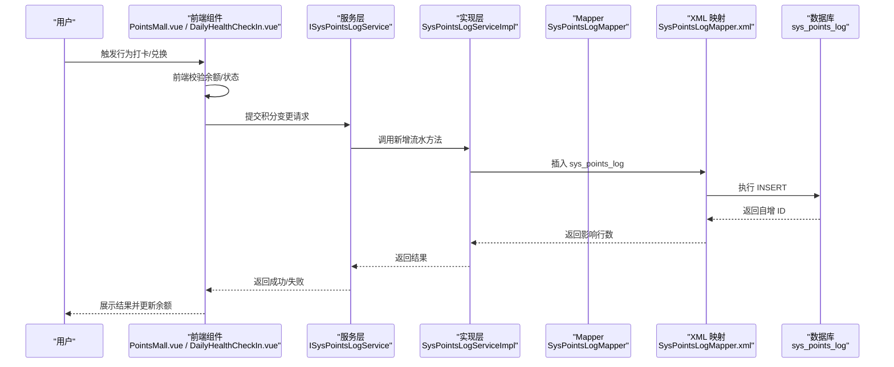
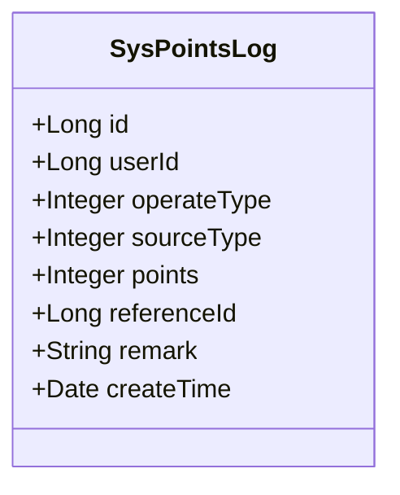
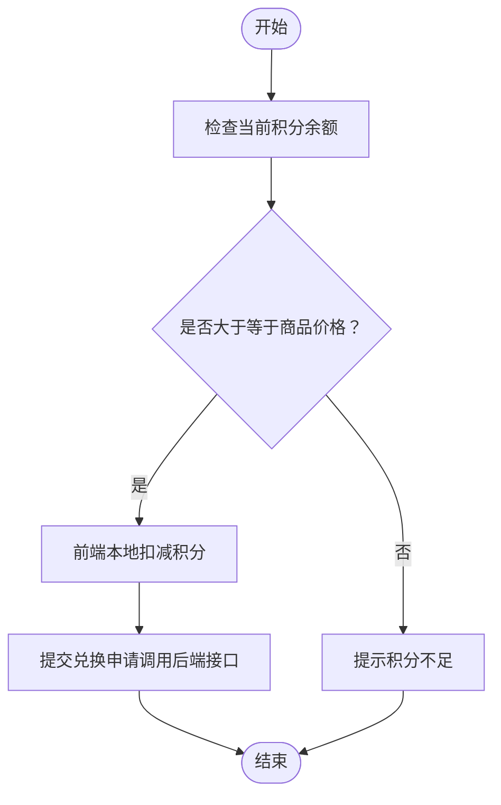
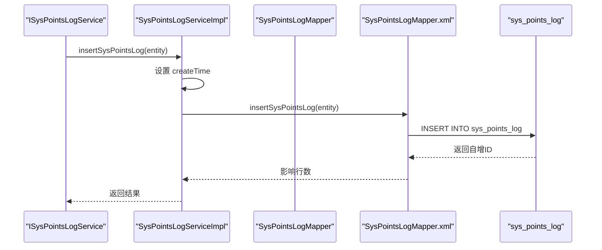
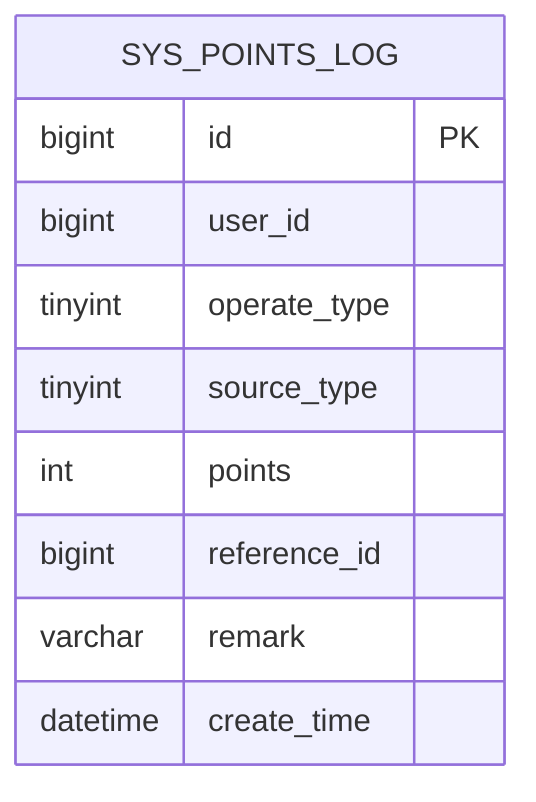

# 积分规则设计

<cite>
**本文引用的文件**
- [SysPointsLog.java](file://XingChen-Vue/xingchen-system/src/main/java/com/xingchen/system/domain/SysPointsLog.java)
- [SysPointsLogMapper.java](file://XingChen-Vue/xingchen-system/src/main/java/com/xingchen/system/mapper/SysPointsLogMapper.java)
- [SysPointsLogMapper.xml](file://XingChen-Vue/xingchen-system/src/main/resources/mapper/system/SysPointsLogMapper.xml)
- [SysPointsLogServiceImpl.java](file://XingChen-Vue/xingchen-system/src/main/java/com/xingchen/system/service/impl/SysPointsLogServiceImpl.java)
- [ISysPointsLogService.java](file://XingChen-Vue/xingchen-system/src/main/java/com/xingchen/system/service/ISysPointsLogService.java)
- [points_log.sql](file://XingChen-Vue/sql/points_log.sql)
- [PointsMall.vue](file://XingChen-Vue/xingchen-ui-user/src/views/PointsMall.vue)
- [DailyHealthCheckIn.vue](file://XingChen-Vue/xingchen-ui-user/src/components/DailyHealthCheckIn.vue)
</cite>

## 目录
1. [简介](#简介)
2. [项目结构](#项目结构)
3. [核心组件](#核心组件)
4. [架构概览](#架构概览)
5. [详细组件分析](#详细组件分析)
6. [依赖关系分析](#依赖关系分析)
7. [性能考虑](#性能考虑)
8. [故障排查指南](#故障排查指南)
9. [结论](#结论)
10. [附录](#附录)

## 简介
本文件面向健康管理系统中的积分规则设计，围绕积分获取规则、扣分机制、奖励算法与业务场景分类进行系统化技术文档化。重点解释 operateType 与 sourceType 字段的设计含义与使用方式，覆盖收入（1=每日打卡、2=连续打卡奖励）与支出（3=兑换商品消耗、4=HR手动退还积分）两类场景的实现路径。同时给出积分计算公式、阈值设置、时间限制与条件判断逻辑，以及规则配置管理、动态调整机制与规则验证策略，并提供业务场景示例与扩展开发指导。

## 项目结构
积分规则涉及前后端协同：前端负责用户交互与基础校验，后端负责积分流水落库与查询统计。核心文件分布如下：
- 数据模型与持久层：SysPointsLog 实体类、MyBatis 映射 XML、Mapper 接口与 Service 实现
- 前端交互：积分商城页面与健康打卡组件
- 数据库表：sys_points_log 的建表脚本

图表来源
- [SysPointsLog.java:1-105](file://XingChen-Vue/xingchen-system/src/main/java/com/xingchen/system/domain/SysPointsLog.java#L1-L105)
- [SysPointsLogMapper.java:1-61](file://XingChen-Vue/xingchen-system/src/main/java/com/xingchen/system/mapper/SysPointsLogMapper.java#L1-L61)
- [SysPointsLogMapper.xml:22-91](file://XingChen-Vue/xingchen-system/src/main/resources/mapper/system/SysPointsLogMapper.xml#L22-L91)
- [SysPointsLogServiceImpl.java:1-95](file://XingChen-Vue/xingchen-system/src/main/java/com/xingchen/system/service/impl/SysPointsLogServiceImpl.java#L1-L95)
- [ISysPointsLogService.java:1-61](file://XingChen-Vue/xingchen-system/src/main/java/com/xingchen/system/service/ISysPointsLogService.java#L1-L61)
- [points_log.sql:1-18](file://XingChen-Vue/sql/points_log.sql#L1-L18)

章节来源
- [SysPointsLog.java:1-105](file://XingChen-Vue/xingchen-system/src/main/java/com/xingchen/system/domain/SysPointsLog.java#L1-L105)
- [SysPointsLogMapper.java:1-61](file://XingChen-Vue/xingchen-system/src/main/java/com/xingchen/system/mapper/SysPointsLogMapper.java#L1-L61)
- [SysPointsLogMapper.xml:22-91](file://XingChen-Vue/xingchen-system/src/main/resources/mapper/system/SysPointsLogMapper.xml#L22-L91)
- [SysPointsLogServiceImpl.java:1-95](file://XingChen-Vue/xingchen-system/src/main/java/com/xingchen/system/service/impl/SysPointsLogServiceImpl.java#L1-L95)
- [ISysPointsLogService.java:1-61](file://XingChen-Vue/xingchen-system/src/main/java/com/xingchen/system/service/ISysPointsLogService.java#L1-L61)
- [points_log.sql:1-18](file://XingChen-Vue/sql/points_log.sql#L1-L18)

## 核心组件
- 数据模型 SysPointsLog：定义积分流水的字段与注释，明确 operateType 与 sourceType 的业务含义
- Mapper 与 XML：提供按 operateType/sourceType/时间范围等条件的查询能力
- Service 层：封装新增积分流水的业务逻辑（如统一设置创建时间）

章节来源
- [SysPointsLog.java:1-105](file://XingChen-Vue/xingchen-system/src/main/java/com/xingchen/system/domain/SysPointsLog.java#L1-L105)
- [SysPointsLogMapper.xml:22-91](file://XingChen-Vue/xingchen-system/src/main/resources/mapper/system/SysPointsLogMapper.xml#L22-L91)
- [SysPointsLogServiceImpl.java:52-57](file://XingChen-Vue/xingchen-system/src/main/java/com/xingchen/system/service/impl/SysPointsLogServiceImpl.java#L52-L57)

## 架构概览
积分规则的运行时流程：
- 用户行为触发（如完成健康打卡或发起兑换）
- 前端进行基础校验（如积分余额是否足够）
- 后端根据规则生成积分流水记录（operateType/sourceType/points/referenceId）
- 前端展示结果并刷新积分余额

图表来源
- [SysPointsLogServiceImpl.java:52-57](file://XingChen-Vue/xingchen-system/src/main/java/com/xingchen/system/service/impl/SysPointsLogServiceImpl.java#L52-L57)
- [SysPointsLogMapper.xml:45-61](file://XingChen-Vue/xingchen-system/src/main/resources/mapper/system/SysPointsLogMapper.xml#L45-L61)
- [points_log.sql:5-17](file://XingChen-Vue/sql/points_log.sql#L5-L17)

## 详细组件分析

### 数据模型与字段设计
- operateType：1=收入（加分），2=支出（扣分）
- sourceType：1=每日打卡，2=连续打卡奖励，3=兑换商品消耗，4=HR手动退还积分
- points：本次波动的分值（绝对值）
- referenceId：业务关联ID（如打卡记录ID、兑换订单ID）
- remark/createTime：备注与创建时间（由后端统一设置）

图表来源
- [SysPointsLog.java:15-36](file://XingChen-Vue/xingchen-system/src/main/java/com/xingchen/system/domain/SysPointsLog.java#L15-L36)

章节来源
- [SysPointsLog.java:22-28](file://XingChen-Vue/xingchen-system/src/main/java/com/xingchen/system/domain/SysPointsLog.java#L22-L28)
- [SysPointsLog.java:30-36](file://XingChen-Vue/xingchen-system/src/main/java/com/xingchen/system/domain/SysPointsLog.java#L30-L36)

### 前端交互与基础校验
- 积分商城页面：展示当前可用积分与商品价格，点击兑换前进行余额校验
- 健康打卡组件：完成健康问答后，前端可提示“完成打卡”，实际积分发放需后端规则驱动

图表来源
- [PointsMall.vue:138-165](file://XingChen-Vue/xingchen-ui-user/src/views/PointsMall.vue#L138-L165)

章节来源
- [PointsMall.vue:22-34](file://XingChen-Vue/xingchen-ui-user/src/views/PointsMall.vue#L22-L34)
- [PointsMall.vue:138-165](file://XingChen-Vue/xingchen-ui-user/src/views/PointsMall.vue#L138-L165)
- [DailyHealthCheckIn.vue:1-315](file://XingChen-Vue/xingchen-ui-user/src/components/DailyHealthCheckIn.vue#L1-L315)

### 后端持久层与查询条件
- Mapper 接口提供按 operateType/sourceType/points/referenceId 及时间范围（按日期格式化）的查询
- Service 层在新增时统一设置创建时间

图表来源
- [SysPointsLogServiceImpl.java:52-57](file://XingChen-Vue/xingchen-system/src/main/java/com/xingchen/system/service/impl/SysPointsLogServiceImpl.java#L52-L57)
- [SysPointsLogMapper.xml:45-61](file://XingChen-Vue/xingchen-system/src/main/resources/mapper/system/SysPointsLogMapper.xml#L45-L61)

章节来源
- [SysPointsLogMapper.xml:22-38](file://XingChen-Vue/xingchen-system/src/main/resources/mapper/system/SysPointsLogMapper.xml#L22-L38)
- [SysPointsLogServiceImpl.java:52-57](file://XingChen-Vue/xingchen-system/src/main/java/com/xingchen/system/service/impl/SysPointsLogServiceImpl.java#L52-L57)

### 数据库表结构
- 主键与索引：id（主键）、idx_user_id、idx_reference_id
- 关键字段：user_id、operate_type、source_type、points、reference_id、remark、create_time

图表来源
- [points_log.sql:5-17](file://XingChen-Vue/sql/points_log.sql#L5-L17)

章节来源
- [points_log.sql:1-18](file://XingChen-Vue/sql/points_log.sql#L1-L18)

## 依赖关系分析
- 前端组件依赖后端接口（通过请求封装模块）进行积分流水的提交与查询
- 后端 Service 依赖 Mapper，Mapper 依赖 XML 中的 SQL 定义，最终访问数据库表
- operateType/sourceType 作为查询过滤条件，支撑不同业务场景的统计与审计

图表来源
- [SysPointsLogServiceImpl.java:1-95](file://XingChen-Vue/xingchen-system/src/main/java/com/xingchen/system/service/impl/SysPointsLogServiceImpl.java#L1-L95)
- [SysPointsLogMapper.xml:22-91](file://XingChen-Vue/xingchen-system/src/main/resources/mapper/system/SysPointsLogMapper.xml#L22-L91)

章节来源
- [SysPointsLogMapper.xml:22-38](file://XingChen-Vue/xingchen-system/src/main/resources/mapper/system/SysPointsLogMapper.xml#L22-L38)

## 性能考虑
- 查询性能：为 user_id 与 reference_id 建立索引，支持高频查询
- 时间范围查询：按日期格式化字段进行范围过滤，避免全表扫描
- 写入性能：统一设置创建时间，减少额外字段写入开销

章节来源
- [points_log.sql:14-16](file://XingChen-Vue/sql/points_log.sql#L14-L16)
- [SysPointsLogMapper.xml:30-35](file://XingChen-Vue/xingchen-system/src/main/resources/mapper/system/SysPointsLogMapper.xml#L30-L35)

## 故障排查指南
- 新增失败：检查实体字段是否完整（如 operateType/sourceType/points），确认 SQL 插入映射正确
- 查询异常：核对查询条件（operateType/sourceType/时间范围）与传参是否匹配
- 前端显示不一致：确认前端本地余额与后端流水是否同步更新

章节来源
- [SysPointsLogMapper.xml:45-61](file://XingChen-Vue/xingchen-system/src/main/resources/mapper/system/SysPointsLogMapper.xml#L45-L61)
- [SysPointsLogMapper.xml:22-38](file://XingChen-Vue/xingchen-system/src/main/resources/mapper/system/SysPointsLogMapper.xml#L22-L38)

## 结论
本设计以 operateType 与 sourceType 为核心字段，清晰区分收入与支出两类场景，并通过 SysPointsLog 实体与 Mapper/XML 映射实现稳定的积分流水落库与查询。前端负责基础校验与用户体验，后端负责规则执行与数据一致性。通过索引与时间范围查询优化，满足日常高频读写需求。后续可在服务层扩展规则引擎与配置中心，实现更灵活的动态调整与验证。

## 附录

### 字段设计与业务含义
- operateType：1=收入（加分），2=支出（扣分）
- sourceType：
  - 1=每日打卡
  - 2=连续打卡奖励
  - 3=兑换商品消耗
  - 4=HR手动退还积分

章节来源
- [SysPointsLog.java:22-28](file://XingChen-Vue/xingchen-system/src/main/java/com/xingchen/system/domain/SysPointsLog.java#L22-L28)

### 积分计算公式与阈值
- 公式：points = 基础分值 × 倍率（可配置）
- 阈值：单次兑换不得超出当前可用积分
- 时间限制：按自然日统计（如每日打卡仅限一次）

说明：以上为通用规则建议，具体数值与策略需结合业务配置中心进行动态下发与校验。

### 条件判断逻辑
- 兑换流程：余额 ≥ 商品价格 → 扣减积分并生成流水
- 打卡流程：完成健康问答 → 后端按规则生成收入流水

章节来源
- [PointsMall.vue:138-165](file://XingChen-Vue/xingchen-ui-user/src/views/PointsMall.vue#L138-L165)

### 规则配置管理与动态调整
- 建议引入配置中心存储规则参数（如每日打卡分值、连续天数阈值、兑换上限等）
- 服务层在执行前加载最新规则，确保动态生效
- 增加规则版本号与灰度发布策略，保障平滑演进

### 规则验证策略
- 参数校验：operateType/sourceType/points 必填且合法
- 业务校验：余额不足、重复打卡、超限兑换等
- 审计校验：记录 reference_id 与 remark，便于追踪与对账

### 扩展开发指导
- 新增业务场景：在 sourceType 中新增枚举值，并完善前端提示与后端规则分支
- 新增规则类型：在服务层扩展规则解析器，支持多维度权重与阶梯式奖励
- 前端扩展：在积分商城中增加规则说明与兑换限制提示