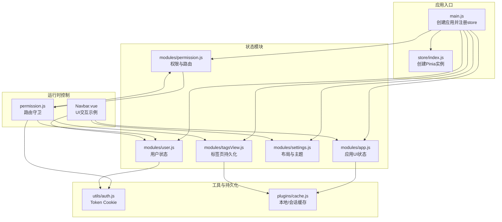
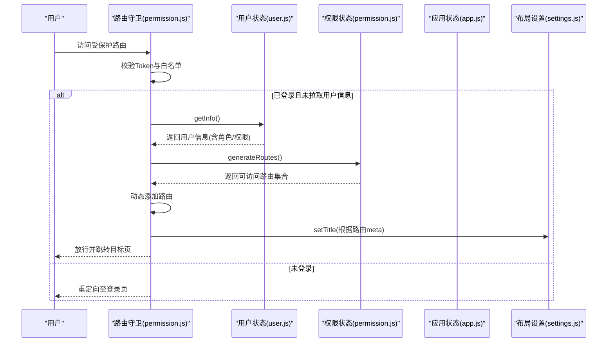
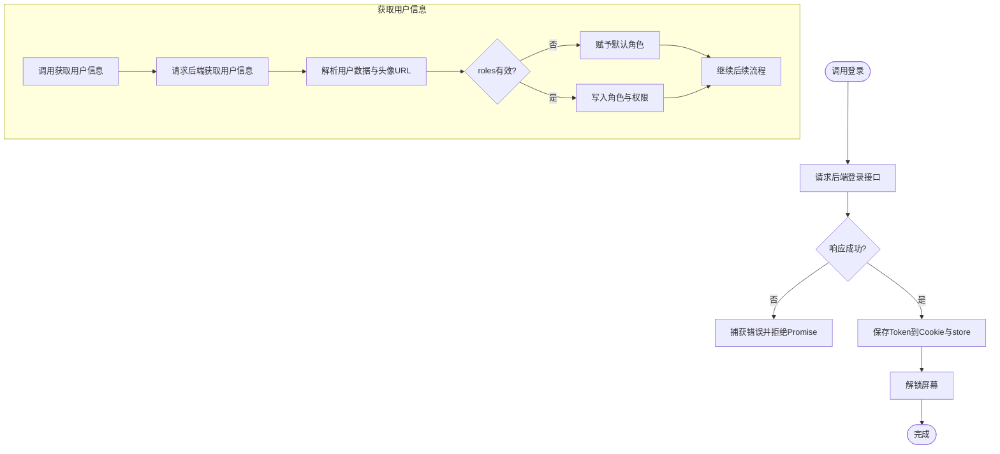
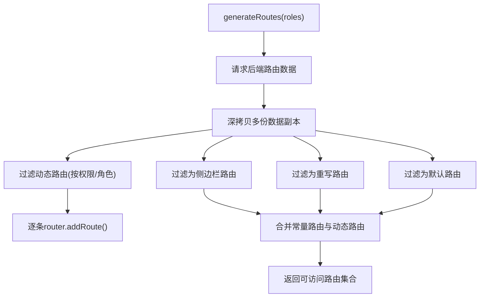
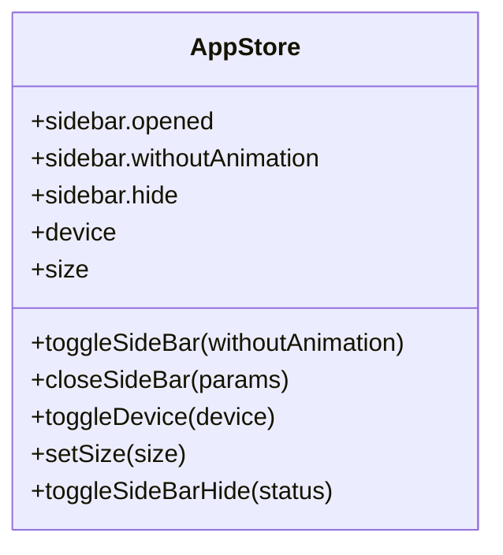
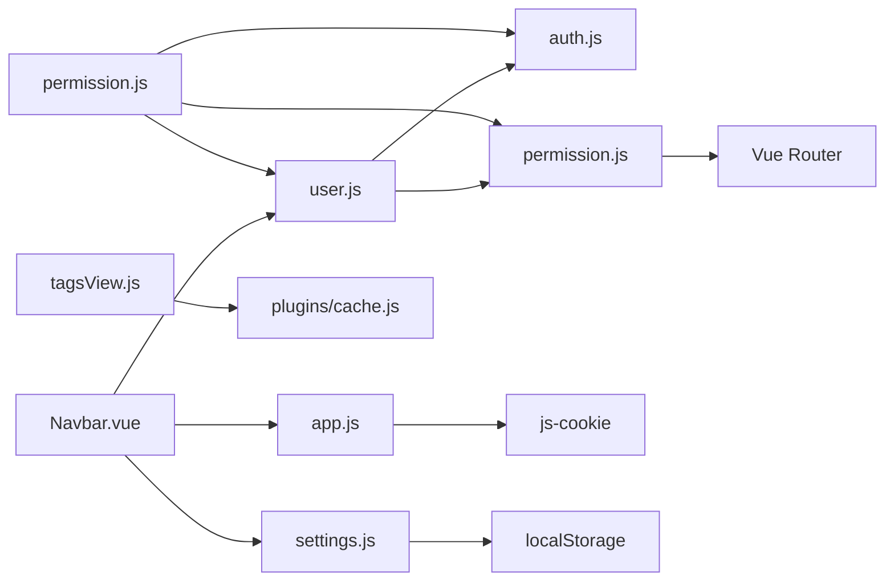

# Pinia状态管理

<cite>
**本文引用的文件**
- [main.js](file://XingChen-Vue3/src/main.js)
- [store/index.js](file://XingChen-Vue3/src/store/index.js)
- [store/modules/user.js](file://XingChen-Vue3/src/store/modules/user.js)
- [store/modules/permission.js](file://XingChen-Vue3/src/store/modules/permission.js)
- [store/modules/app.js](file://XingChen-Vue3/src/store/modules/app.js)
- [store/modules/settings.js](file://XingChen-Vue3/src/store/modules/settings.js)
- [store/modules/tagsView.js](file://XingChen-Vue3/src/store/modules/tagsView.js)
- [utils/auth.js](file://XingChen-Vue3/src/utils/auth.js)
- [plugins/cache.js](file://XingChen-Vue3/src/plugins/cache.js)
- [permission.js](file://XingChen-Vue3/src/permission.js)
- [layout/components/Navbar.vue](file://XingChen-Vue3/src/layout/components/Navbar.vue)
</cite>

## 目录
1. [简介](#简介)
2. [项目结构](#项目结构)
3. [核心组件](#核心组件)
4. [架构总览](#架构总览)
5. [详细组件分析](#详细组件分析)
6. [依赖关系分析](#依赖关系分析)
7. [性能考量](#性能考量)
8. [故障排查指南](#故障排查指南)
9. [结论](#结论)
10. [附录](#附录)

## 简介
本文件系统性梳理了本项目的Pinia状态管理体系，重点覆盖以下方面：
- 状态管理模式与store模块化设计
- 用户状态、权限状态、应用状态的具体实现与交互
- actions与getters的定义与使用方式
- 状态订阅机制与状态同步策略
- 状态持久化策略与最佳实践
- 在用户登录、权限验证、主题切换等场景中的应用实例

## 项目结构
本项目采用“按功能模块划分”的store组织方式，核心入口在应用初始化阶段注入Pinia与各模块store；路由守卫负责在鉴权流程中协调用户、权限与路由的动态装配。

**图表来源**
- [main.js:1-85](file://XingChen-Vue3/src/main.js#L1-L85)
- [store/index.js:1-4](file://XingChen-Vue3/src/store/index.js#L1-L4)
- [store/modules/user.js:1-94](file://XingChen-Vue3/src/store/modules/user.js#L1-L94)
- [store/modules/permission.js:1-135](file://XingChen-Vue3/src/store/modules/permission.js#L1-L135)
- [store/modules/app.js:1-47](file://XingChen-Vue3/src/store/modules/app.js#L1-L47)
- [store/modules/settings.js:1-53](file://XingChen-Vue3/src/store/modules/settings.js#L1-L53)
- [store/modules/tagsView.js:1-227](file://XingChen-Vue3/src/store/modules/tagsView.js#L1-L227)
- [utils/auth.js:1-16](file://XingChen-Vue3/src/utils/auth.js#L1-L16)
- [plugins/cache.js:1-80](file://XingChen-Vue3/src/plugins/cache.js#L1-L80)
- [permission.js:1-78](file://XingChen-Vue3/src/permission.js#L1-L78)
- [layout/components/Navbar.vue:1-200](file://XingChen-Vue3/src/layout/components/Navbar.vue#L1-L200)

**章节来源**
- [main.js:1-85](file://XingChen-Vue3/src/main.js#L1-L85)
- [store/index.js:1-4](file://XingChen-Vue3/src/store/index.js#L1-L4)

## 核心组件
- 用户状态模块（user.js）
  - 负责token、用户身份信息、角色与权限集合的维护
  - 提供登录、获取用户信息、退出登录等动作
- 权限状态模块（permission.js）
  - 负责动态路由生成、侧边栏/顶部导航路由集合
  - 提供路由过滤、动态添加路由、权限校验等能力
- 应用状态模块（app.js）
  - 负责侧边栏开关、设备类型、界面尺寸等UI状态
  - 通过Cookie持久化侧边栏状态与界面尺寸
- 布局与主题模块（settings.js）
  - 负责主题色、导航类型、标签页、动态标题、暗色模式等
  - 通过localStorage持久化布局设置
- 标签页模块（tagsView.js）
  - 负责访问历史、缓存视图、iframe视图与持久化
  - 通过本地缓存实现标签页访问历史的跨会话恢复
- 工具与持久化（auth.js、cache.js）
  - auth.js：基于Cookie的token读写
  - cache.js：封装sessionStorage与localStorage的JSON读写

**章节来源**
- [store/modules/user.js:1-94](file://XingChen-Vue3/src/store/modules/user.js#L1-L94)
- [store/modules/permission.js:1-135](file://XingChen-Vue3/src/store/modules/permission.js#L1-L135)
- [store/modules/app.js:1-47](file://XingChen-Vue3/src/store/modules/app.js#L1-L47)
- [store/modules/settings.js:1-53](file://XingChen-Vue3/src/store/modules/settings.js#L1-L53)
- [store/modules/tagsView.js:1-227](file://XingChen-Vue3/src/store/modules/tagsView.js#L1-L227)
- [utils/auth.js:1-16](file://XingChen-Vue3/src/utils/auth.js#L1-L16)
- [plugins/cache.js:1-80](file://XingChen-Vue3/src/plugins/cache.js#L1-L80)

## 架构总览
Pinia在应用启动时被注册，随后由路由守卫在进入受保护路由前拉取用户信息并生成可访问路由，最终完成动态路由注入与UI状态同步。

**图表来源**
- [permission.js:21-73](file://XingChen-Vue3/src/permission.js#L21-L73)
- [store/modules/user.js:39-75](file://XingChen-Vue3/src/store/modules/user.js#L39-L75)
- [store/modules/permission.js:35-54](file://XingChen-Vue3/src/store/modules/permission.js#L35-L54)
- [store/modules/settings.js:39-43](file://XingChen-Vue3/src/store/modules/settings.js#L39-L43)

## 详细组件分析

### 用户状态模块（user.js）
- 状态字段
  - token：当前登录态标识
  - id/name/nickName/avatar：用户基本信息
  - roles/permissions：角色与权限集合
- 关键动作
  - 登录：调用后端登录接口，设置token并解锁屏幕
  - 获取用户信息：拉取用户详情，处理头像URL，判断初始/过期密码并弹窗引导修改
  - 退出登录：清空token与角色/权限，移除本地token
- 订阅与同步
  - 登录成功后通常触发权限模块重新生成路由
  - 头像URL根据环境变量与协议判断，避免HTTP/HTTPS问题

**图表来源**
- [store/modules/user.js:21-90](file://XingChen-Vue3/src/store/modules/user.js#L21-L90)

**章节来源**
- [store/modules/user.js:1-94](file://XingChen-Vue3/src/store/modules/user.js#L1-L94)
- [utils/auth.js:1-16](file://XingChen-Vue3/src/utils/auth.js#L1-L16)

### 权限状态模块（permission.js）
- 状态字段
  - routes/addRoutes/defaultRoutes/topbarRouters/sidebarRouters：各类路由集合
- 关键动作
  - generateRoutes：向后端请求路由树，过滤为可访问路由，动态注入router
  - setRoutes/setDefaultRoutes/setTopbarRoutes/setSidebarRouters：更新不同维度的路由集合
- 路由转换与过滤
  - 将后端路由字符串映射为组件对象
  - 支持ParentView/InnerLink/Layout等特殊组件
  - 基于权限或角色进行动态过滤

**图表来源**
- [store/modules/permission.js:35-54](file://XingChen-Vue3/src/store/modules/permission.js#L35-L54)
- [store/modules/permission.js:59-132](file://XingChen-Vue3/src/store/modules/permission.js#L59-L132)

**章节来源**
- [store/modules/permission.js:1-135](file://XingChen-Vue3/src/store/modules/permission.js#L1-L135)

### 应用状态模块（app.js）
- 状态字段
  - sidebar.opened/sidebar.withoutAnimation/sidebar.hide：侧边栏状态与动画控制
  - device：设备类型
  - size：界面尺寸
- 关键动作
  - toggleSideBar/closeSideBar：切换/关闭侧边栏并持久化到Cookie
  - toggleDevice/setSize：切换设备类型与界面尺寸
  - toggleSideBarHide：隐藏侧边栏（用于特定布局）

**图表来源**
- [store/modules/app.js:3-44](file://XingChen-Vue3/src/store/modules/app.js#L3-L44)

**章节来源**
- [store/modules/app.js:1-47](file://XingChen-Vue3/src/store/modules/app.js#L1-L47)

### 布局与主题模块（settings.js）
- 状态字段
  - 主题相关：theme、sideTheme、isDark
  - 导航与标签：navType、tagsView/tagsViewPersist/tagsIcon
  - 页面行为：fixedHeader、sidebarLogo、dynamicTitle、footerVisible/footerContent
- 关键动作
  - changeSetting：动态修改布局设置并持久化
  - setTitle：设置页面标题并触发动态标题更新
  - toggleTheme：切换暗色模式并同步系统偏好

**章节来源**
- [store/modules/settings.js:1-53](file://XingChen-Vue3/src/store/modules/settings.js#L1-L53)

### 标签页模块（tagsView.js）
- 功能要点
  - 记录访问历史、缓存视图名称、iframe视图
  - 支持删除单个/其他/全部视图，左右分割删除
  - 可配置是否持久化访问历史到本地存储
- 持久化策略
  - 仅持久化非固钉（affix）视图
  - 使用本地缓存插件统一读写

**章节来源**
- [store/modules/tagsView.js:1-227](file://XingChen-Vue3/src/store/modules/tagsView.js#L1-L227)
- [plugins/cache.js:1-80](file://XingChen-Vue3/src/plugins/cache.js#L1-L80)

### 路由守卫与状态同步（permission.js）
- 流程要点
  - 校验白名单、锁屏状态、Token有效性
  - 未拉取用户信息时先拉取并生成可访问路由
  - 动态注入路由后以replace方式确保导航正确
- 与UI联动
  - 根据路由meta设置页面标题
  - 与锁屏、主题、标签页等状态协同

**章节来源**
- [permission.js:1-78](file://XingChen-Vue3/src/permission.js#L1-L78)

### UI交互示例（Navbar.vue）
- 展示如何在组件中使用多个store
  - 侧边栏开关：appStore.toggleSideBar
  - 主题切换：settingsStore.toggleTheme
  - 退出登录：userStore.logOut
  - 锁屏：lockStore.lockScreen
- 与路由守卫配合
  - 退出登录后跳转首页
  - 锁屏时跳转至锁屏页

**章节来源**
- [layout/components/Navbar.vue:1-200](file://XingChen-Vue3/src/layout/components/Navbar.vue#L1-L200)

## 依赖关系分析
- 模块内聚与耦合
  - user/permission紧密协作：登录后必须拉取用户信息并生成路由
  - app/settings共同影响UI外观与交互体验
  - tagsView与settings联动：是否持久化由settings决定
- 外部依赖
  - Cookie：token与侧边栏状态持久化
  - localStorage：布局设置持久化
  - router：动态路由注入与导航

**图表来源**
- [store/modules/user.js:1-94](file://XingChen-Vue3/src/store/modules/user.js#L1-L94)
- [store/modules/permission.js:1-135](file://XingChen-Vue3/src/store/modules/permission.js#L1-L135)
- [store/modules/app.js:1-47](file://XingChen-Vue3/src/store/modules/app.js#L1-L47)
- [store/modules/settings.js:1-53](file://XingChen-Vue3/src/store/modules/settings.js#L1-L53)
- [store/modules/tagsView.js:1-227](file://XingChen-Vue3/src/store/modules/tagsView.js#L1-L227)
- [utils/auth.js:1-16](file://XingChen-Vue3/src/utils/auth.js#L1-L16)
- [plugins/cache.js:1-80](file://XingChen-Vue3/src/plugins/cache.js#L1-L80)
- [permission.js:1-78](file://XingChen-Vue3/src/permission.js#L1-L78)
- [layout/components/Navbar.vue:1-200](file://XingChen-Vue3/src/layout/components/Navbar.vue#L1-L200)

## 性能考量
- 动态路由按需生成
  - 仅在首次进入受保护路由时拉取并生成，避免一次性加载所有路由
- 组件懒加载与路径匹配
  - 路由组件通过模块映射按需加载，减少首屏体积
- 状态持久化粒度
  - 侧边栏状态与界面尺寸使用Cookie，轻量且即时生效
  - 布局设置使用localStorage，避免频繁IO
  - 标签页访问历史按配置持久化，避免无意义的大量数据写入
- UI过渡与主题切换
  - 主题切换支持视图过渡动画降级回立即切换，保证流畅性

[本节为通用建议，无需列出具体文件来源]

## 故障排查指南
- 登录后无法进入目标页
  - 检查路由守卫是否成功拉取用户信息并生成路由
  - 确认动态路由已注入且未被拦截
  - 参考：[permission.js:39-58](file://XingChen-Vue3/src/permission.js#L39-L58)
- 退出登录后仍显示受保护内容
  - 确认退出登录动作已清空token与角色/权限
  - 参考：[store/modules/user.js:76-89](file://XingChen-Vue3/src/store/modules/user.js#L76-L89)
- 侧边栏状态未持久化
  - 检查Cookie写入与读取逻辑
  - 参考：[store/modules/app.js:16-32](file://XingChen-Vue3/src/store/modules/app.js#L16-L32)，[utils/auth.js:1-16](file://XingChen-Vue3/src/utils/auth.js#L1-L16)
- 标签页历史未恢复
  - 检查settings中是否开启tagsViewPersist
  - 确认本地缓存键值存在
  - 参考：[store/modules/tagsView.js:6-18](file://XingChen-Vue3/src/store/modules/tagsView.js#L6-L18)，[plugins/cache.js:1-80](file://XingChen-Vue3/src/plugins/cache.js#L1-L80)

**章节来源**
- [permission.js:39-58](file://XingChen-Vue3/src/permission.js#L39-L58)
- [store/modules/user.js:76-89](file://XingChen-Vue3/src/store/modules/user.js#L76-L89)
- [store/modules/app.js:16-32](file://XingChen-Vue3/src/store/modules/app.js#L16-L32)
- [store/modules/tagsView.js:6-18](file://XingChen-Vue3/src/store/modules/tagsView.js#L6-L18)
- [utils/auth.js:1-16](file://XingChen-Vue3/src/utils/auth.js#L1-L16)
- [plugins/cache.js:1-80](file://XingChen-Vue3/src/plugins/cache.js#L1-L80)

## 结论
本项目通过清晰的模块划分与路由守卫协同，实现了从登录鉴权到动态路由注入再到UI状态同步的完整闭环。用户、权限、应用与布局四大状态域职责明确，结合Cookie与localStorage的轻量持久化策略，在保证用户体验的同时兼顾了性能与可维护性。建议在后续迭代中持续关注路由组件懒加载与标签页历史的性能表现，并完善跨会话状态的一致性校验。

[本节为总结性内容，无需列出具体文件来源]

## 附录

### 状态管理模式与最佳实践
- 状态设计原则
  - 单一职责：每个模块只负责一个业务域
  - 最小必要：仅存储UI与业务必需的状态
  - 可序列化：便于持久化与SSR支持
- 模块间通信
  - 通过store之间的直接调用实现解耦
  - 路由守卫作为跨模块协调点
- 性能优化技巧
  - 动态路由与组件懒加载
  - 选择合适的持久化介质（Cookie/localStorage/sessionStorage）
  - 控制标签页历史数量与持久化范围

[本节为通用建议，无需列出具体文件来源]