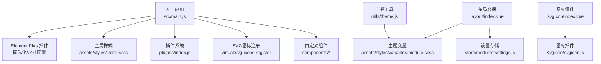
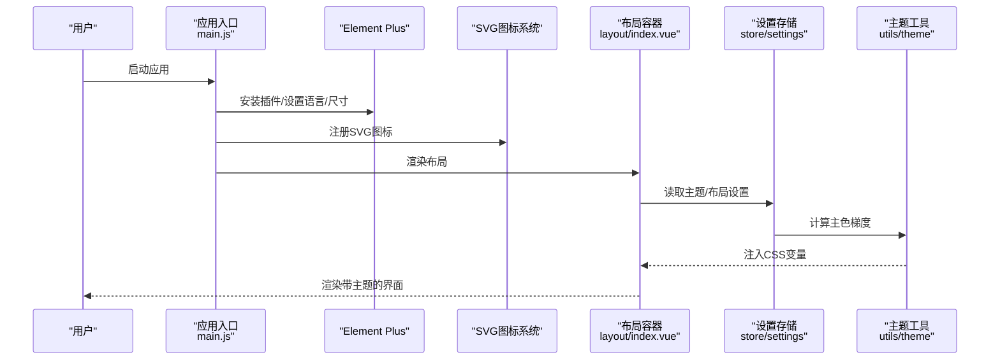
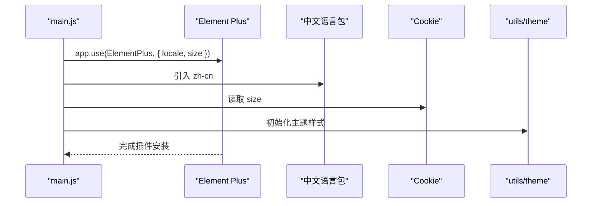
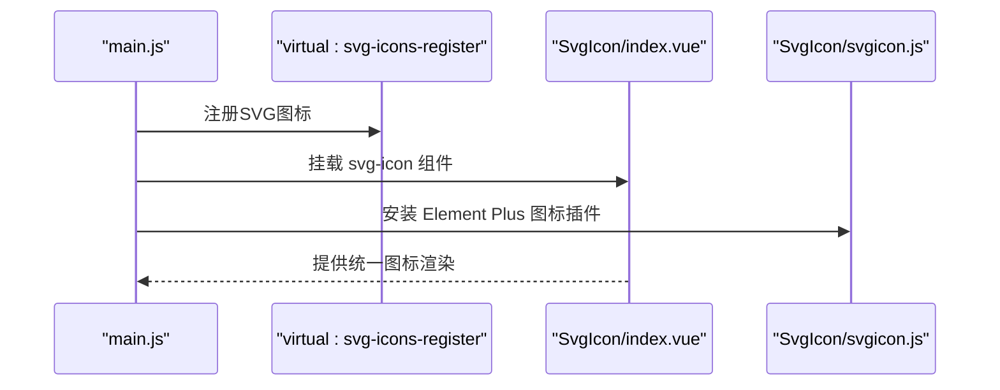
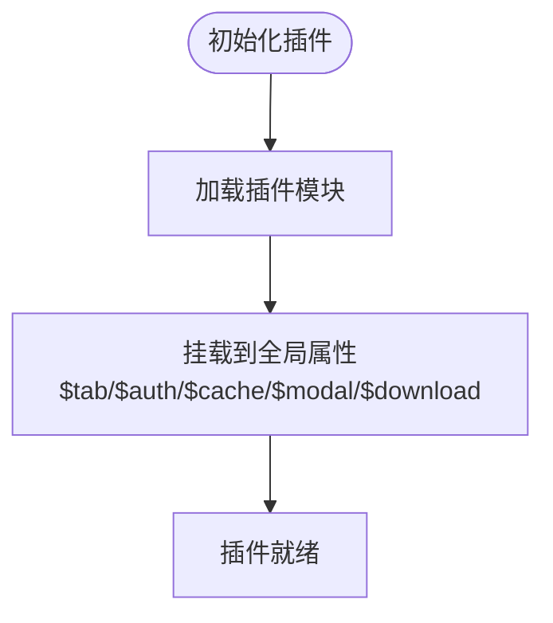
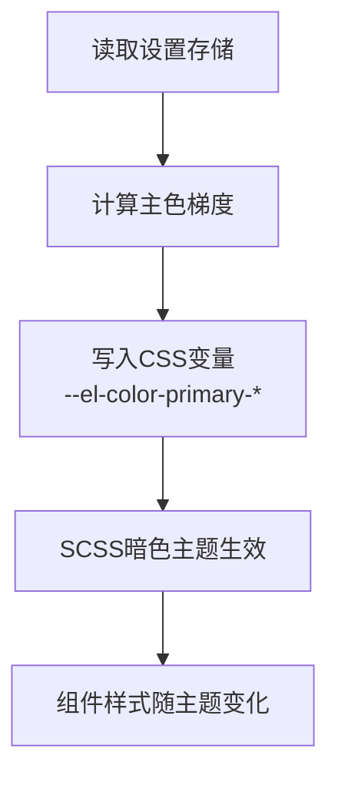
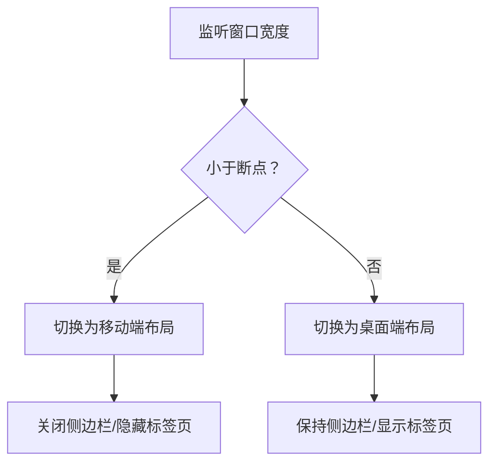
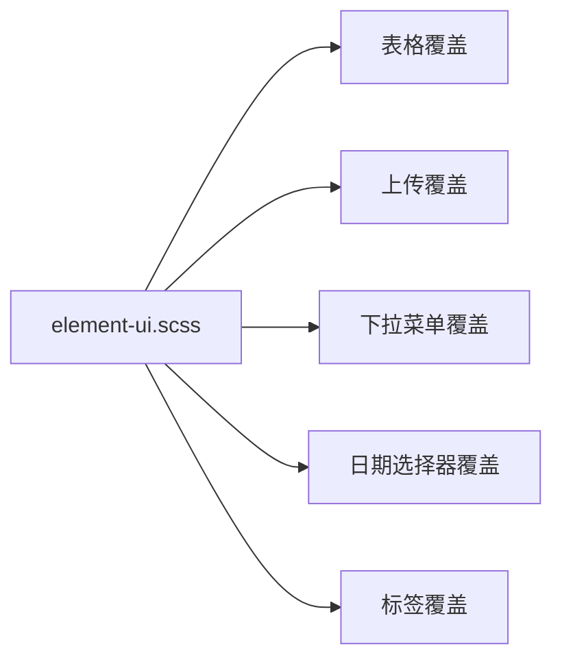
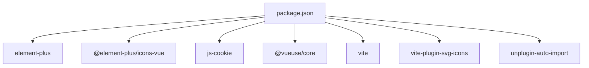

# UI组件库集成

<cite>
**本文引用的文件**
- [XingChen-Vue3/src/main.js](file://XingChen-Vue3/src/main.js)
- [XingChen-Vue3/src/App.vue](file://XingChen-Vue3/src/App.vue)
- [XingChen-Vue3/vite.config.js](file://XingChen-Vue3/vite.config.js)
- [XingChen-Vue3/src/settings.js](file://XingChen-Vue3/src/settings.js)
- [XingChen-Vue3/src/assets/styles/element-ui.scss](file://XingChen-Vue3/src/assets/styles/element-ui.scss)
- [XingChen-Vue3/src/components/SvgIcon/index.vue](file://XingChen-Vue3/src/components/SvgIcon/index.vue)
- [XingChen-Vue3/src/components/SvgIcon/svgicon.js](file://XingChen-Vue3/src/components/SvgIcon/svgicon.js)
- [XingChen-Vue3/src/plugins/index.js](file://XingChen-Vue3/src/plugins/index.js)
- [XingChen-Vue3/src/utils/theme.js](file://XingChen-Vue3/src/utils/theme.js)
- [XingChen-Vue3/src/store/modules/settings.js](file://XingChen-Vue3/src/store/modules/settings.js)
- [XingChen-Vue3/src/layout/index.vue](file://XingChen-Vue3/src/layout/index.vue)
- [XingChen-Vue3/src/assets/styles/variables.module.scss](file://XingChen-Vue3/src/assets/styles/variables.module.scss)
- [XingChen-Vue3/package.json](file://XingChen-Vue3/package.json)
</cite>

## 目录
1. [简介](#简介)
2. [项目结构](#项目结构)
3. [核心组件](#核心组件)
4. [架构总览](#架构总览)
5. [详细组件分析](#详细组件分析)
6. [依赖关系分析](#依赖关系分析)
7. [性能考量](#性能考量)
8. [故障排查指南](#故障排查指南)
9. [结论](#结论)
10. [附录](#附录)

## 简介
本文件面向“健康管理系统”前端工程，系统性梳理Element Plus组件库的集成配置、主题定制与国际化设置，详解SVG图标系统、全局样式管理与插件体系，并给出暗黑模式、响应式设计与组件样式覆盖策略。同时总结组件按需引入、样式优化与性能优化的最佳实践，展示如何在健康管理系统中高效构建美观、易用的用户界面。

## 项目结构
本项目采用Vue 3 + Vite的现代化前端架构，UI层以Element Plus为核心，结合自研SVG图标、主题切换与布局系统，形成可扩展、可维护的组件库集成方案。

图示来源
- [XingChen-Vue3/src/main.js:1-85](file://XingChen-Vue3/src/main.js#L1-L85)
- [XingChen-Vue3/src/layout/index.vue:1-116](file://XingChen-Vue3/src/layout/index.vue#L1-L116)
- [XingChen-Vue3/src/assets/styles/variables.module.scss:1-310](file://XingChen-Vue3/src/assets/styles/variables.module.scss#L1-L310)
- [XingChen-Vue3/src/store/modules/settings.js:1-53](file://XingChen-Vue3/src/store/modules/settings.js#L1-L53)
- [XingChen-Vue3/src/utils/theme.js:1-50](file://XingChen-Vue3/src/utils/theme.js#L1-L50)
- [XingChen-Vue3/src/components/SvgIcon/index.vue:1-54](file://XingChen-Vue3/src/components/SvgIcon/index.vue#L1-L54)
- [XingChen-Vue3/src/components/SvgIcon/svgicon.js:1-11](file://XingChen-Vue3/src/components/SvgIcon/svgicon.js#L1-L11)
- [XingChen-Vue3/src/plugins/index.js:1-19](file://XingChen-Vue3/src/plugins/index.js#L1-L19)

章节来源
- [XingChen-Vue3/src/main.js:1-85](file://XingChen-Vue3/src/main.js#L1-L85)
- [XingChen-Vue3/vite.config.js:1-80](file://XingChen-Vue3/vite.config.js#L1-L80)

## 核心组件
- Element Plus集成：在入口文件中完成插件安装、国际化与默认尺寸配置，并引入暗黑模式CSS变量。
- SVG图标系统：通过Vite插件与虚拟模块自动注册SVG图标，统一使用SvgIcon组件渲染。
- 插件系统：集中挂载认证、缓存、模态框、下载等全局能力，便于业务复用。
- 主题与暗黑模式：通过CSS变量与工具函数动态计算主色及明暗梯度，结合VueUse实现暗黑模式切换。
- 响应式布局：基于窗口宽度判断设备类型，控制侧边栏与标签页行为。

章节来源
- [XingChen-Vue3/src/main.js:5-82](file://XingChen-Vue3/src/main.js#L5-L82)
- [XingChen-Vue3/src/components/SvgIcon/index.vue:1-54](file://XingChen-Vue3/src/components/SvgIcon/index.vue#L1-L54)
- [XingChen-Vue3/src/plugins/index.js:1-19](file://XingChen-Vue3/src/plugins/index.js#L1-L19)
- [XingChen-Vue3/src/utils/theme.js:1-50](file://XingChen-Vue3/src/utils/theme.js#L1-L50)
- [XingChen-Vue3/src/store/modules/settings.js:1-53](file://XingChen-Vue3/src/store/modules/settings.js#L1-L53)
- [XingChen-Vue3/src/layout/index.vue:16-58](file://XingChen-Vue3/src/layout/index.vue#L16-L58)

## 架构总览
下图展示了UI层从应用入口到组件渲染的关键流程，以及主题与样式的联动关系。

图示来源
- [XingChen-Vue3/src/main.js:77-82](file://XingChen-Vue3/src/main.js#L77-L82)
- [XingChen-Vue3/src/App.vue:9-14](file://XingChen-Vue3/src/App.vue#L9-L14)
- [XingChen-Vue3/src/layout/index.vue:1-116](file://XingChen-Vue3/src/layout/index.vue#L1-L116)
- [XingChen-Vue3/src/store/modules/settings.js:14-29](file://XingChen-Vue3/src/store/modules/settings.js#L14-L29)
- [XingChen-Vue3/src/utils/theme.js:2-10](file://XingChen-Vue3/src/utils/theme.js#L2-L10)

## 详细组件分析

### Element Plus集成与国际化
- 插件安装：在入口文件中安装Element Plus，并传入语言与默认尺寸参数；尺寸来源于Cookie，支持large/default/small三档。
- 国际化：引入Element Plus内置中文语言包，确保组件文案本地化。
- 暗黑模式：引入暗黑模式CSS变量文件，配合主题工具动态更新主色梯度。

图示来源
- [XingChen-Vue3/src/main.js:77-82](file://XingChen-Vue3/src/main.js#L77-L82)
- [XingChen-Vue3/src/utils/theme.js:2-10](file://XingChen-Vue3/src/utils/theme.js#L2-L10)

章节来源
- [XingChen-Vue3/src/main.js:5-82](file://XingChen-Vue3/src/main.js#L5-L82)

### SVG图标系统实现
- 图标注册：通过Vite插件与虚拟模块自动扫描并注册SVG图标，避免手动导入。
- 组件封装：SvgIcon组件统一渲染，支持类名、颜色与图标名称绑定。
- 图标插件：SvgIcon插件批量注册Element Plus图标，便于全局使用。

图示来源
- [XingChen-Vue3/src/main.js:21-24](file://XingChen-Vue3/src/main.js#L21-L24)
- [XingChen-Vue3/src/components/SvgIcon/index.vue:1-54](file://XingChen-Vue3/src/components/SvgIcon/index.vue#L1-L54)
- [XingChen-Vue3/src/components/SvgIcon/svgicon.js:1-11](file://XingChen-Vue3/src/components/SvgIcon/svgicon.js#L1-L11)

章节来源
- [XingChen-Vue3/src/main.js:21-24](file://XingChen-Vue3/src/main.js#L21-L24)
- [XingChen-Vue3/src/components/SvgIcon/index.vue:1-54](file://XingChen-Vue3/src/components/SvgIcon/index.vue#L1-L54)
- [XingChen-Vue3/src/components/SvgIcon/svgicon.js:1-11](file://XingChen-Vue3/src/components/SvgIcon/svgicon.js#L1-L11)

### 插件系统与全局能力
- 插件聚合：在插件入口集中挂载页签、认证、缓存、模态框、下载等全局属性，便于在任意组件中直接调用。
- 使用方式：通过app.config.globalProperties.$xxx访问，减少重复注入与样板代码。

图示来源
- [XingChen-Vue3/src/plugins/index.js:7-18](file://XingChen-Vue3/src/plugins/index.js#L7-L18)

章节来源
- [XingChen-Vue3/src/plugins/index.js:1-19](file://XingChen-Vue3/src/plugins/index.js#L1-L19)

### 主题定制与暗黑模式
- 主题变量：通过CSS变量与SCSS模块导出，定义亮/暗两套主题，覆盖侧边栏、导航栏、标签页、表格等组件。
- 动态计算：主题工具根据主色生成明/暗梯度，写入CSS变量，实现主色与派生色的统一替换。
- 暗黑模式：结合VueUse的useDark/useToggle，切换html.dark类，驱动SCSS中的暗色变量生效。

图示来源
- [XingChen-Vue3/src/store/modules/settings.js:14-29](file://XingChen-Vue3/src/store/modules/settings.js#L14-L29)
- [XingChen-Vue3/src/utils/theme.js:2-10](file://XingChen-Vue3/src/utils/theme.js#L2-L10)
- [XingChen-Vue3/src/assets/styles/variables.module.scss:84-131](file://XingChen-Vue3/src/assets/styles/variables.module.scss#L84-L131)

章节来源
- [XingChen-Vue3/src/utils/theme.js:1-50](file://XingChen-Vue3/src/utils/theme.js#L1-L50)
- [XingChen-Vue3/src/store/modules/settings.js:1-53](file://XingChen-Vue3/src/store/modules/settings.js#L1-L53)
- [XingChen-Vue3/src/assets/styles/variables.module.scss:1-310](file://XingChen-Vue3/src/assets/styles/variables.module.scss#L1-L310)

### 响应式设计与布局
- 设备检测：通过窗口宽度与断点常量判断移动端/桌面端，控制侧边栏开关与标签页显示。
- 布局容器：根据设备类型与侧边栏状态动态切换类名，适配不同屏幕尺寸。
- 固定头部：根据设置决定是否固定头部，提升移动端阅读体验。

图示来源
- [XingChen-Vue3/src/layout/index.vue:37-53](file://XingChen-Vue3/src/layout/index.vue#L37-L53)

章节来源
- [XingChen-Vue3/src/layout/index.vue:1-116](file://XingChen-Vue3/src/layout/index.vue#L1-L116)

### 组件样式覆盖策略
- 全局样式：通过element-ui.scss对Element Plus常见问题进行覆盖，如对话框定位、上传区域、下拉菜单、日期选择器等。
- 组件级覆盖：针对表格、标签、按钮等组件提供小间距、固定宽度、状态列等样式类，提升信息密度与一致性。

图示来源
- [XingChen-Vue3/src/assets/styles/element-ui.scss:1-96](file://XingChen-Vue3/src/assets/styles/element-ui.scss#L1-L96)

章节来源
- [XingChen-Vue3/src/assets/styles/element-ui.scss:1-96](file://XingChen-Vue3/src/assets/styles/element-ui.scss#L1-L96)

## 依赖关系分析
- 组件库与工具：Element Plus、@element-plus/icons-vue、js-cookie、@vueuse/core等。
- 构建与插件：Vite、vite-plugin-svg-icons、unplugin-auto-import等。
- 样式与主题：Sass、SCSS模块化变量、CSS变量。

图示来源
- [XingChen-Vue3/package.json:18-46](file://XingChen-Vue3/package.json#L18-L46)

章节来源
- [XingChen-Vue3/package.json:1-54](file://XingChen-Vue3/package.json#L1-L54)

## 性能考量
- 按需引入：建议结合自动导入与图标插件，仅引入实际使用的组件与图标，减少打包体积。
- 图标懒加载：SVG图标通过虚拟模块注册，避免手动导入导致的冗余资源。
- 样式隔离：通过SCSS模块化与CSS变量，降低样式冲突与重绘成本。
- 构建优化：Vite默认启用压缩与分块策略，结合源码映射配置，平衡调试与性能。

## 故障排查指南
- 国际化不生效：检查是否正确引入中文语言包并传入Element Plus配置。
- 图标不显示：确认SVG图标已通过虚拟模块注册，组件使用方式正确。
- 主题色异常：检查主题工具是否正确计算并写入CSS变量，确认SCSS暗色变量是否生效。
- 响应式异常：确认断点逻辑与设备检测是否正确，移动端侧边栏与标签页行为符合预期。
- 尺寸设置无效：确认Cookie中size键是否存在，Element Plus是否正确读取。

章节来源
- [XingChen-Vue3/src/main.js:77-82](file://XingChen-Vue3/src/main.js#L77-L82)
- [XingChen-Vue3/src/components/SvgIcon/index.vue:23-33](file://XingChen-Vue3/src/components/SvgIcon/index.vue#L23-L33)
- [XingChen-Vue3/src/utils/theme.js:2-10](file://XingChen-Vue3/src/utils/theme.js#L2-L10)
- [XingChen-Vue3/src/layout/index.vue:37-53](file://XingChen-Vue3/src/layout/index.vue#L37-L53)

## 结论
本项目以Element Plus为核心，结合SVG图标系统、插件体系与主题/暗黑模式机制，形成了完整的UI组件库集成方案。通过CSS变量与SCSS模块化，实现了主题一致与样式可控；通过响应式布局与设置存储，提升了跨设备体验。建议在后续迭代中进一步推进按需引入与样式优化，持续提升性能与可维护性。

## 附录
- 在健康管理系统中应用建议
  - 使用SvgIcon统一管理图标，减少冗余资源。
  - 通过设置存储与主题工具实现主色与暗黑模式切换，满足用户个性化需求。
  - 对高频组件（表格、表单、弹窗）统一样式覆盖，保证界面一致性。
  - 结合响应式布局策略，优化移动端交互体验。