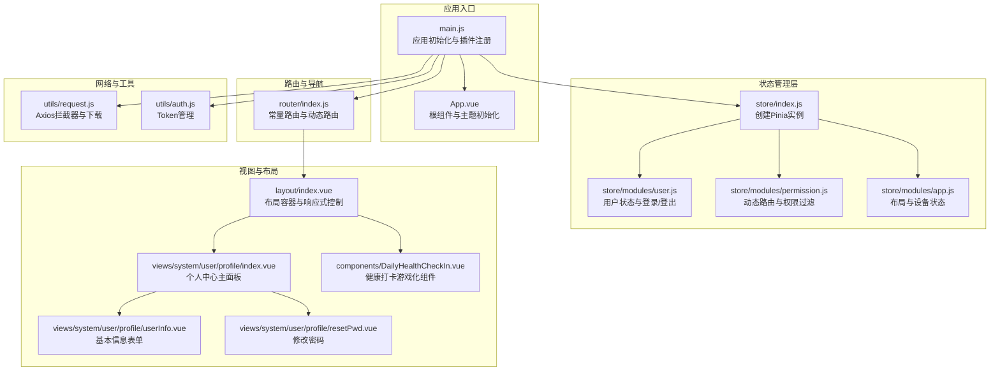
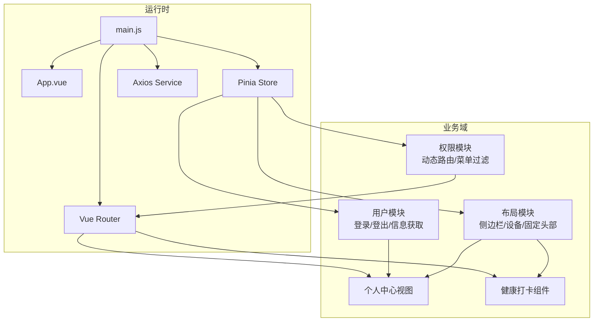
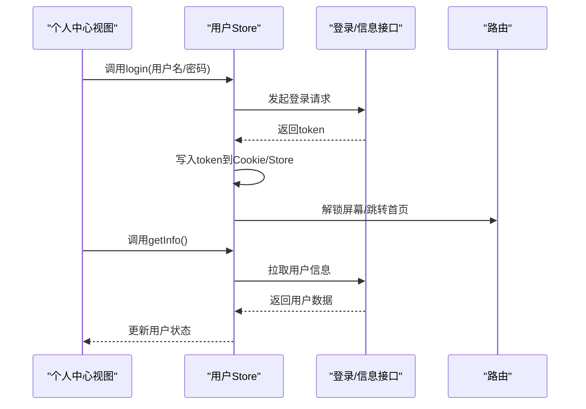
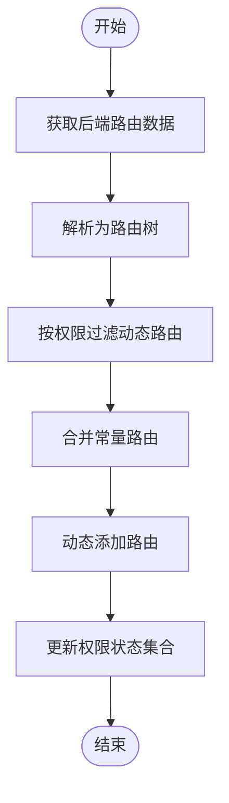
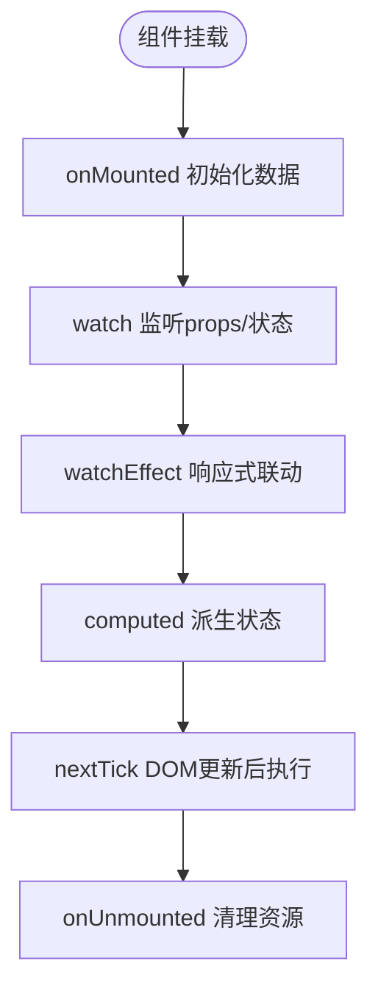
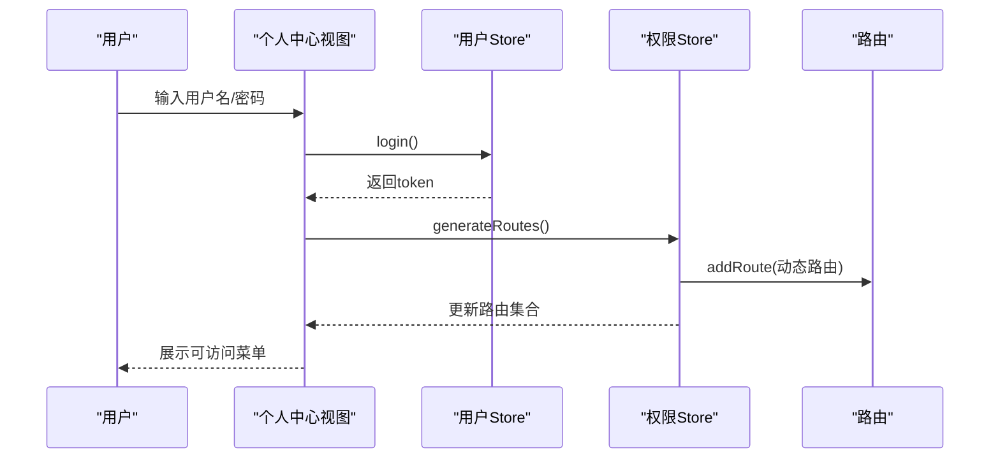
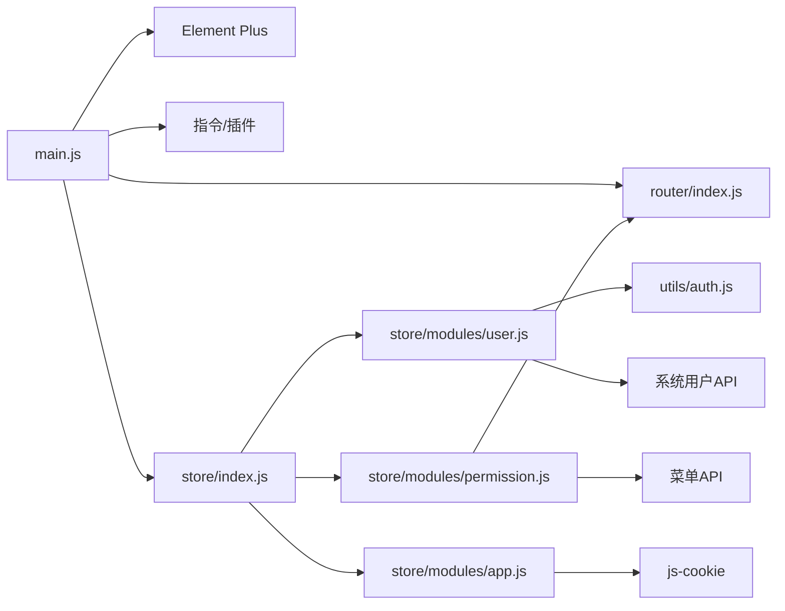

# Vue3 Composition API架构

<cite>
**本文档引用的文件**
- [main.js](file://XingChen-Vue3/src/main.js)
- [App.vue](file://XingChen-Vue3/src/App.vue)
- [store/index.js](file://XingChen-Vue3/src/store/index.js)
- [router/index.js](file://XingChen-Vue3/src/router/index.js)
- [store/modules/user.js](file://XingChen-Vue3/src/store/modules/user.js)
- [store/modules/permission.js](file://XingChen-Vue3/src/store/modules/permission.js)
- [store/modules/app.js](file://XingChen-Vue3/src/store/modules/app.js)
- [utils/request.js](file://XingChen-Vue3/src/utils/request.js)
- [utils/auth.js](file://XingChen-Vue3/src/utils/auth.js)
- [views/system/user/profile/index.vue](file://XingChen-Vue3/src/views/system/user/profile/index.vue)
- [views/system/user/profile/userInfo.vue](file://XingChen-Vue3/src/views/system/user/profile/userInfo.vue)
- [views/system/user/profile/resetPwd.vue](file://XingChen-Vue3/src/views/system/user/profile/resetPwd.vue)
- [layout/index.vue](file://XingChen-Vue3/src/layout/index.vue)
- [components/DailyHealthCheckIn.vue](file://XingChen-Vue3/src/components/DailyHealthCheckIn.vue)
</cite>

## 目录
1. [引言](#引言)
2. [项目结构](#项目结构)
3. [核心组件](#核心组件)
4. [架构总览](#架构总览)
5. [详细组件分析](#详细组件分析)
6. [依赖关系分析](#依赖关系分析)
7. [性能考虑](#性能考虑)
8. [故障排除指南](#故障排除指南)
9. [结论](#结论)
10. [附录](#附录)

## 引言
本文件系统性阐述基于Vue3 Composition API的健康管理系统架构，重点覆盖setup函数使用、响应式数据管理（ref、reactive、computed、watch）、生命周期钩子、组合式函数封装与逻辑复用、组件间通信、provide/inject、Teleport、Suspense等高级特性，并结合实际业务场景（用户状态管理、权限控制、数据获取）给出最佳实践与可视化流程图。

## 项目结构
该系统采用前后端分离架构，前端基于Vue3 + Vite，使用Element Plus作为UI框架，Pinia作为状态管理，Axios封装网络层，配合路由守卫与权限过滤实现动态菜单与访问控制。

**图表来源**
- [main.js:1-85](file://XingChen-Vue3/src/main.js#L1-L85)
- [App.vue:1-16](file://XingChen-Vue3/src/App.vue#L1-L16)
- [store/index.js:1-4](file://XingChen-Vue3/src/store/index.js#L1-L4)
- [store/modules/user.js:1-94](file://XingChen-Vue3/src/store/modules/user.js#L1-L94)
- [store/modules/permission.js:1-135](file://XingChen-Vue3/src/store/modules/permission.js#L1-L135)
- [store/modules/app.js:1-47](file://XingChen-Vue3/src/store/modules/app.js#L1-L47)
- [router/index.js:1-197](file://XingChen-Vue3/src/router/index.js#L1-L197)
- [utils/request.js:1-154](file://XingChen-Vue3/src/utils/request.js#L1-L154)
- [utils/auth.js:1-16](file://XingChen-Vue3/src/utils/auth.js#L1-L16)
- [layout/index.vue:1-116](file://XingChen-Vue3/src/layout/index.vue#L1-L116)
- [views/system/user/profile/index.vue:1-95](file://XingChen-Vue3/src/views/system/user/profile/index.vue#L1-L95)
- [views/system/user/profile/userInfo.vue:1-68](file://XingChen-Vue3/src/views/system/user/profile/userInfo.vue#L1-L68)
- [views/system/user/profile/resetPwd.vue:1-60](file://XingChen-Vue3/src/views/system/user/profile/resetPwd.vue#L1-L60)
- [components/DailyHealthCheckIn.vue:1-281](file://XingChen-Vue3/src/components/DailyHealthCheckIn.vue#L1-L281)

**章节来源**
- [main.js:1-85](file://XingChen-Vue3/src/main.js#L1-L85)
- [router/index.js:1-197](file://XingChen-Vue3/src/router/index.js#L1-L197)

## 核心组件
- 应用入口与插件注册：在入口文件中完成Element Plus、全局组件、指令、SVG图标、权限控制等初始化，并挂载全局工具方法。
- 根组件：负责主题样式初始化与生命周期触发。
- Pinia状态管理：用户状态、权限状态、应用状态模块化管理。
- 路由系统：常量路由与动态路由分离，按权限动态注入。
- 网络层：统一拦截器、重复提交防护、错误处理、下载能力。
- 视图与布局：布局容器、个人中心、健康打卡组件等。

**章节来源**
- [main.js:1-85](file://XingChen-Vue3/src/main.js#L1-L85)
- [App.vue:1-16](file://XingChen-Vue3/src/App.vue#L1-L16)
- [store/index.js:1-4](file://XingChen-Vue3/src/store/index.js#L1-L4)
- [router/index.js:1-197](file://XingChen-Vue3/src/router/index.js#L1-L197)
- [utils/request.js:1-154](file://XingChen-Vue3/src/utils/request.js#L1-L154)

## 架构总览
系统采用“入口初始化 → 状态管理 → 路由与权限 → 视图与组件”的分层架构。Composition API贯穿所有功能模块，通过setup函数集中声明响应式状态、计算属性、监听器与副作用，提升可读性与可维护性。

**图表来源**
- [main.js:1-85](file://XingChen-Vue3/src/main.js#L1-L85)
- [store/modules/user.js:1-94](file://XingChen-Vue3/src/store/modules/user.js#L1-L94)
- [store/modules/permission.js:1-135](file://XingChen-Vue3/src/store/modules/permission.js#L1-L135)
- [store/modules/app.js:1-47](file://XingChen-Vue3/src/store/modules/app.js#L1-L47)
- [router/index.js:1-197](file://XingChen-Vue3/src/router/index.js#L1-L197)
- [layout/index.vue:1-116](file://XingChen-Vue3/src/layout/index.vue#L1-L116)
- [views/system/user/profile/index.vue:1-95](file://XingChen-Vue3/src/views/system/user/profile/index.vue#L1-L95)
- [components/DailyHealthCheckIn.vue:1-281](file://XingChen-Vue3/src/components/DailyHealthCheckIn.vue#L1-L281)

## 详细组件分析

### 用户状态管理（用户模块）
- 设计理念：以defineStore定义用户命名空间，集中管理token、用户信息、角色与权限；通过actions封装登录、获取信息、登出等业务动作。
- setup使用：在视图中通过解构store实例访问状态与动作，避免模板内直接调用复杂逻辑。
- 生命周期：在进入个人中心或需要刷新信息时，使用onMounted触发获取用户信息。
- 数据流：登录成功写入token并更新store；登出清空token与权限；信息获取失败统一错误提示。

**图表来源**
- [store/modules/user.js:1-94](file://XingChen-Vue3/src/store/modules/user.js#L1-L94)
- [views/system/user/profile/index.vue:1-95](file://XingChen-Vue3/src/views/system/user/profile/index.vue#L1-L95)

**章节来源**
- [store/modules/user.js:1-94](file://XingChen-Vue3/src/store/modules/user.js#L1-L94)
- [views/system/user/profile/index.vue:1-95](file://XingChen-Vue3/src/views/system/user/profile/index.vue#L1-L95)

### 权限控制与动态路由（权限模块）
- 设计理念：将路由分为常量路由与动态路由，按角色/权限过滤后注入；支持顶部导航与侧边栏路由集合分离。
- setup使用：在权限模块中使用defineStore声明状态与动作，generateRoutes异步获取后端路由树，转换为组件并动态addRoute。
- 过滤策略：filterDynamicRoutes根据权限标识判断是否渲染；loadView通过glob映射组件路径。
- 生命周期：在登录后调用generateRoutes，随后将路由集合写入store供布局与导航使用。

**图表来源**
- [store/modules/permission.js:1-135](file://XingChen-Vue3/src/store/modules/permission.js#L1-L135)
- [router/index.js:1-197](file://XingChen-Vue3/src/router/index.js#L1-L197)

**章节来源**
- [store/modules/permission.js:1-135](file://XingChen-Vue3/src/store/modules/permission.js#L1-L135)
- [router/index.js:1-197](file://XingChen-Vue3/src/router/index.js#L1-L197)

### 响应式数据管理与生命周期
- ref/reactive/computed/watch：在个人中心与健康打卡组件中广泛使用，分别用于标量状态、复合对象、派生状态与变更侦听。
- 生命周期：onMounted用于初始化数据；watch/watchEffect用于响应式联动与设备尺寸变化；nextTick确保DOM更新后再执行主题初始化。
- 最佳实践：将副作用集中在setup内，避免在模板中直接操作复杂逻辑；对大对象使用reactive，对简单标量使用ref；对只读或轻量派生使用computed。

**图表来源**
- [views/system/user/profile/userInfo.vue:1-68](file://XingChen-Vue3/src/views/system/user/profile/userInfo.vue#L1-L68)
- [views/system/user/profile/resetPwd.vue:1-60](file://XingChen-Vue3/src/views/system/user/profile/resetPwd.vue#L1-L60)
- [App.vue:1-16](file://XingChen-Vue3/src/App.vue#L1-L16)

**章节来源**
- [views/system/user/profile/userInfo.vue:1-68](file://XingChen-Vue3/src/views/system/user/profile/userInfo.vue#L1-L68)
- [views/system/user/profile/resetPwd.vue:1-60](file://XingChen-Vue3/src/views/system/user/profile/resetPwd.vue#L1-L60)
- [App.vue:1-16](file://XingChen-Vue3/src/App.vue#L1-L16)

### 组合式函数封装与逻辑复用
- 封装模式：将可复用逻辑抽取为组合式函数，例如将“表单校验”“下载文件”“权限判断”等抽象为独立函数，供多个组件复用。
- 逻辑复用策略：通过defineStore共享状态，通过provide/inject向下传递依赖，通过Teleport实现跨层级渲染，通过Suspense处理异步组件占位。
- 在健康管理系统中的应用：将“用户信息获取”“密码修改”“权限过滤”等封装为组合式函数，减少重复代码，提升可测试性。

[本节为概念性内容，无需列出具体文件来源]

### 组件间通信机制
- Props/Emits：父子组件通过props传递数据，通过emits触发事件。
- Provide/Inject：在布局容器中注入主题、设备、侧边栏状态，子组件按需注入使用。
- Teleport：将模态框、通知等挂载到body，避免CSS层级与滚动影响。
- Event Bus：通过全局事件总线或Pinia共享状态替代传统Event Bus，降低耦合。

[本节为概念性内容，无需列出具体文件来源]

### provide/inject依赖注入
- 在布局容器中注入主题色、设备类型、侧边栏开关状态等，子组件通过inject获取并响应式使用。
- 优点：避免多层props传递，提升组件复用性与可维护性。

**章节来源**
- [layout/index.vue:1-116](file://XingChen-Vue3/src/layout/index.vue#L1-L116)

### Teleport组件传送
- 场景：弹窗、模态框、全局通知等需要脱离当前层级，挂载到body下，避免z-index与滚动条冲突。
- 实践：在需要的组件中使用Teleport包裹，确保样式与交互不受父级容器影响。

[本节为概念性内容，无需列出具体文件来源]

### Suspense异步组件
- 场景：异步路由、懒加载组件、远程数据获取时提供loading占位。
- 实践：在路由配置中使用动态导入，结合Suspense占位符，提升用户体验。

[本节为概念性内容，无需列出具体文件来源]

### 健康管理系统实战示例

#### 用户状态管理与权限控制
- 登录流程：用户输入凭据 → 调用用户store的login → 成功后写入token并跳转 → 获取用户信息并提示初始/过期密码。
- 权限过滤：登录后调用权限store的generateRoutes → 后端返回路由树 → 前端按权限过滤并动态注入 → 更新导航与侧边栏。

**图表来源**
- [store/modules/user.js:1-94](file://XingChen-Vue3/src/store/modules/user.js#L1-L94)
- [store/modules/permission.js:1-135](file://XingChen-Vue3/src/store/modules/permission.js#L1-L135)
- [router/index.js:1-197](file://XingChen-Vue3/src/router/index.js#L1-L197)

#### 数据获取最佳实践
- 网络层：统一拦截器处理token、重复提交、错误提示与下载；在视图中仅关注业务数据结构。
- 表单校验：在组合式函数中定义rules，使用watch监听props回显，提交时统一校验与提示。
- 响应式更新：使用watchEffect监听窗口尺寸，动态切换移动端/桌面端布局；使用computed派生状态驱动UI。

**章节来源**
- [utils/request.js:1-154](file://XingChen-Vue3/src/utils/request.js#L1-L154)
- [views/system/user/profile/userInfo.vue:1-68](file://XingChen-Vue3/src/views/system/user/profile/userInfo.vue#L1-L68)
- [views/system/user/profile/resetPwd.vue:1-60](file://XingChen-Vue3/src/views/system/user/profile/resetPwd.vue#L1-L60)
- [layout/index.vue:1-116](file://XingChen-Vue3/src/layout/index.vue#L1-L116)

## 依赖关系分析
- 入口依赖：main.js依赖Element Plus、全局组件、指令、插件、权限控制、SVG图标、路由与状态管理。
- 状态依赖：用户store依赖路由、消息框、认证工具；权限store依赖路由、菜单API、布局组件；应用store依赖Cookies与响应式尺寸。
- 视图依赖：个人中心依赖用户store与API；健康打卡组件为纯组合式函数，无外部依赖。

**图表来源**
- [main.js:1-85](file://XingChen-Vue3/src/main.js#L1-L85)
- [store/modules/user.js:1-94](file://XingChen-Vue3/src/store/modules/user.js#L1-L94)
- [store/modules/permission.js:1-135](file://XingChen-Vue3/src/store/modules/permission.js#L1-L135)
- [store/modules/app.js:1-47](file://XingChen-Vue3/src/store/modules/app.js#L1-L47)
- [utils/auth.js:1-16](file://XingChen-Vue3/src/utils/auth.js#L1-L16)

**章节来源**
- [main.js:1-85](file://XingChen-Vue3/src/main.js#L1-L85)
- [store/index.js:1-4](file://XingChen-Vue3/src/store/index.js#L1-L4)

## 性能考虑
- 响应式粒度：优先使用ref管理标量，reactive管理复杂对象，避免过度响应导致不必要的重渲染。
- 计算属性缓存：对昂贵的派生逻辑使用computed，减少重复计算。
- 监听器优化：watch中尽量缩小监听范围，必要时使用flush选项控制执行时机。
- 组件懒加载：路由与组件使用动态导入，结合Suspense提供loading占位。
- Axios拦截器：统一处理重复提交与错误提示，避免在组件中分散处理。

[本节为一般性指导，无需列出具体文件来源]

## 故障排除指南
- 登录状态失效：Axios响应拦截器检测401，弹窗提示重新登录并清空token。
- 重复提交：请求拦截器对POST/PUT请求进行重复提交检测，超过阈值拒绝。
- 路由加载失败：loadView在找不到组件路径时输出警告，检查后端菜单配置与组件路径一致性。
- 主题样式：根组件在mounted后通过nextTick初始化主题样式，确保DOM可用。

**章节来源**
- [utils/request.js:1-154](file://XingChen-Vue3/src/utils/request.js#L1-L154)
- [store/modules/permission.js:1-135](file://XingChen-Vue3/src/store/modules/permission.js#L1-L135)
- [App.vue:1-16](file://XingChen-Vue3/src/App.vue#L1-L16)

## 结论
本系统通过Composition API实现了清晰的状态管理、灵活的权限控制与良好的组件复用性。结合ref/reactive/computed/watch与生命周期钩子，配合Axios拦截器与动态路由，构建了可扩展、易维护的健康管理系统前端架构。建议在后续迭代中进一步完善组合式函数抽象与异步组件Suspense的使用，持续优化性能与用户体验。

## 附录
- 常用API参考
  - defineStore：定义命名空间store，集中管理状态与动作。
  - ref/reactive/computed/watch：声明式响应式数据与监听。
  - onMounted/onUnmounted：生命周期钩子。
  - watchEffect/useWindowSize：组合式工具函数。
- 实战清单
  - 将表单校验、下载、权限判断封装为组合式函数。
  - 使用provide/inject传递布局与主题状态。
  - 使用Teleport优化弹窗与通知的渲染位置。
  - 使用Suspense处理异步组件与懒加载占位。

[本节为概念性内容，无需列出具体文件来源]