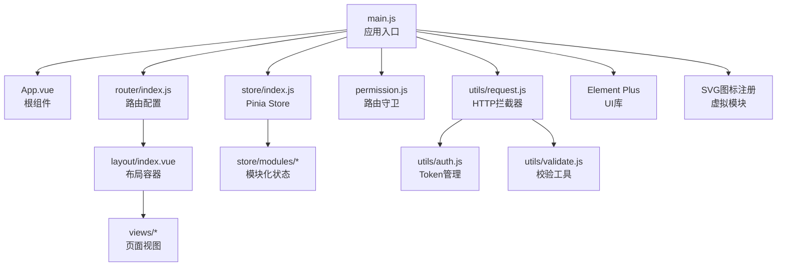
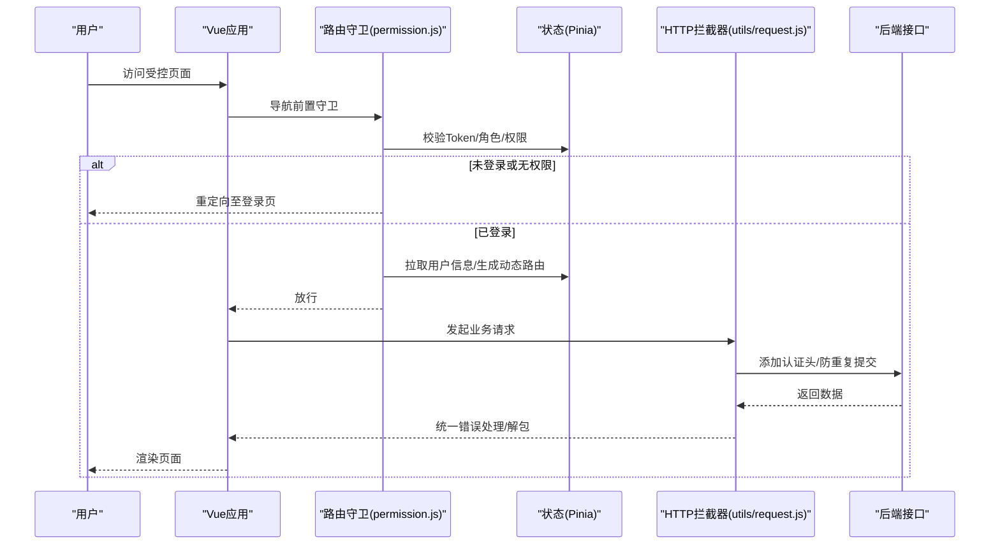
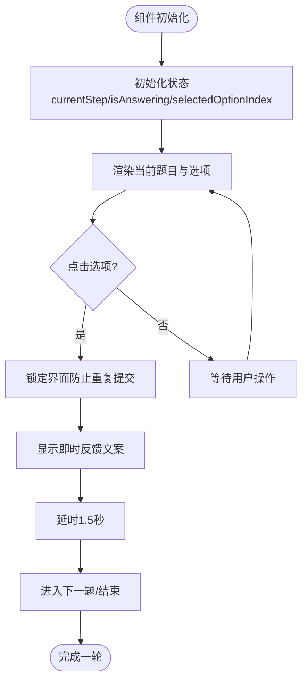
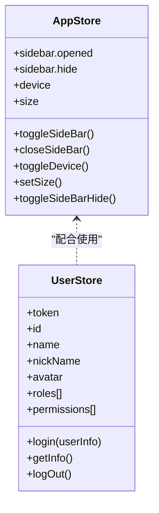
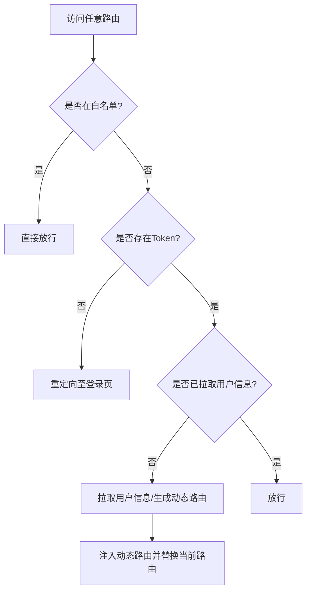
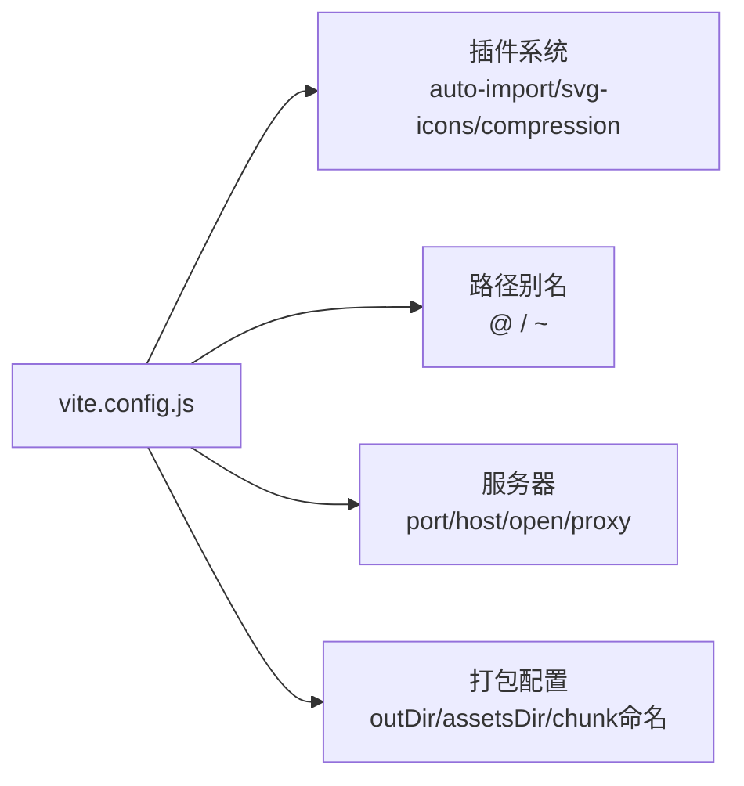
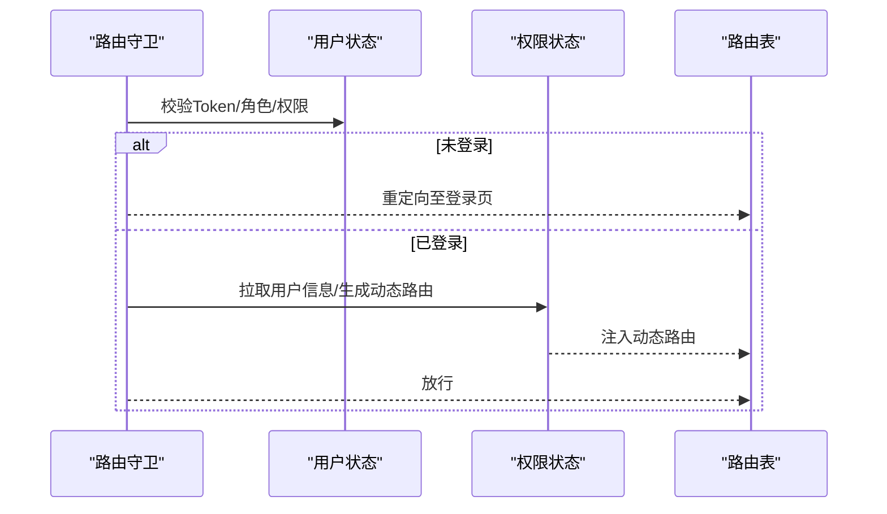
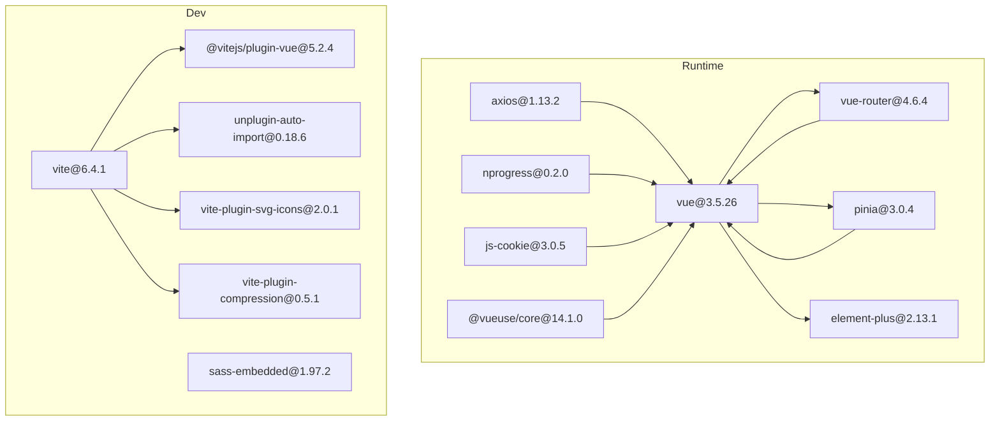

# 前端架构设计

<cite>
**本文引用的文件**
- [main.js](file://XingChen-Vue3/src/main.js)
- [App.vue](file://XingChen-Vue3/src/App.vue)
- [vite.config.js](file://XingChen-Vue3/vite.config.js)
- [router/index.js](file://XingChen-Vue3/src/router/index.js)
- [store/index.js](file://XingChen-Vue3/src/store/index.js)
- [store/modules/app.js](file://XingChen-Vue3/src/store/modules/app.js)
- [store/modules/user.js](file://XingChen-Vue3/src/store/modules/user.js)
- [utils/request.js](file://XingChen-Vue3/src/utils/request.js)
- [permission.js](file://XingChen-Vue3/src/permission.js)
- [components/DailyHealthCheckIn.vue](file://XingChen-Vue3/src/components/DailyHealthCheckIn.vue)
- [utils/auth.js](file://XingChen-Vue3/src/utils/auth.js)
- [utils/validate.js](file://XingChen-Vue3/src/utils/validate.js)
- [package.json](file://XingChen-Vue3/package.json)
- [views/system/user/profile/index.vue](file://XingChen-Vue3/src/views/system/user/profile/index.vue)
- [layout/index.vue](file://XingChen-Vue3/src/layout/index.vue)
</cite>

## 目录
1. [引言](#引言)
2. [项目结构](#项目结构)
3. [核心组件](#核心组件)
4. [架构总览](#架构总览)
5. [详细组件分析](#详细组件分析)
6. [依赖关系分析](#依赖关系分析)
7. [性能考虑](#性能考虑)
8. [故障排查指南](#故障排查指南)
9. [结论](#结论)
10. [附录](#附录)

## 引言
本文件面向健康管理系统前端工程，系统性阐述基于 Vue3 Composition API 的架构设计、Pinia 状态管理、Vue Router 路由体系与 Vite 构建配置。文档重点覆盖：
- 组件化开发模式与组合式函数设计
- 响应式数据管理与生命周期钩子使用
- Element Plus 组件库集成与样式管理策略
- 路由守卫机制与权限控制实现
- 组件开发规范、状态管理最佳实践与性能优化方案
- 工程化配置管理与部署策略

## 项目结构
前端采用单页应用（SPA）架构，核心目录组织如下：
- 应用入口与全局配置：main.js、App.vue、vite.config.js
- 路由系统：router/index.js
- 状态管理：store/index.js 与模块化 store/modules/*
- 权限与拦截：permission.js、utils/request.js、utils/auth.js、utils/validate.js
- 视图与布局：views/*、layout/index.vue
- 组件库与通用组件：components/*
- 工具函数与插件：utils/*、plugins/*

图表来源
- [main.js:1-85](file://XingChen-Vue3/src/main.js#L1-L85)
- [router/index.js:1-197](file://XingChen-Vue3/src/router/index.js#L1-L197)
- [store/index.js:1-4](file://XingChen-Vue3/src/store/index.js#L1-L4)
- [permission.js:1-78](file://XingChen-Vue3/src/permission.js#L1-L78)
- [utils/request.js:1-154](file://XingChen-Vue3/src/utils/request.js#L1-L154)
- [layout/index.vue:1-116](file://XingChen-Vue3/src/layout/index.vue#L1-L116)

章节来源
- [main.js:1-85](file://XingChen-Vue3/src/main.js#L1-L85)
- [vite.config.js:1-80](file://XingChen-Vue3/vite.config.js#L1-L80)
- [package.json:1-54](file://XingChen-Vue3/package.json#L1-L54)

## 核心组件
- 应用入口与全局装配：在入口中完成 Element Plus、全局组件、全局方法、SVG 图标、指令与插件的注册，并挂载路由、状态与权限控制。
- 根组件：负责主题初始化与页面渲染。
- 路由系统：常量路由与动态路由分离，支持权限过滤与 keep-alive 控制。
- Pinia 状态：模块化管理应用状态，包括侧边栏、用户信息、设置等。
- 权限与拦截：统一 HTTP 请求拦截、响应处理与路由守卫，实现登录态校验、白名单放行、动态路由注入与锁屏保护。

章节来源
- [main.js:1-85](file://XingChen-Vue3/src/main.js#L1-L85)
- [App.vue:1-16](file://XingChen-Vue3/src/App.vue#L1-L16)
- [router/index.js:1-197](file://XingChen-Vue3/src/router/index.js#L1-L197)
- [store/index.js:1-4](file://XingChen-Vue3/src/store/index.js#L1-L4)
- [store/modules/app.js:1-47](file://XingChen-Vue3/src/store/modules/app.js#L1-L47)
- [store/modules/user.js:1-94](file://XingChen-Vue3/src/store/modules/user.js#L1-L94)
- [utils/request.js:1-154](file://XingChen-Vue3/src/utils/request.js#L1-L154)
- [permission.js:1-78](file://XingChen-Vue3/src/permission.js#L1-L78)

## 架构总览
下图展示了从浏览器到后端服务的端到端交互路径，以及权限与状态管理的关键节点。

图表来源
- [permission.js:21-73](file://XingChen-Vue3/src/permission.js#L21-L73)
- [utils/request.js:23-124](file://XingChen-Vue3/src/utils/request.js#L23-L124)
- [store/modules/user.js:39-89](file://XingChen-Vue3/src/store/modules/user.js#L39-L89)

## 详细组件分析

### Vue3 Composition API 与组件化开发
- 组合式函数设计：大量使用 ref、computed、watch、watchEffect 等响应式 API；通过 script setup 简化导入与声明。
- 组件化模式：采用单文件组件（.vue），模板、脚本与样式内聚；通过 props、emits、provide/inject 实现组件通信。
- 示例：每日健康打卡组件通过状态机推进答题流程，结合过渡动画提升交互体验。

图表来源
- [components/DailyHealthCheckIn.vue:60-137](file://XingChen-Vue3/src/components/DailyHealthCheckIn.vue#L60-L137)

章节来源
- [components/DailyHealthCheckIn.vue:1-281](file://XingChen-Vue3/src/components/DailyHealthCheckIn.vue#L1-L281)

### Pinia 状态管理
- Store 定义：使用 defineStore 定义模块化状态，如 app（侧边栏、设备、尺寸）、user（令牌、角色、权限）。
- 数据持久化：通过 Cookie 存储侧边栏与尺寸状态，确保刷新后状态一致。
- 行为封装：将登录、获取用户信息、登出等动作封装为 action，便于复用与测试。

图表来源
- [store/modules/app.js:3-44](file://XingChen-Vue3/src/store/modules/app.js#L3-L44)
- [store/modules/user.js:9-91](file://XingChen-Vue3/src/store/modules/user.js#L9-L91)

章节来源
- [store/index.js:1-4](file://XingChen-Vue3/src/store/index.js#L1-L4)
- [store/modules/app.js:1-47](file://XingChen-Vue3/src/store/modules/app.js#L1-L47)
- [store/modules/user.js:1-94](file://XingChen-Vue3/src/store/modules/user.js#L1-L94)

### Vue Router 路由系统
- 路由分层：constantRoutes 为公共路由（登录、404、引导页等），dynamicRoutes 为权限驱动的动态路由。
- 路由元信息：hidden、alwaysShow、redirect、roles、permissions、meta（noCache、title、icon、activeMenu）等字段用于控制侧边栏、面包屑与缓存。
- 滚动行为：提供滚动到顶部的默认行为，支持恢复滚动位置。

图表来源
- [router/index.js:28-109](file://XingChen-Vue3/src/router/index.js#L28-L109)
- [permission.js:21-73](file://XingChen-Vue3/src/permission.js#L21-L73)

章节来源
- [router/index.js:1-197](file://XingChen-Vue3/src/router/index.js#L1-L197)
- [permission.js:1-78](file://XingChen-Vue3/src/permission.js#L1-L78)

### Vite 构建配置与工程化
- 路径别名与解析：@ 指向 src，~ 指向项目根，支持多扩展名解析。
- 代理配置：本地 dev-api 代理后端接口，springdoc 文档代理。
- 打包优化：按需输出 JS/CSS/静态资源命名，禁用生产 sourcemap，限制 chunk 警告阈值。
- 插件生态：集成 SVG 图标、自动导入、压缩与 Setup 语法扩展等插件。

图表来源
- [vite.config.js:1-80](file://XingChen-Vue3/vite.config.js#L1-L80)
- [package.json:8-46](file://XingChen-Vue3/package.json#L8-L46)

章节来源
- [vite.config.js:1-80](file://XingChen-Vue3/vite.config.js#L1-L80)
- [package.json:1-54](file://XingChen-Vue3/package.json#L1-L54)

### Element Plus 组件库与样式管理
- 全局引入：Element Plus 中文语言与暗色主题变量，按 size Cookie 控制全局组件尺寸。
- 自定义组件：注册分页、富文本、文件/图片上传、字典标签等常用组件。
- 主题与图标：通过全局方法与 SVG 图标系统实现主题切换与图标复用。

章节来源
- [main.js:5-28](file://XingChen-Vue3/src/main.js#L5-L28)
- [main.js:77-82](file://XingChen-Vue3/src/main.js#L77-L82)

### 权限控制与路由守卫
- 白名单：登录与注册页面无需登录即可访问。
- Token 校验：未登录统一重定向至登录页并携带 redirect 参数。
- 用户信息与动态路由：首次登录拉取用户信息，生成可访问路由并注入。
- 锁屏保护：当处于锁屏状态时强制跳转至锁屏页，避免未授权访问。
- 进度条：NProgress 提示导航加载状态。

图表来源
- [permission.js:15-73](file://XingChen-Vue3/src/permission.js#L15-L73)

章节来源
- [permission.js:1-78](file://XingChen-Vue3/src/permission.js#L1-L78)
- [utils/auth.js:1-16](file://XingChen-Vue3/src/utils/auth.js#L1-L16)
- [utils/validate.js:1-115](file://XingChen-Vue3/src/utils/validate.js#L1-L115)

### HTTP 请求拦截与下载工具
- 请求拦截：统一添加 Authorization 头、GET 参数序列化、防重复提交（基于 session 缓存）。
- 响应拦截：统一错误码映射、401 会话过期提示与自动登出、500/601 等错误提示。
- 下载工具：支持 Blob 下载与文件保存，统一错误提示与加载状态。

章节来源
- [utils/request.js:1-154](file://XingChen-Vue3/src/utils/request.js#L1-L154)

### 布局与主题初始化
- 布局容器：根据设备类型与侧边栏状态动态切换类名，支持移动端抽屉遮罩与固定头部。
- 主题初始化：在根组件挂载后读取设置状态并应用主题样式变量。

章节来源
- [layout/index.vue:1-116](file://XingChen-Vue3/src/layout/index.vue#L1-L116)
- [App.vue:1-16](file://XingChen-Vue3/src/App.vue#L1-L16)

### 页面示例：个人中心
- 页面结构：左侧个人信息卡片，右侧标签页切换“基本信息”与“修改密码”。
- 生命周期：mounted 时根据路由参数激活对应标签页，并拉取用户资料。

章节来源
- [views/system/user/profile/index.vue:1-95](file://XingChen-Vue3/src/views/system/user/profile/index.vue#L1-L95)

## 依赖关系分析
- 运行时依赖：Vue3、Vue Router、Pinia、Element Plus、Axios、NProgress、JS-Cookie、@vueuse/core 等。
- 开发依赖：Vite、Sass、unplugin-auto-import、vite-plugin-svg-icons、vite-plugin-compression 等。
- 版本与兼容：通过 overrides/resolutions 约束 Quill 版本，确保富文本生态稳定。

图表来源
- [package.json:18-46](file://XingChen-Vue3/package.json#L18-L46)

章节来源
- [package.json:1-54](file://XingChen-Vue3/package.json#L1-L54)

## 性能考虑
- 资源分包与命名：Rollup 输出按 JS/CSS/静态资源分别命名，利于缓存与 CDN 管理。
- 源码映射：生产关闭 sourcemap，减少体积与泄露风险。
- 组件懒加载：路由级异步加载组件，降低首屏体积。
- 防重复提交：POST/PUT 请求基于数据与时间窗口的防抖，避免重复提交导致的性能浪费。
- 主题与图标：SVG 图标按需注册，Element Plus 按需引入可进一步减小体积。

## 故障排查指南
- 登录态失效：响应拦截器检测 401，弹窗提示并触发登出与跳转。
- 网络异常：统一错误消息提示，区分超时与连接失败场景。
- 白名单误拦截：确认 permission.js 白名单列表与路径匹配规则。
- 动态路由未生效：检查 generateRoutes 返回的路由是否注入成功，以及 isHttp 判断是否正确排除外链。
- 防重复提交：超过 5MB 的请求会被跳过校验，注意大文件上传场景。

章节来源
- [utils/request.js:75-124](file://XingChen-Vue3/src/utils/request.js#L75-L124)
- [permission.js:15-73](file://XingChen-Vue3/src/permission.js#L15-L73)

## 结论
该前端架构以 Vue3 Composition API 为核心，结合 Pinia 实现清晰的状态管理，借助 Vue Router 提供完善的路由与权限体系，并通过 Vite 实现高效的开发与构建体验。配合 Element Plus 与自定义组件库，形成高内聚、低耦合的工程化前端框架，具备良好的可维护性与扩展性。

## 附录
- 组件开发规范建议
  - 使用 script setup 与组合式 API，避免 Options API 过度混用。
  - 将通用逻辑抽象为 Composables，提升复用性。
  - 严格使用 TypeScript 或 JSDoc 规范参数与返回值。
- 状态管理最佳实践
  - 模块边界清晰，避免跨模块强耦合。
  - 使用 getters 计算派生状态，减少重复计算。
  - 对外暴露只读状态，内部通过 actions 修改。
- 性能优化清单
  - 启用路由懒加载与代码分割。
  - 合理使用 keep-alive 与 noCache 控制缓存。
  - 减少不必要的响应式依赖，避免深层监听。
  - 使用虚拟滚动与分页加载大数据集。
- 部署策略
  - 生产构建后置于 Nginx/CDN，开启 gzip/br 压缩。
  - 通过 base 与 proxy 配置适配不同环境路径与代理。
  - 使用 CI/CD 自动化构建与发布，确保版本一致性。