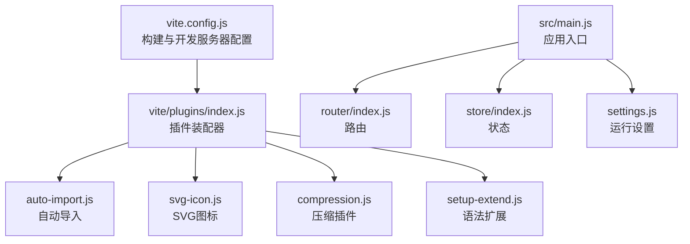
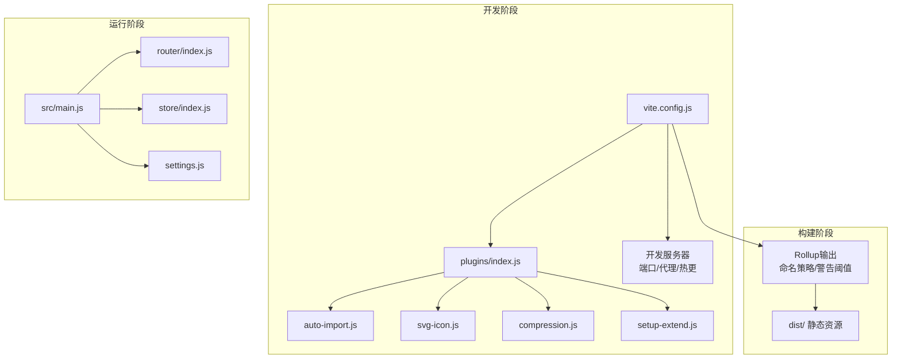
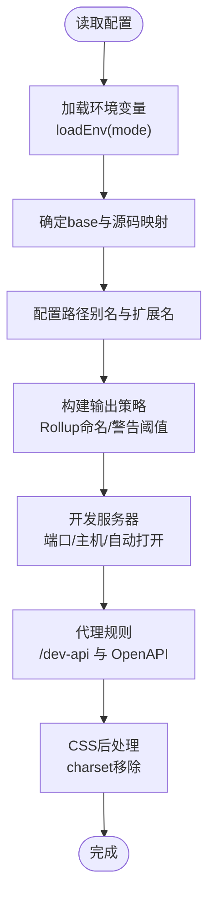
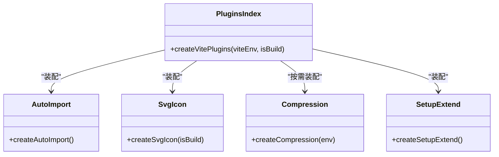
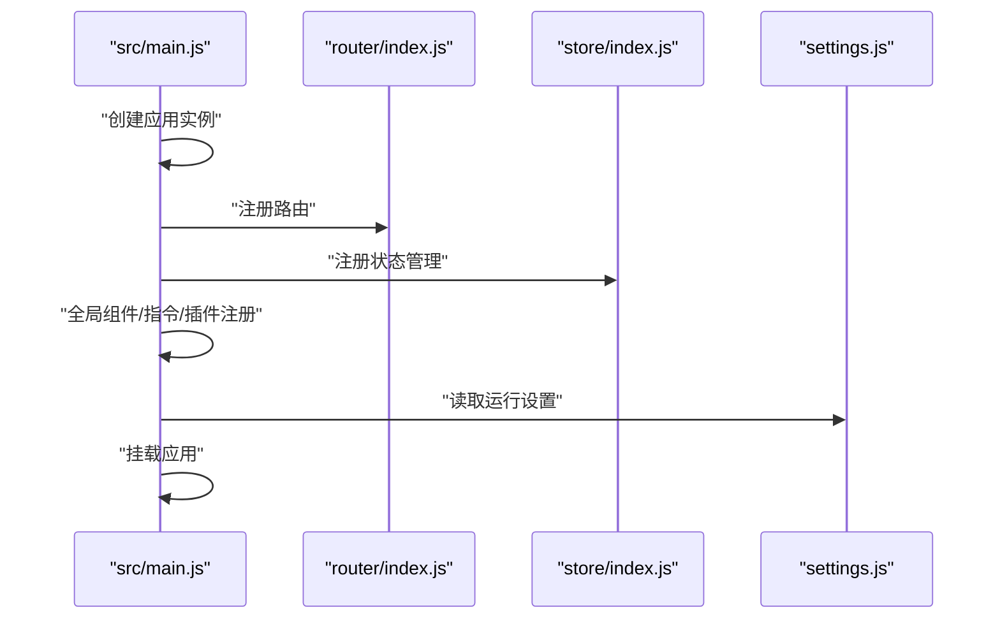
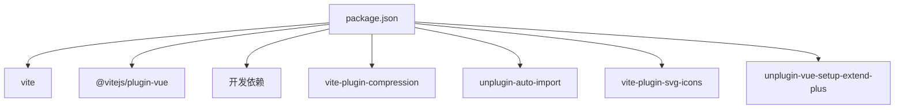

# 构建配置与优化

<cite>
**本文引用的文件**
- [vite.config.js](file://XingChen-Vue3/vite.config.js)
- [package.json](file://XingChen-Vue3/package.json)
- [plugins/index.js](file://XingChen-Vue3/vite/plugins/index.js)
- [plugins/auto-import.js](file://XingChen-Vue3/vite/plugins/auto-import.js)
- [plugins/compression.js](file://XingChen-Vue3/vite/plugins/compression.js)
- [plugins/svg-icon.js](file://XingChen-Vue3/vite/plugins/svg-icon.js)
- [plugins/setup-extend.js](file://XingChen-Vue3/vite/plugins/setup-extend.js)
- [main.js](file://XingChen-Vue3/src/main.js)
- [settings.js](file://XingChen-Vue3/src/settings.js)
- [router/index.js](file://XingChen-Vue3/src/router/index.js)
- [store/index.js](file://XingChen-Vue3/src/store/index.js)
- [.gitignore](file://XingChen-Vue3/.gitignore)
</cite>

## 目录
1. [简介](#简介)
2. [项目结构](#项目结构)
3. [核心组件](#核心组件)
4. [架构总览](#架构总览)
5. [详细组件分析](#详细组件分析)
6. [依赖关系分析](#依赖关系分析)
7. [性能考量](#性能考量)
8. [故障排查指南](#故障排查指南)
9. [结论](#结论)
10. [附录](#附录)

## 简介
本文件面向健康管理系统前端工程，聚焦于Vite构建工具的配置策略、插件体系与开发服务器设置，系统性阐述代码分割、资源优化与打包策略；同时覆盖开发环境配置、生产环境优化与部署要点，提供依赖预构建、静态资源处理与缓存策略的实践建议，并展示热更新、代理服务与环境变量管理的配置方式，最后给出构建产物分析与性能监控的最佳实践。

## 项目结构
前端工程采用Vite作为构建与开发服务器，核心目录与职责如下：
- 根配置：vite.config.js 定义基础路径、插件、解析别名、打包输出与开发服务器代理等。
- 插件体系：vite/plugins 下按功能拆分插件工厂函数，统一在 plugins/index.js 中装配。
- 运行入口：src/main.js 初始化Vue应用、注册全局组件与指令、挂载Element Plus等。
- 路由与状态：src/router/index.js 定义常量与动态路由；src/store/index.js 创建Pinia实例。
- 环境与设置：src/settings.js 提供运行期UI与布局配置；package.json 定义脚本与依赖。

**图表来源**
- [vite.config.js:1-80](file://XingChen-Vue3/vite.config.js#L1-L80)
- [plugins/index.js:1-16](file://XingChen-Vue3/vite/plugins/index.js#L1-L16)
- [plugins/auto-import.js:1-13](file://XingChen-Vue3/vite/plugins/auto-import.js#L1-L13)
- [plugins/svg-icon.js:1-11](file://XingChen-Vue3/vite/plugins/svg-icon.js#L1-L11)
- [plugins/compression.js:1-29](file://XingChen-Vue3/vite/plugins/compression.js#L1-L29)
- [plugins/setup-extend.js:1-6](file://XingChen-Vue3/vite/plugins/setup-extend.js#L1-L6)
- [main.js:1-85](file://XingChen-Vue3/src/main.js#L1-L85)
- [router/index.js:1-197](file://XingChen-Vue3/src/router/index.js#L1-L197)
- [store/index.js:1-4](file://XingChen-Vue3/src/store/index.js#L1-L4)
- [settings.js:1-63](file://XingChen-Vue3/src/settings.js#L1-L63)

**章节来源**
- [vite.config.js:1-80](file://XingChen-Vue3/vite.config.js#L1-L80)
- [package.json:1-54](file://XingChen-Vue3/package.json#L1-L54)
- [main.js:1-85](file://XingChen-Vue3/src/main.js#L1-L85)
- [router/index.js:1-197](file://XingChen-Vue3/src/router/index.js#L1-L197)
- [store/index.js:1-4](file://XingChen-Vue3/src/store/index.js#L1-L4)
- [settings.js:1-63](file://XingChen-Vue3/src/settings.js#L1-L63)

## 核心组件
- 构建配置与开发服务器
  - 基础路径与模式：通过环境变量控制部署路径与源码映射策略。
  - 解析别名：@ 指向 src，~ 指向项目根，提升导入可读性。
  - 打包输出：Rollup 输出命名策略与警告阈值，便于缓存与调试。
  - 开发服务器：端口、主机、自动打开浏览器与代理规则。
  - CSS后处理：移除charset规则，避免重复声明。
- 插件系统
  - Vue插件：官方Vue支持。
  - 自动导入：对Vue、路由、状态库进行自动导入，减少样板代码。
  - SVG图标：集中注册与符号化，支持构建时优化。
  - 压缩插件：按需启用gzip或brotli压缩，生成对应产物。
  - 语法扩展：增强setup语法体验。
- 应用入口与运行设置
  - 应用初始化：注册全局组件、指令、插件与国际化样式。
  - 路由与状态：基于history模式的路由与Pinia状态管理。
  - 运行设置：标题、主题、导航模式、固定头、侧边栏Logo等。

**章节来源**
- [vite.config.js:8-79](file://XingChen-Vue3/vite.config.js#L8-L79)
- [plugins/index.js:8-15](file://XingChen-Vue3/vite/plugins/index.js#L8-L15)
- [plugins/auto-import.js:3-12](file://XingChen-Vue3/vite/plugins/auto-import.js#L3-L12)
- [plugins/svg-icon.js:4-10](file://XingChen-Vue3/vite/plugins/svg-icon.js#L4-L10)
- [plugins/compression.js:3-28](file://XingChen-Vue3/vite/plugins/compression.js#L3-L28)
- [plugins/setup-extend.js:3-5](file://XingChen-Vue3/vite/plugins/setup-extend.js#L3-L5)
- [main.js:47-84](file://XingChen-Vue3/src/main.js#L47-L84)
- [router/index.js:185-196](file://XingChen-Vue3/src/router/index.js#L185-L196)
- [store/index.js:1-4](file://XingChen-Vue3/src/store/index.js#L1-L4)
- [settings.js:1-63](file://XingChen-Vue3/src/settings.js#L1-L63)

## 架构总览
下图展示从开发到生产的整体流程：Vite读取配置与插件，解析别名与模块，启动开发服务器并应用代理；构建阶段通过Rollup输出静态资源并应用压缩策略；运行时应用入口完成全局注册与渲染。

**图表来源**
- [vite.config.js:8-79](file://XingChen-Vue3/vite.config.js#L8-L79)
- [plugins/index.js:8-15](file://XingChen-Vue3/vite/plugins/index.js#L8-L15)
- [plugins/auto-import.js:3-12](file://XingChen-Vue3/vite/plugins/auto-import.js#L3-L12)
- [plugins/svg-icon.js:4-10](file://XingChen-Vue3/vite/plugins/svg-icon.js#L4-L10)
- [plugins/compression.js:3-28](file://XingChen-Vue3/vite/plugins/compression.js#L3-L28)
- [plugins/setup-extend.js:3-5](file://XingChen-Vue3/vite/plugins/setup-extend.js#L3-L5)
- [main.js:47-84](file://XingChen-Vue3/src/main.js#L47-L84)
- [router/index.js:185-196](file://XingChen-Vue3/src/router/index.js#L185-L196)
- [store/index.js:1-4](file://XingChen-Vue3/src/store/index.js#L1-L4)
- [settings.js:1-63](file://XingChen-Vue3/src/settings.js#L1-L63)

## 详细组件分析

### Vite配置与开发服务器
- 基础路径与模式
  - base：当前配置未根据环境动态调整，建议结合部署路径与CDN策略统一管理。
  - 源码映射：开发时内联，生产关闭以减小体积。
- 解析与别名
  - @ 指向 src，~ 指向项目根，提升导入一致性。
  - 扩展名解析包含 .vue、.ts 等，确保多语言生态兼容。
- 打包输出
  - Rollup输出命名策略：JS/入口/静态资源分别按[name]-[hash]命名，利于浏览器缓存。
  - 警告阈值：chunkSizeWarningLimit 提升大包阈值，降低误报。
- 开发服务器
  - 端口与主机：host: true 支持局域网访问。
  - 代理：/dev-api 前缀转发至后端地址；springdoc文档代理规则适配OpenAPI。
- CSS后处理
  - 移除charset规则，避免重复声明导致的样式问题。

**图表来源**
- [vite.config.js:8-79](file://XingChen-Vue3/vite.config.js#L8-L79)

**章节来源**
- [vite.config.js:8-79](file://XingChen-Vue3/vite.config.js#L8-L79)

### 插件系统
- 插件装配器
  - 统一导出插件数组，按是否构建阶段决定是否启用压缩插件。
- 自动导入
  - 对Vue、路由、状态库进行自动导入，减少手动引入。
- SVG图标
  - 集中扫描SVG目录，生成符号ID并在构建时可选SVGO优化。
- 压缩插件
  - 通过环境变量选择gzip或brotli，生成对应产物并保留原文件。
- 语法扩展
  - 增强setup语法体验，便于组合式函数编写。

**图表来源**
- [plugins/index.js:8-15](file://XingChen-Vue3/vite/plugins/index.js#L8-L15)
- [plugins/auto-import.js:3-12](file://XingChen-Vue3/vite/plugins/auto-import.js#L3-L12)
- [plugins/svg-icon.js:4-10](file://XingChen-Vue3/vite/plugins/svg-icon.js#L4-L10)
- [plugins/compression.js:3-28](file://XingChen-Vue3/vite/plugins/compression.js#L3-L28)
- [plugins/setup-extend.js:3-5](file://XingChen-Vue3/vite/plugins/setup-extend.js#L3-L5)

**章节来源**
- [plugins/index.js:8-15](file://XingChen-Vue3/vite/plugins/index.js#L8-L15)
- [plugins/auto-import.js:3-12](file://XingChen-Vue3/vite/plugins/auto-import.js#L3-L12)
- [plugins/svg-icon.js:4-10](file://XingChen-Vue3/vite/plugins/svg-icon.js#L4-L10)
- [plugins/compression.js:3-28](file://XingChen-Vue3/vite/plugins/compression.js#L3-L28)
- [plugins/setup-extend.js:3-5](file://XingChen-Vue3/vite/plugins/setup-extend.js#L3-L5)

### 应用入口与运行设置
- 应用入口
  - 初始化Vue应用，注册全局组件与指令，挂载Element Plus与国际化样式。
  - 引入虚拟模块注册SVG图标，集中管理图标资源。
  - 权限控制与工具方法挂载，统一业务能力。
- 路由与状态
  - 基于history模式的路由，支持keep-alive与滚动行为。
  - Pinia状态管理实例创建，配合模块化store组织状态。
- 运行设置
  - 标题、侧边栏主题、导航模式、固定头、Logo等UI布局配置。
  - 动态标题与版权信息等可配置项。

**图表来源**
- [main.js:47-84](file://XingChen-Vue3/src/main.js#L47-L84)
- [router/index.js:185-196](file://XingChen-Vue3/src/router/index.js#L185-L196)
- [store/index.js:1-4](file://XingChen-Vue3/src/store/index.js#L1-L4)
- [settings.js:1-63](file://XingChen-Vue3/src/settings.js#L1-L63)

**章节来源**
- [main.js:47-84](file://XingChen-Vue3/src/main.js#L47-L84)
- [router/index.js:185-196](file://XingChen-Vue3/src/router/index.js#L185-L196)
- [store/index.js:1-4](file://XingChen-Vue3/src/store/index.js#L1-L4)
- [settings.js:1-63](file://XingChen-Vue3/src/settings.js#L1-L63)

## 依赖关系分析
- 构建工具链
  - Vite版本与Rollup版本在package-lock中明确，确保构建稳定性。
- 依赖与脚本
  - 生产依赖涵盖UI库、图表、状态管理、路由等；开发依赖包含Vite、Vue插件与各类工具。
  - 脚本提供开发、生产构建与预览命令，支持staging模式。

**图表来源**
- [package.json:1-54](file://XingChen-Vue3/package.json#L1-L54)

**章节来源**
- [package.json:1-54](file://XingChen-Vue3/package.json#L1-L54)

## 性能考量
- 依赖预构建
  - 利用Vite内置依赖预构建，减少冷启动时间；保持node_modules稳定可复用。
- 代码分割
  - 路由级懒加载与组件级懒加载相结合，配合Rollup输出命名策略，提升缓存命中率。
- 静态资源处理
  - 通过插件启用gzip/brotli压缩，结合浏览器支持选择最优算法；保留原文件便于回退。
- 缓存策略
  - JS/CSS/媒体资源采用[name]-[hash]命名，结合HTTP缓存头实现长期缓存。
- 开发体验
  - 开发服务器开启热更新与自动打开，代理规则减少跨域与联调成本。
- 大包治理
  - 调整chunkSizeWarningLimit，结合路由拆分与第三方库按需引入，控制包体规模。

[本节为通用性能指导，不直接分析具体文件]

## 故障排查指南
- 代理无法转发
  - 检查代理前缀与rewrite规则是否匹配；确认后端地址与changeOrigin配置。
- SVG图标不生效
  - 确认图标目录存在且符合symbolId规则；构建时是否启用SVGO优化。
- 压缩产物缺失
  - 检查环境变量VITE_BUILD_COMPRESS是否正确设置，以及所选算法是否被服务器支持。
- 资源路径异常
  - 核对base配置与部署路径；确认Rollup输出命名策略一致。
- 忽略文件与缓存
  - .gitignore中已忽略dist与node_modules，避免提交不必要的构建产物与依赖。

**章节来源**
- [vite.config.js:48-60](file://XingChen-Vue3/vite.config.js#L48-L60)
- [plugins/svg-icon.js:4-10](file://XingChen-Vue3/vite/plugins/svg-icon.js#L4-L10)
- [plugins/compression.js:3-28](file://XingChen-Vue3/vite/plugins/compression.js#L3-L28)
- [.gitignore:1-74](file://XingChen-Vue3/.gitignore#L1-L74)

## 结论
本项目以Vite为核心，结合插件化扩展与合理的打包输出策略，在开发与生产两端实现了高效、稳定的构建流程。通过路由级懒加载、依赖预构建与压缩插件，显著优化了首屏与增量加载性能；代理与环境变量管理提升了联调效率。建议在实际部署中进一步完善base路径策略、缓存头配置与构建产物分析，持续优化用户体验与维护成本。

[本节为总结性内容，不直接分析具体文件]

## 附录
- 环境变量与脚本
  - VITE_APP_ENV 控制base与源码映射策略；VITE_BUILD_COMPRESS 控制压缩算法。
  - 脚本：dev、build:prod、build:stage、preview。
- 路由与状态
  - 常量路由与动态路由分离，支持权限控制；Pinia模块化组织状态。
- 运行设置
  - 标题、主题、导航模式、固定头、Logo等可配置项，满足不同场景需求。

**章节来源**
- [vite.config.js:10-10](file://XingChen-Vue3/vite.config.js#L10-L10)
- [package.json:8-12](file://XingChen-Vue3/package.json#L8-L12)
- [router/index.js:28-183](file://XingChen-Vue3/src/router/index.js#L28-L183)
- [store/index.js:1-4](file://XingChen-Vue3/src/store/index.js#L1-L4)
- [settings.js:1-63](file://XingChen-Vue3/src/settings.js#L1-L63)