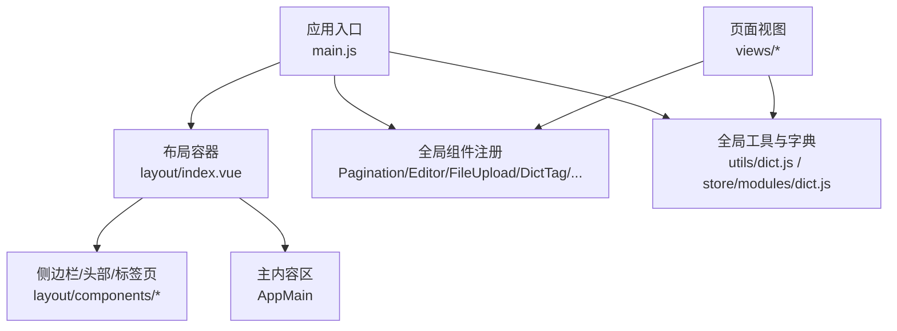
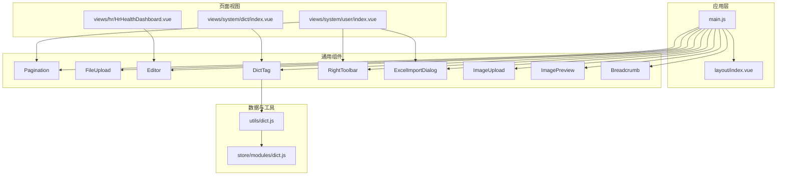
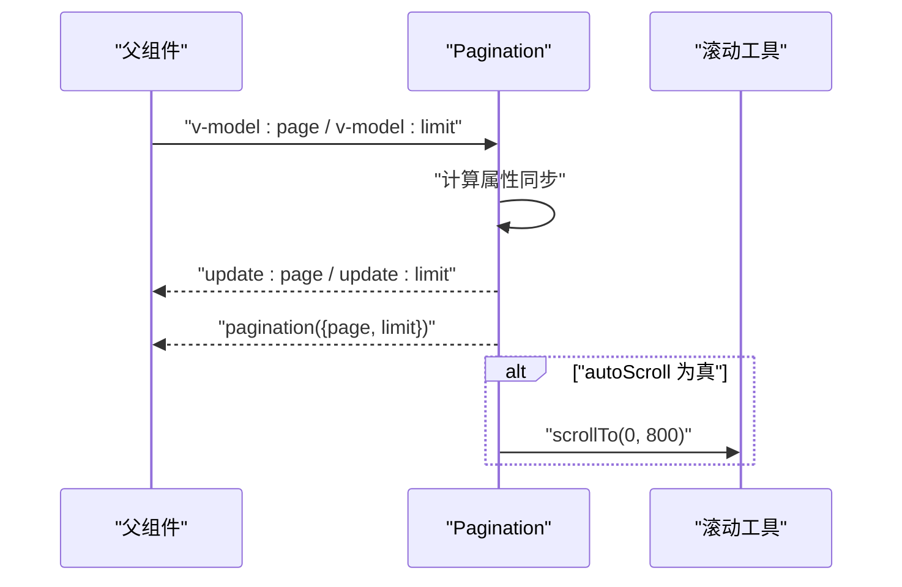
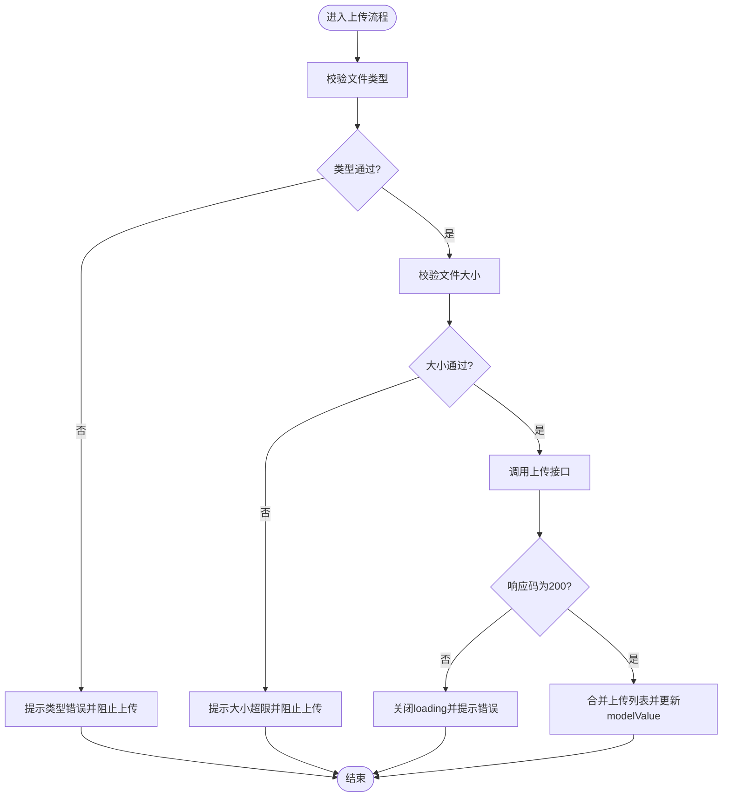
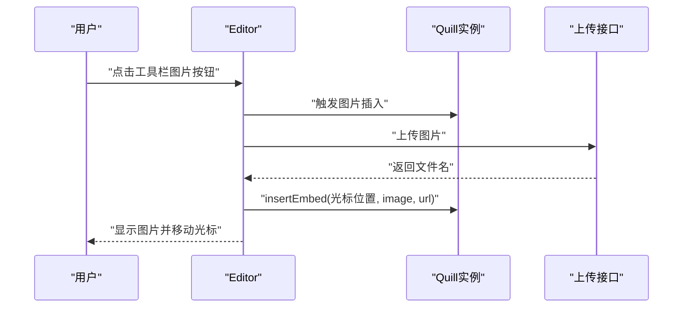
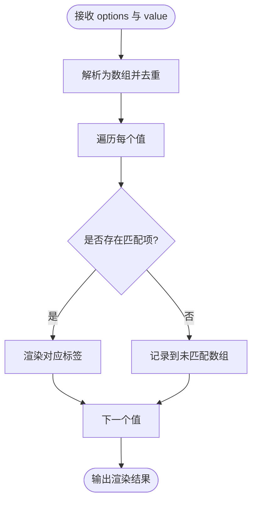
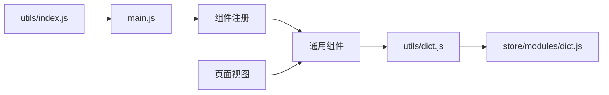

# 组件设计与开发

<cite>
**本文引用的文件**   
- [Pagination/index.vue](file://XingChen-Vue3/src/components/Pagination/index.vue)
- [FileUpload/index.vue](file://XingChen-Vue3/src/components/FileUpload/index.vue)
- [Editor/index.vue](file://XingChen-Vue3/src/components/Editor/index.vue)
- [DictTag/index.vue](file://XingChen-Vue3/src/components/DictTag/index.vue)
- [RightToolbar/index.vue](file://XingChen-Vue3/src/components/RightToolbar/index.vue)
- [ExcelImportDialog/index.vue](file://XingChen-Vue3/src/components/ExcelImportDialog/index.vue)
- [ImageUpload/index.vue](file://XingChen-Vue3/src/components/ImageUpload/index.vue)
- [ImagePreview/index.vue](file://XingChen-Vue3/src/components/ImagePreview/index.vue)
- [Breadcrumb/index.vue](file://XingChen-Vue3/src/components/Breadcrumb/index.vue)
- [layout/index.vue](file://XingChen-Vue3/src/layout/index.vue)
- [main.js](file://XingChen-Vue3/src/main.js)
- [dict.js](file://XingChen-Vue3/src/utils/dict.js)
- [dict.js](file://XingChen-Vue3/src/store/modules/dict.js)
- [index.vue](file://XingChen-Vue3/src/views/system/user/index.vue)
- [index.vue](file://XingChen-Vue3/src/views/system/dict/index.vue)
- [HrHealthDashboard.vue](file://XingChen-Vue3/src/views/hr/HrHealthDashboard.vue)
- [index.js](file://XingChen-Vue3/src/router/index.js)
- [index.js](file://XingChen-Vue3/src/store/index.js)
- [index.js](file://XingChen-Vue3/src/plugins/index.js)
- [index.js](file://XingChen-Vue3/src/directive/index.js)
- [index.js](file://XingChen-Vue3/src/utils/index.js)
</cite>

## 目录
1. [引言](#引言)
2. [项目结构](#项目结构)
3. [核心组件](#核心组件)
4. [架构总览](#架构总览)
5. [详细组件分析](#详细组件分析)
6. [依赖关系分析](#依赖关系分析)
7. [性能考量](#性能考量)
8. [故障排查指南](#故障排查指南)
9. [结论](#结论)
10. [附录](#附录)

## 引言
本文件面向健康管理系统中的组件化开发，系统性阐述组件化设计与开发模式、组件通信机制、可复用组件设计与规范，并结合分页组件（Pagination）、文件上传组件（FileUpload）、富文本编辑器（Editor）、字典标签组件（DictTag）等实际案例，说明布局组件设计、页面组件组织与组件生命周期管理。同时提供组件开发最佳实践（props 设计、事件处理、插槽使用、组件测试策略），并展示这些组件在系统中的典型应用场景。

## 项目结构
系统采用前后端分离架构，前端基于 Vue3 + Element Plus + ECharts 构建，组件统一注册于应用入口，页面组件按业务模块组织，布局组件负责整体容器与导航结构。

**图表来源**
- [main.js:1-85](file://XingChen-Vue3/src/main.js#L1-L85)
- [layout/index.vue:1-116](file://XingChen-Vue3/src/layout/index.vue#L1-L116)

**章节来源**
- [main.js:1-85](file://XingChen-Vue3/src/main.js#L1-L85)
- [layout/index.vue:1-116](file://XingChen-Vue3/src/layout/index.vue#L1-L116)

## 核心组件
- 分页组件（Pagination）：封装 Element Plus 分页，支持双向绑定、自动滚动、移动端适配。
- 文件上传组件（FileUpload）：支持多文件、拖拽排序、格式与大小校验、批量上传与回显。
- 富文本编辑器（Editor）：基于 Quill，支持图片上传、粘贴插入、工具栏配置、只读模式。
- 字典标签组件（DictTag）：根据字典数据渲染标签，支持多值、未匹配值展示。
- 右侧工具栏（RightToolbar）：统一的搜索显隐、刷新、列显隐控制，支持本地存储记忆。
- Excel 导入对话框（ExcelImportDialog）：拖拽上传、模板下载、覆盖更新开关。
- 图片上传（ImageUpload）：图片格式校验、预览、限制数量与大小。
- 图片预览（ImagePreview）：多图预览、外链与内链兼容。
- 面包屑（Breadcrumb）：路由级联生成面包屑，支持首页占位与跳转。

**章节来源**
- [Pagination/index.vue:1-105](file://XingChen-Vue3/src/components/Pagination/index.vue#L1-L105)
- [FileUpload/index.vue:1-257](file://XingChen-Vue3/src/components/FileUpload/index.vue#L1-L257)
- [Editor/index.vue:1-277](file://XingChen-Vue3/src/components/Editor/index.vue#L1-L277)
- [DictTag/index.vue:1-88](file://XingChen-Vue3/src/components/DictTag/index.vue#L1-L88)
- [RightToolbar/index.vue:1-250](file://XingChen-Vue3/src/components/RightToolbar/index.vue#L1-L250)
- [ExcelImportDialog/index.vue:1-138](file://XingChen-Vue3/src/components/ExcelImportDialog/index.vue#L1-L138)
- [ImageUpload/index.vue:1-258](file://XingChen-Vue3/src/components/ImageUpload/index.vue#L1-L258)
- [ImagePreview/index.vue:1-93](file://XingChen-Vue3/src/components/ImagePreview/index.vue#L1-L93)
- [Breadcrumb/index.vue:1-97](file://XingChen-Vue3/src/components/Breadcrumb/index.vue#L1-L97)

## 架构总览
组件体系通过应用入口集中注册，页面通过组合多个通用组件完成业务功能；字典数据通过工具函数与状态管理统一获取与缓存，供标签组件渲染使用。

**图表来源**
- [main.js:32-67](file://XingChen-Vue3/src/main.js#L32-L67)
- [dict.js:1-24](file://XingChen-Vue3/src/utils/dict.js#L1-L24)
- [dict.js:1-58](file://XingChen-Vue3/src/store/modules/dict.js#L1-L58)
- [index.vue:1-455](file://XingChen-Vue3/src/views/system/user/index.vue#L1-L455)
- [index.vue:1-347](file://XingChen-Vue3/src/views/system/dict/index.vue#L1-L347)
- [HrHealthDashboard.vue:1-481](file://XingChen-Vue3/src/views/hr/HrHealthDashboard.vue#L1-L481)

## 详细组件分析

### 分页组件（Pagination）
- 设计要点
  - 双向绑定：通过计算属性将外部 page/limit 与内部 v-model 同步，保证父组件可控。
  - 事件透传：向上抛出 pagination 事件，携带当前页与每页大小。
  - 自动滚动：可配置自动滚动至顶部，优化用户体验。
  - 移动端适配：根据屏幕宽度动态调整页码按钮数量。
- 适用场景
  - 列表分页、字典类型列表、用户管理等需要分页的表格场景。
- 开发规范
  - props 设计遵循最小必要原则；事件命名语义化；避免在组件内直接修改外部状态。
- 生命周期
  - mounted 时初始化；watch 监听外部变更；事件在变更时触发。

**图表来源**
- [Pagination/index.vue:62-95](file://XingChen-Vue3/src/components/Pagination/index.vue#L62-L95)

**章节来源**
- [Pagination/index.vue:1-105](file://XingChen-Vue3/src/components/Pagination/index.vue#L1-L105)
- [index.vue:85](file://XingChen-Vue3/src/views/system/user/index.vue#L85)

### 文件上传组件（FileUpload）
- 设计要点
  - 多文件上传与数量限制；格式与大小校验；上传成功/失败处理；删除与拖拽排序。
  - 支持禁用模式（仅查看）；提示信息可配置；文件名合法性校验。
  - 上传完成后统一回写 modelValue，保持 v-model 双向绑定。
- 适用场景
  - 用户头像上传、附件上传、富文本图片上传等。
- 开发规范
  - 严格校验文件类型与大小；失败时及时关闭 loading；删除后同步更新 modelValue。
- 生命周期
  - mounted 初始化拖拽排序；watch 监听外部 modelValue 变更以回显。

**图表来源**
- [FileUpload/index.vue:122-191](file://XingChen-Vue3/src/components/FileUpload/index.vue#L122-L191)

**章节来源**
- [FileUpload/index.vue:1-257](file://XingChen-Vue3/src/components/FileUpload/index.vue#L1-L257)
- [index.vue:177](file://XingChen-Vue3/src/views/system/user/index.vue#L177)

### 富文本编辑器（Editor）
- 设计要点
  - 基于 Quill，支持工具栏配置、只读模式、占位符；图片上传与粘贴插入；支持 URL 与 base64 两种上传模式。
  - 自定义图片上传钩子，插入图片后光标定位；上传前格式与大小校验。
- 适用场景
  - 文章编辑、公告发布、健康报告撰写等富文本内容编辑。
- 开发规范
  - 严格限制图片格式与大小；上传失败需提示并回退；粘贴图片需拦截并转为上传。
- 生命周期
  - mounted 注册图片工具按钮与粘贴事件；watch 监听外部 modelValue 变更以同步内容。

**图表来源**
- [Editor/index.vue:117-130](file://XingChen-Vue3/src/components/Editor/index.vue#L117-L130)
- [Editor/index.vue:133-172](file://XingChen-Vue3/src/components/Editor/index.vue#L133-L172)
- [Editor/index.vue:174-195](file://XingChen-Vue3/src/components/Editor/index.vue#L174-L195)

**章节来源**
- [Editor/index.vue:1-277](file://XingChen-Vue3/src/components/Editor/index.vue#L1-L277)
- [HrHealthDashboard.vue:159-185](file://XingChen-Vue3/src/views/hr/HrHealthDashboard.vue#L159-L185)

### 字典标签组件（DictTag）
- 设计要点
  - 接收字典选项与当前值，渲染对应标签；支持多值、分隔符、未匹配值展示；可选择是否显示原始值。
  - 内部维护未匹配数组，便于后续处理或提示。
- 适用场景
  - 状态、性别、角色等枚举字段的可视化展示。
- 开发规范
  - 选项数组应包含 label/value/elTagType/elTagClass 等字段；值为空时优雅降级。
- 生命周期
  - watch 监听外部 options 与 value 变化，实时计算未匹配集合。

**图表来源**
- [DictTag/index.vue:50-80](file://XingChen-Vue3/src/components/DictTag/index.vue#L50-L80)

**章节来源**
- [DictTag/index.vue:1-88](file://XingChen-Vue3/src/components/DictTag/index.vue#L1-L88)
- [index.vue:115](file://XingChen-Vue3/src/views/system/dict/index.vue#L115)

### 右侧工具栏（RightToolbar）
- 设计要点
  - 统一的搜索显隐、刷新、列显隐控制；支持两种列显隐模式（checkbox 与 transfer）；支持本地存储记忆。
  - 动画切换搜索面板；支持外边距样式定制。
- 适用场景
  - 表格上方的统一操作区，提升表格页的可用性。
- 开发规范
  - columns 支持数组与对象两种形态；storageKey 为空时不记忆；事件透传 queryTable。
- 生命周期
  - mounted 时从 localStorage 恢复列显隐状态；watch 监听外部 columns 变化并持久化。

**章节来源**
- [RightToolbar/index.vue:1-250](file://XingChen-Vue3/src/components/RightToolbar/index.vue#L1-L250)
- [index.vue:43](file://XingChen-Vue3/src/views/system/user/index.vue#L43)

### Excel 导入对话框（ExcelImportDialog）
- 设计要点
  - 拖拽上传、限制文件类型、覆盖更新开关；模板下载；上传进度与结果提示。
  - 通过 open 暴露方法供父组件调用；成功后触发 success 事件。
- 适用场景
  - 用户批量导入、字典数据导入等场景。
- 开发规范
  - 必填 action 参数；模板下载路径可选；提交前校验文件类型。
- 生命周期
  - defineExpose 暴露 open 方法；onClose 清理状态与文件列表。

**章节来源**
- [ExcelImportDialog/index.vue:1-138](file://XingChen-Vue3/src/components/ExcelImportDialog/index.vue#L1-L138)
- [index.vue:177](file://XingChen-Vue3/src/views/system/user/index.vue#L177)

### 图片上传（ImageUpload）与图片预览（ImagePreview）
- 设计要点
  - 图片上传组件：图片格式校验、数量限制、预览、拖拽排序、禁用模式；支持外链与内链。
  - 图片预览组件：多图预览、错误占位、尺寸控制、外链与内链兼容。
- 适用场景
  - 头像上传、轮播图、产品图集等图片类业务。
- 开发规范
  - 上传前严格校验图片类型与大小；删除后同步更新 modelValue；预览时避免 blob 地址污染。
- 生命周期
  - mounted 初始化排序；watch 监听外部 modelValue 回显。

**章节来源**
- [ImageUpload/index.vue:1-258](file://XingChen-Vue3/src/components/ImageUpload/index.vue#L1-L258)
- [ImagePreview/index.vue:1-93](file://XingChen-Vue3/src/components/ImagePreview/index.vue#L1-L93)

### 面包屑（Breadcrumb）
- 设计要点
  - 根据路由 matched 生成层级；支持首页占位；支持多级菜单路径解析；可点击跳转。
- 适用场景
  - 页面导航与上下文提示。
- 开发规范
  - 仅展示带 meta.title 的路由；noRedirect 不可点击；首页始终存在。
- 生命周期
  - watchEffect 监听路由变化；mounted 初始化一次。

**章节来源**
- [Breadcrumb/index.vue:1-97](file://XingChen-Vue3/src/components/Breadcrumb/index.vue#L1-L97)

## 依赖关系分析
- 组件注册
  - 应用入口集中注册通用组件，确保全局可用。
- 数据与字典
  - 字典工具函数 useDict 动态获取并缓存字典数据；字典 Store 提供 get/set/remove/clean。
- 页面与组件
  - 页面通过 props 与事件与组件通信；组件通过 emit 与父组件解耦。
- 工具函数
  - 全局工具函数挂载到 app.config.globalProperties，供组件与页面使用。

**图表来源**
- [main.js:32-67](file://XingChen-Vue3/src/main.js#L32-L67)
- [dict.js:1-24](file://XingChen-Vue3/src/utils/dict.js#L1-L24)
- [dict.js:1-58](file://XingChen-Vue3/src/store/modules/dict.js#L1-L58)

**章节来源**
- [main.js:28-59](file://XingChen-Vue3/src/main.js#L28-L59)
- [dict.js:1-24](file://XingChen-Vue3/src/utils/dict.js#L1-L24)
- [dict.js:1-58](file://XingChen-Vue3/src/store/modules/dict.js#L1-L58)

## 性能考量
- 组件懒加载与按需引入：对非首屏组件采用动态 import，减少首屏体积。
- 事件节流与防抖：对高频输入与窗口 resize 使用防抖/节流，降低重绘频率。
- 列表渲染优化：使用 v-for 的 key 与虚拟列表（如需）减少 DOM 更新。
- 图片与富文本：图片上传前压缩与裁剪；富文本仅在需要时初始化，避免不必要的 Quill 实例。
- 缓存策略：字典数据本地缓存，减少重复请求；右工具栏列显隐状态持久化。

## 故障排查指南
- 上传失败
  - 检查文件类型与大小限制；确认服务端返回 code 与 msg；查看上传组件的错误提示逻辑。
- 富文本图片无法插入
  - 确认上传接口返回的文件名字段；检查 Quill 光标位置与插入逻辑；验证粘贴事件是否被拦截。
- 分页滚动异常
  - 检查 autoScroll 配置；确认滚动目标元素与时机；避免在动画过程中频繁滚动。
- 字典标签未显示
  - 确认 options 结构包含 label/value/elTagType/elTagClass；检查 value 类型与分隔符；查看未匹配值是否被过滤。
- 列显隐记忆失效
  - 检查 storageKey 是否一致；确认浏览器本地存储可用；查看恢复逻辑与持久化时机。

**章节来源**
- [FileUpload/index.vue:156-174](file://XingChen-Vue3/src/components/FileUpload/index.vue#L156-L174)
- [Editor/index.vue:152-172](file://XingChen-Vue3/src/components/Editor/index.vue#L152-L172)
- [Pagination/index.vue:85-95](file://XingChen-Vue3/src/components/Pagination/index.vue#L85-L95)
- [DictTag/index.vue:56-69](file://XingChen-Vue3/src/components/DictTag/index.vue#L56-L69)
- [RightToolbar/index.vue:161-176](file://XingChen-Vue3/src/components/RightToolbar/index.vue#L161-L176)

## 结论
本项目的组件化设计以“高内聚、低耦合、可复用”为核心，通过统一入口注册、规范的 props/事件/插槽约定以及完善的生命周期管理，实现了良好的可维护性与扩展性。分页、上传、富文本、字典标签等组件在系统中广泛复用，显著提升了开发效率与用户体验。建议在后续迭代中持续完善组件测试策略与性能监控，进一步提升稳定性与可测性。

## 附录
- 组件开发最佳实践清单
  - Props 设计：明确必填与默认值；类型约束；避免过度嵌套。
  - 事件处理：语义化命名；透传必要参数；避免在组件内直接修改外部状态。
  - 插槽使用：提供具名插槽以增强可定制性；避免滥用作用域插槽。
  - 组件测试：单元测试覆盖关键分支；集成测试验证父子组件协作；端到端测试覆盖典型流程。
  - 文档与规范：为复杂组件编写使用文档与变更日志；建立组件评审流程。