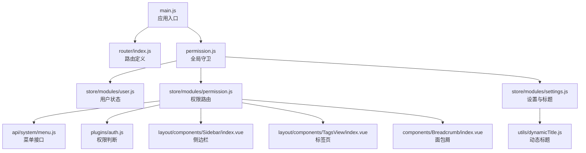
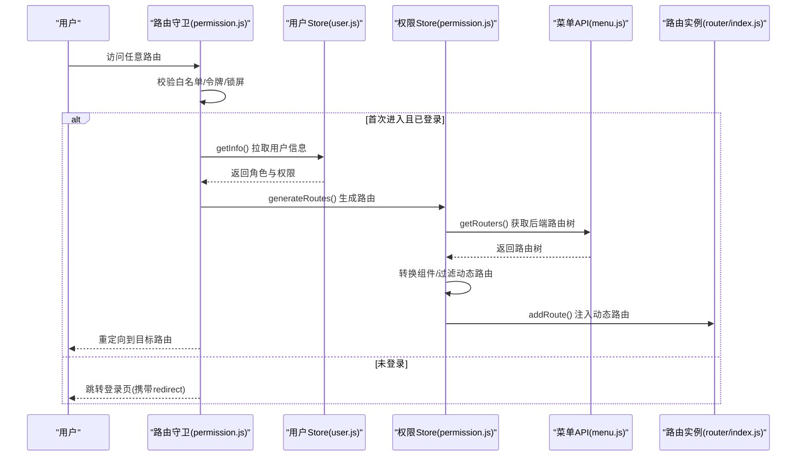
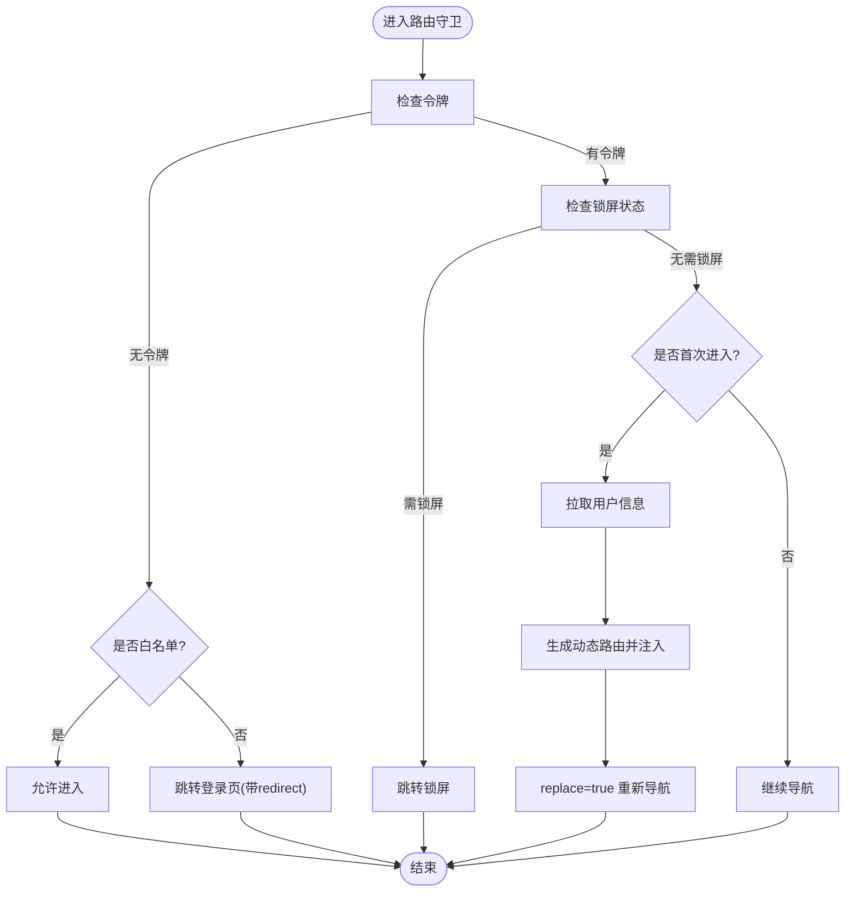
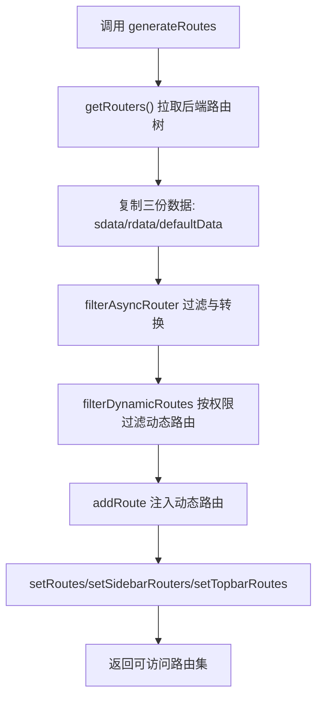
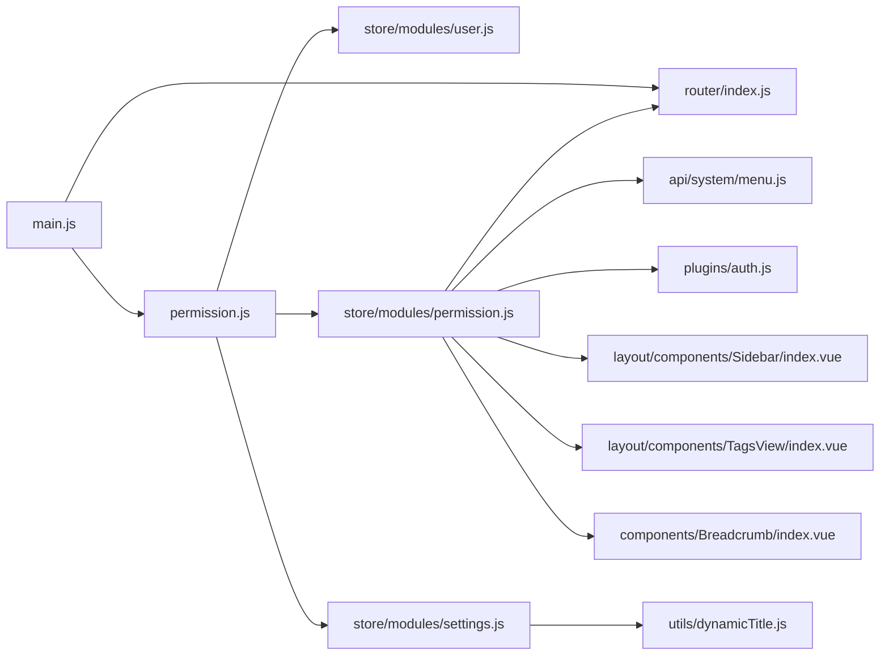

# 路由系统设计

<cite>
**本文引用的文件**
- [router/index.js](file://XingChen-Vue3/src/router/index.js)
- [permission.js](file://XingChen-Vue3/src/permission.js)
- [main.js](file://XingChen-Vue3/src/main.js)
- [store/modules/permission.js](file://XingChen-Vue3/src/store/modules/permission.js)
- [store/modules/user.js](file://XingChen-Vue3/src/store/modules/user.js)
- [store/modules/settings.js](file://XingChen-Vue3/src/store/modules/settings.js)
- [store/modules/tagsView.js](file://XingChen-Vue3/src/store/modules/tagsView.js)
- [plugins/auth.js](file://XingChen-Vue3/src/plugins/auth.js)
- [utils/permission.js](file://XingChen-Vue3/src/utils/permission.js)
- [utils/dynamicTitle.js](file://XingChen-Vue3/src/utils/dynamicTitle.js)
- [components/Breadcrumb/index.vue](file://XingChen-Vue3/src/components/Breadcrumb/index.vue)
- [layout/components/Sidebar/index.vue](file://XingChen-Vue3/src/layout/components/Sidebar/index.vue)
- [layout/components/TagsView/index.vue](file://XingChen-Vue3/src/layout/components/TagsView/index.vue)
- [api/system/menu.js](file://XingChen-Vue3/src/api/system/menu.js)
- [views/system/user/profile/index.vue](file://XingChen-Vue3/src/views/system/user/profile/index.vue)
</cite>

## 目录
1. [引言](#引言)
2. [项目结构](#项目结构)
3. [核心组件](#核心组件)
4. [架构总览](#架构总览)
5. [详细组件分析](#详细组件分析)
6. [依赖关系分析](#依赖关系分析)
7. [性能考量](#性能考量)
8. [故障排查指南](#故障排查指南)
9. [结论](#结论)
10. [附录](#附录)

## 引言
本文件系统化阐述健康管理系统前端的路由体系设计，围绕 Vue Router 的配置策略、路由守卫机制、动态路由生成与权限控制展开；同时覆盖菜单动态加载、路由懒加载、路由元信息配置、面包屑导航与页面标题管理，并给出路由权限控制的完整实现与最佳实践及性能优化建议。

## 项目结构
路由系统主要由以下模块协同完成：
- 路由定义与历史模式：在路由入口集中声明常量路由与动态路由，采用 HTML5 History 模式。
- 权限守卫与导航拦截：通过全局前置守卫进行登录校验、角色/权限过滤、动态路由注入与标题设置。
- 权限存储与动态路由：权限 Store 负责从后端获取路由树并转换为可渲染组件，同时维护侧边栏、顶部导航与默认路由集合。
- 用户状态与令牌：用户 Store 负责登录、获取用户信息、登出与令牌管理。
- 导航与标题：侧边栏菜单、标签页、面包屑与动态标题联动，统一由设置 Store 控制。
- 菜单与路由映射：菜单 API 提供后端路由树，权限 Store 将其转换为前端可用的路由结构。

**图表来源**
- [main.js:1-85](file://XingChen-Vue3/src/main.js#L1-L85)
- [router/index.js:1-197](file://XingChen-Vue3/src/router/index.js#L1-L197)
- [permission.js:1-78](file://XingChen-Vue3/src/permission.js#L1-L78)
- [store/modules/user.js:1-94](file://XingChen-Vue3/src/store/modules/user.js#L1-L94)
- [store/modules/permission.js:1-135](file://XingChen-Vue3/src/store/modules/permission.js#L1-L135)
- [store/modules/settings.js:1-53](file://XingChen-Vue3/src/store/modules/settings.js#L1-L53)
- [api/system/menu.js:1-69](file://XingChen-Vue3/src/api/system/menu.js#L1-L69)
- [plugins/auth.js:1-61](file://XingChen-Vue3/src/plugins/auth.js#L1-L61)
- [layout/components/Sidebar/index.vue:1-105](file://XingChen-Vue3/src/layout/components/Sidebar/index.vue#L1-L105)
- [layout/components/TagsView/index.vue:1-595](file://XingChen-Vue3/src/layout/components/TagsView/index.vue#L1-L595)
- [components/Breadcrumb/index.vue:1-97](file://XingChen-Vue3/src/components/Breadcrumb/index.vue#L1-L97)
- [utils/dynamicTitle.js:1-14](file://XingChen-Vue3/src/utils/dynamicTitle.js#L1-L14)

**章节来源**
- [main.js:1-85](file://XingChen-Vue3/src/main.js#L1-L85)
- [router/index.js:1-197](file://XingChen-Vue3/src/router/index.js#L1-L197)

## 核心组件
- 路由定义与历史模式
  - 常量路由：包含登录、注册、404、401、首页重定向、锁定屏等公共路由。
  - 动态路由：基于权限的编辑/查看类路由，运行时按权限注入。
  - 历史模式：使用 createWebHistory，结合后端路由树实现前后端一致的路由体验。
- 全局守卫
  - 白名单放行：登录、注册等无需令牌。
  - 令牌校验：无令牌跳转登录页，携带 redirect 参数。
  - 用户信息拉取：首次进入时拉取用户信息与权限，触发动态路由生成。
  - 锁屏控制：根据锁屏状态跳转至锁屏或首页。
  - 标题设置：根据路由 meta.title 动态设置页面标题。
- 权限 Store
  - 生成路由：调用菜单接口获取后端路由树，转换为前端可用的路由结构。
  - 组件解析：通过 import.meta.glob 自动解析组件路径，支持 Layout、ParentView、InnerLink 等特殊组件。
  - 权限过滤：对动态路由按角色/权限进行筛选。
  - 路由集合：维护 routes、addRoutes、sidebarRouters、topbarRouters、defaultRoutes。
- 用户 Store
  - 登录/登出：管理 token 与用户信息，初始化密码提示与头像处理。
  - 角色/权限：拉取后端角色与权限数组，用于权限判断。
- 设置 Store
  - 页面标题：接收路由标题并调用动态标题工具。
  - 主题与布局：控制侧边栏、标签页、固定头部等布局行为。
- 导航与标题
  - 侧边栏：读取权限 Store 的 sidebarRouters 渲染菜单，支持折叠与高亮 activeMenu。
  - 标签页：记录访问历史、缓存策略、持久化、右键菜单与全屏模式。
  - 面包屑：根据路由 matched 与权限路由树生成层级导航。
  - 动态标题：根据设置开关拼接站点标题。

**章节来源**
- [router/index.js:27-109](file://XingChen-Vue3/src/router/index.js#L27-L109)
- [router/index.js:111-183](file://XingChen-Vue3/src/router/index.js#L111-L183)
- [permission.js:21-73](file://XingChen-Vue3/src/permission.js#L21-L73)
- [store/modules/permission.js:35-54](file://XingChen-Vue3/src/store/modules/permission.js#L35-L54)
- [store/modules/permission.js:100-114](file://XingChen-Vue3/src/store/modules/permission.js#L100-L114)
- [store/modules/user.js:22-89](file://XingChen-Vue3/src/store/modules/user.js#L22-L89)
- [store/modules/settings.js:39-48](file://XingChen-Vue3/src/store/modules/settings.js#L39-L48)
- [layout/components/Sidebar/index.vue:16-68](file://XingChen-Vue3/src/layout/components/Sidebar/index.vue#L16-L68)
- [layout/components/TagsView/index.vue:195-206](file://XingChen-Vue3/src/layout/components/TagsView/index.vue#L195-L206)
- [components/Breadcrumb/index.vue:20-40](file://XingChen-Vue3/src/components/Breadcrumb/index.vue#L20-L40)
- [utils/dynamicTitle.js:7-14](file://XingChen-Vue3/src/utils/dynamicTitle.js#L7-L14)

## 架构总览
路由系统遵循“前端路由 + 后端路由树”的混合模式：前端定义常量路由与通用行为，后端提供菜单树（含组件路径、权限标识、元信息），前端在登录后拉取并转换为可渲染路由，再按角色/权限进行过滤与注入。

**图表来源**
- [permission.js:21-73](file://XingChen-Vue3/src/permission.js#L21-L73)
- [store/modules/user.js:39-75](file://XingChen-Vue3/src/store/modules/user.js#L39-L75)
- [store/modules/permission.js:35-54](file://XingChen-Vue3/src/store/modules/permission.js#L35-L54)
- [api/system/menu.js:1-69](file://XingChen-Vue3/src/api/system/menu.js#L1-L69)
- [router/index.js:185-197](file://XingChen-Vue3/src/router/index.js#L185-L197)

## 详细组件分析

### 路由配置与元信息
- 常量路由与动态路由分离，确保公共页面与受控页面解耦。
- 元信息字段：
  - hidden：是否在侧边栏显示。
  - alwaysShow：是否忽略子路由数量，始终显示根路由。
  - redirect/noRedirect：面包屑是否可点击。
  - name：路由唯一标识，配合 keep-alive 使用。
  - meta.title/icon/breadcrumb/activeMenu/noCache/affix 等。
- 动态路由示例：用户授权、角色授权、字典数据、任务调度日志、代码生成等，均通过 permissions 或 roles 字段进行权限约束。

**章节来源**
- [router/index.js:5-25](file://XingChen-Vue3/src/router/index.js#L5-L25)
- [router/index.js:27-109](file://XingChen-Vue3/src/router/index.js#L27-L109)
- [router/index.js:111-183](file://XingChen-Vue3/src/router/index.js#L111-L183)

### 路由守卫与导航拦截
- 白名单：登录、注册直接放行。
- 令牌与锁屏：无令牌跳转登录；已登录但处于锁屏状态跳转锁屏；锁屏解除后回到首页。
- 首次进入：拉取用户信息，生成可访问路由，注入到路由实例，确保 addRoutes 完成后再继续导航。
- 标题设置：若存在 meta.title，则调用设置 Store 设置标题并触发动态标题更新。

**图表来源**
- [permission.js:15-73](file://XingChen-Vue3/src/permission.js#L15-L73)

**章节来源**
- [permission.js:15-73](file://XingChen-Vue3/src/permission.js#L15-L73)

### 动态路由生成与权限过滤
- 后端路由树：通过菜单 API 获取，包含组件路径、权限标识、父子关系等。
- 组件解析：使用 import.meta.glob 遍历 views 下所有 .vue 文件，按组件路径精确匹配，支持 Layout/ParentView/InnerLink 特殊组件。
- 权限过滤：对动态路由按 permissions 或 roles 进行 OR/AND 判断，仅注入具备权限的路由。
- 路由注入：将动态路由逐条 addRoute 到路由实例，同时维护多份路由集合（sidebar/topbar/default）。

**图表来源**
- [store/modules/permission.js:35-54](file://XingChen-Vue3/src/store/modules/permission.js#L35-L54)
- [store/modules/permission.js:59-84](file://XingChen-Vue3/src/store/modules/permission.js#L59-L84)
- [store/modules/permission.js:100-114](file://XingChen-Vue3/src/store/modules/permission.js#L100-L114)
- [api/system/menu.js:1-69](file://XingChen-Vue3/src/api/system/menu.js#L1-L69)

**章节来源**
- [store/modules/permission.js:35-54](file://XingChen-Vue3/src/store/modules/permission.js#L35-L54)
- [store/modules/permission.js:59-84](file://XingChen-Vue3/src/store/modules/permission.js#L59-L84)
- [store/modules/permission.js:100-114](file://XingChen-Vue3/src/store/modules/permission.js#L100-L114)

### 权限判断与指令
- 插件权限：提供 hasPermi/hasRole 的 OR/AND 判断，支持通配符与超级管理员。
- 指令权限：checkPermi/checkRole 用于模板中快速控制按钮/区域可见性，便于细粒度权限控制。

**章节来源**
- [plugins/auth.js:27-60](file://XingChen-Vue3/src/plugins/auth.js#L27-L60)
- [utils/permission.js:8-51](file://XingChen-Vue3/src/utils/permission.js#L8-L51)

### 菜单动态加载与侧边栏
- 侧边栏读取权限 Store 的 sidebarRouters，实时响应动态路由注入。
- 支持主题切换、折叠状态、高亮 activeMenu（由路由 meta.activeMenu 决定）。
- 与标签页联动：标签页记录访问历史，支持持久化与缓存策略。

**章节来源**
- [layout/components/Sidebar/index.vue:16-68](file://XingChen-Vue3/src/layout/components/Sidebar/index.vue#L16-L68)
- [store/modules/permission.js:26-34](file://XingChen-Vue3/src/store/modules/permission.js#L26-L34)
- [store/modules/tagsView.js:10-22](file://XingChen-Vue3/src/store/modules/tagsView.js#L10-L22)

### 面包屑导航生成
- 根据当前路由 matched 与权限路由树匹配层级，自动补全首页入口。
- 支持 redirect=noRedirect 的禁用点击场景，以及自定义链接跳转。

**章节来源**
- [components/Breadcrumb/index.vue:20-84](file://XingChen-Vue3/src/components/Breadcrumb/index.vue#L20-L84)

### 页面标题管理
- 路由守卫在进入时将 meta.title 传递给设置 Store。
- 设置 Store 根据 dynamicTitle 开关决定是否拼接站点标题，动态标题工具负责最终 document.title 更新。

**章节来源**
- [permission.js:21-24](file://XingChen-Vue3/src/permission.js#L21-L24)
- [store/modules/settings.js:39-48](file://XingChen-Vue3/src/store/modules/settings.js#L39-L48)
- [utils/dynamicTitle.js:7-14](file://XingChen-Vue3/src/utils/dynamicTitle.js#L7-L14)

### 路由懒加载与组件解析
- 路由组件采用动态导入（路由级懒加载），减少首屏体积。
- 权限 Store 使用 import.meta.glob 遍历 views 下所有 .vue 文件，按组件路径精确匹配，避免硬编码导致的路径错误。

**章节来源**
- [router/index.js:34-36](file://XingChen-Vue3/src/router/index.js#L34-L36)
- [store/modules/permission.js:9](file://XingChen-Vue3/src/store/modules/permission.js#L9)
- [store/modules/permission.js:116-132](file://XingChen-Vue3/src/store/modules/permission.js#L116-L132)

### 标签页缓存与持久化
- 访问历史：记录 visitedViews，支持 affix 固定标签与持久化。
- 缓存策略：cachedViews 记录需要缓存的组件 name，noCache 控制是否缓存。
- 操作能力：关闭当前/其他/左右/全部，刷新页面，全屏模式，键盘快捷键等。

**章节来源**
- [store/modules/tagsView.js:33-103](file://XingChen-Vue3/src/store/modules/tagsView.js#L33-L103)
- [store/modules/tagsView.js:104-160](file://XingChen-Vue3/src/store/modules/tagsView.js#L104-L160)
- [store/modules/tagsView.js:169-223](file://XingChen-Vue3/src/store/modules/tagsView.js#L169-L223)
- [layout/components/TagsView/index.vue:195-206](file://XingChen-Vue3/src/layout/components/TagsView/index.vue#L195-L206)

## 依赖关系分析
- 应用入口 main.js 引入路由、状态与权限守卫，形成闭环。
- 权限 Store 依赖菜单 API、权限插件与路由实例。
- 守卫依赖用户 Store、设置 Store、权限 Store 与第三方进度条库。
- 导航组件依赖权限 Store 与设置 Store，形成数据驱动的 UI。

**图表来源**
- [main.js:1-85](file://XingChen-Vue3/src/main.js#L1-L85)
- [permission.js:1-78](file://XingChen-Vue3/src/permission.js#L1-L78)
- [store/modules/permission.js:1-135](file://XingChen-Vue3/src/store/modules/permission.js#L1-L135)
- [store/modules/user.js:1-94](file://XingChen-Vue3/src/store/modules/user.js#L1-L94)
- [store/modules/settings.js:1-53](file://XingChen-Vue3/src/store/modules/settings.js#L1-L53)
- [api/system/menu.js:1-69](file://XingChen-Vue3/src/api/system/menu.js#L1-L69)
- [plugins/auth.js:1-61](file://XingChen-Vue3/src/plugins/auth.js#L1-L61)
- [layout/components/Sidebar/index.vue:1-105](file://XingChen-Vue3/src/layout/components/Sidebar/index.vue#L1-L105)
- [layout/components/TagsView/index.vue:1-595](file://XingChen-Vue3/src/layout/components/TagsView/index.vue#L1-L595)
- [components/Breadcrumb/index.vue:1-97](file://XingChen-Vue3/src/components/Breadcrumb/index.vue#L1-L97)
- [utils/dynamicTitle.js:1-14](file://XingChen-Vue3/src/utils/dynamicTitle.js#L1-L14)

**章节来源**
- [main.js:1-85](file://XingChen-Vue3/src/main.js#L1-L85)
- [permission.js:1-78](file://XingChen-Vue3/src/permission.js#L1-L78)
- [store/modules/permission.js:1-135](file://XingChen-Vue3/src/store/modules/permission.js#L1-L135)

## 性能考量
- 路由懒加载：路由级动态导入，降低首屏资源压力。
- 组件按需解析：import.meta.glob 避免手动维护组件映射，提升可维护性。
- 标签页缓存：cachedViews 仅缓存必要组件，noCache 可精准控制不缓存页面。
- 持久化标签页：visitedViews 持久化，减少重复加载。
- 进度条与滚动：NProgress 与滚动位置恢复，改善用户体验。
- 最佳实践建议：
  - 对高频访问的首页与常用功能页面，考虑在路由元信息中设置 affix 固定标签。
  - 对大组件或复杂页面，合理使用 meta.noCache 与 keep-alive 结合，平衡内存与性能。
  - 动态路由注入后使用 replace=true 重定向，避免重复历史记录。
  - 对权限变更频繁的场景，提供“刷新路由”能力，确保权限生效即时。

[本节为通用指导，无需列出具体文件来源]

## 故障排查指南
- 登录后无法进入目标页面
  - 检查是否成功拉取用户信息与权限，确认 generateRoutes 是否执行并注入动态路由。
  - 核对后端菜单组件路径与 src/views 下文件名是否一致（区分大小写与斜杠）。
- 权限不足导致页面空白
  - 确认动态路由是否按 permissions/roles 成功过滤，检查 hasPermiOr/hasRoleOr 的权限集合。
- 面包屑不显示或层级错误
  - 检查路由 meta.title 与面包屑生成逻辑，确认权限路由树匹配是否正确。
- 页面标题未更新
  - 确认路由 meta.title 是否存在，设置 Store 的 dynamicTitle 开关与 useDynamicTitle 调用链路。
- 标签页不缓存或频繁刷新
  - 检查 meta.noCache 与 cachedViews 的注入时机，确认 keep-alive 与组件 name 一致性。

**章节来源**
- [store/modules/permission.js:116-132](file://XingChen-Vue3/src/store/modules/permission.js#L116-L132)
- [plugins/auth.js:27-60](file://XingChen-Vue3/src/plugins/auth.js#L27-L60)
- [components/Breadcrumb/index.vue:20-40](file://XingChen-Vue3/src/components/Breadcrumb/index.vue#L20-L40)
- [store/modules/settings.js:39-48](file://XingChen-Vue3/src/store/modules/settings.js#L39-L48)
- [store/modules/tagsView.js:62-67](file://XingChen-Vue3/src/store/modules/tagsView.js#L62-L67)

## 结论
该路由系统通过“前端常量路由 + 后端路由树”的组合，实现了灵活的权限控制与动态导航。配合全局守卫、权限 Store、用户 Store 与设置 Store 的协同，形成了从登录到导航、从权限到可视化的完整闭环。通过懒加载、缓存与持久化策略，兼顾了性能与用户体验。建议在实际项目中持续完善权限模型与路由元信息规范，确保扩展性与可维护性。

[本节为总结性内容，无需列出具体文件来源]

## 附录
- 路由元信息字段速查
  - hidden：是否隐藏于侧边栏
  - alwaysShow：是否忽略子路由数量
  - redirect/noRedirect：面包屑可点击性
  - name：路由唯一标识
  - meta.title/icon/breadcrumb/activeMenu/noCache/affix：导航与缓存控制
- 权限判断速查
  - hasPermi/hasRole：单值判断
  - hasPermiOr/hasRoleOr：任一满足
  - hasPermiAnd/hasRoleAnd：全部满足

[本节为参考性内容，无需列出具体文件来源]