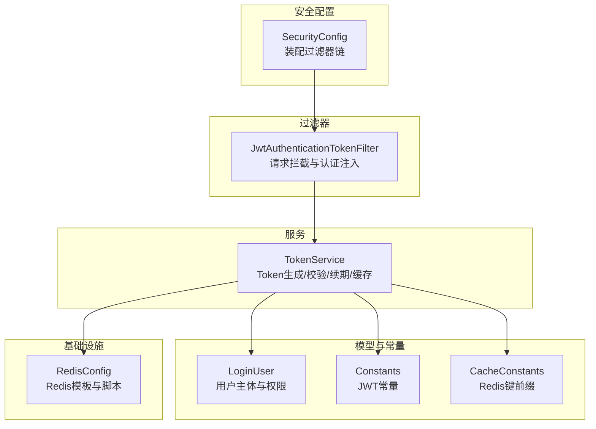
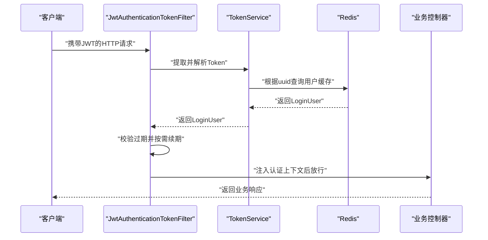
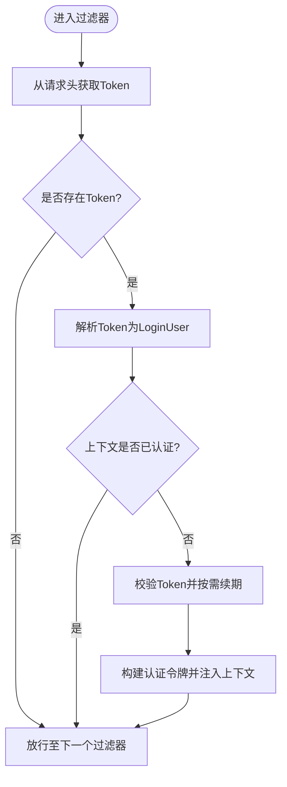
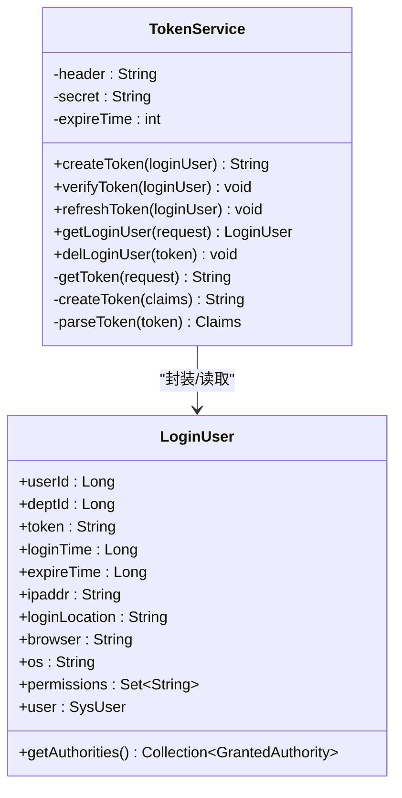
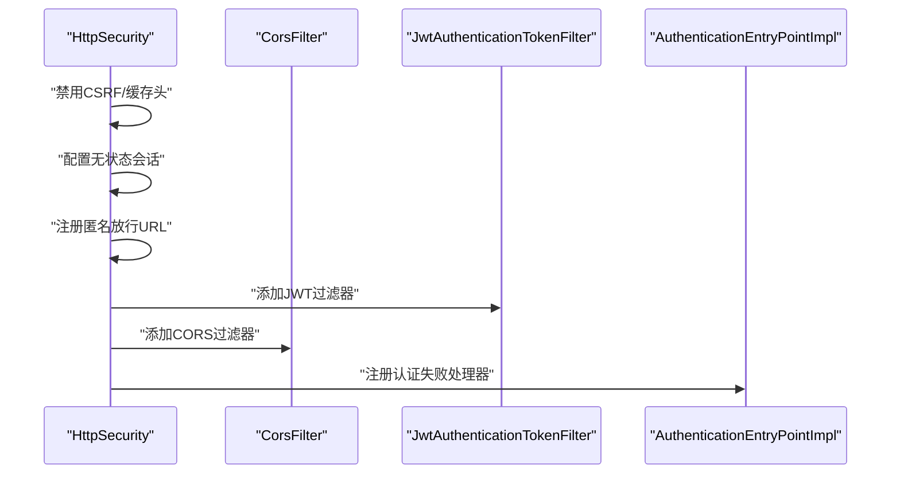
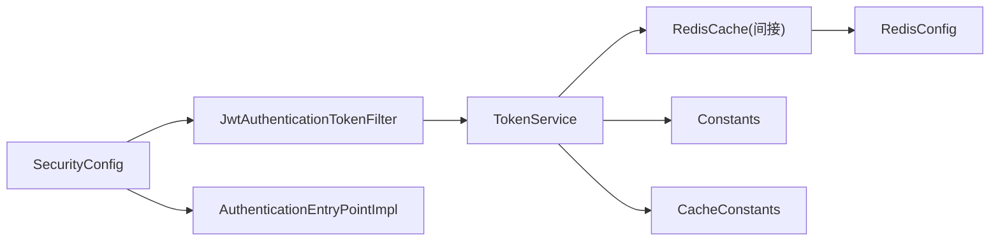

# JWT认证机制

<cite>
**本文引用的文件**
- [JwtAuthenticationTokenFilter.java](file://XingChen-Vue/xingchen-framework/src/main/java/com/xingchen/framework/security/filter/JwtAuthenticationTokenFilter.java)
- [TokenService.java](file://XingChen-Vue/xingchen-framework/src/main/java/com/xingchen/framework/web/service/TokenService.java)
- [LoginUser.java](file://XingChen-Vue/xingchen-common/src/main/java/com/xingchen/common/core/domain/model/LoginUser.java)
- [SecurityConfig.java](file://XingChen-Vue/xingchen-framework/src/main/java/com/xingchen/framework/config/SecurityConfig.java)
- [Constants.java](file://XingChen-Vue/xingchen-common/src/main/java/com/xingchen/common/constant/Constants.java)
- [CacheConstants.java](file://XingChen-Vue/xingchen-common/src/main/java/com/xingchen/common/constant/CacheConstants.java)
- [AuthenticationEntryPointImpl.java](file://XingChen-Vue/xingchen-framework/src/main/java/com/xingchen/framework/security/handle/AuthenticationEntryPointImpl.java)
- [UserDetailsServiceImpl.java](file://XingChen-Vue/xingchen-framework/src/main/java/com/xingchen/framework/web/service/UserDetailsServiceImpl.java)
- [RedisConfig.java](file://XingChen-Vue/xingchen-framework/src/main/java/com/xingchen/framework/config/RedisConfig.java)
</cite>

## 目录
1. [引言](#引言)
2. [项目结构](#项目结构)
3. [核心组件](#核心组件)
4. [架构总览](#架构总览)
5. [组件详解](#组件详解)
6. [依赖关系分析](#依赖关系分析)
7. [性能与优化](#性能与优化)
8. [故障排查指南](#故障排查指南)
9. [结论](#结论)
10. [附录](#附录)

## 引言
本文件系统性梳理健康管理系统中的JWT认证机制，覆盖Token生成、验证与续期流程；深入解析JwtAuthenticationTokenFilter的工作原理与实现细节；阐述TokenService服务接口、LoginUser模型设计与认证上下文管理；给出JWT配置参数、过期时间、签名算法与Token存储策略；并提供最佳实践、性能优化建议与常见问题解决方案。

## 项目结构
围绕JWT认证的关键模块分布如下：
- 安全配置层：Spring Security配置与过滤器链装配
- 过滤器层：JWT请求拦截与认证上下文注入
- 服务层：Token生成、校验、续期与Redis缓存交互
- 模型层：LoginUser用户主体与权限封装
- 常量与配置：JWT头部键、签名密钥、过期时间、Redis键前缀等

图表来源
- [SecurityConfig.java:86-118](file://XingChen-Vue/xingchen-framework/src/main/java/com/xingchen/framework/config/SecurityConfig.java#L86-L118)
- [JwtAuthenticationTokenFilter.java:25-44](file://XingChen-Vue/xingchen-framework/src/main/java/com/xingchen/framework/security/filter/JwtAuthenticationTokenFilter.java#L25-L44)
- [TokenService.java:32-233](file://XingChen-Vue/xingchen-framework/src/main/java/com/xingchen/framework/web/service/TokenService.java#L32-L233)
- [LoginUser.java:19-279](file://XingChen-Vue/xingchen-common/src/main/java/com/xingchen/common/core/domain/model/LoginUser.java#L19-L279)
- [Constants.java:105-121](file://XingChen-Vue/xingchen-common/src/main/java/com/xingchen/common/constant/Constants.java#L105-L121)
- [CacheConstants.java:13](file://XingChen-Vue/xingchen-common/src/main/java/com/xingchen/common/constant/CacheConstants.java#L13)
- [RedisConfig.java:24-41](file://XingChen-Vue/xingchen-framework/src/main/java/com/xingchen/framework/config/RedisConfig.java#L24-L41)

章节来源
- [SecurityConfig.java:86-118](file://XingChen-Vue/xingchen-framework/src/main/java/com/xingchen/framework/config/SecurityConfig.java#L86-L118)
- [JwtAuthenticationTokenFilter.java:25-44](file://XingChen-Vue/xingchen-framework/src/main/java/com/xingchen/framework/security/filter/JwtAuthenticationTokenFilter.java#L25-L44)
- [TokenService.java:32-233](file://XingChen-Vue/xingchen-framework/src/main/java/com/xingchen/framework/web/service/TokenService.java#L32-L233)
- [LoginUser.java:19-279](file://XingChen-Vue/xingchen-common/src/main/java/com/xingchen/common/core/domain/model/LoginUser.java#L19-L279)
- [Constants.java:105-121](file://XingChen-Vue/xingchen-common/src/main/java/com/xingchen/common/constant/Constants.java#L105-L121)
- [CacheConstants.java:13](file://XingChen-Vue/xingchen-common/src/main/java/com/xingchen/common/constant/CacheConstants.java#L13)
- [RedisConfig.java:24-41](file://XingChen-Vue/xingchen-framework/src/main/java/com/xingchen/framework/config/RedisConfig.java#L24-L41)

## 核心组件
- JwtAuthenticationTokenFilter：在每个请求进入时提取Token，解析用户信息，构建认证上下文，供后续业务使用。
- TokenService：负责JWT生成、解析、续期与Redis缓存交互；维护用户会话元数据（登录时间、过期时间、设备信息等）。
- LoginUser：实现UserDetails，承载用户基本信息、权限集合与会话扩展字段（IP、浏览器、操作系统等）。
- SecurityConfig：装配Spring Security过滤器链，启用无状态会话策略，注册JWT过滤器与跨域过滤器。
- Constants与CacheConstants：统一管理JWT头部键、Token前缀、Redis键前缀等常量。
- RedisConfig：提供RedisTemplate与脚本支持，保障Token缓存一致性与原子操作。

章节来源
- [JwtAuthenticationTokenFilter.java:25-44](file://XingChen-Vue/xingchen-framework/src/main/java/com/xingchen/framework/security/filter/JwtAuthenticationTokenFilter.java#L25-L44)
- [TokenService.java:32-233](file://XingChen-Vue/xingchen-framework/src/main/java/com/xingchen/framework/web/service/TokenService.java#L32-L233)
- [LoginUser.java:19-279](file://XingChen-Vue/xingchen-common/src/main/java/com/xingchen/common/core/domain/model/LoginUser.java#L19-L279)
- [SecurityConfig.java:86-118](file://XingChen-Vue/xingchen-framework/src/main/java/com/xingchen/framework/config/SecurityConfig.java#L86-L118)
- [Constants.java:105-121](file://XingChen-Vue/xingchen-common/src/main/java/com/xingchen/common/constant/Constants.java#L105-L121)
- [CacheConstants.java:13](file://XingChen-Vue/xingchen-common/src/main/java/com/xingchen/common/constant/CacheConstants.java#L13)
- [RedisConfig.java:24-41](file://XingChen-Vue/xingchen-framework/src/main/java/com/xingchen/framework/config/RedisConfig.java#L24-L41)

## 架构总览
JWT认证在本系统中采用“无状态”设计：客户端持有JWT，服务端不保存会话；认证由过滤器完成，业务层只读取认证上下文。

图表来源
- [JwtAuthenticationTokenFilter.java:31-42](file://XingChen-Vue/xingchen-framework/src/main/java/com/xingchen/framework/security/filter/JwtAuthenticationTokenFilter.java#L31-L42)
- [TokenService.java:62-83](file://XingChen-Vue/xingchen-framework/src/main/java/com/xingchen/framework/web/service/TokenService.java#L62-L83)
- [TokenService.java:148-155](file://XingChen-Vue/xingchen-framework/src/main/java/com/xingchen/framework/web/service/TokenService.java#L148-L155)
- [CacheConstants.java:13](file://XingChen-Vue/xingchen-common/src/main/java/com/xingchen/common/constant/CacheConstants.java#L13)

## 组件详解

### JwtAuthenticationTokenFilter工作原理
- 请求到达时，从请求头中提取Token（遵循统一前缀约定），若存在且当前上下文未认证，则调用TokenService解析并校验。
- 若Token有效且距离过期时间小于阈值（约20分钟），触发Token续期以延长会话。
- 将解析出的LoginUser封装为UsernamePasswordAuthenticationToken，设置到SecurityContextHolder，供后续授权与业务使用。

图表来源
- [JwtAuthenticationTokenFilter.java:31-42](file://XingChen-Vue/xingchen-framework/src/main/java/com/xingchen/framework/security/filter/JwtAuthenticationTokenFilter.java#L31-L42)
- [TokenService.java:133-141](file://XingChen-Vue/xingchen-framework/src/main/java/com/xingchen/framework/web/service/TokenService.java#L133-L141)

章节来源
- [JwtAuthenticationTokenFilter.java:25-44](file://XingChen-Vue/xingchen-framework/src/main/java/com/xingchen/framework/security/filter/JwtAuthenticationTokenFilter.java#L25-L44)
- [TokenService.java:62-83](file://XingChen-Vue/xingchen-framework/src/main/java/com/xingchen/framework/web/service/TokenService.java#L62-L83)
- [TokenService.java:133-141](file://XingChen-Vue/xingchen-framework/src/main/java/com/xingchen/framework/web/service/TokenService.java#L133-L141)

### TokenService服务接口与实现要点
- 配置参数
  - 头部键：通过配置项读取，默认使用统一头部键。
  - 密钥：通过配置项读取，用于签名与解析。
  - 过期时间：单位分钟，用于计算过期时间与续期阈值。
- Token生成
  - 生成唯一uuid作为token标识，填充用户代理信息（IP、登录地点、浏览器、操作系统）。
  - 构造JWT载荷，包含用户标识与用户名，使用指定签名算法生成Token。
- Token解析与校验
  - 从请求头中提取Token并去除前缀，解析得到Claims。
  - 依据uuid拼接Redis键，从缓存中取出LoginUser。
  - 校验过期时间，若即将过期则自动续期。
- 缓存策略
  - 以uuid为键，缓存LoginUser，过期时间与Token一致。
  - 续期时更新登录时间与过期时间，延长缓存有效期。

图表来源
- [TokenService.java:32-233](file://XingChen-Vue/xingchen-framework/src/main/java/com/xingchen/framework/web/service/TokenService.java#L32-L233)
- [LoginUser.java:19-279](file://XingChen-Vue/xingchen-common/src/main/java/com/xingchen/common/core/domain/model/LoginUser.java#L19-L279)

章节来源
- [TokenService.java:36-46](file://XingChen-Vue/xingchen-framework/src/main/java/com/xingchen/framework/web/service/TokenService.java#L36-L46)
- [TokenService.java:114-125](file://XingChen-Vue/xingchen-framework/src/main/java/com/xingchen/framework/web/service/TokenService.java#L114-L125)
- [TokenService.java:178-184](file://XingChen-Vue/xingchen-framework/src/main/java/com/xingchen/framework/web/service/TokenService.java#L178-L184)
- [TokenService.java:192-198](file://XingChen-Vue/xingchen-framework/src/main/java/com/xingchen/framework/web/service/TokenService.java#L192-L198)
- [TokenService.java:218-226](file://XingChen-Vue/xingchen-framework/src/main/java/com/xingchen/framework/web/service/TokenService.java#L218-L226)
- [TokenService.java:228-231](file://XingChen-Vue/xingchen-framework/src/main/java/com/xingchen/framework/web/service/TokenService.java#L228-L231)
- [CacheConstants.java:13](file://XingChen-Vue/xingchen-common/src/main/java/com/xingchen/common/constant/CacheConstants.java#L13)

### LoginUser模型设计
- 继承UserDetails，提供用户名、密码、权限集合等标准安全接口。
- 扩展会话相关字段：token、loginTime、expireTime、ipaddr、loginLocation、browser、os。
- 权限集合转换为GrantedAuthority列表，供Spring Security使用。

章节来源
- [LoginUser.java:19-279](file://XingChen-Vue/xingchen-common/src/main/java/com/xingchen/common/core/domain/model/LoginUser.java#L19-L279)

### 认证上下文与安全配置
- SecurityConfig启用无状态会话策略，禁用CSRF与静态响应头缓存。
- 在用户名密码过滤器之前添加JWT过滤器，确保先完成Token认证。
- 提供认证失败处理器，统一返回未授权响应。

图表来源
- [SecurityConfig.java:86-118](file://XingChen-Vue/xingchen-framework/src/main/java/com/xingchen/framework/config/SecurityConfig.java#L86-L118)
- [AuthenticationEntryPointImpl.java:26-33](file://XingChen-Vue/xingchen-framework/src/main/java/com/xingchen/framework/security/handle/AuthenticationEntryPointImpl.java#L26-L33)

章节来源
- [SecurityConfig.java:86-118](file://XingChen-Vue/xingchen-framework/src/main/java/com/xingchen/framework/config/SecurityConfig.java#L86-L118)
- [AuthenticationEntryPointImpl.java:21-34](file://XingChen-Vue/xingchen-framework/src/main/java/com/xingchen/framework/security/handle/AuthenticationEntryPointImpl.java#L21-L34)

### 用户详情加载与权限体系
- UserDetailsServiceImpl按用户名加载用户，校验状态与密码，组装LoginUser并注入菜单权限。
- LoginUser的权限集合最终转换为GrantedAuthority，供授权决策使用。

章节来源
- [UserDetailsServiceImpl.java:37-65](file://XingChen-Vue/xingchen-framework/src/main/java/com/xingchen/framework/web/service/UserDetailsServiceImpl.java#L37-L65)
- [LoginUser.java:265-277](file://XingChen-Vue/xingchen-common/src/main/java/com/xingchen/common/core/domain/model/LoginUser.java#L265-L277)

## 依赖关系分析
- JwtAuthenticationTokenFilter依赖TokenService完成Token解析与续期。
- TokenService依赖RedisCache进行LoginUser缓存读写，依赖Constants与CacheConstants进行键与常量管理。
- SecurityConfig装配JwtAuthenticationTokenFilter与跨域过滤器，统一异常处理。
- RedisConfig提供RedisTemplate，保障Token缓存的序列化与原子脚本能力。

图表来源
- [JwtAuthenticationTokenFilter.java:27-28](file://XingChen-Vue/xingchen-framework/src/main/java/com/xingchen/framework/security/filter/JwtAuthenticationTokenFilter.java#L27-L28)
- [TokenService.java:54-55](file://XingChen-Vue/xingchen-framework/src/main/java/com/xingchen/framework/web/service/TokenService.java#L54-L55)
- [Constants.java:105-121](file://XingChen-Vue/xingchen-common/src/main/java/com/xingchen/common/constant/Constants.java#L105-L121)
- [CacheConstants.java:13](file://XingChen-Vue/xingchen-common/src/main/java/com/xingchen/common/constant/CacheConstants.java#L13)
- [SecurityConfig.java:113-116](file://XingChen-Vue/xingchen-framework/src/main/java/com/xingchen/framework/config/SecurityConfig.java#L113-L116)
- [RedisConfig.java:24-41](file://XingChen-Vue/xingchen-framework/src/main/java/com/xingchen/framework/config/RedisConfig.java#L24-L41)

章节来源
- [JwtAuthenticationTokenFilter.java:27-28](file://XingChen-Vue/xingchen-framework/src/main/java/com/xingchen/framework/security/filter/JwtAuthenticationTokenFilter.java#L27-L28)
- [TokenService.java:54-55](file://XingChen-Vue/xingchen-framework/src/main/java/com/xingchen/framework/web/service/TokenService.java#L54-L55)
- [SecurityConfig.java:113-116](file://XingChen-Vue/xingchen-framework/src/main/java/com/xingchen/framework/config/SecurityConfig.java#L113-L116)

## 性能与优化
- Token续期策略：当剩余有效期低于阈值时自动续期，避免频繁重建Token带来的开销。
- 缓存命中：LoginUser以uuid为键缓存，解析Token时直接命中，减少数据库查询。
- 无状态设计：移除Session，降低服务器内存占用，提升横向扩展能力。
- 序列化优化：Redis使用FastJSON序列化，兼顾性能与兼容性。
- 建议
  - 合理设置过期时间与续期阈值，平衡安全性与用户体验。
  - 对高并发场景，建议开启Redis集群与持久化策略，确保缓存可用性。
  - 前端应避免重复发送无效Token，减少不必要的解析与续期。

[本节为通用性能讨论，无需列出具体文件来源]

## 故障排查指南
- 认证失败
  - 现象：统一返回未授权错误。
  - 排查：确认请求头是否包含正确前缀与Token；检查签名密钥与算法一致性；查看Token是否过期或被撤销。
- Token解析异常
  - 现象：日志记录解析异常，返回空用户。
  - 排查：核对Token签名密钥；确认Redis中是否存在对应uuid的缓存；检查请求头键名配置。
- 会话未生效
  - 现象：业务未识别已认证用户。
  - 排查：确认JwtAuthenticationTokenFilter是否在用户名密码过滤器之前；检查SecurityConfig的过滤器顺序与无状态策略。
- 缓存失效
  - 现象：Token有效但用户信息缺失。
  - 排查：确认Redis连接与序列化配置；检查缓存键前缀与过期时间；必要时清理异常缓存。

章节来源
- [AuthenticationEntryPointImpl.java:26-33](file://XingChen-Vue/xingchen-framework/src/main/java/com/xingchen/framework/security/handle/AuthenticationEntryPointImpl.java#L26-L33)
- [TokenService.java:68-81](file://XingChen-Vue/xingchen-framework/src/main/java/com/xingchen/framework/web/service/TokenService.java#L68-L81)
- [SecurityConfig.java:113-116](file://XingChen-Vue/xingchen-framework/src/main/java/com/xingchen/framework/config/SecurityConfig.java#L113-L116)
- [CacheConstants.java:13](file://XingChen-Vue/xingchen-common/src/main/java/com/xingchen/common/constant/CacheConstants.java#L13)

## 结论
本系统的JWT认证机制以无状态为核心，通过过滤器链在请求早期完成Token解析与上下文注入，结合Redis缓存实现高效、可扩展的认证方案。TokenService承担了生成、校验与续期的关键职责，LoginUser模型提供了完整的用户与权限信息载体。配合合理的配置参数与缓存策略，可在保证安全性的前提下获得良好的性能表现。

[本节为总结性内容，无需列出具体文件来源]

## 附录

### JWT配置参数与默认行为
- 头部键：从配置读取，用于从请求头提取Token。
- 密钥：从配置读取，用于JWT签名与解析。
- 过期时间：单位分钟，用于计算expireTime与续期阈值。
- Token前缀：统一前缀约定，过滤器会自动去除。
- Redis键前缀：以uuid为后缀缓存LoginUser。

章节来源
- [TokenService.java:36-46](file://XingChen-Vue/xingchen-framework/src/main/java/com/xingchen/framework/web/service/TokenService.java#L36-L46)
- [Constants.java:105-121](file://XingChen-Vue/xingchen-common/src/main/java/com/xingchen/common/constant/Constants.java#L105-L121)
- [CacheConstants.java:13](file://XingChen-Vue/xingchen-common/src/main/java/com/xingchen/common/constant/CacheConstants.java#L13)

### Token生命周期管理
- 生成：创建uuid并填充用户代理信息，构造JWT载荷，使用指定算法签名。
- 验证：解析Token，从Redis读取LoginUser，校验过期时间。
- 续期：当剩余有效期低于阈值时，更新登录时间与过期时间并延长缓存。
- 失效：删除Redis中对应uuid的缓存，或在业务侧主动撤销。

章节来源
- [TokenService.java:114-125](file://XingChen-Vue/xingchen-framework/src/main/java/com/xingchen/framework/web/service/TokenService.java#L114-L125)
- [TokenService.java:133-141](file://XingChen-Vue/xingchen-framework/src/main/java/com/xingchen/framework/web/service/TokenService.java#L133-L141)
- [TokenService.java:148-155](file://XingChen-Vue/xingchen-framework/src/main/java/com/xingchen/framework/web/service/TokenService.java#L148-L155)
- [TokenService.java:99-106](file://XingChen-Vue/xingchen-framework/src/main/java/com/xingchen/framework/web/service/TokenService.java#L99-L106)