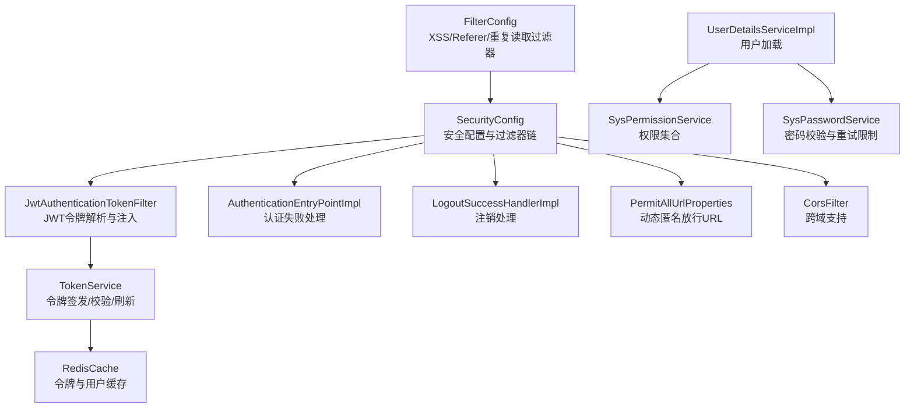
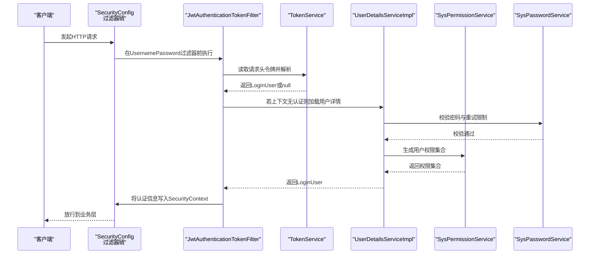
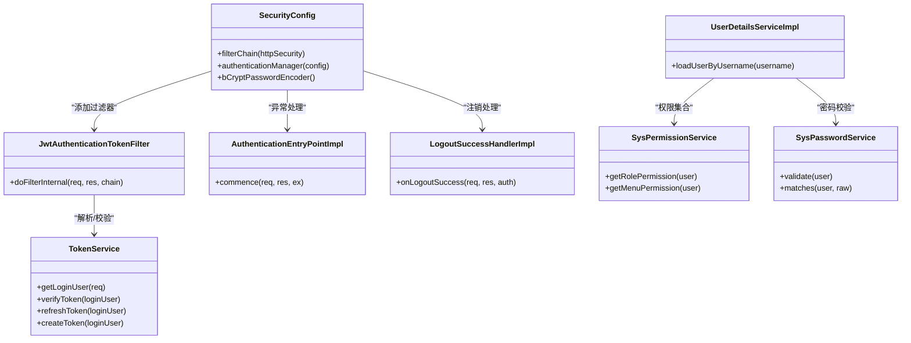

# Spring Security配置

<cite>
**本文引用的文件**
- [SecurityConfig.java](file://XingChen-Vue/xingchen-framework/src/main/java/com/xingchen/framework/config/SecurityConfig.java)
- [JwtAuthenticationTokenFilter.java](file://XingChen-Vue/xingchen-framework/src/main/java/com/xingchen/framework/security/filter/JwtAuthenticationTokenFilter.java)
- [AuthenticationEntryPointImpl.java](file://XingChen-Vue/xingchen-framework/src/main/java/com/xingchen/framework/security/handle/AuthenticationEntryPointImpl.java)
- [LogoutSuccessHandlerImpl.java](file://XingChen-Vue/xingchen-framework/src/main/java/com/xingchen/framework/security/handle/LogoutSuccessHandlerImpl.java)
- [UserDetailsServiceImpl.java](file://XingChen-Vue/xingchen-framework/src/main/java/com/xingchen/framework/web/service/UserDetailsServiceImpl.java)
- [TokenService.java](file://XingChen-Vue/xingchen-framework/src/main/java/com/xingchen/framework/web/service/TokenService.java)
- [PermitAllUrlProperties.java](file://XingChen-Vue/xingchen-framework/src/main/java/com/xingchen/framework/config/properties/PermitAllUrlProperties.java)
- [FilterConfig.java](file://XingChen-Vue/xingchen-framework/src/main/java/com/xingchen/framework/config/FilterConfig.java)
- [SysPermissionService.java](file://XingChen-Vue/xingchen-framework/src/main/java/com/xingchen/framework/web/service/SysPermissionService.java)
- [SysPasswordService.java](file://XingChen-Vue/xingchen-framework/src/main/java/com/xingchen/framework/web/service/SysPasswordService.java)
- [Constants.java](file://XingChen-Vue/xingchen-common/src/main/java/com/xingchen/common/constant/Constants.java)
- [SecurityUtils.java](file://XingChen-Vue/xingchen-common/src/main/java/com/xingchen/common/utils/SecurityUtils.java)
- [Anonymous.java](file://XingChen-Vue/xingchen-common/src/main/java/com/xingchen/common/annotation/Anonymous.java)
- [application.yml](file://XingChen-Vue/xingchen-admin/src/main/resources/application.yml)
- [AuthenticationContextHolder.java](file://XingChen-Vue/xingchen-framework/src/main/java/com/xingchen/framework/security/context/AuthenticationContextHolder.java)
- [PermissionContextHolder.java](file://XingChen-Vue/xingchen-framework/src/main/java/com/xingchen/framework/security/context/PermissionContextHolder.java)
</cite>

## 目录
1. [简介](#简介)
2. [项目结构](#项目结构)
3. [核心组件](#核心组件)
4. [架构总览](#架构总览)
5. [详细组件分析](#详细组件分析)
6. [依赖关系分析](#依赖关系分析)
7. [性能考虑](#性能考虑)
8. [故障排查指南](#故障排查指南)
9. [结论](#结论)
10. [附录](#附录)

## 简介
本文件面向“健康管理系统”的后端安全配置，围绕Spring Security核心配置类SecurityConfig展开，系统性阐述基于无状态JWT的认证与授权流程、过滤器链构建、权限表达式与访问控制规则、异常处理与认证入口点、CORS与CSRF策略、会话管理与“记住我”能力现状、自定义权限解析器与认证/注销处理器的集成方式，并提供调试方法、性能优化建议与安全加固方案。

## 项目结构
后端采用前后端分离架构，Spring Security配置集中在框架模块中，核心文件如下：
- 安全配置与过滤器链：SecurityConfig、JwtAuthenticationTokenFilter
- 异常与注销处理：AuthenticationEntryPointImpl、LogoutSuccessHandlerImpl
- 用户与权限服务：UserDetailsServiceImpl、SysPermissionService、SysPasswordService
- 令牌与上下文：TokenService、AuthenticationContextHolder、PermissionContextHolder
- 动态放行URL：PermitAllUrlProperties（结合Anonymous注解）
- 其他过滤器：FilterConfig（XSS、Referer、重复读取等）
- 配置参数：application.yml（token、密码策略、XSS、Referer等）

图表来源
- [SecurityConfig.java:85-118](file://XingChen-Vue/xingchen-framework/src/main/java/com/xingchen/framework/config/SecurityConfig.java#L85-L118)
- [JwtAuthenticationTokenFilter.java:30-43](file://XingChen-Vue/xingchen-framework/src/main/java/com/xingchen/framework/security/filter/JwtAuthenticationTokenFilter.java#L30-L43)
- [TokenService.java:62-83](file://XingChen-Vue/xingchen-framework/src/main/java/com/xingchen/framework/web/service/TokenService.java#L62-L83)
- [PermitAllUrlProperties.java:38-56](file://XingChen-Vue/xingchen-framework/src/main/java/com/xingchen/framework/config/properties/PermitAllUrlProperties.java#L38-L56)
- [FilterConfig.java:34-78](file://XingChen-Vue/xingchen-framework/src/main/java/com/xingchen/framework/config/FilterConfig.java#L34-L78)

章节来源
- [SecurityConfig.java:27-128](file://XingChen-Vue/xingchen-framework/src/main/java/com/xingchen/framework/config/SecurityConfig.java#L27-L128)
- [FilterConfig.java:22-81](file://XingChen-Vue/xingchen-framework/src/main/java/com/xingchen/framework/config/FilterConfig.java#L22-L81)

## 核心组件
- 安全配置类SecurityConfig
  - 启用方法级安全（@EnableMethodSecurity），开启prePostEnabled与securedEnabled
  - 禁用CSRF与HTTP头缓存策略，启用无状态Session（STATELESS）
  - 配置异常处理入口AuthenticationEntryPointImpl
  - 构建过滤器链：CORS过滤器在JWT之前、JWT在UsernamePassword过滤器之前、注销在LogoutFilter之前
  - 放行静态资源、登录注册、验证码、Swagger与Druid等路径；其余请求均需认证
  - 提供BCrypt密码编码器Bean
- JWT过滤器JwtAuthenticationTokenFilter
  - 从请求头提取令牌，解析用户信息并校验有效性
  - 将认证信息写入SecurityContext，供后续授权使用
- 认证入口点AuthenticationEntryPointImpl
  - 统一返回未认证响应，JSON格式
- 注销处理器LogoutSuccessHandlerImpl
  - 清理Redis中的用户缓存，异步记录登出日志，返回成功响应
- 用户详情服务UserDetailsServiceImpl
  - 加载用户、校验状态、委托密码服务进行密码校验，组装LoginUser
- 权限与密码服务
  - SysPermissionService：根据用户角色与菜单生成权限集合
  - SysPasswordService：密码匹配、重试计数与锁定
- 令牌服务TokenService
  - 令牌签发、解析、刷新、用户代理与地理位置填充、Redis缓存
- 动态匿名放行PermitAllUrlProperties
  - 扫描带@Anonymous注解的控制器或方法，收集可匿名访问的URL模式
- 过滤器配置FilterConfig
  - 注册XSS、Referer、可重复读取等过滤器，按优先级装配

章节来源
- [SecurityConfig.java:85-118](file://XingChen-Vue/xingchen-framework/src/main/java/com/xingchen/framework/config/SecurityConfig.java#L85-L118)
- [JwtAuthenticationTokenFilter.java:30-43](file://XingChen-Vue/xingchen-framework/src/main/java/com/xingchen/framework/security/filter/JwtAuthenticationTokenFilter.java#L30-L43)
- [AuthenticationEntryPointImpl.java:26-33](file://XingChen-Vue/xingchen-framework/src/main/java/com/xingchen/framework/security/handle/AuthenticationEntryPointImpl.java#L26-L33)
- [LogoutSuccessHandlerImpl.java:38-51](file://XingChen-Vue/xingchen-framework/src/main/java/com/xingchen/framework/security/handle/LogoutSuccessHandlerImpl.java#L38-L51)
- [UserDetailsServiceImpl.java:37-65](file://XingChen-Vue/xingchen-framework/src/main/java/com/xingchen/framework/web/service/UserDetailsServiceImpl.java#L37-L65)
- [SysPermissionService.java:37-88](file://XingChen-Vue/xingchen-framework/src/main/java/com/xingchen/framework/web/service/SysPermissionService.java#L37-L88)
- [SysPasswordService.java:44-77](file://XingChen-Vue/xingchen-framework/src/main/java/com/xingchen/framework/web/service/SysPasswordService.java#L44-L77)
- [TokenService.java:62-155](file://XingChen-Vue/xingchen-framework/src/main/java/com/xingchen/framework/web/service/TokenService.java#L62-L155)
- [PermitAllUrlProperties.java:38-68](file://XingChen-Vue/xingchen-framework/src/main/java/com/xingchen/framework/config/properties/PermitAllUrlProperties.java#L38-L68)
- [FilterConfig.java:34-78](file://XingChen-Vue/xingchen-framework/src/main/java/com/xingchen/framework/config/FilterConfig.java#L34-L78)

## 架构总览
系统采用无状态认证，基于JWT令牌在客户端与服务端之间传递身份信息。认证流程由SecurityConfig统一编排，JWT过滤器负责解析与注入，用户详情服务负责加载与校验，权限服务负责生成权限集合，令牌服务负责签发与缓存。

图表来源
- [SecurityConfig.java:85-118](file://XingChen-Vue/xingchen-framework/src/main/java/com/xingchen/framework/config/SecurityConfig.java#L85-L118)
- [JwtAuthenticationTokenFilter.java:30-43](file://XingChen-Vue/xingchen-framework/src/main/java/com/xingchen/framework/security/filter/JwtAuthenticationTokenFilter.java#L30-L43)
- [TokenService.java:62-83](file://XingChen-Vue/xingchen-framework/src/main/java/com/xingchen/framework/web/service/TokenService.java#L62-L83)
- [UserDetailsServiceImpl.java:37-65](file://XingChen-Vue/xingchen-framework/src/main/java/com/xingchen/framework/web/service/UserDetailsServiceImpl.java#L37-L65)
- [SysPermissionService.java:58-88](file://XingChen-Vue/xingchen-framework/src/main/java/com/xingchen/framework/web/service/SysPermissionService.java#L58-L88)
- [SysPasswordService.java:44-77](file://XingChen-Vue/xingchen-framework/src/main/java/com/xingchen/framework/web/service/SysPasswordService.java#L44-L77)

## 详细组件分析

### 安全配置类SecurityConfig
- 方法级安全：开启prePostEnabled与securedEnabled，支持@PreAuthorize/@Secured等注解
- CSRF禁用：因无状态JWT，无需CSRF保护
- 头部与帧策略：禁用缓存与X-Frame-Options同源
- Session策略：STATELESS，避免会话粘滞
- 异常处理：未认证统一由AuthenticationEntryPointImpl返回JSON
- 放行规则：
  - 明确标注的匿名URL：/login、/register、/captchaImage
  - 静态资源与Swagger/Druid：GET路径与部分API文档路径
  - 其余请求必须认证
- 过滤器链顺序：
  - CORS过滤器置于JWT与Logout之前
  - JWT过滤器在UsernamePassword过滤器之前
  - 注销过滤器在LogoutFilter之前
- 密码编码器：BCryptPasswordEncoder

章节来源
- [SecurityConfig.java:27-128](file://XingChen-Vue/xingchen-framework/src/main/java/com/xingchen/framework/config/SecurityConfig.java#L27-L128)

### JWT认证过滤器JwtAuthenticationTokenFilter
- 作用：从请求头读取令牌，解析用户信息，校验令牌有效性，注入Authentication到SecurityContext
- 关键点：
  - 仅当SecurityContext中无认证且能解析到用户时才注入
  - 使用TokenService完成令牌解析与校验
  - 通过WebAuthenticationDetailsSource补充请求细节

章节来源
- [JwtAuthenticationTokenFilter.java:30-43](file://XingChen-Vue/xingchen-framework/src/main/java/com/xingchen/framework/security/filter/JwtAuthenticationTokenFilter.java#L30-L43)
- [TokenService.java:62-83](file://XingChen-Vue/xingchen-framework/src/main/java/com/xingchen/framework/web/service/TokenService.java#L62-L83)

### 认证入口点AuthenticationEntryPointImpl
- 作用：未认证访问受保护资源时统一返回JSON响应，包含HTTP 401与错误消息
- 输出：AjaxResult封装的错误体

章节来源
- [AuthenticationEntryPointImpl.java:26-33](file://XingChen-Vue/xingchen-framework/src/main/java/com/xingchen/framework/security/handle/AuthenticationEntryPointImpl.java#L26-L33)

### 注销处理器LogoutSuccessHandlerImpl
- 作用：处理/logout请求，清理Redis中的用户缓存，异步记录登出日志，返回成功响应
- 关键点：读取当前LoginUser，删除缓存键，异步入库

章节来源
- [LogoutSuccessHandlerImpl.java:38-51](file://XingChen-Vue/xingchen-framework/src/main/java/com/xingchen/framework/security/handle/LogoutSuccessHandlerImpl.java#L38-L51)
- [TokenService.java:99-106](file://XingChen-Vue/xingchen-framework/src/main/java/com/xingchen/framework/web/service/TokenService.java#L99-L106)

### 用户详情服务UserDetailsServiceImpl
- 作用：根据用户名加载用户，校验状态与删除标志，委托密码服务校验密码，组装LoginUser
- 关键点：异常抛出由上层统一处理；权限集合由SysPermissionService提供

章节来源
- [UserDetailsServiceImpl.java:37-65](file://XingChen-Vue/xingchen-framework/src/main/java/com/xingchen/framework/web/service/UserDetailsServiceImpl.java#L37-L65)

### 权限与密码服务
- SysPermissionService：管理员拥有全部权限；普通用户按角色与菜单生成权限集合
- SysPasswordService：基于Redis的密码错误次数统计与锁定时间控制，匹配成功清除缓存

章节来源
- [SysPermissionService.java:37-88](file://XingChen-Vue/xingchen-framework/src/main/java/com/xingchen/framework/web/service/SysPermissionService.java#L37-L88)
- [SysPasswordService.java:44-85](file://XingChen-Vue/xingchen-framework/src/main/java/com/xingchen/framework/web/service/SysPasswordService.java#L44-L85)

### 令牌服务TokenService
- 作用：签发、解析、刷新令牌；填充用户代理与地理信息；与Redis交互
- 关键点：
  - 令牌有效期与刷新阈值（不足20分钟自动刷新）
  - 从请求头读取令牌并去除前缀
  - 使用HS512签名算法

章节来源
- [TokenService.java:62-155](file://XingChen-Vue/xingchen-framework/src/main/java/com/xingchen/framework/web/service/TokenService.java#L62-L155)
- [Constants.java:104-121](file://XingChen-Vue/xingchen-common/src/main/java/com/xingchen/common/constant/Constants.java#L104-L121)

### 动态匿名放行PermitAllUrlProperties
- 作用：扫描带@Anonymous注解的控制器与方法，收集URL模式，用于authorizeHttpRequests放行
- 关键点：将路径变量替换为通配符，确保放行覆盖完整

章节来源
- [PermitAllUrlProperties.java:38-68](file://XingChen-Vue/xingchen-framework/src/main/java/com/xingchen/framework/config/properties/PermitAllUrlProperties.java#L38-L68)
- [Anonymous.java:14-17](file://XingChen-Vue/xingchen-common/src/main/java/com/xingchen/common/annotation/Anonymous.java#L14-L17)

### 过滤器配置FilterConfig
- 作用：注册XSS过滤器、Referer防盗链过滤器、可重复读取过滤器
- 关键点：条件启用、URL模式与优先级控制

章节来源
- [FilterConfig.java:34-78](file://XingChen-Vue/xingchen-framework/src/main/java/com/xingchen/framework/config/FilterConfig.java#L34-L78)

### 上下文持有者
- AuthenticationContextHolder：线程本地存储Authentication
- PermissionContextHolder：请求作用域存储权限上下文

章节来源
- [AuthenticationContextHolder.java:12-27](file://XingChen-Vue/xingchen-framework/src/main/java/com/xingchen/framework/security/context/AuthenticationContextHolder.java#L12-L27)
- [PermissionContextHolder.java:14-26](file://XingChen-Vue/xingchen-framework/src/main/java/com/xingchen/framework/security/context/PermissionContextHolder.java#L14-L26)

## 依赖关系分析
- SecurityConfig依赖：
  - AuthenticationEntryPointImpl（认证失败）
  - LogoutSuccessHandlerImpl（注销）
  - JwtAuthenticationTokenFilter（JWT）
  - CorsFilter（CORS）
  - PermitAllUrlProperties（动态放行）
- JwtAuthenticationTokenFilter依赖TokenService
- UserDetailsServiceImpl依赖SysPermissionService与SysPasswordService
- TokenService依赖RedisCache与配置参数（header、secret、expireTime）

图表来源
- [SecurityConfig.java:85-128](file://XingChen-Vue/xingchen-framework/src/main/java/com/xingchen/framework/config/SecurityConfig.java#L85-L128)
- [JwtAuthenticationTokenFilter.java:25-43](file://XingChen-Vue/xingchen-framework/src/main/java/com/xingchen/framework/security/filter/JwtAuthenticationTokenFilter.java#L25-L43)
- [AuthenticationEntryPointImpl.java:22-33](file://XingChen-Vue/xingchen-framework/src/main/java/com/xingchen/framework/security/handle/AuthenticationEntryPointImpl.java#L22-L33)
- [LogoutSuccessHandlerImpl.java:28-52](file://XingChen-Vue/xingchen-framework/src/main/java/com/xingchen/framework/security/handle/LogoutSuccessHandlerImpl.java#L28-L52)
- [TokenService.java:62-155](file://XingChen-Vue/xingchen-framework/src/main/java/com/xingchen/framework/web/service/TokenService.java#L62-L155)
- [UserDetailsServiceImpl.java:37-65](file://XingChen-Vue/xingchen-framework/src/main/java/com/xingchen/framework/web/service/UserDetailsServiceImpl.java#L37-L65)
- [SysPermissionService.java:37-88](file://XingChen-Vue/xingchen-framework/src/main/java/com/xingchen/framework/web/service/SysPermissionService.java#L37-L88)
- [SysPasswordService.java:44-85](file://XingChen-Vue/xingchen-framework/src/main/java/com/xingchen/framework/web/service/SysPasswordService.java#L44-L85)

## 性能考虑
- 令牌有效期与刷新
  - 当剩余有效期小于20分钟时自动刷新，降低频繁重建成本
  - 令牌有效期与过期时间在配置文件中集中管理
- Redis缓存
  - 用户信息与令牌键值对缓存，减少数据库压力
  - 注意合理设置过期时间与内存上限
- 过滤器链顺序
  - CORS与JWT前置，避免不必要的后续处理
  - 可重复读取过滤器置于末尾，减少对正常请求影响
- 密码校验与重试限制
  - 基于Redis的错误次数与锁定时间，防止暴力破解
- 并发与线程安全
  - 使用线程本地与请求作用域上下文，避免共享状态引发问题

章节来源
- [TokenService.java:133-155](file://XingChen-Vue/xingchen-framework/src/main/java/com/xingchen/framework/web/service/TokenService.java#L133-L155)
- [SysPasswordService.java:44-85](file://XingChen-Vue/xingchen-framework/src/main/java/com/xingchen/framework/web/service/SysPasswordService.java#L44-L85)
- [FilterConfig.java:34-78](file://XingChen-Vue/xingchen-framework/src/main/java/com/xingchen/framework/config/FilterConfig.java#L34-L78)
- [application.yml:95-102](file://XingChen-Vue/xingchen-admin/src/main/resources/application.yml#L95-L102)

## 故障排查指南
- 未认证/401
  - 检查请求头Authorization是否携带Bearer令牌
  - 确认令牌未过期且Redis中存在对应键
  - 查看AuthenticationEntryPointImpl返回的错误消息
- 访问受限/403
  - 检查用户权限集合是否包含所需权限
  - 确认@PreAuthorize/@HasPermission注解正确
  - 核对动态匿名放行URL是否覆盖目标路径
- 注销无效
  - 确认LogoutSuccessHandlerImpl是否执行
  - 检查Redis中用户键是否被删除
- 密码错误过多
  - 检查Redis中PWD_ERR_CNT_KEY键是否存在与过期
  - 核对application.yml中的maxRetryCount与lockTime
- CORS问题
  - 确认CORS过滤器顺序与跨域配置
  - 检查浏览器开发者工具Network面板的预检请求

章节来源
- [AuthenticationEntryPointImpl.java:26-33](file://XingChen-Vue/xingchen-framework/src/main/java/com/xingchen/framework/security/handle/AuthenticationEntryPointImpl.java#L26-L33)
- [LogoutSuccessHandlerImpl.java:38-51](file://XingChen-Vue/xingchen-framework/src/main/java/com/xingchen/framework/security/handle/LogoutSuccessHandlerImpl.java#L38-L51)
- [TokenService.java:62-106](file://XingChen-Vue/xingchen-framework/src/main/java/com/xingchen/framework/web/service/TokenService.java#L62-L106)
- [SysPasswordService.java:44-85](file://XingChen-Vue/xingchen-framework/src/main/java/com/xingchen/framework/web/service/SysPasswordService.java#L44-L85)
- [PermitAllUrlProperties.java:38-68](file://XingChen-Vue/xingchen-framework/src/main/java/com/xingchen/framework/config/properties/PermitAllUrlProperties.java#L38-L68)
- [FilterConfig.java:34-78](file://XingChen-Vue/xingchen-framework/src/main/java/com/xingchen/framework/config/FilterConfig.java#L34-L78)

## 结论
本安全配置以无状态JWT为核心，通过SecurityConfig统一编排过滤器链，结合动态匿名放行、权限服务与密码服务，形成完整的认证与授权体系。配置强调简洁与可维护性，同时预留扩展点（如自定义权限解析器、认证/注销处理器）以满足复杂场景需求。建议在生产环境中强化令牌安全参数、完善监控与审计，并持续评估性能与安全策略。

## 附录

### 访问控制与权限表达式速览
- 放行路径：登录、注册、验证码、静态资源、Swagger与Druid
- 其余请求：authenticated（已登录）
- 方法级注解：@PreAuthorize/@Secured等（已在SecurityConfig启用）

章节来源
- [SecurityConfig.java:100-109](file://XingChen-Vue/xingchen-framework/src/main/java/com/xingchen/framework/config/SecurityConfig.java#L100-L109)
- [PermitAllUrlProperties.java:38-68](file://XingChen-Vue/xingchen-framework/src/main/java/com/xingchen/framework/config/properties/PermitAllUrlProperties.java#L38-L68)

### CORS与CSRF配置要点
- CORS：通过CorsFilter前置，配合SecurityConfig的authorizeHttpRequests放行策略
- CSRF：禁用（无状态JWT）

章节来源
- [SecurityConfig.java:89-90](file://XingChen-Vue/xingchen-framework/src/main/java/com/xingchen/framework/config/SecurityConfig.java#L89-L90)
- [SecurityConfig.java:113-116](file://XingChen-Vue/xingchen-framework/src/main/java/com/xingchen/framework/config/SecurityConfig.java#L113-L116)

### 会话管理与“记住我”
- 会话策略：STATELESS（无状态）
- “记住我”：未启用；若需支持可在SecurityConfig中增加相应配置

章节来源
- [SecurityConfig.java:98](file://XingChen-Vue/xingchen-framework/src/main/java/com/xingchen/framework/config/SecurityConfig.java#L98)

### 自定义权限解析器、认证成功/注销处理器集成
- 权限解析器：可通过实现AccessDecisionManager/AccessDecisionVoter扩展
- 认证成功处理器：可实现AuthenticationSuccessHandler并注入SecurityConfig
- 注销处理器：LogoutSuccessHandlerImpl已实现，可按需扩展

章节来源
- [LogoutSuccessHandlerImpl.java:28-52](file://XingChen-Vue/xingchen-framework/src/main/java/com/xingchen/framework/security/handle/LogoutSuccessHandlerImpl.java#L28-L52)

### 配置参数参考
- 令牌参数：header、secret、expireTime
- 密码策略：maxRetryCount、lockTime
- XSS与Referer：enabled、excludes、urlPatterns、allowed-domains

章节来源
- [application.yml:95-102](file://XingChen-Vue/xingchen-admin/src/main/resources/application.yml#L95-L102)
- [application.yml:41-46](file://XingChen-Vue/xingchen-admin/src/main/resources/application.yml#L41-L46)
- [application.yml:140-148](file://XingChen-Vue/xingchen-admin/src/main/resources/application.yml#L140-L148)