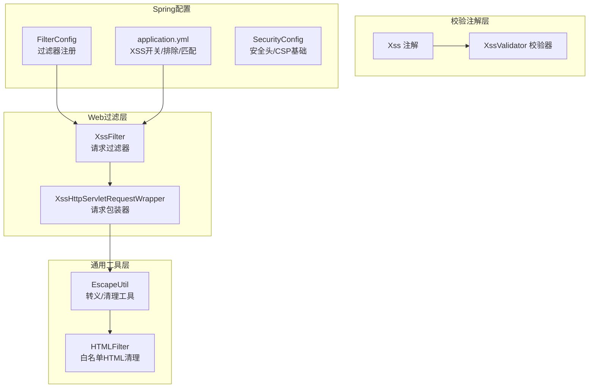
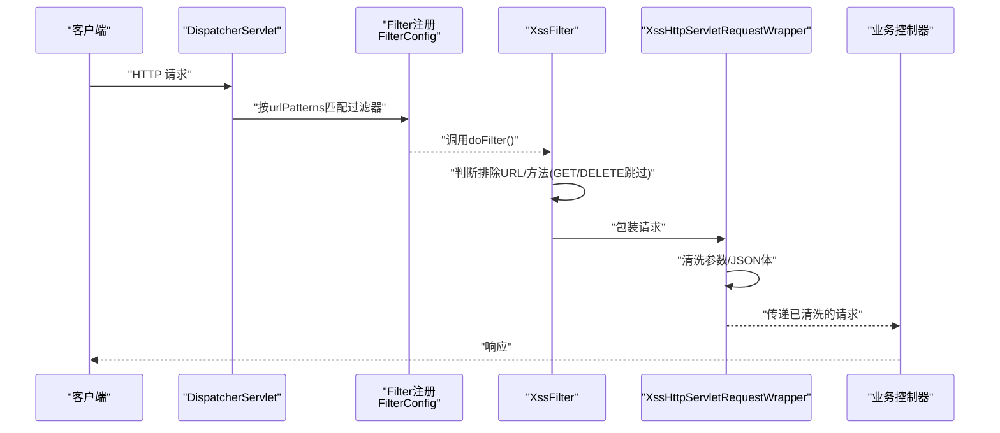
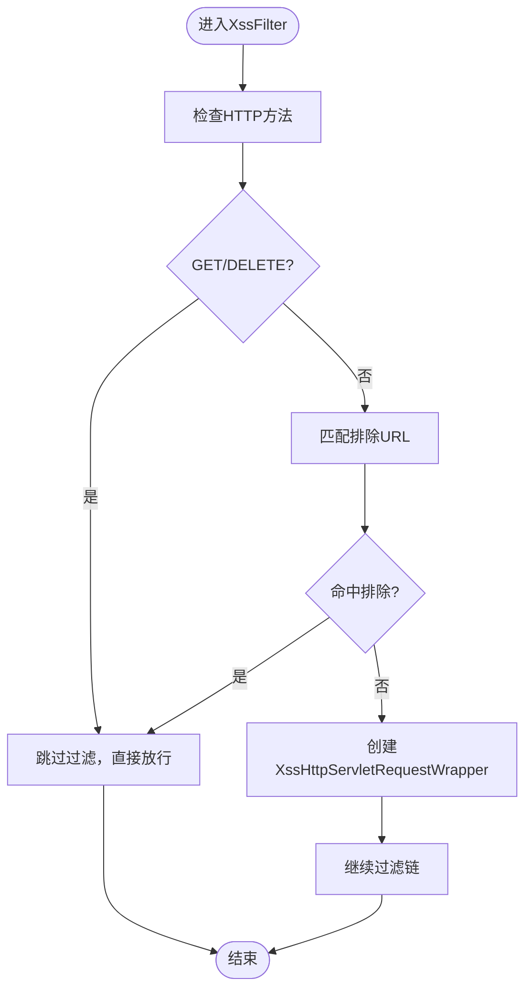
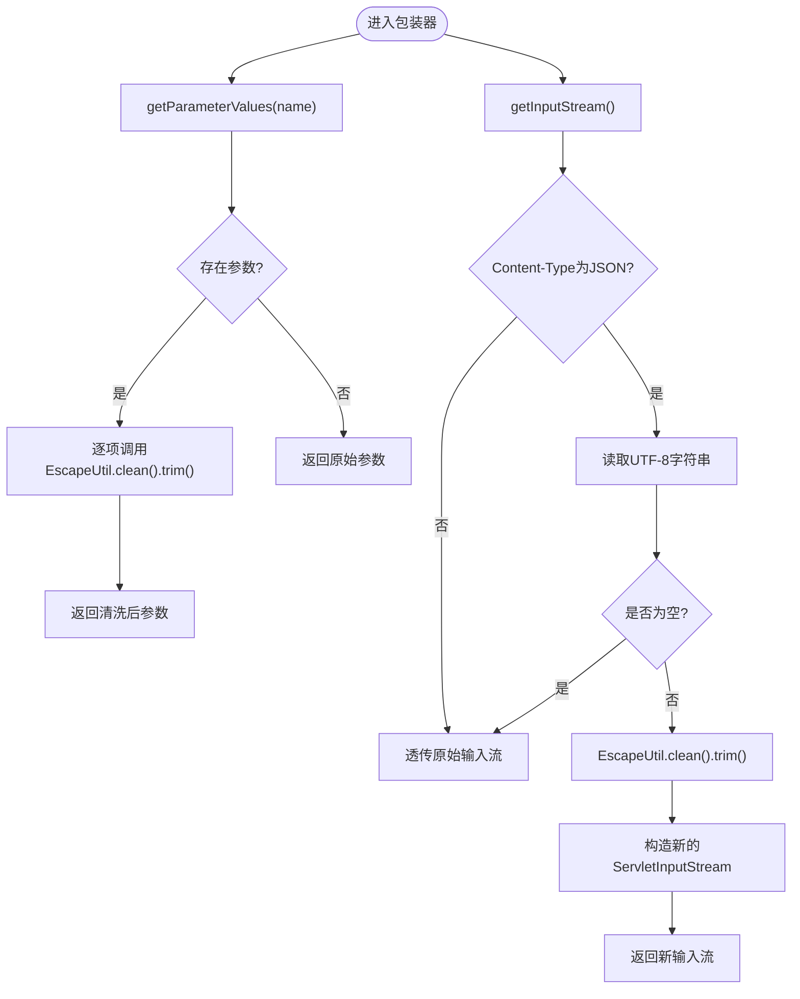
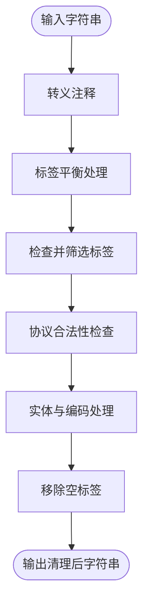
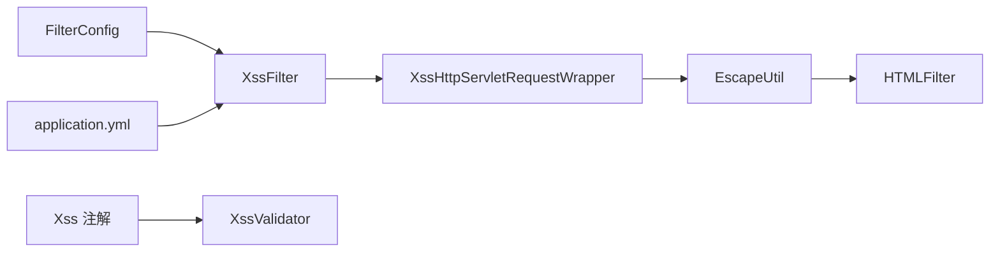

# XSS防护措施

<cite>
**本文引用的文件**
- [XssFilter.java](file://XingChen-Vue/xingchen-common/src/main/java/com/xingchen/common/filter/XssFilter.java)
- [XssHttpServletRequestWrapper.java](file://XingChen-Vue/xingchen-common/src/main/java/com/xingchen/common/filter/XssHttpServletRequestWrapper.java)
- [EscapeUtil.java](file://XingChen-Vue/xingchen-common/src/main/java/com/xingchen/common/utils/html/EscapeUtil.java)
- [HTMLFilter.java](file://XingChen-Vue/xingchen-common/src/main/java/com/xingchen/common/utils/html/HTMLFilter.java)
- [Xss.java](file://XingChen-Vue/xingchen-common/src/main/java/com/xingchen/common/xss/Xss.java)
- [XssValidator.java](file://XingChen-Vue/xingchen-common/src/main/java/com/xingchen/common/xss/XssValidator.java)
- [FilterConfig.java](file://XingChen-Vue/xingchen-framework/src/main/java/com/xingchen/framework/config/FilterConfig.java)
- [application.yml](file://XingChen-Vue/xingchen-admin/src/main/resources/application.yml)
- [SecurityConfig.java](file://XingChen-Vue/xingchen-framework/src/main/java/com/xingchen/framework/config/SecurityConfig.java)
</cite>

## 目录
1. [简介](#简介)
2. [项目结构](#项目结构)
3. [核心组件](#核心组件)
4. [架构总览](#架构总览)
5. [组件详解](#组件详解)
6. [依赖关系分析](#依赖关系分析)
7. [性能考量](#性能考量)
8. [故障排查指南](#故障排查指南)
9. [结论](#结论)
10. [附录](#附录)

## 简介
本文件面向健康管理系统后端的XSS（跨站脚本）防护，系统性阐述XssFilter过滤器、XssHttpServletRequestWrapper包装机制以及HTML标签清理算法的实现原理与使用方式；同时给出XSS攻击类型、防护策略选择、安全输入验证规则、富文本编辑器安全配置建议、XSS检测工具与安全测试方法、漏洞修复流程，以及跨域脚本攻击的预防、内容安全策略（CSP）与安全头设置要点。

## 项目结构
围绕XSS防护的关键代码位于以下模块与文件：
- 过滤器与包装器：XssFilter、XssHttpServletRequestWrapper
- HTML清理与转义：EscapeUtil、HTMLFilter
- 参数级XSS校验注解与校验器：Xss、XssValidator
- 过滤器注册与配置：FilterConfig、application.yml
- 安全头与CSP相关配置：SecurityConfig

图表来源
- [XssFilter.java:1-75](file://XingChen-Vue/xingchen-common/src/main/java/com/xingchen/common/filter/XssFilter.java#L1-L75)
- [XssHttpServletRequestWrapper.java:1-111](file://XingChen-Vue/xingchen-common/src/main/java/com/xingchen/common/filter/XssHttpServletRequestWrapper.java#L1-L111)
- [EscapeUtil.java:1-168](file://XingChen-Vue/xingchen-common/src/main/java/com/xingchen/common/utils/html/EscapeUtil.java#L1-L168)
- [HTMLFilter.java:1-570](file://XingChen-Vue/xingchen-common/src/main/java/com/xingchen/common/utils/html/HTMLFilter.java#L1-L570)
- [Xss.java:1-28](file://XingChen-Vue/xingchen-common/src/main/java/com/xingchen/common/xss/Xss.java#L1-L28)
- [XssValidator.java:1-39](file://XingChen-Vue/xingchen-common/src/main/java/com/xingchen/common/xss/XssValidator.java#L1-L39)
- [FilterConfig.java:1-68](file://XingChen-Vue/xingchen-framework/src/main/java/com/xingchen/framework/config/FilterConfig.java#L1-L68)
- [application.yml:140-148](file://XingChen-Vue/xingchen-admin/src/main/resources/application.yml#L140-L148)
- [SecurityConfig.java:86-95](file://XingChen-Vue/xingchen-framework/src/main/java/com/xingchen/framework/config/SecurityConfig.java#L86-L95)

章节来源
- [FilterConfig.java:35-49](file://XingChen-Vue/xingchen-framework/src/main/java/com/xingchen/framework/config/FilterConfig.java#L35-L49)
- [application.yml:140-148](file://XingChen-Vue/xingchen-admin/src/main/resources/application.yml#L140-L148)

## 核心组件
- XssFilter：基于Servlet Filter的全局XSS防护入口，负责排除特定URL与HTTP方法，并对请求进行包装以清洗参数与JSON体。
- XssHttpServletRequestWrapper：对请求参数与JSON输入流进行清洗，采用EscapeUtil.clean进行HTML标签清理与特殊字符转义。
- EscapeUtil：提供HTML转义、解码、以及调用HTMLFilter进行“白名单”清理的核心工具。
- HTMLFilter：基于白名单的HTML标签清理算法，支持协议限制、实体编码、注释处理、标签配对与自闭合等策略。
- Xss 注解与 XssValidator：参数级校验，通过正则识别潜在HTML标签，避免进入业务逻辑。
- FilterConfig 与 application.yml：注册XssFilter并配置排除URL、匹配URL模式与开关。

章节来源
- [XssFilter.java:22-75](file://XingChen-Vue/xingchen-common/src/main/java/com/xingchen/common/filter/XssFilter.java#L22-L75)
- [XssHttpServletRequestWrapper.java:20-111](file://XingChen-Vue/xingchen-common/src/main/java/com/xingchen/common/filter/XssHttpServletRequestWrapper.java#L20-L111)
- [EscapeUtil.java:10-62](file://XingChen-Vue/xingchen-common/src/main/java/com/xingchen/common/utils/html/EscapeUtil.java#L10-L62)
- [HTMLFilter.java:18-135](file://XingChen-Vue/xingchen-common/src/main/java/com/xingchen/common/utils/html/HTMLFilter.java#L18-L135)
- [Xss.java:15-27](file://XingChen-Vue/xingchen-common/src/main/java/com/xingchen/common/xss/Xss.java#L15-L27)
- [XssValidator.java:14-39](file://XingChen-Vue/xingchen-common/src/main/java/com/xingchen/common/xss/XssValidator.java#L14-L39)
- [FilterConfig.java:35-49](file://XingChen-Vue/xingchen-framework/src/main/java/com/xingchen/framework/config/FilterConfig.java#L35-L49)
- [application.yml:140-148](file://XingChen-Vue/xingchen-admin/src/main/resources/application.yml#L140-L148)

## 架构总览
XSS防护在请求生命周期中的位置如下：

图表来源
- [FilterConfig.java:35-49](file://XingChen-Vue/xingchen-framework/src/main/java/com/xingchen/framework/config/FilterConfig.java#L35-L49)
- [XssFilter.java:44-68](file://XingChen-Vue/xingchen-common/src/main/java/com/xingchen/common/filter/XssFilter.java#L44-L68)
- [XssHttpServletRequestWrapper.java:30-99](file://XingChen-Vue/xingchen-common/src/main/java/com/xingchen/common/filter/XssHttpServletRequestWrapper.java#L30-L99)

## 组件详解

### XssFilter 过滤器
- 初始化：读取配置参数excludes，解析为排除URL列表。
- 过滤逻辑：
  - 若请求方法为GET或DELETE，或命中排除URL，则直接放行。
  - 否则，创建XssHttpServletRequestWrapper对请求进行包装，再继续后续过滤链。
- 排除策略：通过application.yml的xss.excludes与xss.urlPatterns控制。

图表来源
- [XssFilter.java:44-68](file://XingChen-Vue/xingchen-common/src/main/java/com/xingchen/common/filter/XssFilter.java#L44-L68)
- [application.yml:140-148](file://XingChen-Vue/xingchen-admin/src/main/resources/application.yml#L140-L148)

章节来源
- [XssFilter.java:29-75](file://XingChen-Vue/xingchen-common/src/main/java/com/xingchen/common/filter/XssFilter.java#L29-L75)
- [FilterConfig.java:35-49](file://XingChen-Vue/xingchen-framework/src/main/java/com/xingchen/framework/config/FilterConfig.java#L35-L49)
- [application.yml:140-148](file://XingChen-Vue/xingchen-admin/src/main/resources/application.yml#L140-L148)

### XssHttpServletRequestWrapper 包装机制
- 参数清洗：对getParameterValues(name)返回的每个参数值，先进行HTML清理（EscapeUtil.clean），再trim去首尾空白。
- JSON输入流清洗：仅对Content-Type为application/json的请求进行处理；读取原始输入流为UTF-8字符串，执行清理与trim，再以新的ServletInputStream返回，确保后续读取到的是“干净”的JSON。
- 非JSON请求：直接透传，不做修改。

图表来源
- [XssHttpServletRequestWrapper.java:30-99](file://XingChen-Vue/xingchen-common/src/main/java/com/xingchen/common/filter/XssHttpServletRequestWrapper.java#L30-L99)
- [EscapeUtil.java:37-62](file://XingChen-Vue/xingchen-common/src/main/java/com/xingchen/common/utils/html/EscapeUtil.java#L37-L62)

章节来源
- [XssHttpServletRequestWrapper.java:20-111](file://XingChen-Vue/xingchen-common/src/main/java/com/xingchen/common/filter/XssHttpServletRequestWrapper.java#L20-L111)

### HTML标签清理算法（HTMLFilter）
- 白名单策略：仅允许预定义元素与属性，其余全部移除或转义。
- 关键步骤：
  - 注释清理与转义
  - 标签平衡：可选择“尽量补全标签”或“转义不平衡尖括号”
  - 标签检查：只保留白名单内元素，移除非法属性与协议
  - 协议限制：对href/src等属性进行协议白名单校验
  - 实体与编码：处理数字/十六进制/百分号编码，校验合法实体
  - 空标签清理：移除无内容的成对标签或自闭合标签
- 默认白名单示例：a/img/b/strong/i/em等，部分元素无属性，部分允许href/target/src等。

图表来源
- [HTMLFilter.java:198-214](file://XingChen-Vue/xingchen-common/src/main/java/com/xingchen/common/utils/html/HTMLFilter.java#L198-L214)
- [HTMLFilter.java:272-298](file://XingChen-Vue/xingchen-common/src/main/java/com/xingchen/common/utils/html/HTMLFilter.java#L272-L298)
- [HTMLFilter.java:437-456](file://XingChen-Vue/xingchen-common/src/main/java/com/xingchen/common/utils/html/HTMLFilter.java#L437-L456)
- [HTMLFilter.java:498-513](file://XingChen-Vue/xingchen-common/src/main/java/com/xingchen/common/utils/html/HTMLFilter.java#L498-L513)
- [HTMLFilter.java:300-318](file://XingChen-Vue/xingchen-common/src/main/java/com/xingchen/common/utils/html/HTMLFilter.java#L300-L318)

章节来源
- [HTMLFilter.java:18-135](file://XingChen-Vue/xingchen-common/src/main/java/com/xingchen/common/utils/html/HTMLFilter.java#L18-L135)

### EscapeUtil 工具
- 提供escape/unescape用于URL/字符编码与解码
- clean方法委托HTMLFilter完成“白名单”清理
- 作为包装器与校验器的共同依赖，统一清洗策略

章节来源
- [EscapeUtil.java:10-62](file://XingChen-Vue/xingchen-common/src/main/java/com/xingchen/common/utils/html/EscapeUtil.java#L10-L62)

### 参数级XSS校验（Xss 注解与 XssValidator）
- 注解：Xss，用于方法/字段/构造器/参数级别声明
- 校验器：XssValidator使用正则提取HTML标签片段，若存在则判定为非法
- 适用场景：对关键入参进行快速拦截，避免进入复杂业务逻辑

章节来源
- [Xss.java:15-27](file://XingChen-Vue/xingchen-common/src/main/java/com/xingchen/common/xss/Xss.java#L15-L27)
- [XssValidator.java:14-39](file://XingChen-Vue/xingchen-common/src/main/java/com/xingchen/common/xss/XssValidator.java#L14-L39)

## 依赖关系分析
- XssFilter依赖：
  - FilterConfig注册与application.yml配置
  - XssHttpServletRequestWrapper进行请求清洗
- XssHttpServletRequestWrapper依赖：
  - EscapeUtil.clean与HTMLFilter
- EscapeUtil依赖：
  - HTMLFilter（白名单清理）
- XssValidator依赖：
  - 正则匹配HTML标签（辅助参数校验）

图表来源
- [XssFilter.java:44-55](file://XingChen-Vue/xingchen-common/src/main/java/com/xingchen/common/filter/XssFilter.java#L44-L55)
- [XssHttpServletRequestWrapper.java:58-65](file://XingChen-Vue/xingchen-common/src/main/java/com/xingchen/common/filter/XssHttpServletRequestWrapper.java#L58-L65)
- [EscapeUtil.java:59-61](file://XingChen-Vue/xingchen-common/src/main/java/com/xingchen/common/utils/html/EscapeUtil.java#L59-L61)
- [FilterConfig.java:35-49](file://XingChen-Vue/xingchen-framework/src/main/java/com/xingchen/framework/config/FilterConfig.java#L35-L49)
- [application.yml:140-148](file://XingChen-Vue/xingchen-admin/src/main/resources/application.yml#L140-L148)

章节来源
- [XssFilter.java:22-75](file://XingChen-Vue/xingchen-common/src/main/java/com/xingchen/common/filter/XssFilter.java#L22-L75)
- [XssHttpServletRequestWrapper.java:20-111](file://XingChen-Vue/xingchen-common/src/main/java/com/xingchen/common/filter/XssHttpServletRequestWrapper.java#L20-L111)
- [EscapeUtil.java:10-62](file://XingChen-Vue/xingchen-common/src/main/java/com/xingchen/common/utils/html/EscapeUtil.java#L10-L62)
- [FilterConfig.java:35-49](file://XingChen-Vue/xingchen-framework/src/main/java/com/xingchen/framework/config/FilterConfig.java#L35-L49)
- [application.yml:140-148](file://XingChen-Vue/xingchen-admin/src/main/resources/application.yml#L140-L148)

## 性能考量
- 过滤器优先级：XssFilter以最高优先级注册，避免被其他过滤器篡改请求数据。
- 清洗范围：仅对POST/PUT/PATCH等非GET/DELETE方法与匹配URL进行清洗，减少对只读请求的影响。
- JSON清洗：仅在Content-Type为application/json时才读取与重建输入流，避免对静态资源/表单提交造成额外开销。
- 白名单算法：HTMLFilter通过有限状态与正则匹配实现，复杂度与输入长度线性相关；建议在高并发场景下结合缓存与限流策略。

章节来源
- [FilterConfig.java:35-49](file://XingChen-Vue/xingchen-framework/src/main/java/com/xingchen/framework/config/FilterConfig.java#L35-L49)
- [XssFilter.java:44-68](file://XingChen-Vue/xingchen-common/src/main/java/com/xingchen/common/filter/XssFilter.java#L44-L68)
- [XssHttpServletRequestWrapper.java:48-99](file://XingChen-Vue/xingchen-common/src/main/java/com/xingchen/common/filter/XssHttpServletRequestWrapper.java#L48-L99)

## 故障排查指南
- 症状：接口报错或参数异常
  - 检查application.yml中xss.enabled、xss.excludes、xss.urlPatterns配置是否正确
  - 确认请求方法是否被误判为GET/DELETE而跳过过滤
- 症状：JSON请求无法解析
  - 确认Content-Type为application/json且请求体非空
  - 检查包装器是否正确重建了ServletInputStream
- 症状：富文本显示异常
  - HTMLFilter默认白名单较为保守，如需保留更多标签，可通过HTMLFilter的可配置构造函数扩展
- 症状：参数仍包含HTML标签
  - 确认Xss 注解是否正确标注在参数上，XssValidator是否生效
- 症状：CSP或安全头导致页面功能受限
  - 检查SecurityConfig中的headers配置，必要时调整CSP策略

章节来源
- [application.yml:140-148](file://XingChen-Vue/xingchen-admin/src/main/resources/application.yml#L140-L148)
- [XssFilter.java:44-68](file://XingChen-Vue/xingchen-common/src/main/java/com/xingchen/common/filter/XssFilter.java#L44-L68)
- [XssHttpServletRequestWrapper.java:48-99](file://XingChen-Vue/xingchen-common/src/main/java/com/xingchen/common/filter/XssHttpServletRequestWrapper.java#L48-L99)
- [HTMLFilter.java:137-166](file://XingChen-Vue/xingchen-common/src/main/java/com/xingchen/common/utils/html/HTMLFilter.java#L137-L166)
- [Xss.java:15-27](file://XingChen-Vue/xingchen-common/src/main/java/com/xingchen/common/xss/Xss.java#L15-L27)
- [XssValidator.java:14-39](file://XingChen-Vue/xingchen-common/src/main/java/com/xingchen/common/xss/XssValidator.java#L14-L39)
- [SecurityConfig.java:86-95](file://XingChen-Vue/xingchen-framework/src/main/java/com/xingchen/framework/config/SecurityConfig.java#L86-L95)

## 结论
本系统通过“过滤器前置清洗 + 包装器参数/JSON清洗 + 白名单HTML清理 + 参数级注解校验”的多层防护，有效降低XSS风险。配合application.yml与FilterConfig的灵活配置，可在不同模块与URL范围内精确启用与排除XSS保护。对于富文本场景，建议在白名单基础上审慎开放标签与属性，并结合CSP与安全头进一步加固。

## 附录

### XSS攻击类型与防护策略选择
- 存储型XSS：最危险，需严格白名单清理与CSP
- 反射型XSS：通过URL参数触发，需参数清洗与URL编码
- DOM型XSS：前端DOM操作不当引起，需前端渲染与事件绑定安全
- 防护策略：
  - 白名单过滤：HTMLFilter
  - 黑名单匹配：XssValidator正则
  - 特殊字符转义：EscapeUtil
  - 内容安全策略（CSP）：在SecurityConfig中添加headers配置
  - 安全响应头：X-Content-Type-Options、X-Frame-Options、Referrer-Policy等

章节来源
- [HTMLFilter.java:18-135](file://XingChen-Vue/xingchen-common/src/main/java/com/xingchen/common/utils/html/HTMLFilter.java#L18-L135)
- [XssValidator.java:14-39](file://XingChen-Vue/xingchen-common/src/main/java/com/xingchen/common/xss/XssValidator.java#L14-L39)
- [EscapeUtil.java:10-62](file://XingChen-Vue/xingchen-common/src/main/java/com/xingchen/common/utils/html/EscapeUtil.java#L10-L62)
- [SecurityConfig.java:86-95](file://XingChen-Vue/xingchen-framework/src/main/java/com/xingchen/framework/config/SecurityConfig.java#L86-L95)

### 富文本编辑器的安全配置建议
- 仅允许白名单标签与属性（如img的src/alt/width/height，a的href/target）
- 对协议进行白名单限制（http/https/mailto）
- 使用EscapeUtil.clean进行二次清理
- 在SecurityConfig中增加CSP策略，限制脚本执行来源

章节来源
- [HTMLFilter.java:103-135](file://XingChen-Vue/xingchen-common/src/main/java/com/xingchen/common/utils/html/HTMLFilter.java#L103-L135)
- [EscapeUtil.java:59-61](file://XingChen-Vue/xingchen-common/src/main/java/com/xingchen/common/utils/html/EscapeUtil.java#L59-L61)
- [SecurityConfig.java:86-95](file://XingChen-Vue/xingchen-framework/src/main/java/com/xingchen/framework/config/SecurityConfig.java#L86-L95)

### XSS检测工具与安全测试方法
- 手工测试：构造常见payload（如、）
- 自动化扫描：使用OWASP ZAP/ Burp Suite
- 参数注入测试：对所有入参（URL、表单、JSON）进行边界值与特殊字符测试
- 回归测试：每次更新白名单或策略后进行回归验证

### 漏洞修复指南
- 立即回滚：若发现生产事故，优先回滚最近变更
- 临时禁用：通过application.yml临时关闭xss.enabled
- 修复策略：根据payload类型选择白名单扩展或正则增强
- 验证：修复后进行手工与自动化双重验证