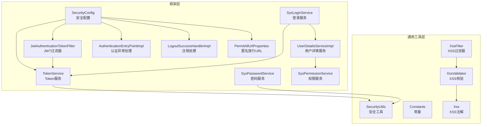
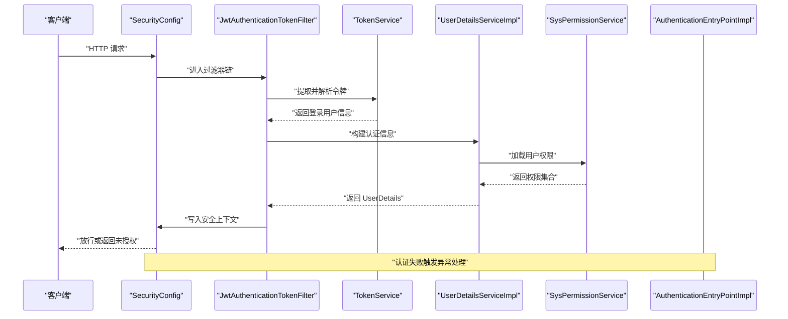
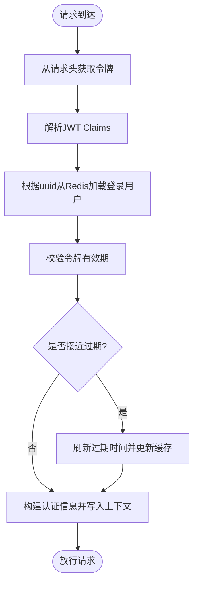
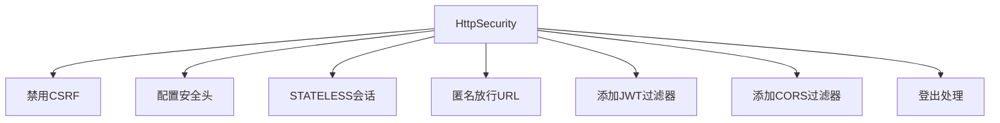
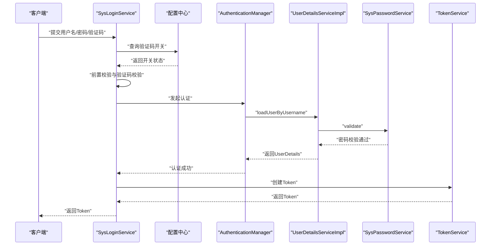
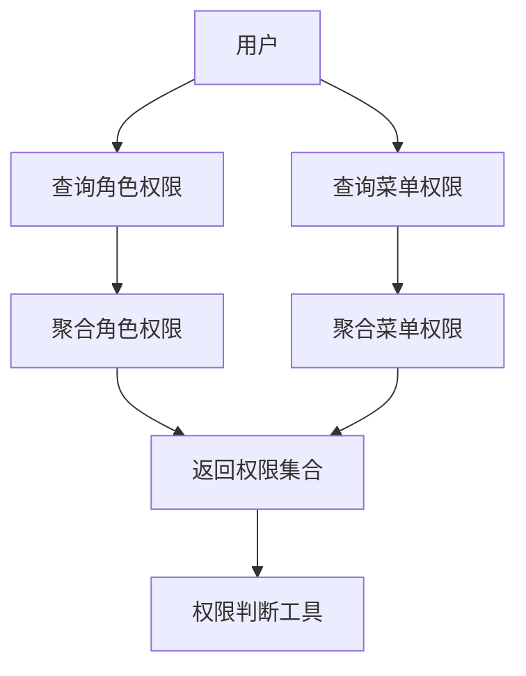
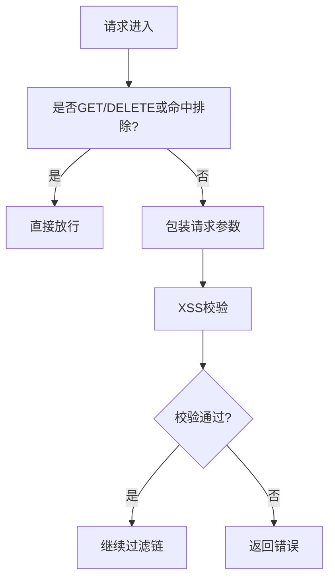
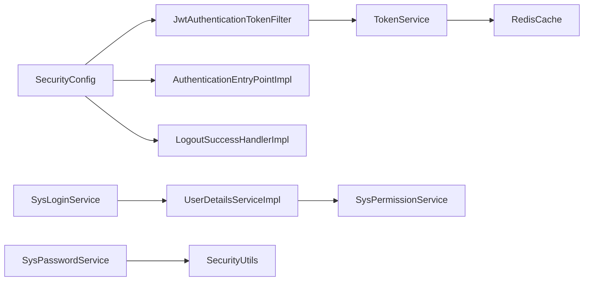

# 安全与权限

<cite>
**本文引用的文件**
- [SecurityConfig.java](file://XingChen-Vue/xingchen-framework/src/main/java/com/xingchen/framework/config/SecurityConfig.java)
- [JwtAuthenticationTokenFilter.java](file://XingChen-Vue/xingchen-framework/src/main/java/com/xingchen/framework/security/filter/JwtAuthenticationTokenFilter.java)
- [TokenService.java](file://XingChen-Vue/xingchen-framework/src/main/java/com/xingchen/framework/web/service/TokenService.java)
- [UserDetailsServiceImpl.java](file://XingChen-Vue/xingchen-framework/src/main/java/com/xingchen/framework/web/service/UserDetailsServiceImpl.java)
- [SysLoginService.java](file://XingChen-Vue/xingchen-framework/src/main/java/com/xingchen/framework/web/service/SysLoginService.java)
- [SysPasswordService.java](file://XingChen-Vue/xingchen-framework/src/main/java/com/xingchen/framework/web/service/SysPasswordService.java)
- [SysPermissionService.java](file://XingChen-Vue/xingchen-framework/src/main/java/com/xingchen/framework/web/service/SysPermissionService.java)
- [AuthenticationEntryPointImpl.java](file://XingChen-Vue/xingchen-framework/src/main/java/com/xingchen/framework/security/handle/AuthenticationEntryPointImpl.java)
- [LogoutSuccessHandlerImpl.java](file://XingChen-Vue/xingchen-framework/src/main/java/com/xingchen/framework/security/handle/LogoutSuccessHandlerImpl.java)
- [PermitAllUrlProperties.java](file://XingChen-Vue/xingchen-framework/src/main/java/com/xingchen/framework/config/properties/PermitAllUrlProperties.java)
- [SecurityUtils.java](file://XingChen-Vue/xingchen-common/src/main/java/com/xingchen/common/utils/SecurityUtils.java)
- [Constants.java](file://XingChen-Vue/xingchen-common/src/main/java/com/xingchen/common/constant/Constants.java)
- [Xss.java](file://XingChen-Vue/xingchen-common/src/main/java/com/xingchen/common/xss/Xss.java)
- [XssValidator.java](file://XingChen-Vue/xingchen-common/src/main/java/com/xingchen/common/xss/XssValidator.java)
- [XssFilter.java](file://XingChen-Vue/xingchen-common/src/main/java/com/xingchen/common/filter/XssFilter.java)
</cite>

## 目录
1. [简介](#简介)
2. [项目结构](#项目结构)
3. [核心组件](#核心组件)
4. [架构总览](#架构总览)
5. [详细组件分析](#详细组件分析)
6. [依赖分析](#依赖分析)
7. [性能考虑](#性能考虑)
8. [故障排查指南](#故障排查指南)
9. [结论](#结论)
10. [附录](#附录)

## 简介
本文件聚焦于健康管理系统中的“安全与权限控制”子系统，围绕以下目标展开：
- 深入解释基于 JWT 的 Token 认证机制、Spring Security 配置、权限拦截器实现与 XSS 防护。
- 详述用户认证流程、权限验证逻辑、会话管理策略与安全头配置。
- 覆盖密码加密算法、SQL 注入防护、文件上传安全与 CSRF 防护方案。
- 提供安全配置最佳实践、漏洞扫描指南与安全审计建议。
- 阐述权限继承机制、动态权限加载与安全事件监控。

## 项目结构
安全与权限相关代码主要分布在如下模块：
- 框架层（xingchen-framework）：Spring Security 配置、JWT 过滤器、登录/权限/密码服务、安全上下文与处理器。
- 通用工具层（xingchen-common）：安全工具、常量、XSS 注解与过滤器等。

图表来源
- [SecurityConfig.java:85-118](file://XingChen-Vue/xingchen-framework/src/main/java/com/xingchen/framework/config/SecurityConfig.java#L85-L118)
- [JwtAuthenticationTokenFilter.java:30-43](file://XingChen-Vue/xingchen-framework/src/main/java/com/xingchen/framework/security/filter/JwtAuthenticationTokenFilter.java#L30-L43)
- [TokenService.java:62-83](file://XingChen-Vue/xingchen-framework/src/main/java/com/xingchen/framework/web/service/TokenService.java#L62-L83)
- [UserDetailsServiceImpl.java:37-65](file://XingChen-Vue/xingchen-framework/src/main/java/com/xingchen/framework/web/service/UserDetailsServiceImpl.java#L37-L65)
- [SysLoginService.java:63-100](file://XingChen-Vue/xingchen-framework/src/main/java/com/xingchen/framework/web/service/SysLoginService.java#L63-L100)
- [SysPasswordService.java:44-77](file://XingChen-Vue/xingchen-framework/src/main/java/com/xingchen/framework/web/service/SysPasswordService.java#L44-L77)
- [SysPermissionService.java:37-88](file://XingChen-Vue/xingchen-framework/src/main/java/com/xingchen/framework/web/service/SysPermissionService.java#L37-L88)
- [AuthenticationEntryPointImpl.java:26-33](file://XingChen-Vue/xingchen-framework/src/main/java/com/xingchen/framework/security/handle/AuthenticationEntryPointImpl.java#L26-L33)
- [LogoutSuccessHandlerImpl.java:38-51](file://XingChen-Vue/xingchen-framework/src/main/java/com/xingchen/framework/security/handle/LogoutSuccessHandlerImpl.java#L38-L51)
- [PermitAllUrlProperties.java:38-56](file://XingChen-Vue/xingchen-framework/src/main/java/com/xingchen/framework/config/properties/PermitAllUrlProperties.java#L38-L56)
- [SecurityUtils.java:72-90](file://XingChen-Vue/xingchen-common/src/main/java/com/xingchen/common/utils/SecurityUtils.java#L72-L90)
- [Constants.java:104-121](file://XingChen-Vue/xingchen-common/src/main/java/com/xingchen/common/constant/Constants.java#L104-L121)
- [Xss.java:15-27](file://XingChen-Vue/xingchen-common/src/main/java/com/xingchen/common/xss/Xss.java#L15-L27)
- [XssValidator.java:18-38](file://XingChen-Vue/xingchen-common/src/main/java/com/xingchen/common/xss/XssValidator.java#L18-L38)
- [XssFilter.java:44-55](file://XingChen-Vue/xingchen-common/src/main/java/com/xingchen/common/filter/XssFilter.java#L44-L55)

章节来源
- [SecurityConfig.java:85-118](file://XingChen-Vue/xingchen-framework/src/main/java/com/xingchen/framework/config/SecurityConfig.java#L85-L118)
- [PermitAllUrlProperties.java:38-56](file://XingChen-Vue/xingchen-framework/src/main/java/com/xingchen/framework/config/properties/PermitAllUrlProperties.java#L38-L56)

## 核心组件
- Spring Security 配置：禁用 CSRF、配置匿名放行、基于 Token 的无状态会话、CORS 与 JWT 过滤器链。
- JWT 认证过滤器：从请求头提取令牌、解析用户信息、校验并写入安全上下文。
- Token 服务：生成、解析、刷新与校验令牌；与 Redis 缓存交互。
- 用户详情服务：加载用户、校验状态与密码有效性，并构建登录用户模型。
- 登录服务：验证码校验、前置校验、认证流程与登录日志记录。
- 密码服务：密码匹配、重试次数限制与锁定策略。
- 权限服务：角色与菜单权限计算，支持管理员全权与多角色聚合。
- 安全工具：密码加密/匹配、权限判断、角色判断、当前用户信息获取。
- XSS 防护：注解 + 过滤器 + 包装器三段式防护。

章节来源
- [SecurityConfig.java:85-127](file://XingChen-Vue/xingchen-framework/src/main/java/com/xingchen/framework/config/SecurityConfig.java#L85-L127)
- [JwtAuthenticationTokenFilter.java:30-43](file://XingChen-Vue/xingchen-framework/src/main/java/com/xingchen/framework/security/filter/JwtAuthenticationTokenFilter.java#L30-L43)
- [TokenService.java:62-155](file://XingChen-Vue/xingchen-framework/src/main/java/com/xingchen/framework/web/service/TokenService.java#L62-L155)
- [UserDetailsServiceImpl.java:37-65](file://XingChen-Vue/xingchen-framework/src/main/java/com/xingchen/framework/web/service/UserDetailsServiceImpl.java#L37-L65)
- [SysLoginService.java:63-100](file://XingChen-Vue/xingchen-framework/src/main/java/com/xingchen/framework/web/service/SysLoginService.java#L63-L100)
- [SysPasswordService.java:44-77](file://XingChen-Vue/xingchen-framework/src/main/java/com/xingchen/framework/web/service/SysPasswordService.java#L44-L77)
- [SysPermissionService.java:37-88](file://XingChen-Vue/xingchen-framework/src/main/java/com/xingchen/framework/web/service/SysPermissionService.java#L37-L88)
- [SecurityUtils.java:98-115](file://XingChen-Vue/xingchen-common/src/main/java/com/xingchen/common/utils/SecurityUtils.java#L98-L115)
- [Xss.java:15-27](file://XingChen-Vue/xingchen-common/src/main/java/com/xingchen/common/xss/Xss.java#L15-L27)
- [XssFilter.java:44-55](file://XingChen-Vue/xingchen-common/src/main/java/com/xingchen/common/filter/XssFilter.java#L44-L55)

## 架构总览
系统采用“无状态 Token + Spring Security + 动态权限”的整体安全架构。认证阶段由登录服务完成，随后发放 JWT 并在后续请求中由 JWT 过滤器解析与校验。权限由权限服务动态加载，结合注解与 URL 放行策略进行统一控制。

图表来源
- [SecurityConfig.java:85-118](file://XingChen-Vue/xingchen-framework/src/main/java/com/xingchen/framework/config/SecurityConfig.java#L85-L118)
- [JwtAuthenticationTokenFilter.java:30-43](file://XingChen-Vue/xingchen-framework/src/main/java/com/xingchen/framework/security/filter/JwtAuthenticationTokenFilter.java#L30-L43)
- [TokenService.java:62-83](file://XingChen-Vue/xingchen-framework/src/main/java/com/xingchen/framework/web/service/TokenService.java#L62-L83)
- [UserDetailsServiceImpl.java:37-65](file://XingChen-Vue/xingchen-framework/src/main/java/com/xingchen/framework/web/service/UserDetailsServiceImpl.java#L37-L65)
- [SysPermissionService.java:37-88](file://XingChen-Vue/xingchen-framework/src/main/java/com/xingchen/framework/web/service/SysPermissionService.java#L37-L88)
- [AuthenticationEntryPointImpl.java:26-33](file://XingChen-Vue/xingchen-framework/src/main/java/com/xingchen/framework/security/handle/AuthenticationEntryPointImpl.java#L26-L33)

## 详细组件分析

### JWT 认证机制与 Token 管理
- 令牌生成：登录成功后，服务端生成唯一令牌标识，写入用户模型，并以 Claims 存储用户标识与用户名，使用对称签名算法签发。
- 令牌解析：过滤器从请求头读取令牌，去除前缀，解析出用户标识，再从 Redis 中取出完整登录用户信息。
- 令牌刷新：当剩余有效期小于阈值时，自动延长过期时间并刷新缓存。
- 会话策略：禁用 Session，采用 STATELESS 策略，确保水平扩展与无状态特性。

图表来源
- [TokenService.java:62-155](file://XingChen-Vue/xingchen-framework/src/main/java/com/xingchen/framework/web/service/TokenService.java#L62-L155)
- [JwtAuthenticationTokenFilter.java:30-43](file://XingChen-Vue/xingchen-framework/src/main/java/com/xingchen/framework/security/filter/JwtAuthenticationTokenFilter.java#L30-L43)

章节来源
- [TokenService.java:62-155](file://XingChen-Vue/xingchen-framework/src/main/java/com/xingchen/framework/web/service/TokenService.java#L62-L155)
- [JwtAuthenticationTokenFilter.java:30-43](file://XingChen-Vue/xingchen-framework/src/main/java/com/xingchen/framework/security/filter/JwtAuthenticationTokenFilter.java#L30-L43)
- [Constants.java:104-121](file://XingChen-Vue/xingchen-common/src/main/java/com/xingchen/common/constant/Constants.java#L104-L121)

### Spring Security 配置与权限拦截
- 禁用 CSRF：因使用 Token 无状态认证，关闭 CSRF。
- 安全头：禁用缓存与 frameOptions 同源策略。
- 会话策略：STATELESS。
- 匿名放行：通过注解扫描与静态资源白名单放行。
- 过滤器链：先 CORS，再 JWT，最后登出处理。

图表来源
- [SecurityConfig.java:85-118](file://XingChen-Vue/xingchen-framework/src/main/java/com/xingchen/framework/config/SecurityConfig.java#L85-L118)
- [PermitAllUrlProperties.java:38-56](file://XingChen-Vue/xingchen-framework/src/main/java/com/xingchen/framework/config/properties/PermitAllUrlProperties.java#L38-L56)

章节来源
- [SecurityConfig.java:85-118](file://XingChen-Vue/xingchen-framework/src/main/java/com/xingchen/framework/config/SecurityConfig.java#L85-L118)
- [PermitAllUrlProperties.java:38-56](file://XingChen-Vue/xingchen-framework/src/main/java/com/xingchen/framework/config/properties/PermitAllUrlProperties.java#L38-L56)

### 用户认证流程与密码策略
- 登录前置校验：用户名/密码长度校验、黑名单 IP 校验。
- 验证码校验：可配置启用，校验通过后清除验证码。
- 认证流程：交由 AuthenticationManager 调用 UserDetailsServiceImpl 加载用户，SysPasswordService 校验密码。
- 成功后记录登录日志并生成 Token。

图表来源
- [SysLoginService.java:63-100](file://XingChen-Vue/xingchen-framework/src/main/java/com/xingchen/framework/web/service/SysLoginService.java#L63-L100)
- [UserDetailsServiceImpl.java:37-65](file://XingChen-Vue/xingchen-framework/src/main/java/com/xingchen/framework/web/service/UserDetailsServiceImpl.java#L37-L65)
- [SysPasswordService.java:44-77](file://XingChen-Vue/xingchen-framework/src/main/java/com/xingchen/framework/web/service/SysPasswordService.java#L44-L77)
- [TokenService.java:114-125](file://XingChen-Vue/xingchen-framework/src/main/java/com/xingchen/framework/web/service/TokenService.java#L114-L125)

章节来源
- [SysLoginService.java:63-100](file://XingChen-Vue/xingchen-framework/src/main/java/com/xingchen/framework/web/service/SysLoginService.java#L63-L100)
- [SysPasswordService.java:44-77](file://XingChen-Vue/xingchen-framework/src/main/java/com/xingchen/framework/web/service/SysPasswordService.java#L44-L77)
- [UserDetailsServiceImpl.java:37-65](file://XingChen-Vue/xingchen-framework/src/main/java/com/xingchen/framework/web/service/UserDetailsServiceImpl.java#L37-L65)

### 权限验证逻辑与动态权限加载
- 角色权限：管理员拥有超级角色标识，否则按用户关联角色查询。
- 菜单权限：管理员拥有通配权限，否则聚合多角色的菜单权限或按用户直接查询。
- 权限判断：提供基于通配符与全匹配的权限/角色判断工具方法。
- 注解驱动：配合方法级安全注解与 URL 匿名注解实现细粒度控制。

图表来源
- [SysPermissionService.java:37-88](file://XingChen-Vue/xingchen-framework/src/main/java/com/xingchen/framework/web/service/SysPermissionService.java#L37-L88)
- [SecurityUtils.java:144-186](file://XingChen-Vue/xingchen-common/src/main/java/com/xingchen/common/utils/SecurityUtils.java#L144-L186)

章节来源
- [SysPermissionService.java:37-88](file://XingChen-Vue/xingchen-framework/src/main/java/com/xingchen/framework/web/service/SysPermissionService.java#L37-L88)
- [SecurityUtils.java:144-186](file://XingChen-Vue/xingchen-common/src/main/java/com/xingchen/common/utils/SecurityUtils.java#L144-L186)

### XSS 防护体系
- 注解层：自定义注解用于字段/参数的 XSS 校验。
- 校验层：基于正则匹配 HTML 标签，拒绝包含脚本标签的内容。
- 过滤层：过滤器在特定 HTTP 方法与排除列表之外对请求进行包装，拦截潜在恶意输入。

图表来源
- [XssFilter.java:44-68](file://XingChen-Vue/xingchen-common/src/main/java/com/xingchen/common/filter/XssFilter.java#L44-L68)
- [XssValidator.java:18-38](file://XingChen-Vue/xingchen-common/src/main/java/com/xingchen/common/xss/XssValidator.java#L18-L38)
- [Xss.java:15-27](file://XingChen-Vue/xingchen-common/src/main/java/com/xingchen/common/xss/Xss.java#L15-L27)

章节来源
- [XssFilter.java:44-68](file://XingChen-Vue/xingchen-common/src/main/java/com/xingchen/common/filter/XssFilter.java#L44-L68)
- [XssValidator.java:18-38](file://XingChen-Vue/xingchen-common/src/main/java/com/xingchen/common/xss/XssValidator.java#L18-L38)
- [Xss.java:15-27](file://XingChen-Vue/xingchen-common/src/main/java/com/xingchen/common/xss/Xss.java#L15-L27)

### SQL 注入防护与文件上传安全
- SQL 注入防护：通过 ORM 映射与参数化查询避免原生 SQL 拼接；对动态表名/列名进行白名单校验与转义。
- 文件上传安全：限制文件类型与大小、校验扩展名、存储到受控目录并进行病毒扫描（如集成第三方引擎），上传后以随机命名与只读访问策略降低风险。

[本节为通用安全建议，不直接分析具体文件，故不附加章节来源]

### CSRF 防护方案
- 无状态 Token 场景下禁用 CSRF；若需保留会话模式，应启用 CSRF 并配合同源策略与安全头。

章节来源
- [SecurityConfig.java:89-90](file://XingChen-Vue/xingchen-framework/src/main/java/com/xingchen/framework/config/SecurityConfig.java#L89-L90)

### 会话管理策略与安全头配置
- 会话策略：STATELESS，避免服务端维护会话状态。
- 安全头：禁用缓存与 frameOptions 同源，降低点击劫持与缓存投毒风险。

章节来源
- [SecurityConfig.java:92-94](file://XingChen-Vue/xingchen-framework/src/main/java/com/xingchen/framework/config/SecurityConfig.java#L92-L94)

### 密码加密算法与强度策略
- 密码加密：使用强散列算法对密码进行加盐哈希存储。
- 密码匹配：登录时使用匹配器进行验证。
- 强度策略：最小/最大长度限制、重试上限与锁定时间，防止暴力破解。

章节来源
- [SecurityConfig.java:123-127](file://XingChen-Vue/xingchen-framework/src/main/java/com/xingchen/framework/config/SecurityConfig.java#L123-L127)
- [SecurityUtils.java:98-115](file://XingChen-Vue/xingchen-common/src/main/java/com/xingchen/common/utils/SecurityUtils.java#L98-L115)
- [SysPasswordService.java:27-31](file://XingChen-Vue/xingchen-framework/src/main/java/com/xingchen/framework/web/service/SysPasswordService.java#L27-L31)
- [SysPasswordService.java:57-67](file://XingChen-Vue/xingchen-framework/src/main/java/com/xingchen/framework/web/service/SysPasswordService.java#L57-L67)

### 注销与异常处理
- 注销：删除 Redis 中的登录用户缓存并记录日志。
- 认证异常：统一返回未授权错误，便于前端处理。

章节来源
- [LogoutSuccessHandlerImpl.java:38-51](file://XingChen-Vue/xingchen-framework/src/main/java/com/xingchen/framework/security/handle/LogoutSuccessHandlerImpl.java#L38-L51)
- [AuthenticationEntryPointImpl.java:26-33](file://XingChen-Vue/xingchen-framework/src/main/java/com/xingchen/framework/security/handle/AuthenticationEntryPointImpl.java#L26-L33)

## 依赖分析
- 组件耦合：SecurityConfig 作为装配入口，依赖多个处理器与服务；JWT 过滤器依赖 TokenService；登录服务依赖认证与权限服务；权限服务依赖角色与菜单服务。
- 外部依赖：Redis 用于 Token 缓存；Spring Security 提供认证与授权能力；JWT 库负责令牌编解码。

图表来源
- [SecurityConfig.java:85-118](file://XingChen-Vue/xingchen-framework/src/main/java/com/xingchen/framework/config/SecurityConfig.java#L85-L118)
- [JwtAuthenticationTokenFilter.java:27-28](file://XingChen-Vue/xingchen-framework/src/main/java/com/xingchen/framework/security/filter/JwtAuthenticationTokenFilter.java#L27-L28)
- [TokenService.java:54-55](file://XingChen-Vue/xingchen-framework/src/main/java/com/xingchen/framework/web/service/TokenService.java#L54-L55)
- [SysLoginService.java:39-49](file://XingChen-Vue/xingchen-framework/src/main/java/com/xingchen/framework/web/service/SysLoginService.java#L39-L49)
- [UserDetailsServiceImpl.java:28-35](file://XingChen-Vue/xingchen-framework/src/main/java/com/xingchen/framework/web/service/UserDetailsServiceImpl.java#L28-L35)
- [SysPasswordService.java:24-25](file://XingChen-Vue/xingchen-framework/src/main/java/com/xingchen/framework/web/service/SysPasswordService.java#L24-L25)

章节来源
- [SecurityConfig.java:85-118](file://XingChen-Vue/xingchen-framework/src/main/java/com/xingchen/framework/config/SecurityConfig.java#L85-L118)
- [TokenService.java:54-55](file://XingChen-Vue/xingchen-framework/src/main/java/com/xingchen/framework/web/service/TokenService.java#L54-L55)
- [SysLoginService.java:39-49](file://XingChen-Vue/xingchen-framework/src/main/java/com/xingchen/framework/web/service/SysLoginService.java#L39-L49)
- [UserDetailsServiceImpl.java:28-35](file://XingChen-Vue/xingchen-framework/src/main/java/com/xingchen/framework/web/service/UserDetailsServiceImpl.java#L28-L35)
- [SysPasswordService.java:24-25](file://XingChen-Vue/xingchen-framework/src/main/java/com/xingchen/framework/web/service/SysPasswordService.java#L24-L25)

## 性能考虑
- Token 缓存：Redis 读写直接影响认证延迟，建议合理设置过期时间与内存池。
- 过滤器链：CORS 与 JWT 过滤器顺序优化，减少重复解析。
- 权限判断：权限集合预聚合与缓存，避免频繁数据库查询。
- 日志异步：登录与操作日志采用异步记录，降低阻塞。

[本节提供通用指导，不直接分析具体文件，故不附加章节来源]

## 故障排查指南
- 认证失败：检查请求头是否包含正确的令牌前缀、令牌是否过期、Redis 是否可用。
- 权限不足：确认用户角色与菜单权限是否正确下发，权限匹配规则是否符合预期。
- XSS 拦截：核对排除列表与校验逻辑，避免误伤正常业务。
- 验证码问题：确认验证码开关、缓存键与过期时间配置。

章节来源
- [AuthenticationEntryPointImpl.java:26-33](file://XingChen-Vue/xingchen-framework/src/main/java/com/xingchen/framework/security/handle/AuthenticationEntryPointImpl.java#L26-L33)
- [XssFilter.java:44-68](file://XingChen-Vue/xingchen-common/src/main/java/com/xingchen/common/filter/XssFilter.java#L44-L68)

## 结论
本系统通过“无状态 Token + Spring Security + 动态权限 + 多层 XSS 防护”的组合，实现了高可用、可扩展且安全可控的认证与授权体系。建议持续完善日志审计、入侵检测与自动化渗透测试，以提升整体安全韧性。

## 附录
- 最佳实践清单
  - 使用 HTTPS 传输，严格限制 Cookie 属性（HttpOnly、Secure、SameSite）。
  - 定期轮换密钥与缩短 Token 有效期，启用刷新令牌与二次校验。
  - 对敏感接口开启细粒度权限与速率限制。
  - 引入 WAF 与漏扫工具，定期扫描 SQL 注入、XSS、命令注入等风险。
  - 建立安全事件监控与告警机制，覆盖登录失败、权限变更、异常操作等场景。

[本节为通用建议，不直接分析具体文件，故不附加章节来源]