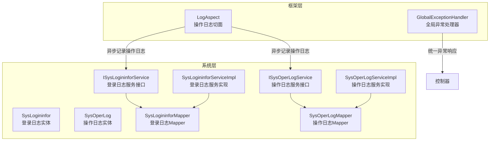
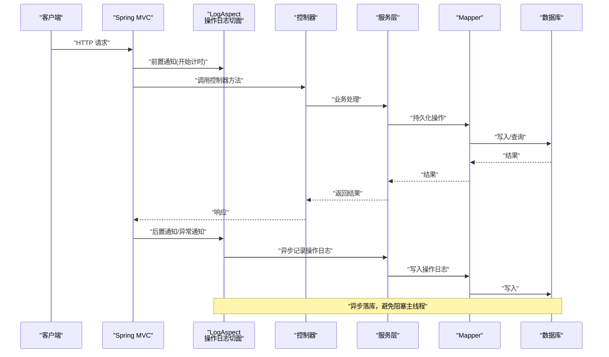
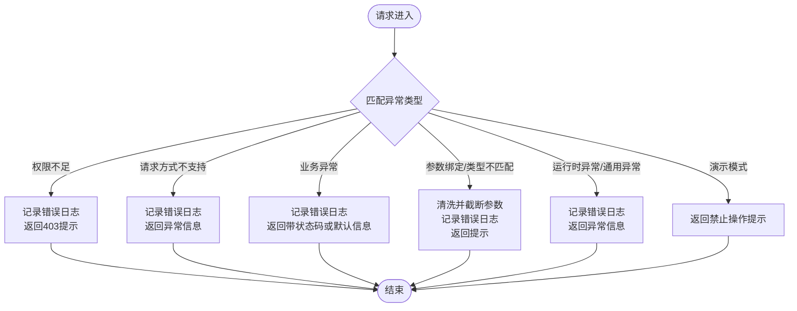
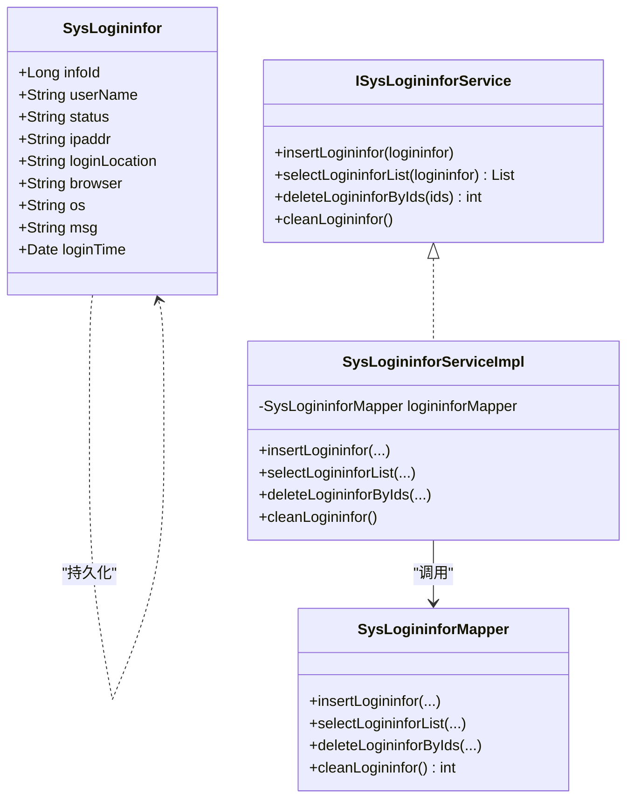
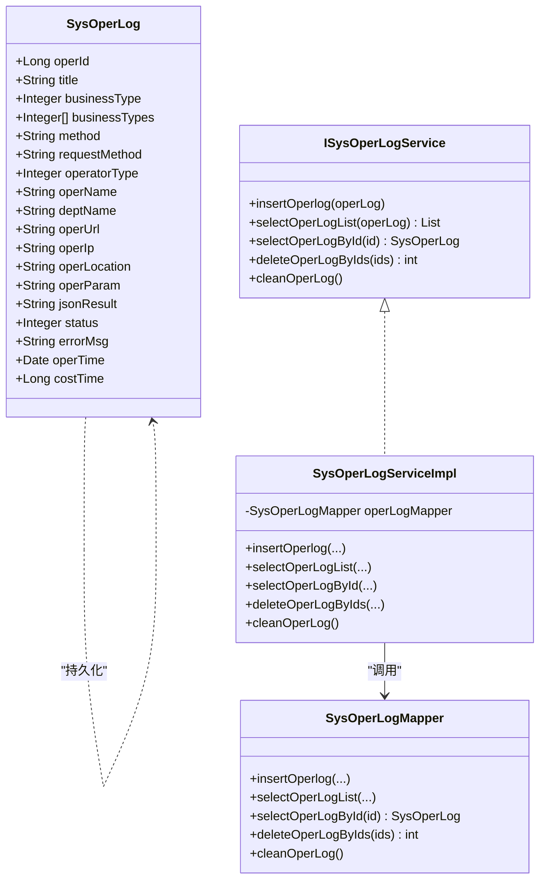
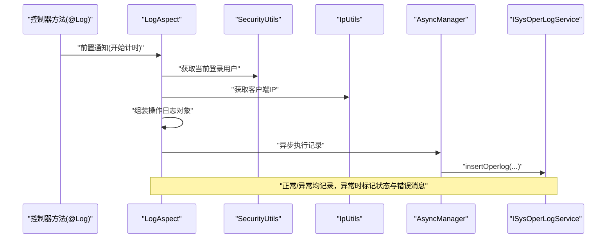
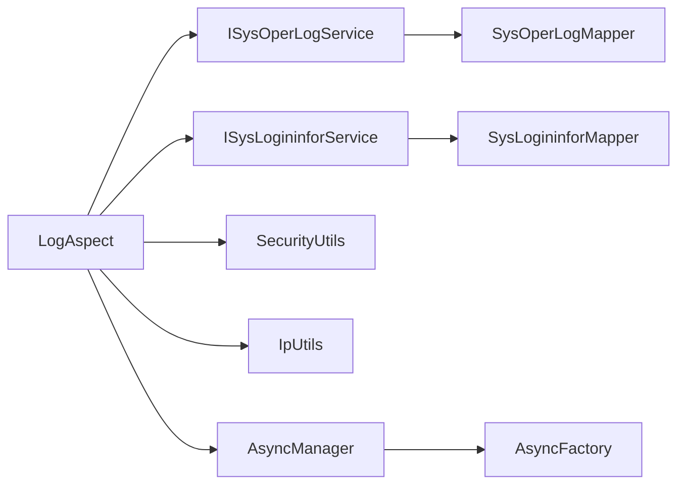

# 安全审计与监控

<cite>
**本文引用的文件**
- [GlobalExceptionHandler.java](file://XingChen-Vue/xingchen-framework/src/main/java/com/xingchen/framework/web/exception/GlobalExceptionHandler.java)
- [LogAspect.java](file://XingChen-Vue/xingchen-framework/src/main/java/com/xingchen/framework/aspectj/LogAspect.java)
- [SysLogininfor.java](file://XingChen-Vue/xingchen-system/src/main/java/com/xingchen/system/domain/SysLogininfor.java)
- [SysOperLog.java](file://XingChen-Vue/xingchen-system/src/main/java/com/xingchen/system/domain/SysOperLog.java)
- [ISysLogininforService.java](file://XingChen-Vue/xingchen-system/src/main/java/com/xingchen/system/service/ISysLogininforService.java)
- [ISysOperLogService.java](file://XingChen-Vue/xingchen-system/src/main/java/com/xingchen/system/service/ISysOperLogService.java)
- [SysLogininforServiceImpl.java](file://XingChen-Vue/xingchen-system/src/main/java/com/xingchen/system/service/impl/SysLogininforServiceImpl.java)
- [SysOperLogServiceImpl.java](file://XingChen-Vue/xingchen-system/src/main/java/com/xingchen/system/service/impl/SysOperLogServiceImpl.java)
- [SysLogininforMapper.java](file://XingChen-Vue/xingchen-system/src/main/java/com/xingchen/system/mapper/SysLogininforMapper.java)
- [SysOperLogMapper.java](file://XingChen-Vue/xingchen-system/src/main/java/com/xingchen/system/mapper/SysOperLogMapper.java)
</cite>

## 目录
1. [引言](#引言)
2. [项目结构](#项目结构)
3. [核心组件](#核心组件)
4. [架构总览](#架构总览)
5. [详细组件分析](#详细组件分析)
6. [依赖分析](#依赖分析)
7. [性能考虑](#性能考虑)
8. [故障排查指南](#故障排查指南)
9. [结论](#结论)
10. [附录](#附录)

## 引言
本文件面向“健康管理系统”的安全审计与监控子系统，聚焦以下目标：
- 全局异常处理器的实现与异常捕获策略
- 登录日志服务与操作日志服务的采集、落库与查询能力
- 安全事件的捕获、记录与分析流程（登录失败监控、异常访问检测、敏感操作追踪）
- 审计日志的数据结构、存储策略、查询接口与报表生成建议
- 安全监控指标、告警机制配置与日志分析工具使用方法
- 合规性要求、审计报告生成与安全态势感知的实现方案

## 项目结构
围绕安全审计与监控的关键模块分布于框架与系统模块中：
- 框架层：全局异常处理、操作日志切面
- 系统层：登录日志与操作日志的领域模型、服务接口与实现、数据访问接口

图示来源
- [GlobalExceptionHandler.java:1-146](file://XingChen-Vue/xingchen-framework/src/main/java/com/xingchen/framework/web/exception/GlobalExceptionHandler.java#L1-L146)
- [LogAspect.java:1-265](file://XingChen-Vue/xingchen-framework/src/main/java/com/xingchen/framework/aspectj/LogAspect.java#L1-L265)
- [SysLogininfor.java:1-145](file://XingChen-Vue/xingchen-system/src/main/java/com/xingchen/system/domain/SysLogininfor.java#L1-L145)
- [SysOperLog.java:1-270](file://XingChen-Vue/xingchen-system/src/main/java/com/xingchen/system/domain/SysOperLog.java#L1-L270)
- [ISysLogininforService.java:1-41](file://XingChen-Vue/xingchen-system/src/main/java/com/xingchen/system/service/ISysLogininforService.java#L1-L41)
- [ISysOperLogService.java:1-49](file://XingChen-Vue/xingchen-system/src/main/java/com/xingchen/system/service/ISysOperLogService.java#L1-L49)
- [SysLogininforServiceImpl.java:1-66](file://XingChen-Vue/xingchen-system/src/main/java/com/xingchen/system/service/impl/SysLogininforServiceImpl.java#L1-L66)
- [SysOperLogServiceImpl.java:1-77](file://XingChen-Vue/xingchen-system/src/main/java/com/xingchen/system/service/impl/SysOperLogServiceImpl.java#L1-L77)
- [SysLogininforMapper.java:1-43](file://XingChen-Vue/xingchen-system/src/main/java/com/xingchen/system/mapper/SysLogininforMapper.java#L1-L43)
- [SysOperLogMapper.java:1-49](file://XingChen-Vue/xingchen-system/src/main/java/com/xingchen/system/mapper/SysOperLogMapper.java#L1-L49)

章节来源
- [GlobalExceptionHandler.java:1-146](file://XingChen-Vue/xingchen-framework/src/main/java/com/xingchen/framework/web/exception/GlobalExceptionHandler.java#L1-L146)
- [LogAspect.java:1-265](file://XingChen-Vue/xingchen-framework/src/main/java/com/xingchen/framework/aspectj/LogAspect.java#L1-L265)
- [SysLogininfor.java:1-145](file://XingChen-Vue/xingchen-system/src/main/java/com/xingchen/system/domain/SysLogininfor.java#L1-L145)
- [SysOperLog.java:1-270](file://XingChen-Vue/xingchen-system/src/main/java/com/xingchen/system/domain/SysOperLog.java#L1-L270)
- [ISysLogininforService.java:1-41](file://XingChen-Vue/xingchen-system/src/main/java/com/xingchen/system/service/ISysLogininforService.java#L1-L41)
- [ISysOperLogService.java:1-49](file://XingChen-Vue/xingchen-system/src/main/java/com/xingchen/system/service/ISysOperLogService.java#L1-L49)
- [SysLogininforServiceImpl.java:1-66](file://XingChen-Vue/xingchen-system/src/main/java/com/xingchen/system/service/impl/SysLogininforServiceImpl.java#L1-L66)
- [SysOperLogServiceImpl.java:1-77](file://XingChen-Vue/xingchen-system/src/main/java/com/xingchen/system/service/impl/SysOperLogServiceImpl.java#L1-L77)
- [SysLogininforMapper.java:1-43](file://XingChen-Vue/xingchen-system/src/main/java/com/xingchen/system/mapper/SysLogininforMapper.java#L1-L43)
- [SysOperLogMapper.java:1-49](file://XingChen-Vue/xingchen-system/src/main/java/com/xingchen/system/mapper/SysOperLogMapper.java#L1-L49)

## 核心组件
- 全局异常处理器：统一拦截各类异常，输出标准化响应，并记录错误日志，保障异常事件可追溯。
- 操作日志切面：基于注解织入，自动采集请求上下文、参数、结果、异常与耗时，异步写入操作日志库。
- 登录日志实体与服务：记录登录用户的账号、IP、地点、浏览器、OS、消息与时效等，支持列表查询与清理。
- 操作日志实体与服务：记录模块、业务类型、方法、请求方式、操作人、部门、URL、参数、结果、状态、错误与耗时等，支持列表查询、详情查询与清理。

章节来源
- [GlobalExceptionHandler.java:22-146](file://XingChen-Vue/xingchen-framework/src/main/java/com/xingchen/framework/web/exception/GlobalExceptionHandler.java#L22-L146)
- [LogAspect.java:36-265](file://XingChen-Vue/xingchen-framework/src/main/java/com/xingchen/framework/aspectj/LogAspect.java#L36-L265)
- [SysLogininfor.java:9-145](file://XingChen-Vue/xingchen-system/src/main/java/com/xingchen/system/domain/SysLogininfor.java#L9-L145)
- [SysOperLog.java:9-270](file://XingChen-Vue/xingchen-system/src/main/java/com/xingchen/system/domain/SysOperLog.java#L9-L270)
- [ISysLogininforService.java:6-41](file://XingChen-Vue/xingchen-system/src/main/java/com/xingchen/system/service/ISysLogininforService.java#L6-L41)
- [ISysOperLogService.java:6-49](file://XingChen-Vue/xingchen-system/src/main/java/com/xingchen/system/service/ISysOperLogService.java#L6-L49)

## 架构总览
下图展示从请求进入至日志落库的整体流程，以及异常与日志的协同机制：

图示来源
- [LogAspect.java:59-140](file://XingChen-Vue/xingchen-framework/src/main/java/com/xingchen/framework/aspectj/LogAspect.java#L59-L140)
- [SysOperLogServiceImpl.java:26-30](file://XingChen-Vue/xingchen-system/src/main/java/com/xingchen/system/service/impl/SysOperLogServiceImpl.java#L26-L30)
- [SysOperLogMapper.java:17-18](file://XingChen-Vue/xingchen-system/src/main/java/com/xingchen/system/mapper/SysOperLogMapper.java#L17-L18)

## 详细组件分析

### 全局异常处理器
- 职责：统一拦截权限不足、请求方式不支持、业务异常、参数绑定与类型不匹配、运行时异常、通用异常、自定义验证异常及演示模式异常等，输出标准化错误响应并记录日志。
- 关键点：
  - 使用@RestControllerAdvice在全局生效
  - 对不同异常类型进行分类处理与日志记录
  - 对参数类型不匹配进行安全清洗与截断，防止日志污染
  - 返回AjaxResult格式，便于前端统一处理

图示来源
- [GlobalExceptionHandler.java:35-144](file://XingChen-Vue/xingchen-framework/src/main/java/com/xingchen/framework/web/exception/GlobalExceptionHandler.java#L35-L144)

章节来源
- [GlobalExceptionHandler.java:22-146](file://XingChen-Vue/xingchen-framework/src/main/java/com/xingchen/framework/web/exception/GlobalExceptionHandler.java#L22-L146)

### 登录日志服务
- 实体字段：包含登录ID、用户名、状态（成功/失败）、IP、登录地点、浏览器、操作系统、消息、时间等，便于快速定位登录事件。
- 服务接口：提供新增、列表查询、批量删除、清空等能力。
- 实现与映射：服务实现通过Mapper完成持久化；Mapper接口定义了标准的CRUD与清理方法。

图示来源
- [SysLogininfor.java:14-145](file://XingChen-Vue/xingchen-system/src/main/java/com/xingchen/system/domain/SysLogininfor.java#L14-L145)
- [ISysLogininforService.java:11-41](file://XingChen-Vue/xingchen-system/src/main/java/com/xingchen/system/service/ISysLogininforService.java#L11-L41)
- [SysLogininforServiceImpl.java:15-66](file://XingChen-Vue/xingchen-system/src/main/java/com/xingchen/system/service/impl/SysLogininforServiceImpl.java#L15-L66)
- [SysLogininforMapper.java:11-43](file://XingChen-Vue/xingchen-system/src/main/java/com/xingchen/system/mapper/SysLogininforMapper.java#L11-L43)

章节来源
- [SysLogininfor.java:9-145](file://XingChen-Vue/xingchen-system/src/main/java/com/xingchen/system/domain/SysLogininfor.java#L9-L145)
- [ISysLogininforService.java:6-41](file://XingChen-Vue/xingchen-system/src/main/java/com/xingchen/system/service/ISysLogininforService.java#L6-L41)
- [SysLogininforServiceImpl.java:15-66](file://XingChen-Vue/xingchen-system/src/main/java/com/xingchen/system/service/impl/SysLogininforServiceImpl.java#L15-L66)
- [SysLogininforMapper.java:11-43](file://XingChen-Vue/xingchen-system/src/main/java/com/xingchen/system/mapper/SysLogininforMapper.java#L11-L43)

### 操作日志服务
- 实体字段：涵盖模块、业务类型、方法、请求方式、操作人与部门、URL、IP与地点、请求/返回参数、状态（正常/异常）、错误消息、时间与耗时等，满足审计与取证需求。
- 服务接口：提供新增、列表查询、按ID查询、批量删除、清空等能力。
- 实现与映射：服务实现通过Mapper完成持久化；Mapper接口定义了标准的CRUD与清理方法。

图示来源
- [SysOperLog.java:14-270](file://XingChen-Vue/xingchen-system/src/main/java/com/xingchen/system/domain/SysOperLog.java#L14-L270)
- [ISysOperLogService.java:11-49](file://XingChen-Vue/xingchen-system/src/main/java/com/xingchen/system/service/ISysOperLogService.java#L11-L49)
- [SysOperLogServiceImpl.java:15-77](file://XingChen-Vue/xingchen-system/src/main/java/com/xingchen/system/service/impl/SysOperLogServiceImpl.java#L15-L77)
- [SysOperLogMapper.java:11-49](file://XingChen-Vue/xingchen-system/src/main/java/com/xingchen/system/mapper/SysOperLogMapper.java#L11-L49)

章节来源
- [SysOperLog.java:9-270](file://XingChen-Vue/xingchen-system/src/main/java/com/xingchen/system/domain/SysOperLog.java#L9-L270)
- [ISysOperLogService.java:6-49](file://XingChen-Vue/xingchen-system/src/main/java/com/xingchen/system/service/ISysOperLogService.java#L6-L49)
- [SysOperLogServiceImpl.java:15-77](file://XingChen-Vue/xingchen-system/src/main/java/com/xingchen/system/service/impl/SysOperLogServiceImpl.java#L15-L77)
- [SysOperLogMapper.java:11-49](file://XingChen-Vue/xingchen-system/src/main/java/com/xingchen/system/mapper/SysOperLogMapper.java#L11-L49)

### 操作日志切面（审计采集）
- 注解驱动：通过@Log标注在控制器方法上，自动采集请求上下文、参数、返回结果、异常与耗时。
- 敏感信息保护：排除密码等敏感字段，支持自定义排除项；对参数进行长度限制与序列化。
- 异步落库：使用异步线程池记录日志，避免阻塞主线程。
- 异常捕获：AfterThrowing拦截异常，标记状态为异常并记录错误消息。

图示来源
- [LogAspect.java:59-140](file://XingChen-Vue/xingchen-framework/src/main/java/com/xingchen/framework/aspectj/LogAspect.java#L59-L140)
- [LogAspect.java:149-168](file://XingChen-Vue/xingchen-framework/src/main/java/com/xingchen/framework/aspectj/LogAspect.java#L149-L168)
- [LogAspect.java:176-220](file://XingChen-Vue/xingchen-framework/src/main/java/com/xingchen/framework/aspectj/LogAspect.java#L176-L220)
- [LogAspect.java:225-228](file://XingChen-Vue/xingchen-framework/src/main/java/com/xingchen/framework/aspectj/LogAspect.java#L225-L228)
- [LogAspect.java:237-263](file://XingChen-Vue/xingchen-framework/src/main/java/com/xingchen/framework/aspectj/LogAspect.java#L237-L263)

章节来源
- [LogAspect.java:36-265](file://XingChen-Vue/xingchen-framework/src/main/java/com/xingchen/framework/aspectj/LogAspect.java#L36-L265)

## 依赖分析
- 组件耦合：
  - LogAspect与ISysOperLogService、ISysLogininforService存在直接协作关系，前者负责采集与异步提交，后者负责持久化。
  - 服务实现与Mapper之间为单向依赖，遵循分层清晰、职责分离的设计。
- 外部依赖：
  - 异步管理器AsyncManager与工厂AsyncFactory用于异步记录日志，降低同步IO对响应的影响。
  - 安全工具类SecurityUtils用于获取当前登录用户信息，IP工具类IpUtils用于解析客户端IP。
- 循环依赖：
  - 当前结构未发现循环依赖，各层边界清晰。

图示来源
- [LogAspect.java:32-34](file://XingChen-Vue/xingchen-framework/src/main/java/com/xingchen/framework/aspectj/LogAspect.java#L32-L34)
- [SysOperLogServiceImpl.java:18-19](file://XingChen-Vue/xingchen-system/src/main/java/com/xingchen/system/service/impl/SysOperLogServiceImpl.java#L18-L19)
- [SysLogininforServiceImpl.java:19-20](file://XingChen-Vue/xingchen-system/src/main/java/com/xingchen/system/service/impl/SysLogininforServiceImpl.java#L19-L20)

章节来源
- [LogAspect.java:32-34](file://XingChen-Vue/xingchen-framework/src/main/java/com/xingchen/framework/aspectj/LogAspect.java#L32-L34)
- [SysOperLogServiceImpl.java:18-19](file://XingChen-Vue/xingchen-system/src/main/java/com/xingchen/system/service/impl/SysOperLogServiceImpl.java#L18-L19)
- [SysLogininforServiceImpl.java:19-20](file://XingChen-Vue/xingchen-system/src/main/java/com/xingchen/system/service/impl/SysLogininforServiceImpl.java#L19-L20)

## 性能考虑
- 异步记录：操作日志通过异步线程池提交，避免阻塞请求线程，提升吞吐。
- 参数截断与过滤：对请求参数与异常消息进行长度限制与敏感字段过滤，减少日志体积与泄露风险。
- 耗时统计：以ThreadLocal记录开始时间，计算请求耗时，便于性能分析与异常定位。
- 存储策略建议：
  - 分表分库：按时间维度（如月）进行分表，控制单表规模
  - 归档清理：定期归档历史日志，保留必要周期内的审计数据
  - 索引优化：为常用查询字段建立索引（如用户、时间、状态、模块）

## 故障排查指南
- 登录失败监控
  - 现象：登录日志状态为失败且消息包含失败原因
  - 排查：检查登录接口异常处理器与登录服务逻辑，核对IP与地点解析、浏览器与OS识别
  - 参考：登录日志实体字段与服务接口
- 异常访问检测
  - 现象：操作日志状态为异常且包含错误消息
  - 排查：查看LogAspect对异常的AfterThrowing处理逻辑，确认异常被正确捕获与记录
  - 参考：全局异常处理器与操作日志切面
- 敏感操作追踪
  - 现象：特定业务类型（新增/修改/删除/授权/导出/导入等）的日志完整
  - 排查：确认控制器方法已添加@Log注解并正确设置businessType与operatorType
  - 参考：操作日志实体字段与切面参数装配逻辑

章节来源
- [SysLogininfor.java:26-48](file://XingChen-Vue/xingchen-system/src/main/java/com/xingchen/system/domain/SysLogininfor.java#L26-L48)
- [SysOperLog.java:26-79](file://XingChen-Vue/xingchen-system/src/main/java/com/xingchen/system/domain/SysOperLog.java#L26-L79)
- [LogAspect.java:82-86](file://XingChen-Vue/xingchen-framework/src/main/java/com/xingchen/framework/aspectj/LogAspect.java#L82-L86)
- [GlobalExceptionHandler.java:58-64](file://XingChen-Vue/xingchen-framework/src/main/java/com/xingchen/framework/web/exception/GlobalExceptionHandler.java#L58-L64)

## 结论
本系统通过全局异常处理器与操作日志切面实现了对安全事件的全面捕获与记录，结合登录日志与操作日志的服务化能力，形成了覆盖“异常监控—登录审计—操作追踪”的闭环。配合异步落库与参数过滤等性能与安全措施，能够支撑日常运维与合规审计需求。后续可在查询与报表层面进一步增强可视化与自动化分析能力。

## 附录

### 审计日志数据结构与存储策略
- 登录日志字段：登录ID、用户名、状态、IP、登录地点、浏览器、操作系统、消息、时间
- 操作日志字段：主键、模块、业务类型、方法、请求方式、操作类别、操作人、部门、URL、IP与地点、请求/返回参数、状态、错误消息、时间、耗时
- 存储策略：按时间分表、定期归档、索引优化、敏感字段脱敏

章节来源
- [SysLogininfor.java:18-53](file://XingChen-Vue/xingchen-system/src/main/java/com/xingchen/system/domain/SysLogininfor.java#L18-L53)
- [SysOperLog.java:18-88](file://XingChen-Vue/xingchen-system/src/main/java/com/xingchen/system/domain/SysOperLog.java#L18-L88)

### 查询接口与报表生成
- 登录日志查询接口：ISysLogininforService#selectLogininforList
- 操作日志查询接口：ISysOperLogService#selectOperLogList、#selectOperLogById
- 报表生成建议：基于查询接口构建登录趋势、异常分布、敏感操作TOP、耗时分析等报表

章节来源
- [ISysLogininforService.java:20-26](file://XingChen-Vue/xingchen-system/src/main/java/com/xingchen/system/service/ISysLogininforService.java#L20-L26)
- [ISysOperLogService.java:20-42](file://XingChen-Vue/xingchen-system/src/main/java/com/xingchen/system/service/ISysOperLogService.java#L20-L42)

### 安全监控指标与告警机制
- 指标建议：登录失败率、异常访问次数、敏感操作频率、平均耗时、错误率
- 告警机制：基于阈值触发（如短时间窗口内失败次数超过阈值），结合邮件/IM推送
- 工具使用：结合日志分析平台对登录日志与操作日志进行聚合与可视化

[本节为概念性内容，无需列出章节来源]

### 合规性要求与审计报告
- 合规要求：确保日志完整性、不可抵赖性、可追溯性与最小留存期
- 审计报告：按月/季度生成登录与操作审计报告，包含高风险事件与趋势分析
- 安全态势感知：基于异常访问与敏感操作的实时监控，联动告警与处置流程

[本节为概念性内容，无需列出章节来源]