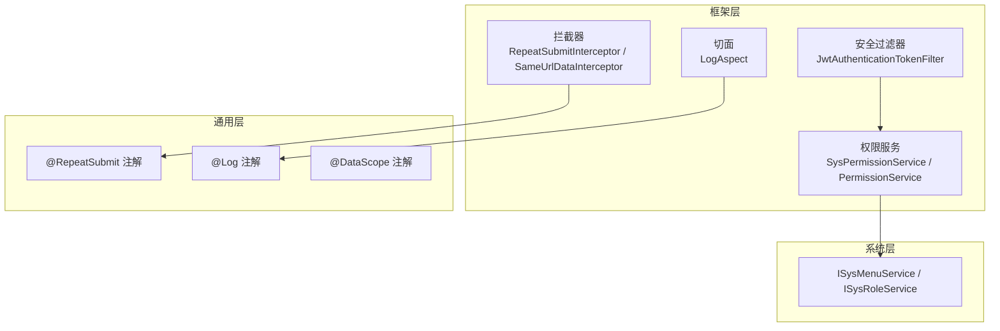
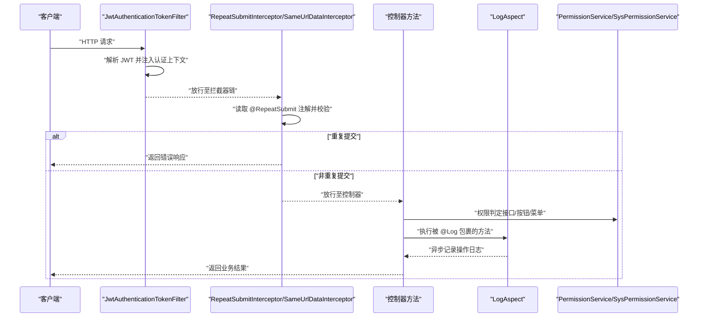
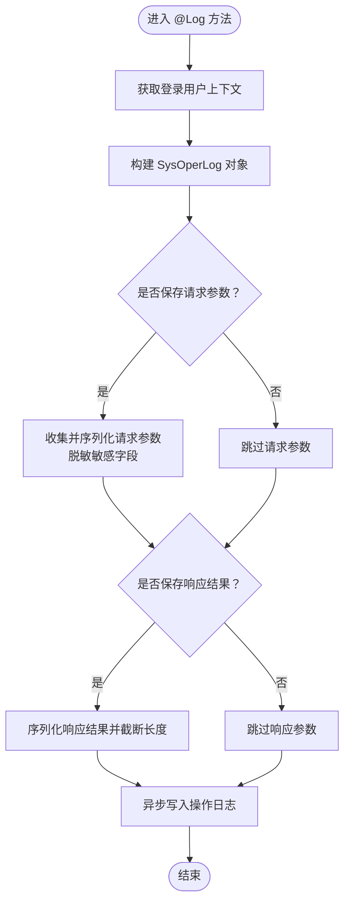
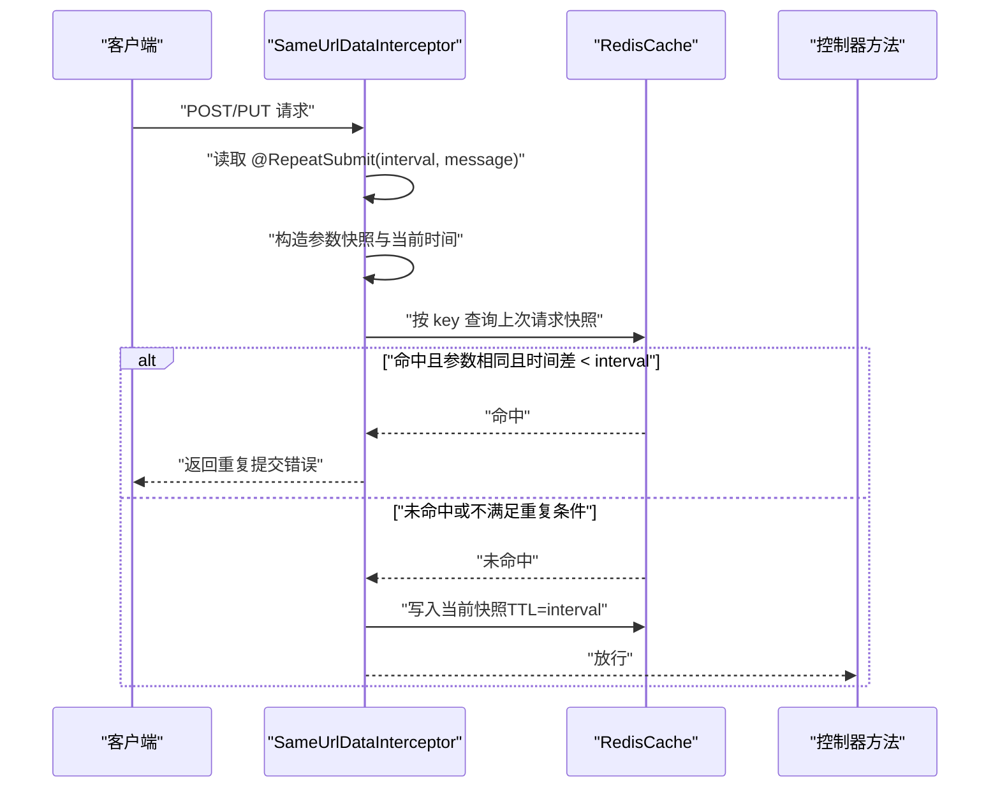
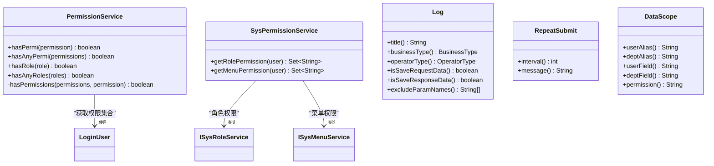
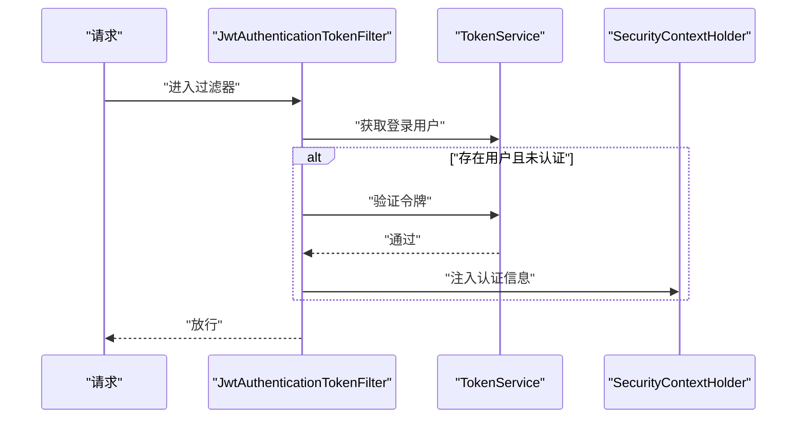
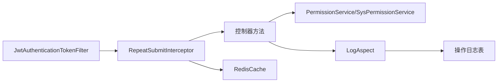
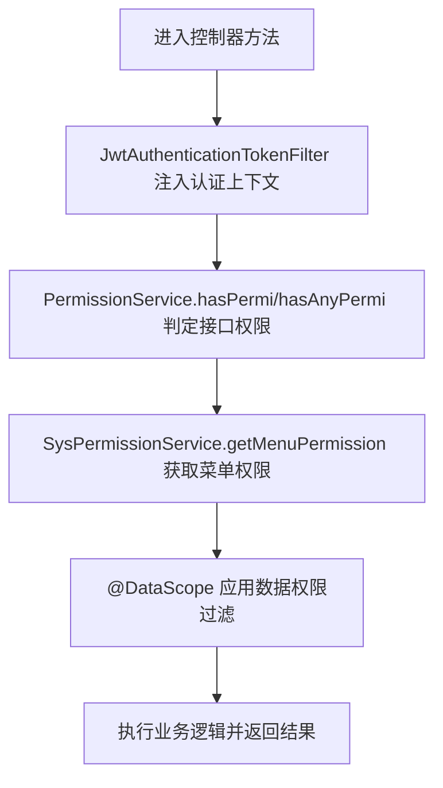

# 权限拦截器

<cite>
**本文引用的文件**
- [LogAspect.java](file://XingChen-Vue/xingchen-framework/src/main/java/com/xingchen/framework/aspectj/LogAspect.java)
- [RepeatSubmitInterceptor.java](file://XingChen-Vue/xingchen-framework/src/main/java/com/xingchen/framework/interceptor/RepeatSubmitInterceptor.java)
- [SameUrlDataInterceptor.java](file://XingChen-Vue/xingchen-framework/src/main/java/com/xingchen/framework/interceptor/impl/SameUrlDataInterceptor.java)
- [RepeatSubmit.java](file://XingChen-Vue/xingchen-common/src/main/java/com/xingchen/common/annotation/RepeatSubmit.java)
- [Log.java](file://XingChen-Vue/xingchen-common/src/main/java/com/xingchen/common/annotation/Log.java)
- [DataScope.java](file://XingChen-Vue/xingchen-common/src/main/java/com/xingchen/common/annotation/DataScope.java)
- [JwtAuthenticationTokenFilter.java](file://XingChen-Vue/xingchen-framework/src/main/java/com/xingchen/framework/security/filter/JwtAuthenticationTokenFilter.java)
- [SysPermissionService.java](file://XingChen-Vue/xingchen-framework/src/main/java/com/xingchen/framework/web/service/SysPermissionService.java)
- [PermissionService.java](file://XingChen-Vue/xingchen-framework/src/main/java/com/xingchen/framework/web/service/PermissionService.java)
</cite>

## 目录
1. [简介](#简介)
2. [项目结构](#项目结构)
3. [核心组件](#核心组件)
4. [架构总览](#架构总览)
5. [组件详解](#组件详解)
6. [依赖关系分析](#依赖关系分析)
7. [性能考量](#性能考量)
8. [故障排查指南](#故障排查指南)
9. [结论](#结论)
10. [附录](#附录)

## 简介
本技术文档聚焦于系统的权限拦截与安全拦截能力，围绕以下主题展开：  
- 日志切面 LogAspect 的实现与审计日志记录机制  
- 重复提交拦截器 RepeatSubmitInterceptor 及其具体实现 SameUrlDataInterceptor 的工作原理  
- 权限注解体系：@Log、@RepeatSubmit、@DataScope 的使用与配置要点  
- 权限服务与上下文：接口权限、按钮权限、菜单权限与数据权限的判定流程  
- 权限缓存、权限变更通知与权限审计日志的落地方式  
- 配置方法、性能优化策略与调试技巧  

## 项目结构
围绕权限与安全的相关模块主要分布在以下包中：  
- framework 层：拦截器、切面、安全过滤器、权限服务  
- common 层：权限注解、工具类、常量与实体基类  
- system 层：业务服务（菜单、角色、用户等）为权限判定提供数据支撑  

图表来源
- [RepeatSubmitInterceptor.java:1-57](file://XingChen-Vue/xingchen-framework/src/main/java/com/xingchen/framework/interceptor/RepeatSubmitInterceptor.java#L1-L57)
- [SameUrlDataInterceptor.java:1-111](file://XingChen-Vue/xingchen-framework/src/main/java/com/xingchen/framework/interceptor/impl/SameUrlDataInterceptor.java#L1-L111)
- [LogAspect.java:1-265](file://XingChen-Vue/xingchen-framework/src/main/java/com/xingchen/framework/aspectj/LogAspect.java#L1-L265)
- [JwtAuthenticationTokenFilter.java:1-45](file://XingChen-Vue/xingchen-framework/src/main/java/com/xingchen/framework/security/filter/JwtAuthenticationTokenFilter.java#L1-L45)
- [SysPermissionService.java:1-90](file://XingChen-Vue/xingchen-framework/src/main/java/com/xingchen/framework/web/service/SysPermissionService.java#L1-L90)
- [PermissionService.java:1-160](file://XingChen-Vue/xingchen-framework/src/main/java/com/xingchen/framework/web/service/PermissionService.java#L1-L160)
- [RepeatSubmit.java:1-32](file://XingChen-Vue/xingchen-common/src/main/java/com/xingchen/common/annotation/RepeatSubmit.java#L1-L32)
- [Log.java:1-52](file://XingChen-Vue/xingchen-common/src/main/java/com/xingchen/common/annotation/Log.java#L1-L52)
- [DataScope.java:1-44](file://XingChen-Vue/xingchen-common/src/main/java/com/xingchen/common/annotation/DataScope.java#L1-L44)

章节来源
- [RepeatSubmitInterceptor.java:1-57](file://XingChen-Vue/xingchen-framework/src/main/java/com/xingchen/framework/interceptor/RepeatSubmitInterceptor.java#L1-L57)
- [SameUrlDataInterceptor.java:1-111](file://XingChen-Vue/xingchen-framework/src/main/java/com/xingchen/framework/interceptor/impl/SameUrlDataInterceptor.java#L1-L111)
- [LogAspect.java:1-265](file://XingChen-Vue/xingchen-framework/src/main/java/com/xingchen/framework/aspectj/LogAspect.java#L1-L265)
- [JwtAuthenticationTokenFilter.java:1-45](file://XingChen-Vue/xingchen-framework/src/main/java/com/xingchen/framework/security/filter/JwtAuthenticationTokenFilter.java#L1-L45)
- [SysPermissionService.java:1-90](file://XingChen-Vue/xingchen-framework/src/main/java/com/xingchen/framework/web/service/SysPermissionService.java#L1-L90)
- [PermissionService.java:1-160](file://XingChen-Vue/xingchen-framework/src/main/java/com/xingchen/framework/web/service/PermissionService.java#L1-L160)
- [RepeatSubmit.java:1-32](file://XingChen-Vue/xingchen-common/src/main/java/com/xingchen/common/annotation/RepeatSubmit.java#L1-L32)
- [Log.java:1-52](file://XingChen-Vue/xingchen-common/src/main/java/com/xingchen/common/annotation/Log.java#L1-L52)
- [DataScope.java:1-44](file://XingChen-Vue/xingchen-common/src/main/java/com/xingchen/common/annotation/DataScope.java#L1-L44)

## 核心组件
- 日志切面 LogAspect：基于注解 @Log 的环绕式日志采集，异步落库，支持请求/响应参数脱敏与长度限制  
- 重复提交拦截器 RepeatSubmitInterceptor：抽象拦截器，结合 @RepeatSubmit 注解在控制器方法调用前进行重复提交校验  
- SameUrlDataInterceptor：基于 Redis 的“URL+消息头+参数”组合键的重复提交检测，支持时间窗口与参数对比  
- 权限服务 PermissionService 与 SysPermissionService：提供接口/按钮/菜单权限与数据权限的判定与聚合  
- 安全过滤器 JwtAuthenticationTokenFilter：基于 JWT 的认证与授权上下文注入  

章节来源
- [LogAspect.java:41-140](file://XingChen-Vue/xingchen-framework/src/main/java/com/xingchen/framework/aspectj/LogAspect.java#L41-L140)
- [RepeatSubmitInterceptor.java:14-56](file://XingChen-Vue/xingchen-framework/src/main/java/com/xingchen/framework/interceptor/RepeatSubmitInterceptor.java#L14-L56)
- [SameUrlDataInterceptor.java:19-111](file://XingChen-Vue/xingchen-framework/src/main/java/com/xingchen/framework/interceptor/impl/SameUrlDataInterceptor.java#L19-L111)
- [PermissionService.java:13-160](file://XingChen-Vue/xingchen-framework/src/main/java/com/xingchen/framework/web/service/PermissionService.java#L13-L160)
- [SysPermissionService.java:17-90](file://XingChen-Vue/xingchen-framework/src/main/java/com/xingchen/framework/web/service/SysPermissionService.java#L17-L90)
- [JwtAuthenticationTokenFilter.java:19-45](file://XingChen-Vue/xingchen-framework/src/main/java/com/xingchen/framework/security/filter/JwtAuthenticationTokenFilter.java#L19-L45)

## 架构总览
下图展示了从请求进入系统到完成权限校验与日志记录的关键路径。

图表来源
- [JwtAuthenticationTokenFilter.java:24-44](file://XingChen-Vue/xingchen-framework/src/main/java/com/xingchen/framework/security/filter/JwtAuthenticationTokenFilter.java#L24-L44)
- [RepeatSubmitInterceptor.java:22-45](file://XingChen-Vue/xingchen-framework/src/main/java/com/xingchen/framework/interceptor/RepeatSubmitInterceptor.java#L22-L45)
- [SameUrlDataInterceptor.java:40-85](file://XingChen-Vue/xingchen-framework/src/main/java/com/xingchen/framework/interceptor/impl/SameUrlDataInterceptor.java#L40-L85)
- [LogAspect.java:59-140](file://XingChen-Vue/xingchen-framework/src/main/java/com/xingchen/framework/aspectj/LogAspect.java#L59-L140)
- [PermissionService.java:27-40](file://XingChen-Vue/xingchen-framework/src/main/java/com/xingchen/framework/web/service/PermissionService.java#L27-L40)
- [SysPermissionService.java:37-88](file://XingChen-Vue/xingchen-framework/src/main/java/com/xingchen/framework/web/service/SysPermissionService.java#L37-L88)

## 组件详解

### 日志切面 LogAspect
- 切入点：基于 @Log 注解的方法执行前后  
- 关键能力：
  - 记录操作人、部门、IP、URL、请求方式、方法签名、耗时  
  - 支持保存请求参数与响应结果，并对敏感字段进行脱敏  
  - 异步写入操作日志表，避免阻塞主业务线程  
- 参数处理：
  - 优先从请求体读取参数；若为空则从请求参数映射组装  
  - 对文件上传、请求/响应对象进行过滤，避免序列化异常  
  - 参数最大长度限制，防止超长参数导致存储问题  
- 异常处理：捕获异常并记录错误信息，同时保留正常流程的耗时统计  

图表来源
- [LogAspect.java:88-168](file://XingChen-Vue/xingchen-framework/src/main/java/com/xingchen/framework/aspectj/LogAspect.java#L88-L168)
- [LogAspect.java:176-220](file://XingChen-Vue/xingchen-framework/src/main/java/com/xingchen/framework/aspectj/LogAspect.java#L176-L220)
- [LogAspect.java:225-263](file://XingChen-Vue/xingchen-framework/src/main/java/com/xingchen/framework/aspectj/LogAspect.java#L225-L263)

章节来源
- [LogAspect.java:36-140](file://XingChen-Vue/xingchen-framework/src/main/java/com/xingchen/framework/aspectj/LogAspect.java#L36-L140)
- [Log.java:17-52](file://XingChen-Vue/xingchen-common/src/main/java/com/xingchen/common/annotation/Log.java#L17-L52)

### 重复提交拦截器 RepeatSubmitInterceptor 与 SameUrlDataInterceptor
- RepeatSubmitInterceptor 抽象类：
  - 在 preHandle 中读取目标方法上的 @RepeatSubmit 注解  
  - 若存在注解且判定为重复提交，则直接输出错误响应并中断后续流程  
- SameUrlDataInterceptor 具体实现：
  - 使用 Redis 存储“请求地址 + 消息头标识”的键，值为最近一次请求的参数快照与时间戳  
  - 参数比较采用完整 JSON 字符串对比，时间比较采用注解 interval 配置（毫秒）  
  - 当参数相同且时间差小于 interval 时，判定为重复提交  
  - 缓存有效期由注解 interval 控制，避免长期占用内存  

图表来源
- [RepeatSubmitInterceptor.java:22-45](file://XingChen-Vue/xingchen-framework/src/main/java/com/xingchen/framework/interceptor/RepeatSubmitInterceptor.java#L22-L45)
- [SameUrlDataInterceptor.java:40-85](file://XingChen-Vue/xingchen-framework/src/main/java/com/xingchen/framework/interceptor/impl/SameUrlDataInterceptor.java#L40-L85)
- [RepeatSubmit.java:20-32](file://XingChen-Vue/xingchen-common/src/main/java/com/xingchen/common/annotation/RepeatSubmit.java#L20-L32)

章节来源
- [RepeatSubmitInterceptor.java:14-56](file://XingChen-Vue/xingchen-framework/src/main/java/com/xingchen/framework/interceptor/RepeatSubmitInterceptor.java#L14-L56)
- [SameUrlDataInterceptor.java:19-111](file://XingChen-Vue/xingchen-framework/src/main/java/com/xingchen/framework/interceptor/impl/SameUrlDataInterceptor.java#L19-L111)
- [RepeatSubmit.java:10-32](file://XingChen-Vue/xingchen-common/src/main/java/com/xingchen/common/annotation/RepeatSubmit.java#L10-L32)

### 权限注解与权限服务
- @Log：用于标记需要记录操作日志的控制器方法，支持配置标题、业务类型、操作人类别、是否保存请求/响应参数等  
- @RepeatSubmit：用于标记防止重复提交的控制器方法，支持配置时间间隔与提示消息  
- @DataScope：用于标记需要进行数据权限过滤的方法，支持配置用户/部门表别名、字段名与权限字符  
- 权限服务：
  - PermissionService：提供 hasPermi、hasAnyPermi、hasRole、hasAnyRoles 等权限判定入口，内部通过当前登录用户的权限集合进行匹配  
  - SysPermissionService：聚合角色与菜单权限，管理员拥有全部权限，普通用户按角色与菜单查询权限集合  

图表来源
- [PermissionService.java:18-160](file://XingChen-Vue/xingchen-framework/src/main/java/com/xingchen/framework/web/service/PermissionService.java#L18-L160)
- [SysPermissionService.java:22-90](file://XingChen-Vue/xingchen-framework/src/main/java/com/xingchen/framework/web/service/SysPermissionService.java#L22-L90)
- [Log.java:20-52](file://XingChen-Vue/xingchen-common/src/main/java/com/xingchen/common/annotation/Log.java#L20-L52)
- [RepeatSubmit.java:20-32](file://XingChen-Vue/xingchen-common/src/main/java/com/xingchen/common/annotation/RepeatSubmit.java#L20-L32)
- [DataScope.java:17-44](file://XingChen-Vue/xingchen-common/src/main/java/com/xingchen/common/annotation/DataScope.java#L17-L44)

章节来源
- [PermissionService.java:13-160](file://XingChen-Vue/xingchen-framework/src/main/java/com/xingchen/framework/web/service/PermissionService.java#L13-L160)
- [SysPermissionService.java:17-90](file://XingChen-Vue/xingchen-framework/src/main/java/com/xingchen/framework/web/service/SysPermissionService.java#L17-L90)
- [Log.java:11-52](file://XingChen-Vue/xingchen-common/src/main/java/com/xingchen/common/annotation/Log.java#L11-L52)
- [RepeatSubmit.java:10-32](file://XingChen-Vue/xingchen-common/src/main/java/com/xingchen/common/annotation/RepeatSubmit.java#L10-L32)
- [DataScope.java:9-44](file://XingChen-Vue/xingchen-common/src/main/java/com/xingchen/common/annotation/DataScope.java#L9-L44)

### 安全拦截器 JwtAuthenticationTokenFilter
- 在每次请求进入时尝试从请求中提取登录用户信息并验证 JWT 有效性  
- 将认证信息注入到 Spring Security 上下文中，供后续权限判定使用  
- 仅在尚未存在认证信息时执行，避免重复认证  

图表来源
- [JwtAuthenticationTokenFilter.java:30-43](file://XingChen-Vue/xingchen-framework/src/main/java/com/xingchen/framework/security/filter/JwtAuthenticationTokenFilter.java#L30-L43)

章节来源
- [JwtAuthenticationTokenFilter.java:19-45](file://XingChen-Vue/xingchen-framework/src/main/java/com/xingchen/framework/security/filter/JwtAuthenticationTokenFilter.java#L19-L45)

## 依赖关系分析
- 拦截器链路：JwtAuthenticationTokenFilter → RepeatSubmitInterceptor → 控制器 → LogAspect（异步记录）  
- 权限判定链路：控制器 → PermissionService/SysPermissionService → 登录用户权限集合  
- 数据权限：@DataScope 与业务 SQL 过滤器配合，依据用户/部门字段与权限字符进行过滤  
- 缓存与存储：SameUrlDataInterceptor 使用 Redis 缓存请求快照；LogAspect 异步写入操作日志表  

图表来源
- [JwtAuthenticationTokenFilter.java:24-44](file://XingChen-Vue/xingchen-framework/src/main/java/com/xingchen/framework/security/filter/JwtAuthenticationTokenFilter.java#L24-L44)
- [RepeatSubmitInterceptor.java:22-45](file://XingChen-Vue/xingchen-framework/src/main/java/com/xingchen/framework/interceptor/RepeatSubmitInterceptor.java#L22-L45)
- [SameUrlDataInterceptor.java:68-84](file://XingChen-Vue/xingchen-framework/src/main/java/com/xingchen/framework/interceptor/impl/SameUrlDataInterceptor.java#L68-L84)
- [LogAspect.java:127-128](file://XingChen-Vue/xingchen-framework/src/main/java/com/xingchen/framework/aspectj/LogAspect.java#L127-L128)

章节来源
- [JwtAuthenticationTokenFilter.java:19-45](file://XingChen-Vue/xingchen-framework/src/main/java/com/xingchen/framework/security/filter/JwtAuthenticationTokenFilter.java#L19-L45)
- [RepeatSubmitInterceptor.java:14-56](file://XingChen-Vue/xingchen-framework/src/main/java/com/xingchen/framework/interceptor/RepeatSubmitInterceptor.java#L14-L56)
- [SameUrlDataInterceptor.java:19-111](file://XingChen-Vue/xingchen-framework/src/main/java/com/xingchen/framework/interceptor/impl/SameUrlDataInterceptor.java#L19-L111)
- [LogAspect.java:88-140](file://XingChen-Vue/xingchen-framework/src/main/java/com/xingchen/framework/aspectj/LogAspect.java#L88-L140)

## 性能考量
- 异步日志：LogAspect 通过异步任务写入操作日志，降低同步 IO 对主线程的影响  
- Redis 缓存：SameUrlDataInterceptor 使用 Redis 存储请求快照，TTL 由 @RepeatSubmit.interval 控制，避免内存膨胀  
- 参数序列化与脱敏：LogAspect 对敏感字段进行脱敏与长度限制，减少序列化开销与存储压力  
- 权限判定：PermissionService 与 SysPermissionService 基于已加载的权限集合进行集合匹配，复杂度与权限数量线性相关  
- 建议：
  - 合理设置 @RepeatSubmit.interval，避免过短导致误判或过长导致防护失效  
  - 控制 @Log.isSaveRequestData/isSaveResponseData 的使用范围，避免大对象频繁序列化  
  - 对高频接口启用缓存与限流，结合限速注解与网关层防护  

[本节为通用性能建议，无需特定文件引用]

## 故障排查指南
- 重复提交误判
  - 检查 SameUrlDataInterceptor 的缓存键生成逻辑（URL + 消息头标识），确认 header 配置一致  
  - 调整 @RepeatSubmit.interval，确保业务合理的时间窗口  
  - 查看 Redis 中对应 key 的 TTL 与内容，确认是否被提前清理  
- 权限判定失败
  - 确认 JwtAuthenticationTokenFilter 已正确注入认证上下文  
  - 检查 PermissionService.hasPermi/hasAnyPermi 的权限字符串格式与分隔符  
  - 核对 SysPermissionService 返回的权限集合是否包含所需权限  
- 日志缺失或异常
  - 检查 @Log 注解配置项（是否保存请求/响应参数）  
  - 关注 LogAspect 的异常捕获与日志输出，定位序列化异常或参数过大问题  
- 数据权限过滤无效
  - 确认 @DataScope 注解的 userAlias/deptAlias/userField/deptField/permission 配置与 SQL 一致  
  - 核对业务 SQL 是否正确应用了数据权限过滤条件  

章节来源
- [SameUrlDataInterceptor.java:32-85](file://XingChen-Vue/xingchen-framework/src/main/java/com/xingchen/framework/interceptor/impl/SameUrlDataInterceptor.java#L32-L85)
- [RepeatSubmit.java:20-32](file://XingChen-Vue/xingchen-common/src/main/java/com/xingchen/common/annotation/RepeatSubmit.java#L20-L32)
- [JwtAuthenticationTokenFilter.java:30-43](file://XingChen-Vue/xingchen-framework/src/main/java/com/xingchen/framework/security/filter/JwtAuthenticationTokenFilter.java#L30-L43)
- [PermissionService.java:27-40](file://XingChen-Vue/xingchen-framework/src/main/java/com/xingchen/framework/web/service/PermissionService.java#L27-L40)
- [SysPermissionService.java:37-88](file://XingChen-Vue/xingchen-framework/src/main/java/com/xingchen/framework/web/service/SysPermissionService.java#L37-L88)
- [LogAspect.java:127-135](file://XingChen-Vue/xingchen-framework/src/main/java/com/xingchen/framework/aspectj/LogAspect.java#L127-L135)
- [DataScope.java:17-44](file://XingChen-Vue/xingchen-common/src/main/java/com/xingchen/common/annotation/DataScope.java#L17-L44)

## 结论
本系统通过“认证过滤器 + 拦截器 + 切面 + 权限服务”的多层协同，实现了对请求的安全拦截、重复提交防护与操作审计。  
- 认证层：JWT 解析与注入，保障后续权限判定的上下文可用  
- 防护层：重复提交拦截器基于 Redis 实现高可靠的时间窗口与参数比对  
- 审计层：日志切面统一采集操作日志，异步落库，兼顾性能与可追溯性  
- 权限层：接口/按钮/菜单/数据权限的统一服务化封装，便于扩展与维护  

[本节为总结性内容，无需特定文件引用]

## 附录

### 权限注解使用与规则
- @Log
  - 适用范围：方法级  
  - 常用配置：title、businessType、operatorType、isSaveRequestData、isSaveResponseData、excludeParamNames  
  - 建议：仅对关键业务接口开启响应参数保存，避免大对象序列化  
- @RepeatSubmit  
  - 适用范围：方法级  
  - 常用配置：interval（毫秒）、message  
  - 建议：根据业务交互节奏调整 interval，避免误伤真实重复提交  
- @DataScope  
  - 适用范围：方法级  
  - 常用配置：userAlias、deptAlias、userField、deptField、permission  
  - 建议：与业务 SQL 的数据权限过滤条件保持一致，确保字段别名与权限字符正确  

章节来源
- [Log.java:17-52](file://XingChen-Vue/xingchen-common/src/main/java/com/xingchen/common/annotation/Log.java#L17-L52)
- [RepeatSubmit.java:16-32](file://XingChen-Vue/xingchen-common/src/main/java/com/xingchen/common/annotation/RepeatSubmit.java#L16-L32)
- [DataScope.java:14-44](file://XingChen-Vue/xingchen-common/src/main/java/com/xingchen/common/annotation/DataScope.java#L14-L44)

### 权限判定流程（接口/按钮/菜单/数据）

图表来源
- [JwtAuthenticationTokenFilter.java:30-43](file://XingChen-Vue/xingchen-framework/src/main/java/com/xingchen/framework/security/filter/JwtAuthenticationTokenFilter.java#L30-L43)
- [PermissionService.java:27-80](file://XingChen-Vue/xingchen-framework/src/main/java/com/xingchen/framework/web/service/PermissionService.java#L27-L80)
- [SysPermissionService.java:58-88](file://XingChen-Vue/xingchen-framework/src/main/java/com/xingchen/framework/web/service/SysPermissionService.java#L58-L88)
- [DataScope.java:17-44](file://XingChen-Vue/xingchen-common/src/main/java/com/xingchen/common/annotation/DataScope.java#L17-L44)