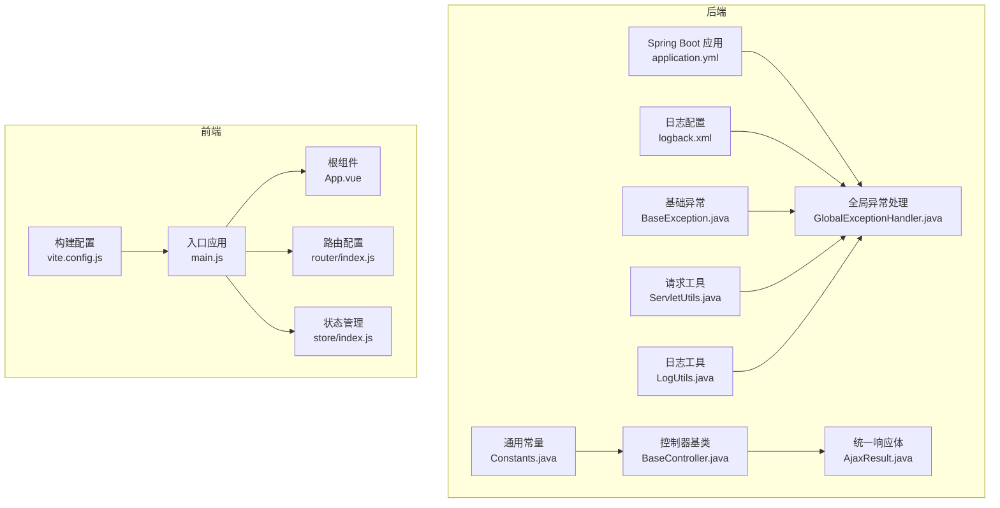
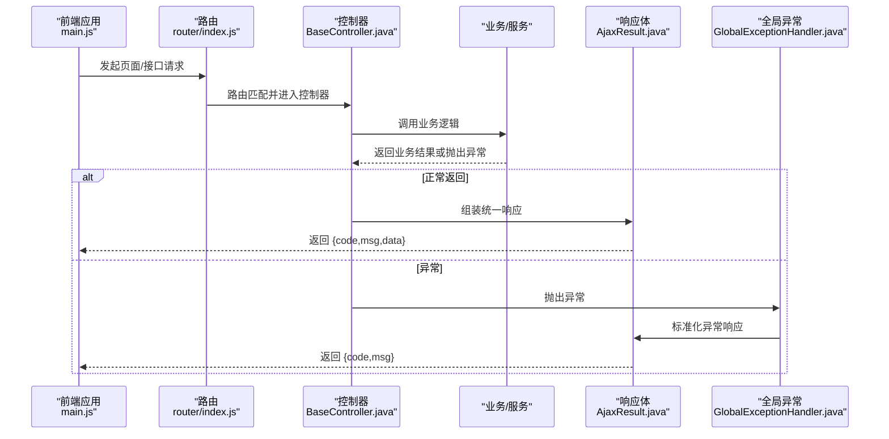
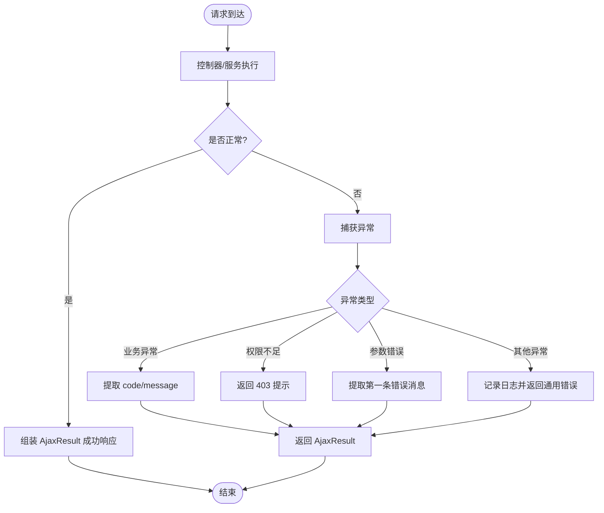
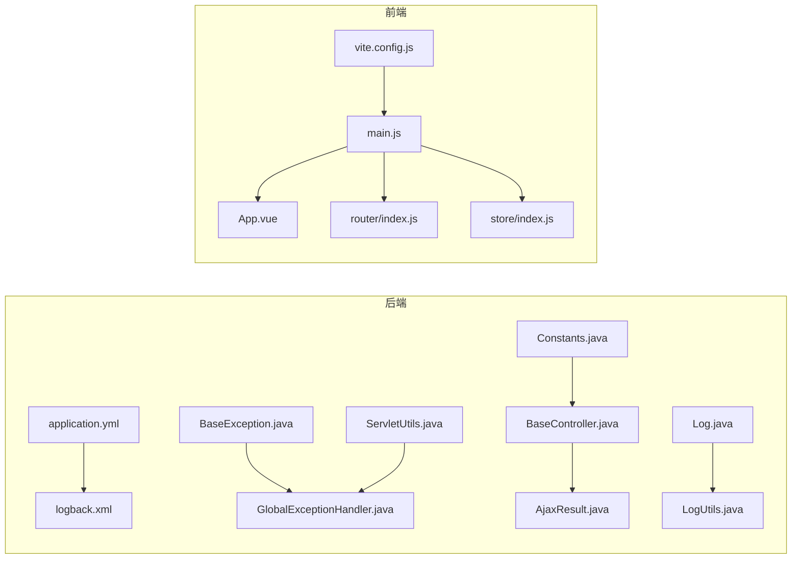

# 代码规范

<cite>
**本文引用的文件**
- [application.yml](file://XingChen-Vue/xingchen-admin/src/main/resources/application.yml)
- [logback.xml](file://XingChen-Vue/xingchen-admin/src/main/resources/logback.xml)
- [Constants.java](file://XingChen-Vue/xingchen-common/src/main/java/com/xingchen/common/constant/Constants.java)
- [BaseException.java](file://XingChen-Vue/xingchen-common/src/main/java/com/xingchen/common/exception/base/BaseException.java)
- [Log.java](file://XingChen-Vue/xingchen-common/src/main/java/com/xingchen/common/annotation/Log.java)
- [BusinessType.java](file://XingChen-Vue/xingchen-common/src/main/java/com/xingchen/common/enums/BusinessType.java)
- [OperatorType.java](file://XingChen-Vue/xingchen-common/src/main/java/com/xingchen/common/enums/OperatorType.java)
- [BaseController.java](file://XingChen-Vue/xingchen-common/src/main/java/com/xingchen/common/core/controller/BaseController.java)
- [AjaxResult.java](file://XingChen-Vue/xingchen-common/src/main/java/com/xingchen/common/core/domain/AjaxResult.java)
- [GlobalExceptionHandler.java](file://XingChen-Vue/xingchen-framework/src/main/java/com/xingchen/framework/web/exception/GlobalExceptionHandler.java)
- [ServletUtils.java](file://XingChen-Vue/xingchen-common/src/main/java/com/xingchen/common/utils/ServletUtils.java)
- [LogUtils.java](file://XingChen-Vue/xingchen-common/src/main/java/com/xingchen/common/utils/LogUtils.java)
- [main.js](file://XingChen-Vue3/src/main.js)
- [App.vue](file://XingChen-Vue3/src/App.vue)
- [index.js](file://XingChen-Vue3/src/store/index.js)
- [index.js](file://XingChen-Vue3/src/router/index.js)
- [vite.config.js](file://XingChen-Vue3/vite.config.js)
</cite>

## 目录
1. [简介](#简介)
2. [项目结构](#项目结构)
3. [核心组件](#核心组件)
4. [架构总览](#架构总览)
5. [详细组件分析](#详细组件分析)
6. [依赖关系分析](#依赖关系分析)
7. [性能考量](#性能考量)
8. [故障排查指南](#故障排查指南)
9. [结论](#结论)
10. [附录](#附录)

## 简介
本文件旨在为健康管理系统提供统一、可执行的代码规范，覆盖后端 Java、前端 Vue3、数据库设计以及工程化流程规范。通过梳理现有代码库中的配置与实现，形成可落地的命名约定、注释规范、异常与日志处理、状态管理与组件组织、数据库表与字段设计、索引策略、代码格式化、Git 提交与分支命名、代码评审清单等，以提升团队协作效率与系统可维护性。

## 项目结构
项目采用前后端分离架构：
- 后端基于 Spring Boot，模块化拆分（admin、common、framework、generator、quartz、system），统一配置与日志。
- 前端基于 Vue3 + Vite，采用 Pinia 状态管理、Element Plus 组件库、路由按权限动态加载。
- 工程化通过 Vite 配置代理、别名、打包优化与 PostCSS 处理。

图表来源
- [application.yml:1-148](file://XingChen-Vue/xingchen-admin/src/main/resources/application.yml#L1-L148)
- [logback.xml:1-93](file://XingChen-Vue/xingchen-admin/src/main/resources/logback.xml#L1-L93)
- [Constants.java:1-205](file://XingChen-Vue/xingchen-common/src/main/java/com/xingchen/common/constant/Constants.java#L1-L205)
- [BaseException.java:1-98](file://XingChen-Vue/xingchen-common/src/main/java/com/xingchen/common/exception/base/BaseException.java#L1-L98)
- [GlobalExceptionHandler.java:1-146](file://XingChen-Vue/xingchen-framework/src/main/java/com/xingchen/framework/web/exception/GlobalExceptionHandler.java#L1-L146)
- [BaseController.java:1-203](file://XingChen-Vue/xingchen-common/src/main/java/com/xingchen/common/core/controller/BaseController.java#L1-L203)
- [AjaxResult.java:1-217](file://XingChen-Vue/xingchen-common/src/main/java/com/xingchen/common/core/domain/AjaxResult.java#L1-L217)
- [ServletUtils.java:1-219](file://XingChen-Vue/xingchen-common/src/main/java/com/xingchen/common/utils/ServletUtils.java#L1-L219)
- [LogUtils.java:1-19](file://XingChen-Vue/xingchen-common/src/main/java/com/xingchen/common/utils/LogUtils.java#L1-L19)
- [main.js:1-85](file://XingChen-Vue3/src/main.js#L1-L85)
- [App.vue:1-16](file://XingChen-Vue3/src/App.vue#L1-L16)
- [index.js:1-197](file://XingChen-Vue3/src/router/index.js#L1-L197)
- [index.js:1-4](file://XingChen-Vue3/src/store/index.js#L1-L4)
- [vite.config.js:1-80](file://XingChen-Vue3/vite.config.js#L1-L80)

章节来源
- [application.yml:1-148](file://XingChen-Vue/xingchen-admin/src/main/resources/application.yml#L1-L148)
- [logback.xml:1-93](file://XingChen-Vue/xingchen-admin/src/main/resources/logback.xml#L1-L93)
- [main.js:1-85](file://XingChen-Vue3/src/main.js#L1-L85)
- [index.js:1-197](file://XingChen-Vue3/src/router/index.js#L1-L197)
- [index.js:1-4](file://XingChen-Vue3/src/store/index.js#L1-L4)
- [vite.config.js:1-80](file://XingChen-Vue3/vite.config.js#L1-L80)

## 核心组件
- 统一响应体与状态码：AjaxResult 提供统一的 code/msg/data 结构，便于前端一致处理。
- 控制器基类：BaseController 封装分页、排序、登录用户信息获取、统一返回等常用能力。
- 全局异常处理：GlobalExceptionHandler 将各类异常转换为 AjaxResult，保证对外输出一致。
- 日志注解与切面：@Log 注解配合 LogAspect 记录操作日志；LogUtils 辅助日志格式化。
- 前端入口与全局注册：main.js 中集中注册组件、指令、插件与全局方法，保持入口清晰。
- 路由与状态：router/index.js 定义公共与动态路由；store/index.js 创建 Pinia 实例。

章节来源
- [AjaxResult.java:1-217](file://XingChen-Vue/xingchen-common/src/main/java/com/xingchen/common/core/domain/AjaxResult.java#L1-L217)
- [BaseController.java:1-203](file://XingChen-Vue/xingchen-common/src/main/java/com/xingchen/common/core/controller/BaseController.java#L1-L203)
- [GlobalExceptionHandler.java:1-146](file://XingChen-Vue/xingchen-framework/src/main/java/com/xingchen/framework/web/exception/GlobalExceptionHandler.java#L1-L146)
- [Log.java:1-52](file://XingChen-Vue/xingchen-common/src/main/java/com/xingchen/common/annotation/Log.java#L1-L52)
- [LogUtils.java:1-19](file://XingChen-Vue/xingchen-common/src/main/java/com/xingchen/common/utils/LogUtils.java#L1-L19)
- [main.js:1-85](file://XingChen-Vue3/src/main.js#L1-L85)
- [index.js:1-197](file://XingChen-Vue3/src/router/index.js#L1-L197)
- [index.js:1-4](file://XingChen-Vue3/src/store/index.js#L1-L4)

## 架构总览
后端通过 Spring MVC 接收请求，经控制器与业务层处理，统一通过 AjaxResult 返回；异常由 GlobalExceptionHandler 捕获并标准化输出。前端通过 main.js 注册全局能力，路由按权限动态加载，状态通过 Pinia 管理。

图表来源
- [main.js:1-85](file://XingChen-Vue3/src/main.js#L1-L85)
- [index.js:1-197](file://XingChen-Vue3/src/router/index.js#L1-L197)
- [BaseController.java:1-203](file://XingChen-Vue/xingchen-common/src/main/java/com/xingchen/common/core/controller/BaseController.java#L1-L203)
- [AjaxResult.java:1-217](file://XingChen-Vue/xingchen-common/src/main/java/com/xingchen/common/core/domain/AjaxResult.java#L1-L217)
- [GlobalExceptionHandler.java:1-146](file://XingChen-Vue/xingchen-framework/src/main/java/com/xingchen/framework/web/exception/GlobalExceptionHandler.java#L1-L146)

## 详细组件分析

### Java 后端代码规范

#### 命名约定
- 包名：采用 com.xingchen.* 命名空间，模块化清晰。
- 类名：采用大驼峰，如 BaseController、AjaxResult、GlobalExceptionHandler。
- 接口与枚举：接口以 I 前缀或语义明确单词，枚举使用名词或形容词，如 BusinessType、OperatorType。
- 常量：全大写加下划线，如 Constants 中的 SUCCESS、FAIL、TOKEN_PREFIX。
- 方法：动词短语，遵循 get/set/is 语义，避免缩写。
- 文件：类文件与类名一致，测试文件以 Test 结尾。

章节来源
- [Constants.java:1-205](file://XingChen-Vue/xingchen-common/src/main/java/com/xingchen/common/constant/Constants.java#L1-L205)
- [BusinessType.java:1-60](file://XingChen-Vue/xingchen-common/src/main/java/com/xingchen/common/enums/BusinessType.java#L1-L60)
- [OperatorType.java:1-25](file://XingChen-Vue/xingchen-common/src/main/java/com/xingchen/common/enums/OperatorType.java#L1-L25)
- [BaseController.java:1-203](file://XingChen-Vue/xingchen-common/src/main/java/com/xingchen/common/core/controller/BaseController.java#L1-L203)
- [AjaxResult.java:1-217](file://XingChen-Vue/xingchen-common/src/main/java/com/xingchen/common/core/domain/AjaxResult.java#L1-L217)

#### 注释规范
- 类与接口：使用多行注释描述职责与作用域。
- 方法：参数、返回值、异常、注意事项需注释；复杂逻辑补充说明。
- 字段：私有字段与配置项需注释用途。
- 枚举与常量：注释枚举取值含义与使用场景。

章节来源
- [BaseException.java:1-98](file://XingChen-Vue/xingchen-common/src/main/java/com/xingchen/common/exception/base/BaseException.java#L1-L98)
- [Log.java:1-52](file://XingChen-Vue/xingchen-common/src/main/java/com/xingchen/common/annotation/Log.java#L1-L52)

#### 异常处理规范
- 统一异常基类：BaseException 支持模块、编码、参数与默认消息组合。
- 全局异常：GlobalExceptionHandler 按异常类型分类处理，统一输出 AjaxResult。
- 业务异常：ServiceException 由业务层抛出，支持自定义 code 与 message。
- 安全异常：AccessDeniedException 输出 403 与提示信息。
- 参数异常：BindException、MethodArgumentNotValidException、MethodArgumentTypeMismatchException 统一提取第一条错误消息。

图表来源
- [BaseException.java:1-98](file://XingChen-Vue/xingchen-common/src/main/java/com/xingchen/common/exception/base/BaseException.java#L1-L98)
- [GlobalExceptionHandler.java:1-146](file://XingChen-Vue/xingchen-framework/src/main/java/com/xingchen/framework/web/exception/GlobalExceptionHandler.java#L1-L146)
- [AjaxResult.java:1-217](file://XingChen-Vue/xingchen-common/src/main/java/com/xingchen/common/core/domain/AjaxResult.java#L1-L217)

章节来源
- [BaseException.java:1-98](file://XingChen-Vue/xingchen-common/src/main/java/com/xingchen/common/exception/base/BaseException.java#L1-L98)
- [GlobalExceptionHandler.java:1-146](file://XingChen-Vue/xingchen-framework/src/main/java/com/xingchen/framework/web/exception/GlobalExceptionHandler.java#L1-L146)

#### 日志记录规范
- 日志级别：application.yml 指定 com.xingchen 为 debug、org.springframework 为 warn；logback.xml 按 INFO/ERROR 分流至不同文件。
- 日志格式：logback.xml 定义包含时间、线程、级别、类名方法行号、消息的格式。
- 操作日志：@Log 注解用于标注业务方法，记录标题、业务类型、操作人类别、是否保存请求/响应参数、排除字段等。
- 日志工具：LogUtils 提供方括号包裹辅助方法，便于日志拼接。

章节来源
- [application.yml:34-39](file://XingChen-Vue/xingchen-admin/src/main/resources/application.yml#L34-L39)
- [logback.xml:1-93](file://XingChen-Vue/xingchen-admin/src/main/resources/logback.xml#L1-L93)
- [Log.java:1-52](file://XingChen-Vue/xingchen-common/src/main/java/com/xingchen/common/annotation/Log.java#L1-L52)
- [LogUtils.java:1-19](file://XingChen-Vue/xingchen-common/src/main/java/com/xingchen/common/utils/LogUtils.java#L1-L19)

#### 统一响应与控制器基类
- AjaxResult：提供 success/warn/error 静态工厂方法，统一 code/msg/data 结构；支持链式 put 扩展。
- BaseController：封装分页、排序、登录用户信息获取、toAjax 判定、重定向等通用能力，减少重复代码。

章节来源
- [AjaxResult.java:1-217](file://XingChen-Vue/xingchen-common/src/main/java/com/xingchen/common/core/domain/AjaxResult.java#L1-L217)
- [BaseController.java:1-203](file://XingChen-Vue/xingchen-common/src/main/java/com/xingchen/common/core/controller/BaseController.java#L1-L203)

#### 请求与工具
- ServletUtils：提供参数获取、类型转换、Ajax 判断、URL 编解码等工具方法，统一处理客户端交互细节。

章节来源
- [ServletUtils.java:1-219](file://XingChen-Vue/xingchen-common/src/main/java/com/xingchen/common/utils/ServletUtils.java#L1-L219)

### Vue3 前端代码规范

#### 组件命名与组织
- 组件命名：采用 PascalCase，如 DailyHealthCheckIn.vue、Pagination、DictTag。
- 全局组件：在 main.js 中集中注册，避免分散导入；通过 app.component(...) 统一挂载。
- 根组件：App.vue 作为单一出口，内部通过 <router-view /> 渲染路由视图。

章节来源
- [main.js:1-85](file://XingChen-Vue3/src/main.js#L1-L85)
- [App.vue:1-16](file://XingChen-Vue3/src/App.vue#L1-L16)

#### 样式组织
- 全局样式：在 main.js 中引入全局样式文件，确保主题与基础样式一致。
- 主题与变量：通过 Element Plus 与自定义 SCSS 变量模块，统一颜色、尺寸、间距等。
- SVG 图标：通过虚拟模块注册与 SvgIcon 组件统一管理图标资源。

章节来源
- [main.js:10](file://XingChen-Vue3/src/main.js#L10)
- [main.js:22-24](file://XingChen-Vue3/src/main.js#L22-L24)

#### 状态管理规范（Pinia）
- Store 创建：store/index.js 创建 Pinia 实例并导出，避免重复创建。
- 模块化：modules 下按功能划分模块（如 app、dict、permission、settings、tagsView、user），职责清晰。
- 全局方法：在 main.js 中将常用工具函数挂载到全局属性，便于模板与组件直接使用。

章节来源
- [index.js:1-4](file://XingChen-Vue3/src/store/index.js#L1-L4)
- [main.js:49-58](file://XingChen-Vue3/src/main.js#L49-L58)

#### 路由与权限
- 公共路由：constantRoutes 定义登录、404、首页等无需权限的页面。
- 动态路由：dynamicRoutes 基于权限动态注入，结合 permissions 字段控制可见性与可访问性。
- 路由元信息：title/icon/noCache/breadcrumb/activeMenu 等 meta 字段统一管理导航与缓存策略。

章节来源
- [index.js:27-109](file://XingChen-Vue3/src/router/index.js#L27-L109)
- [index.js:111-183](file://XingChen-Vue3/src/router/index.js#L111-L183)

#### 工程化与构建
- 别名与扩展：vite.config.js 配置 @ 指向 src，支持多后缀解析，提升导入便捷性。
- 代理：/dev-api 代理到后端 8080 端口，springdoc 文档代理到 /v3/api-docs。
- 打包：关闭生产 sourcemap，统一静态资源目录命名，降低体积预警阈值。
- CSS：移除 @charset 规则，避免重复声明。

章节来源
- [vite.config.js:1-80](file://XingChen-Vue3/vite.config.js#L1-L80)

### 数据库设计规范
- 表命名：采用小写下划线命名法，如 sys_user、sys_menu、sys_points_log。
- 字段规范：统一使用非空约束、合理长度、默认值；时间字段使用 DATETIME 或 TIMESTAMP；布尔使用 TINYINT(1) 或 BIT。
- 索引设计：主键自增；外键建立索引；高频查询字段（如用户ID、创建时间）建立索引；复合索引遵循最左前缀原则。
- 字段注释：每个字段添加中文注释，说明含义与取值范围。
- 关系表：多对多使用中间表，字段命名遵循“业务实体_主键”命名，如 sys_user_role。

（本节为通用设计建议，未直接分析具体数据库文件）

## 依赖关系分析

图表来源
- [application.yml:1-148](file://XingChen-Vue/xingchen-admin/src/main/resources/application.yml#L1-L148)
- [logback.xml:1-93](file://XingChen-Vue/xingchen-admin/src/main/resources/logback.xml#L1-L93)
- [Constants.java:1-205](file://XingChen-Vue/xingchen-common/src/main/java/com/xingchen/common/constant/Constants.java#L1-L205)
- [BaseController.java:1-203](file://XingChen-Vue/xingchen-common/src/main/java/com/xingchen/common/core/controller/BaseController.java#L1-L203)
- [BaseException.java:1-98](file://XingChen-Vue/xingchen-common/src/main/java/com/xingchen/common/exception/base/BaseException.java#L1-L98)
- [GlobalExceptionHandler.java:1-146](file://XingChen-Vue/xingchen-framework/src/main/java/com/xingchen/framework/web/exception/GlobalExceptionHandler.java#L1-L146)
- [AjaxResult.java:1-217](file://XingChen-Vue/xingchen-common/src/main/java/com/xingchen/common/core/domain/AjaxResult.java#L1-L217)
- [ServletUtils.java:1-219](file://XingChen-Vue/xingchen-common/src/main/java/com/xingchen/common/utils/ServletUtils.java#L1-L219)
- [Log.java:1-52](file://XingChen-Vue/xingchen-common/src/main/java/com/xingchen/common/annotation/Log.java#L1-L52)
- [LogUtils.java:1-19](file://XingChen-Vue/xingchen-common/src/main/java/com/xingchen/common/utils/LogUtils.java#L1-L19)
- [main.js:1-85](file://XingChen-Vue3/src/main.js#L1-L85)
- [App.vue:1-16](file://XingChen-Vue3/src/App.vue#L1-L16)
- [index.js:1-197](file://XingChen-Vue3/src/router/index.js#L1-L197)
- [index.js:1-4](file://XingChen-Vue3/src/store/index.js#L1-L4)
- [vite.config.js:1-80](file://XingChen-Vue3/vite.config.js#L1-L80)

章节来源
- [application.yml:1-148](file://XingChen-Vue/xingchen-admin/src/main/resources/application.yml#L1-L148)
- [logback.xml:1-93](file://XingChen-Vue/xingchen-admin/src/main/resources/logback.xml#L1-L93)
- [main.js:1-85](file://XingChen-Vue3/src/main.js#L1-L85)

## 性能考量
- 后端
  - 分页与排序：BaseController 使用 PageHelper 与 SqlUtil.escapeOrderBySql，避免 SQL 注入与过度排序。
  - 日志级别：生产环境降低日志级别，减少 IO 压力；按级别分流日志文件。
  - Jackson 配置：统一时区与日期格式，减少序列化开销。
- 前端
  - 资源分包：Vite Rollup 输出按哈希命名，利于浏览器缓存；chunkSizeWarningLimit 提升体积感知。
  - 组件懒加载：路由按需 import，减少首屏体积。
  - 代理与缓存：开发环境代理后端接口，避免跨域与重复请求。

章节来源
- [BaseController.java:50-77](file://XingChen-Vue/xingchen-common/src/main/java/com/xingchen/common/core/controller/BaseController.java#L50-L77)
- [application.yml:63-66](file://XingChen-Vue/xingchen-admin/src/main/resources/application.yml#L63-L66)
- [vite.config.js:29-42](file://XingChen-Vue3/vite.config.js#L29-L42)

## 故障排查指南
- 统一响应与状态码
  - AjaxResult 提供 isSuccess/isWarn/isError 判定，便于前端快速判断结果。
- 异常定位
  - GlobalExceptionHandler 记录请求 URI 与异常堆栈，优先查看错误码与消息。
  - 业务异常：根据 ServiceException 的 code/message 快速定位模块与原因。
- 日志排查
  - logback.xml 将 INFO/ERROR 分流至不同文件，结合 application.yml 的日志级别进行过滤。
  - @Log 注解可控制是否保存请求/响应参数，必要时开启以辅助定位。
- 请求与参数
  - ServletUtils.isAjaxRequest 用于区分 Ajax 与普通请求；参数编解码与类型转换由工具类统一处理。

章节来源
- [AjaxResult.java:178-201](file://XingChen-Vue/xingchen-common/src/main/java/com/xingchen/common/core/domain/AjaxResult.java#L178-L201)
- [GlobalExceptionHandler.java:35-144](file://XingChen-Vue/xingchen-framework/src/main/java/com/xingchen/framework/web/exception/GlobalExceptionHandler.java#L35-L144)
- [logback.xml:38-58](file://XingChen-Vue/xingchen-admin/src/main/resources/logback.xml#L38-L58)
- [Log.java:25-50](file://XingChen-Vue/xingchen-common/src/main/java/com/xingchen/common/annotation/Log.java#L25-L50)
- [ServletUtils.java:159-181](file://XingChen-Vue/xingchen-common/src/main/java/com/xingchen/common/utils/ServletUtils.java#L159-L181)

## 结论
通过统一的响应体、异常处理、日志规范与前端工程化配置，项目实现了前后端一致的交互契约与可观测性。建议在后续迭代中持续落实数据库设计规范与 Git 流程规范，确保代码质量与交付效率稳步提升。

## 附录

### 代码格式化标准（Java）
- 缩进：4 空格；行宽不超过 120。
- 空行：类内方法间空一行；逻辑分组空一行。
- 导包：按包层级分组，最后导入静态导入。
- 常量：全大写加下划线；枚举与注解使用语义化命名。
- 注释：类/方法/字段均需注释；复杂逻辑补充说明。

（本节为通用规范建议）

### 代码格式化标准（Vue3）
- 组件：PascalCase 命名；模板缩进 2 空格；props 使用 kebab-case 属性传入。
- 样式：SCSS 变量与混入统一管理；组件局部样式与全局样式分离。
- 路由：meta 字段统一管理；权限通过 permissions 控制。
- 状态：Pinia 模块按功能拆分；避免在组件中直接创建 store。

（本节为通用规范建议）

### Git 提交信息规范
- 格式：type(scope): subject
  - type：feat、fix、docs、style、refactor、test、chore
  - scope：模块名或文件路径
  - subject：简短描述，不超过 50 字
- 示例：feat(system): 添加用户角色分配功能

（本节为通用规范建议）

### 分支命名规范
- develop：开发分支
- feature/xxx：新功能
- fix/xxx：缺陷修复
- hotfix/xxx：紧急修复
- refactor/xxx：重构

（本节为通用规范建议）

### 代码审查检查清单（Java）
- 命名是否符合规范
- 是否存在魔法数与字符串
- 异常处理是否完整
- 日志是否充分且级别正确
- SQL 是否安全（参数化、排序防注入）
- 响应体是否统一
- 是否存在重复代码

（本节为通用规范建议）

### 代码审查检查清单（Vue3）
- 组件命名与组织是否规范
- 样式是否模块化
- 路由权限是否正确
- 状态管理是否清晰
- 是否存在未使用的依赖
- 是否使用了最佳实践（如 Composition API、Suspense、Teleport）

（本节为通用规范建议）