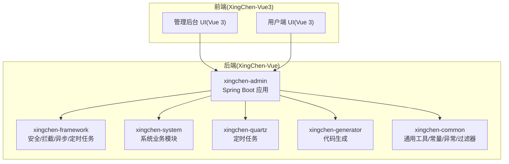
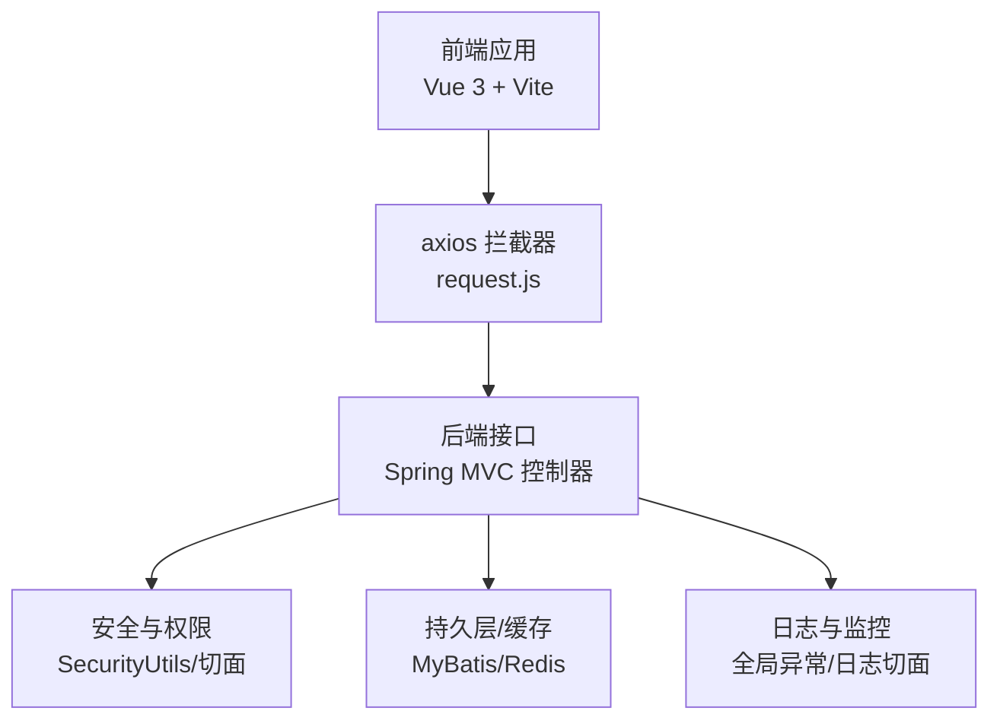
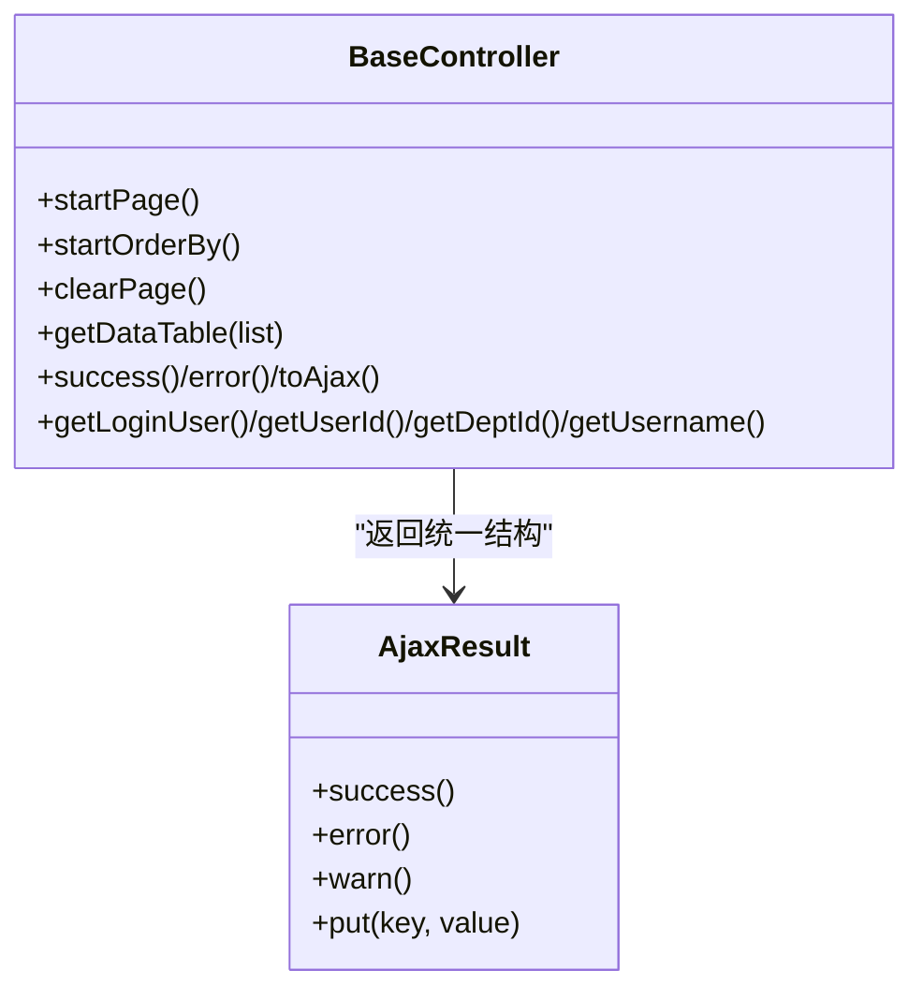
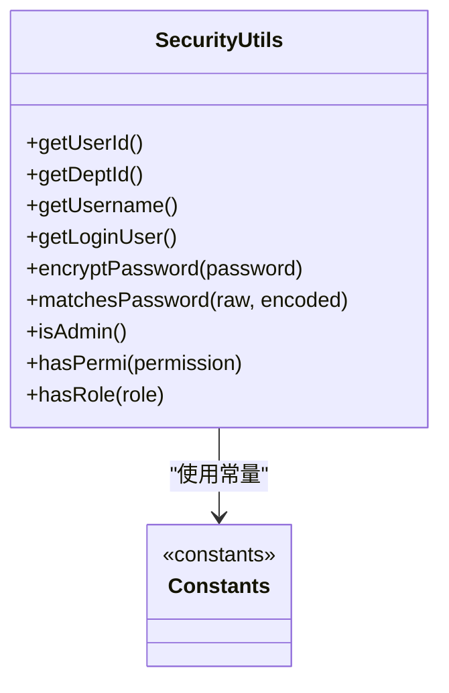
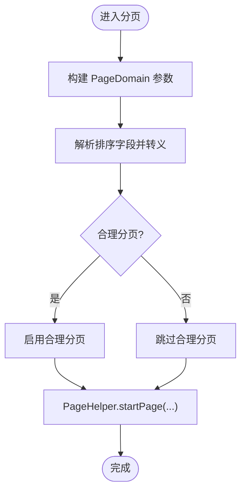
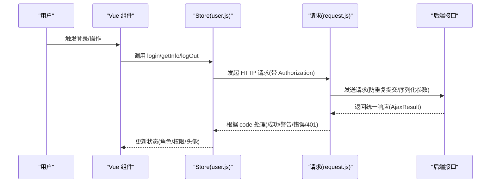
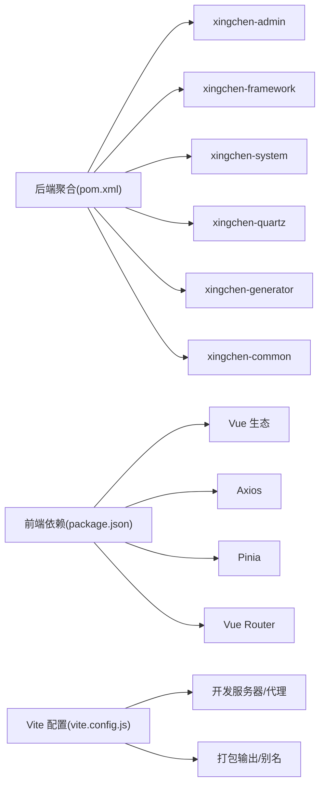

# 开发指南

<cite>
**本文引用的文件**   
- [XingChen-Vue/pom.xml](file://XingChen-Vue/pom.xml)
- [XingChen-Vue3/package.json](file://XingChen-Vue3/package.json)
- [XingChen-Vue3/vite.config.js](file://XingChen-Vue3/vite.config.js)
- [XingChen-Vue/.gitignore](file://XingChen-Vue/.gitignore)
- [XingChen-Vue3/.gitignore](file://XingChen-Vue3/.gitignore)
- [XingChen-Vue/xingchen-admin/src/main/resources/application.yml](file://XingChen-Vue/xingchen-admin/src/main/resources/application.yml)
- [XingChen-Vue/xingchen-common/src/main/java/com/xingchen/common/constant/Constants.java](file://XingChen-Vue/xingchen-common/src/main/java/com/xingchen/common/constant/Constants.java)
- [XingChen-Vue/xingchen-common/src/main/java/com/xingchen/common/core/controller/BaseController.java](file://XingChen-Vue/xingchen-common/src/main/java/com/xingchen/common/core/controller/BaseController.java)
- [XingChen-Vue/xingchen-common/src/main/java/com/xingchen/common/core/domain/AjaxResult.java](file://XingChen-Vue/xingchen-common/src/main/java/com/xingchen/common/core/domain/AjaxResult.java)
- [XingChen-Vue/xingchen-common/src/main/java/com/xingchen/common/utils/PageUtils.java](file://XingChen-Vue/xingchen-common/src/main/java/com/xingchen/common/utils/PageUtils.java)
- [XingChen-Vue/xingchen-common/src/main/java/com/xingchen/common/utils/SecurityUtils.java](file://XingChen-Vue/xingchen-common/src/main/java/com/xingchen/common/utils/SecurityUtils.java)
- [XingChen-Vue3/src/utils/request.js](file://XingChen-Vue3/src/utils/request.js)
- [XingChen-Vue3/src/utils/auth.js](file://XingChen-Vue3/src/utils/auth.js)
- [XingChen-Vue3/src/store/modules/user.js](file://XingChen-Vue3/src/store/modules/user.js)
- [XingChen-Vue3/src/api/system/user.js](file://XingChen-Vue3/src/api/system/user.js)
</cite>

## 目录
1. [简介](#简介)
2. [项目结构](#项目结构)
3. [核心组件](#核心组件)
4. [架构总览](#架构总览)
5. [详细组件分析](#详细组件分析)
6. [依赖关系分析](#依赖关系分析)
7. [性能考量](#性能考量)
8. [故障排查指南](#故障排查指南)
9. [结论](#结论)
10. [附录](#附录)

## 简介
本开发指南面向健康管理系统项目的后端与前端开发者，提供统一的代码规范、开发流程、测试策略、部署方案与约定式开发实践。文档覆盖模块化开发、组件复用、扩展开发最佳实践，并给出新功能开发模板与常见问题解决方案，帮助团队高效协作、降低维护成本。

## 项目结构
项目采用前后端分离架构，后端基于 Spring Boot 多模块聚合工程，前端基于 Vue 3 + Vite。后端模块包括：管理端应用、框架层、系统模块、定时任务模块、代码生成模块、通用工具模块；前端模块包含管理后台与用户端两套 UI。

图表来源
- [XingChen-Vue/pom.xml:176-183](file://XingChen-Vue/pom.xml#L176-L183)
- [XingChen-Vue3/package.json:18-37](file://XingChen-Vue3/package.json#L18-L37)

章节来源
- [XingChen-Vue/pom.xml:176-183](file://XingChen-Vue/pom.xml#L176-L183)
- [XingChen-Vue3/package.json:1-54](file://XingChen-Vue3/package.json#L1-L54)

## 核心组件
- 统一响应模型：AjaxResult 提供统一的 code/msg/data 结构，便于前端一致化处理。
- 控制器基类：BaseController 封装分页、排序、登录用户信息获取、结果封装等通用逻辑。
- 安全工具：SecurityUtils 提供加密、权限校验、角色判断、当前用户信息获取等能力。
- 分页工具：PageUtils 封装 PageHelper 的分页与排序配置，避免 SQL 注入风险。
- 前端请求拦截：request.js 统一封装 axios，支持重复提交拦截、鉴权头注入、错误提示与下载处理。
- 前端认证与用户态：auth.js 管理 Token，user.js Store 管理登录态、角色权限与头像拼接。

章节来源
- [XingChen-Vue/xingchen-common/src/main/java/com/xingchen/common/core/domain/AjaxResult.java:1-217](file://XingChen-Vue/xingchen-common/src/main/java/com/xingchen/common/core/domain/AjaxResult.java#L1-L217)
- [XingChen-Vue/xingchen-common/src/main/java/com/xingchen/common/core/controller/BaseController.java:1-203](file://XingChen-Vue/xingchen-common/src/main/java/com/xingchen/common/core/controller/BaseController.java#L1-L203)
- [XingChen-Vue/xingchen-common/src/main/java/com/xingchen/common/utils/SecurityUtils.java:1-189](file://XingChen-Vue/xingchen-common/src/main/java/com/xingchen/common/utils/SecurityUtils.java#L1-L189)
- [XingChen-Vue/xingchen-common/src/main/java/com/xingchen/common/utils/PageUtils.java:1-36](file://XingChen-Vue/xingchen-common/src/main/java/com/xingchen/common/utils/PageUtils.java#L1-L36)
- [XingChen-Vue3/src/utils/request.js:1-154](file://XingChen-Vue3/src/utils/request.js#L1-L154)
- [XingChen-Vue3/src/utils/auth.js:1-16](file://XingChen-Vue3/src/utils/auth.js#L1-L16)
- [XingChen-Vue3/src/store/modules/user.js:1-94](file://XingChen-Vue3/src/store/modules/user.js#L1-L94)

## 架构总览
后端通过 Spring MVC 提供 REST 接口，前端通过 axios 发起请求，统一经拦截器处理鉴权与重复提交控制，后端通过安全配置与切面实现权限控制与日志记录。

图表来源
- [XingChen-Vue3/src/utils/request.js:23-73](file://XingChen-Vue3/src/utils/request.js#L23-L73)
- [XingChen-Vue/xingchen-common/src/main/java/com/xingchen/common/utils/SecurityUtils.java:72-90](file://XingChen-Vue/xingchen-common/src/main/java/com/xingchen/common/utils/SecurityUtils.java#L72-L90)

## 详细组件分析

### 统一响应模型与控制器基类
- AjaxResult：统一返回结构，支持 success/error/warn 链式调用，便于前端统一处理。
- BaseController：封装分页/排序/登录用户信息/重定向/结果封装，减少重复代码。

图表来源
- [XingChen-Vue/xingchen-common/src/main/java/com/xingchen/common/core/domain/AjaxResult.java:67-103](file://XingChen-Vue/xingchen-common/src/main/java/com/xingchen/common/core/domain/AjaxResult.java#L67-L103)
- [XingChen-Vue/xingchen-common/src/main/java/com/xingchen/common/core/controller/BaseController.java:53-91](file://XingChen-Vue/xingchen-common/src/main/java/com/xingchen/common/core/controller/BaseController.java#L53-L91)

章节来源
- [XingChen-Vue/xingchen-common/src/main/java/com/xingchen/common/core/domain/AjaxResult.java:1-217](file://XingChen-Vue/xingchen-common/src/main/java/com/xingchen/common/core/domain/AjaxResult.java#L1-L217)
- [XingChen-Vue/xingchen-common/src/main/java/com/xingchen/common/core/controller/BaseController.java:1-203](file://XingChen-Vue/xingchen-common/src/main/java/com/xingchen/common/core/controller/BaseController.java#L1-L203)

### 安全与权限工具
- SecurityUtils：获取当前用户、角色/权限校验、密码加密与匹配、管理员判定。
- Constants：集中管理常量，如令牌键、权限分隔符、资源前缀、定时任务白名单等。

图表来源
- [XingChen-Vue/xingchen-common/src/main/java/com/xingchen/common/utils/SecurityUtils.java:27-136](file://XingChen-Vue/xingchen-common/src/main/java/com/xingchen/common/utils/SecurityUtils.java#L27-L136)
- [XingChen-Vue/xingchen-common/src/main/java/com/xingchen/common/constant/Constants.java:101-141](file://XingChen-Vue/xingchen-common/src/main/java/com/xingchen/common/constant/Constants.java#L101-L141)

章节来源
- [XingChen-Vue/xingchen-common/src/main/java/com/xingchen/common/utils/SecurityUtils.java:1-189](file://XingChen-Vue/xingchen-common/src/main/java/com/xingchen/common/utils/SecurityUtils.java#L1-L189)
- [XingChen-Vue/xingchen-common/src/main/java/com/xingchen/common/constant/Constants.java:1-205](file://XingChen-Vue/xingchen-common/src/main/java/com/xingchen/common/constant/Constants.java#L1-L205)

### 分页与排序工具
- PageUtils：从请求中构建分页与排序参数，注入到 PageHelper，同时对排序字段进行 SQL 注入防护。

图表来源
- [XingChen-Vue/xingchen-common/src/main/java/com/xingchen/common/utils/PageUtils.java:18-26](file://XingChen-Vue/xingchen-common/src/main/java/com/xingchen/common/utils/PageUtils.java#L18-L26)

章节来源
- [XingChen-Vue/xingchen-common/src/main/java/com/xingchen/common/utils/PageUtils.java:1-36](file://XingChen-Vue/xingchen-common/src/main/java/com/xingchen/common/utils/PageUtils.java#L1-L36)

### 前端请求拦截与下载
- request.js：统一 axios 实例，注入 Token、GET 参数序列化、重复提交拦截、错误提示、401 重登、下载处理。
- user.js：管理登录态、角色权限、头像拼接与密码提示。
- auth.js：Cookie 中读写 Token。
- user.js API：系统用户相关接口封装。

图表来源
- [XingChen-Vue3/src/store/modules/user.js:23-74](file://XingChen-Vue3/src/store/modules/user.js#L23-L74)
- [XingChen-Vue3/src/utils/request.js:24-73](file://XingChen-Vue3/src/utils/request.js#L24-L73)
- [XingChen-Vue3/src/api/system/user.js:1-137](file://XingChen-Vue3/src/api/system/user.js#L1-L137)

章节来源
- [XingChen-Vue3/src/utils/request.js:1-154](file://XingChen-Vue3/src/utils/request.js#L1-L154)
- [XingChen-Vue3/src/store/modules/user.js:1-94](file://XingChen-Vue3/src/store/modules/user.js#L1-L94)
- [XingChen-Vue3/src/utils/auth.js:1-16](file://XingChen-Vue3/src/utils/auth.js#L1-L16)
- [XingChen-Vue3/src/api/system/user.js:1-137](file://XingChen-Vue3/src/api/system/user.js#L1-L137)

## 依赖关系分析
- 后端多模块聚合：pom.xml 声明模块与版本管理，统一依赖版本与仓库。
- 前端依赖：package.json 声明运行时与开发依赖，脚本命令统一。
- 构建与代理：vite.config.js 配置代理、别名、打包输出与开发服务器。

图表来源
- [XingChen-Vue/pom.xml:176-183](file://XingChen-Vue/pom.xml#L176-L183)
- [XingChen-Vue3/package.json:18-46](file://XingChen-Vue3/package.json#L18-L46)
- [XingChen-Vue3/vite.config.js:8-79](file://XingChen-Vue3/vite.config.js#L8-L79)

章节来源
- [XingChen-Vue/pom.xml:1-232](file://XingChen-Vue/pom.xml#L1-L232)
- [XingChen-Vue3/package.json:1-54](file://XingChen-Vue3/package.json#L1-L54)
- [XingChen-Vue3/vite.config.js:1-80](file://XingChen-Vue3/vite.config.js#L1-L80)

## 性能考量
- 前端
  - 使用 axios 拦截器统一处理请求与响应，减少重复代码与网络开销。
  - 合理设置请求超时与重试策略，避免长时间占用连接。
  - 下载大文件时使用 Blob 流式处理，避免内存峰值过高。
- 后端
  - 分页与排序统一由 PageUtils 处理，避免 SQL 注入与无序查询。
  - 使用 Redis 缓存热点数据，降低数据库压力。
  - 启用合理的线程池与连接池配置，避免资源耗尽。

## 故障排查指南
- 前端
  - 401 无效会话：拦截器检测到 401 自动弹窗提示并引导重新登录。
  - 重复提交：POST/PUT 请求在短时间内重复触发会被拦截并提示。
  - 网络异常：捕获超时、断网等错误并提示用户。
- 后端
  - 统一异常处理：全局异常处理器返回 AjaxResult，前端可按 code 分支处理。
  - XSS 与防盗链：通过配置开关与白名单控制，避免恶意请求。
  - 日志级别：开发环境开启 debug，定位问题更高效。

章节来源
- [XingChen-Vue3/src/utils/request.js:76-124](file://XingChen-Vue3/src/utils/request.js#L76-L124)
- [XingChen-Vue/xingchen-admin/src/main/resources/application.yml:134-148](file://XingChen-Vue/xingchen-admin/src/main/resources/application.yml#L134-L148)

## 结论
本指南提供了从架构到组件、从开发到运维的完整规范。建议团队在日常开发中严格遵循统一响应、控制器基类、安全工具与分页工具的使用方式，结合前端拦截器与后端安全配置，确保系统的一致性、安全性与可维护性。

## 附录

### 代码规范与约定式开发
- 命名规范
  - 包名：com.xingchen.{模块}.domain/service/controller/mapper
  - 类名：首字母大写驼峰；常量：全大写+下划线
  - 方法：动词+名词；布尔方法以 is/has 开头
- 统一响应
  - 前端统一使用 AjaxResult 结构，后端通过 BaseController 输出
- 分页与排序
  - 使用 PageUtils 统一分页与排序，避免 SQL 注入
- 安全与权限
  - 使用 SecurityUtils 进行密码加密、权限与角色校验
- 前端规范
  - API 封装在 src/api 下按模块划分，请求统一走 request.js
  - Store 使用 Pinia，命名空间清晰

章节来源
- [XingChen-Vue/xingchen-common/src/main/java/com/xingchen/common/core/domain/AjaxResult.java:17-25](file://XingChen-Vue/xingchen-common/src/main/java/com/xingchen/common/core/domain/AjaxResult.java#L17-L25)
- [XingChen-Vue/xingchen-common/src/main/java/com/xingchen/common/utils/PageUtils.java:18-26](file://XingChen-Vue/xingchen-common/src/main/java/com/xingchen/common/utils/PageUtils.java#L18-L26)
- [XingChen-Vue/xingchen-common/src/main/java/com/xingchen/common/utils/SecurityUtils.java:98-115](file://XingChen-Vue/xingchen-common/src/main/java/com/xingchen/common/utils/SecurityUtils.java#L98-L115)
- [XingChen-Vue3/src/utils/request.js:14-21](file://XingChen-Vue3/src/utils/request.js#L14-L21)

### 开发流程与测试策略
- 开发流程
  - 功能开发：先设计 API 与实体，再编写 Service/Controller，最后补充前端页面与 API 封装
  - 本地联调：前端通过代理指向后端，使用 Swagger 文档校验接口
  - 单元测试：针对 Service 层进行单元测试，覆盖核心业务逻辑
  - 集成测试：跨模块接口联调，重点验证权限与分页
- 测试策略
  - 前端：组件测试与接口 mock，关注重复提交拦截与错误提示
  - 后端：事务回滚、异常分支、并发场景

### 部署方案
- 后端
  - 打包：使用 Maven 打包为可执行 jar，配置 application.yml 中的 profile、数据库、Redis、日志级别
  - 运行：JDK 17+，确保端口与上下文路径正确
- 前端
  - 构建：npm run build:prod，产物 dist 放置于 Nginx 或静态服务器
  - 代理：开发时通过 vite.config.js 代理到后端，生产环境通过反向代理或 CDN

章节来源
- [XingChen-Vue/xingchen-admin/src/main/resources/application.yml:1-148](file://XingChen-Vue/xingchen-admin/src/main/resources/application.yml#L1-L148)
- [XingChen-Vue3/vite.config.js:44-61](file://XingChen-Vue3/vite.config.js#L44-L61)
- [XingChen-Vue3/package.json:8-13](file://XingChen-Vue3/package.json#L8-L13)

### Git 工作流与分支管理
- 分支策略
  - main：稳定发布分支
  - develop：开发主分支
  - feature/*：功能开发分支
  - hotfix/*：紧急修复分支
- 提交规范
  - 标准格式：feat: 新功能；fix: 修复；docs: 文档；style: 样式；refactor: 重构；test: 测试；chore: 构建
- 代码审查
  - PR 必须包含需求说明、测试用例与变更日志
  - 至少一名 reviewer 通过后合并

章节来源
- [.gitignore:1-74](file://XingChen-Vue/.gitignore#L1-L74)
- [.gitignore:1-74](file://XingChen-Vue3/.gitignore#L1-L74)

### API 设计原则与数据库设计规范
- API 设计
  - REST 风格：资源命名使用名词复数，路径清晰表达层级
  - 统一响应：所有接口返回 AjaxResult，code/msg/data 明确
  - 参数校验：必填参数与长度限制在接口层明确
- 数据库设计
  - 表名与字段：使用小写下划线，主键自增，统一添加创建/更新时间
  - 索引：高频查询字段建立索引，避免全表扫描
  - 分页：默认分页大小与最大限制，防止超大数据量查询

### 开发环境配置与调试技巧
- 后端
  - JDK 17，IDEA/STS 推荐，启用 devtools 热部署
  - application.yml 中调整日志级别与端口，开启 Swagger 文档
- 前端
  - Node.js LTS，安装依赖后 npm run dev
  - 通过 vite.config.js 的 proxy 快速切换后端环境
- 调试技巧
  - 前端：利用浏览器 Network 面板查看请求与响应，结合拦截器日志
  - 后端：开启 debug 日志，使用断点定位权限与分页问题

章节来源
- [XingChen-Vue/xingchen-admin/src/main/resources/application.yml:67-70](file://XingChen-Vue/xingchen-admin/src/main/resources/application.yml#L67-L70)
- [XingChen-Vue3/vite.config.js:44-61](file://XingChen-Vue3/vite.config.js#L44-L61)

### 模块化开发与组件复用
- 后端
  - 通用工具抽取至 xingchen-common，避免重复代码
  - 框架层 xingchen-framework 提供安全、拦截、异步、定时任务等横切能力
- 前端
  - 组件按功能拆分，API 按模块划分，Store 按领域划分
  - 复用：统一的 request.js、auth.js、AjaxResult 约定

章节来源
- [XingChen-Vue/pom.xml:176-183](file://XingChen-Vue/pom.xml#L176-L183)
- [XingChen-Vue3/src/utils/request.js:14-21](file://XingChen-Vue3/src/utils/request.js#L14-L21)

### 新功能开发模板
- 后端
  - 新增实体 → Mapper/Xml → Service → Controller → API 文档
  - 使用 BaseController 统一分页与结果封装
- 前端
  - 新增 API → 新增页面组件 → Store/路由 → 权限配置
  - 使用 request.js 统一发起请求，AjaxResult 统一处理

章节来源
- [XingChen-Vue/xingchen-common/src/main/java/com/xingchen/common/core/controller/BaseController.java:53-91](file://XingChen-Vue/xingchen-common/src/main/java/com/xingchen/common/core/controller/BaseController.java#L53-L91)
- [XingChen-Vue3/src/api/system/user.js:1-137](file://XingChen-Vue3/src/api/system/user.js#L1-L137)