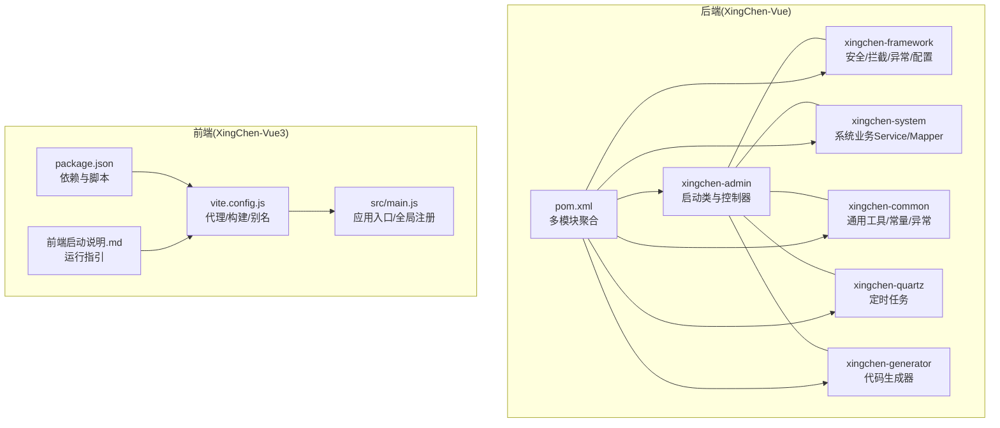
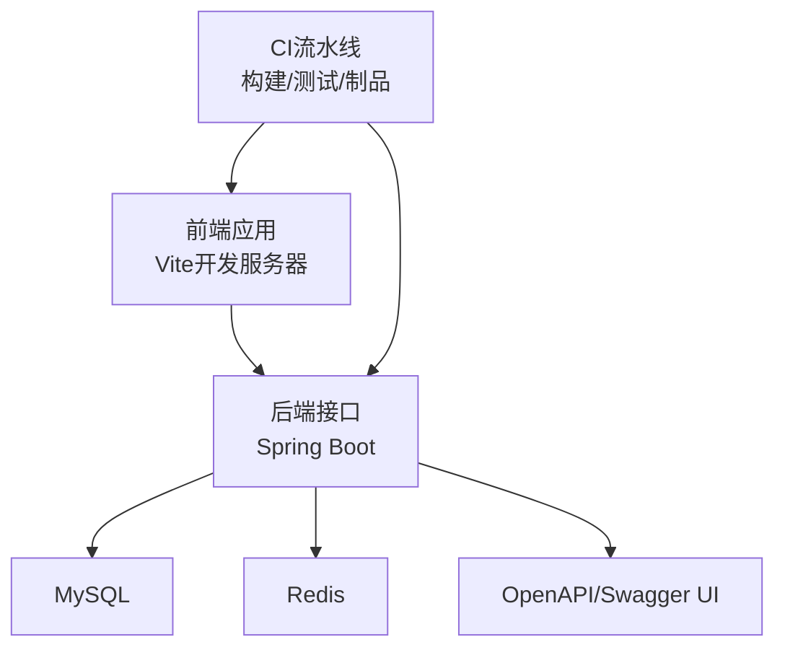
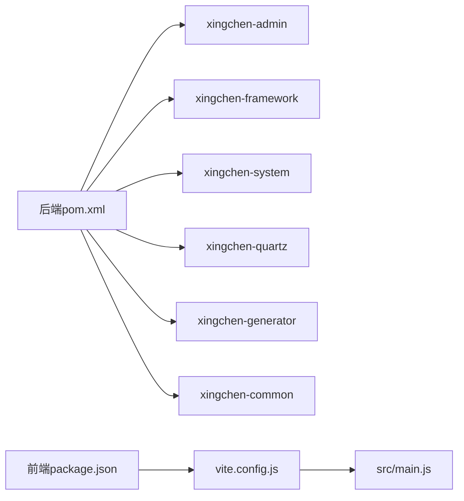

# 开发流程

<cite>
**本文引用的文件**
- [项目说明文档.md](file://项目说明文档.md)
- [XingChen-Vue/pom.xml](file://XingChen-Vue/pom.xml)
- [XingChen-Vue/.gitignore](file://XingChen-Vue/.gitignore)
- [XingChen-Vue/xingchen-admin/src/main/java/com/xingchen/XingChenApplication.java](file://XingChen-Vue/xingchen-admin/src/main/java/com/xingchen/XingChenApplication.java)
- [XingChen-Vue/xingchen-admin/src/main/resources/application.yml](file://XingChen-Vue/xingchen-admin/src/main/resources/application.yml)
- [XingChen-Vue/xingchen-admin/src/main/resources/application-druid.yml](file://XingChen-Vue/xingchen-admin/src/main/resources/application-druid.yml)
- [XingChen-Vue3/package.json](file://XingChen-Vue3/package.json)
- [XingChen-Vue3/vite.config.js](file://XingChen-Vue3/vite.config.js)
- [XingChen-Vue3/src/main.js](file://XingChen-Vue3/src/main.js)
- [XingChen-Vue3/前端启动说明.md](file://XingChen-Vue3/前端启动说明.md)
- [XingChen-Vue3/启动管理后台前端.bat](file://XingChen-Vue3/启动管理后台前端.bat)
</cite>

## 目录
1. [简介](#简介)
2. [项目结构](#项目结构)
3. [核心组件](#核心组件)
4. [架构总览](#架构总览)
5. [详细组件分析](#详细组件分析)
6. [依赖关系分析](#依赖关系分析)
7. [性能考虑](#性能考虑)
8. [故障排查指南](#故障排查指南)
9. [结论](#结论)
10. [附录](#附录)

## 简介
本文件面向“健康管理系统”的开发团队，系统化梳理从需求分析到上线发布的全流程开发方法论，覆盖需求评审、技术设计、开发实现、测试验证、代码合并与发布部署等环节；同时阐述基于仓库现状的 Git 工作流建议、持续集成配置思路、自动化测试流程与版本管理策略，并提供开发任务分配、进度跟踪与质量保证的方法与工具使用指南。

## 项目结构
项目采用前后端分离架构：
- 后端（XingChen-Vue）：基于 Spring Boot 4.0.3 的多模块 Maven 工程，包含 admin、framework、system、quartz、generator、common 等模块。
- 前端（XingChen-Vue3）：基于 Vue 3 + Vite 的 SPA 应用，使用 Element Plus、Pinia、Vue Router 等生态。

图表来源
- [XingChen-Vue/pom.xml:176-183](file://XingChen-Vue/pom.xml#L176-L183)
- [XingChen-Vue3/package.json:8-13](file://XingChen-Vue3/package.json#L8-L13)
- [XingChen-Vue3/vite.config.js:1-80](file://XingChen-Vue3/vite.config.js#L1-L80)
- [XingChen-Vue3/src/main.js:1-85](file://XingChen-Vue3/src/main.js#L1-L85)

章节来源
- [项目说明文档.md:20-46](file://项目说明文档.md#L20-L46)
- [XingChen-Vue/pom.xml:176-183](file://XingChen-Vue/pom.xml#L176-L183)
- [XingChen-Vue3/package.json:1-54](file://XingChen-Vue3/package.json#L1-L54)

## 核心组件
- 后端启动与配置
  - 启动类位于 xingchen-admin 模块，负责引导 Spring Boot 应用。
  - application.yml 提供服务器、日志、Redis、MyBatis、PageHelper、OpenAPI 等配置。
  - application-druid.yml 提供数据库连接池与监控配置。
- 前端启动与配置
  - package.json 定义开发/构建脚本与依赖。
  - vite.config.js 配置代理、构建产物、别名与开发服务器。
  - src/main.js 进行全局组件、指令、插件与 Element Plus 的注册。

章节来源
- [XingChen-Vue/xingchen-admin/src/main/java/com/xingchen/XingChenApplication.java:1-31](file://XingChen-Vue/xingchen-admin/src/main/java/com/xingchen/XingChenApplication.java#L1-L31)
- [XingChen-Vue/xingchen-admin/src/main/resources/application.yml:1-148](file://XingChen-Vue/xingchen-admin/src/main/resources/application.yml#L1-L148)
- [XingChen-Vue/xingchen-admin/src/main/resources/application-druid.yml:1-61](file://XingChen-Vue/xingchen-admin/src/main/resources/application-druid.yml#L1-L61)
- [XingChen-Vue3/package.json:8-13](file://XingChen-Vue3/package.json#L8-L13)
- [XingChen-Vue3/vite.config.js:1-80](file://XingChen-Vue3/vite.config.js#L1-L80)
- [XingChen-Vue3/src/main.js:1-85](file://XingChen-Vue3/src/main.js#L1-L85)

## 架构总览
系统采用前后端分离，后端提供 REST 接口与定时任务能力，前端通过 Vite 开发服务器与后端接口代理联调，生产环境打包后静态资源部署于 Nginx 或对象存储。

图表来源
- [XingChen-Vue3/vite.config.js:44-61](file://XingChen-Vue3/vite.config.js#L44-L61)
- [XingChen-Vue/xingchen-admin/src/main/resources/application.yml:17-148](file://XingChen-Vue/xingchen-admin/src/main/resources/application.yml#L17-L148)
- [XingChen-Vue3/package.json:8-13](file://XingChen-Vue3/package.json#L8-L13)

## 详细组件分析

### 需求分析与评审
- 输入：产品需求文档、PRD、技术方案文档。
- 输出：需求评审纪要、技术设计评审纪要、任务分解与排期。
- 关键点：
  - 明确功能边界与非功能性需求（性能、安全、可用性）。
  - 对接后端模块划分与前端页面/组件规划。
  - 评审通过后形成可追踪的任务清单。

### 技术设计
- 后端设计要点
  - 模块职责清晰：framework 负责基础设施，system 负责业务域，admin 负责对外接口，quartz/generator/common 辅助支撑。
  - 配置集中管理：application.yml 与 application-druid.yml 分离数据库与通用配置。
  - 安全与监控：启用 Spring Security/JWT、Druid 监控、OpenAPI 文档。
- 前端设计要点
  - 采用 Composition API 与 script setup，统一组件与工具函数。
  - 通过 Vite 代理对接后端接口，开发阶段提升联调效率。
  - 依赖与脚本集中在 package.json，便于 CI/CD 使用。

章节来源
- [项目说明文档.md:29-46](file://项目说明文档.md#L29-L46)
- [XingChen-Vue/pom.xml:176-183](file://XingChen-Vue/pom.xml#L176-L183)
- [XingChen-Vue/xingchen-admin/src/main/resources/application.yml:1-148](file://XingChen-Vue/xingchen-admin/src/main/resources/application.yml#L1-L148)
- [XingChen-Vue3/package.json:1-54](file://XingChen-Vue3/package.json#L1-L54)

### 开发实现
- 后端开发
  - 在对应模块添加 Controller/Service/Mapper，遵循现有包结构与命名规范。
  - 使用 OpenAPI 文档校验接口契约，确保前后端一致。
- 前端开发
  - 在 views 下新增页面，在 api 下新增接口封装，在 components 下复用或新增通用组件。
  - 通过 main.js 统一注册全局组件与指令，保持一致性。

章节来源
- [XingChen-Vue3/src/main.js:47-85](file://XingChen-Vue3/src/main.js#L47-L85)
- [XingChen-Vue/xingchen-admin/src/main/resources/application.yml:119-132](file://XingChen-Vue/xingchen-admin/src/main/resources/application.yml#L119-L132)

### 测试验证
- 单元测试与集成测试
  - 后端：在各模块内补充单元测试与接口测试，确保业务逻辑正确。
  - 前端：针对组件与工具函数编写单元测试，接口通过 mock 或联调环境验证。
- 接口测试
  - 使用 Swagger UI 或 Postman 调试接口，关注鉴权、参数校验、异常处理。
- 性能与安全
  - 使用 Druid 监控慢 SQL，关注 Redis 缓存命中率与连接池配置。
  - XSS、防盗链等安全配置按需开启。

章节来源
- [XingChen-Vue/xingchen-admin/src/main/resources/application.yml:140-148](file://XingChen-Vue/xingchen-admin/src/main/resources/application.yml#L140-L148)
- [XingChen-Vue/xingchen-admin/src/main/resources/application-druid.yml:42-61](file://XingChen-Vue/xingchen-admin/src/main/resources/application-druid.yml#L42-L61)

### 代码合并与发布
- 代码合并
  - 通过 Pull Request/Merge Request 进行代码审查，确保变更符合设计与规范。
  - 合并前完成本地测试与接口联调。
- 发布部署
  - 后端：Maven 打包后部署至服务器，配置 application.yml 与数据库连接。
  - 前端：Vite 生产构建，将 dist 静态资源部署至 Nginx 或对象存储。

章节来源
- [XingChen-Vue/xingchen-admin/src/main/resources/application.yml:1-148](file://XingChen-Vue/xingchen-admin/src/main/resources/application.yml#L1-L148)
- [XingChen-Vue3/package.json:8-13](file://XingChen-Vue3/package.json#L8-L13)

### Git 工作流与版本管理
- 分支策略
  - main/master：稳定基线，用于发布。
  - develop：日常开发分支，定期同步 main。
  - feature/<name>：功能开发分支，完成后合并至 develop。
  - hotfix/<name>：线上紧急修复分支，直接合并至 main 与 develop。
- 提交规范
  - 规范化的提交信息，便于版本回溯与变更分析。
- 冲突解决
  - 优先 rebase 保持线性历史；冲突时逐文件解决并自测。
- 版本管理
  - 版本号在后端与前端均显式配置，发布前统一更新并打 Tag。

章节来源
- [XingChen-Vue/.gitignore:1-48](file://XingChen-Vue/.gitignore#L1-L48)
- [XingChen-Vue/pom.xml:9](file://XingChen-Vue/pom.xml#L9)
- [XingChen-Vue3/package.json:3](file://XingChen-Vue3/package.json#L3)

### 持续集成与自动化测试
- 构建与测试
  - 后端：Maven 插件编译与打包，可集成测试任务。
  - 前端：Vite 构建与产物校验，可集成 Lint 与测试。
- 部署
  - 通过 CI 工具（如 GitHub Actions/GitLab CI/Jenkins）拉取代码、执行构建与测试、推送制品。
- 文档与契约
  - OpenAPI/Swagger 自动生成接口文档，作为前后端契约。

章节来源
- [XingChen-Vue/pom.xml:186-205](file://XingChen-Vue/pom.xml#L186-L205)
- [XingChen-Vue3/package.json:8-13](file://XingChen-Vue3/package.json#L8-L13)
- [XingChen-Vue/xingchen-admin/src/main/resources/application.yml:119-132](file://XingChen-Vue/xingchen-admin/src/main/resources/application.yml#L119-L132)

### 开发任务分配、进度跟踪与质量保证
- 任务分配
  - 使用看板（如 TAPD/Jira）拆解需求为任务，明确负责人与截止日期。
- 进度跟踪
  - 每日站会同步进展，每日/每周报告里程碑达成情况。
- 质量保证
  - 代码审查、单元测试覆盖率、接口测试、安全扫描与性能压测。

## 依赖关系分析
后端多模块聚合，前端通过 npm scripts 驱动开发与构建。

图表来源
- [XingChen-Vue/pom.xml:176-183](file://XingChen-Vue/pom.xml#L176-L183)
- [XingChen-Vue3/package.json:8-13](file://XingChen-Vue3/package.json#L8-L13)
- [XingChen-Vue3/vite.config.js:1-80](file://XingChen-Vue3/vite.config.js#L1-L80)
- [XingChen-Vue3/src/main.js:1-85](file://XingChen-Vue3/src/main.js#L1-L85)

章节来源
- [XingChen-Vue/pom.xml:176-183](file://XingChen-Vue/pom.xml#L176-L183)
- [XingChen-Vue3/package.json:1-54](file://XingChen-Vue3/package.json#L1-L54)

## 性能考虑
- 后端
  - 数据库连接池与慢 SQL 监控：合理配置 Druid 连接池参数，开启慢 SQL 记录。
  - 缓存策略：利用 Redis 缓存热点数据，降低数据库压力。
  - 分页与序列化：PageHelper 分页与 Jackson 时间格式优化减少传输体积。
- 前端
  - 构建产物优化：按需引入组件、拆分代码块、压缩资源。
  - 代理与跨域：开发期通过 Vite 代理避免跨域问题，生产环境统一域名。

章节来源
- [XingChen-Vue/xingchen-admin/src/main/resources/application-druid.yml:19-61](file://XingChen-Vue/xingchen-admin/src/main/resources/application-druid.yml#L19-L61)
- [XingChen-Vue/xingchen-admin/src/main/resources/application.yml:104-118](file://XingChen-Vue/xingchen-admin/src/main/resources/application.yml#L104-L118)
- [XingChen-Vue3/vite.config.js:29-42](file://XingChen-Vue3/vite.config.js#L29-L42)

## 故障排查指南
- 启动失败
  - 后端：检查数据库与 Redis 是否启动，确认 application.yml 与 application-druid.yml 中的连接参数。
  - 前端：确认 Node.js 版本与依赖安装，查看 Vite 代理配置与端口占用。
- 接口异常
  - 使用 Swagger UI 校验请求参数与鉴权头，关注后端日志级别与异常处理。
- 性能问题
  - 通过 Druid 控制台查看慢 SQL 与连接池状态，定位瓶颈。

章节来源
- [XingChen-Vue/xingchen-admin/src/main/resources/application.yml:1-148](file://XingChen-Vue/xingchen-admin/src/main/resources/application.yml#L1-L148)
- [XingChen-Vue/xingchen-admin/src/main/resources/application-druid.yml:1-61](file://XingChen-Vue/xingchen-admin/src/main/resources/application-druid.yml#L1-L61)
- [XingChen-Vue3/vite.config.js:44-61](file://XingChen-Vue3/vite.config.js#L44-L61)

## 结论
本开发流程以模块化、规范化与自动化为核心，结合前后端分离架构与现有配置，形成可落地的端到端交付路径。建议在实际执行中进一步完善 CI/CD、测试覆盖率与监控告警体系，持续迭代提升交付质量与效率。

## 附录
- 本地运行参考
  - 后端：启动 XingChenApplication，确认端口与数据库连接。
  - 前端：安装依赖后运行开发脚本，访问本地地址。
- 常用脚本
  - 后端：Maven 编译与打包。
  - 前端：dev/build:prod/build:stage/preview。

章节来源
- [XingChen-Vue/xingchen-admin/src/main/java/com/xingchen/XingChenApplication.java:15-18](file://XingChen-Vue/xingchen-admin/src/main/java/com/xingchen/XingChenApplication.java#L15-L18)
- [XingChen-Vue3/前端启动说明.md:1-110](file://XingChen-Vue3/前端启动说明.md#L1-L110)
- [XingChen-Vue3/启动管理后台前端.bat](file://XingChen-Vue3/启动管理后台前端.bat)
- [XingChen-Vue3/package.json:8-13](file://XingChen-Vue3/package.json#L8-L13)