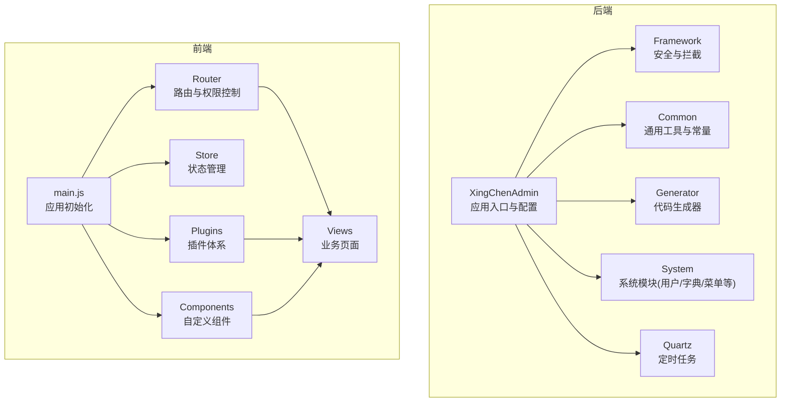
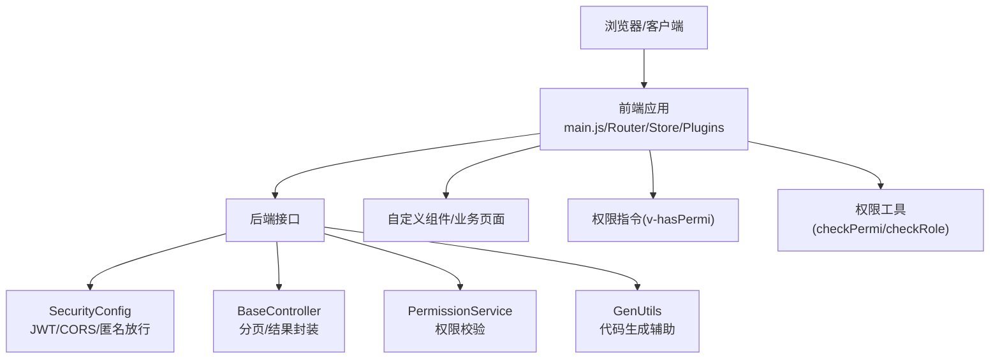
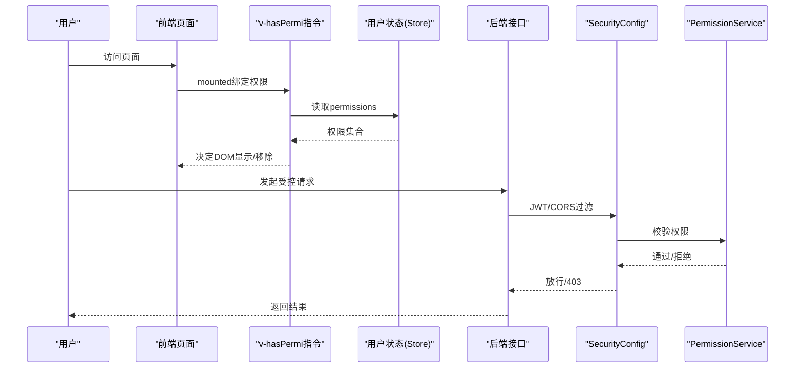
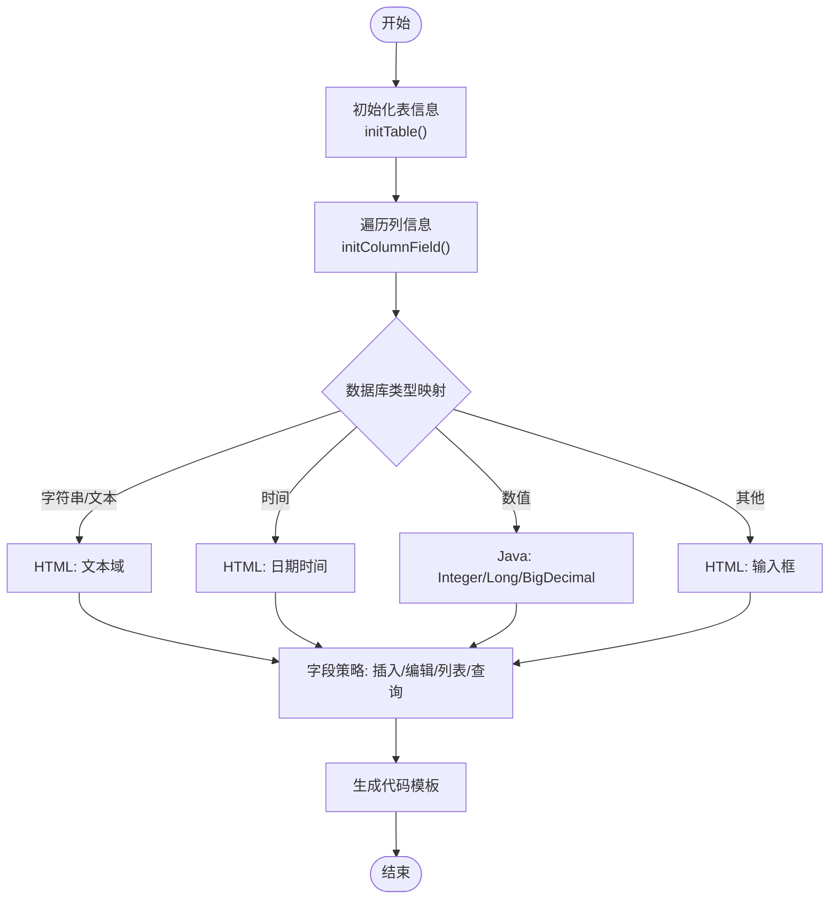
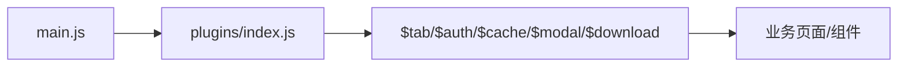
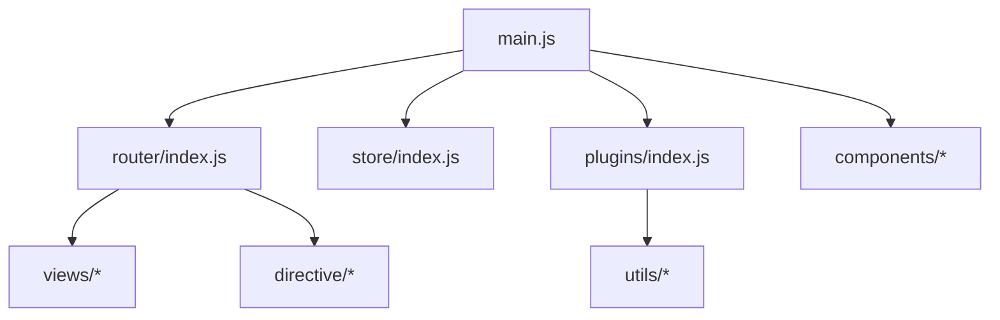

# 扩展开发

<cite>
**本文引用的文件**
- [application.yml](file://XingChen-Vue/xingchen-admin/src/main/resources/application.yml)
- [main.js](file://XingChen-Vue3/src/main.js)
- [index.js](file://XingChen-Vue3/src/router/index.js)
- [index.js](file://XingChen-Vue3/src/store/index.js)
- [SecurityConfig.java](file://XingChen-Vue/xingchen-framework/src/main/java/com/xingchen/framework/config/SecurityConfig.java)
- [PermissionService.java](file://XingChen-Vue/xingchen-framework/src/main/java/com/xingchen/framework/web/service/PermissionService.java)
- [BaseController.java](file://XingChen-Vue/xingchen-common/src/main/java/com/xingchen/common/core/controller/BaseController.java)
- [GenUtils.java](file://XingChen-Vue/xingchen-generator/src/main/java/com/xingchen/generator/util/GenUtils.java)
- [permission.js](file://XingChen-Vue3/src/utils/permission.js)
- [hasPermi.js](file://XingChen-Vue3/src/directive/permission/hasPermi.js)
- [index.js](file://XingChen-Vue3/src/plugins/index.js)
- [vite.config.js](file://XingChen-Vue3/vite.config.js)
- [DailyHealthCheckIn.vue](file://XingChen-Vue3/src/components/DailyHealthCheckIn.vue)
- [index.vue](file://XingChen-Vue3/src/views/system/user/index.vue)
</cite>

## 目录
1. [简介](#简介)
2. [项目结构](#项目结构)
3. [核心组件](#核心组件)
4. [架构总览](#架构总览)
5. [详细组件分析](#详细组件分析)
6. [依赖关系分析](#依赖关系分析)
7. [性能考虑](#性能考虑)
8. [故障排查指南](#故障排查指南)
9. [结论](#结论)
10. [附录](#附录)

## 简介
本指南面向希望在现有健康管理系统基础上进行扩展开发的工程师，覆盖新模块开发、插件机制、自定义组件开发、API 扩展、权限系统扩展、UI 组件定制、代码生成器使用、扩展点识别与最佳实践等内容。文档同时提供可视化架构图与流程图，帮助快速定位扩展点并安全地进行二次开发。

## 项目结构
项目采用前后端分离架构：
- 后端（Spring Boot）：统一入口、配置、安全、权限、通用控制器、代码生成器、定时任务等模块化组织。
- 前端（Vue3 + Vite）：路由、状态管理、权限指令、插件体系、组件库与业务页面。

图表来源
- [main.js:1-85](file://XingChen-Vue3/src/main.js#L1-L85)
- [index.js:1-197](file://XingChen-Vue3/src/router/index.js#L1-L197)
- [index.js:1-4](file://XingChen-Vue3/src/store/index.js#L1-L4)
- [SecurityConfig.java:1-129](file://XingChen-Vue/xingchen-framework/src/main/java/com/xingchen/framework/config/SecurityConfig.java#L1-L129)
- [BaseController.java:1-203](file://XingChen-Vue/xingchen-common/src/main/java/com/xingchen/common/core/controller/BaseController.java#L1-L203)

章节来源
- [main.js:1-85](file://XingChen-Vue3/src/main.js#L1-L85)
- [index.js:1-197](file://XingChen-Vue3/src/router/index.js#L1-L197)
- [index.js:1-4](file://XingChen-Vue3/src/store/index.js#L1-L4)
- [application.yml:1-148](file://XingChen-Vue/xingchen-admin/src/main/resources/application.yml#L1-L148)

## 核心组件
- 后端配置与安全
  - 应用配置集中于后端配置文件，涵盖端口、日志、文件上传、MyBatis、分页、Swagger、XSS、防盗链等。
  - 安全配置通过 Spring Security 实现，支持 JWT 过滤器、跨域过滤器、匿名放行 URL 等。
- 前端初始化与插件
  - 应用入口注册全局组件、指令、插件与 Element Plus；路由与权限控制贯穿页面生命周期。
  - 插件体系提供统一的全局能力（页签、认证、缓存、模态框、下载）。
- 通用控制器与权限服务
  - 通用控制器封装分页、结果集、登录用户信息获取等。
  - 权限服务提供基于权限字符串与角色的校验能力，支持前后端一致的权限判定。
- 代码生成器
  - 通过配置与模板生成 Java/JS/Vue/SQL 等代码骨架，支持字段类型推断、HTML 控件映射、查询条件与列表字段策略等。

章节来源
- [application.yml:1-148](file://XingChen-Vue/xingchen-admin/src/main/resources/application.yml#L1-L148)
- [SecurityConfig.java:1-129](file://XingChen-Vue/xingchen-framework/src/main/java/com/xingchen/framework/config/SecurityConfig.java#L1-L129)
- [BaseController.java:1-203](file://XingChen-Vue/xingchen-common/src/main/java/com/xingchen/common/core/controller/BaseController.java#L1-L203)
- [PermissionService.java:1-160](file://XingChen-Vue/xingchen-framework/src/main/java/com/xingchen/framework/web/service/PermissionService.java#L1-L160)
- [GenUtils.java:1-258](file://XingChen-Vue/xingchen-generator/src/main/java/com/xingchen/generator/util/GenUtils.java#L1-L258)
- [main.js:1-85](file://XingChen-Vue3/src/main.js#L1-L85)
- [index.js:1-19](file://XingChen-Vue3/src/plugins/index.js#L1-L19)

## 架构总览
后端通过安全配置与权限服务实现统一鉴权，前端通过路由守卫与指令实现页面级权限控制，插件体系提供可复用的 UI 能力，代码生成器加速业务模块落地。

图表来源
- [SecurityConfig.java:85-118](file://XingChen-Vue/xingchen-framework/src/main/java/com/xingchen/framework/config/SecurityConfig.java#L85-L118)
- [BaseController.java:50-91](file://XingChen-Vue/xingchen-common/src/main/java/com/xingchen/common/core/controller/BaseController.java#L50-L91)
- [PermissionService.java:27-80](file://XingChen-Vue/xingchen-framework/src/main/java/com/xingchen/framework/web/service/PermissionService.java#L27-L80)
- [GenUtils.java:21-30](file://XingChen-Vue/xingchen-generator/src/main/java/com/xingchen/generator/util/GenUtils.java#L21-L30)
- [main.js:47-82](file://XingChen-Vue3/src/main.js#L47-L82)
- [permission.js:8-26](file://XingChen-Vue3/src/utils/permission.js#L8-L26)
- [hasPermi.js:8-26](file://XingChen-Vue3/src/directive/permission/hasPermi.js#L8-L26)

## 详细组件分析

### 安全与权限体系
- 后端安全配置
  - 禁用 CSRF，基于无状态 Session 策略，异常处理、登出、JWT 过滤器与 CORS 过滤器按序装配。
  - 支持匿名放行的 URL 由配置注入，便于开放接口与静态资源。
- 权限服务
  - 提供 hasPermi/lacksPermi/hasAnyPermi 与 hasRole/lacksRole/hasAnyRoles 等方法，内部结合上下文与用户权限集合判断。
- 前端权限控制
  - 权限工具函数用于校验权限字符串数组与角色数组；指令 v-hasPermi 在挂载阶段根据用户权限决定元素可见性。
  - 路由 meta.permissions 与动态路由配合，实现菜单级权限控制。

图表来源
- [SecurityConfig.java:85-118](file://XingChen-Vue/xingchen-framework/src/main/java/com/xingchen/framework/config/SecurityConfig.java#L85-L118)
- [PermissionService.java:27-80](file://XingChen-Vue/xingchen-framework/src/main/java/com/xingchen/framework/web/service/PermissionService.java#L27-L80)
- [permission.js:8-26](file://XingChen-Vue3/src/utils/permission.js#L8-L26)
- [hasPermi.js:8-26](file://XingChen-Vue3/src/directive/permission/hasPermi.js#L8-L26)

章节来源
- [SecurityConfig.java:1-129](file://XingChen-Vue/xingchen-framework/src/main/java/com/xingchen/framework/config/SecurityConfig.java#L1-L129)
- [PermissionService.java:1-160](file://XingChen-Vue/xingchen-framework/src/main/java/com/xingchen/framework/web/service/PermissionService.java#L1-L160)
- [permission.js:1-51](file://XingChen-Vue3/src/utils/permission.js#L1-L51)
- [hasPermi.js:1-28](file://XingChen-Vue3/src/directive/permission/hasPermi.js#L1-L28)

### 代码生成器使用
- 初始化与字段映射
  - 初始化表信息（类名、包名、模块名、业务名、作者、创建人等），并根据数据库列类型推断 Java 类型、HTML 控件类型、查询类型与列表/编辑/查询字段策略。
- 生成流程要点
  - 通过配置文件与模板目录生成后端实体、Mapper、Service、Controller 以及前端 JS/Vue/TS/Vuex/路由等代码骨架。
  - 生成后建议在业务层补充校验、国际化、异常处理与日志记录。

图表来源
- [GenUtils.java:21-131](file://XingChen-Vue/xingchen-generator/src/main/java/com/xingchen/generator/util/GenUtils.java#L21-L131)

章节来源
- [GenUtils.java:1-258](file://XingChen-Vue/xingchen-generator/src/main/java/com/xingchen/generator/util/GenUtils.java#L1-L258)

### 插件机制与扩展点
- 插件注册
  - 在应用入口集中注册插件，暴露到全局属性，便于各组件调用统一能力（页签、认证、缓存、模态框、下载）。
- 扩展建议
  - 新功能模块优先以插件形式封装，遵循单一职责；通过配置开关与命名空间隔离不同插件。
  - 插件内部可依赖 Store、Router、API 层，避免直接耦合具体页面。

图表来源
- [main.js:47-82](file://XingChen-Vue3/src/main.js#L47-L82)
- [index.js:1-19](file://XingChen-Vue3/src/plugins/index.js#L1-L19)

章节来源
- [main.js:1-85](file://XingChen-Vue3/src/main.js#L1-L85)
- [index.js:1-19](file://XingChen-Vue3/src/plugins/index.js#L1-L19)

### 自定义组件开发
- 组件示例
  - 日常健康打卡组件演示了渐进式进度、选项交互、即时反馈与动画过渡，适合作为新功能组件的参考模板。
- 开发规范
  - 使用组合式 API（<script setup>）组织逻辑；通过 props 与 emits 解耦；使用 scoped 样式避免污染。
  - 组件对外暴露明确的交互契约（事件/属性），并在文档注释中说明用途与参数。

章节来源
- [DailyHealthCheckIn.vue:1-281](file://XingChen-Vue3/src/components/DailyHealthCheckIn.vue#L1-L281)

### API 扩展与通用控制器
- 通用控制器
  - 提供分页启动/清理、排序注入、统一 AjaxResult 与 TableDataInfo 返回封装，简化业务层样板代码。
- 扩展建议
  - 新模块继承通用控制器，复用分页与结果封装；对敏感字段与 SQL 注入进行统一校验与转义。

章节来源
- [BaseController.java:1-203](file://XingChen-Vue/xingchen-common/src/main/java/com/xingchen/common/core/controller/BaseController.java#L1-L203)

### 路由与动态权限
- 路由配置
  - 常量路由与动态路由分离；动态路由通过 permissions 字段声明菜单级权限；meta 中可配置 keep-alive、图标、面包屑等。
- 权限联动
  - 页面通过 v-hasPermi 指令与 checkPermi 函数进行细粒度按钮/操作权限控制；路由层面确保菜单可见性。

章节来源
- [index.js:1-197](file://XingChen-Vue3/src/router/index.js#L1-L197)
- [permission.js:1-51](file://XingChen-Vue3/src/utils/permission.js#L1-L51)
- [hasPermi.js:1-28](file://XingChen-Vue3/src/directive/permission/hasPermi.js#L1-L28)

### 配置文件扩展与第三方集成
- 后端配置
  - application.yml 集中管理项目、服务器、日志、用户、Spring、MyBatis、分页、Swagger、XSS、防盗链等配置；新增模块可通过新增配置项或引入新模块配置文件扩展。
- 前端代理与构建
  - vite.config.js 提供代理与构建输出配置，便于对接后端接口与打包优化；可按需新增插件与别名。

章节来源
- [application.yml:1-148](file://XingChen-Vue/xingchen-admin/src/main/resources/application.yml#L1-L148)
- [vite.config.js:1-80](file://XingChen-Vue3/vite.config.js#L1-L80)

## 依赖关系分析
- 前端依赖
  - main.js 依赖路由、状态、插件、指令与全局组件；路由依赖动态权限；插件依赖统一工具与 API。
- 后端依赖
  - 应用入口依赖框架模块；框架模块依赖安全配置与权限服务；通用模块被各业务模块复用。

图表来源
- [main.js:1-85](file://XingChen-Vue3/src/main.js#L1-L85)
- [index.js:1-197](file://XingChen-Vue3/src/router/index.js#L1-L197)
- [index.js:1-4](file://XingChen-Vue3/src/store/index.js#L1-L4)
- [index.js:1-19](file://XingChen-Vue3/src/plugins/index.js#L1-L19)

章节来源
- [main.js:1-85](file://XingChen-Vue3/src/main.js#L1-L85)
- [index.js:1-197](file://XingChen-Vue3/src/router/index.js#L1-L197)
- [index.js:1-4](file://XingChen-Vue3/src/store/index.js#L1-L4)
- [index.js:1-19](file://XingChen-Vue3/src/plugins/index.js#L1-L19)

## 性能考虑
- 前端
  - 合理使用 keep-alive 与路由懒加载；组件按需引入与拆分；构建时开启压缩与分包；避免大体积第三方库。
- 后端
  - 合理设置分页参数与排序字段；对热点数据使用缓存；避免 N+1 查询；接口幂等与限流策略。
- 代码生成器
  - 生成代码后及时清理冗余字段与未使用模板；统一校验与日志，减少运行期开销。

## 故障排查指南
- 登录与权限
  - 检查 SecurityConfig 中匿名放行 URL 与 JWT 过滤器顺序；确认前端请求头携带令牌；核对后端权限服务返回的权限集合。
- 前端权限无效
  - 检查 v-hasPermi 指令使用是否正确；确认用户状态中 permissions 是否为空；检查路由 meta.permissions 与 checkPermi 参数。
- 生成代码不符合预期
  - 校验数据库列类型与注释；确认 GenUtils 中字段映射规则与生成策略；核对模板目录与生成配置。
- 构建与代理
  - 检查 vite.config.js 代理目标与路径重写；确认 base 与输出目录配置；查看浏览器网络面板与控制台错误。

章节来源
- [SecurityConfig.java:85-118](file://XingChen-Vue/xingchen-framework/src/main/java/com/xingchen/framework/config/SecurityConfig.java#L85-L118)
- [permission.js:1-51](file://XingChen-Vue3/src/utils/permission.js#L1-L51)
- [hasPermi.js:1-28](file://XingChen-Vue3/src/directive/permission/hasPermi.js#L1-L28)
- [GenUtils.java:1-258](file://XingChen-Vue/xingchen-generator/src/main/java/com/xingchen/generator/util/GenUtils.java#L1-L258)
- [vite.config.js:1-80](file://XingChen-Vue3/vite.config.js#L1-L80)

## 结论
通过识别后端安全与权限、前端路由与指令、插件体系与通用控制器等扩展点，开发者可以在不破坏现有架构的前提下，快速扩展新模块、自定义组件与 API。建议遵循“插件化优先、权限统一、配置集中、模板驱动”的原则，结合代码生成器与统一工具，提升开发效率与一致性。

## 附录

### 新功能开发模板与规范
- 后端模块
  - 创建 Mapper/Domain/Service/Controller，并在通用控制器中复用分页与结果封装。
  - 在安全配置中新增匿名放行 URL 或受控接口；在权限服务中补充权限字符串。
- 前端模块
  - 在路由中新增常量/动态路由与权限；在 views 中创建页面；在 components 中沉淀可复用组件；通过插件体系提供统一能力。
  - 使用 v-hasPermi 指令与 checkPermi 函数进行细粒度权限控制。
- 代码生成器
  - 在生成后补充业务校验、国际化与日志；核对字段映射与模板策略。

章节来源
- [BaseController.java:50-91](file://XingChen-Vue/xingchen-common/src/main/java/com/xingchen/common/core/controller/BaseController.java#L50-L91)
- [SecurityConfig.java:85-118](file://XingChen-Vue/xingchen-framework/src/main/java/com/xingchen/framework/config/SecurityConfig.java#L85-L118)
- [permission.js:1-51](file://XingChen-Vue3/src/utils/permission.js#L1-L51)
- [hasPermi.js:1-28](file://XingChen-Vue3/src/directive/permission/hasPermi.js#L1-L28)
- [GenUtils.java:21-131](file://XingChen-Vue/xingchen-generator/src/main/java/com/xingchen/generator/util/GenUtils.java#L21-L131)
- [index.vue:1-455](file://XingChen-Vue3/src/views/system/user/index.vue#L1-L455)