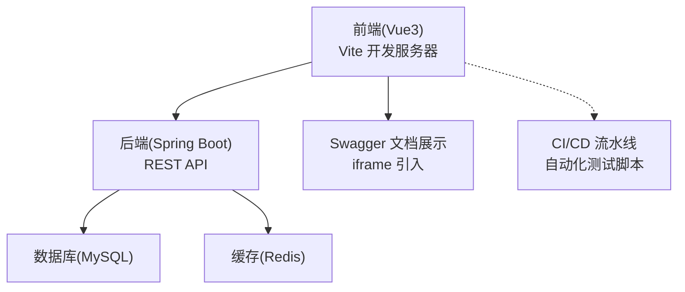
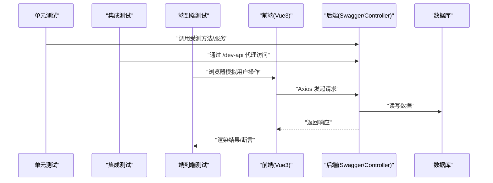
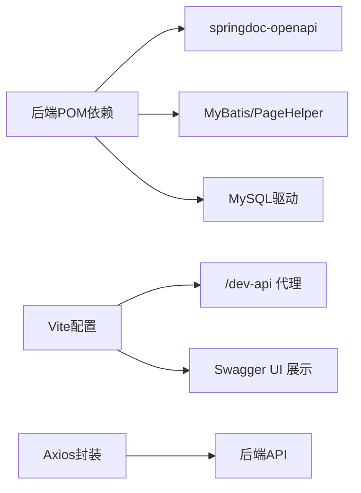

# 测试策略

<cite>
**本文引用的文件**
- [XingChen-Vue/xingchen-admin/pom.xml](file://XingChen-Vue/xingchen-admin/pom.xml)
- [XingChen-Vue/xingchen-admin/src/main/resources/application.yml](file://XingChen-Vue/xingchen-admin/src/main/resources/application.yml)
- [XingChen-Vue/xingchen-admin/src/main/java/com/xingchen/web/controller/tool/TestController.java](file://XingChen-Vue/xingchen-admin/src/main/java/com/xingchen/web/controller/tool/TestController.java)
- [XingChen-Vue/xingchen-ui-user/vite.config.js](file://XingChen-Vue/xingchen-ui-user/vite.config.js)
- [XingChen-Vue3/vite.config.js](file://XingChen-Vue3/vite.config.js)
- [XingChen-Vue3/src/utils/request.js](file://XingChen-Vue3/src/utils/request.js)
- [XingChen-Vue3/src/views/tool/swagger/index.vue](file://XingChen-Vue3/src/views/tool/swagger/index.vue)
- [XingChen-Vue3/.gitignore](file://XingChen-Vue3/.gitignore)
</cite>

## 目录
1. [简介](#简介)
2. [项目结构](#项目结构)
3. [核心组件](#核心组件)
4. [架构总览](#架构总览)
5. [详细组件分析](#详细组件分析)
6. [依赖分析](#依赖分析)
7. [性能考虑](#性能考虑)
8. [故障排查指南](#故障排查指南)
9. [结论](#结论)
10. [附录](#附录)

## 简介
本测试策略文档面向健康管理系统（前后端分离）的整体质量保障，覆盖单元测试、集成测试与端到端测试的实施策略与最佳实践。重点包括：
- Java 后端：基于 Spring Boot 的控制器与服务层测试思路、Mockito 使用建议、异常与边界场景覆盖。
- Vue3 前端：组件测试、API 测试、用户交互测试与自动化脚本编写。
- 测试数据准备、测试环境配置、覆盖率目标与回归策略。

## 项目结构
项目采用前后端分离架构：
- 后端：Spring Boot Web 服务，提供 REST API；通过 OpenAPI/Swagger 提供接口文档能力。
- 前端：Vue3 + Element Plus，通过 Axios 发起请求，Vite 作为构建与开发服务器；Swagger 文档通过 iframe 展示。

图表来源
- [XingChen-Vue/xingchen-admin/src/main/resources/application.yml:17-148](file://XingChen-Vue/xingchen-admin/src/main/resources/application.yml#L17-L148)
- [XingChen-Vue3/vite.config.js:44-61](file://XingChen-Vue3/vite.config.js#L44-L61)
- [XingChen-Vue3/src/views/tool/swagger/index.vue:1-9](file://XingChen-Vue3/src/views/tool/swagger/index.vue#L1-L9)

章节来源
- [XingChen-Vue/xingchen-admin/pom.xml:18-57](file://XingChen-Vue/xingchen-admin/pom.xml#L18-L57)
- [XingChen-Vue/xingchen-admin/src/main/resources/application.yml:1-148](file://XingChen-Vue/xingchen-admin/src/main/resources/application.yml#L1-L148)
- [XingChen-Vue3/vite.config.js:1-80](file://XingChen-Vue3/vite.config.js#L1-L80)
- [XingChen-Vue3/src/views/tool/swagger/index.vue:1-9](file://XingChen-Vue3/src/views/tool/swagger/index.vue#L1-L9)

## 核心组件
- 后端控制器样例：提供用户增删改查的 REST 接口，便于演示测试用例设计与断言点。
- Swagger/OpenAPI：后端通过 springdoc 配置暴露接口文档，前端通过 iframe 展示。
- 前端请求封装：Axios 封装统一拦截器、错误处理、重复提交防护与下载能力。
- Vite 开发代理：前端开发时通过代理将 /dev-api 请求转发至后端，便于联调。

章节来源
- [XingChen-Vue/xingchen-admin/src/main/java/com/xingchen/web/controller/tool/TestController.java:22-106](file://XingChen-Vue/xingchen-admin/src/main/java/com/xingchen/web/controller/tool/TestController.java#L22-L106)
- [XingChen-Vue/xingchen-admin/src/main/resources/application.yml:119-131](file://XingChen-Vue/xingchen-admin/src/main/resources/application.yml#L119-L131)
- [XingChen-Vue3/src/utils/request.js:1-154](file://XingChen-Vue3/src/utils/request.js#L1-L154)
- [XingChen-Vue3/vite.config.js:44-61](file://XingChen-Vue3/vite.config.js#L44-L61)

## 架构总览
下图展示了测试视角下的系统交互关系，强调测试数据流与断言点：

图表来源
- [XingChen-Vue3/vite.config.js:48-60](file://XingChen-Vue3/vite.config.js#L48-L60)
- [XingChen-Vue3/src/utils/request.js:16-21](file://XingChen-Vue3/src/utils/request.js#L16-L21)
- [XingChen-Vue/xingchen-admin/src/main/resources/application.yml:119-131](file://XingChen-Vue/xingchen-admin/src/main/resources/application.yml#L119-L131)

## 详细组件分析

### 后端控制器测试策略（JUnit + Mockito）
- 测试目标
  - 验证控制器对不同 HTTP 方法与路径的正确响应。
  - 验证参数校验、空值处理与业务异常分支。
  - 验证返回结构符合统一返回体约定。
- 关键断言点
  - 状态码与响应体字段存在性。
  - 统一返回体的 code/msg/data 结构。
- 推荐用例设计
  - 正常路径：查询列表、按 ID 查询、新增、更新、删除。
  - 边界与异常：空参数、非法 ID、重复 ID、不存在的 ID。
- Mocking 建议
  - 对 Service 层进行 Mock，隔离持久层与外部依赖。
  - 使用 @WebMvcTest 或 @Import 仅加载控制器层以提升执行效率。
- 断言与覆盖率
  - 覆盖所有分支与异常路径，目标行覆盖率≥80%，分支覆盖率≥70%。

章节来源
- [XingChen-Vue/xingchen-admin/src/main/java/com/xingchen/web/controller/tool/TestController.java:38-105](file://XingChen-Vue/xingchen-admin/src/main/java/com/xingchen/web/controller/tool/TestController.java#L38-L105)

### 后端服务层测试策略（JUnit + Mockito）
- 测试目标
  - 验证业务逻辑正确性与边界条件处理。
  - 验证事务、缓存、定时任务等横切关注点的行为。
- 推荐用例设计
  - 正常业务流程、幂等性、并发安全。
  - 异常场景：参数不合法、权限不足、资源冲突。
- Mocking 建议
  - Mock Mapper/Repository 与第三方服务，确保测试稳定。
  - 使用 @DataJpaTest 或 @Import 仅加载服务层上下文。
- 断言与覆盖率
  - 覆盖核心业务分支，目标行覆盖率≥85%，分支覆盖率≥75%。

章节来源
- [XingChen-Vue/xingchen-admin/pom.xml:62-98](file://XingChen-Vue/xingchen-admin/pom.xml#L62-L98)

### 前端组件测试策略（Vue3 + Vitest/Jest）
- 测试目标
  - 组件渲染、属性传入、事件触发与状态变更。
  - 表单校验、按钮禁用/启用、提示文案。
- 推荐用例设计
  - 正常渲染、空态、错误态、加载态。
  - 用户输入、点击、键盘事件、路由跳转。
- 工具与技巧
  - 使用 Vue Test Utils 或 Vitest + @vue/test-utils。
  - 对 API 调用进行拦截，返回固定数据或错误。
- 断言与覆盖率
  - 覆盖主要交互路径，目标行覆盖率≥80%，分支覆盖率≥70%。

章节来源
- [XingChen-Vue3/src/utils/request.js:16-21](file://XingChen-Vue3/src/utils/request.js#L16-L21)

### 前端 API 测试策略（Axios 封装 + 测试）
- 测试目标
  - 验证请求拦截器、响应拦截器、错误处理与下载功能。
  - 验证重复提交防护、Token 注入、超时与网络异常处理。
- 推荐用例设计
  - 成功响应、401 登录过期、500 服务器错误、601 业务警告。
  - 下载 Blob、超时、网络异常。
- 断言与覆盖率
  - 覆盖所有错误分支与拦截器逻辑，目标行覆盖率≥85%。

章节来源
- [XingChen-Vue3/src/utils/request.js:23-124](file://XingChen-Vue3/src/utils/request.js#L23-L124)

### 前端用户交互测试策略（E2E）
- 测试目标
  - 端到端验证用户从登录到完成关键业务流程的路径。
  - 验证页面跳转、表单提交、列表查询、详情查看等。
- 推荐用例设计
  - 登录 → 导航 → 列表查询 → 新增/编辑 → 删除 → 退出。
  - 权限控制：无权限访问的页面与按钮禁用。
- 工具与技巧
  - 使用 Cypress/Puppeteer 等工具，结合 Vite 开发服务器。
  - 通过 /dev-api 代理与后端联调，确保真实环境一致性。
- 断言与覆盖率
  - 覆盖关键业务路径，目标场景覆盖率≥90%。

章节来源
- [XingChen-Vue3/vite.config.js:48-60](file://XingChen-Vue3/vite.config.js#L48-L60)
- [XingChen-Vue/xingchen-ui-user/vite.config.js:17-23](file://XingChen-Vue/xingchen-ui-user/vite.config.js#L17-L23)

### Swagger 文档与接口测试
- 测试目标
  - 通过 Swagger UI 快速验证接口可用性与返回结构。
  - 在集成测试阶段自动拉取 OpenAPI 规范进行契约测试。
- 实施要点
  - 后端开启 springdoc 并限定扫描包与路径。
  - 前端通过 iframe 展示 Swagger 页面，便于手工测试。
- 断言与覆盖率
  - 所有分组接口均需通过 Swagger 验证，目标通过率100%。

章节来源
- [XingChen-Vue/xingchen-admin/src/main/resources/application.yml:119-131](file://XingChen-Vue/xingchen-admin/src/main/resources/application.yml#L119-L131)
- [XingChen-Vue3/src/views/tool/swagger/index.vue:1-9](file://XingChen-Vue3/src/views/tool/swagger/index.vue#L1-L9)

## 依赖分析
- 后端依赖
  - springdoc-openapi：提供 OpenAPI/Swagger 能力。
  - mybatis-spring-boot-starter、PageHelper：数据访问与分页。
  - MySQL 驱动：数据库连接。
- 前端依赖
  - axios：HTTP 客户端。
  - element-plus：UI 组件库。
  - vite：开发与构建工具。
- 代理与文档
  - 前端通过 /dev-api 代理转发至后端，便于本地联调。
  - Swagger 文档通过 iframe 展示，便于手工验证。

图表来源
- [XingChen-Vue/xingchen-admin/pom.xml:18-57](file://XingChen-Vue/xingchen-admin/pom.xml#L18-L57)
- [XingChen-Vue3/vite.config.js:48-60](file://XingChen-Vue3/vite.config.js#L48-L60)
- [XingChen-Vue3/src/views/tool/swagger/index.vue:1-9](file://XingChen-Vue3/src/views/tool/swagger/index.vue#L1-L9)

章节来源
- [XingChen-Vue/xingchen-admin/pom.xml:18-57](file://XingChen-Vue/xingchen-admin/pom.xml#L18-L57)
- [XingChen-Vue3/vite.config.js:1-80](file://XingChen-Vue3/vite.config.js#L1-L80)

## 性能考虑
- 控制器层测试
  - 优先使用轻量级上下文加载，避免全量启动。
  - 对耗时操作（如远程调用）进行 Mock。
- 前端测试
  - 使用内存数据与静态资源，减少网络请求。
  - 合理拆分测试文件，缩短执行时间。
- 集成与 E2E
  - 使用独立测试数据库快照或内存数据库（如 H2）。
  - 并行执行不相互依赖的测试套件。

## 故障排查指南
- 常见问题
  - 前端无法访问后端接口：检查 /dev-api 代理配置与后端端口。
  - Swagger 文档无法打开：确认后端 springdoc 配置与路径匹配。
  - Axios 请求失败：检查拦截器中的 Token 注入、重复提交防护与错误处理。
- 排查步骤
  - 启用后端日志级别，观察请求链路。
  - 在浏览器 Network 面板检查代理转发与响应状态。
  - 在 Swagger 中手动构造请求，定位接口问题。

章节来源
- [XingChen-Vue3/vite.config.js:48-60](file://XingChen-Vue3/vite.config.js#L48-L60)
- [XingChen-Vue/xingchen-admin/src/main/resources/application.yml:119-131](file://XingChen-Vue/xingchen-admin/src/main/resources/application.yml#L119-L131)
- [XingChen-Vue3/src/utils/request.js:23-124](file://XingChen-Vue3/src/utils/request.js#L23-L124)

## 结论
本测试策略围绕“单元测试打地基、集成测试保稳定、端到端测试验闭环”的三层测试金字塔展开，结合后端 OpenAPI 与前端代理机制，形成可落地的质量保障方案。建议在持续集成中引入自动化测试脚本，并设定明确的覆盖率门槛与回归策略，确保版本演进过程中的稳定性与可维护性。

## 附录

### 测试数据准备
- 后端
  - 初始化测试数据：用户、角色、菜单等基础数据。
  - 使用测试专用数据库或内存数据库（如 H2），保证可重复性。
- 前端
  - 准备 Mock 数据与错误场景数据，覆盖正常与异常路径。
  - 使用静态资源与本地代理，避免真实依赖。

章节来源
- [XingChen-Vue/xingchen-admin/src/main/java/com/xingchen/web/controller/tool/TestController.java:32-36](file://XingChen-Vue/xingchen-admin/src/main/java/com/xingchen/web/controller/tool/TestController.java#L32-L36)

### 测试环境配置
- 后端
  - application.yml 中配置 Swagger、Redis、MyBatis、分页等参数。
  - 开发端口与上下文路径按需调整。
- 前端
  - Vite 代理配置指向后端地址。
  - 环境变量 VITE_APP_BASE_API 指向后端 API 基础路径。

章节来源
- [XingChen-Vue/xingchen-admin/src/main/resources/application.yml:17-148](file://XingChen-Vue/xingchen-admin/src/main/resources/application.yml#L17-L148)
- [XingChen-Vue3/vite.config.js:48-60](file://XingChen-Vue3/vite.config.js#L48-L60)
- [XingChen-Vue/xingchen-ui-user/vite.config.js:17-23](file://XingChen-Vue/xingchen-ui-user/vite.config.js#L17-L23)

### 自动化测试脚本编写
- 前端
  - 使用 Vitest/Jest 编写组件与 API 测试，Cypress/Puppeteer 编写 E2E。
  - 在 CI 中执行 npm run test 与 npm run build，结合覆盖率上报。
- 后端
  - 使用 Maven 插件执行测试，生成覆盖率报告（JaCoCo）。
  - 在 CI 中执行 mvn test，结合 SonarQube 进行质量门禁。

章节来源
- [XingChen-Vue3/.gitignore:10-12](file://XingChen-Vue3/.gitignore#L10-L12)

### 测试覆盖率要求
- 单元测试：行覆盖率≥80%，分支覆盖率≥70%。
- 集成测试：接口覆盖率≥90%，关键业务路径100%。
- 端到端测试：关键用户旅程覆盖率≥90%。
- 前端组件测试：行覆盖率≥80%，分支覆盖率≥70%。
- 前端 API 测试：行覆盖率≥85%，拦截器与错误处理100%。

章节来源
- [XingChen-Vue3/src/utils/request.js:16-21](file://XingChen-Vue3/src/utils/request.js#L16-L21)

### 测试用例设计原则
- 完整性：覆盖所有分支、异常与边界条件。
- 可重复性：使用 Mock 与固定数据，避免随机性。
- 可维护性：用例命名清晰、断言明确、依赖最小化。
- 可观测性：记录关键日志与截图，便于回溯。

### 缺陷跟踪流程
- 发现缺陷 → 创建缺陷单 → 关联测试用例 → 指派修复 → 回归测试 → 关闭缺陷。
- 在 CI 中对失败用例进行告警与重试，确保问题及时暴露。

### 回归测试策略
- 每次合并前执行全量测试，失败即阻断。
- 对关键模块进行冒烟测试与抽样回归，确保主流程稳定。
- 定期执行全量回归，覆盖新增与修改的功能点。