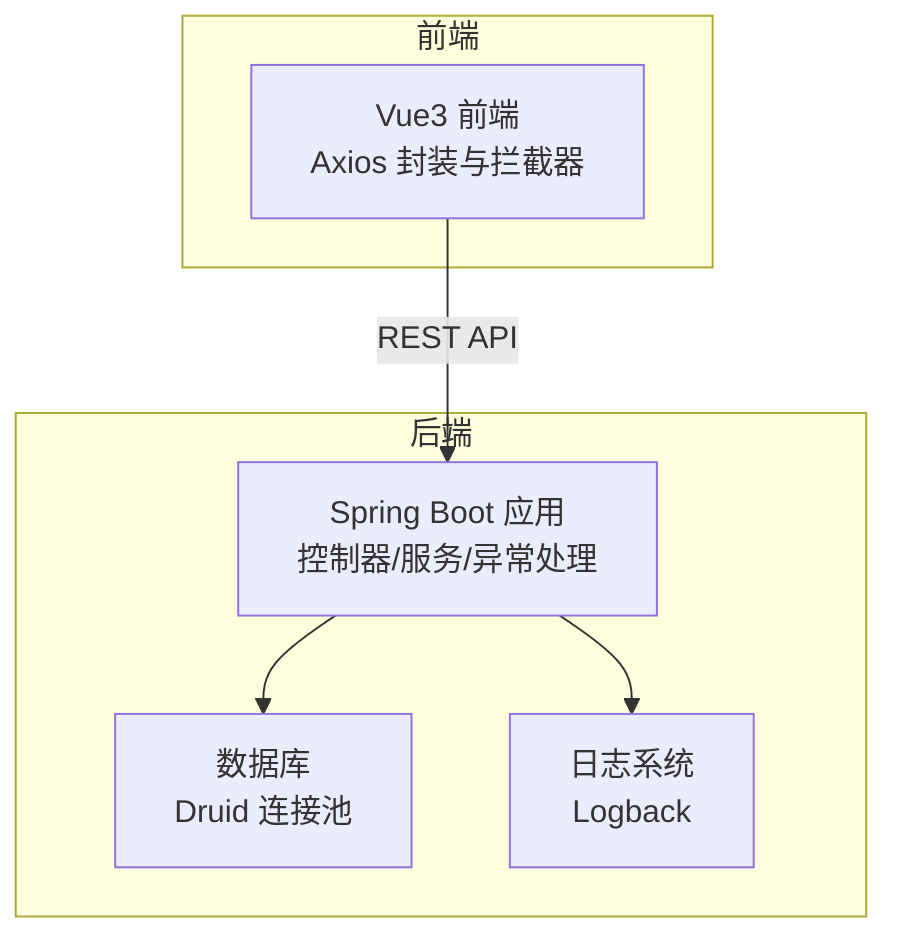
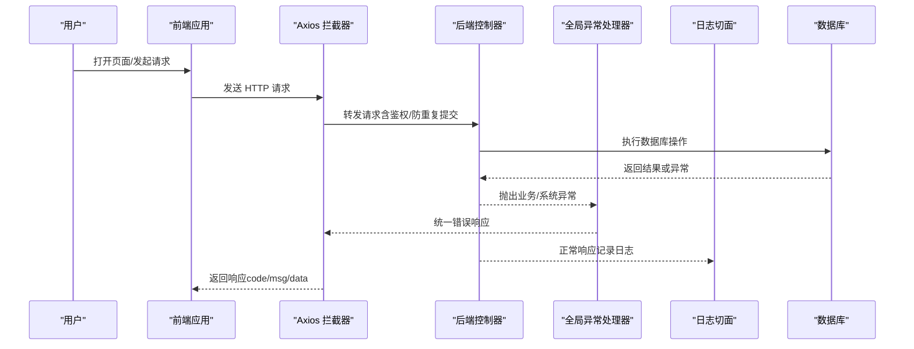
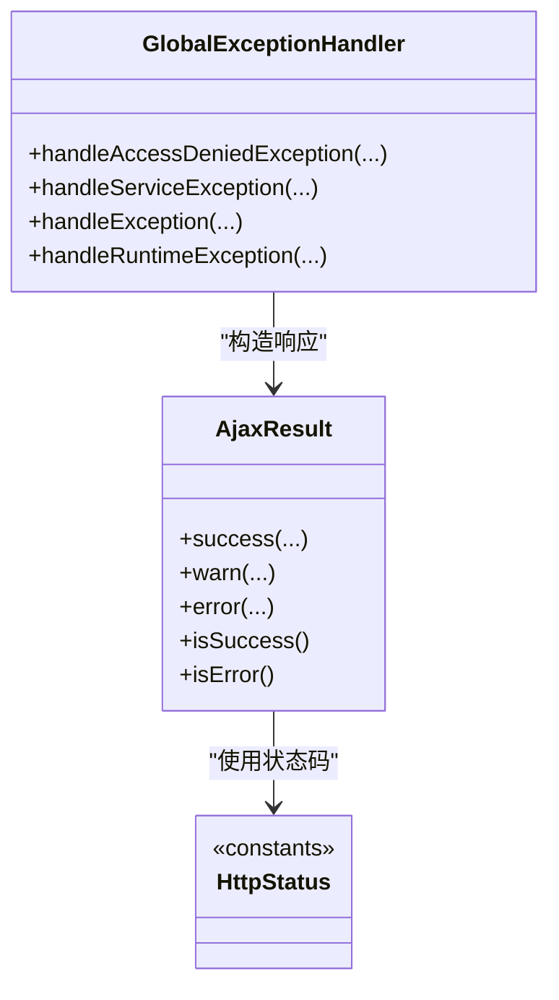
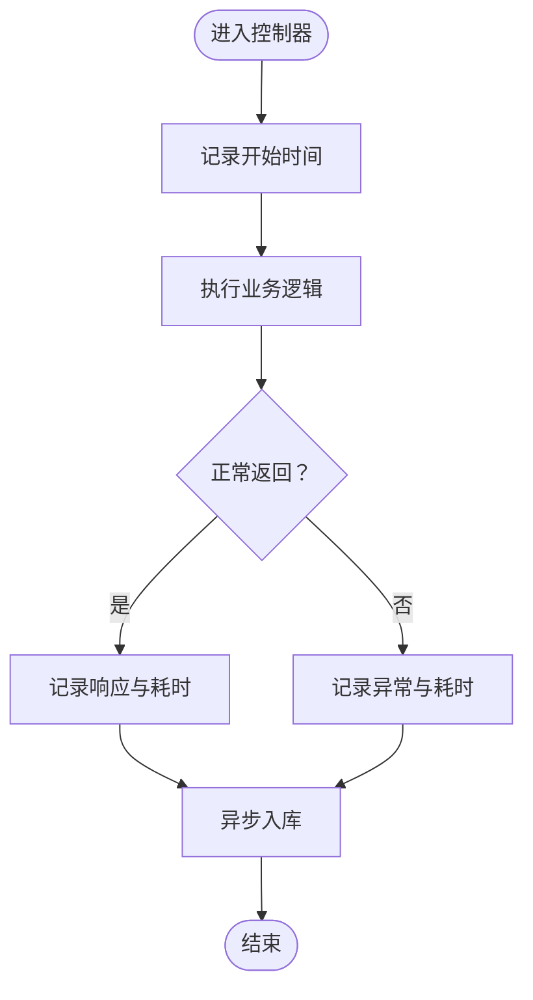
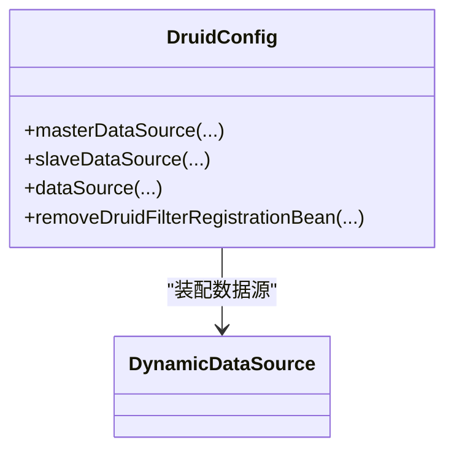
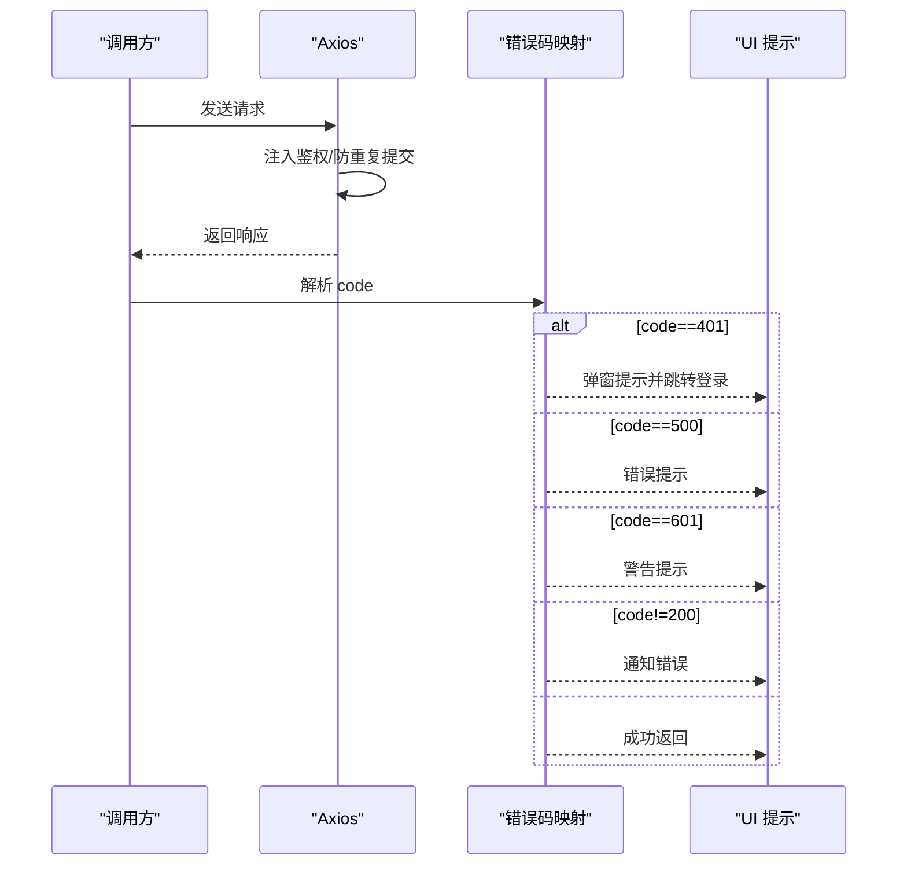
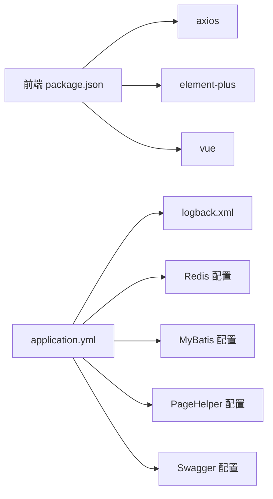

# 调试与故障排除

<cite>
**本文引用的文件**
- [application.yml](file://XingChen-Vue/xingchen-admin/src/main/resources/application.yml)
- [logback.xml](file://XingChen-Vue/xingchen-admin/src/main/resources/logback.xml)
- [GlobalExceptionHandler.java](file://XingChen-Vue/xingchen-framework/src/main/java/com/xingchen/framework/web/exception/GlobalExceptionHandler.java)
- [HttpStatus.java](file://XingChen-Vue/xingchen-common/src/main/java/com/xingchen/common/constant/HttpStatus.java)
- [AjaxResult.java](file://XingChen-Vue/xingchen-common/src/main/java/com/xingchen/common/core/domain/AjaxResult.java)
- [ExceptionUtil.java](file://XingChen-Vue/xingchen-common/src/main/java/com/xingchen/common/utils/ExceptionUtil.java)
- [LogAspect.java](file://XingChen-Vue/xingchen-framework/src/main/java/com/xingchen/framework/aspectj/LogAspect.java)
- [DruidConfig.java](file://XingChen-Vue/xingchen-framework/src/main/java/com/xingchen/framework/config/DruidConfig.java)
- [ServerController.java](file://XingChen-Vue/xingchen-admin/src/main/java/com/xingchen/web/controller/monitor/ServerController.java)
- [request.js](file://XingChen-Vue3/src/utils/request.js)
- [errorCode.js](file://XingChen-Vue3/src/utils/errorCode.js)
- [package.json（管理后台前端）](file://XingChen-Vue3/package.json)
- [package.json（用户前台前端）](file://XingChen-Vue/xingchen-ui-user/package.json)
</cite>

## 目录
1. [简介](#简介)
2. [项目结构](#项目结构)
3. [核心组件](#核心组件)
4. [架构总览](#架构总览)
5. [详细组件分析](#详细组件分析)
6. [依赖关系分析](#依赖关系分析)
7. [性能考虑](#性能考虑)
8. [故障排除指南](#故障排除指南)
9. [结论](#结论)
10. [附录](#附录)

## 简介
本文件面向运维与开发人员，提供健康管理系统在后端服务、前端页面、数据库连接、API 接口等方面的调试与故障排除实用指南。内容涵盖：
- 常见问题诊断方法与解决步骤
- 日志分析方法与关键日志位置
- 性能瓶颈定位与内存泄漏检测思路
- 网络连接问题排查
- 开发调试工具使用建议（浏览器开发者工具、Postman、数据库客户端）
- 错误码对照表与快速修复步骤
- 问题上报模板与紧急处理流程

## 项目结构
系统采用前后端分离架构：
- 后端（Spring Boot）：统一异常处理、日志切面、数据库连接池（Druid）、监控接口等
- 前端（Vue3 + Element Plus）：Axios 封装、错误码映射、鉴权与重复提交拦截
- 配置与日志：application.yml、logback.xml

图示来源
- [application.yml:1-148](file://XingChen-Vue/xingchen-admin/src/main/resources/application.yml#L1-L148)
- [logback.xml:1-93](file://XingChen-Vue/xingchen-admin/src/main/resources/logback.xml#L1-L93)
- [request.js:1-154](file://XingChen-Vue3/src/utils/request.js#L1-L154)

章节来源
- [application.yml:1-148](file://XingChen-Vue/xingchen-admin/src/main/resources/application.yml#L1-L148)
- [logback.xml:1-93](file://XingChen-Vue/xingchen-admin/src/main/resources/logback.xml#L1-L93)
- [package.json（管理后台前端）:1-54](file://XingChen-Vue3/package.json#L1-L54)
- [package.json（用户前台前端）:1-23](file://XingChen-Vue/xingchen-ui-user/package.json#L1-L23)

## 核心组件
- 统一异常处理：全局异常处理器将各类异常转换为统一的 AjaxResult 响应，便于前端识别与展示
- 统一响应模型：AjaxResult 规范化返回结构（code/msg/data），配合 HttpStatus 常量
- 日志切面：记录操作日志、请求参数、响应结果、异常信息与耗时
- 日志配置：Logback 输出控制台与滚动文件，按级别区分 info/error
- 数据库连接：Druid 多数据源配置与去广告过滤器
- 前端 Axios：统一拦截器、错误码映射、重复提交拦截、超时与网络错误提示

章节来源
- [GlobalExceptionHandler.java:1-146](file://XingChen-Vue/xingchen-framework/src/main/java/com/xingchen/framework/web/exception/GlobalExceptionHandler.java#L1-L146)
- [AjaxResult.java:1-217](file://XingChen-Vue/xingchen-common/src/main/java/com/xingchen/common/core/domain/AjaxResult.java#L1-L217)
- [HttpStatus.java:1-95](file://XingChen-Vue/xingchen-common/src/main/java/com/xingchen/common/constant/HttpStatus.java#L1-L95)
- [LogAspect.java:1-265](file://XingChen-Vue/xingchen-framework/src/main/java/com/xingchen/framework/aspectj/LogAspect.java#L1-L265)
- [logback.xml:1-93](file://XingChen-Vue/xingchen-admin/src/main/resources/logback.xml#L1-L93)
- [DruidConfig.java:1-127](file://XingChen-Vue/xingchen-framework/src/main/java/com/xingchen/framework/config/DruidConfig.java#L1-L127)
- [request.js:1-154](file://XingChen-Vue3/src/utils/request.js#L1-L154)

## 架构总览
后端通过 Spring MVC 暴露 REST 接口，前端通过 Axios 发起请求。异常与日志由后端集中处理与记录，数据库连接通过 Druid 管理。

图示来源
- [request.js:1-154](file://XingChen-Vue3/src/utils/request.js#L1-L154)
- [GlobalExceptionHandler.java:1-146](file://XingChen-Vue/xingchen-framework/src/main/java/com/xingchen/framework/web/exception/GlobalExceptionHandler.java#L1-L146)
- [LogAspect.java:1-265](file://XingChen-Vue/xingchen-framework/src/main/java/com/xingchen/framework/aspectj/LogAspect.java#L1-L265)
- [AjaxResult.java:1-217](file://XingChen-Vue/xingchen-common/src/main/java/com/xingchen/common/core/domain/AjaxResult.java#L1-L217)

## 详细组件分析

### 统一异常处理与响应模型
- 后端通过全局异常处理器捕获各类异常，统一返回 AjaxResult，前端据此判断状态码与提示
- AjaxResult 支持 success/warn/error 三类便捷方法，并以 code/msg/data 结构返回
- HttpStatus 定义了常用 HTTP 状态码与系统内部状态码（如 601 警告）

图示来源
- [GlobalExceptionHandler.java:1-146](file://XingChen-Vue/xingchen-framework/src/main/java/com/xingchen/framework/web/exception/GlobalExceptionHandler.java#L1-L146)
- [AjaxResult.java:1-217](file://XingChen-Vue/xingchen-common/src/main/java/com/xingchen/common/core/domain/AjaxResult.java#L1-L217)
- [HttpStatus.java:1-95](file://XingChen-Vue/xingchen-common/src/main/java/com/xingchen/common/constant/HttpStatus.java#L1-L95)

章节来源
- [GlobalExceptionHandler.java:1-146](file://XingChen-Vue/xingchen-framework/src/main/java/com/xingchen/framework/web/exception/GlobalExceptionHandler.java#L1-L146)
- [AjaxResult.java:1-217](file://XingChen-Vue/xingchen-common/src/main/java/com/xingchen/common/core/domain/AjaxResult.java#L1-L217)
- [HttpStatus.java:1-95](file://XingChen-Vue/xingchen-common/src/main/java/com/xingchen/common/constant/HttpStatus.java#L1-L95)

### 日志切面与操作审计
- 日志切面在请求前记录开始时间，在返回或异常后记录耗时、请求参数、响应结果、异常信息
- 敏感字段（密码等）会被过滤，避免日志泄露
- 异步记录操作日志，降低对主流程影响

图示来源
- [LogAspect.java:1-265](file://XingChen-Vue/xingchen-framework/src/main/java/com/xingchen/framework/aspectj/LogAspect.java#L1-L265)

章节来源
- [LogAspect.java:1-265](file://XingChen-Vue/xingchen-framework/src/main/java/com/xingchen/framework/aspectj/LogAspect.java#L1-L265)

### 数据库连接与 Druid 监控
- DruidConfig 配置主从数据源与动态切换，支持去除监控页广告
- 可结合 Druid 监控页面观察连接池状态、SQL 性能与慢查询

图示来源
- [DruidConfig.java:1-127](file://XingChen-Vue/xingchen-framework/src/main/java/com/xingchen/framework/config/DruidConfig.java#L1-L127)

章节来源
- [DruidConfig.java:1-127](file://XingChen-Vue/xingchen-framework/src/main/java/com/xingchen/framework/config/DruidConfig.java#L1-L127)

### 前端 Axios 封装与错误处理
- Axios 在请求前注入鉴权头、参数序列化、重复提交拦截
- 响应侧根据 code 映射错误提示，401 自动触发重新登录流程，500/601 展示错误/警告
- 网络错误与超时进行统一提示

图示来源
- [request.js:1-154](file://XingChen-Vue3/src/utils/request.js#L1-L154)
- [errorCode.js:1-7](file://XingChen-Vue3/src/utils/errorCode.js#L1-L7)

章节来源
- [request.js:1-154](file://XingChen-Vue3/src/utils/request.js#L1-L154)
- [errorCode.js:1-7](file://XingChen-Vue3/src/utils/errorCode.js#L1-L7)

## 依赖关系分析
- 前端依赖 axios、element-plus、vue 等，构建脚本与版本在 package.json 中声明
- 后端通过 application.yml 配置服务器端口、日志级别、Redis、MyBatis、分页插件、Swagger 等
- 日志通过 logback.xml 输出到控制台与滚动文件，按级别区分

图示来源
- [package.json（管理后台前端）:1-54](file://XingChen-Vue3/package.json#L1-L54)
- [application.yml:1-148](file://XingChen-Vue/xingchen-admin/src/main/resources/application.yml#L1-L148)
- [logback.xml:1-93](file://XingChen-Vue/xingchen-admin/src/main/resources/logback.xml#L1-L93)

章节来源
- [package.json（管理后台前端）:1-54](file://XingChen-Vue3/package.json#L1-L54)
- [package.json（用户前台前端）:1-23](file://XingChen-Vue/xingchen-ui-user/package.json#L1-L23)
- [application.yml:1-148](file://XingChen-Vue/xingchen-admin/src/main/resources/application.yml#L1-L148)
- [logback.xml:1-93](file://XingChen-Vue/xingchen-admin/src/main/resources/logback.xml#L1-L93)

## 性能考虑
- 日志级别与输出：生产建议 INFO/WARN，避免过多 DEBUG 造成 IO 压力
- 操作耗时统计：日志切面对每请求耗时进行统计，可用于定位慢接口
- 数据库连接池：合理配置 Druid 连接池参数，结合监控页观察活跃连接与等待时间
- 前端请求：避免大体积请求与频繁重复提交，必要时启用节流/防抖
- 缓存与异步：操作日志异步写入，减少对主流程影响

## 故障排除指南

### 后端服务异常
- 现象
  - 接口返回 500 或 601，前端弹出错误/警告提示
  - 控制台无异常堆栈或日志缺失
- 诊断步骤
  - 检查 application.yml 的日志级别与 logback.xml 的输出配置
  - 查看 sys-error.log 与 sys-info.log 中的异常堆栈与耗时
  - 使用全局异常处理器返回的 code/msg 判断具体错误类型
- 快速修复
  - 调整日志级别至 debug，复现问题并收集完整堆栈
  - 根据异常类型检查业务逻辑、参数校验、权限校验
  - 如涉及数据库，检查 Druid 连接池状态与慢 SQL

章节来源
- [GlobalExceptionHandler.java:1-146](file://XingChen-Vue/xingchen-framework/src/main/java/com/xingchen/framework/web/exception/GlobalExceptionHandler.java#L1-L146)
- [logback.xml:1-93](file://XingChen-Vue/xingchen-admin/src/main/resources/logback.xml#L1-L93)
- [AjaxResult.java:1-217](file://XingChen-Vue/xingchen-common/src/main/java/com/xingchen/common/core/domain/AjaxResult.java#L1-L217)
- [HttpStatus.java:1-95](file://XingChen-Vue/xingchen-common/src/main/java/com/xingchen/common/constant/HttpStatus.java#L1-L95)

### 前端页面错误
- 现象
  - 页面空白、接口 401/403/404/500，或提示“系统未知错误”
- 诊断步骤
  - 打开浏览器开发者工具 Network 面板，查看请求状态码与响应体
  - 检查 Console 是否有 JS 错误
  - 根据 errorCode.js 的映射核对后端返回的 code
- 快速修复
  - 401：确认鉴权 token 是否存在且未过期
  - 403：确认用户权限与菜单授权
  - 404：确认接口路径与后端路由一致
  - 500：查看后端日志定位异常

章节来源
- [request.js:1-154](file://XingChen-Vue3/src/utils/request.js#L1-L154)
- [errorCode.js:1-7](file://XingChen-Vue3/src/utils/errorCode.js#L1-L7)

### 数据库连接问题
- 现象
  - 接口超时、连接池耗尽、SQL 执行异常
- 诊断步骤
  - 检查 application.yml 中 Redis 与数据库连接配置
  - 查看 Druid 监控页面（如开启）观察连接池状态
  - 关注日志中数据库相关异常与慢查询
- 快速修复
  - 调整 Druid 连接池参数（最大连接、最大等待、空闲连接）
  - 优化慢 SQL，增加索引或拆分查询
  - 检查数据库服务状态与网络连通性

章节来源
- [application.yml:70-94](file://XingChen-Vue/xingchen-admin/src/main/resources/application.yml#L70-L94)
- [DruidConfig.java:1-127](file://XingChen-Vue/xingchen-framework/src/main/java/com/xingchen/framework/config/DruidConfig.java#L1-L127)

### API 接口故障
- 现象
  - 接口返回非 200，前端提示错误；或返回 200 但 data 为空
- 诊断步骤
  - 使用 Postman/浏览器 DevTools 查看请求与响应
  - 核对请求头（Content-Type、Authorization）与参数
  - 查看后端日志切面记录的请求参数与耗时
- 快速修复
  - 补充缺失参数或修正类型
  - 检查权限注解与拦截器配置
  - 对于重复提交，调整拦截间隔或禁用拦截

章节来源
- [LogAspect.java:1-265](file://XingChen-Vue/xingchen-framework/src/main/java/com/xingchen/framework/aspectj/LogAspect.java#L1-L265)
- [request.js:1-154](file://XingChen-Vue3/src/utils/request.js#L1-L154)

### 日志分析方法
- 关键日志位置
  - 控制台：application.yml 中 logging.level 配置
  - 文件：logback.xml 中 rollingFile 输出路径与级别过滤
- 分析要点
  - 错误日志：关注 ERROR 级别与异常堆栈根因
  - 操作日志：通过日志切面记录的请求 URL、参数、耗时定位问题
  - 异常根因：使用 ExceptionUtil 获取根异常信息

章节来源
- [application.yml:34-39](file://XingChen-Vue/xingchen-admin/src/main/resources/application.yml#L34-L39)
- [logback.xml:1-93](file://XingChen-Vue/xingchen-admin/src/main/resources/logback.xml#L1-L93)
- [ExceptionUtil.java:1-40](file://XingChen-Vue/xingchen-common/src/main/java/com/xingchen/common/utils/ExceptionUtil.java#L1-L40)

### 性能瓶颈定位
- 方法
  - 使用日志切面的耗时统计定位慢接口
  - 结合 Druid 监控观察连接池与 SQL 性能
  - 前端通过 Network 面板查看响应时间与重定向
- 建议
  - 对热点接口做缓存与降级
  - 优化数据库查询与索引
  - 控制日志量，避免高频写盘

章节来源
- [LogAspect.java:1-265](file://XingChen-Vue/xingchen-framework/src/main/java/com/xingchen/framework/aspectj/LogAspect.java#L1-L265)
- [DruidConfig.java:1-127](file://XingChen-Vue/xingchen-framework/src/main/java/com/xingchen/framework/config/DruidConfig.java#L1-L127)

### 内存泄漏检测
- 方法
  - 观察长期运行后内存占用趋势
  - 检查前端是否存在未释放的定时器、事件监听器、轮询
  - 后端关注长时间存活对象与未关闭的流/连接
- 建议
  - 前端在组件卸载时清理定时器与订阅
  - 后端确保资源在 finally 中释放，连接池参数合理

### 网络连接问题排查
- 方法
  - 使用浏览器 Network 面板查看请求失败原因
  - 检查跨域、代理、证书与防火墙
  - 使用 Postman 验证接口可用性
- 建议
  - 统一设置超时与重试策略
  - 对外网接口增加熔断与降级

章节来源
- [request.js:1-154](file://XingChen-Vue3/src/utils/request.js#L1-L154)

### 开发调试工具使用指南
- 浏览器开发者工具
  - Network：查看请求/响应、状态码、耗时
  - Console：查看 JS 错误与日志
  - Elements/Debugger：定位页面元素与断点
- Postman
  - 构建请求、设置鉴权头、发送 GET/POST/PUT/DELETE
  - 保存环境变量，复现问题场景
- 数据库客户端
  - 连接数据库，执行 SQL 验证数据与索引
  - 结合 Druid 监控页核对慢查询

## 错误码对照表
- 200：操作成功
- 201：对象创建成功
- 202：请求已被接受
- 204：操作已执行成功但无返回数据
- 301：资源已被移除
- 303：重定向
- 304：资源未修改
- 400：参数列表错误（缺少、格式不匹配）
- 401：未授权
- 403：访问受限，授权过期
- 404：资源/服务未找到
- 405：不允许的 HTTP 方法
- 409：资源冲突或被锁
- 415：不支持的数据/媒体类型
- 500：系统内部错误
- 501：接口未实现
- 601：系统警告消息

章节来源
- [HttpStatus.java:1-95](file://XingChen-Vue/xingchen-common/src/main/java/com/xingchen/common/constant/HttpStatus.java#L1-L95)

## 快速修复步骤清单
- 后端
  - 调整日志级别为 debug，复现并收集堆栈
  - 检查全局异常处理器返回的 code/msg
  - 校验数据库连接池与慢 SQL
- 前端
  - 打开 Network 面板核对状态码与响应体
  - 检查鉴权 token 与 errorCode.js 映射
  - 清理重复提交与未释放的定时器
- 通用
  - 统一设置超时与重试
  - 对外网接口增加熔断与降级

## 问题上报模板
- 问题概要
- 影响范围
- 复现步骤
- 期望行为
- 实际行为
- 日志与截图
- 环境信息（后端端口、前端版本、数据库版本）
- 附件（日志文件、数据库快照、接口请求包）

## 紧急处理流程
- 立即
  - 前端：刷新页面，清除缓存与鉴权信息
  - 后端：提升日志级别，收集异常堆栈
- 短期
  - 临时降级或熔断异常接口
  - 修复权限与参数校验问题
- 长期
  - 优化数据库与缓存
  - 完善监控与告警

## 结论
通过统一的异常处理、日志切面与前端 Axios 封装，系统具备较好的可观测性与可维护性。建议在生产环境中持续完善日志策略、数据库监控与前端错误上报机制，以快速定位并解决问题。