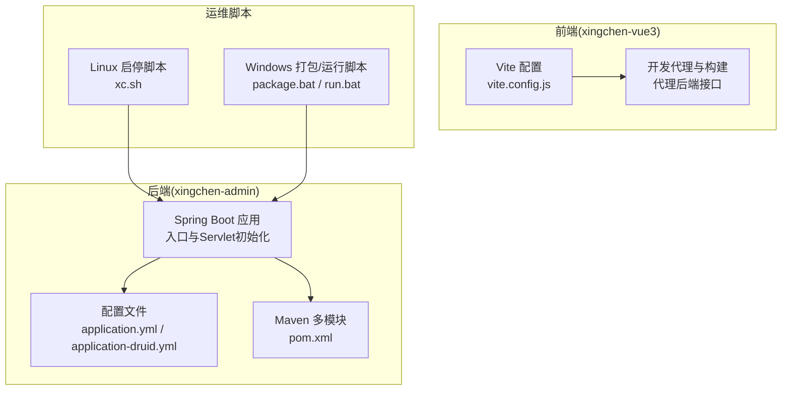
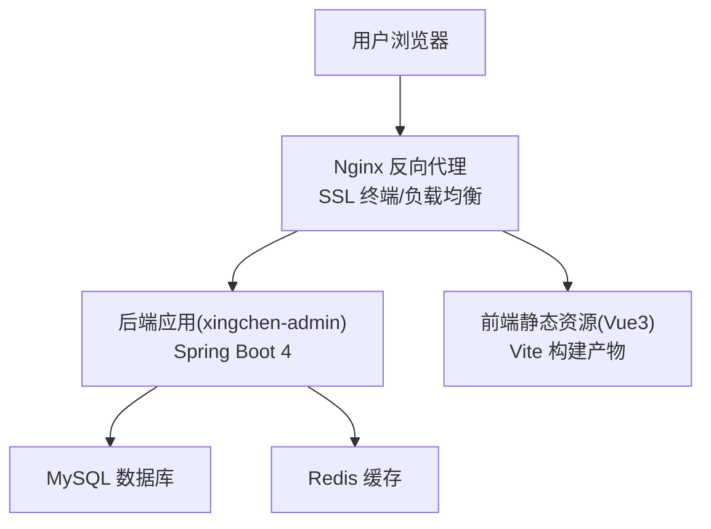
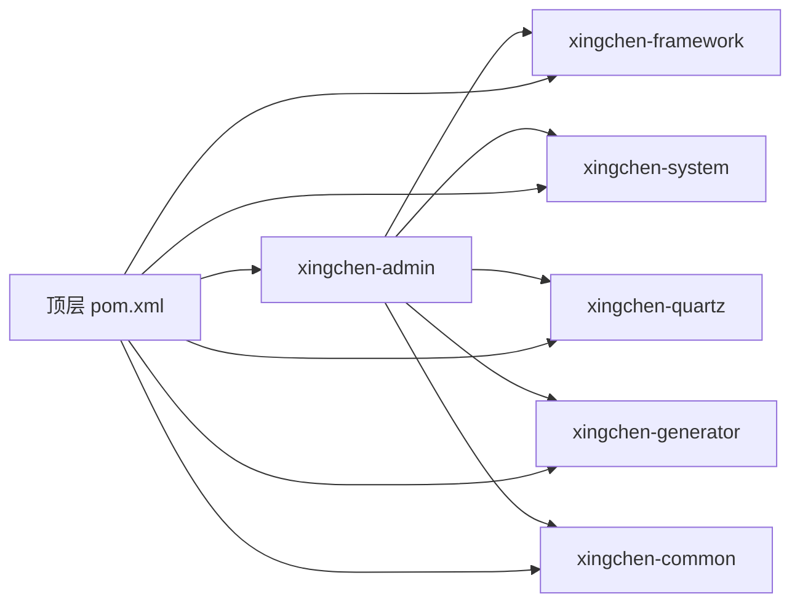

# 部署方案

<cite>
**本文引用的文件**
- [application.yml](file://XingChen-Vue/xingchen-admin/src/main/resources/application.yml)
- [application-druid.yml](file://XingChen-Vue/xingchen-admin/src/main/resources/application-druid.yml)
- [pom.xml](file://XingChen-Vue/pom.xml)
- [xc.sh](file://XingChen-Vue\xc.sh)
- [package.bat](file://XingChen-Vue/bin/package.bat)
- [run.bat](file://XingChen-Vue/bin/run.bat)
- [vite.config.js](file://XingChen-Vue3/vite.config.js)
- [.gitignore（Vue3）](file://XingChen-Vue3/.gitignore)
- [.gitignore（Vue）](file://XingChen-Vue/.gitignore)
- [XingChenServletInitializer.java](file://XingChen-Vue/xingchen-admin/src/main/java/com/xingchen/XingChenServletInitializer.java)
- [项目说明文档.md](file://项目说明文档.md)
</cite>

## 目录
1. [简介](#简介)
2. [项目结构](#项目结构)
3. [核心组件](#核心组件)
4. [架构总览](#架构总览)
5. [详细组件分析](#详细组件分析)
6. [依赖关系分析](#依赖关系分析)
7. [性能考虑](#性能考虑)
8. [故障排查指南](#故障排查指南)
9. [结论](#结论)
10. [附录](#附录)

## 简介
本部署方案面向健康管理系统（后端基于 Spring Boot 4 + Maven 多模块，前端基于 Vue3 + Vite），覆盖生产环境部署全流程：服务器环境准备、依赖安装、数据库配置、应用打包与部署、容器化与反向代理、SSL 与负载均衡、多环境配置差异、性能优化参数、监控告警、备份恢复、滚动更新与故障应急处理。

## 项目结构
- 后端采用 Maven 多模块结构，包含 admin、framework、system、quartz、generator、common 等模块，统一由顶层 pom 管理版本与插件。
- 前端使用 Vite 构建，支持开发代理与生产构建输出。
- 提供 Linux Shell 与 Windows 批处理脚本用于打包与运行。

图表来源
- [pom.xml:176-183](file://XingChen-Vue/pom.xml#L176-L183)
- [application.yml:16-148](file://XingChen-Vue/xingchen-admin/src/main/resources/application.yml#L16-L148)
- [application-druid.yml:1-61](file://XingChen-Vue/xingchen-admin/src/main/resources/application-druid.yml#L1-L61)
- [xc.sh:1-87](file://XingChen-Vue\xc.sh#L1-L87)
- [package.bat:1-12](file://XingChen-Vue/bin/package.bat#L1-L12)
- [run.bat:1-14](file://XingChen-Vue/bin/run.bat#L1-L14)
- [vite.config.js:1-80](file://XingChen-Vue3/vite.config.js#L1-L80)

章节来源
- [pom.xml:176-183](file://XingChen-Vue/pom.xml#L176-L183)
- [application.yml:16-148](file://XingChen-Vue/xingchen-admin/src/main/resources/application.yml#L16-L148)
- [application-druid.yml:1-61](file://XingChen-Vue/xingchen-admin/src/main/resources/application-druid.yml#L1-L61)
- [xc.sh:1-87](file://XingChen-Vue\xc.sh#L1-L87)
- [package.bat:1-12](file://XingChen-Vue/bin/package.bat#L1-L12)
- [run.bat:1-14](file://XingChen-Vue/bin/run.bat#L1-L14)
- [vite.config.js:1-80](file://XingChen-Vue3/vite.config.js#L1-L80)

## 核心组件
- 后端应用与配置
  - 服务器端口、Tomcat 线程池、日志级别、国际化、文件上传大小、Redis 连接、JWT、MyBatis、PageHelper、OpenAPI 文档、XSS 防护、防盗链等。
  - Druid 数据源配置，含主从库开关、连接池参数、慢 SQL 记录、控制台访问账号等。
- 前端构建与代理
  - Vite 开发服务器端口、代理规则（/dev-api、/v3/api-docs）、构建产物目录与分块命名策略。
- 运维脚本
  - Linux 下 Java 进程启停、JVM 参数、日志路径；Windows 下打包与直接运行 jar 的批处理脚本。

章节来源
- [application.yml:16-148](file://XingChen-Vue/xingchen-admin/src/main/resources/application.yml#L16-L148)
- [application-druid.yml:1-61](file://XingChen-Vue/xingchen-admin/src/main/resources/application-druid.yml#L1-L61)
- [vite.config.js:1-80](file://XingChen-Vue3/vite.config.js#L1-L80)
- [xc.sh:1-87](file://XingChen-Vue\xc.sh#L1-L87)
- [package.bat:1-12](file://XingChen-Vue/bin/package.bat#L1-L12)
- [run.bat:1-14](file://XingChen-Vue/bin/run.bat#L1-L14)

## 架构总览
下图展示生产部署的关键交互：Nginx 作为反向代理与 SSL 终端，后端通过容器或裸机运行，数据库与缓存独立部署，前端静态资源由 Nginx 提供。

图表来源
- [application.yml:16-148](file://XingChen-Vue/xingchen-admin/src/main/resources/application.yml#L16-L148)
- [application-druid.yml:1-61](file://XingChen-Vue/xingchen-admin/src/main/resources/application-druid.yml#L1-L61)
- [vite.config.js:1-80](file://XingChen-Vue3/vite.config.js#L1-L80)

## 详细组件分析

### 后端应用与配置
- 服务器与线程池
  - 端口、context-path、Tomcat accept-count、最大线程数与最小空闲线程等参数可按并发峰值调优。
- 日志与国际化
  - 日志级别与消息国际化资源路径已配置，便于生产问题定位与多语言支持。
- 文件上传与 Jackson
  - 单文件与请求总大小限制、时区与日期格式统一。
- Redis 连接
  - 连接超时、池大小、数据库索引与认证字段预留，生产需按容量与延迟调整。
- JWT 令牌
  - 自定义头部、密钥与过期时间，建议在生产环境使用强密钥并启用 HTTPS。
- MyBatis 与分页
  - 类型别名包、Mapper 扫描路径、全局配置文件位置与 PageHelper 方言及参数。
- OpenAPI/Swagger
  - 文档路径与 UI 路径、标签排序与分组扫描包。
- XSS 与防盗链
  - 过滤开关、排除路径与匹配模式，生产建议开启并严格限定域名。
- Druid 数据源
  - 主库连接串、用户名密码、初始/最大连接数、超时、空闲检测周期、慢 SQL 阈值与控制台访问账号。

章节来源
- [application.yml:16-148](file://XingChen-Vue/xingchen-admin/src/main/resources/application.yml#L16-L148)
- [application-druid.yml:1-61](file://XingChen-Vue/xingchen-admin/src/main/resources/application-druid.yml#L1-L61)

### 前端构建与代理
- 本地开发
  - 代理到后端 8080 端口，支持 /dev-api 前缀重写与 OpenAPI 文档代理。
- 生产构建
  - 输出目录与分块命名策略，建议配合 CDN 与缓存头优化。
- 路径与别名
  - base、alias 与扩展名配置，确保打包后静态资源正确加载。

章节来源
- [vite.config.js:1-80](file://XingChen-Vue3/vite.config.js#L1-L80)

### 运维脚本与打包运行
- Linux
  - 提供 start/stop/restart/status 功能，JVM 参数、日志路径、进程查询与优雅退出逻辑。
- Windows
  - package.bat 执行 maven 打包跳过测试；run.bat 设置内存参数并运行 jar。
- Servlet 初始化
  - XingChenServletInitializer 支持在外部 Web 容器中部署（如 WAR 形式），当前以 Spring Boot Jar 运行为主。

章节来源
- [xc.sh:1-87](file://XingChen-Vue\xc.sh#L1-L87)
- [package.bat:1-12](file://XingChen-Vue/bin/package.bat#L1-L12)
- [run.bat:1-14](file://XingChen-Vue/bin/run.bat#L1-L14)
- [XingChenServletInitializer.java:1-18](file://XingChen-Vue/xingchen-admin/src/main/java/com/xingchen/XingChenServletInitializer.java#L1-L18)

### Docker 容器化部署（概念性流程）
- 基础镜像选择与 JDK 版本
  - 建议基于官方 OpenJDK 17 或兼容镜像，确保与项目 Java 版本一致。
- 构建与运行
  - 在 CI 中执行 Maven 打包生成可执行 jar；在容器内挂载配置文件与日志目录；暴露应用端口；设置 JVM 参数与健康检查。
- 健康检查与资源限制
  - 通过探针检测应用存活与就绪；限制 CPU/内存避免资源争用。
- 外部依赖
  - 数据库与 Redis 通过独立容器或云服务提供，应用通过环境变量或配置文件连接。

（本节为概念性说明，不直接对应具体源文件）

### Nginx 反向代理与 SSL
- 反代后端
  - 将 /dev-api 与 /v3/api-docs 等转发至后端 8080；静态资源由 Nginx 提供。
- SSL 终端
  - 使用 Let’s Encrypt 或商业证书，启用 TLS 1.3、禁用弱加密套件；配置 HSTS 与安全响应头。
- 负载均衡
  - upstream 多实例后端，结合健康检查与权重；支持会话保持或轮询策略。
- 缓存与压缩
  - 对静态资源设置长缓存；启用 gzip/br 压缩提升传输效率。

（本节为概念性说明，不直接对应具体源文件）

### 多环境配置差异（开发/测试/生产）
- 环境激活
  - application.yml 中 profiles.active 指定 druid 数据源配置文件；可通过环境变量切换。
- 关键差异点
  - 日志级别：开发 debug，生产 warn/info；文件上传大小：生产可适当放宽；Redis 连接：生产指向集群或哨兵；JWT 密钥：生产必须强密钥；XSS/防盗链：生产务必开启并严格配置。
- 配置注入
  - 建议通过环境变量或配置中心覆盖敏感项，避免硬编码。

章节来源
- [application.yml:54-55](file://XingChen-Vue/xingchen-admin/src/main/resources/application.yml#L54-L55)
- [application.yml:35-38](file://XingChen-Vue/xingchen-admin/src/main/resources/application.yml#L35-L38)
- [application.yml:62-62](file://XingChen-Vue/xingchen-admin/src/main/resources/application.yml#L62-L62)
- [application.yml:140-147](file://XingChen-Vue/xingchen-admin/src/main/resources/application.yml#L140-L147)

### 性能优化参数
- JVM
  - 初始堆、最大堆、元空间、GC 策略与并行 GC 参数已在脚本中体现，建议根据 CPU 核心数与内存容量调优。
- Tomcat
  - 线程池最大线程数、最小空闲线程、accept-count 按并发峰值与 RT 目标调整。
- Druid
  - 连接池大小、超时、慢 SQL 阈值与统计开关，生产需结合慢查询日志与业务峰值评估。
- 前端
  - 构建分块命名、静态资源缓存与压缩策略，减少首屏加载时间。

章节来源
- [xc.sh:5-6](file://XingChen-Vue\xc.sh#L5-L6)
- [application.yml:23-32](file://XingChen-Vue/xingchen-admin/src/main/resources/application.yml#L23-L32)
- [application-druid.yml:19-41](file://XingChen-Vue/xingchen-admin/src/main/resources/application-druid.yml#L19-L41)
- [vite.config.js:29-42](file://XingChen-Vue3/vite.config.js#L29-L42)

### 监控告警配置（概念性说明）
- 应用侧
  - 开启慢 SQL 统计与 Druid 控制台；结合日志采集与告警平台。
- 基础设施
  - Nginx 访问/错误日志、后端健康检查、JVM 指标、磁盘/内存/CPU 告警。
- 建议
  - 使用统一日志与指标平台（如 ELK/EFK + Prometheus/Grafana），设置阈值与收敛策略。

（本节为概念性说明，不直接对应具体源文件）

### 备份恢复策略
- 数据库
  - MySQL 定时全量备份与增量备份，校验恢复演练；Binlog 保留策略与跨机房同步。
- 配置与制品
  - 配置文件与构建产物纳入版本化存储；变更审批与回滚基线。
- 缓存
  - Redis 快照或持久化策略，主从/集群灾备。

（本节为概念性说明，不直接对应具体源文件）

### 滚动更新方案
- 无状态后端
  - 通过负载均衡逐台下线、拉起新版本、上线；结合健康检查与超时控制。
- 前端
  - 新版本发布后清理浏览器缓存或采用强缓存失效策略。
- 数据库迁移
  - 采用灰度发布与只读副本切换，DDL 在维护窗口执行。

（本节为概念性说明，不直接对应具体源文件）

### 故障应急处理流程
- 快速定位
  - 查看应用日志、JVM GC 日志、Nginx 错误日志与后端异常栈。
- 降级与熔断
  - 限流、降级非关键接口、开启缓存兜底。
- 回滚
  - 回滚到上一稳定版本，恢复数据库与配置。
- 复盘
  - 记录根因、修复与改进措施，完善预案。

（本节为概念性说明，不直接对应具体源文件）

## 依赖关系分析
- 模块耦合
  - framework/system/generator/common 等模块由 admin 引用，quartz 作为定时任务模块独立。
- 外部依赖
  - Spring Boot、MyBatis、Druid、PageHelper、OpenAPI、JWT、POI、Yauaa 等版本由顶层 pom 统一管理。
- 构建插件
  - maven-compiler-plugin 与 spring-boot-maven-plugin，仓库与插件仓库指向阿里云镜像。

图表来源
- [pom.xml:176-183](file://XingChen-Vue/pom.xml#L176-L183)

章节来源
- [pom.xml:36-174](file://XingChen-Vue/pom.xml#L36-L174)

## 性能考虑
- JVM 与 GC
  - 并行 GC 与堆大小建议结合业务峰值与 GC 日志分析持续优化。
- 数据库
  - 连接池大小与慢 SQL 监控，定期分析慢查询与锁等待。
- 前端
  - 构建产物分块与缓存策略，CDN 与压缩配置提升首屏性能。

（本节为通用指导，不直接对应具体源文件）

## 故障排查指南
- 启动失败
  - 检查端口占用、JVM 内存参数、配置文件路径与权限；查看 xc.sh 日志输出。
- 访问异常
  - 核对 Nginx 反代规则、后端端口与防火墙；确认 CORS 与 OpenAPI 路径。
- 数据库连接
  - 校验连接串、用户名密码、网络连通性与防火墙；关注 Druid 控制台与慢 SQL。
- 前端空白页
  - 检查静态资源路径、base 配置与代理规则；确认 dist 目录与缓存。

章节来源
- [xc.sh:22-32](file://XingChen-Vue\xc.sh#L22-L32)
- [vite.config.js:48-61](file://XingChen-Vue3/vite.config.js#L48-L61)
- [application-druid.yml:8-18](file://XingChen-Vue/xingchen-admin/src/main/resources/application-druid.yml#L8-L18)

## 结论
本方案提供了从环境准备、打包部署、容器化与反向代理、SSL 与负载均衡，到多环境配置、性能优化、监控告警、备份恢复、滚动更新与故障应急的完整路径。建议在生产环境中结合实际流量与资源情况，持续调优 JVM、数据库与前端缓存策略，并建立完善的监控与自动化运维体系。

## 附录
- 服务器环境准备要点
  - 操作系统：推荐 Linux；安装 JDK 17、Maven、MySQL、Redis、Nginx。
  - 系统参数：ulimit、内核参数、时区与 NTP。
- 部署清单
  - 后端：JAR 包、application.yml、application-druid.yml、日志目录、JVM 参数。
  - 前端：构建产物、Nginx 静态资源配置。
  - 基础设施：数据库初始化 SQL、Redis 配置、SSL 证书、负载均衡配置。
- 参考文档
  - 项目说明文档.md

章节来源
- [项目说明文档.md](file://项目说明文档.md)
- [.gitignore（Vue3）:1-74](file://XingChen-Vue3/.gitignore#L1-L74)
- [.gitignore（Vue）:1-48](file://XingChen-Vue/.gitignore#L1-L48)