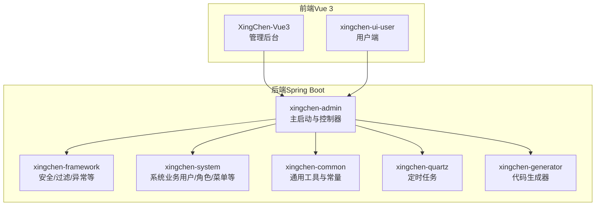
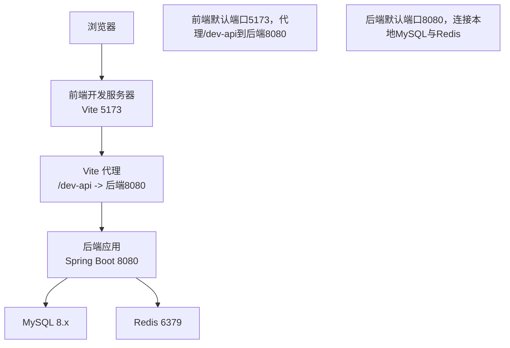
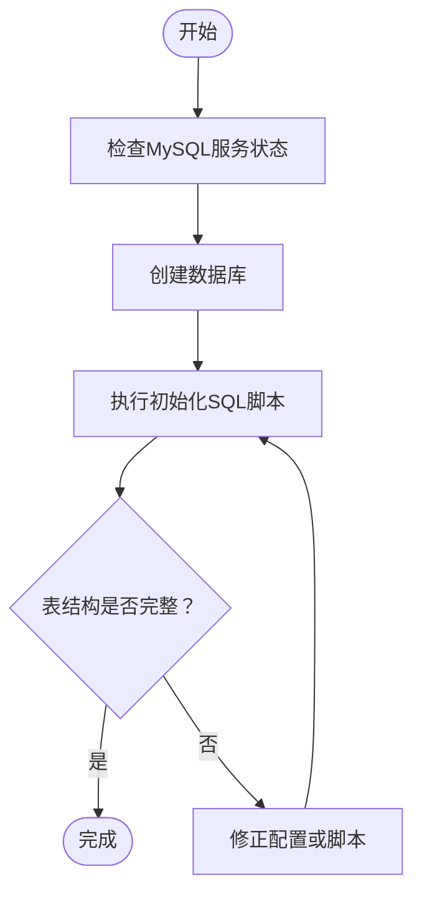
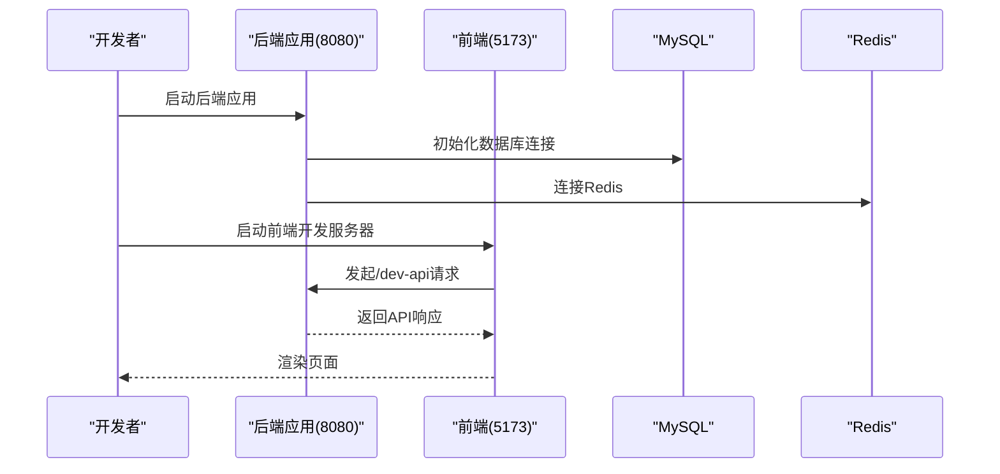
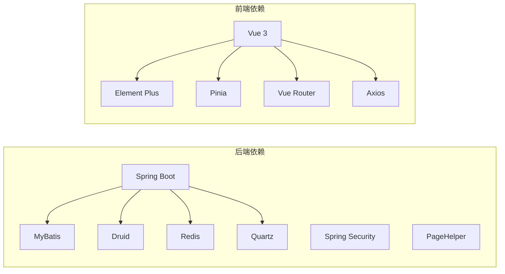

# 快速开始

<cite>
**本文引用的文件**
- [项目说明文档.md](file://项目说明文档.md)
- [application.yml](file://XingChen-Vue/xingchen-admin/src/main/resources/application.yml)
- [application-druid.yml](file://XingChen-Vue/xingchen-admin/src/main/resources/application-druid.yml)
- [my.ini](file://XingChen-Vue3/my.ini)
- [vite.config.js](file://XingChen-Vue3/vite.config.js)
- [前端启动说明.md](file://XingChen-Vue3/前端启动说明.md)
- [package.json (Vue3)](file://XingChen-Vue3/package.json)
- [package.json (用户端)](file://XingChen-Vue/xingchen-ui-user/package.json)
- [xc.bat (后端 Windows)](file://XingChen-Vue\xc.bat)
- [xc.sh (后端 Linux)](file://XingChen-Vue\xc.sh)
- [xc.bat (后端 Windows 3)](file://XingChen-Vue3\xc.bat)
- [xc.sh (后端 Linux 3)](file://XingChen-Vue3\xc.sh)
- [ry_20260321.sql](file://XingChen-Vue/sql/ry_20260321.sql)
</cite>

## 目录
1. [简介](#简介)
2. [项目结构](#项目结构)
3. [核心组件](#核心组件)
4. [架构概览](#架构概览)
5. [详细组件分析](#详细组件分析)
6. [依赖分析](#依赖分析)
7. [性能考虑](#性能考虑)
8. [故障排除指南](#故障排除指南)
9. [结论](#结论)
10. [附录](#附录)

## 简介
本指南面向新加入的开发者，帮助你在约30分钟内完成健康管理系统项目的本地部署与基础功能验证。你将获得完整的环境准备清单（JDK 17、Node.js、MySQL 8.x、Redis）、数据库初始化步骤、依赖安装流程、本地运行命令、常见问题排查、端口配置与启动验证方法，并提供Windows与Linux/macOS平台的差异化指导。

## 项目结构
项目采用前后端分离架构：
- 后端（Spring Boot 4.0.3 + Java 17）：多模块Maven工程，包含Web入口、系统业务、框架配置、定时任务、代码生成等模块。
- 前端（Vue 3 + Vite 6.4 + Element Plus 2.13）：现代化SPA应用，提供管理后台与用户端界面。

**图表来源**
- [项目说明文档.md: 29-36:29-36](file://项目说明文档.md#L29-L36)

**章节来源**
- [项目说明文档.md: 18-46:18-46](file://项目说明文档.md#L18-L46)

## 核心组件
- 后端核心配置
  - 服务器端口：默认8080（可在配置文件中调整）
  - 数据库连接：Druid连接池，MySQL 8.x驱动
  - 缓存：Redis（本地localhost:6379）
  - 安全：Spring Security + JWT Token
  - 文档：SpringDoc OpenAPI（Swagger UI）
- 前端核心配置
  - 开发服务器端口：默认5173（可通过Vite配置调整）
  - 代理：将/dev-api前缀转发至后端8080端口
  - 依赖：Vue 3、Element Plus、Pinia、Axios、Vue Router

**章节来源**
- [application.yml: 16-148:16-148](file://XingChen-Vue/xingchen-admin/src/main/resources/application.yml#L16-L148)
- [application-druid.yml: 1-61:1-61](file://XingChen-Vue/xingchen-admin/src/main/resources/application-druid.yml#L1-L61)
- [vite.config.js: 44-61:44-61](file://XingChen-Vue3/vite.config.js#L44-L61)
- [package.json (Vue3): 1-54:1-54](file://XingChen-Vue3/package.json#L1-L54)
- [package.json (用户端): 1-23:1-23](file://XingChen-Vue/xingchen-ui-user/package.json#L1-L23)

## 架构概览
后端通过Spring Boot提供REST API，前端通过Vite开发服务器提供静态资源与代理转发，二者通过HTTP通信。

**图表来源**
- [vite.config.js: 44-61:44-61](file://XingChen-Vue3/vite.config.js#L44-L61)
- [application.yml: 16-94:16-94](file://XingChen-Vue/xingchen-admin/src/main/resources/application.yml#L16-L94)

## 详细组件分析

### 环境准备与安装
- JDK 17
  - 使用Java 17构建与运行后端服务。
- Node.js v18+
  - 前端开发与构建依赖。
- MySQL 8.x
  - 默认使用UTF8MB4字符集，时区+8:00。
- Redis
  - 默认连接localhost:6379，用于缓存与会话等。

**章节来源**
- [项目说明文档.md: 65-69:65-69](file://项目说明文档.md#L65-L69)
- [my.ini: 17-27:17-27](file://XingChen-Vue3/my.ini#L17-L27)
- [application.yml: 72-94:72-94](file://XingChen-Vue/xingchen-admin/src/main/resources/application.yml#L72-L94)

### 数据库初始化步骤
1. 启动MySQL服务（Windows可参考my.ini配置，Linux/macOS按各自方式启动）。
2. 创建数据库（名称可自定义，但需与后端配置一致）。
3. 执行初始化SQL脚本：
   - 基础权限与系统数据：ry_20260321.sql
   - 定时任务相关：quartz.sql（如存在）
   - 积分日志等扩展：points_log.sql（如存在）
4. 在后端配置中确认数据库连接信息（URL、用户名、密码）。

**图表来源**
- [ry_20260321.sql: 1-722:1-722](file://XingChen-Vue/sql/ry_20260321.sql#L1-L722)

**章节来源**
- [ry_20260321.sql: 1-722:1-722](file://XingChen-Vue/sql/ry_20260321.sql#L1-L722)
- [my.ini: 1-37:1-37](file://XingChen-Vue3/my.ini#L1-L37)
- [application-druid.yml: 8-11:8-11](file://XingChen-Vue/xingchen-admin/src/main/resources/application-druid.yml#L8-L11)

### 依赖安装与本地运行
- 后端（Spring Boot）
  - 使用IDEA导入工程，确保JDK 17可用。
  - 启动前确保MySQL与Redis已启动。
  - 首次运行建议导入初始化SQL。
  - 运行主启动类：XingChenApplication。
  - 成功启动后控制台输出“星辰启动成功”，默认访问端口8080。
- 前端（Vue 3）
  - 进入XingChen-Vue3目录，安装依赖后启动开发服务器。
  - 默认访问地址：http://localhost:5173
  - 前端通过/dev-api代理转发到后端8080。

**图表来源**
- [项目说明文档.md: 71-83:71-83](file://项目说明文档.md#L71-L83)
- [vite.config.js: 44-61:44-61](file://XingChen-Vue3/vite.config.js#L44-L61)

**章节来源**
- [项目说明文档.md: 71-83:71-83](file://项目说明文档.md#L71-L83)
- [xc.bat (后端 Windows): 1-68:1-68](file://XingChen-Vue\xc.bat#L1-L68)
- [xc.sh (后端 Linux): 1-87:1-87](file://XingChen-Vue\xc.sh#L1-L87)
- [xc.bat (后端 Windows 3): 1-68:1-68](file://XingChen-Vue3\xc.bat#L1-L68)
- [xc.sh (后端 Linux 3): 1-87:1-87](file://XingChen-Vue3\xc.sh#L1-L87)

### 端口配置与差异平台指导
- 后端端口
  - 默认8080，可在application.yml中修改server.port。
- 前端端口
  - 默认5173，可在vite.config.js中server.port调整。
- 代理配置
  - Vite将/dev-api前缀请求转发至后端8080。
- 平台差异
  - Windows：使用xc.bat脚本或直接运行IDE启动；前端可用批处理脚本。
  - Linux/macOS：使用xc.sh脚本或命令行启动；前端使用npm/yarn启动。

**章节来源**
- [application.yml: 17-19:17-19](file://XingChen-Vue/xingchen-admin/src/main/resources/application.yml#L17-L19)
- [vite.config.js: 44-61:44-61](file://XingChen-Vue3/vite.config.js#L44-L61)
- [前端启动说明.md: 5-23:5-23](file://XingChen-Vue3/前端启动说明.md#L5-L23)

### 启动验证方法
- 后端
  - 访问：http://localhost:8080/swagger-ui.html 或 /v3/api-docs
  - 若能看到接口文档，说明后端已成功启动。
- 前端
  - 访问：http://localhost:5173
  - 登录后可查看管理后台功能。
- 代理连通性
  - 前端发起/dev-api请求应能正确返回后端数据。

**章节来源**
- [application.yml: 119-131:119-131](file://XingChen-Vue/xingchen-admin/src/main/resources/application.yml#L119-L131)
- [vite.config.js: 50-60:50-60](file://XingChen-Vue3/vite.config.js#L50-L60)

## 依赖分析
- 后端依赖
  - Spring Boot 4.0.3、Spring Security、MyBatis、PageHelper、Druid、Redis、Quartz、Fastjson2、Kaptcha、Oshi等。
- 前端依赖
  - Vue 3.5、Element Plus 2.13、Pinia 3.0、Vue Router 4.6、Axios等。

**图表来源**
- [项目说明文档.md: 20-45:20-45](file://项目说明文档.md#L20-L45)

**章节来源**
- [项目说明文档.md: 20-45:20-45](file://项目说明文档.md#L20-L45)

## 性能考虑
- 后端
  - Druid连接池参数（初始连接、最大活跃、超时等）可根据实际负载调整。
  - Redis连接池大小与超时需与后端配置保持一致。
- 前端
  - Vite默认启用按需打包与代码分割，注意避免引入过大的静态资源。
  - 生产构建时可启用压缩与缓存策略。

[本节为通用建议，无需特定文件引用]

## 故障排除指南
- 端口冲突
  - 后端：修改application.yml中的server.port。
  - 前端：修改vite.config.js中的server.port。
- 数据库连接失败
  - 检查application-druid.yml中的URL、用户名、密码与my.ini配置是否一致。
  - 确认MySQL服务已启动且防火墙未阻断3306端口。
- Redis连接失败
  - 检查application.yml中的Redis配置（host/port/database/password）。
  - 确认Redis服务已启动。
- 前端无法访问后端
  - 检查Vite代理配置是否正确指向后端8080。
  - 确认后端已成功启动且未报错。
- 跨域问题
  - 后端已配置跨域与安全过滤器，如仍出现跨域，请检查具体接口的CORS配置。
- 热部署与开发体验
  - application.yml中已启用devtools热部署，修改代码后可自动重启。

**章节来源**
- [application.yml: 17-94:17-94](file://XingChen-Vue/xingchen-admin/src/main/resources/application.yml#L17-L94)
- [application-druid.yml: 8-11:8-11](file://XingChen-Vue/xingchen-admin/src/main/resources/application-druid.yml#L8-L11)
- [vite.config.js: 44-61:44-61](file://XingChen-Vue3/vite.config.js#L44-L61)
- [my.ini: 3-9:3-9](file://XingChen-Vue3/my.ini#L3-L9)

## 结论
按照本指南，你可以在30分钟内完成环境准备、数据库初始化、依赖安装与本地运行，并通过Swagger与前端界面验证核心功能。遇到问题时，优先检查端口、数据库与Redis连接、以及Vite代理配置。

## 附录
- 快速命令清单
  - 后端启动（Windows）：双击xc.bat，选择启动。
  - 后端启动（Linux/macOS）：./xc.sh start。
  - 前端启动：cd XingChen-Vue3 && npm install && npm run dev。
  - 数据库初始化：执行ry_20260321.sql等脚本。
- 常用端口
  - 后端：8080
  - 前端：5173
  - MySQL：3306（my.ini中可调整）
  - Redis：6379