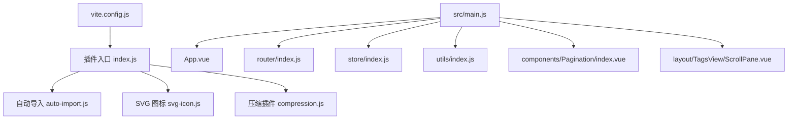
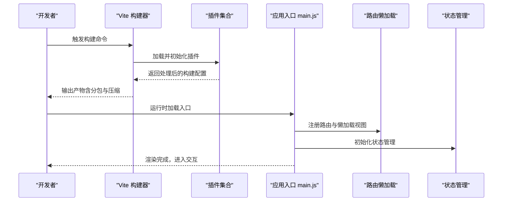
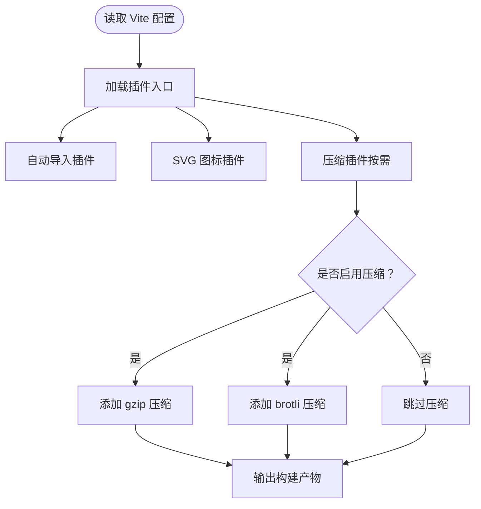
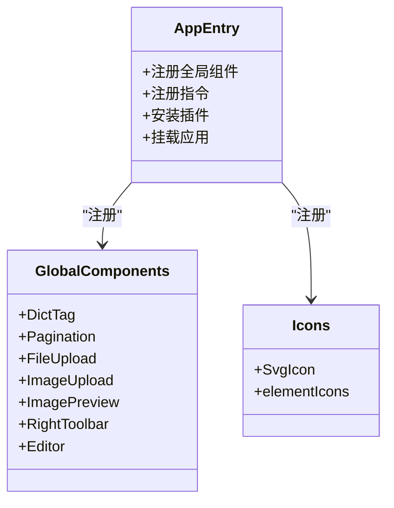
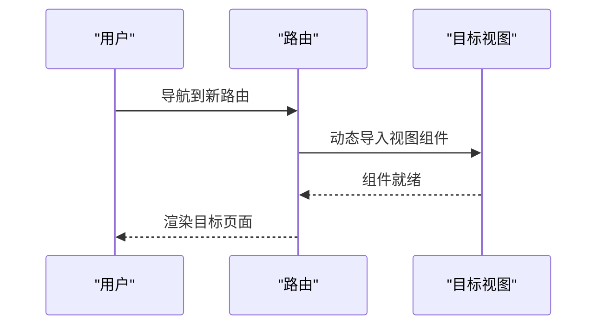
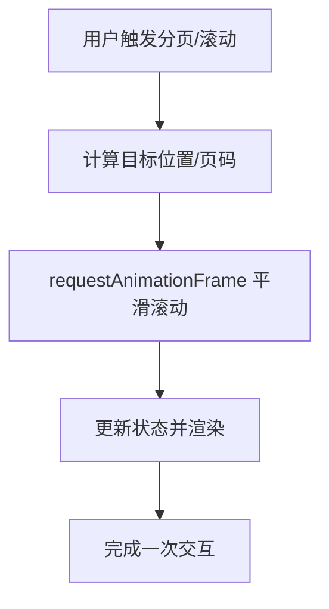
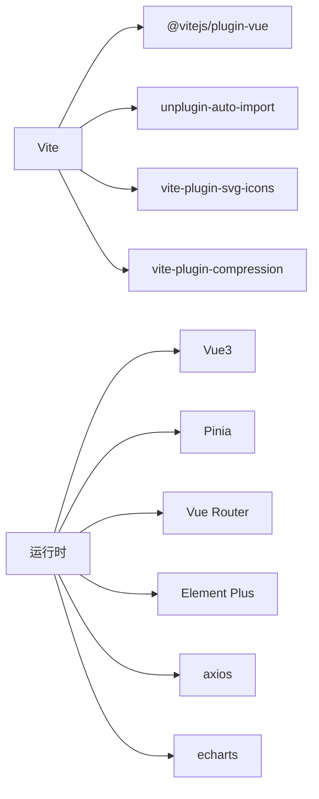

# 前端性能优化

<cite>
**本文引用的文件**   
- [vite.config.js](file://XingChen-Vue3/vite.config.js)
- [package.json](file://XingChen-Vue3/package.json)
- [插件入口 index.js](file://XingChen-Vue3/vite/plugins/index.js)
- [压缩插件 compression.js](file://XingChen-Vue3/vite/plugins/compression.js)
- [自动导入 auto-import.js](file://XingChen-Vue3/vite/plugins/auto-import.js)
- [SVG 图标插件 svg-icon.js](file://XingChen-Vue3/vite/plugins/svg-icon.js)
- [主程序 main.js](file://XingChen-Vue3/src/main.js)
- [应用入口 App.vue](file://XingChen-Vue3/src/App.vue)
- [路由配置 index.js](file://XingChen-Vue3/src/router/index.js)
- [Pinia 状态 store](file://XingChen-Vue3/src/store/index.js)
- [分页组件 Pagination/index.vue](file://XingChen-Vue3/src/components/Pagination/index.vue)
- [工具库 utils/index.js](file://XingChen-Vue3/src/utils/index.js)
- [滚动动画工具 scroll-to.js](file://XingChen-Vue3/src/utils/scroll-to.js)
- [标签页滚动容器 ScrollPane.vue](file://XingChen-Vue3/src/layout/components/TagsView/ScrollPane.vue)
</cite>

## 目录
1. [引言](#引言)
2. [项目结构](#项目结构)
3. [核心组件](#核心组件)
4. [架构总览](#架构总览)
5. [详细组件分析](#详细组件分析)
6. [依赖分析](#依赖分析)
7. [性能考虑](#性能考虑)
8. [故障排查指南](#故障排查指南)
9. [结论](#结论)
10. [附录](#附录)

## 引言
本文件面向 Vue3 应用的前端性能优化，结合当前仓库中的 Vite 构建体系与运行时实现，系统梳理以下优化方向：构建期优化（代码分割、Tree Shaking、Bundle 大小控制、资源压缩）、运行期优化（组件渲染、虚拟滚动、内存泄漏防范）、网络与缓存策略（CDN、预加载/预取、缓存头）、以及可落地的监控与 Lighthouse 优化建议。文档同时提供配置参数说明与可执行的调优步骤，帮助团队在不牺牲功能的前提下显著提升首屏速度、交互流畅度与长期体验稳定性。

## 项目结构
本项目采用 Vite 作为构建工具，前端源码位于 XingChen-Vue3，核心目录与职责如下：
- 构建配置与插件：vite.config.js 与 vite/plugins 下的插件工厂
- 运行时入口：src/main.js、App.vue
- 路由与状态：src/router、src/store
- 组件与工具：src/components、src/utils
- 依赖与脚本：package.json

**图表来源**
- [vite.config.js:1-80](file://XingChen-Vue3/vite.config.js#L1-L80)
- [插件入口 index.js:1-16](file://XingChen-Vue3/vite/plugins/index.js#L1-L16)
- [自动导入 auto-import.js:1-13](file://XingChen-Vue3/vite/plugins/auto-import.js#L1-L13)
- [SVG 图标插件 svg-icon.js:1-11](file://XingChen-Vue3/vite/plugins/svg-icon.js#L1-L11)
- [压缩插件 compression.js:1-29](file://XingChen-Vue3/vite/plugins/compression.js#L1-L29)
- [主程序 main.js:1-85](file://XingChen-Vue3/src/main.js#L1-L85)
- [应用入口 App.vue:1-16](file://XingChen-Vue3/src/App.vue#L1-L16)
- [路由配置 index.js:1-197](file://XingChen-Vue3/src/router/index.js#L1-L197)
- [Pinia 状态 store:1-4](file://XingChen-Vue3/src/store/index.js#L1-L4)
- [工具库 utils/index.js:1-391](file://XingChen-Vue3/src/utils/index.js#L1-L391)
- [分页组件 Pagination/index.vue:1-105](file://XingChen-Vue3/src/components/Pagination/index.vue#L1-L105)
- [标签页滚动容器 ScrollPane.vue](file://XingChen-Vue3/src/layout/components/TagsView/ScrollPane.vue)

**章节来源**
- [vite.config.js:1-80](file://XingChen-Vue3/vite.config.js#L1-L80)
- [package.json:1-54](file://XingChen-Vue3/package.json#L1-L54)

## 核心组件
- 构建配置与插件体系：通过插件入口统一装配，按需启用压缩、SVG 图标、自动导入等功能，便于集中治理与扩展。
- 运行时入口：在 main.js 中注册全局组件、指令、插件与 Element Plus，确保按需引入与懒加载生效。
- 路由与状态：路由采用动态导入实现代码分割；Pinia 作为轻量状态管理，避免大体积框架带来的额外开销。
- 工具与组件：提供通用工具函数与分页组件，减少重复实现，提高复用性与可维护性。

**章节来源**
- [插件入口 index.js:1-16](file://XingChen-Vue3/vite/plugins/index.js#L1-L16)
- [主程序 main.js:1-85](file://XingChen-Vue3/src/main.js#L1-L85)
- [路由配置 index.js:1-197](file://XingChen-Vue3/src/router/index.js#L1-L197)
- [Pinia 状态 store:1-4](file://XingChen-Vue3/src/store/index.js#L1-L4)
- [分页组件 Pagination/index.vue:1-105](file://XingChen-Vue3/src/components/Pagination/index.vue#L1-L105)

## 架构总览
下图展示了从构建到运行的关键流程：Vite 加载配置与插件，进行模块解析与打包；运行时通过路由懒加载与组件按需注册，降低初始包体与首屏渲染压力。

**图表来源**
- [vite.config.js:1-80](file://XingChen-Vue3/vite.config.js#L1-L80)
- [插件入口 index.js:1-16](file://XingChen-Vue3/vite/plugins/index.js#L1-L16)
- [主程序 main.js:1-85](file://XingChen-Vue3/src/main.js#L1-L85)
- [路由配置 index.js:1-197](file://XingChen-Vue3/src/router/index.js#L1-L197)
- [Pinia 状态 store:1-4](file://XingChen-Vue3/src/store/index.js#L1-L4)

## 详细组件分析

### 构建配置与插件体系
- 插件装配：插件入口统一导出，支持在构建阶段按需启用压缩与 SVG 优化。
- 自动导入：对 Vue、Vue Router、Pinia 进行自动导入，减少样板代码，有利于 Tree Shaking。
- SVG 图标：集中注册与优化，构建阶段可开启 SVGO，减小图标体积。
- 压缩策略：支持 gzip 与 brotli 双通道，按配置开关，服务器需正确配置 MIME 与协商。

**图表来源**
- [vite.config.js:1-80](file://XingChen-Vue3/vite.config.js#L1-L80)
- [插件入口 index.js:1-16](file://XingChen-Vue3/vite/plugins/index.js#L1-L16)
- [压缩插件 compression.js:1-29](file://XingChen-Vue3/vite/plugins/compression.js#L1-L29)
- [自动导入 auto-import.js:1-13](file://XingChen-Vue3/vite/plugins/auto-import.js#L1-L13)
- [SVG 图标插件 svg-icon.js:1-11](file://XingChen-Vue3/vite/plugins/svg-icon.js#L1-L11)

**章节来源**
- [vite.config.js:1-80](file://XingChen-Vue3/vite.config.js#L1-L80)
- [插件入口 index.js:1-16](file://XingChen-Vue3/vite/plugins/index.js#L1-L16)
- [压缩插件 compression.js:1-29](file://XingChen-Vue3/vite/plugins/compression.js#L1-L29)
- [自动导入 auto-import.js:1-13](file://XingChen-Vue3/vite/plugins/auto-import.js#L1-L13)
- [SVG 图标插件 svg-icon.js:1-11](file://XingChen-Vue3/vite/plugins/svg-icon.js#L1-L11)

### 运行时入口与组件注册
- 全局组件与指令：在入口集中注册，避免在各处重复引入，利于 Tree Shaking。
- Element Plus：按需引入与主题尺寸配置，减少未使用样式的打包。
- SVG 图标：通过虚拟模块注册，配合构建期 SVGO，进一步降低体积。

**图表来源**
- [主程序 main.js:1-85](file://XingChen-Vue3/src/main.js#L1-L85)
- [应用入口 App.vue:1-16](file://XingChen-Vue3/src/App.vue#L1-L16)

**章节来源**
- [主程序 main.js:1-85](file://XingChen-Vue3/src/main.js#L1-L85)
- [应用入口 App.vue:1-16](file://XingChen-Vue3/src/App.vue#L1-L16)

### 路由懒加载与代码分割
- 路由采用动态导入，实现按需加载与自然的代码分割，降低首屏 JS 体积。
- keep-alive 缓存策略：通过路由元信息控制缓存，平衡内存占用与切换性能。
- 滚动行为：统一滚动到顶部，减少页面跳转后的历史滚动影响。

**图表来源**
- [路由配置 index.js:1-197](file://XingChen-Vue3/src/router/index.js#L1-L197)

**章节来源**
- [路由配置 index.js:1-197](file://XingChen-Vue3/src/router/index.js#L1-L197)

### 组件渲染优化与虚拟滚动
- 分页组件：提供受控分页模型与自动滚动，减少列表渲染压力。
- 标签页滚动：使用 requestAnimationFrame 实现平滑滚动，避免频繁重排。
- 工具函数：提供防抖、深拷贝、字符串处理等通用能力，降低重复计算与内存占用。

**图表来源**
- [分页组件 Pagination/index.vue:1-105](file://XingChen-Vue3/src/components/Pagination/index.vue#L1-L105)
- [滚动动画工具 scroll-to.js:1-43](file://XingChen-Vue3/src/utils/scroll-to.js#L1-L43)
- [标签页滚动容器 ScrollPane.vue](file://XingChen-Vue3/src/layout/components/TagsView/ScrollPane.vue)

**章节来源**
- [分页组件 Pagination/index.vue:1-105](file://XingChen-Vue3/src/components/Pagination/index.vue#L1-L105)
- [滚动动画工具 scroll-to.js:1-43](file://XingChen-Vue3/src/utils/scroll-to.js#L1-L43)
- [标签页滚动容器 ScrollPane.vue](file://XingChen-Vue3/src/layout/components/TagsView/ScrollPane.vue)

## 依赖分析
- 构建工具链：Vite、@vitejs/plugin-vue、unplugin-auto-import、vite-plugin-compression、vite-plugin-svg-icons。
- 运行时依赖：Vue3、Element Plus、Pinia、Vue Router、axios、echarts 等。
- 依赖关系：构建期插件服务于打包优化；运行时依赖决定首屏与交互性能表现。

**图表来源**
- [vite.config.js:1-80](file://XingChen-Vue3/vite.config.js#L1-L80)
- [package.json:1-54](file://XingChen-Vue3/package.json#L1-L54)

**章节来源**
- [package.json:1-54](file://XingChen-Vue3/package.json#L1-L54)

## 性能考虑
- 构建期优化
  - 代码分割与懒加载：路由与视图均采用动态导入，确保按需加载。
  - Tree Shaking：自动导入仅引入所需 API，减少无用代码。
  - Bundle 大小控制：合理拆分 vendor 与业务代码，关注 Rollup 输出命名与警告阈值。
  - 资源压缩：按需启用 gzip/brotli，服务器需正确配置 Accept-Encoding 与缓存头。
- 运行期优化
  - 组件渲染：避免不必要的响应式依赖与深层监听；使用受控组件与计算属性。
  - 虚拟滚动：对长列表优先采用虚拟滚动方案，限制可视区域渲染节点数量。
  - 内存泄漏防范：及时清理定时器、事件监听器与订阅；在路由守卫中释放资源。
- 网络与缓存
  - CDN：将静态资源托管至 CDN，结合强缓存与版本化文件名。
  - 预加载/预取：对关键路由与首屏依赖使用 rel="modulepreload/preload" 与 rel="prefetch"。
  - 缓存策略：静态资源采用 immutable/no-transform；HTML 采用短缓存或协商缓存。
- 监控与 Lighthouse
  - 关键指标：FCP/LCP/FID/CLS/TTI/TBT，结合浏览器性能面板与 Web Vitals。
  - Lighthouse：聚焦 Largest Contentful Paint、Cumulative Layout Shift、Interactive、Total Blocking Time 等指标。
  - 用户体验：首屏时间、交互延迟、滚动流畅度、图片与字体优化。

[本节为通用指导，不直接分析具体文件]

## 故障排查指南
- 构建体积异常增大
  - 检查是否误引入完整库或样式；确认自动导入范围与 SVGO 开启状态。
  - 查看 Rollup 输出命名与警告阈值，定位超大模块。
- 首屏渲染缓慢
  - 确认路由懒加载是否生效；检查入口注册的全局组件是否过多。
  - 使用浏览器性能面板分析主线程阻塞点。
- 滚动卡顿
  - 检查是否存在过度重绘与回流；确认 requestAnimationFrame 使用是否正确。
  - 对长列表采用虚拟滚动或分页策略。
- 缓存与压缩问题
  - 确认服务器已正确配置 gzip/brotli 与缓存头；验证 CDN 是否命中。

**章节来源**
- [vite.config.js:1-80](file://XingChen-Vue3/vite.config.js#L1-L80)
- [插件入口 index.js:1-16](file://XingChen-Vue3/vite/plugins/index.js#L1-L16)
- [压缩插件 compression.js:1-29](file://XingChen-Vue3/vite/plugins/compression.js#L1-L29)
- [主程序 main.js:1-85](file://XingChen-Vue3/src/main.js#L1-L85)
- [滚动动画工具 scroll-to.js:1-43](file://XingChen-Vue3/src/utils/scroll-to.js#L1-L43)

## 结论
通过在构建期启用自动导入、SVG 优化与按需压缩，在运行期采用路由懒加载、受控组件与平滑滚动，结合 CDN 与缓存策略，可有效降低首屏体积与交互延迟。建议持续以 Lighthouse 与 Web Vitals 为核心指标进行回归测试，逐步完善虚拟滚动与内存管理，确保在复杂业务场景下仍保持稳定流畅的用户体验。

[本节为总结性内容，不直接分析具体文件]

## 附录
- 配置参数与调优要点
  - 构建输出命名：确保文件名包含哈希，便于缓存失效与增量发布。
  - 源映射：生产环境关闭源映射，开发环境使用内联映射以平衡调试成本。
  - 代理与本地开发：合理配置 dev-server 代理，避免跨域与请求放大。
- 实施清单
  - 启用 brotli 压缩并在服务器配置 Accept-Encoding。
  - 对首屏关键路由与依赖使用 modulepreload。
  - 对长列表组件引入虚拟滚动或分页。
  - 在路由守卫中清理定时器与订阅，防止内存泄漏。
  - 定期运行 Lighthouse 并跟踪关键指标趋势。

[本节为通用指导，不直接分析具体文件]