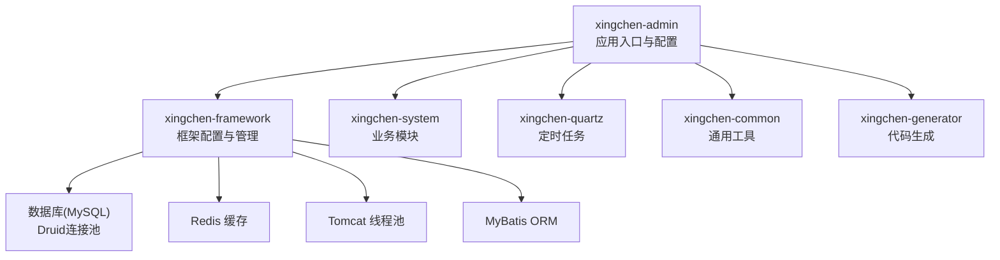
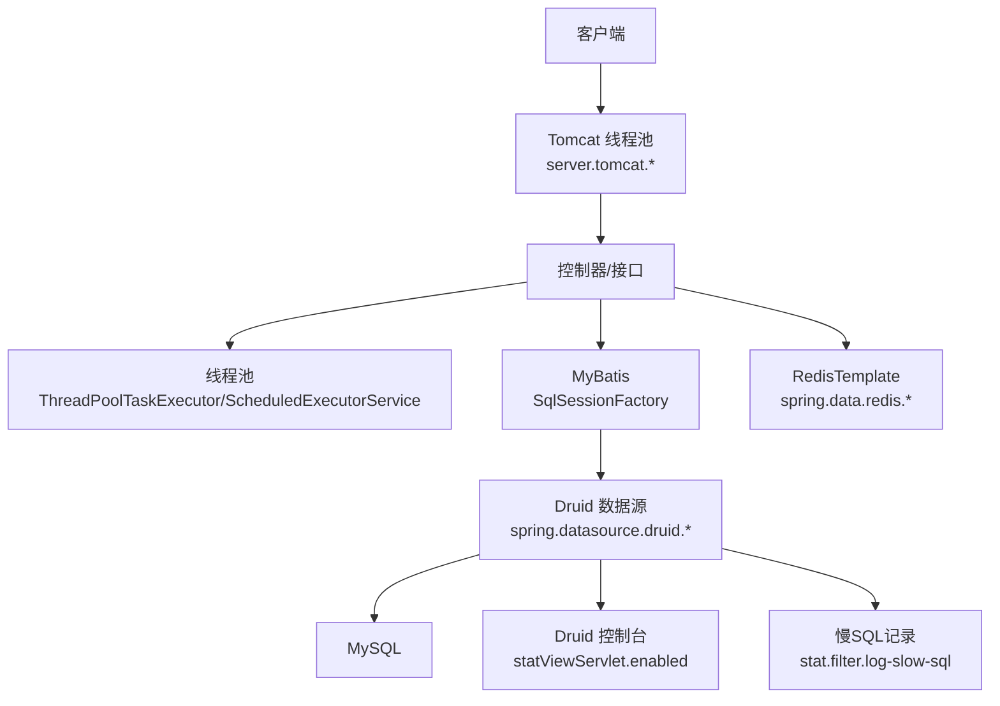
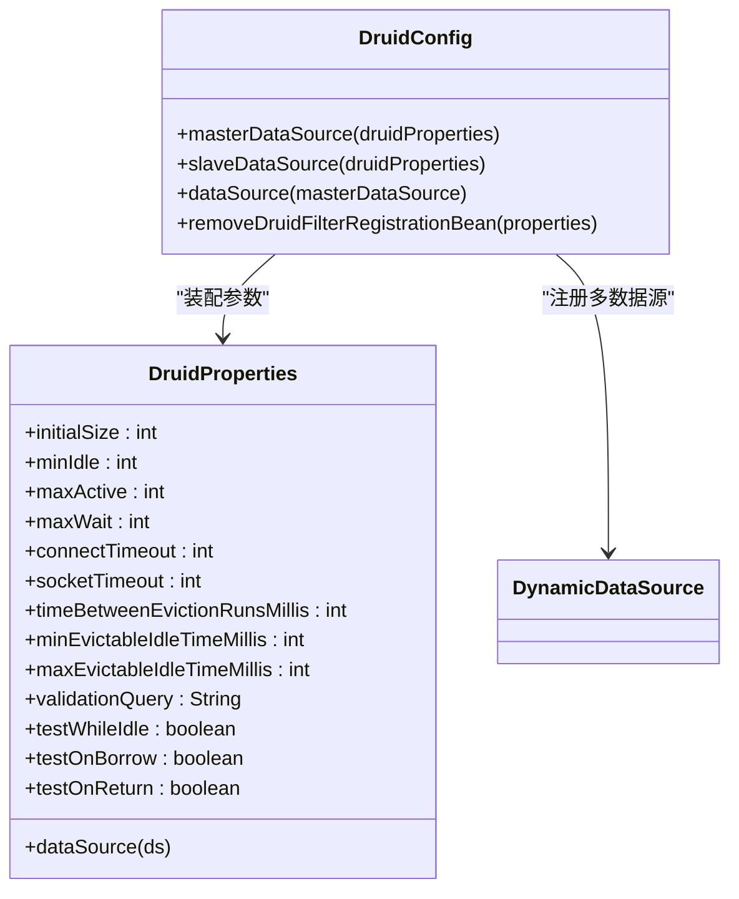
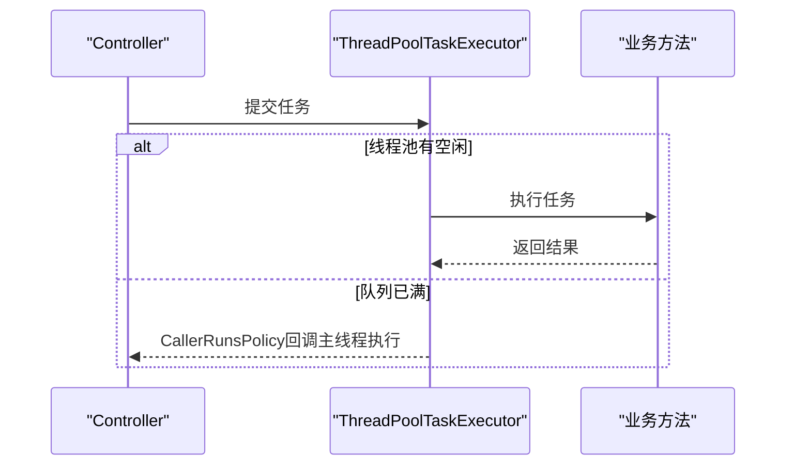
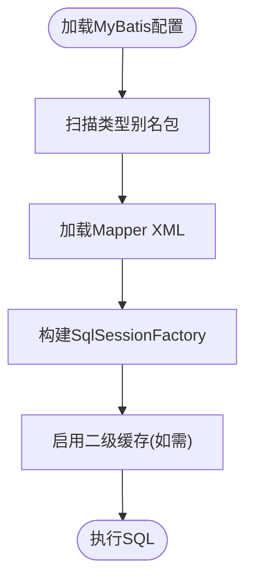
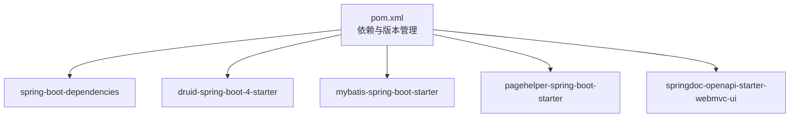

# 后端性能优化

<cite>
**本文引用的文件**
- [application.yml](file://XingChen-Vue/xingchen-admin/src/main/resources/application.yml)
- [application-druid.yml](file://XingChen-Vue/xingchen-admin/src/main/resources/application-druid.yml)
- [DruidConfig.java](file://XingChen-Vue/xingchen-framework/src/main/java/com/xingchen/framework/config/DruidConfig.java)
- [DruidProperties.java](file://XingChen-Vue/xingchen-framework/src/main/java/com/xingchen/framework/config/properties/DruidProperties.java)
- [ThreadPoolConfig.java](file://XingChen-Vue/xingchen-framework/src/main/java/com/xingchen/framework/config/ThreadPoolConfig.java)
- [MyBatisConfig.java](file://XingChen-Vue/xingchen-framework/src/main/java/com/xingchen/framework/config/MyBatisConfig.java)
- [mybatis-config.xml](file://XingChen-Vue/xingchen-admin/src/main/resources/mybatis/mybatis-config.xml)
- [RedisConfig.java](file://XingChen-Vue/xingchen-framework/src/main/java/com/xingchen/framework/config/RedisConfig.java)
- [AsyncFactory.java](file://XingChen-Vue/xingchen-framework/src/main/java/com/xingchen/framework/manager/factory/AsyncFactory.java)
- [Threads.java](file://XingChen-Vue/xingchen-common/src/main/java/com/xingchen/common/utils/Threads.java)
- [logback.xml](file://XingChen-Vue/xingchen-admin/src/main/resources/logback.xml)
- [pom.xml](file://XingChen-Vue/pom.xml)
- [SysJobMapper.xml](file://XingChen-Vue/xingchen-quartz/src/main/resources/mapper/quartz/SysJobMapper.xml)
- [SysJobLogMapper.xml](file://XingChen-Vue/xingchen-quartz/src/main/resources/mapper/quartz/SysJobLogMapper.xml)
- [ry_20260321.sql](file://XingChen-Vue/sql/ry_20260321.sql)
</cite>

## 目录
1. [简介](#简介)
2. [项目结构](#项目结构)
3. [核心组件](#核心组件)
4. [架构总览](#架构总览)
5. [详细组件分析](#详细组件分析)
6. [依赖分析](#依赖分析)
7. [性能考量](#性能考量)
8. [故障排查指南](#故障排查指南)
9. [结论](#结论)
10. [附录](#附录)

## 简介
本文件面向健康管理系统后端，围绕Spring Boot应用的性能优化展开，覆盖数据库连接池配置与调优、线程池调优、MyBatis查询优化、Druid监控与慢查询分析、异步任务与缓存策略、数据库索引优化建议、JVM参数与GC优化、性能监控指标与APM集成、以及性能瓶颈定位方法。内容以仓库现有配置与实现为基础，结合最佳实践给出可落地的优化建议与参数参考。

## 项目结构
后端采用多模块聚合工程，核心模块包括：
- xingchen-admin：应用入口与资源配置
- xingchen-framework：框架层（配置、切面、异步、定时任务等）
- xingchen-system：业务模块（系统管理相关）
- xingchen-common：通用工具与常量
- xingchen-quartz：定时任务模块
- xingchen-generator：代码生成模块
- sql：数据库初始化脚本

**图表来源**
- [pom.xml:176-183](file://XingChen-Vue/pom.xml#L176-L183)

**章节来源**
- [pom.xml:176-183](file://XingChen-Vue/pom.xml#L176-L183)

## 核心组件
- 数据库连接池：基于Druid的多数据源配置与参数化调优
- 线程池：基于ThreadPoolTaskExecutor与ScheduledExecutorService的并发调优
- ORM：MyBatis配置与扫描策略
- 缓存：RedisTemplate与Lua限流脚本
- 异步：异步日志与操作日志写入
- 监控：Druid控制台、慢SQL记录、日志分级与滚动策略

**章节来源**
- [application.yml:16-33](file://XingChen-Vue/xingchen-admin/src/main/resources/application.yml#L16-L33)
- [application.yml:72-94](file://XingChen-Vue/xingchen-admin/src/main/resources/application.yml#L72-L94)
- [application.yml:104-112](file://XingChen-Vue/xingchen-admin/src/main/resources/application.yml#L104-L112)
- [application-druid.yml:1-61](file://XingChen-Vue/xingchen-admin/src/main/resources/application-druid.yml#L1-L61)
- [DruidConfig.java:32-60](file://XingChen-Vue/xingchen-framework/src/main/java/com/xingchen/framework/config/DruidConfig.java#L32-L60)
- [DruidProperties.java:54-88](file://XingChen-Vue/xingchen-framework/src/main/java/com/xingchen/framework/config/properties/DruidProperties.java#L54-L88)
- [ThreadPoolConfig.java:18-62](file://XingChen-Vue/xingchen-framework/src/main/java/com/xingchen/framework/config/ThreadPoolConfig.java#L18-L62)
- [MyBatisConfig.java:116-131](file://XingChen-Vue/xingchen-framework/src/main/java/com/xingchen/framework/config/MyBatisConfig.java#L116-L131)
- [mybatis-config.xml:7-18](file://XingChen-Vue/xingchen-admin/src/main/resources/mybatis/mybatis-config.xml#L7-L18)
- [RedisConfig.java:22-41](file://XingChen-Vue/xingchen-framework/src/main/java/com/xingchen/framework/config/RedisConfig.java#L22-L41)
- [AsyncFactory.java:24-102](file://XingChen-Vue/xingchen-framework/src/main/java/com/xingchen/framework/manager/factory/AsyncFactory.java#L24-L102)
- [logback.xml:1-93](file://XingChen-Vue/xingchen-admin/src/main/resources/logback.xml#L1-L93)

## 架构总览
后端整体架构围绕“配置驱动 + 组件装配 + 监控可观测”的思路构建。Druid作为连接池与监控中心，MyBatis负责SQL执行与缓存，Redis承担热点数据与限流，线程池支撑同步与异步任务，Tomcat承载HTTP请求，日志系统提供性能与问题追踪。

**图表来源**
- [application.yml:16-33](file://XingChen-Vue/xingchen-admin/src/main/resources/application.yml#L16-L33)
- [application.yml:72-94](file://XingChen-Vue/xingchen-admin/src/main/resources/application.yml#L72-L94)
- [application.yml:104-112](file://XingChen-Vue/xingchen-admin/src/main/resources/application.yml#L104-L112)
- [application-druid.yml:44-58](file://XingChen-Vue/xingchen-admin/src/main/resources/application-druid.yml#L44-L58)
- [ThreadPoolConfig.java:32-43](file://XingChen-Vue/xingchen-framework/src/main/java/com/xingchen/framework/config/ThreadPoolConfig.java#L32-L43)
- [MyBatisConfig.java:116-131](file://XingChen-Vue/xingchen-framework/src/main/java/com/xingchen/framework/config/MyBatisConfig.java#L116-L131)
- [RedisConfig.java:22-41](file://XingChen-Vue/xingchen-framework/src/main/java/com/xingchen/framework/config/RedisConfig.java#L22-L41)

## 详细组件分析

### 数据库连接池配置与调优（Druid）
- 多数据源装配：通过DruidConfig注册主从数据源，并在DynamicDataSource中按需切换
- 参数化配置：DruidProperties集中读取并设置连接池关键参数（初始连接、最小/最大空闲、最大活跃、等待超时、连接/socket超时、空闲检测周期、校验SQL等）
- 监控与慢SQL：开启statViewServlet与stat过滤器；慢SQL阈值与合并SQL可在application-druid.yml中配置
- 从库开关：slave.enabled用于按需启用只读副本

**图表来源**
- [DruidConfig.java:32-60](file://XingChen-Vue/xingchen-framework/src/main/java/com/xingchen/framework/config/DruidConfig.java#L32-L60)
- [DruidProperties.java:14-88](file://XingChen-Vue/xingchen-framework/src/main/java/com/xingchen/framework/config/properties/DruidProperties.java#L14-L88)

**章节来源**
- [DruidConfig.java:32-60](file://XingChen-Vue/xingchen-framework/src/main/java/com/xingchen/framework/config/DruidConfig.java#L32-L60)
- [DruidProperties.java:54-88](file://XingChen-Vue/xingchen-framework/src/main/java/com/xingchen/framework/config/properties/DruidProperties.java#L54-L88)
- [application-druid.yml:1-61](file://XingChen-Vue/xingchen-admin/src/main/resources/application-druid.yml#L1-L61)

### Tomcat线程池与Web容器调优
- 最大线程数与最小空闲线程：根据峰值并发与CPU核数设定
- 接受队列长度：accept-count决定连接满载后的排队能力
- 建议：结合压测结果调整max与min-spare，避免过多上下文切换与频繁创建销毁

**章节来源**
- [application.yml:26-32](file://XingChen-Vue/xingchen-admin/src/main/resources/application.yml#L26-L32)

### 线程池调优（并发与拒绝策略）
- 核心线程池大小、最大线程数、队列容量、空闲存活时间：ThreadPoolConfig提供统一配置
- 拒绝策略：CallerRunsPolicy，避免丢弃任务导致业务失败
- 定时任务线程池：带命名与异常打印的ScheduledExecutorService

**图表来源**
- [ThreadPoolConfig.java:32-43](file://XingChen-Vue/xingchen-framework/src/main/java/com/xingchen/framework/config/ThreadPoolConfig.java#L32-L43)

**章节来源**
- [ThreadPoolConfig.java:18-62](file://XingChen-Vue/xingchen-framework/src/main/java/com/xingchen/framework/config/ThreadPoolConfig.java#L18-L62)
- [Threads.java:42-64](file://XingChen-Vue/xingchen-common/src/main/java/com/xingchen/common/utils/Threads.java#L42-L64)

### MyBatis查询优化与配置
- 类型别名包扫描：自动聚合扫描包，减少重复配置
- Mapper扫描：支持通配符路径，确保XML映射正确加载
- 全局设置：开启缓存、默认执行器类型、日志实现等
- 优化建议：结合慢SQL与执行计划，针对高频查询建立合适索引；避免N+1查询；合理分页与投影字段

**图表来源**
- [MyBatisConfig.java:116-131](file://XingChen-Vue/xingchen-framework/src/main/java/com/xingchen/framework/config/MyBatisConfig.java#L116-L131)
- [mybatis-config.xml:7-18](file://XingChen-Vue/xingchen-admin/src/main/resources/mybatis/mybatis-config.xml#L7-L18)

**章节来源**
- [MyBatisConfig.java:32-131](file://XingChen-Vue/xingchen-framework/src/main/java/com/xingchen/framework/config/MyBatisConfig.java#L32-L131)
- [mybatis-config.xml:7-18](file://XingChen-Vue/xingchen-admin/src/main/resources/mybatis/mybatis-config.xml#L7-L18)

### 缓存策略设计（Redis）
- RedisTemplate序列化：Key使用字符串序列化，Value使用FastJson2序列化，兼顾可读性与性能
- Lua限流脚本：基于Redis单线程特性实现原子计数与过期控制
- 建议：热点数据设置合理TTL；对频繁变更的数据采用写后失效策略；结合业务场景选择合适的过期策略

**章节来源**
- [RedisConfig.java:22-70](file://XingChen-Vue/xingchen-framework/src/main/java/com/xingchen/framework/config/RedisConfig.java#L22-L70)

### 异步任务处理（日志与操作审计）
- 异步工厂：封装登录日志与操作日志的异步写入，避免阻塞主流程
- 异常打印：统一捕获并记录线程池异常，便于问题定位

**章节来源**
- [AsyncFactory.java:24-102](file://XingChen-Vue/xingchen-framework/src/main/java/com/xingchen/framework/manager/factory/AsyncFactory.java#L24-L102)
- [Threads.java:69-98](file://XingChen-Vue/xingchen-common/src/main/java/com/xingchen/common/utils/Threads.java#L69-L98)

### 数据库索引优化（实践建议）
- 基于慢SQL与执行计划识别缺失索引
- 对高频查询条件、关联字段、排序与分组字段建立复合索引
- 避免冗余与重复索引；定期评估索引使用率
- 参考系统初始化脚本中的表结构，结合业务查询模式设计索引

**章节来源**
- [ry_20260321.sql:19-32](file://XingChen-Vue/sql/ry_20260321.sql#L19-L32)

### 定时任务与作业日志（Quartz）
- 作业与日志的Mapper与XML定义，支持任务调度与执行记录
- 建议：合理设置并发度与调度频率，避免热点时段压力过大

**章节来源**
- [SysJobMapper.xml](file://XingChen-Vue/xingchen-quartz/src/main/resources/mapper/quartz/SysJobMapper.xml)
- [SysJobLogMapper.xml](file://XingChen-Vue/xingchen-quartz/src/main/resources/mapper/quartz/SysJobLogMapper.xml)

## 依赖分析
- Spring Boot版本与关键依赖：Java 17、Spring Boot 4.0.3、MyBatis、Druid、PageHelper、OpenAPI等
- 模块间耦合：framework为其他模块提供配置与基础设施，admin聚合各模块并提供运行时配置

**图表来源**
- [pom.xml:37-174](file://XingChen-Vue/pom.xml#L37-L174)

**章节来源**
- [pom.xml:15-34](file://XingChen-Vue/pom.xml#L15-L34)
- [pom.xml:37-174](file://XingChen-Vue/pom.xml#L37-L174)

## 性能考量
- 连接池参数调优要点
  - 初始连接与最小空闲：保障冷启动与低峰期稳定
  - 最大活跃：结合QPS与平均响应时间估算
  - 等待超时与连接/Socket超时：避免请求长时间阻塞
  - 空闲连接检测与校验：维持连接有效性，降低无效连接开销
- 线程池参数调优要点
  - 核心线程数与最大线程数：区分CPU密集与IO密集任务
  - 队列容量：平衡内存占用与背压能力
  - 拒绝策略：优先保证关键路径不丢失
- MyBatis优化要点
  - 启用二级缓存（谨慎使用，注意脏读风险）
  - 合理分页与投影字段，避免全表扫描
  - 使用预编译与参数绑定，减少SQL拼接
- 缓存优化要点
  - 热点数据短TTL + 异步刷新
  - 写后失效与多级缓存（本地+Redis）
- 日志与监控
  - 日志级别与滚动策略：生产环境INFO/ERROR分离
  - Druid慢SQL与连接池指标：关注活跃连接、等待时间、创建/销毁速率

[本节为通用指导，无需列出具体文件来源]

## 故障排查指南
- 连接池问题
  - 现象：请求堆积、超时增多
  - 排查：查看Druid控制台连接池状态、慢SQL、活动连接数与等待队列
  - 处置：适当增大maxActive与队列容量，检查慢SQL与锁竞争
- 线程池问题
  - 现象：线程频繁创建销毁、拒绝任务
  - 排查：观察队列长度与拒绝次数
  - 处置：调整核心/最大线程数与队列容量，优化任务粒度
- MyBatis慢查询
  - 现象：慢SQL增多
  - 排查：结合慢SQL日志与执行计划
  - 处置：补充索引、拆分复杂SQL、使用分页与投影
- 缓存穿透/击穿
  - 现象：大量未命中或热点Key同时失效
  - 处置：布隆过滤器、互斥锁、永不过期兜底
- 日志风暴
  - 现象：磁盘打满、IO抖动
  - 处置：调整日志级别与滚动策略，拆分独立日志文件

**章节来源**
- [logback.xml:1-93](file://XingChen-Vue/xingchen-admin/src/main/resources/logback.xml#L1-L93)
- [application-druid.yml:44-58](file://XingChen-Vue/xingchen-admin/src/main/resources/application-druid.yml#L44-L58)

## 结论
通过Druid连接池参数化、线程池精细化配置、MyBatis与Redis的协同优化、完善的日志与监控体系，健康管理系统后端可在高并发场景下保持稳定与高性能。建议持续以压测与监控数据为依据迭代调参，并结合业务演进不断优化索引与缓存策略。

[本节为总结性内容，无需列出具体文件来源]

## 附录
- 关键配置参数参考
  - Tomcat线程池：max、min-spare、accept-count
  - Druid连接池：initialSize、minIdle、maxActive、maxWait、connectTimeout、socketTimeout、timeBetweenEvictionRunsMillis、validationQuery
  - 线程池：corePoolSize、maxPoolSize、queueCapacity、keepAliveSeconds、拒绝策略
  - Redis：连接池min-idle/max-idle/max-active/max-wait
  - MyBatis：cacheEnabled、defaultExecutorType、logImpl
- 性能监控指标
  - 连接池：活跃连接、等待时间、创建/销毁速率、泄漏检测
  - 线程池：活跃线程、队列长度、拒绝次数、任务耗时
  - 数据库：慢SQL数量与耗时、锁等待、行锁冲突
  - 缓存：命中率、过期率、淘汰率、内存占用
- APM集成建议
  - 基于Druid与日志采集，结合分布式链路追踪（如SkyWalking/OpenTelemetry）实现端到端观测

[本节为通用指导，无需列出具体文件来源]