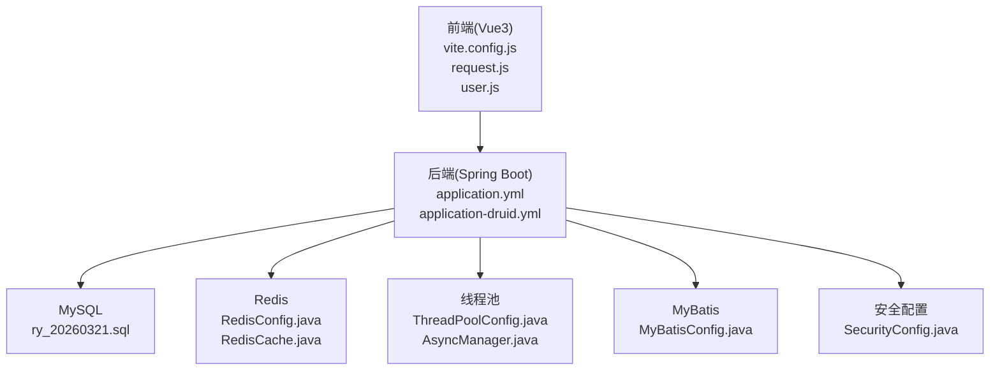
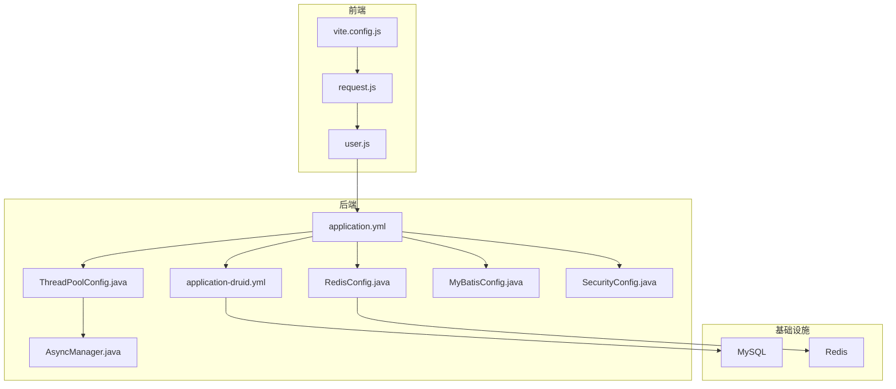
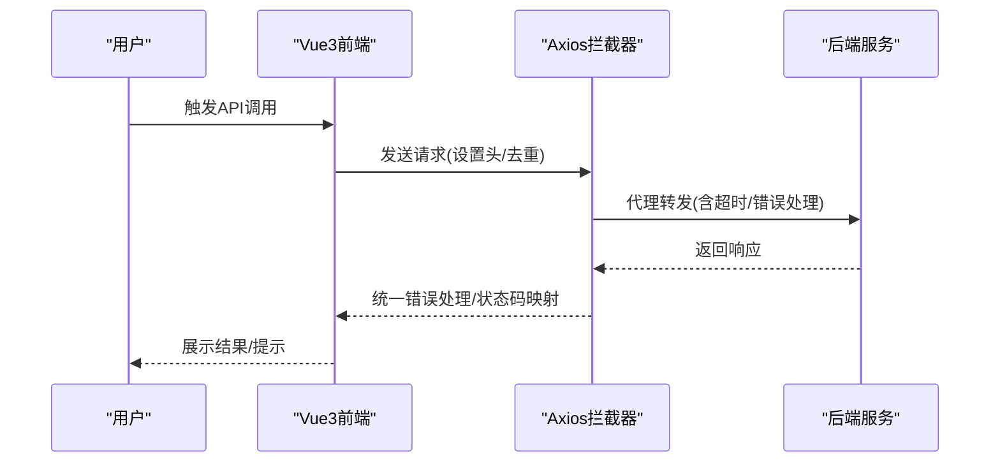
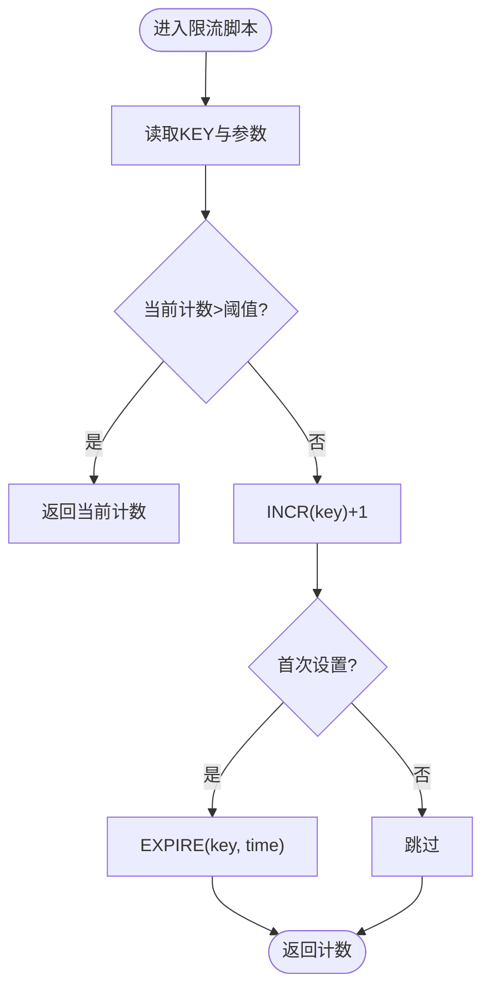
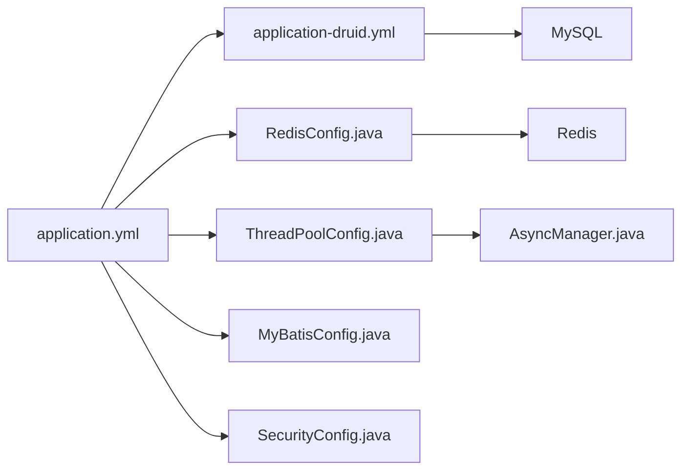

# 性能优化

<cite>
**本文引用的文件**
- [application.yml](file://XingChen-Vue/xingchen-admin/src/main/resources/application.yml)
- [application-druid.yml](file://XingChen-Vue/xingchen-admin/src/main/resources/application-druid.yml)
- [RedisConfig.java](file://XingChen-Vue/xingchen-framework/src/main/java/com/xingchen/framework/config/RedisConfig.java)
- [DruidConfig.java](file://XingChen-Vue/xingchen-framework/src/main/java/com/xingchen/framework/config/DruidConfig.java)
- [DruidProperties.java](file://XingChen-Vue/xingchen-framework/src/main/java/com/xingchen/framework/config/properties/DruidProperties.java)
- [ThreadPoolConfig.java](file://XingChen-Vue/xingchen-framework/src/main/java/com/xingchen/framework/config/ThreadPoolConfig.java)
- [MyBatisConfig.java](file://XingChen-Vue/xingchen-framework/src/main/java/com/xingchen/framework/config/MyBatisConfig.java)
- [RedisCache.java](file://XingChen-Vue/xingchen-common/src/main/java/com/xingchen/common/core/redis/RedisCache.java)
- [AsyncManager.java](file://XingChen-Vue/xingchen-framework/src/main/java/com/xingchen/framework/manager/AsyncManager.java)
- [SecurityConfig.java](file://XingChen-Vue/xingchen-framework/src/main/java/com/xingchen/framework/config/SecurityConfig.java)
- [vite.config.js](file://XingChen-Vue3/vite.config.js)
- [compression.js](file://XingChen-Vue3/vite/plugins/compression.js)
- [request.js](file://XingChen-Vue3/src/utils/request.js)
- [user.js](file://XingChen-Vue3/src/api/system/user.js)
- [ry_20260321.sql](file://XingChen-Vue/sql/ry_20260321.sql)
- [Cpu.java](file://XingChen-Vue/xingchen-framework/src/main/java/com/xingchen/framework/web/domain/server/Cpu.java)
- [SysOperLog.java](file://XingChen-Vue/xingchen-system/src/main/java/com/xingchen/system/domain/SysOperLog.java)
</cite>

## 目录
1. [简介](#简介)
2. [项目结构](#项目结构)
3. [核心组件](#核心组件)
4. [架构总览](#架构总览)
5. [详细组件分析](#详细组件分析)
6. [依赖分析](#依赖分析)
7. [性能考量](#性能考量)
8. [故障排查指南](#故障排查指南)
9. [结论](#结论)
10. [附录](#附录)

## 简介
本技术文档聚焦于健康管理系统在前后端、数据库与缓存方面的性能优化策略，涵盖以下内容：
- 前端构建与运行时优化：打包产物控制、资源压缩、代理与缓存策略
- 后端性能优化：Tomcat线程池、线程池配置、MyBatis配置、Druid连接池与慢SQL监控、Redis缓存配置与限流脚本
- 数据库优化：索引建议、查询性能改进、分页与SQL治理
- 高并发与异步：线程池与异步任务调度、安全无状态认证、负载均衡建议
- 监控与测试：性能指标采集、瓶颈定位方法、基准测试建议

## 项目结构
项目由后端Spring Boot工程与前端Vue3工程组成，后端负责业务逻辑、数据访问与缓存，前端负责UI交互与API调用。

**图表来源**
- [vite.config.js:1-80](file://XingChen-Vue3/vite.config.js#L1-L80)
- [request.js:1-154](file://XingChen-Vue3/src/utils/request.js#L1-L154)
- [user.js:1-137](file://XingChen-Vue3/src/api/system/user.js#L1-L137)
- [application.yml:1-148](file://XingChen-Vue/xingchen-admin/src/main/resources/application.yml#L1-L148)
- [application-druid.yml:1-61](file://XingChen-Vue/xingchen-admin/src/main/resources/application-druid.yml#L1-L61)
- [RedisConfig.java:1-71](file://XingChen-Vue/xingchen-framework/src/main/java/com/xingchen/framework/config/RedisConfig.java#L1-L71)
- [RedisCache.java:1-269](file://XingChen-Vue/xingchen-common/src/main/java/com/xingchen/common/core/redis/RedisCache.java#L1-L269)
- [ThreadPoolConfig.java:1-64](file://XingChen-Vue/xingchen-framework/src/main/java/com/xingchen/framework/config/ThreadPoolConfig.java#L1-L64)
- [AsyncManager.java:1-56](file://XingChen-Vue/xingchen-framework/src/main/java/com/xingchen/framework/manager/AsyncManager.java#L1-L56)
- [MyBatisConfig.java:1-132](file://XingChen-Vue/xingchen-framework/src/main/java/com/xingchen/framework/config/MyBatisConfig.java#L1-L132)
- [SecurityConfig.java:1-129](file://XingChen-Vue/xingchen-framework/src/main/java/com/xingchen/framework/config/SecurityConfig.java#L1-L129)
- [ry_20260321.sql:425-445](file://XingChen-Vue/sql/ry_20260321.sql#L425-L445)

**章节来源**
- [vite.config.js:1-80](file://XingChen-Vue3/vite.config.js#L1-L80)
- [application.yml:1-148](file://XingChen-Vue/xingchen-admin/src/main/resources/application.yml#L1-L148)
- [application-druid.yml:1-61](file://XingChen-Vue/xingchen-admin/src/main/resources/application-druid.yml#L1-L61)

## 核心组件
- 前端构建与运行时
  - 构建输出与分包命名、源码映射、chunk大小告警阈值
  - 代理配置与Swagger/OpenAPI代理
  - 资源压缩插件（Gzip/Brotli）
  - Axios请求拦截与重复提交防护
- 后端配置
  - Tomcat线程池与连接队列
  - Druid连接池参数与慢SQL监控
  - Redis序列化与限流脚本
  - 线程池与异步任务调度
  - MyBatis别名与Mapper扫描
  - 安全无状态认证与跨域过滤

**章节来源**
- [vite.config.js:28-77](file://XingChen-Vue3/vite.config.js#L28-L77)
- [compression.js:1-29](file://XingChen-Vue3/vite/plugins/compression.js#L1-L29)
- [request.js:23-73](file://XingChen-Vue3/src/utils/request.js#L23-L73)
- [application.yml:17-33](file://XingChen-Vue/xingchen-admin/src/main/resources/application.yml#L17-L33)
- [application-druid.yml:19-41](file://XingChen-Vue/xingchen-admin/src/main/resources/application-druid.yml#L19-L41)
- [RedisConfig.java:22-41](file://XingChen-Vue/xingchen-framework/src/main/java/com/xingchen/framework/config/RedisConfig.java#L22-L41)
- [ThreadPoolConfig.java:32-43](file://XingChen-Vue/xingchen-framework/src/main/java/com/xingchen/framework/config/ThreadPoolConfig.java#L32-L43)
- [MyBatisConfig.java:116-131](file://XingChen-Vue/xingchen-framework/src/main/java/com/xingchen/framework/config/MyBatisConfig.java#L116-L131)
- [SecurityConfig.java:86-118](file://XingChen-Vue/xingchen-framework/src/main/java/com/xingchen/framework/config/SecurityConfig.java#L86-L118)

## 架构总览
后端以Spring Boot为核心，集成Druid连接池、Redis缓存、MyBatis、线程池与安全无状态认证；前端通过Vite构建，Axios统一处理请求与响应，支持Gzip/Brotli压缩与代理。

**图表来源**
- [vite.config.js:1-80](file://XingChen-Vue3/vite.config.js#L1-L80)
- [request.js:1-154](file://XingChen-Vue3/src/utils/request.js#L1-L154)
- [user.js:1-137](file://XingChen-Vue3/src/api/system/user.js#L1-L137)
- [application.yml:1-148](file://XingChen-Vue/xingchen-admin/src/main/resources/application.yml#L1-L148)
- [application-druid.yml:1-61](file://XingChen-Vue/xingchen-admin/src/main/resources/application-druid.yml#L1-L61)
- [RedisConfig.java:1-71](file://XingChen-Vue/xingchen-framework/src/main/java/com/xingchen/framework/config/RedisConfig.java#L1-L71)
- [ThreadPoolConfig.java:1-64](file://XingChen-Vue/xingchen-framework/src/main/java/com/xingchen/framework/config/ThreadPoolConfig.java#L1-L64)
- [AsyncManager.java:1-56](file://XingChen-Vue/xingchen-framework/src/main/java/com/xingchen/framework/manager/AsyncManager.java#L1-L56)
- [MyBatisConfig.java:1-132](file://XingChen-Vue/xingchen-framework/src/main/java/com/xingchen/framework/config/MyBatisConfig.java#L1-L132)
- [SecurityConfig.java:1-129](file://XingChen-Vue/xingchen-framework/src/main/java/com/xingchen/framework/config/SecurityConfig.java#L1-L129)

## 详细组件分析

### 前端性能优化
- 构建与产物
  - 输出目录与文件命名规则，避免过大chunk导致加载延迟
  - 关闭生产环境源码映射，减少体积与解析开销
  - 调整chunk大小告警阈值，提前发现潜在问题
- 资源压缩
  - 支持Gzip与Brotli两种压缩算法，按需启用
- 代理与缓存
  - 本地开发代理到后端服务，避免跨域与二次转发
  - Swagger/OpenAPI路径代理，便于文档调试
- 请求拦截与去重
  - 统一设置Content-Type与超时
  - 防重复提交：基于请求URL、数据与时间窗口的简单去重

**图表来源**
- [request.js:16-73](file://XingChen-Vue3/src/utils/request.js#L16-L73)
- [request.js:75-124](file://XingChen-Vue3/src/utils/request.js#L75-L124)
- [vite.config.js:48-60](file://XingChen-Vue3/vite.config.js#L48-L60)

**章节来源**
- [vite.config.js:28-77](file://XingChen-Vue3/vite.config.js#L28-L77)
- [compression.js:1-29](file://XingChen-Vue3/vite/plugins/compression.js#L1-L29)
- [request.js:14-21](file://XingChen-Vue3/src/utils/request.js#L14-L21)
- [request.js:41-68](file://XingChen-Vue3/src/utils/request.js#L41-L68)

### 后端性能优化

#### Tomcat线程池与连接队列
- 最大线程数、最小空闲线程、接受队列长度与URI编码
- 适配高并发请求，避免排队过长导致超时

**章节来源**
- [application.yml:17-33](file://XingChen-Vue/xingchen-admin/src/main/resources/application.yml#L17-L33)

#### Druid连接池与慢SQL监控
- 连接池初始大小、最小/最大空闲、最大活跃、等待超时、连接与socket超时
- 空闲连接驱逐周期、最小/最大存活时间
- 慢SQL记录阈值与统计聚合，便于识别热点SQL

**章节来源**
- [application-druid.yml:19-61](file://XingChen-Vue/xingchen-admin/src/main/resources/application-druid.yml#L19-L61)
- [DruidProperties.java:54-88](file://XingChen-Vue/xingchen-framework/src/main/java/com/xingchen/framework/config/properties/DruidProperties.java#L54-L88)

#### Redis缓存配置与限流脚本
- 序列化策略：Key使用字符串序列化，Value使用JSON序列化
- 限流脚本：基于Lua的原子计数与过期控制，适合令牌桶/滑动窗口场景

**图表来源**
- [RedisConfig.java:44-69](file://XingChen-Vue/xingchen-framework/src/main/java/com/xingchen/framework/config/RedisConfig.java#L44-L69)

**章节来源**
- [RedisConfig.java:22-41](file://XingChen-Vue/xingchen-framework/src/main/java/com/xingchen/framework/config/RedisConfig.java#L22-L41)
- [RedisConfig.java:44-69](file://XingChen-Vue/xingchen-framework/src/main/java/com/xingchen/framework/config/RedisConfig.java#L44-L69)
- [RedisCache.java:23-269](file://XingChen-Vue/xingchen-common/src/main/java/com/xingchen/common/core/redis/RedisCache.java#L23-L269)

#### 线程池与异步任务调度
- 核心线程数、最大线程数、队列容量、空闲存活时间
- 拒绝策略：调用方执行，避免丢弃任务
- 定时任务线程池：守护线程命名与异常打印

**章节来源**
- [ThreadPoolConfig.java:20-43](file://XingChen-Vue/xingchen-framework/src/main/java/com/xingchen/framework/config/ThreadPoolConfig.java#L20-L43)
- [ThreadPoolConfig.java:48-62](file://XingChen-Vue/xingchen-framework/src/main/java/com/xingchen/framework/config/ThreadPoolConfig.java#L48-L62)
- [AsyncManager.java:14-56](file://XingChen-Vue/xingchen-framework/src/main/java/com/xingchen/framework/manager/AsyncManager.java#L14-L56)

#### MyBatis配置
- 自动扫描别名包与Mapper XML位置，提升开发效率与可维护性

**章节来源**
- [MyBatisConfig.java:116-131](file://XingChen-Vue/xingchen-framework/src/main/java/com/xingchen/framework/config/MyBatisConfig.java#L116-L131)

#### 安全无状态认证
- 基于JWT的无状态认证，禁用CSRF与Session，配合CORS过滤器

**章节来源**
- [SecurityConfig.java:86-118](file://XingChen-Vue/xingchen-framework/src/main/java/com/xingchen/framework/config/SecurityConfig.java#L86-L118)

### 数据库优化技巧与索引建议
- 索引现状
  - 操作日志表包含业务类型、状态、操作时间等字段的索引，有利于按维度查询与排序
- 建议
  - 针对高频查询条件建立复合索引，避免全表扫描
  - 分页查询使用覆盖索引，减少回表
  - 定期分析慢SQL，结合Druid慢日志定位热点

**章节来源**
- [ry_20260321.sql:425-445](file://XingChen-Vue/sql/ry_20260321.sql#L425-L445)
- [application-druid.yml:55-57](file://XingChen-Vue/xingchen-admin/src/main/resources/application-druid.yml#L55-L57)

### 缓存机制设计
- 缓存类型与使用
  - 支持String、List、Set、Hash多种数据结构，满足不同业务场景
  - 提供过期时间设置与批量操作接口
- 设计要点
  - 缓存粒度：热点数据与读多写少场景优先
  - 更新策略：写时失效或延时双删，避免脏读
  - 降级：缓存不可用时快速失败或熔断

**章节来源**
- [RedisCache.java:23-269](file://XingChen-Vue/xingchen-common/src/main/java/com/xingchen/common/core/redis/RedisCache.java#L23-L269)

### 高并发处理与负载均衡
- 无状态认证：基于Token，便于横向扩展
- 线程池：合理配置核心/最大线程与队列，避免雪崩
- 负载均衡：多实例部署，结合Nginx/SLB轮询或加权轮询

**章节来源**
- [SecurityConfig.java:96-98](file://XingChen-Vue/xingchen-framework/src/main/java/com/xingchen/framework/config/SecurityConfig.java#L96-L98)
- [ThreadPoolConfig.java:32-43](file://XingChen-Vue/xingchen-framework/src/main/java/com/xingchen/framework/config/ThreadPoolConfig.java#L32-L43)

### 异步任务调度
- 使用ScheduledExecutorService执行定时/周期性任务
- 异常兜底：afterExecute中统一打印异常，便于排查

**章节来源**
- [ThreadPoolConfig.java:48-62](file://XingChen-Vue/xingchen-framework/src/main/java/com/xingchen/framework/config/ThreadPoolConfig.java#L48-L62)
- [AsyncManager.java:43-46](file://XingChen-Vue/xingchen-framework/src/main/java/com/xingchen/framework/manager/AsyncManager.java#L43-L46)

## 依赖分析
后端组件之间的耦合关系如下：

**图表来源**
- [application.yml:1-148](file://XingChen-Vue/xingchen-admin/src/main/resources/application.yml#L1-L148)
- [application-druid.yml:1-61](file://XingChen-Vue/xingchen-admin/src/main/resources/application-druid.yml#L1-L61)
- [RedisConfig.java:1-71](file://XingChen-Vue/xingchen-framework/src/main/java/com/xingchen/framework/config/RedisConfig.java#L1-L71)
- [ThreadPoolConfig.java:1-64](file://XingChen-Vue/xingchen-framework/src/main/java/com/xingchen/framework/config/ThreadPoolConfig.java#L1-L64)
- [MyBatisConfig.java:1-132](file://XingChen-Vue/xingchen-framework/src/main/java/com/xingchen/framework/config/MyBatisConfig.java#L1-L132)
- [SecurityConfig.java:1-129](file://XingChen-Vue/xingchen-framework/src/main/java/com/xingchen/framework/config/SecurityConfig.java#L1-L129)

**章节来源**
- [application.yml:1-148](file://XingChen-Vue/xingchen-admin/src/main/resources/application.yml#L1-L148)
- [application-druid.yml:1-61](file://XingChen-Vue/xingchen-admin/src/main/resources/application-druid.yml#L1-L61)
- [RedisConfig.java:1-71](file://XingChen-Vue/xingchen-framework/src/main/java/com/xingchen/framework/config/RedisConfig.java#L1-L71)
- [ThreadPoolConfig.java:1-64](file://XingChen-Vue/xingchen-framework/src/main/java/com/xingchen/framework/config/ThreadPoolConfig.java#L1-L64)
- [MyBatisConfig.java:1-132](file://XingChen-Vue/xingchen-framework/src/main/java/com/xingchen/framework/config/MyBatisConfig.java#L1-L132)
- [SecurityConfig.java:1-129](file://XingChen-Vue/xingchen-framework/src/main/java/com/xingchen/framework/config/SecurityConfig.java#L1-L129)

## 性能考量
- 前端
  - 构建阶段启用压缩，减少传输体积
  - 合理拆分chunk，结合路由懒加载进一步优化首屏
  - 代理仅用于开发，生产环境由网关/CDN统一处理
- 后端
  - 连接池参数与线程池参数需结合压测结果迭代
  - Redis序列化选择与Key设计影响内存与CPU
  - MyBatis映射与分页插件需避免N+1与全表扫描
- 监控
  - Druid慢SQL与统计视图
  - 操作日志表cost_time字段可用于接口耗时分析
  - 服务器CPU使用率指标辅助判断CPU瓶颈

**章节来源**
- [application-druid.yml:55-57](file://XingChen-Vue/xingchen-admin/src/main/resources/application-druid.yml#L55-L57)
- [SysOperLog.java:88-159](file://XingChen-Vue/xingchen-system/src/main/java/com/xingchen/system/domain/SysOperLog.java#L88-L159)
- [Cpu.java:1-101](file://XingChen-Vue/xingchen-framework/src/main/java/com/xingchen/framework/web/domain/server/Cpu.java#L1-L101)

## 故障排查指南
- 前端
  - 请求超时：检查Axios超时与后端响应时间
  - 重复提交：确认去重逻辑与时间窗口设置
  - 下载异常：校验Blob校验与错误分支处理
- 后端
  - 连接池耗尽：查看最大活跃与等待超时，结合慢SQL定位
  - 缓存异常：确认序列化器与Key空间设计
  - 线程池拒绝：调整拒绝策略或扩容线程池
  - 安全拦截：核对放行路径与CORS配置

**章节来源**
- [request.js:111-124](file://XingChen-Vue3/src/utils/request.js#L111-L124)
- [request.js:126-151](file://XingChen-Vue3/src/utils/request.js#L126-L151)
- [application-druid.yml:24-41](file://XingChen-Vue/xingchen-admin/src/main/resources/application-druid.yml#L24-L41)
- [RedisConfig.java:22-41](file://XingChen-Vue/xingchen-framework/src/main/java/com/xingchen/framework/config/RedisConfig.java#L22-L41)
- [ThreadPoolConfig.java:40-42](file://XingChen-Vue/xingchen-framework/src/main/java/com/xingchen/framework/config/ThreadPoolConfig.java#L40-L42)
- [SecurityConfig.java:100-117](file://XingChen-Vue/xingchen-framework/src/main/java/com/xingchen/framework/config/SecurityConfig.java#L100-L117)

## 结论
通过前端构建优化、后端连接池与线程池调优、Redis缓存与限流策略、以及数据库索引与慢SQL治理，系统可在高并发场景下保持稳定与高性能。建议持续结合监控指标与压测结果迭代参数，逐步完善异步任务与负载均衡策略。

## 附录
- 性能测试方法
  - 前端：Vite构建产物体积与首屏时间测量，结合浏览器开发者工具
  - 后端：JMeter/Locust压测，关注吞吐量、P99延迟与错误率
- 基准测试建议
  - 前端：对比开启/关闭压缩的传输体积与加载时间
  - 后端：逐步调整连接池与线程池参数，观察QPS与CPU使用率变化