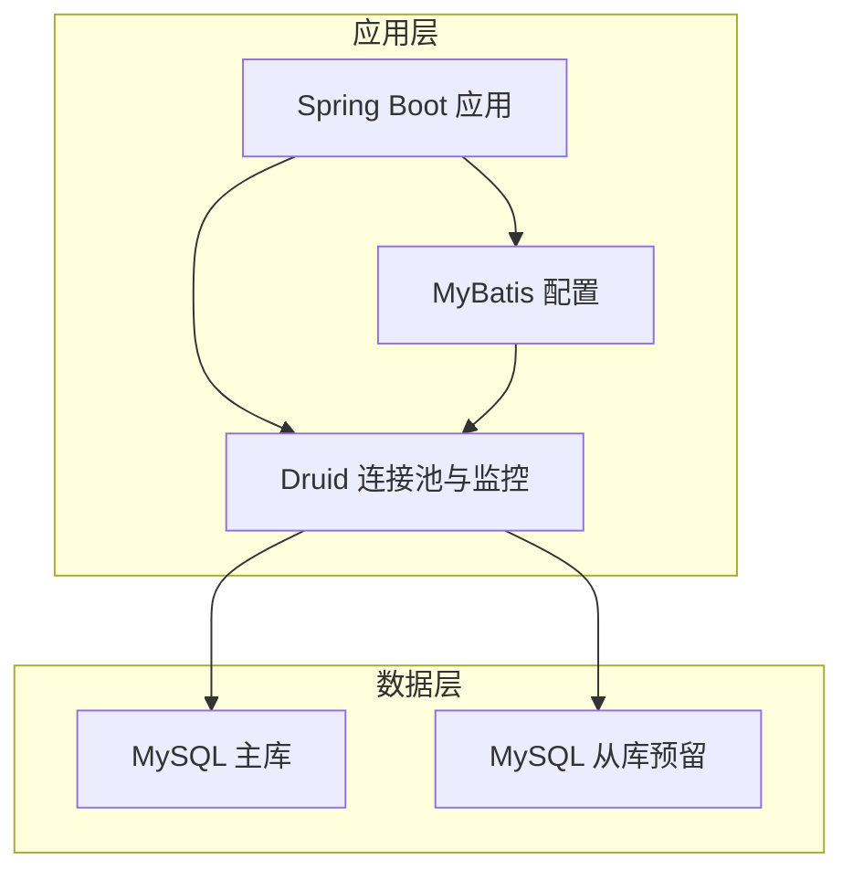
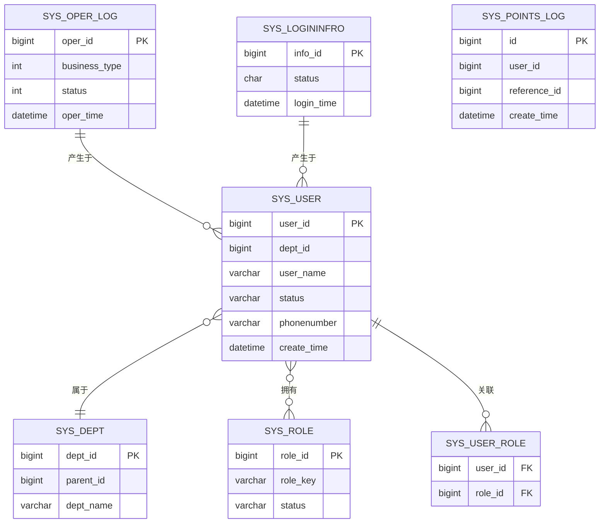
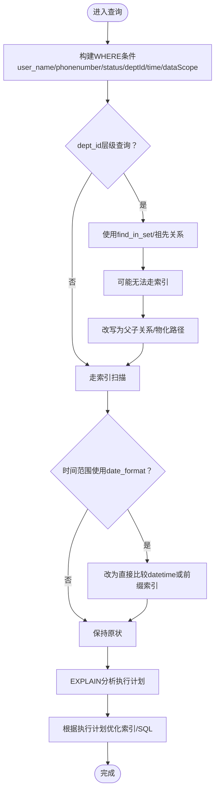
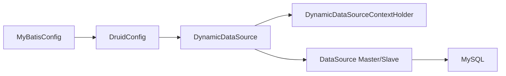

# 数据库优化

<cite>
**本文引用的文件**
- [application.yml](file://XingChen-Vue/xingchen-admin/src/main/resources/application.yml)
- [application-druid.yml](file://XingChen-Vue/xingchen-admin/src/main/resources/application-druid.yml)
- [mybatis-config.xml](file://XingChen-Vue/xingchen-admin/src/main/resources/mybatis/mybatis-config.xml)
- [DruidConfig.java](file://XingChen-Vue/xingchen-framework/src/main/java/com/xingchen/framework/config/DruidConfig.java)
- [MyBatisConfig.java](file://XingChen-Vue/xingchen-framework/src/main/java/com/xingchen/framework/config/MyBatisConfig.java)
- [DynamicDataSource.java](file://XingChen-Vue/xingchen-framework/src/main/java/com/xingchen/framework/datasource/DynamicDataSource.java)
- [DynamicDataSourceContextHolder.java](file://XingChen-Vue/xingchen-framework/src/main/java/com/xingchen/framework/datasource/DynamicDataSourceContextHolder.java)
- [SysUserMapper.xml](file://XingChen-Vue/xingchen-system/src/main/resources/mapper/system/SysUserMapper.xml)
- [SysOperLogMapper.xml](file://XingChen-Vue/xingchen-system/src/main/resources/mapper/system/SysOperLogMapper.xml)
- [SysPointsLogMapper.xml](file://XingChen-Vue/xingchen-system/src/main/resources/mapper/system/SysPointsLogMapper.xml)
- [ry_20260321.sql](file://XingChen-Vue/sql/ry_20260321.sql)
- [quartz.sql](file://XingChen-Vue/sql/quartz.sql)
- [points_log.sql](file://XingChen-Vue/sql/points_log.sql)
</cite>

## 目录
1. [简介](#简介)
2. [项目结构](#项目结构)
3. [核心组件](#核心组件)
4. [架构总览](#架构总览)
5. [详细组件分析](#详细组件分析)
6. [依赖分析](#依赖分析)
7. [性能考量](#性能考量)
8. [故障排查指南](#故障排查指南)
9. [结论](#结论)
10. [附录](#附录)

## 简介
本文件面向健康管理系统后端数据库性能优化，结合现有配置与SQL建模，系统性梳理MySQL性能优化策略，覆盖表结构设计、索引优化、查询语句优化、慢查询与执行计划分析、连接池与事务优化、锁机制、分区与读写分离、监控指标、备份与容量规划、高可用架构等主题，并提供可落地的实践建议与优化方案。

## 项目结构
项目采用Spring Boot + MyBatis + Druid + 多数据源（动态路由）的架构，数据库层通过Druid连接池与监控，MyBatis负责SQL映射与分页，系统包含基础业务表（用户、角色、菜单、日志等）与积分流水表等。

图示来源
- [application.yml:49-148](file://XingChen-Vue/xingchen-admin/src/main/resources/application.yml#L49-L148)
- [application-druid.yml:1-61](file://XingChen-Vue/xingchen-admin/src/main/resources/application-druid.yml#L1-L61)
- [DruidConfig.java:32-79](file://XingChen-Vue/xingchen-framework/src/main/java/com/xingchen/framework/config/DruidConfig.java#L32-L79)
- [MyBatisConfig.java:116-131](file://XingChen-Vue/xingchen-framework/src/main/java/com/xingchen/framework/config/MyBatisConfig.java#L116-L131)

章节来源
- [application.yml:49-148](file://XingChen-Vue/xingchen-admin/src/main/resources/application.yml#L49-L148)
- [application-druid.yml:1-61](file://XingChen-Vue/xingchen-admin/src/main/resources/application-druid.yml#L1-L61)
- [DruidConfig.java:32-79](file://XingChen-Vue/xingchen-framework/src/main/java/com/xingchen/framework/config/DruidConfig.java#L32-L79)
- [MyBatisConfig.java:116-131](file://XingChen-Vue/xingchen-framework/src/main/java/com/xingchen/framework/config/MyBatisConfig.java#L116-L131)

## 核心组件
- 数据源与连接池
  - Druid多数据源配置，支持主库与从库（当前从库开关关闭），连接池参数可调优。
  - Druid监控控制台与慢SQL记录开启，便于定位性能瓶颈。
- MyBatis
  - 自动扫描别名包与Mapper XML，支持PageHelper分页。
- 动态数据源
  - 通过ThreadLocal切换数据源，支持读写分离扩展。
- SQL与索引
  - 基础业务表与积分流水表具备常用索引；日志表具备时间与状态索引，利于查询与清理。

章节来源
- [application-druid.yml:1-61](file://XingChen-Vue/xingchen-admin/src/main/resources/application-druid.yml#L1-L61)
- [DruidConfig.java:32-79](file://XingChen-Vue/xingchen-framework/src/main/java/com/xingchen/framework/config/DruidConfig.java#L32-L79)
- [application.yml:104-118](file://XingChen-Vue/xingchen-admin/src/main/resources/application.yml#L104-L118)
- [mybatis-config.xml:7-18](file://XingChen-Vue/xingchen-admin/src/main/resources/mybatis/mybatis-config.xml#L7-L18)
- [DynamicDataSource.java:12-26](file://XingChen-Vue/xingchen-framework/src/main/java/com/xingchen/framework/datasource/DynamicDataSource.java#L12-L26)
- [DynamicDataSourceContextHolder.java:24-44](file://XingChen-Vue/xingchen-framework/src/main/java/com/xingchen/framework/datasource/DynamicDataSourceContextHolder.java#L24-L44)
- [ry_20260321.sql:439-442](file://XingChen-Vue/sql/ry_20260321.sql#L439-L442)
- [ry_20260321.sql:573-575](file://XingChen-Vue/sql/ry_20260321.sql#L573-L575)
- [points_log.sql:15-16](file://XingChen-Vue/sql/points_log.sql#L15-L16)

## 架构总览
下图展示应用层、数据层与监控的关键交互，体现连接池、动态数据源与慢SQL监控的协同。

```mermaid
sequenceDiagram
participant Client as "客户端"
participant Controller as "业务控制器"
participant Mapper as "MyBatis Mapper"
participant DS as "动态数据源"
participant Pool as "Druid连接池"
participant DB as "MySQL"
Client->>Controller : 发起请求
Controller->>Mapper : 调用SQL
Mapper->>DS : 获取数据源上下文
DS->>Pool : 申请连接
Pool->>DB : 执行SQL
DB-->>Pool : 返回结果
Pool-->>Mapper : 返回连接
Mapper-->>Controller : 返回结果
Controller-->>Client : 响应
```

图示来源
- [MyBatisConfig.java:116-131](file://XingChen-Vue/xingchen-framework/src/main/java/com/xingchen/framework/config/MyBatisConfig.java#L116-L131)
- [DruidConfig.java:52-60](file://XingChen-Vue/xingchen-framework/src/main/java/com/xingchen/framework/config/DruidConfig.java#L52-L60)
- [application-druid.yml:44-58](file://XingChen-Vue/xingchen-admin/src/main/resources/application-druid.yml#L44-L58)

## 详细组件分析

### 表结构与索引设计
- 基础业务表（用户、角色、菜单、日志等）
  - sys_user：主键user_id，常用查询条件含user_name、status、phonenumber、dept_id、create_time等，建议对高频过滤字段建立合适索引。
  - sys_oper_log：包含business_type、status、oper_time等索引，适合按时间与状态筛选。
  - sys_logininfor：包含status、login_time索引，适合登录日志查询与清理。
- 积分流水表（sys_points_log）
  - 主键id，user_id与reference_id建立索引，适合按用户与业务引用ID查询。
- Quartz调度表
  - QRTZ_TRIGGERS、QRTZ_JOB_DETAILS等，包含调度状态、时间字段，适合定时任务查询与状态跟踪。

图示来源
- [ry_20260321.sql:42-64](file://XingChen-Vue/sql/ry_20260321.sql#L42-L64)
- [ry_20260321.sql:104-121](file://XingChen-Vue/sql/ry_20260321.sql#L104-L121)
- [ry_20260321.sql:133-156](file://XingChen-Vue/sql/ry_20260321.sql#L133-L156)
- [ry_20260321.sql:419-442](file://XingChen-Vue/sql/ry_20260321.sql#L419-L442)
- [ry_20260321.sql:561-575](file://XingChen-Vue/sql/ry_20260321.sql#L561-L575)
- [points_log.sql:5-17](file://XingChen-Vue/sql/points_log.sql#L5-L17)

章节来源
- [ry_20260321.sql:42-64](file://XingChen-Vue/sql/ry_20260321.sql#L42-L64)
- [ry_20260321.sql:104-121](file://XingChen-Vue/sql/ry_20260321.sql#L104-L121)
- [ry_20260321.sql:133-156](file://XingChen-Vue/sql/ry_20260321.sql#L133-L156)
- [ry_20260321.sql:419-442](file://XingChen-Vue/sql/ry_20260321.sql#L419-L442)
- [ry_20260321.sql:561-575](file://XingChen-Vue/sql/ry_20260321.sql#L561-L575)
- [points_log.sql:5-17](file://XingChen-Vue/sql/points_log.sql#L5-L17)

### 查询语句优化与执行计划分析
- 用户列表查询（SysUserMapper）
  - 关注条件：user_name模糊匹配、status精确匹配、phonenumber模糊匹配、dept_id层级查询、时间范围过滤、数据范围过滤。
  - 建议：
    - 对user_name、status、phonenumber建立复合索引或单独索引，视命中率调整。
    - dept_id层级查询使用find_in_set可能无法走索引，建议评估将祖先关系拆分为父子关系表或物化路径，减少函数与通配符。
    - 时间范围使用date_format会阻断索引，建议改为直接比较datetime字段或使用前缀索引。
- 操作日志查询（SysOperLogMapper）
  - 关注条件：oper_ip、title、business_type、status、oper_name、oper_time范围。
  - 建议：
    - oper_time建立索引，避免范围扫描。
    - business_type与status建立联合索引，提高过滤效率。
- 积分流水查询（SysPointsLogMapper）
  - 关注条件：user_id、operate_type、source_type、reference_id、create_time范围。
  - 建议：
    - user_id与reference_id已有索引，确保查询命中。
    - create_time范围查询建议使用前缀索引或分区表。

图示来源
- [SysUserMapper.xml:60-87](file://XingChen-Vue/xingchen-system/src/main/resources/mapper/system/SysUserMapper.xml#L60-L87)
- [SysOperLogMapper.xml:37-69](file://XingChen-Vue/xingchen-system/src/main/resources/mapper/system/SysOperLogMapper.xml#L37-L69)
- [SysPointsLogMapper.xml:22-38](file://XingChen-Vue/xingchen-system/src/main/resources/mapper/system/SysPointsLogMapper.xml#L22-L38)

章节来源
- [SysUserMapper.xml:60-87](file://XingChen-Vue/xingchen-system/src/main/resources/mapper/system/SysUserMapper.xml#L60-L87)
- [SysOperLogMapper.xml:37-69](file://XingChen-Vue/xingchen-system/src/main/resources/mapper/system/SysOperLogMapper.xml#L37-L69)
- [SysPointsLogMapper.xml:22-38](file://XingChen-Vue/xingchen-system/src/main/resources/mapper/system/SysPointsLogMapper.xml#L22-L38)

### 慢查询分析与监控
- Druid慢SQL记录
  - 已开启stat日志与慢SQL阈值，便于定位慢查询。
- 监控入口
  - 控制台路径与登录凭据在配置中定义，可用于查看SQL统计与慢查询明细。
- 建议
  - 将慢SQL阈值与合并SQL策略纳入运维基线，定期巡检。
  - 结合业务高峰期与低谷期对比慢查询趋势。

章节来源
- [application-druid.yml:54-58](file://XingChen-Vue/xingchen-admin/src/main/resources/application-druid.yml#L54-L58)
- [application-druid.yml:44-51](file://XingChen-Vue/xingchen-admin/src/main/resources/application-druid.yml#L44-L51)

### 连接池配置与事务优化
- 连接池参数
  - 初始连接、最小/最大空闲、最大活跃、获取连接超时、连接超时、socket超时、空闲回收周期等。
- 事务优化
  - 合理设置事务隔离级别，避免长事务持有锁。
  - 批量操作使用批处理，减少往返与锁竞争。
- 建议
  - 根据QPS与并发线程数调整maxActive与maxWait，避免连接池耗尽。
  - 对只读查询考虑从库（当前从库未启用，可按需开启）。

章节来源
- [application-druid.yml:19-36](file://XingChen-Vue/xingchen-admin/src/main/resources/application-druid.yml#L19-L36)
- [application.yml:104-118](file://XingChen-Vue/xingchen-admin/src/main/resources/application.yml#L104-L118)

### 锁机制分析
- 表级锁与行级锁
  - InnoDB默认行锁，热点行/页争用会导致锁等待。
- 写入热点
  - 高频写入表（如日志、积分流水）建议分区分片，降低锁粒度。
- 建议
  - 识别热点主键与索引，必要时引入自增步长或分片键。
  - 对批量写入使用事务合并提交，减少锁持有时间。

章节来源
- [ry_20260321.sql:419-442](file://XingChen-Vue/sql/ry_20260321.sql#L419-L442)
- [points_log.sql:5-17](file://XingChen-Vue/sql/points_log.sql#L5-L17)

### 分区表设计
- 适用场景
  - 日志类表（sys_oper_log、sys_logininfor）按时间分区，便于归档与清理。
- 设计要点
  - 选择分区键（如oper_time、login_time），保证查询常带分区键谓词。
  - 分区粒度与归档策略匹配业务生命周期。
- 建议
  - 新建表时即考虑分区；存量表可通过在线DDL或重建表迁移。

章节来源
- [ry_20260321.sql:419-442](file://XingChen-Vue/sql/ry_20260321.sql#L419-L442)
- [ry_20260321.sql:561-575](file://XingChen-Vue/sql/ry_20260321.sql#L561-L575)

### 读写分离配置
- 当前状态
  - 从库配置存在但未启用，动态数据源具备扩展能力。
- 实施步骤
  - 启用从库配置，区分读写路由规则（如基于注解或数据源上下文）。
  - 对只读查询自动路由至从库，写操作路由至主库。
- 建议
  - 读写分离需考虑最终一致性窗口，对强一致场景谨慎使用。

章节来源
- [application-druid.yml:12-18](file://XingChen-Vue/xingchen-admin/src/main/resources/application-druid.yml#L12-L18)
- [DruidConfig.java:43-50](file://XingChen-Vue/xingchen-framework/src/main/java/com/xingchen/framework/config/DruidConfig.java#L43-L50)
- [DynamicDataSource.java:21-25](file://XingChen-Vue/xingchen-framework/src/main/java/com/xingchen/framework/datasource/DynamicDataSource.java#L21-L25)

### 数据库监控指标
- 连接池指标
  - 活跃连接数、空闲连接数、等待时间、获取超时次数。
- SQL指标
  - QPS、慢SQL数量与占比、平均执行时间、错误率。
- 建议
  - 通过Druid控制台与外部监控系统（如Prometheus/Grafana）联动，建立告警阈值。

章节来源
- [application-druid.yml:44-58](file://XingChen-Vue/xingchen-admin/src/main/resources/application-druid.yml#L44-L58)

### 备份策略、容量规划与高可用
- 备份策略
  - 全量+增量备份，结合binlog归档，支持点恢复。
- 容量规划
  - 基于日志表增长速率估算归档与清理策略，预留冷数据存储。
- 高可用
  - 主从复制、读写分离、分库分表（未来演进方向）。
- 建议
  - 制定备份演练计划，定期验证RTO/RPO。

章节来源
- [quartz.sql:16-52](file://XingChen-Vue/sql/quartz.sql#L16-L52)

## 依赖分析
- 组件耦合
  - MyBatis依赖数据源配置；DruidConfig提供动态数据源；DynamicDataSource通过ThreadLocal切换数据源。
- 外部依赖
  - MySQL驱动、MyBatis、PageHelper、Quartz等。

图示来源
- [MyBatisConfig.java:116-131](file://XingChen-Vue/xingchen-framework/src/main/java/com/xingchen/framework/config/MyBatisConfig.java#L116-L131)
- [DruidConfig.java:52-60](file://XingChen-Vue/xingchen-framework/src/main/java/com/xingchen/framework/config/DruidConfig.java#L52-L60)
- [DynamicDataSource.java:21-25](file://XingChen-Vue/xingchen-framework/src/main/java/com/xingchen/framework/datasource/DynamicDataSource.java#L21-L25)
- [DynamicDataSourceContextHolder.java:24-44](file://XingChen-Vue/xingchen-framework/src/main/java/com/xingchen/framework/datasource/DynamicDataSourceContextHolder.java#L24-L44)

章节来源
- [MyBatisConfig.java:116-131](file://XingChen-Vue/xingchen-framework/src/main/java/com/xingchen/framework/config/MyBatisConfig.java#L116-L131)
- [DruidConfig.java:52-60](file://XingChen-Vue/xingchen-framework/src/main/java/com/xingchen/framework/config/DruidConfig.java#L52-L60)
- [DynamicDataSource.java:21-25](file://XingChen-Vue/xingchen-framework/src/main/java/com/xingchen/framework/datasource/DynamicDataSource.java#L21-L25)
- [DynamicDataSourceContextHolder.java:24-44](file://XingChen-Vue/xingchen-framework/src/main/java/com/xingchen/framework/datasource/DynamicDataSourceContextHolder.java#L24-L44)

## 性能考量
- 索引设计
  - 高频过滤字段建立索引；避免在索引列使用函数或通配符；合理使用复合索引。
- 查询优化
  - 减少SELECT *；避免隐式转换；使用LIMIT与分页；尽量命中索引。
- 连接池与事务
  - 合理设置连接池参数；短事务优先；批量写入合并提交。
- 监控与压测
  - 建立慢SQL基线；定期压测；关注锁等待与死锁指标。

## 故障排查指南
- 常见问题
  - 查询慢：使用EXPLAIN核对执行计划，确认索引使用情况。
  - 连接池耗尽：检查maxActive与maxWait，排查长事务与未释放连接。
  - 读写冲突：识别热点表与热点键，评估分区分片。
- 工具与入口
  - Druid控制台、慢SQL日志、业务日志与数据库慢查询日志。

章节来源
- [application-druid.yml:44-58](file://XingChen-Vue/xingchen-admin/src/main/resources/application-druid.yml#L44-L58)
- [SysUserMapper.xml:60-87](file://XingChen-Vue/xingchen-system/src/main/resources/mapper/system/SysUserMapper.xml#L60-L87)

## 结论
本项目已具备完善的连接池与监控基础，建议在现有基础上推进：
- 针对高频查询字段补齐索引，规避函数与通配符导致的索引失效。
- 对日志类表实施时间分区，配合清理策略降低膨胀。
- 评估启用从库与读写分离，缓解写压力。
- 建立慢SQL基线与压测体系，持续优化执行计划与SQL质量。

## 附录
- 关键配置位置
  - 数据源与连接池：application-druid.yml
  - MyBatis全局设置：mybatis-config.xml
  - 动态数据源：DruidConfig.java、DynamicDataSource.java、DynamicDataSourceContextHolder.java
- 关键SQL与索引
  - 用户与日志：SysUserMapper.xml、SysOperLogMapper.xml
  - 积分流水：SysPointsLogMapper.xml
  - 基础表结构：ry_20260321.sql
  - 调度表：quartz.sql
  - 积分表：points_log.sql