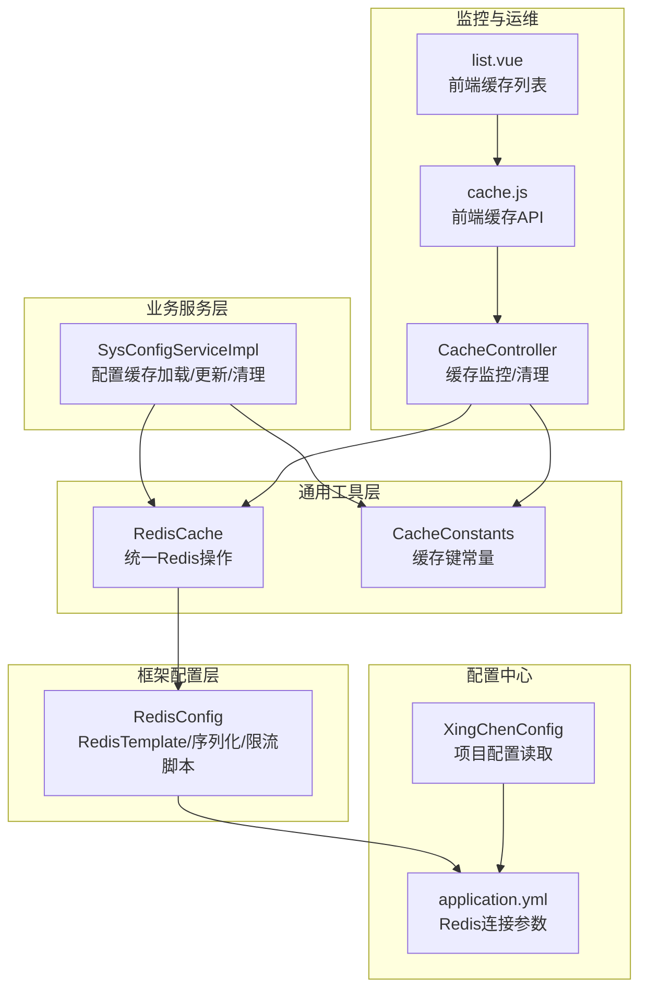
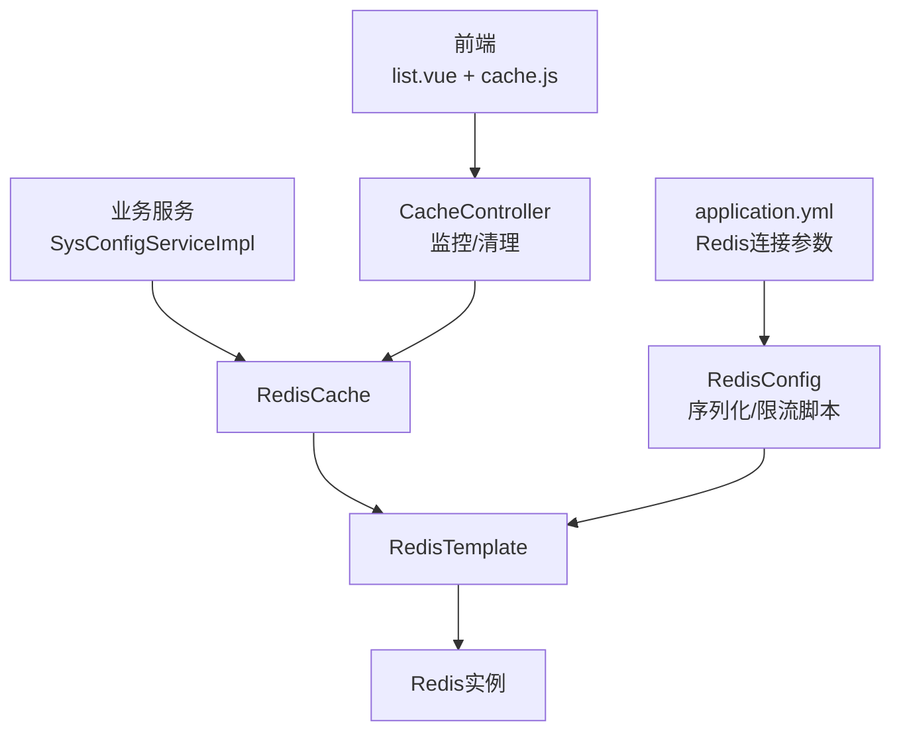
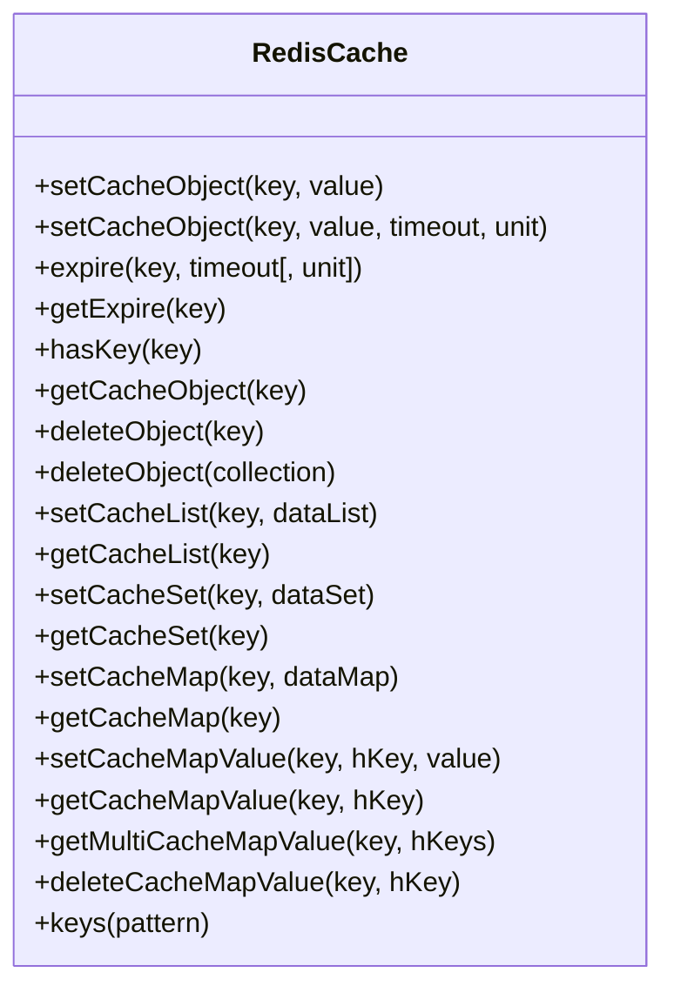
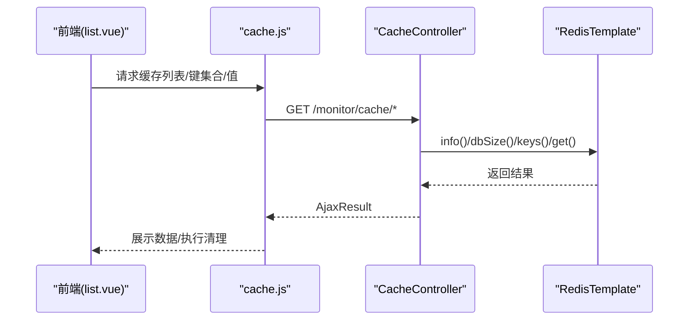
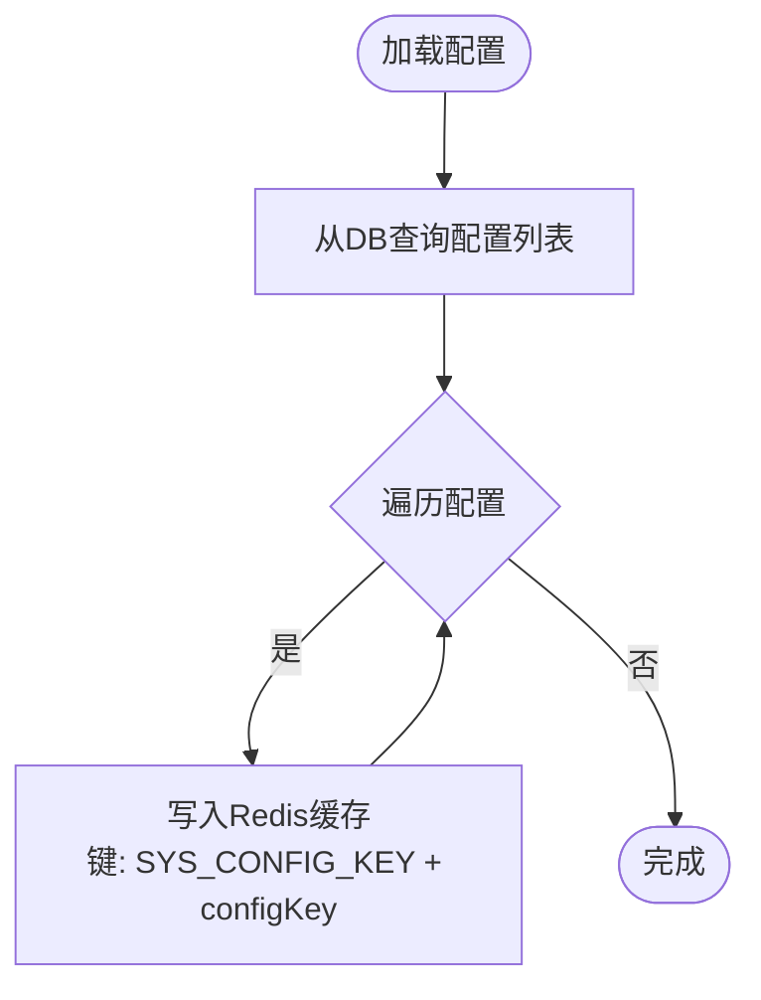
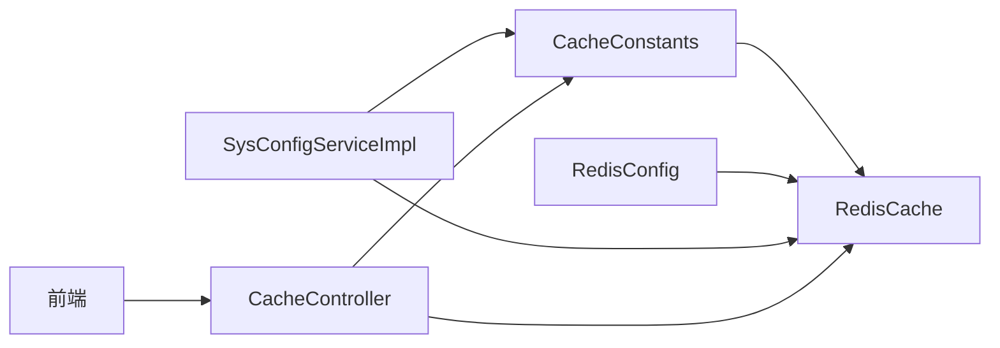

# 缓存策略设计

<cite>
**本文引用的文件**   
- [RedisCache.java](file://XingChen-Vue/xingchen-common/src/main/java/com/xingchen/common/core/redis/RedisCache.java)
- [CacheConstants.java](file://XingChen-Vue/xingchen-common/src/main/java/com/xingchen/common/constant/CacheConstants.java)
- [RedisConfig.java](file://XingChen-Vue/xingchen-framework/src/main/java/com/xingchen/framework/config/RedisConfig.java)
- [CacheController.java](file://XingChen-Vue/xingchen-admin/src/main/java/com/xingchen/web/controller/monitor/CacheController.java)
- [SysCache.java](file://XingChen-Vue/xingchen-system/src/main/java/com/xingchen/system/domain/SysCache.java)
- [application.yml](file://XingChen-Vue/xingchen-admin/src/main/resources/application.yml)
- [SysConfigServiceImpl.java](file://XingChen-Vue/xingchen-system/src/main/java/com/xingchen/system/service/impl/SysConfigServiceImpl.java)
- [cache.js](file://XingChen-Vue3/src/api/monitor/cache.js)
- [list.vue](file://XingChen-Vue3/src/views/monitor/cache/list.vue)
- [XingChenConfig.java](file://XingChen-Vue/xingchen-common/src/main/java/com/xingchen/common/config/XingChenConfig.java)
</cite>

## 目录
1. [简介](#简介)
2. [项目结构](#项目结构)
3. [核心组件](#核心组件)
4. [架构总览](#架构总览)
5. [组件详解](#组件详解)
6. [依赖关系分析](#依赖关系分析)
7. [性能考量](#性能考量)
8. [故障排查指南](#故障排查指南)
9. [结论](#结论)
10. [附录](#附录)

## 简介
本文件围绕健康管理系统中的Redis缓存策略进行系统性设计与优化说明，覆盖缓存穿透、击穿、雪崩的防护思路，缓存数据结构与TTL策略、内存管理、分布式一致性与更新策略、缓存预热、监控与运维、性能测试与容量规划、以及故障恢复策略。文档以实际代码为依据，结合前后端接口与配置，给出可落地的设计建议。

## 项目结构
本项目的缓存相关能力主要分布在以下模块：
- 通用工具层：RedisCache提供统一的Redis操作封装，CacheConstants定义缓存键命名规范
- 框架配置层：RedisConfig定义RedisTemplate序列化策略与限流脚本
- 业务服务层：SysConfigServiceImpl加载与更新系统配置到缓存
- 监控与运维：CacheController提供缓存监控与清理接口，前端list.vue与cache.js提供可视化操作
- 配置中心：application.yml定义Redis连接参数，XingChenConfig提供项目级配置读取

图表来源
- [RedisCache.java:1-269](file://XingChen-Vue/xingchen-common/src/main/java/com/xingchen/common/core/redis/RedisCache.java#L1-L269)
- [CacheConstants.java:1-45](file://XingChen-Vue/xingchen-common/src/main/java/com/xingchen/common/constant/CacheConstants.java#L1-L45)
- [RedisConfig.java:1-71](file://XingChen-Vue/xingchen-framework/src/main/java/com/xingchen/framework/config/RedisConfig.java#L1-L71)
- [SysConfigServiceImpl.java:170-230](file://XingChen-Vue/xingchen-system/src/main/java/com/xingchen/system/service/impl/SysConfigServiceImpl.java#L170-L230)
- [CacheController.java:1-123](file://XingChen-Vue/xingchen-admin/src/main/java/com/xingchen/web/controller/monitor/CacheController.java#L1-L123)
- [cache.js:1-57](file://XingChen-Vue3/src/api/monitor/cache.js#L1-L57)
- [list.vue:1-43](file://XingChen-Vue3/src/views/monitor/cache/list.vue#L1-L43)
- [application.yml:72-94](file://XingChen-Vue/xingchen-admin/src/main/resources/application.yml#L72-L94)
- [XingChenConfig.java:1-123](file://XingChen-Vue/xingchen-common/src/main/java/com/xingchen/common/config/XingChenConfig.java#L1-L123)

章节来源
- [RedisCache.java:1-269](file://XingChen-Vue/xingchen-common/src/main/java/com/xingchen/common/core/redis/RedisCache.java#L1-L269)
- [CacheConstants.java:1-45](file://XingChen-Vue/xingchen-common/src/main/java/com/xingchen/common/constant/CacheConstants.java#L1-L45)
- [RedisConfig.java:1-71](file://XingChen-Vue/xingchen-framework/src/main/java/com/xingchen/framework/config/RedisConfig.java#L1-L71)
- [SysConfigServiceImpl.java:170-230](file://XingChen-Vue/xingchen-system/src/main/java/com/xingchen/system/service/impl/SysConfigServiceImpl.java#L170-L230)
- [CacheController.java:1-123](file://XingChen-Vue/xingchen-admin/src/main/java/com/xingchen/web/controller/monitor/CacheController.java#L1-L123)
- [cache.js:1-57](file://XingChen-Vue3/src/api/monitor/cache.js#L1-L57)
- [list.vue:1-43](file://XingChen-Vue3/src/views/monitor/cache/list.vue#L1-L43)
- [application.yml:72-94](file://XingChen-Vue/xingchen-admin/src/main/resources/application.yml#L72-L94)
- [XingChenConfig.java:1-123](file://XingChen-Vue/xingchen-common/src/main/java/com/xingchen/common/config/XingChenConfig.java#L1-L123)

## 核心组件
- RedisCache：提供对象、List、Set、Hash、过期时间、键匹配等统一操作，是业务侧缓存调用的唯一入口
- CacheConstants：集中定义登录令牌、验证码、系统配置、字典、防重提交、限流、密码错误计数等键前缀
- RedisConfig：定义RedisTemplate的序列化策略（key/value与hash key/value），并提供限流Lua脚本
- CacheController：提供缓存监控（INFO、DBSIZE、命令统计）、按名称/键查询、清理等运维能力
- SysConfigServiceImpl：负责系统配置的加载、更新与清理到Redis缓存
- application.yml：定义Redis连接参数（host/port/database/password/timeout及连接池）
- 前端：cache.js与list.vue提供缓存监控与清理的可视化操作

章节来源
- [RedisCache.java:23-269](file://XingChen-Vue/xingchen-common/src/main/java/com/xingchen/common/core/redis/RedisCache.java#L23-L269)
- [CacheConstants.java:8-44](file://XingChen-Vue/xingchen-common/src/main/java/com/xingchen/common/constant/CacheConstants.java#L8-L44)
- [RedisConfig.java:22-71](file://XingChen-Vue/xingchen-framework/src/main/java/com/xingchen/framework/config/RedisConfig.java#L22-L71)
- [CacheController.java:30-123](file://XingChen-Vue/xingchen-admin/src/main/java/com/xingchen/web/controller/monitor/CacheController.java#L30-L123)
- [SysConfigServiceImpl.java:170-230](file://XingChen-Vue/xingchen-system/src/main/java/com/xingchen/system/service/impl/SysConfigServiceImpl.java#L170-L230)
- [application.yml:72-94](file://XingChen-Vue/xingchen-admin/src/main/resources/application.yml#L72-L94)
- [cache.js:1-57](file://XingChen-Vue3/src/api/monitor/cache.js#L1-L57)
- [list.vue:1-43](file://XingChen-Vue3/src/views/monitor/cache/list.vue#L1-L43)

## 架构总览
下图展示缓存策略在系统中的位置与交互：业务通过RedisCache访问Redis；配置由RedisConfig统一序列化；监控通过CacheController暴露REST接口，前端通过cache.js调用。

图表来源
- [RedisCache.java:23-269](file://XingChen-Vue/xingchen-common/src/main/java/com/xingchen/common/core/redis/RedisCache.java#L23-L269)
- [RedisConfig.java:22-71](file://XingChen-Vue/xingchen-framework/src/main/java/com/xingchen/framework/config/RedisConfig.java#L22-L71)
- [CacheController.java:30-123](file://XingChen-Vue/xingchen-admin/src/main/java/com/xingchen/web/controller/monitor/CacheController.java#L30-L123)
- [cache.js:1-57](file://XingChen-Vue3/src/api/monitor/cache.js#L1-L57)
- [list.vue:1-43](file://XingChen-Vue3/src/views/monitor/cache/list.vue#L1-L43)
- [application.yml:72-94](file://XingChen-Vue/xingchen-admin/src/main/resources/application.yml#L72-L94)

## 组件详解

### RedisCache 统一缓存工具
- 支持对象、List、Set、Hash多种数据结构的增删改查
- 提供过期时间设置与查询、键存在性判断、批量键匹配
- 作为业务侧唯一Redis操作入口，便于统一TTL策略与异常处理

图表来源
- [RedisCache.java:23-269](file://XingChen-Vue/xingchen-common/src/main/java/com/xingchen/common/core/redis/RedisCache.java#L23-L269)

章节来源
- [RedisCache.java:23-269](file://XingChen-Vue/xingchen-common/src/main/java/com/xingchen/common/core/redis/RedisCache.java#L23-L269)

### CacheConstants 缓存键命名规范
- 登录令牌、验证码、系统配置、字典、防重提交、限流、密码错误计数等均以统一前缀+业务标识组合
- 便于集中清理、监控与审计

章节来源
- [CacheConstants.java:8-44](file://XingChen-Vue/xingchen-common/src/main/java/com/xingchen/common/constant/CacheConstants.java#L8-L44)

### RedisConfig 序列化与限流脚本
- RedisTemplate采用StringRedisSerializer序列化key与hash key，使用FastJson2序列化value，兼顾可读性与跨语言兼容
- 提供限流Lua脚本，支持基于KEYS/ARGV的原子计数与过期控制

章节来源
- [RedisConfig.java:22-71](file://XingChen-Vue/xingchen-framework/src/main/java/com/xingchen/framework/config/RedisConfig.java#L22-L71)

### CacheController 缓存监控与运维
- 提供缓存基本信息、DB大小、命令统计
- 支持按缓存名称获取键集合、按键获取值、按名称/键清理、全量清理
- 与前端list.vue配合，实现可视化运维

图表来源
- [CacheController.java:50-121](file://XingChen-Vue/xingchen-admin/src/main/java/com/xingchen/web/controller/monitor/CacheController.java#L50-L121)
- [cache.js:1-57](file://XingChen-Vue3/src/api/monitor/cache.js#L1-L57)
- [list.vue:1-43](file://XingChen-Vue3/src/views/monitor/cache/list.vue#L1-L43)

章节来源
- [CacheController.java:30-123](file://XingChen-Vue/xingchen-admin/src/main/java/com/xingchen/web/controller/monitor/CacheController.java#L30-L123)
- [cache.js:1-57](file://XingChen-Vue3/src/api/monitor/cache.js#L1-L57)
- [list.vue:1-43](file://XingChen-Vue3/src/views/monitor/cache/list.vue#L1-L43)

### SysConfigServiceImpl 配置缓存加载与更新
- 启动或变更时将系统配置写入Redis缓存，键使用CacheConstants前缀
- 更新/删除配置后同步清理对应缓存键，确保一致性

图表来源
- [SysConfigServiceImpl.java:170-179](file://XingChen-Vue/xingchen-system/src/main/java/com/xingchen/system/service/impl/SysConfigServiceImpl.java#L170-L179)

章节来源
- [SysConfigServiceImpl.java:170-230](file://XingChen-Vue/xingchen-system/src/main/java/com/xingchen/system/service/impl/SysConfigServiceImpl.java#L170-L230)

### 前端缓存监控与清理
- list.vue展示缓存名称与备注，支持刷新、点击行获取键集合
- cache.js封装REST调用，支持查询、清理等操作

章节来源
- [list.vue:1-43](file://XingChen-Vue3/src/views/monitor/cache/list.vue#L1-L43)
- [cache.js:1-57](file://XingChen-Vue3/src/api/monitor/cache.js#L1-L57)

### Redis 连接与序列化配置
- application.yml定义Redis连接参数（host/port/database/password/timeout）与连接池（min-idle/max-idle/max-active/max-wait）
- RedisConfig定义key/value与hash key/value的序列化策略

章节来源
- [application.yml:72-94](file://XingChen-Vue/xingchen-admin/src/main/resources/application.yml#L72-L94)
- [RedisConfig.java:22-41](file://XingChen-Vue/xingchen-framework/src/main/java/com/xingchen/framework/config/RedisConfig.java#L22-L41)

## 依赖关系分析
- 低耦合：业务通过RedisCache间接依赖RedisTemplate，避免直接操作底层客户端
- 高内聚：CacheConstants集中管理键前缀，便于统一策略
- 可扩展：RedisConfig集中定义序列化与脚本，便于升级与维护

图表来源
- [CacheConstants.java:8-44](file://XingChen-Vue/xingchen-common/src/main/java/com/xingchen/common/constant/CacheConstants.java#L8-L44)
- [RedisCache.java:23-269](file://XingChen-Vue/xingchen-common/src/main/java/com/xingchen/common/core/redis/RedisCache.java#L23-L269)
- [RedisConfig.java:22-71](file://XingChen-Vue/xingchen-framework/src/main/java/com/xingchen/framework/config/RedisConfig.java#L22-L71)
- [SysConfigServiceImpl.java:170-230](file://XingChen-Vue/xingchen-system/src/main/java/com/xingchen/system/service/impl/SysConfigServiceImpl.java#L170-L230)
- [CacheController.java:30-123](file://XingChen-Vue/xingchen-admin/src/main/java/com/xingchen/web/controller/monitor/CacheController.java#L30-L123)

章节来源
- [CacheConstants.java:8-44](file://XingChen-Vue/xingchen-common/src/main/java/com/xingchen/common/constant/CacheConstants.java#L8-L44)
- [RedisCache.java:23-269](file://XingChen-Vue/xingchen-common/src/main/java/com/xingchen/common/core/redis/RedisCache.java#L23-L269)
- [RedisConfig.java:22-71](file://XingChen-Vue/xingchen-framework/src/main/java/com/xingchen/framework/config/RedisConfig.java#L22-L71)
- [SysConfigServiceImpl.java:170-230](file://XingChen-Vue/xingchen-system/src/main/java/com/xingchen/system/service/impl/SysConfigServiceImpl.java#L170-L230)
- [CacheController.java:30-123](file://XingChen-Vue/xingchen-admin/src/main/java/com/xingchen/web/controller/monitor/CacheController.java#L30-L123)

## 性能考量
- 序列化策略
  - key采用StringRedisSerializer，value采用FastJson2序列化，兼顾可读性与性能
  - 建议对热点对象采用更紧凑的二进制序列化（如Kryo）以降低内存占用，但需评估跨语言兼容成本
- 连接池参数
  - 当前max-active=8、max-wait=-1ms，建议根据QPS与延迟目标调整，避免阻塞
  - 在高并发场景下，适当提高max-idle与max-active，并启用连接池健康检查
- TTL与内存管理
  - 不同业务键设置差异化TTL：登录令牌按会话有效期、验证码按业务有效期、配置类可设较长TTL
  - 定期清理过期键，避免内存碎片；结合LRU/LFU策略与maxmemory-policy
- 缓存命中率优化
  - 对高频读取的配置与字典进行预热；对热点键增加副本或分片
  - 使用多级缓存（本地缓存+Redis）减少网络开销
- 热点数据处理
  - 对热点键采用只读副本或分片策略；对热点写入采用异步队列削峰
- 缓存监控
  - 通过INFO、DBSIZE、命令统计指标观察命中率、内存使用、慢查询
  - 建议接入Prometheus/Grafana进行可视化监控

[本节为通用性能指导，不直接分析具体文件]

## 故障排查指南
- 缓存不可用
  - 检查application.yml中的host/port/database/password/timeout配置
  - 查看连接池状态与最大等待时间，必要时扩容
- 缓存键缺失
  - 使用CacheController按名称/键查询，确认键是否存在
  - 检查SysConfigServiceImpl的加载与清理逻辑，确保键前缀正确
- 命令执行异常
  - 通过CacheController的命令统计定位热点命令
  - 检查RedisConfig中的限流脚本是否被正确注册与调用
- 前端无法访问
  - 确认list.vue与cache.js的API路径与权限配置
  - 检查跨域与安全拦截器配置

章节来源
- [application.yml:72-94](file://XingChen-Vue/xingchen-admin/src/main/resources/application.yml#L72-L94)
- [CacheController.java:50-121](file://XingChen-Vue/xingchen-admin/src/main/java/com/xingchen/web/controller/monitor/CacheController.java#L50-L121)
- [SysConfigServiceImpl.java:170-230](file://XingChen-Vue/xingchen-system/src/main/java/com/xingchen/system/service/impl/SysConfigServiceImpl.java#L170-L230)
- [cache.js:1-57](file://XingChen-Vue3/src/api/monitor/cache.js#L1-L57)
- [list.vue:1-43](file://XingChen-Vue3/src/views/monitor/cache/list.vue#L1-L43)

## 结论
本项目已建立较为完善的Redis缓存基础设施：统一的RedisCache封装、明确的键命名规范、合理的序列化策略与运维接口。建议在此基础上进一步完善TTL策略、热点治理、监控告警与容量规划，以应对高并发与复杂业务场景下的缓存挑战。

[本节为总结性内容，不直接分析具体文件]

## 附录

### 缓存穿透、击穿、雪崩的防护策略
- 缓存穿透
  - 对空值设置短TTL并缓存占位；对外部输入做白名单校验与长度限制
- 缓存击穿
  - 热点键设置互斥锁或本地互斥；热点数据永不过期并后台异步刷新
- 缓存雪崩
  - 为不同业务键设置随机抖动TTL；准备降级策略与只读缓存

[本节为通用策略说明，不直接分析具体文件]

### 分布式缓存一致性与更新策略
- 写优先：先写DB再删缓存，避免脏读
- 读优先：先读缓存，未命中再读DB并回填缓存
- 广播失效：通过消息队列通知各节点失效对应缓存键

[本节为通用策略说明，不直接分析具体文件]

### 缓存预热机制
- 启动时加载关键配置与字典到缓存
- 对热点接口在低峰时段预热热门数据
- 基于历史访问日志识别热点并提前加载

[本节为通用策略说明，不直接分析具体文件]

### Redis 集群、哨兵与持久化
- 集群：分片存储与高可用，建议开启AOF+RDB混合持久化
- 哨兵：主从切换与故障检测，建议配置合理超时与主观下线阈值
- 持久化：AOF每秒刷盘与RDB定时快照，结合备份策略

[本节为通用架构说明，不直接分析具体文件]

### 缓存性能测试与容量规划
- 压测指标：QPS、P99延迟、命中率、内存使用率、连接池利用率
- 规划方法：基于峰值QPS与平均响应时间估算内存需求，预留20%-30%冗余

[本节为通用实践说明，不直接分析具体文件]