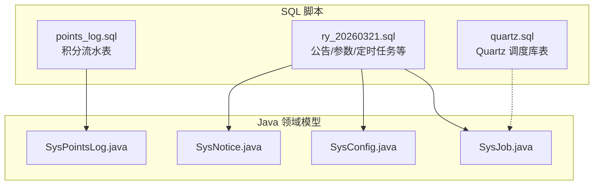
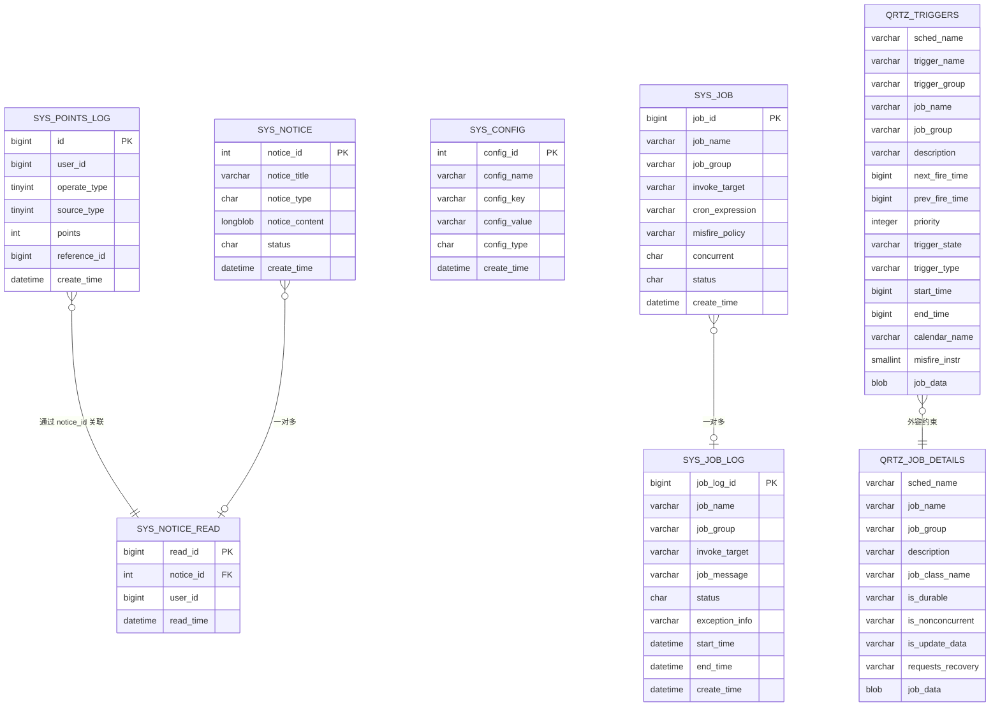
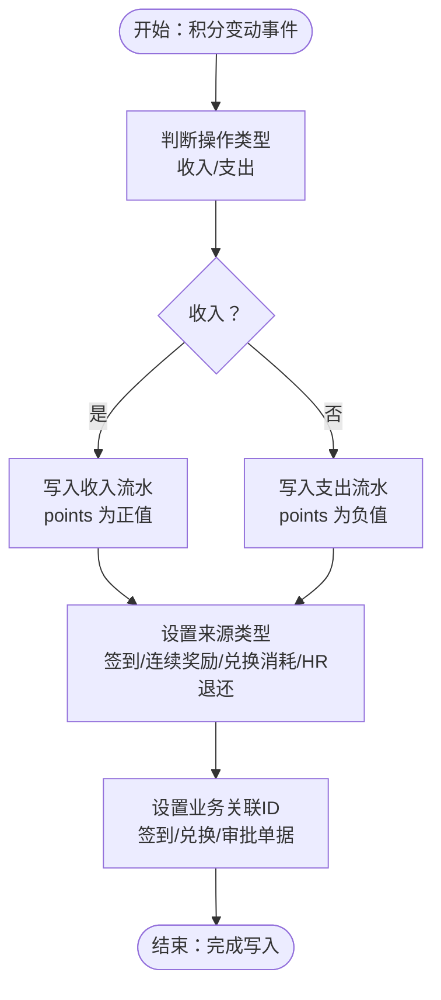
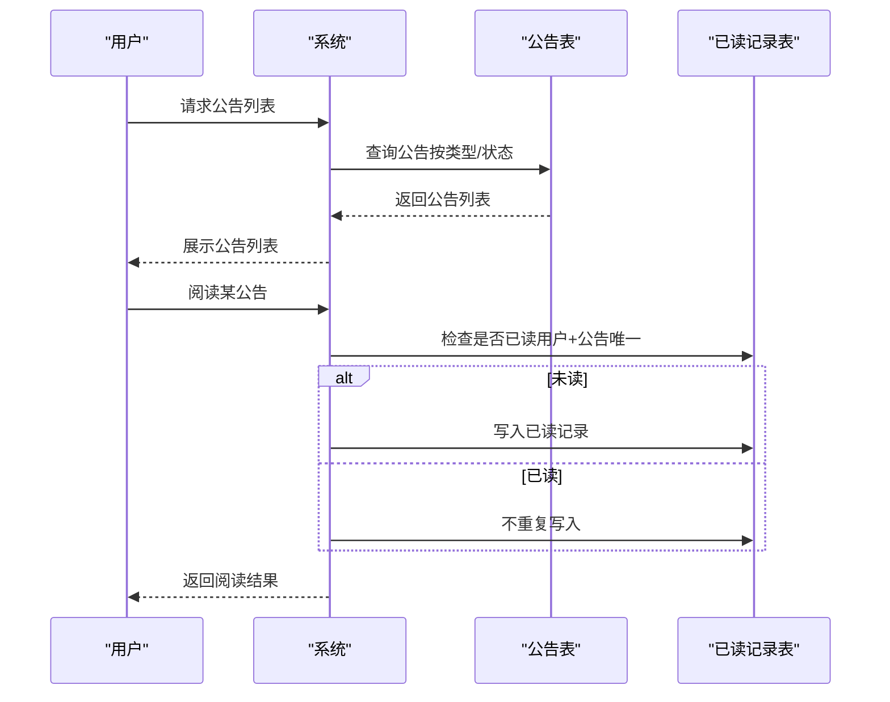
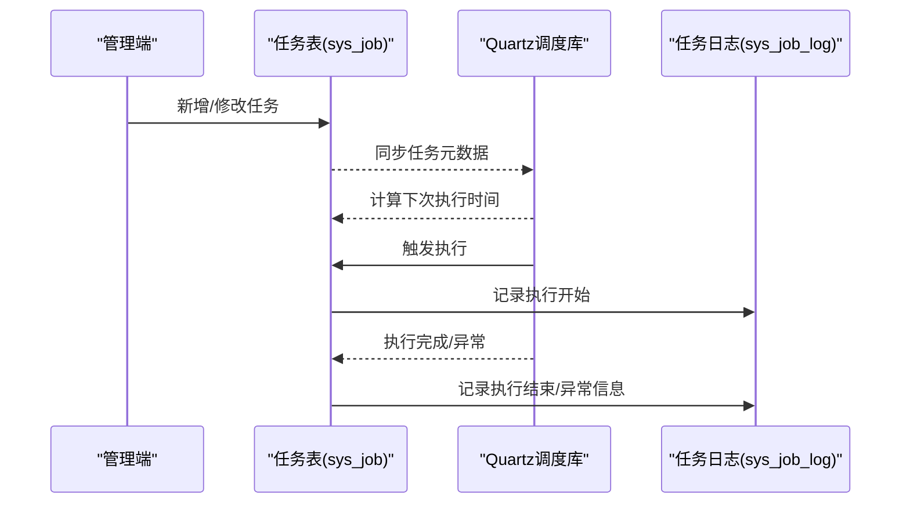
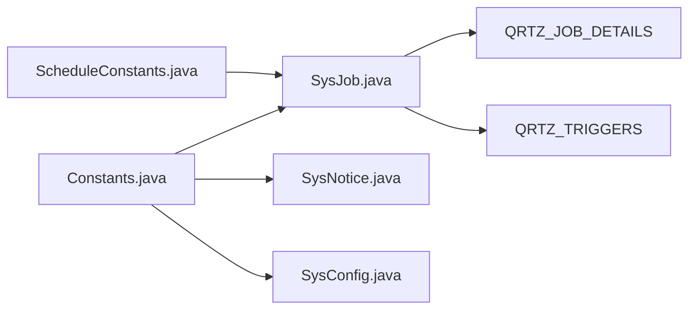

# 业务表设计

<cite>
**本文引用的文件**
- [points_log.sql](file://XingChen-Vue/sql/points_log.sql)
- [quartz.sql](file://XingChen-Vue/sql/quartz.sql)
- [ry_20260321.sql](file://XingChen-Vue/sql/ry_20260321.sql)
- [SysPointsLog.java](file://XingChen-Vue/xingchen-system/src/main/java/com/xingchen/system/domain/SysPointsLog.java)
- [SysNotice.java](file://XingChen-Vue/xingchen-system/src/main/java/com/xingchen/system/domain/SysNotice.java)
- [SysConfig.java](file://XingChen-Vue/xingchen-system/src/main/java/com/xingchen/system/domain/SysConfig.java)
- [SysJob.java](file://XingChen-Vue/xingchen-quartz/src/main/java/com/xingchen/quartz/domain/SysJob.java)
- [ScheduleConstants.java](file://XingChen-Vue/xingchen-common/src/main/java/com/xingchen/common/constant/ScheduleConstants.java)
- [Constants.java](file://XingChen-Vue/xingchen-common/src/main/java/com/xingchen/common/constant/Constants.java)
</cite>

## 目录
1. [引言](#引言)
2. [项目结构](#项目结构)
3. [核心组件](#核心组件)
4. [架构总览](#架构总览)
5. [详细组件分析](#详细组件分析)
6. [依赖分析](#依赖分析)
7. [性能考量](#性能考量)
8. [故障排查指南](#故障排查指南)
9. [结论](#结论)
10. [附录](#附录)

## 引言
本文件聚焦于健康管理系统中的核心业务表设计，围绕以下主题展开：
- 健康积分系统：points_log 积分流水表，记录员工积分的收入与支出、来源场景、业务关联等关键信息。
- 通知公告体系：sys_notice 公告表与 sys_notice_read 已读记录表，支撑公告的发布、状态管理与阅读追踪。
- 参数配置体系：sys_config 参数配置表，支持系统运行期的动态配置与内置配置标识。
- 定时任务体系：sys_job 任务表与 Quartz 调度库表群，支撑任务的定义、调度、并发控制与日志记录。

通过对表结构、字段设计原则、数据类型选择、业务规则约束、扩展性考虑、表间关联关系、数据完整性保障与业务流程支撑进行系统化梳理，并辅以可视化图表与典型场景的操作示例，帮助读者快速理解并高效落地。

## 项目结构
本项目的业务表主要分布在 SQL 初始化脚本与后端领域模型中：
- SQL 脚本集中于 XingChen-Vue/sql 目录，包含积分、公告、参数、定时任务等核心表的建表与初始化数据。
- Java 领域模型位于 xingchen-system 与 xingchen-quartz 模块的 domain 包中，对应各业务表的实体类，承载字段映射与校验逻辑。

**图表来源**
- [points_log.sql:1-18](file://XingChen-Vue/sql/points_log.sql#L1-L18)
- [quartz.sql:1-174](file://XingChen-Vue/sql/quartz.sql#L1-L174)
- [ry_20260321.sql:531-661](file://XingChen-Vue/sql/ry_20260321.sql#L531-L661)
- [SysPointsLog.java:1-105](file://XingChen-Vue/xingchen-system/src/main/java/com/xingchen/system/domain/SysPointsLog.java#L1-L105)
- [SysNotice.java:1-118](file://XingChen-Vue/xingchen-system/src/main/java/com/xingchen/system/domain/SysNotice.java#L1-L118)
- [SysConfig.java:1-112](file://XingChen-Vue/xingchen-system/src/main/java/com/xingchen/system/domain/SysConfig.java#L1-L112)
- [SysJob.java:1-172](file://XingChen-Vue/xingchen-quartz/src/main/java/com/xingchen/quartz/domain/SysJob.java#L1-L172)

**章节来源**
- [points_log.sql:1-18](file://XingChen-Vue/sql/points_log.sql#L1-L18)
- [quartz.sql:1-174](file://XingChen-Vue/sql/quartz.sql#L1-L174)
- [ry_20260321.sql:531-661](file://XingChen-Vue/sql/ry_20260321.sql#L531-L661)

## 核心组件
本节对四大业务表进行概览式说明，涵盖字段设计原则、数据类型选择、业务规则约束与扩展性考虑。

- 积分流水表（points_log）
  - 设计原则：以“流水”为核心，记录每次积分变动的全量上下文；通过用户维度建立索引，便于按人查询与汇总。
  - 数据类型：主键采用大整型自增，用户ID与业务关联ID采用大整型，操作类型与来源类型采用小整型，分值采用整型，时间戳采用日期时间。
  - 业务规则：操作类型区分收入/支出；来源类型覆盖日常签到、连续奖励、兑换消耗、HR退还等场景；提供业务关联ID便于溯源。
  - 扩展性：预留 remark 备注字段；索引覆盖用户ID与业务关联ID，满足常见查询与审计需求。

- 通知公告表（sys_notice）
  - 设计原则：标题、类型、状态、内容四要素完整；内容采用长文本或二进制字段以支持富文本与附件。
  - 数据类型：主键采用整型自增；类型采用定长字符；状态采用定长字符；内容采用长二进制或长文本；时间戳采用日期时间。
  - 业务规则：类型区分“通知/公告”；状态区分“正常/关闭”；提供已读标记字段供前端展示。
  - 扩展性：通过字典类型 sys_notice_type/sys_notice_status 提供标准化枚举；支持多租户/部门可见性扩展。

- 参数配置表（sys_config）
  - 设计原则：键值对配置，支持系统内置与业务自定义两类；提供名称、键名、键值、类型与备注。
  - 数据类型：主键采用整型自增；名称与键名采用短文本；键值采用长文本；类型采用定长字符；时间戳采用日期时间。
  - 业务规则：内置配置以 Y/N 标识；键名唯一性建议由应用层保证；支持热更新与缓存。
  - 扩展性：通过字典类型 sys_config_type 提供标准化枚举；支持加密存储敏感配置。

- 定时任务表（sys_job）
  - 设计原则：任务名称、分组、调用目标、Cron 表达式、容错策略、并发控制、状态与备注构成完整任务元数据。
  - 数据类型：任务ID采用大整型自增；名称与分组采用短文本；调用目标采用长文本；表达式采用短文本；状态采用定长字符；时间戳采用日期时间。
  - 业务规则：并发控制支持允许/禁止；容错策略支持立即执行、执行一次、放弃执行；状态支持正常/暂停。
  - 扩展性：结合 Quartz 调度库表实现复杂调度；支持任务日志表扩展与失败重试策略。

**章节来源**
- [points_log.sql:5-17](file://XingChen-Vue/sql/points_log.sql#L5-L17)
- [ry_20260321.sql:624-647](file://XingChen-Vue/sql/ry_20260321.sql#L624-L647)
- [ry_20260321.sql:531-556](file://XingChen-Vue/sql/ry_20260321.sql#L531-L556)
- [ry_20260321.sql:579-621](file://XingChen-Vue/sql/ry_20260321.sql#L579-L621)
- [quartz.sql:16-52](file://XingChen-Vue/sql/quartz.sql#L16-L52)

## 架构总览
下图展示了业务表之间的关系与支撑关系，突出积分流水与公告已读的关联、参数配置与定时任务的支撑作用，以及 Quartz 调度库与任务表的协作。

**图表来源**
- [points_log.sql:5-17](file://XingChen-Vue/sql/points_log.sql#L5-L17)
- [ry_20260321.sql:624-661](file://XingChen-Vue/sql/ry_20260321.sql#L624-L661)
- [ry_20260321.sql:579-621](file://XingChen-Vue/sql/ry_20260321.sql#L579-L621)
- [quartz.sql:16-52](file://XingChen-Vue/sql/quartz.sql#L16-L52)

## 详细组件分析

### 积分流水表（points_log）
- 字段设计与类型
  - id：主键，自增，便于快速定位与审计。
  - user_id：用户标识，建立索引以支持按人查询与统计。
  - operate_type：操作类型（收入/支出），小整型，配合字典类型扩展。
  - source_type：来源类型（签到/连续奖励/兑换消耗/HR退还等），小整型，便于分类统计。
  - points：分值绝对值，整型，避免浮点误差。
  - reference_id：业务关联ID，便于与签到、兑换等业务单据关联。
  - create_time：记录发生时间，用于排序与报表统计。
- 业务规则与约束
  - operate_type 与 source_type 建议通过字典类型统一管理，确保业务含义一致。
  - 建议在业务层校验 points 的正数性与上限/下限。
  - reference_id 可为空，但一旦非空应具备唯一性与可追溯性。
- 扩展性考虑
  - 可增加维度字段（如部门、岗位）以支持更细粒度统计。
  - 可引入归档策略，对历史流水进行冷热分离。
- 典型业务场景
  - 用户完成每日签到后，产生一条收入流水；reference_id 指向签到记录。
  - 用户兑换商品消耗积分时，产生一条支出流水；reference_id 指向兑换订单。
  - HR 手动退还积分时，产生一条收入流水；reference_id 可指向审批单据。

**图表来源**
- [points_log.sql:5-17](file://XingChen-Vue/sql/points_log.sql#L5-L17)

**章节来源**
- [points_log.sql:5-17](file://XingChen-Vue/sql/points_log.sql#L5-L17)
- [SysPointsLog.java:11-91](file://XingChen-Vue/xingchen-system/src/main/java/com/xingchen/system/domain/SysPointsLog.java#L11-L91)

### 通知公告表（sys_notice）与已读记录（sys_notice_read）
- 字段设计与类型
  - notice_id：公告主键，自增。
  - notice_title：标题，限制长度，防止过长影响展示。
  - notice_type：类型（通知/公告），配合字典类型统一管理。
  - notice_content：内容，采用长二进制或长文本，支持富文本与附件。
  - status：状态（正常/关闭），控制公告生效范围。
  - isRead：前端展示标记，非持久化字段，用于接口响应。
- 业务规则与约束
  - notice_type 与 status 建议通过字典类型 sys_notice_type/sys_notice_status 管理。
  - 内容字段需进行 XSS 过滤与长度校验。
  - 已读记录表通过唯一索引保证“同一用户同一公告仅记录一次”。
- 扩展性考虑
  - 可增加可见范围字段（部门/角色/全局）以支持定向发布。
  - 可引入公告模板与批量发布能力。
- 典型业务场景
  - 新增公告：设置标题、类型、内容、状态，发布后推送给相关用户。
  - 用户阅读公告：首次阅读写入已读记录，后续不再重复记录。
  - 查询公告列表：按类型与状态过滤，支持分页与排序。

**图表来源**
- [ry_20260321.sql:624-661](file://XingChen-Vue/sql/ry_20260321.sql#L624-L661)

**章节来源**
- [ry_20260321.sql:624-661](file://XingChen-Vue/sql/ry_20260321.sql#L624-L661)
- [SysNotice.java:16-100](file://XingChen-Vue/xingchen-system/src/main/java/com/xingchen/system/domain/SysNotice.java#L16-L100)

### 参数配置表（sys_config）
- 字段设计与类型
  - config_id：主键，自增。
  - config_name：参数名称，用于展示与检索。
  - config_key：参数键名，建议唯一，用于程序检索。
  - config_value：参数键值，支持字符串、布尔、数值等格式。
  - config_type：类型（系统内置/业务自定义），便于权限与可见性控制。
- 业务规则与约束
  - config_type 建议通过字典类型 sys_config_type 管理。
  - 键名与键值长度有限制，防止异常输入。
  - 内置配置建议不可被业务端随意修改，需通过管理端操作。
- 扩展性考虑
  - 可引入加密存储敏感配置。
  - 可增加命名空间/分组字段以支持模块化配置。
- 典型业务场景
  - 系统启动时加载内置配置到缓存。
  - 管理端修改配置后，触发缓存刷新或广播通知。

**章节来源**
- [ry_20260321.sql:531-556](file://XingChen-Vue/sql/ry_20260321.sql#L531-L556)
- [SysConfig.java:16-94](file://XingChen-Vue/xingchen-system/src/main/java/com/xingchen/system/domain/SysConfig.java#L16-L94)

### 定时任务表（sys_job）与 Quartz 调度库
- 字段设计与类型
  - job_id：任务主键，自增。
  - job_name/job_group：任务名称与分组，唯一组合键。
  - invoke_target：调用目标字符串，指向具体任务类与方法。
  - cron_expression：Cron 表达式，定义执行节奏。
  - misfire_policy：错失执行策略（立即/执行一次/放弃）。
  - concurrent：并发控制（允许/禁止）。
  - status：任务状态（正常/暂停）。
- 业务规则与约束
  - cron_expression 必须合法，可通过工具类校验。
  - misfire_policy 与 concurrent 需与业务场景匹配。
  - 任务状态变更需记录日志与审计。
- Quartz 协作关系
  - sys_job 与 Quartz 的 QRTZ_JOB_DETAILS/QRTZ_TRIGGERS 通过名称与分组建立外键约束，实现任务元数据与调度引擎的衔接。
- 扩展性考虑
  - 支持任务日志表（sys_job_log）记录每次执行的开始/结束时间、状态与异常信息。
  - 可引入任务分片、失败重试与熔断策略。
- 典型业务场景
  - 新增任务：配置名称、分组、调用目标、Cron 表达式与策略，保存后进入调度队列。
  - 修改任务：调整 Cron 或并发策略，重新计算下次执行时间。
  - 查看任务日志：定位失败原因并进行修复。

**图表来源**
- [ry_20260321.sql:579-621](file://XingChen-Vue/sql/ry_20260321.sql#L579-L621)
- [quartz.sql:16-52](file://XingChen-Vue/sql/quartz.sql#L16-L52)
- [SysJob.java:21-151](file://XingChen-Vue/xingchen-quartz/src/main/java/com/xingchen/quartz/domain/SysJob.java#L21-L151)

**章节来源**
- [ry_20260321.sql:579-621](file://XingChen-Vue/sql/ry_20260321.sql#L579-L621)
- [quartz.sql:16-52](file://XingChen-Vue/sql/quartz.sql#L16-L52)
- [SysJob.java:21-151](file://XingChen-Vue/xingchen-quartz/src/main/java/com/xingchen/quartz/domain/SysJob.java#L21-L151)

## 依赖分析
- 字段与枚举依赖
  - 业务类型（通知/公告）、状态（正常/关闭）、操作类型（收入/支出）等均通过字典类型与常量类进行标准化，避免硬编码。
- 任务调度依赖
  - sys_job 与 Quartz 表通过名称与分组建立外键约束，确保任务元数据与调度引擎一致性。
- 前端展示依赖
  - 公告实体提供 isRead 标记，便于前端区分已读/未读状态。

**图表来源**
- [ScheduleConstants.java](file://XingChen-Vue/xingchen-common/src/main/java/com/xingchen/common/constant/ScheduleConstants.java)
- [Constants.java:164-172](file://XingChen-Vue/xingchen-common/src/main/java/com/xingchen/common/constant/Constants.java#L164-L172)
- [SysJob.java:11-14](file://XingChen-Vue/xingchen-quartz/src/main/java/com/xingchen/quartz/domain/SysJob.java#L11-L14)
- [SysNotice.java:7-9](file://XingChen-Vue/xingchen-system/src/main/java/com/xingchen/system/domain/SysNotice.java#L7-L9)
- [SysConfig.java:9-9](file://XingChen-Vue/xingchen-system/src/main/java/com/xingchen/system/domain/SysConfig.java#L9-L9)
- [quartz.sql:16-52](file://XingChen-Vue/sql/quartz.sql#L16-L52)

**章节来源**
- [ScheduleConstants.java](file://XingChen-Vue/xingchen-common/src/main/java/com/xingchen/common/constant/ScheduleConstants.java)
- [Constants.java:164-172](file://XingChen-Vue/xingchen-common/src/main/java/com/xingchen/common/constant/Constants.java#L164-L172)
- [SysJob.java:11-14](file://XingChen-Vue/xingchen-quartz/src/main/java/com/xingchen/quartz/domain/SysJob.java#L11-L14)
- [SysNotice.java:7-9](file://XingChen-Vue/xingchen-system/src/main/java/com/xingchen/system/domain/SysNotice.java#L7-L9)
- [SysConfig.java:9-9](file://XingChen-Vue/xingchen-system/src/main/java/com/xingchen/system/domain/SysConfig.java#L9-L9)
- [quartz.sql:16-52](file://XingChen-Vue/sql/quartz.sql#L16-L52)

## 性能考量
- 索引策略
  - 积分流水表对 user_id 与 reference_id 建立索引，满足按人查询与业务关联查询。
  - 公告表对状态与创建时间建立索引，支持公告列表与分页查询。
- 查询优化
  - 使用分页查询与条件过滤，避免全表扫描。
  - 对高频查询字段建立复合索引，减少回表次数。
- 缓存策略
  - 参数配置表可引入缓存，减少数据库访问压力。
  - 公告列表与字典类型可缓存，提升前端渲染性能。
- 归档与清理
  - 积分流水与任务日志建议定期归档与清理，控制表规模。

## 故障排查指南
- 定时任务无法执行
  - 检查 sys_job 的状态与 Cron 表达式是否正确。
  - 查看 Quartz 表状态与锁表，确认调度器实例正常。
  - 校验任务调用目标是否在白名单范围内。
- 公告无法展示
  - 检查 notice_type 与 status 是否符合预期。
  - 确认内容字段未被 XSS 过滤导致显示异常。
- 积分统计异常
  - 核对 operate_type 与 source_type 的取值范围。
  - 检查 reference_id 是否正确关联业务单据。
- 参数配置不生效
  - 确认 config_type 与键名是否正确。
  - 检查缓存是否已刷新。

**章节来源**
- [SysJob.java:113-121](file://XingChen-Vue/xingchen-quartz/src/main/java/com/xingchen/quartz/domain/SysJob.java#L113-L121)
- [Constants.java:164-172](file://XingChen-Vue/xingchen-common/src/main/java/com/xingchen/common/constant/Constants.java#L164-L172)
- [SysNotice.java:54-57](file://XingChen-Vue/xingchen-system/src/main/java/com/xingchen/system/domain/SysNotice.java#L54-L57)
- [SysPointsLog.java:22-28](file://XingChen-Vue/xingchen-system/src/main/java/com/xingchen/system/domain/SysPointsLog.java#L22-L28)

## 结论
本文件从表结构设计、字段与数据类型选择、业务规则约束、扩展性考虑、表间关联关系与数据完整性保障等方面，系统梳理了健康积分、通知公告、参数配置与定时任务等核心业务表。通过与领域模型与调度库的协同，形成完整的业务闭环。建议在实际落地过程中，结合字典类型与常量类统一业务语义，完善索引与缓存策略，并建立完善的日志与审计机制，以确保系统的稳定性与可维护性。

## 附录
- 字段与类型对照（摘要）
  - 积分流水表：主键、用户ID、操作类型、来源类型、分值、业务关联ID、创建时间。
  - 公告表：主键、标题、类型、内容、状态、创建时间。
  - 已读记录表：主键、公告ID、用户ID、阅读时间。
  - 参数配置表：主键、名称、键名、键值、类型、创建时间。
  - 任务表：主键、名称、分组、调用目标、Cron 表达式、容错策略、并发控制、状态、创建时间。
  - 任务日志表：主键、任务名称、分组、调用目标、日志信息、状态、异常信息、开始/结束时间、创建时间。
  - Quartz 表：任务详情与触发器表，通过名称与分组建立外键约束。