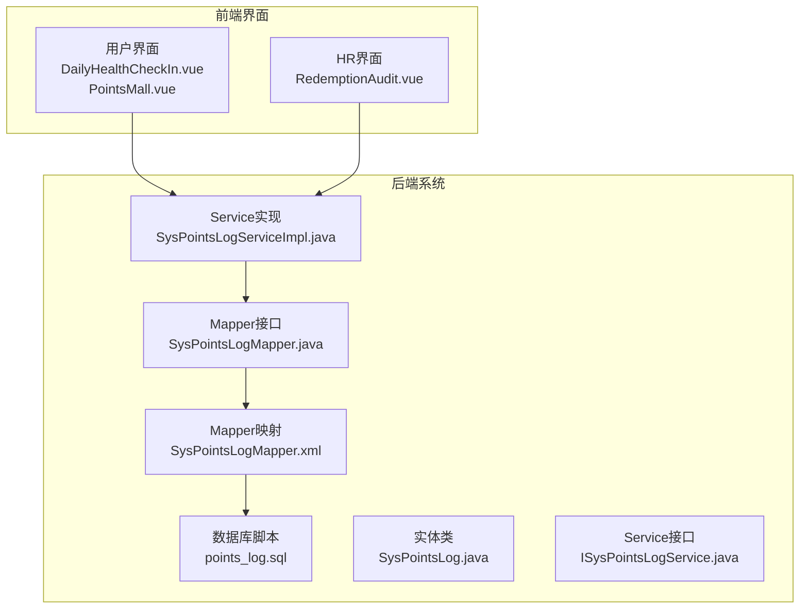
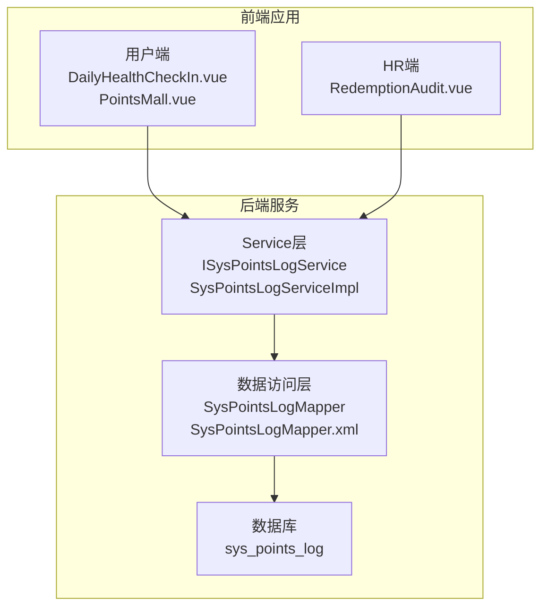
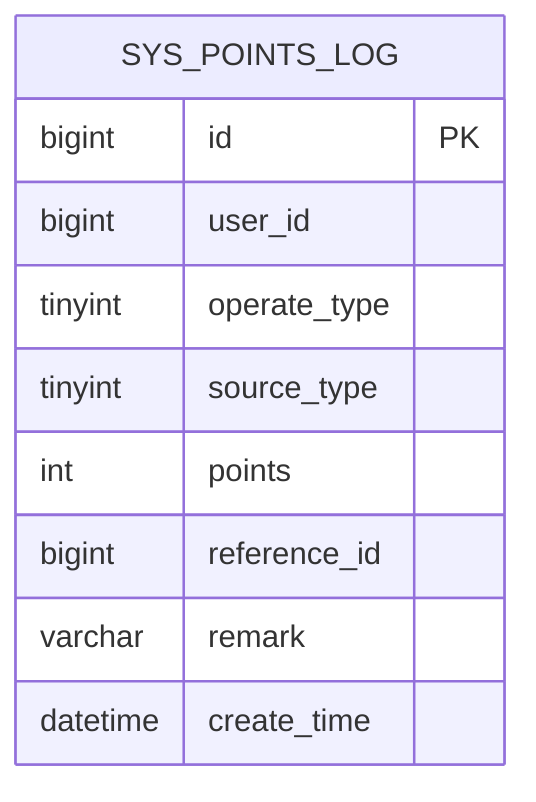
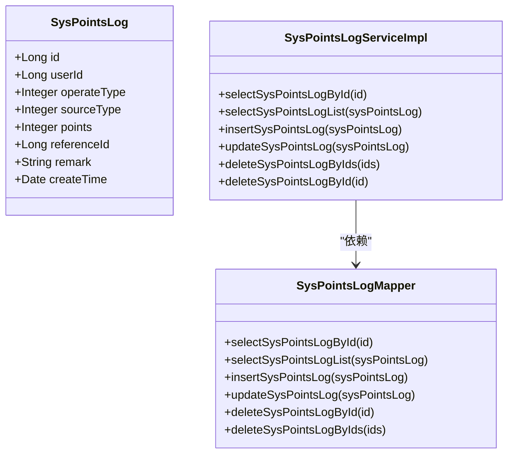
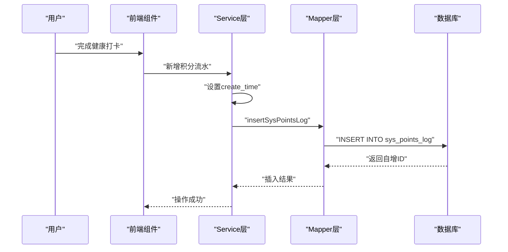
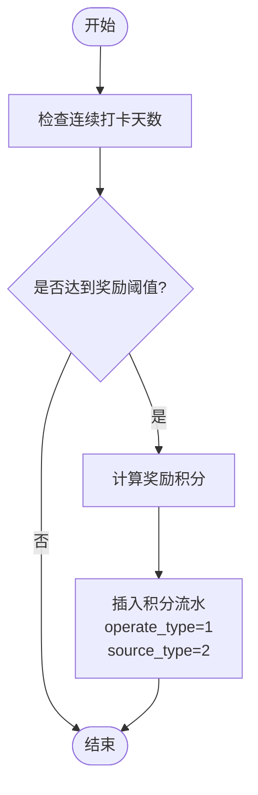
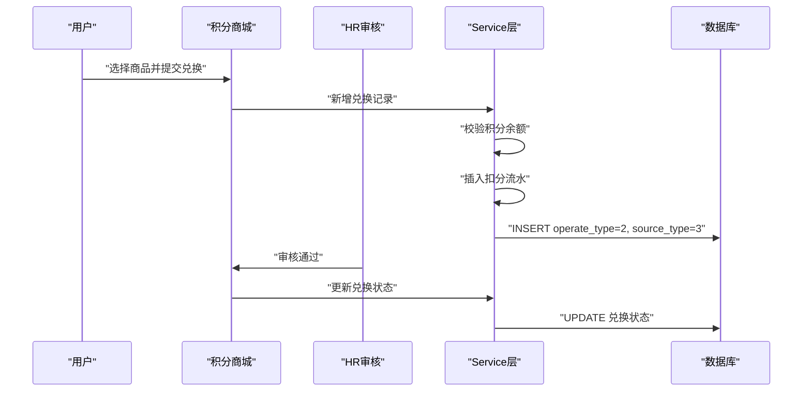
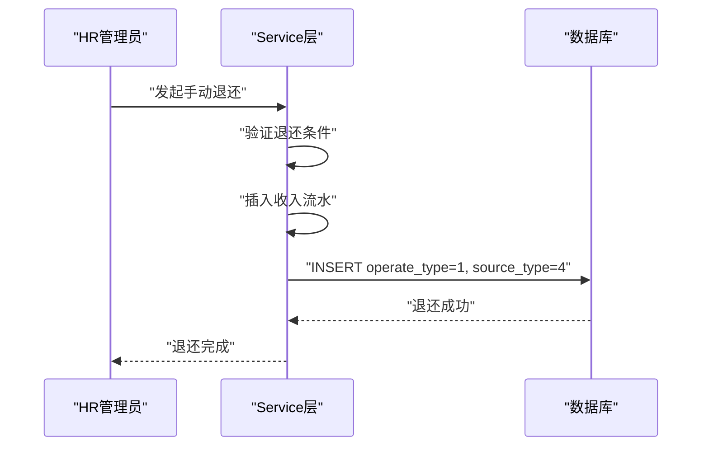
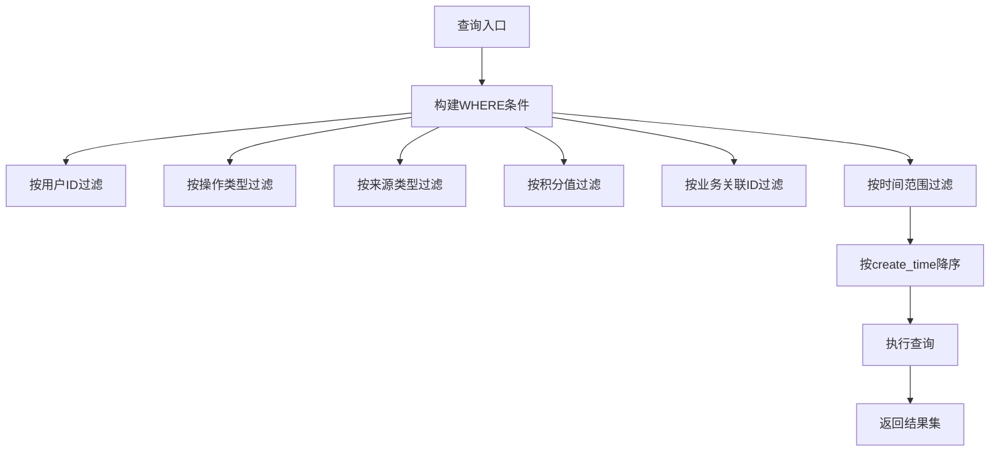
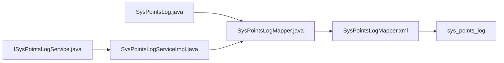

# 健康积分表设计

<cite>
**本文档引用的文件**
- [points_log.sql](file://XingChen-Vue/sql/points_log.sql)
- [SysPointsLog.java](file://XingChen-Vue/xingchen-system/src/main/java/com/xingchen/system/domain/SysPointsLog.java)
- [SysPointsLogMapper.java](file://XingChen-Vue/xingchen-system/src/main/java/com/xingchen/system/mapper/SysPointsLogMapper.java)
- [SysPointsLogMapper.xml](file://XingChen-Vue/xingchen-system/src/main/resources/mapper/system/SysPointsLogMapper.xml)
- [SysPointsLogServiceImpl.java](file://XingChen-Vue/xingchen-system/src/main/java/com/xingchen/system/service/impl/SysPointsLogServiceImpl.java)
- [ISysPointsLogService.java](file://XingChen-Vue/xingchen-system/src/main/java/com/xingchen/system/service/ISysPointsLogService.java)
- [PointsMall.vue](file://XingChen-Vue/xingchen-ui-user/src/views/PointsMall.vue)
- [DailyHealthCheckIn.vue](file://XingChen-Vue/xingchen-ui-user/src/components/DailyHealthCheckIn.vue)
- [RedemptionAudit.vue](file://XingChen-Vue3/src/views/hr/RedemptionAudit.vue)
</cite>

## 目录
1. [简介](#简介)
2. [项目结构](#项目结构)
3. [核心组件](#核心组件)
4. [架构总览](#架构总览)
5. [详细组件分析](#详细组件分析)
6. [依赖关系分析](#依赖关系分析)
7. [性能考虑](#性能考虑)
8. [故障排除指南](#故障排除指南)
9. [结论](#结论)

## 简介
本文件详细阐述健康管理系统中sys_points_log积分流水表的设计理念与实现细节。该表用于记录所有与积分相关的业务变动，包括每日打卡、连续打卡奖励、商品兑换扣分以及HR手动退还积分等场景。通过对字段设计、索引策略、业务流程和查询优化的全面分析，帮助开发者和运维人员更好地理解和维护积分体系。

## 项目结构
健康积分相关代码分布在后端系统模块与前端界面中：
- 后端：数据库脚本定义表结构；Java实体类、Mapper接口与XML映射文件负责数据访问；Service层封装业务逻辑
- 前端：用户端提供打卡与积分商城功能；HR端提供兑换审核功能

**图表来源**
- [points_log.sql:1-18](file://XingChen-Vue/sql/points_log.sql#L1-L18)
- [SysPointsLog.java:1-105](file://XingChen-Vue/xingchen-system/src/main/java/com/xingchen/system/domain/SysPointsLog.java#L1-L105)
- [SysPointsLogMapper.java:1-61](file://XingChen-Vue/xingchen-system/src/main/java/com/xingchen/system/mapper/SysPointsLogMapper.java#L1-L61)
- [SysPointsLogMapper.xml:1-92](file://XingChen-Vue/xingchen-system/src/main/resources/mapper/system/SysPointsLogMapper.xml#L1-L92)
- [SysPointsLogServiceImpl.java:1-94](file://XingChen-Vue/xingchen-system/src/main/java/com/xingchen/system/service/impl/SysPointsLogServiceImpl.java#L1-L94)
- [ISysPointsLogService.java:1-61](file://XingChen-Vue/xingchen-system/src/main/java/com/xingchen/system/service/ISysPointsLogService.java#L1-L61)
- [DailyHealthCheckIn.vue:1-42](file://XingChen-Vue/xingchen-ui-user/src/components/DailyHealthCheckIn.vue#L1-L42)
- [PointsMall.vue:138-165](file://XingChen-Vue/xingchen-ui-user/src/views/PointsMall.vue#L138-L165)
- [RedemptionAudit.vue:1-250](file://XingChen-Vue3/src/views/hr/RedemptionAudit.vue#L1-L250)

**章节来源**
- [points_log.sql:1-18](file://XingChen-Vue/sql/points_log.sql#L1-L18)
- [SysPointsLog.java:1-105](file://XingChen-Vue/xingchen-system/src/main/java/com/xingchen/system/domain/SysPointsLog.java#L1-L105)
- [SysPointsLogMapper.java:1-61](file://XingChen-Vue/xingchen-system/src/main/java/com/xingchen/system/mapper/SysPointsLogMapper.java#L1-L61)
- [SysPointsLogMapper.xml:1-92](file://XingChen-Vue/xingchen-system/src/main/resources/mapper/system/SysPointsLogMapper.xml#L1-L92)
- [SysPointsLogServiceImpl.java:1-94](file://XingChen-Vue/xingchen-system/src/main/java/com/xingchen/system/service/impl/SysPointsLogServiceImpl.java#L1-L94)
- [ISysPointsLogService.java:1-61](file://XingChen-Vue/xingchen-system/src/main/java/com/xingchen/system/service/ISysPointsLogService.java#L1-L61)

## 核心组件
本节从数据模型角度解析sys_points_log表的字段设计，包括每个字段的业务含义、数据类型选择、取值范围限制及设计考量。

- 主键id
  - 数据类型：bigint(20)，自增
  - 设计考量：作为流水唯一标识，支持大范围业务增长；自增保证顺序性，便于按时间排序
  - 业务含义：每条积分变动记录的唯一编号
  - 取值范围：正整数序列，受数据库自增约束

- 用户标识user_id
  - 数据类型：bigint(20)，NOT NULL
  - 设计考量：采用大整型存储用户ID，兼容分布式环境下的用户标识
  - 业务含义：发生积分变动的员工ID
  - 取值范围：正整数，需与用户表关联

- 操作类型operate_type
  - 数据类型：tinyint(4)，NOT NULL
  - 设计考量：使用枚举型数值存储收入/支出两类操作，节省空间且便于查询过滤
  - 业务含义：1=收入（加分），2=支出（扣分）
  - 取值范围：仅允许1或2

- 来源类型source_type
  - 数据类型：tinyint(4)，NOT NULL
  - 设计考量：固定枚举值，便于统计分析不同场景的积分变动分布
  - 业务含义：1=每日打卡，2=连续打卡奖励，3=兑换商品消耗，4=HR手动退还积分
  - 取值范围：1-4

- 积分数值points
  - 数据类型：int(11)，NOT NULL
  - 设计考量：积分变动通常为较小数值，int足以覆盖常见范围；绝对值存储便于统一计算
  - 业务含义：本次波动的分值（绝对值）
  - 取值范围：非负整数，具体上限取决于业务规则

- 关联业务reference_id
  - 数据类型：bigint(20)，可空
  - 设计考量：存储业务关联ID（如打卡记录ID、兑换订单ID），便于审计追踪
  - 业务含义：业务关联ID（如打卡记录ID、兑换订单ID）
  - 取值范围：正整数或空值

- 备注remark
  - 数据类型：varchar(255)，可空
  - 设计考量：提供灵活的说明字段，支持业务扩展
  - 业务含义：波动说明
  - 取值范围：字符串，长度不超过255字符

- 时间戳create_time
  - 数据类型：datetime，默认当前时间
  - 设计考量：自动记录发生时间，确保审计完整性
  - 业务含义：发生时间
  - 取值范围：标准日期时间格式

**章节来源**
- [points_log.sql:5-17](file://XingChen-Vue/sql/points_log.sql#L5-L17)
- [SysPointsLog.java:15-36](file://XingChen-Vue/xingchen-system/src/main/java/com/xingchen/system/domain/SysPointsLog.java#L15-L36)

## 架构总览
下图展示了积分流水表在系统中的位置与交互关系，包括数据流向、查询路径和业务边界。

**图表来源**
- [SysPointsLogServiceImpl.java:1-94](file://XingChen-Vue/xingchen-system/src/main/java/com/xingchen/system/service/impl/SysPointsLogServiceImpl.java#L1-L94)
- [SysPointsLogMapper.java:1-61](file://XingChen-Vue/xingchen-system/src/main/java/com/xingchen/system/mapper/SysPointsLogMapper.java#L1-L61)
- [SysPointsLogMapper.xml:1-92](file://XingChen-Vue/xingchen-system/src/main/resources/mapper/system/SysPointsLogMapper.xml#L1-L92)
- [points_log.sql:1-18](file://XingChen-Vue/sql/points_log.sql#L1-L18)

## 详细组件分析

### 表结构与字段设计
- 字段命名规范：采用下划线分隔，语义清晰
- 约束设置：主键、非空约束、默认值
- 索引策略：复合索引提升查询效率

**图表来源**
- [points_log.sql:5-17](file://XingChen-Vue/sql/points_log.sql#L5-L17)

**章节来源**
- [points_log.sql:5-17](file://XingChen-Vue/sql/points_log.sql#L5-L17)

### Java实体类与映射
- 实体类SysPointsLog封装表字段，提供getter/setter方法
- MyBatis映射文件定义结果映射与动态查询条件
- Service层统一处理时间戳设置与业务逻辑

**图表来源**
- [SysPointsLog.java:11-104](file://XingChen-Vue/xingchen-system/src/main/java/com/xingchen/system/domain/SysPointsLog.java#L11-L104)
- [SysPointsLogMapper.java:11-60](file://XingChen-Vue/xingchen-system/src/main/java/com/xingchen/system/mapper/SysPointsLogMapper.java#L11-L60)
- [SysPointsLogServiceImpl.java:17-94](file://XingChen-Vue/xingchen-system/src/main/java/com/xingchen/system/service/impl/SysPointsLogServiceImpl.java#L17-L94)

**章节来源**
- [SysPointsLog.java:1-105](file://XingChen-Vue/xingchen-system/src/main/java/com/xingchen/system/domain/SysPointsLog.java#L1-L105)
- [SysPointsLogMapper.xml:7-16](file://XingChen-Vue/xingchen-system/src/main/resources/mapper/system/SysPointsLogMapper.xml#L7-L16)
- [SysPointsLogServiceImpl.java:1-94](file://XingChen-Vue/xingchen-system/src/main/java/com/xingchen/system/service/impl/SysPointsLogServiceImpl.java#L1-L94)

### 典型业务场景与数据操作

#### 场景一：每日打卡加分
- 触发条件：用户完成当日健康打卡
- 操作类型：收入（operate_type=1）
- 来源类型：每日打卡（source_type=1）
- 积分值：固定分值或按规则计算
- 关联业务：打卡记录ID（reference_id）

**图表来源**
- [SysPointsLogServiceImpl.java:53-56](file://XingChen-Vue/xingchen-system/src/main/java/com/xingchen/system/service/impl/SysPointsLogServiceImpl.java#L53-L56)
- [SysPointsLogMapper.xml:45-65](file://XingChen-Vue/xingchen-system/src/main/resources/mapper/system/SysPointsLogMapper.xml#L45-L65)

**章节来源**
- [DailyHealthCheckIn.vue:1-42](file://XingChen-Vue/xingchen-ui-user/src/components/DailyHealthCheckIn.vue#L1-L42)
- [SysPointsLogServiceImpl.java:53-56](file://XingChen-Vue/xingchen-system/src/main/java/com/xingchen/system/service/impl/SysPointsLogServiceImpl.java#L53-L56)
- [SysPointsLogMapper.xml:45-65](file://XingChen-Vue/xingchen-system/src/main/resources/mapper/system/SysPointsLogMapper.xml#L45-L65)

#### 场景二：连续打卡奖励
- 触发条件：达到连续打卡天数阈值
- 操作类型：收入（operate_type=1）
- 来源类型：连续打卡奖励（source_type=2）
- 积分值：奖励分值
- 关联业务：连续打卡记录ID（reference_id）

**图表来源**
- [points_log.sql:8-9](file://XingChen-Vue/sql/points_log.sql#L8-L9)

**章节来源**
- [points_log.sql:8-9](file://XingChen-Vue/sql/points_log.sql#L8-L9)

#### 场景三：商品兑换扣分
- 触发条件：用户提交兑换申请并经HR审核通过
- 操作类型：支出（operate_type=2）
- 来源类型：兑换商品消耗（source_type=3）
- 积分值：商品所需积分
- 关联业务：兑换订单ID（reference_id）

**图表来源**
- [PointsMall.vue:138-165](file://XingChen-Vue/xingchen-ui-user/src/views/PointsMall.vue#L138-L165)
- [RedemptionAudit.vue:181-204](file://XingChen-Vue3/src/views/hr/RedemptionAudit.vue#L181-L204)
- [SysPointsLogServiceImpl.java:53-56](file://XingChen-Vue/xingchen-system/src/main/java/com/xingchen/system/service/impl/SysPointsLogServiceImpl.java#L53-L56)

**章节来源**
- [PointsMall.vue:138-165](file://XingChen-Vue/xingchen-ui-user/src/views/PointsMall.vue#L138-L165)
- [RedemptionAudit.vue:181-204](file://XingChen-Vue3/src/views/hr/RedemptionAudit.vue#L181-L204)
- [SysPointsLogServiceImpl.java:53-56](file://XingChen-Vue/xingchen-system/src/main/java/com/xingchen/system/service/impl/SysPointsLogServiceImpl.java#L53-L56)

#### 场景四：HR手动积分退还
- 触发条件：HR发现积分异常或特殊原因进行退还
- 操作类型：收入（operate_type=1）
- 来源类型：HR手动退还积分（source_type=4）
- 积分值：退还分值
- 关联业务：退还记录ID（reference_id）

**图表来源**
- [points_log.sql:8-9](file://XingChen-Vue/sql/points_log.sql#L8-L9)

**章节来源**
- [points_log.sql:8-9](file://XingChen-Vue/sql/points_log.sql#L8-L9)

### 查询与统计
- 支持按用户ID、操作类型、来源类型、积分值、业务关联ID、时间范围等多维条件查询
- 默认按时间倒序排列，便于查看最新记录
- MyBatis动态SQL支持灵活的查询组合

**图表来源**
- [SysPointsLogMapper.xml:22-38](file://XingChen-Vue/xingchen-system/src/main/resources/mapper/system/SysPointsLogMapper.xml#L22-L38)

**章节来源**
- [SysPointsLogMapper.xml:22-38](file://XingChen-Vue/xingchen-system/src/main/resources/mapper/system/SysPointsLogMapper.xml#L22-L38)

## 依赖关系分析
- 实体类与数据库表字段一一对应，确保ORM映射准确
- Mapper接口定义数据访问契约，XML文件实现具体SQL
- Service层封装业务逻辑，统一处理时间戳等通用操作
- 前端组件通过Service层间接访问数据库，遵循分层架构原则

**图表来源**
- [SysPointsLog.java:11-104](file://XingChen-Vue/xingchen-system/src/main/java/com/xingchen/system/domain/SysPointsLog.java#L11-L104)
- [SysPointsLogMapper.java:11-60](file://XingChen-Vue/xingchen-system/src/main/java/com/xingchen/system/mapper/SysPointsLogMapper.java#L11-L60)
- [SysPointsLogMapper.xml:7-16](file://XingChen-Vue/xingchen-system/src/main/resources/mapper/system/SysPointsLogMapper.xml#L7-L16)
- [SysPointsLogServiceImpl.java:17-94](file://XingChen-Vue/xingchen-system/src/main/java/com/xingchen/system/service/impl/SysPointsLogServiceImpl.java#L17-L94)
- [ISysPointsLogService.java:11-60](file://XingChen-Vue/xingchen-system/src/main/java/com/xingchen/system/service/ISysPointsLogService.java#L11-L60)

**章节来源**
- [SysPointsLog.java:1-105](file://XingChen-Vue/xingchen-system/src/main/java/com/xingchen/system/domain/SysPointsLog.java#L1-L105)
- [SysPointsLogMapper.java:1-61](file://XingChen-Vue/xingchen-system/src/main/java/com/xingchen/system/mapper/SysPointsLogMapper.java#L1-L61)
- [SysPointsLogMapper.xml:1-92](file://XingChen-Vue/xingchen-system/src/main/resources/mapper/system/SysPointsLogMapper.xml#L1-L92)
- [SysPointsLogServiceImpl.java:1-94](file://XingChen-Vue/xingchen-system/src/main/java/com/xingchen/system/service/impl/SysPointsLogServiceImpl.java#L1-L94)
- [ISysPointsLogService.java:1-61](file://XingChen-Vue/xingchen-system/src/main/java/com/xingchen/system/service/ISysPointsLogService.java#L1-L61)

## 性能考虑
- 索引设计
  - idx_user_id：针对用户维度查询优化，支持按用户ID快速检索
  - idx_reference_id：针对业务关联查询优化，支持按业务单据ID检索
- 查询优化
  - 使用动态SQL按需拼接查询条件，避免不必要的全表扫描
  - 默认按create_time降序，利用索引减少排序开销
- 数据类型选择
  - 采用合适的数据类型平衡存储空间与性能
  - 自增主键保证插入性能与顺序性

**章节来源**
- [points_log.sql:15-16](file://XingChen-Vue/sql/points_log.sql#L15-L16)
- [SysPointsLogMapper.xml:22-38](file://XingChen-Vue/xingchen-system/src/main/resources/mapper/system/SysPointsLogMapper.xml#L22-L38)

## 故障排除指南
- 插入失败
  - 检查必填字段是否为空（user_id、operate_type、source_type、points）
  - 验证数据类型与取值范围是否符合要求
- 查询异常
  - 确认查询条件是否正确设置
  - 检查时间范围参数格式
- 性能问题
  - 确认相关查询是否使用了合适的索引
  - 分析慢查询日志，优化复杂查询

**章节来源**
- [SysPointsLogMapper.xml:22-38](file://XingChen-Vue/xingchen-system/src/main/resources/mapper/system/SysPointsLogMapper.xml#L22-L38)
- [SysPointsLogServiceImpl.java:53-56](file://XingChen-Vue/xingchen-system/src/main/java/com/xingchen/system/service/impl/SysPointsLogServiceImpl.java#L53-L56)

## 结论
sys_points_log积分流水表通过合理的字段设计、索引策略和业务流程封装，为健康管理系统提供了可靠的积分管理能力。该设计既满足了日常运营需求，又具备良好的扩展性和维护性。建议在实际部署中结合业务规模持续监控查询性能，并根据使用情况适时调整索引策略和数据归档方案。